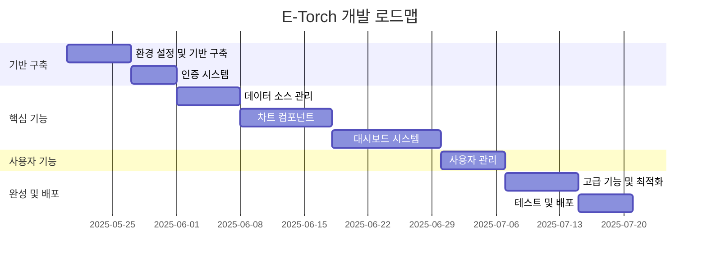
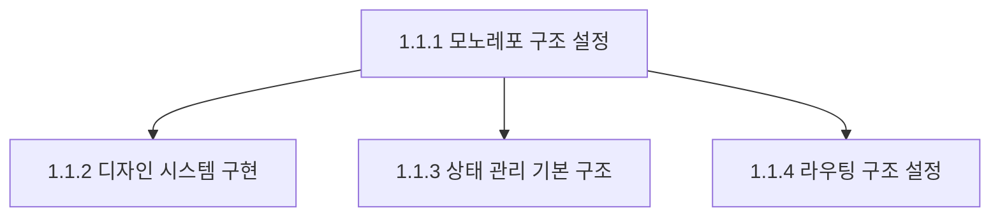
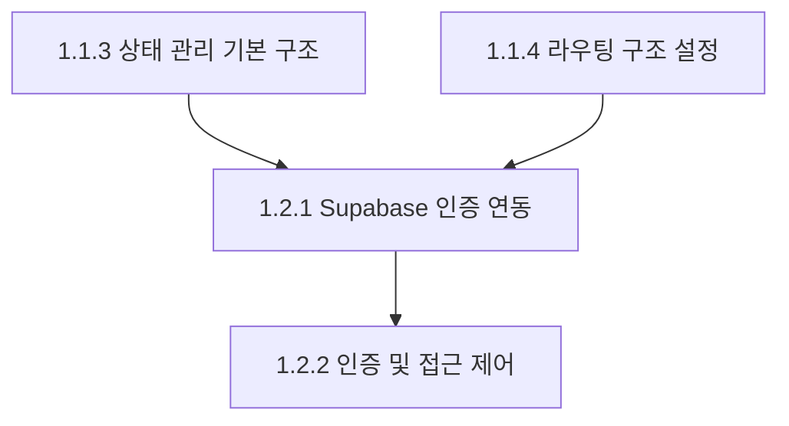
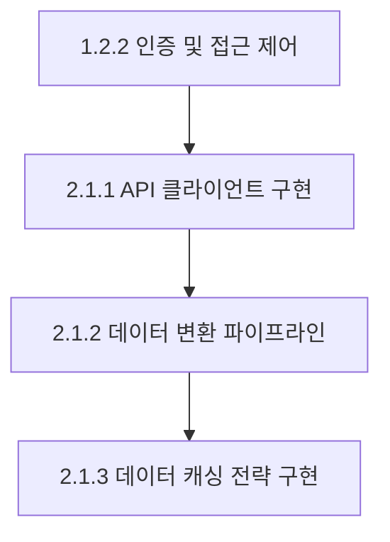
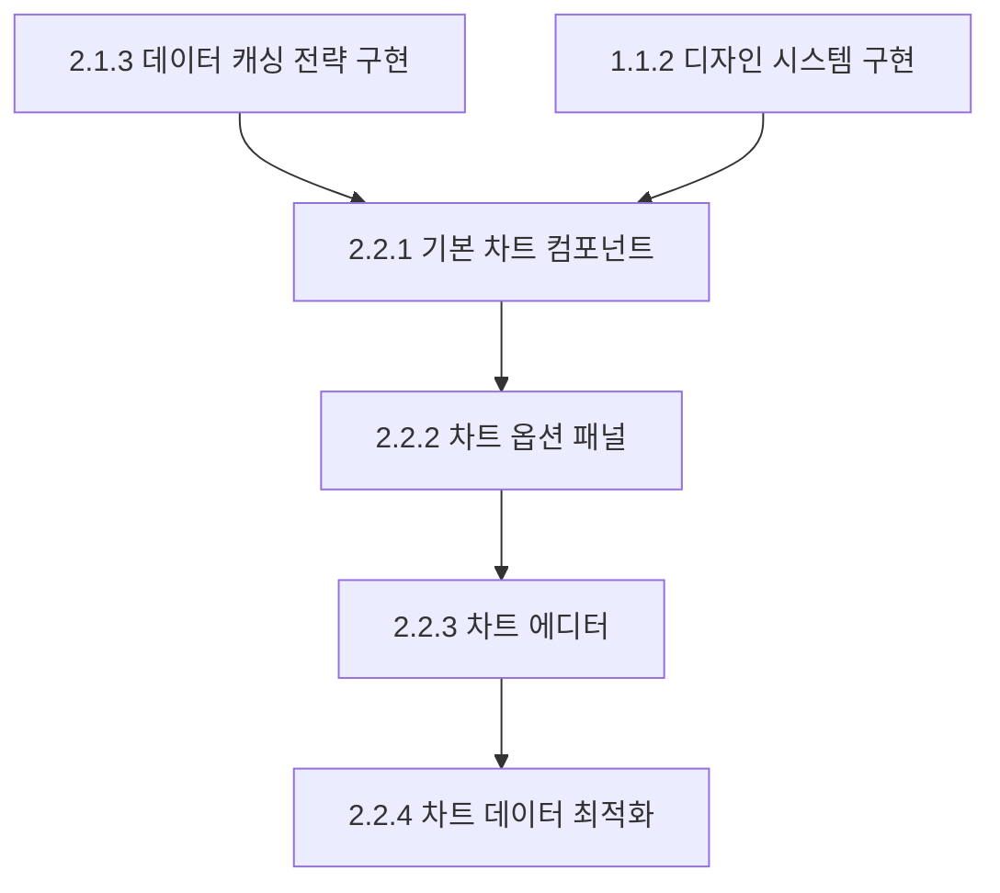
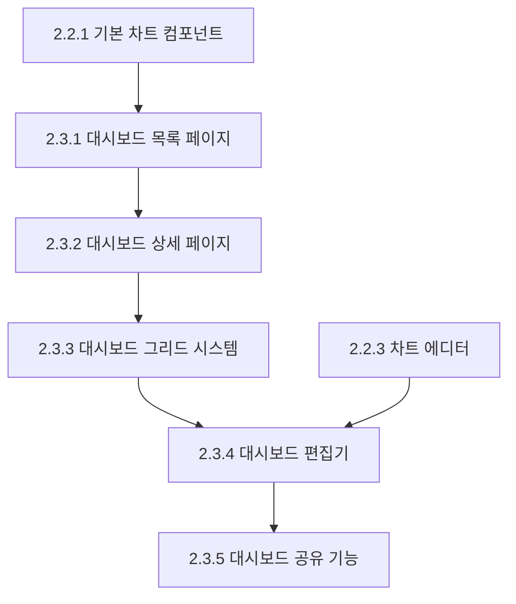
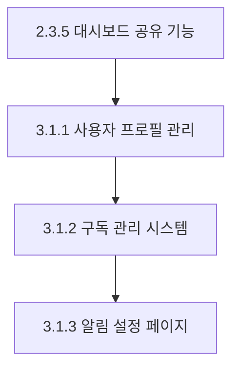
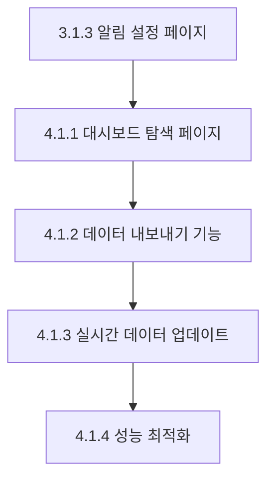
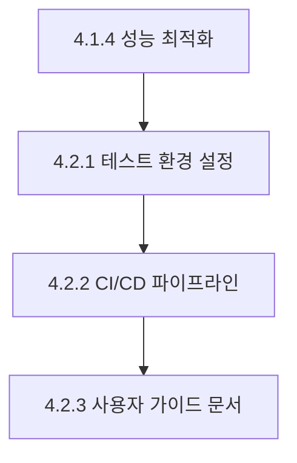
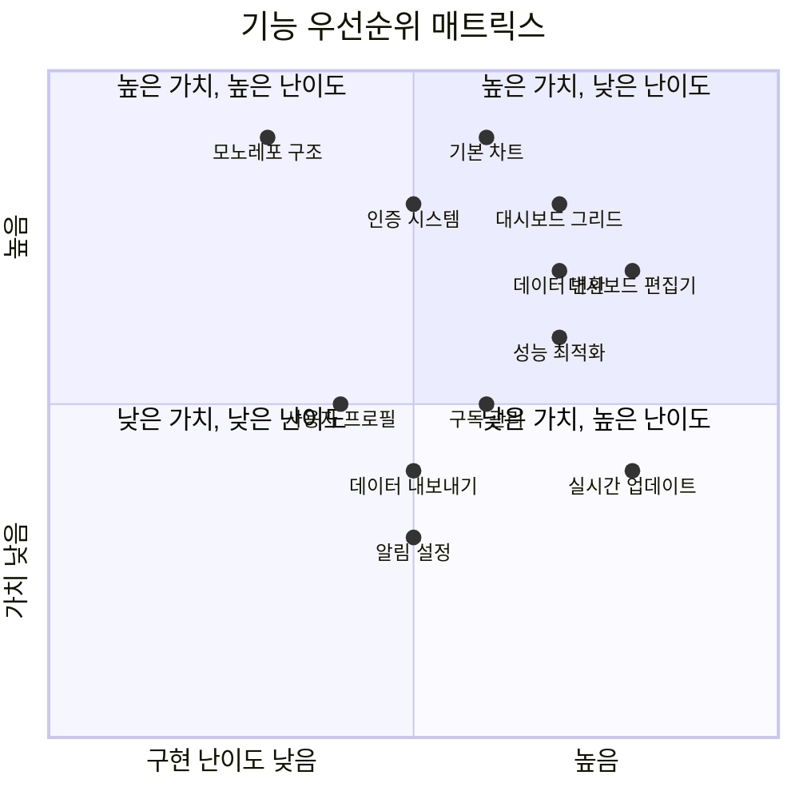

# E-Torch 구현 로드맵 및 체크리스트

## 1. 개요

이 문서는 E-Torch 경제지표 대시보드 서비스 구현을 위한 체계적인 계획과 체크리스트를 제공합니다. 개발 단계, 우선순위, 의존성을, 세부 체크리스트를 포함하여 명확히 구조화했습니다.

## 2. 개발 단계 개요

## 3. 세부 구현 로드맵 및 체크리스트

### 페이즈 1: 기반 구축 (12일)

#### 1.1 환경 설정 및 기반 구축 (7일)

| 작업 | 우선순위 | 종속성 | 예상 소요 시간 | 설명 |
|------|----------|-------|--------------|------|
| 1.1.1 모노레포 구조 설정 | 매우 높음 | 없음 | 2일 | Turborepo, pnpm 워크스페이스 설정, 패키지 구조 구성 |
| 1.1.2 디자인 시스템 구현 | 높음 | 1.1.1 | 2일 | Tailwind CSS 설정, 기본 UI 컴포넌트 구현 |
| 1.1.3 상태 관리 기본 구조 | 높음 | 1.1.1 | 2일 | Zustand, Tanstack Query 설정, 스토어 구조 설계 |
| 1.1.4 라우팅 구조 설정 | 높음 | 1.1.1 | 1일 | Next.js App Router 기반 라우팅 구조 설정 |

**체크리스트: 모노레포 구조 설정 (1.1.1)**
- [ ] pnpm 워크스페이스 설정 완료
- [ ] turbo.json 구성 완료
- [ ] 루트 package.json 설정 (공통 스크립트 포함)
- [ ] 패키지 구조 생성 (apps/web, packages/core 등)
- [ ] 각 패키지 기본 구조 설정 (package.json, tsconfig.json 등)
- [ ] 패키지 간 의존성 설정
- [ ] TypeScript 구성 (tsconfig.base.json)
- [ ] ESLint 및 Prettier 설정
- [ ] 개발 스크립트 테스트 (dev, build, lint)

**체크리스트: 디자인 시스템 구현 (1.1.2)**
- [ ] Tailwind CSS 설정 완료 (tailwind.config.js)
- [ ] 색상 체계 구현 (Primary, Secondary, Tertiary 등)
- [ ] 타이포그래피 설정 (Inter, JetBrains Mono)
- [ ] 기본 버튼 컴포넌트 구현 (변형, 크기 포함)
- [ ] 카드 컴포넌트 구현
- [ ] 폼 컴포넌트 구현 (Input, Checkbox, Toggle)
- [ ] 레이아웃 컴포넌트 (Container, Grid, Flex)
- [ ] 접근성 컴포넌트 (VisuallyHidden, SkipLink)
- [ ] 테마 관리 구현 (라이트/다크 모드)
- [ ] 컴포넌트 문서화 예시 작성

**체크리스트: 상태 관리 기본 구조 (1.1.3)**
- [ ] Zustand 스토어 기본 설정
- [ ] 앱 전역 상태 스토어 구현 (테마, 알림, 에러, 로딩)
- [ ] 대시보드 상태 스토어 구성
- [ ] 차트 에디터 상태 스토어 구성
- [ ] Zustand 미들웨어 설정 (immer, persist, devtools)
- [ ] Tanstack Query 클라이언트 설정
- [ ] 쿼리 키 구조 설계
- [ ] React Query 개발 도구 통합
- [ ] 정규화된 상태 구조 구현
- [ ] 메모이제이션 및 선택적 구독 패턴 테스트

**체크리스트: 라우팅 구조 설정 (1.1.4)**
- [ ] 기본 라우팅 디렉토리 구조 생성
- [ ] 라우트 그룹 구성 (auth, dashboard, chart, profile)
- [ ] 레이아웃 컴포넌트 구현 (RootLayout 등)
- [ ] 페이지 컴포넌트 기본 구조 구현
- [ ] 인터셉트 라우트 설정 (@modal)
- [ ] 동적 라우트 설정 ([id] 등)
- [ ] 메타데이터 설정
- [ ] 라우트 보호를 위한 미들웨어 기본 구조
- [ ] 네비게이션 컴포넌트 기본 구조
- [ ] 페이지 간 전환 테스트

#### 1.2 인증 시스템 (5일)

| 작업 | 우선순위 | 종속성 | 예상 소요 시간 | 설명 |
|------|----------|-------|--------------|------|
| 1.2.1 Supabase 인증 연동 | 높음 | 1.1.3, 1.1.4 | 3일 | Supabase 클라이언트 설정, OAuth 연동, 로그인 페이지 구현 |
| 1.2.2 인증 및 접근 제어 | 높음 | 1.2.1 | 2일 | 미들웨어 구현, 서버 컴포넌트 인증, 권한 관리 |

**체크리스트: Supabase 인증 연동 (1.2.1)**
- [ ] Supabase 프로젝트 설정
- [ ] 환경 변수 구성 (.env.local)
- [ ] Supabase 클라이언트 사이드 설정
- [ ] Supabase 서버 사이드 설정
- [ ] 인증 프로바이더 구현
- [ ] Google OAuth 연동
- [ ] Naver OAuth 연동
- [ ] Kakao OAuth 연동
- [ ] 로그인 페이지 UI 구현
- [ ] OAuth 콜백 핸들러 구현
- [ ] 인증 상태 관리 스토어 구현
- [ ] useAuth 훅 구현
- [ ] 로그인/로그아웃 기능 테스트

**체크리스트: 인증 및 접근 제어 (1.2.2)**
- [ ] middleware.ts 구현 (요청 경로 검사, 토큰 검증)
- [ ] 공개/보호된 라우트 정의
- [ ] 서버 컴포넌트 내 인증 검증 유틸리티
- [ ] AuthGuard 클라이언트 컴포넌트 구현
- [ ] 대시보드 소유권 확인 로직
- [ ] CRUD 작업별 권한 검사 로직
- [ ] useRequireAuth 훅 구현
- [ ] useOptionalAuth 훅 구현
- [ ] 보안 헤더 설정 (CSP 등)
- [ ] 인증 플로우 전체 테스트

### 페이즈 2: 핵심 기능 (29일)

#### 2.1 데이터 소스 관리 (7일)

| 작업 | 우선순위 | 종속성 | 예상 소요 시간 | 설명 |
|------|----------|-------|--------------|------|
| 2.1.1 API 클라이언트 구현 | 높음 | 1.2.2 | 2일 | HTTP 클라이언트, 인터셉터, 도메인별 클라이언트 구현 |
| 2.1.2 데이터 변환 파이프라인 | 높음 | 2.1.1 | 3일 | 데이터 모델, 변환 로직, 결측치 처리 알고리즘 구현 |
| 2.1.3 데이터 캐싱 전략 구현 | 중간 | 2.1.2 | 2일 | TanStack Query 캐싱, 지표별 캐싱 전략, 무효화 패턴 |

**체크리스트: API 클라이언트 구현 (2.1.1)**
- [ ] 기본 HTTP 클라이언트 구현
- [ ] 요청 인터셉터 구현 (헤더 추가, 인증)
- [ ] 응답 인터셉터 구현 (응답 변환, 오류 처리)
- [ ] 인증 인터셉터 구현 (JWT 토큰 관리)
- [ ] API 에러 클래스 계층 구현
- [ ] 401 오류 자동 리프레시 로직 구현
- [ ] 네트워크 오류 재시도 로직 구현
- [ ] 경제지표 API 클라이언트 구현
- [ ] 대시보드 API 클라이언트 구현
- [ ] 사용자 API 클라이언트 구현
- [ ] Supabase 클라이언트 통합
- [ ] API 응답 타입 정의

**체크리스트: 데이터 변환 파이프라인 (2.1.2)**
- [ ] 통합 데이터 모델 정의 (NormalizedTimeSeriesData)
- [ ] 지표 메타데이터 타입 정의
- [ ] 원본값 전달 변환 구현
- [ ] 기간 대비 변화율 변환 구현 (MoM, QoQ, YoY)
- [ ] 전년 동기 대비 변화율 변환 구현
- [ ] 누적값 계산 변환 구현
- [ ] 선형 보간법 구현 (결측치 처리)
- [ ] 직전/다음 값 복제 방식 구현 (결측치 처리)
- [ ] 업샘플링/다운샘플링 구현 (기간 동기화)
- [ ] 날짜 형식 표준화 유틸리티
- [ ] 단위 변환 유틸리티
- [ ] 통합 변환 파이프라인 테스트

**체크리스트: 데이터 캐싱 전략 구현 (2.1.3)**
- [ ] TanStack Query 캐싱 설정 구현
- [ ] 지표 유형별 캐싱 전략 정의
- [ ] 실시간 금융 지표 캐싱 구현
- [ ] 일일 경제지표 캐싱 구현
- [ ] 월간/분기별/연간 지표 캐싱 구현
- [ ] 시간 기반 무효화 구현
- [ ] 이벤트 기반 무효화 구현
- [ ] 선택적 무효화 구현
- [ ] 선제적 리페치 구현
- [ ] 우선순위 기반 무효화 구현
- [ ] 로컬 스토리지 영구 캐싱 구현
- [ ] 가시성 기반 리페치 구현

#### 2.2 차트 컴포넌트 (10일)

| 작업 | 우선순위 | 종속성 | 예상 소요 시간 | 설명 |
|------|----------|-------|--------------|------|
| 2.2.1 기본 차트 컴포넌트 | 높음 | 2.1.3, 1.1.2 | 3일 | 차트 컴포넌트 계층, 시계열/막대/산점도 차트 구현 |
| 2.2.2 차트 옵션 패널 | 높음 | 2.2.1 | 3일 | 공통 옵션, 차트별 옵션 컴포넌트 구현 |
| 2.2.3 차트 에디터 | 높음 | 2.2.2 | 3일 | 차트 에디터 레이아웃, 미리보기, 저장 기능 구현 |
| 2.2.4 차트 데이터 최적화 | 중간 | 2.2.3 | 1일 | 다운샘플링 알고리즘, 메모이제이션, 점진적 로딩 구현 |

**체크리스트: 기본 차트 컴포넌트 (2.2.1)**
- [ ] ChartComponent 클라이언트 컴포넌트 구현
- [ ] ChartServerWrapper 서버 컴포넌트 구현
- [ ] ChartRenderer 컴포넌트 구현
- [ ] TimeSeriesChart 컴포넌트 구현
- [ ] BarChart 컴포넌트 구현
- [ ] ScatterChart 컴포넌트 구현
- [ ] RadarChart 컴포넌트 구현
- [ ] RadialBarChart 컴포넌트 구현
- [ ] PieChart 컴포넌트 구현
- [ ] ChartControls 컴포넌트 구현
- [ ] ChartSkeleton 로딩 컴포넌트 구현
- [ ] ChartError 에러 컴포넌트 구현
- [ ] 모든 차트 타입 렌더링 테스트

**체크리스트: 차트 옵션 패널 (2.2.2)**
- [ ] PanelOptions 컴포넌트 구현
- [ ] TooltipOptions 컴포넌트 구현
- [ ] LegendOptions 컴포넌트 구현
- [ ] XAxisOptions 컴포넌트 구현
- [ ] YAxisOptions 컴포넌트 구현
- [ ] YAxisSecondaryOptions 컴포넌트 구현
- [ ] GraphStyles 컴포넌트 구현 (시계열 차트)
- [ ] ScatterChartOptions 컴포넌트 구현
- [ ] RadarChartOptions 컴포넌트 구현
- [ ] RadialBarChartOptions 컴포넌트 구현
- [ ] TextComponentOptions 컴포넌트 구현
- [ ] OptionsPanel 통합 컴포넌트 구현
- [ ] useChartOptions 훅 구현
- [ ] 옵션 변경 시 차트 업데이트 테스트

**체크리스트: 차트 에디터 (2.2.3)**
- [ ] ChartEditor 메인 컴포넌트 구현
- [ ] 에디터 레이아웃 구현 (Resizable 활용)
- [ ] ChartTypeSelector 컴포넌트 구현
- [ ] ChartPreview 컴포넌트 구현
- [ ] DataSourcePanel 컴포넌트 구현
- [ ] DataQueryCard 컴포넌트 구현
- [ ] SourceSelector 컴포넌트 구현
- [ ] IndicatorSelector 컴포넌트 구현
- [ ] TransformControls 컴포넌트 구현
- [ ] 옵션 패널 통합
- [ ] EditorControls 컴포넌트 구현
- [ ] 차트 에디터 상태 관리 구현
- [ ] URL 상태 관리 구현
- [ ] 전체 에디터 기능 테스트

**체크리스트: 차트 데이터 최적화 (2.2.4)**
- [ ] LTTB 다운샘플링 알고리즘 구현
- [ ] M4 다운샘플링 알고리즘 구현
- [ ] 리샘플링 알고리즘 구현
- [ ] 차트 컴포넌트 메모이제이션 최적화
- [ ] 점진적 로딩 구현 (ProgressiveChart)
- [ ] 가상화 기법 구현 (대용량 데이터)
- [ ] React.memo 활용 최적화
- [ ] 상태 업데이트 일괄 처리 구현
- [ ] 최적화 전략 퍼포먼스 테스트

#### 2.3 대시보드 시스템 (12일)

| 작업 | 우선순위 | 종속성 | 예상 소요 시간 | 설명 |
|------|----------|-------|--------------|------|
| 2.3.1 대시보드 목록 페이지 | 높음 | 2.2.1 | 2일 | 대시보드 목록, 카드, 검색/필터링 기능 구현 |
| 2.3.2 대시보드 상세 페이지 | 높음 | 2.3.1 | 2일 | 대시보드 헤더, 시간 범위 제어, 차트 렌더링 구현 |
| 2.3.3 대시보드 그리드 시스템 | 높음 | 2.3.2 | 3일 | react-grid-layout 기반 그리드, 위젯 컴포넌트 구현 |
| 2.3.4 대시보드 편집기 | 높음 | 2.3.3, 2.2.3 | 3일 | 편집 툴바, 위젯 추가, 레이아웃 제어, 저장 기능 구현 |
| 2.3.5 대시보드 공유 기능 | 중간 | 2.3.4 | 2일 | 공유 링크, 소셜 공유, 접근 권한 관리 구현 |

**체크리스트: 대시보드 목록 페이지 (2.3.1)**
- [ ] 대시보드 목록 페이지 서버 컴포넌트 구현
- [ ] DashboardList 클라이언트 컴포넌트 구현
- [ ] DashboardCard 컴포넌트 구현
- [ ] DashboardSearch 컴포넌트 구현
- [ ] DashboardSort 컴포넌트 구현
- [ ] NewDashboardButton 컴포넌트 구현
- [ ] fetchDashboards 함수 구현
- [ ] DashboardPagination 컴포넌트 구현
- [ ] useDashboards 훅 구현
- [ ] 검색 및 필터 상태 관리 구현
- [ ] 빈 상태 및 로딩 상태 처리 구현
- [ ] 전체 목록 페이지 테스트

**체크리스트: 대시보드 상세 페이지 (2.3.2)**
- [ ] 대시보드 상세 페이지 서버 컴포넌트 구현
- [ ] DashboardServerWrapper 서버 컴포넌트 구현
- [ ] DashboardDetail 클라이언트 컴포넌트 구현
- [ ] DashboardHeader 컴포넌트 구현
- [ ] TimeRangeControl 컴포넌트 구현
- [ ] PeriodSelector 컴포넌트 구현
- [ ] RefreshControl 컴포넌트 구현
- [ ] fetchDashboardById 함수 구현
- [ ] useDashboard 훅 구현
- [ ] 시간 범위 및 주기 상태 관리 구현
- [ ] 전체 상세 페이지 테스트

**체크리스트: 대시보드 그리드 시스템 (2.3.3)**
- [ ] react-grid-layout 설정
- [ ] DashboardGrid 컴포넌트 구현
- [ ] GridItem 컴포넌트 구현
- [ ] ChartWidget 컴포넌트 구현
- [ ] TextWidget 컴포넌트 구현
- [ ] KpiWidget 컴포넌트 구현
- [ ] 레이아웃 관리 유틸리티 구현
- [ ] 그리드 위치 계산 로직 구현
- [ ] 드래그 앤 드롭 기능 구현
- [ ] 리사이징 기능 구현
- [ ] 레이아웃 저장 유틸리티 구현
- [ ] 스타일링 및 테마 통합 구현
- [ ] 그리드 시스템 테스트

**체크리스트: 대시보드 편집기 (2.3.4)**
- [ ] 대시보드 편집기 페이지 구현
- [ ] 새 대시보드 생성 페이지 구현
- [ ] DashboardEditor 클라이언트 컴포넌트 구현
- [ ] EditorToolbar 컴포넌트 구현
- [ ] WidgetSelector 컴포넌트 구현
- [ ] DashboardSettings 컴포넌트 구현
- [ ] LayoutControls 컴포넌트 구현
- [ ] Undo/Redo 시스템 구현
- [ ] WidgetSettings 컴포넌트 구현
- [ ] 서버 액션 구현 (saveDashboard)
- [ ] 임시 저장 기능 구현
- [ ] 편집기 상태 관리 구현
- [ ] 전체 편집기 기능 테스트

**체크리스트: 대시보드 공유 기능 (2.3.5)**
- [ ] DashboardSharing 컴포넌트 구현
- [ ] ShareLink 컴포넌트 구현
- [ ] SocialShare 컴포넌트 구현
- [ ] AccessControl 컴포넌트 구현
- [ ] EmbedCode 컴포넌트 구현
- [ ] SubscribeButton 컴포넌트 구현
- [ ] DashboardStatusBadge 컴포넌트 구현
- [ ] 서버 액션 구현 (updateSharingSettings)
- [ ] Supabase RLS 정책 연동
- [ ] OG 메타데이터 설정
- [ ] 공유 기능 테스트

### 페이즈 3: 사용자 기능 (7일)

#### 3.1 사용자 관리 (7일)

| 작업 | 우선순위 | 종속성 | 예상 소요 시간 | 설명 |
|------|----------|-------|--------------|------|
| 3.1.1 사용자 프로필 관리 | 중간 | 2.3.5 | 2일 | 프로필 설정, 사용자 정보 폼, 계정 연결 관리 구현 |
| 3.1.2 구독 관리 시스템 | 중간 | 3.1.1 | 3일 | 구독 플랜, 토스페이먼츠 연동, 구독 취소 구현 |
| 3.1.3 알림 설정 페이지 | 낮음 | 3.1.2 | 2일 | 알림 유형, 채널, 주기 설정, 알림 목록 구현 |

**체크리스트: 사용자 프로필 관리 (3.1.1)**
- [ ] 프로필 설정 페이지 서버 컴포넌트 구현
- [ ] ProfileSettings 클라이언트 컴포넌트 구현
- [ ] UserInfoForm 컴포넌트 구현
- [ ] ConnectedAccounts 컴포넌트 구현
- [ ] ThemeSettings 컴포넌트 구현
- [ ] ProfileImageUploader 컴포넌트 구현
- [ ] DeleteAccount 컴포넌트 구현
- [ ] updateProfile 서버 액션 구현
- [ ] SettingsLayout 컴포넌트 구현
- [ ] React Hook Form 유효성 검사 구현
- [ ] Supabase Storage 연동
- [ ] 프로필 설정 기능 테스트

**체크리스트: 구독 관리 시스템 (3.1.2)**
- [ ] 구독 관리 페이지 서버 컴포넌트 구현
- [ ] SubscriptionManagement 클라이언트 컴포넌트 구현
- [ ] CurrentPlanInfo 컴포넌트 구현
- [ ] PlanSelector 컴포넌트 구현
- [ ] PaymentForm 컴포넌트 구현
- [ ] PaymentHistory 컴포넌트 구현
- [ ] CancelSubscription 컴포넌트 구현
- [ ] PaymentMethods 컴포넌트 구현
- [ ] manageSubscription 서버 액션 구현
- [ ] 토스페이먼츠 결제 위젯 통합
- [ ] useSubscription 훅 구현
- [ ] 구독 상태 관리 구현
- [ ] 구독 관리 기능 테스트

**체크리스트: 알림 설정 페이지 (3.1.3)**
- [ ] 알림 설정 페이지 서버 컴포넌트 구현
- [ ] NotificationSettings 클라이언트 컴포넌트 구현
- [ ] NotificationTypesForm 컴포넌트 구현
- [ ] NotificationChannelsForm 컴포넌트 구현
- [ ] NotificationFrequencyForm 컴포넌트 구현
- [ ] NotificationsList 컴포넌트 구현
- [ ] NotificationActions 컴포넌트 구현
- [ ] updateNotificationSettings 서버 액션 구현
- [ ] NotificationListener 컴포넌트 구현
- [ ] Supabase Realtime 연동
- [ ] 알림 상태 관리 구현
- [ ] 알림 설정 기능 테스트

### 페이즈 4: 완성 및 배포 (14일)

#### 4.1 고급 기능 및 최적화 (8일)

| 작업 | 우선순위 | 종속성 | 예상 소요 시간 | 설명 |
|------|----------|-------|--------------|------|
| 4.1.1 대시보드 탐색 페이지 | 중간 | 3.1.3 | 2일 | 탐색 페이지, 검색/필터링, 카테고리 필터, 구독 기능 구현 |
| 4.1.2 데이터 내보내기 기능 | 중간 | 4.1.1 | 2일 | 차트/대시보드 내보내기, PNG/SVG/CSV/PDF 변환 구현 |
| 4.1.3 실시간 데이터 업데이트 | 낮음 | 4.1.2 | 2일 | 폴링, Supabase Realtime 연동, 협업 기능 구현 |
| 4.1.4 성능 최적화 | 높음 | 4.1.3 | 2일 | 코드 분할, 메모이제이션, 서버/클라이언트 최적화 구현 |

**체크리스트: 대시보드 탐색 페이지 (4.1.1)**
- [ ] 대시보드 탐색 페이지 서버 컴포넌트 구현
- [ ] ExploreView 클라이언트 컴포넌트 구현
- [ ] ExploreSearch 컴포넌트 구현
- [ ] CategoryFilter 컴포넌트 구현
- [ ] SortOptions 컴포넌트 구현
- [ ] ExploreList 컴포넌트 구현
- [ ] DashboardPreview 컴포넌트 구현
- [ ] SubscribeButton 컴포넌트 구현
- [ ] fetchExploreDashboards 함수 구현
- [ ] useExploreDashboards 훅 구현
- [ ] 탐색 상태 관리 구현
- [ ] 무한 스크롤 또는 페이지네이션 구현
- [ ] 탐색 페이지 기능 테스트

**체크리스트: 데이터 내보내기 기능 (4.1.2)**
- [ ] ChartExport 컴포넌트 구현
- [ ] exportToPng 유틸리티 구현
- [ ] exportToSvg 유틸리티 구현
- [ ] exportToCsv 유틸리티 구현
- [ ] DashboardExport 컴포넌트 구현
- [ ] exportToPdf 유틸리티 구현
- [ ] Watermark 컴포넌트 구현
- [ ] ExportControls 컴포넌트 구현
- [ ] 내보내기 옵션 설정 UI 구현
- [ ] 내보내기 기능 테스트

**체크리스트: 실시간 데이터 업데이트 (4.1.3)**
- [ ] usePolling 훅 구현
- [ ] AutoRefreshSettings 컴포넌트 구현
- [ ] useRealtimeData 훅 구현
- [ ] CollaborationPresence 컴포넌트 구현
- [ ] RealtimeNotifications 컴포넌트 구현
- [ ] CommentSection 컴포넌트 구현
- [ ] useVisibilityControl 훅 구현
- [ ] SyncManager 구현
- [ ] 클라이언트-서버 데이터 동기화 구현
- [ ] 충돌 해결 전략 구현
- [ ] 실시간 기능 테스트

**체크리스트: 성능 최적화 (4.1.4)**
- [ ] 코드 분할 및 지연 로딩 구현
- [ ] Next.js Image 컴포넌트 최적화
- [ ] 이미지 포맷 및 크기 최적화
- [ ] 메모이제이션 헬퍼 유틸리티 구현
- [ ] 서버/클라이언트 컴포넌트 최적화
- [ ] 상태 업데이트 일괄 처리 구현
- [ ] 요청 일괄 처리 구현
- [ ] 데이터 프리페칭 구현
- [ ] 애니메이션 최적화
- [ ] 레이아웃 스래싱 방지 구현
- [ ] 코어 웹 바이탈 최적화
- [ ] 번들 분석 및 최적화 구현
- [ ] 성능 테스트 및 최적화 검증

#### 4.2 테스트 및 배포 (6일)

| 작업 | 우선순위 | 종속성 | 예상 소요 시간 | 설명 |
|------|----------|-------|--------------|------|
| 4.2.1 테스트 환경 설정 | 높음 | 4.1.4 | 2일 | Vitest 설정, 단위/통합/E2E 테스트 구성, 모킹 전략 구현 |
| 4.2.2 CI/CD 파이프라인 | 높음 | 4.2.1 | 2일 | GitHub Actions, Vercel 배포, 환경 변수 관리 구현 |
| 4.2.3 사용자 가이드 문서 | 중간 | 4.2.2 | 2일 | 사용자 가이드, 문제 해결 가이드 작성 |

**체크리스트: 테스트 환경 설정 (4.2.1)**
- [ ] Vitest 설정 구성
- [ ] vitest-setup.ts 구현
- [ ] 패키지별 Vitest 설정
- [ ] 차트 컴포넌트 단위 테스트 구현
- [ ] 대시보드 컴포넌트 단위 테스트 구현
- [ ] 데이터 변환 단위 테스트 구현
- [ ] 페이지 통합 테스트 구현
- [ ] 서버/클라이언트 통합 테스트 구현
- [ ] 데이터 흐름 테스트 구현
- [ ] Playwright 설정
- [ ] E2E 테스트 구현
- [ ] 테스트 헬퍼 함수 구현
- [ ] 테스트 데이터 생성기 구현
- [ ] 모킹 유틸리티 구현
- [ ] 테스트 데이터 파일 생성
- [ ] 코드 커버리지 설정
- [ ] MSW 설정 및 API 모킹 구현

**체크리스트: CI/CD 파이프라인 (4.2.2)**
- [ ] CI 워크플로우 구현
- [ ] CD 워크플로우 구현
- [ ] PR 미리보기 워크플로우 구현
- [ ] 의존성 설치 및 캐싱 설정
- [ ] 린트 및 타입 체크 설정
- [ ] 테스트 자동화 설정
- [ ] 코드 커버리지 보고서 설정
- [ ] 환경별 배포 설정 (개발, 스테이징, 프로덕션)
- [ ] 롤백 메커니즘 구현
- [ ] 배포 알림 설정
- [ ] Vercel 설정 파일 구성
- [ ] 환경 변수 관리 설정
- [ ] GitHub Secrets 설정
- [ ] 모니터링 통합 (Sentry 등)
- [ ] 성능 모니터링 설정
- [ ] PR 검증 자동화 설정
- [ ] CI/CD 파이프라인 테스트

**체크리스트: 사용자 가이드 문서 (4.2.3)**
- [ ] 시작하기 가이드 작성
- [ ] 서비스 개요 및 목적 작성
- [ ] 계정 생성 및 로그인 가이드 작성
- [ ] 사용자 인터페이스 소개 작성
- [ ] 대시보드 가이드 작성
- [ ] 차트 사용법 가이드 작성
- [ ] 데이터 소스 가이드 작성
- [ ] 공유 및 협업 가이드 작성
- [ ] 계정 관리 가이드 작성
- [ ] 고급 기능 가이드 작성
- [ ] 문제 해결 가이드 작성
- [ ] FAQ 작성
- [ ] 스크린샷 및 예제 추가
- [ ] 문서 검토 및 수정

## 4. 마일스톤 및 체크포인트

| 마일스톤 | 완료 기준 | 예상 일정 | 체크포인트 |
|---------|----------|----------|-----------|
| **기반 구축 완료** | 환경 설정, 디자인 시스템, 상태 관리, 라우팅, 인증 시스템 완료 | 2025-06-01 | □ 모노레포 구조 설정 완료 □ 디자인 시스템 구현 완료 □ 상태 관리 기본 구조 완료 □ 라우팅 구조 설정 완료 □ 인증 시스템 완료 |
| **핵심 기능 MVP** | 데이터 소스 관리, 기본 차트, 차트 옵션, 대시보드 목록/상세 완료 | 2025-06-15 | □ API 클라이언트 구현 완료 □ 데이터 변환 파이프라인 완료 □ 기본 차트 컴포넌트 완료 □ 차트 옵션 패널 완료 □ 대시보드 목록 페이지 완료 □ 대시보드 상세 페이지 완료 |
| **기능 완성** | 대시보드 그리드, 편집기, 공유, 사용자 관리 완료 | 2025-07-01 | □ 대시보드 그리드 시스템 완료 □ 대시보드 편집기 완료 □ 대시보드 공유 기능 완료 □ 사용자 프로필 관리 완료 □ 구독 관리 시스템 완료 |
| **서비스 완성** | 모든 기능, 최적화, 테스트, 배포 완료 | 2025-07-15 | □ 대시보드 탐색 페이지 완료 □ 데이터 내보내기 기능 완료 □ 성능 최적화 완료 □ 테스트 환경 설정 완료 □ CI/CD 파이프라인 완료 □ 사용자 가이드 문서 완료 |

## 5. 구현 우선순위 매트릭스

## 6. 개발 리소스 분배

총 개발 기간은 약 9주(62일)로 예상됩니다. 한 명의 10년차 프론트엔드 개발자가 모든 작업을 수행하는 경우를 가정하면:

- **페이즈 1 (기반 구축)**: 총 기간의 20% (12일)
- **페이즈 2 (핵심 기능)**: 총 기간의 47% (29일)
- **페이즈 3 (사용자 기능)**: 총 기간의 11% (7일)
- **페이즈 4 (완성 및 배포)**: 총 기간의 22% (14일)

## 7. 작업 진행 상황 트래킹

| 페이즈 | 작업 | 상태 | 진행률 | 시작일 | 완료일 | 담당자 |
|-------|------|------|-------|--------|--------|-------|
| **페이즈 1** | 1.1.1 모노레포 구조 설정 | □ 진행 전 | 0% | - | - | - |
|  | 1.1.2 디자인 시스템 구현 | □ 진행 전 | 0% | - | - | - |
|  | 1.1.3 상태 관리 기본 구조 | □ 진행 전 | 0% | - | - | - |
|  | 1.1.4 라우팅 구조 설정 | □ 진행 전 | 0% | - | - | - |
|  | 1.2.1 Supabase 인증 연동 | □ 진행 전 | 0% | - | - | - |
|  | 1.2.2 인증 및 접근 제어 | □ 진행 전 | 0% | - | - | - |
| **페이즈 2** | 2.1.1 API 클라이언트 구현 | □ 진행 전 | 0% | - | - | - |
|  | 2.1.2 데이터 변환 파이프라인 | □ 진행 전 | 0% | - | - | - |
|  | 2.1.3 데이터 캐싱 전략 구현 | □ 진행 전 | 0% | - | - | - |
|  | 2.2.1 기본 차트 컴포넌트 | □ 진행 전 | 0% | - | - | - |
|  | 2.2.2 차트 옵션 패널 | □ 진행 전 | 0% | - | - | - |
|  | 2.2.3 차트 에디터 | □ 진행 전 | 0% | - | - | - |
|  | 2.2.4 차트 데이터 최적화 | □ 진행 전 | 0% | - | - | - |
|  | 2.3.1 대시보드 목록 페이지 | □ 진행 전 | 0% | - | - | - |
|  | 2.3.2 대시보드 상세 페이지 | □ 진행 전 | 0% | - | - | - |
|  | 2.3.3 대시보드 그리드 시스템 | □ 진행 전 | 0% | - | - | - |
|  | 2.3.4 대시보드 편집기 | □ 진행 전 | 0% | - | - | - |
|  | 2.3.5 대시보드 공유 기능 | □ 진행 전 | 0% | - | - | - |
| **페이즈 3** | 3.1.1 사용자 프로필 관리 | □ 진행 전 | 0% | - | - | - |
|  | 3.1.2 구독 관리 시스템 | □ 진행 전 | 0% | - | - | - |
|  | 3.1.3 알림 설정 페이지 | □ 진행 전 | 0% | - | - | - |
| **페이즈 4** | 4.1.1 대시보드 탐색 페이지 | □ 진행 전 | 0% | - | - | - |
|  | 4.1.2 데이터 내보내기 기능 | □ 진행 전 | 0% | - | - | - |
|  | 4.1.3 실시간 데이터 업데이트 | □ 진행 전 | 0% | - | - | - |
|  | 4.1.4 성능 최적화 | □ 진행 전 | 0% | - | - | - |
|  | 4.2.1 테스트 환경 설정 | □ 진행 전 | 0% | - | - | - |
|  | 4.2.2 CI/CD 파이프라인 | □ 진행 전 | 0% | - | - | - |
|  | 4.2.3 사용자 가이드 문서 | □ 진행 전 | 0% | - | - | - |
