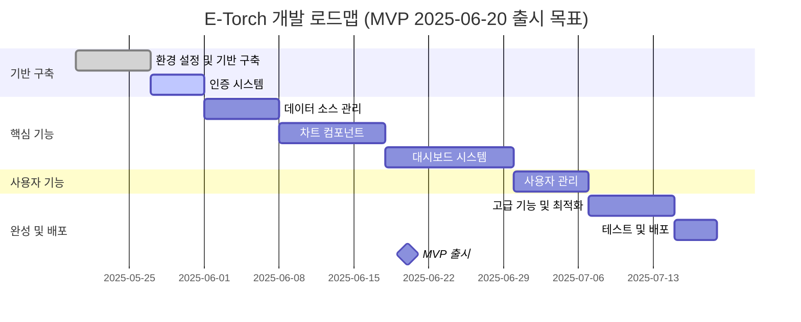
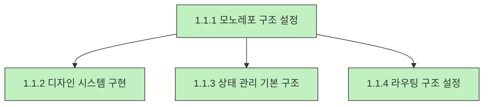
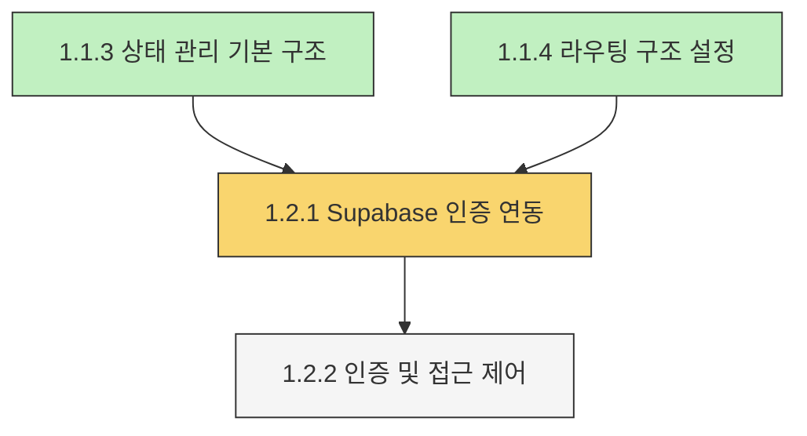
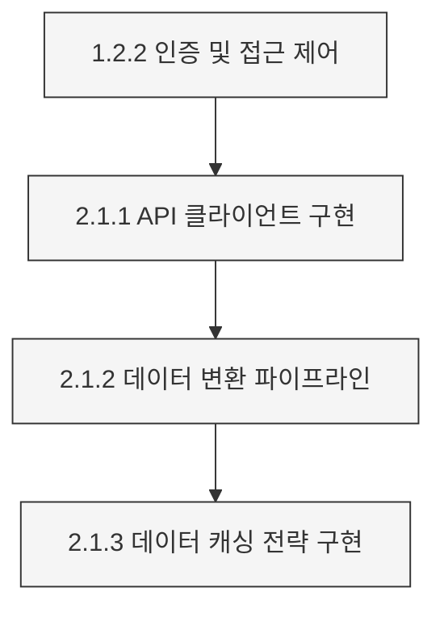
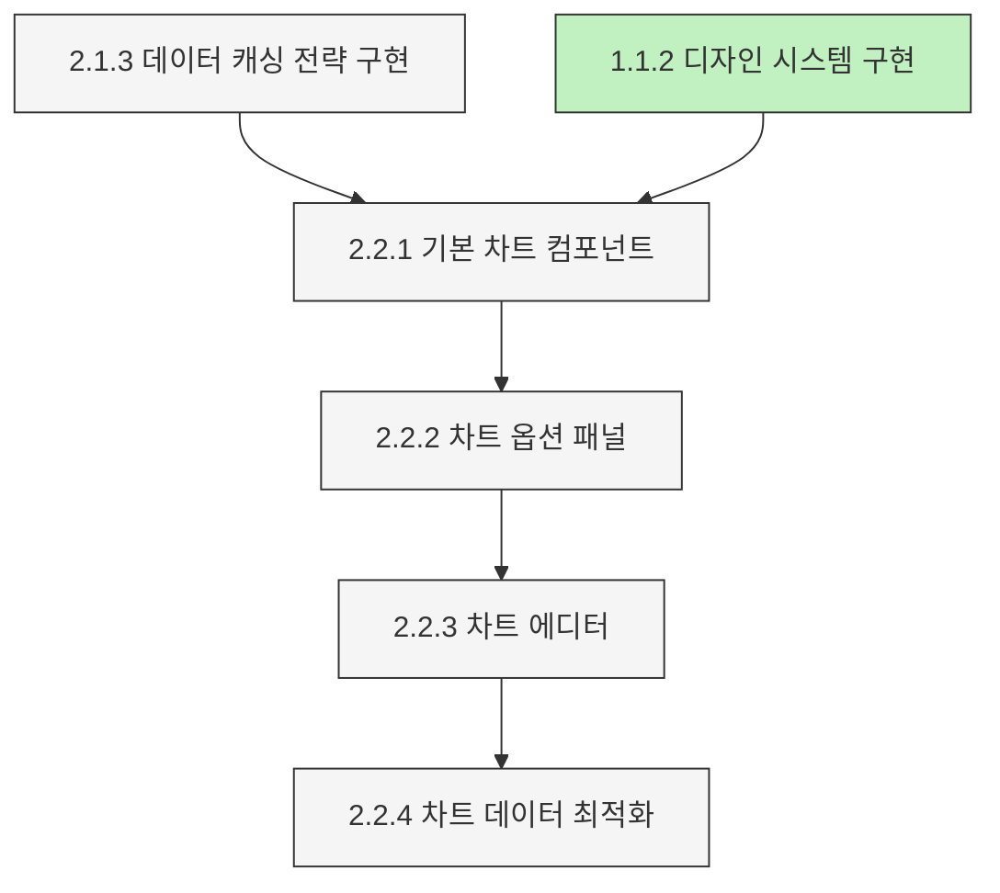
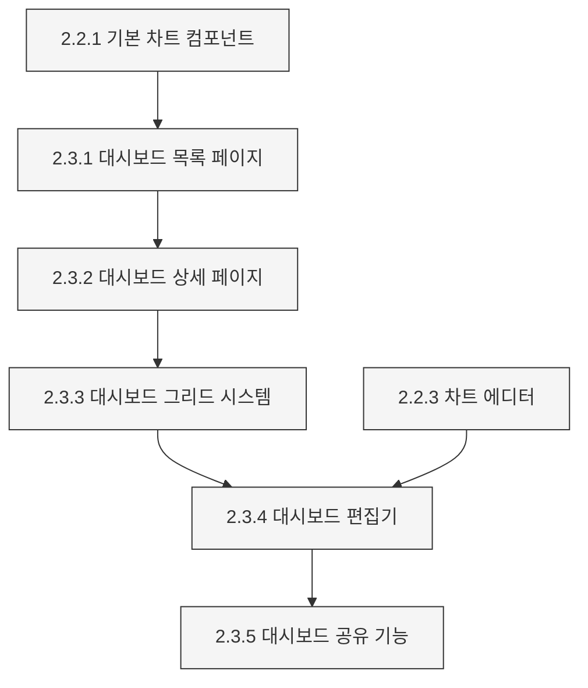
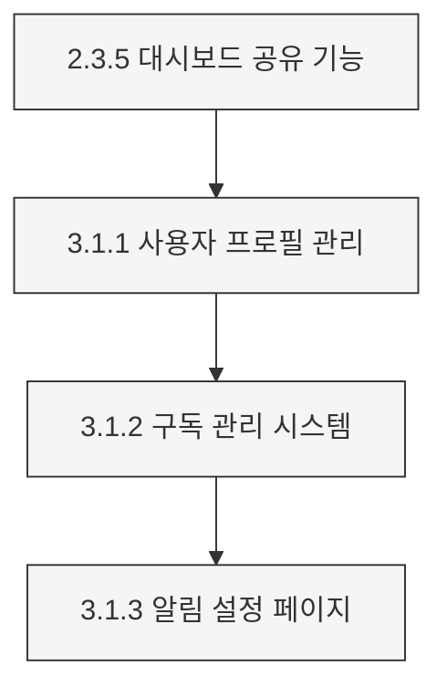
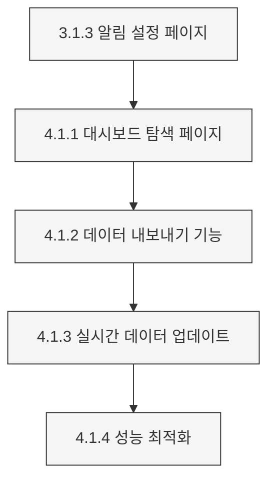
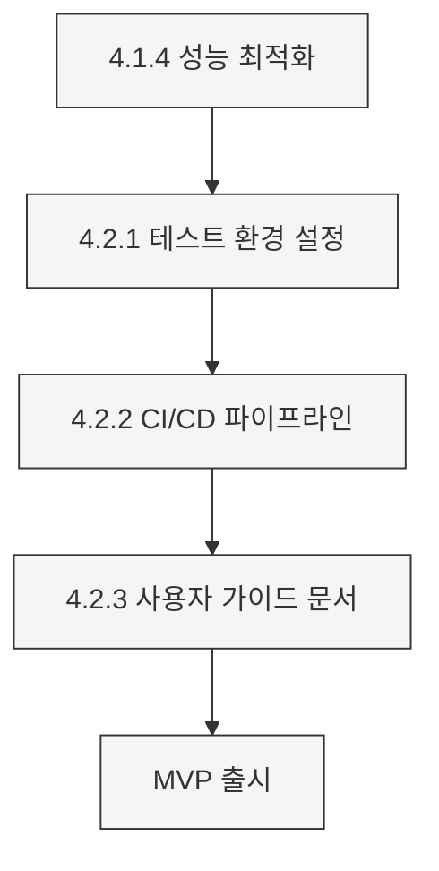
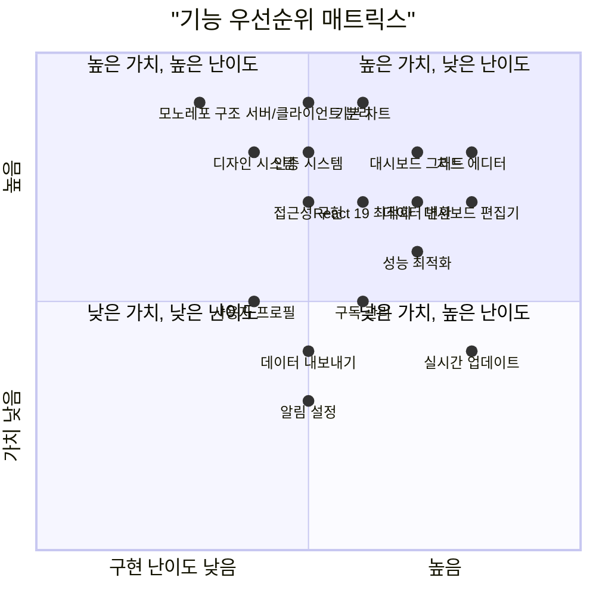

# E-Torch 구현 로드맵 및 체크리스트

## 1. 개요

이 문서는 E-Torch 경제지표 대시보드 서비스 구현을 위한 체계적인 계획과 체크리스트를 제공합니다. 개발 단계, 우선순위, 의존성, 세부 체크리스트를 포함하여 명확히 구조화했습니다. MVP 출시(2025-06-20)를 목표로 일정이 조정되었습니다.

## 2. 개발 단계 개요

## 3. 세부 구현 로드맵 및 체크리스트

### 페이즈 1: 기반 구축 (12일)

#### 1.1 환경 설정 및 기반 구축 (7일) - 완료

| 작업 | 우선순위 | 종속성 | 예상 소요 시간 | 상태 | 설명 |
|------|----------|-------|--------------|------|------|
| 1.1.1 모노레포 구조 설정 | 매우 높음 | 없음 | 2일 | ✅ | Turborepo, pnpm 워크스페이스, Tailwind CSS 4 설정 |
| 1.1.2 디자인 시스템 구현 | 높음 | 1.1.1 | 2일 | ✅ | OKLCH 색상 체계, 컴포넌트 패턴 구현 |
| 1.1.3 상태 관리 기본 구조 | 높음 | 1.1.1 | 2일 | ✅ | Zustand 5, TanStack Query 5 설정 |
| 1.1.4 라우팅 구조 설정 | 높음 | 1.1.1 | 1일 | ✅ | Next.js 15 App Router 구조 설정 |

**체크리스트: 모노레포 구조 설정 (1.1.1)**

- [x] pnpm 워크스페이스 설정 완료
- [x] turbo.json 구성 완료
- [x] 루트 package.json 설정 (공통 스크립트 포함)
- [x] 패키지 구조 생성 (apps/web, packages/core 등)
- [x] 각 패키지 기본 구조 설정 (package.json, tsconfig.json 등)
- [x] 패키지 간 의존성 설정
- [x] TypeScript 구성 (tsconfig.base.json)
- [x] ESLint 9 Flat Config 설정
- [x] 개발 스크립트 테스트 (dev, build, lint)

**체크리스트: 디자인 시스템 구현 (1.1.2)**

- [x] Tailwind CSS 4 설정 완료 (CSS 기반 설정)
- [x] OKLCH 색상 체계 구현
- [x] 타이포그래피 설정 (Inter, JetBrains Mono)
- [x] 기본 버튼 컴포넌트 구현 (변형, 크기 포함)
- [x] 카드 컴포넌트 구현
- [x] 폼 컴포넌트 구현 (Input, Checkbox, Toggle)
- [x] 레이아웃 컴포넌트 (Container, Grid, Flex)
- [x] 접근성 컴포넌트 (VisuallyHidden, SkipLink)
- [x] 테마 관리 구현 (라이트/다크 모드)
- [x] 컴포넌트 문서화 예시 작성
- [x] 서버/클라이언트 래퍼 컴포넌트 패턴 구현

**체크리스트: 상태 관리 기본 구조 (1.1.3)**

- [x] Zustand 스토어 기본 설정
- [x] 앱 전역 상태 스토어 구현 (테마, 알림, 에러, 로딩)
- [x] 대시보드 상태 스토어 구성
- [x] 차트 에디터 상태 스토어 구성
- [x] Zustand 미들웨어 설정 (immer, persist, devtools)
- [x] Tanstack Query 클라이언트 설정
- [x] 쿼리 키 구조 설계
- [x] React Query 개발 도구 통합
- [x] 정규화된 상태 구조 구현
- [x] 메모이제이션 및 선택적 구독 패턴 구현

**체크리스트: 라우팅 구조 설정 (1.1.4)**

- [x] 기본 라우팅 디렉토리 구조 생성
- [x] 라우트 그룹 구성 (auth, dashboard, chart, profile)
- [x] 레이아웃 컴포넌트 구현 (RootLayout 등)
- [x] 페이지 컴포넌트 기본 구조 구현
- [x] 인터셉트 라우트 설정 (@modal)
- [x] 동적 라우트 설정 ([id] 등)
- [x] 메타데이터 설정
- [x] 라우트 보호를 위한 미들웨어 기본 구조
- [x] 네비게이션 컴포넌트 기본 구조
- [x] 페이지 간 전환 테스트

#### 1.2 인증 시스템 (5일) - 진행 중

| 작업 | 우선순위 | 종속성 | 예상 소요 시간 | 상태 | 설명 |
|------|----------|-------|--------------|------|------|
| 1.2.1 Supabase 인증 연동 | 높음 | 1.1.3, 1.1.4 | 3일 | 🔄 | Supabase 클라이언트, OAuth 연동, 로그인 페이지 구현 |
| 1.2.2 인증 및 접근 제어 | 높음 | 1.2.1 | 2일 | ⏳ | 미들웨어 구현, 서버 컴포넌트 인증, 권한 관리 |

**체크리스트: Supabase 인증 연동 (1.2.1)**

- [x] Supabase 프로젝트 설정
- [x] 환경 변수 구성 (.env.local)
- [x] Supabase 클라이언트 사이드 설정
- [x] Supabase 서버 사이드 설정
- [x] 인증 프로바이더 구현
- [x] Google OAuth 연동
- [x] Naver OAuth 연동
- [x] Kakao OAuth 연동
- [ ] 로그인 페이지 UI 구현
- [ ] OAuth 콜백 핸들러 구현
- [ ] 인증 상태 관리 스토어 구현
- [ ] useAuth 훅 구현
- [ ] 로그인/로그아웃 기능 테스트

**체크리스트: 인증 및 접근 제어 (1.2.2)**

- [ ] middleware.ts 구현 (요청 경로 검사, 토큰 검증)
- [ ] 공개/보호된 라우트 정의
- [ ] 서버 컴포넌트 내 인증 검증 유틸리티
- [ ] AuthGuard 클라이언트 컴포넌트 구현
- [ ] 대시보드 소유권 확인 로직
- [ ] CRUD 작업별 권한 검사 로직
- [ ] useRequireAuth 훅 구현
- [ ] useOptionalAuth 훅 구현
- [ ] 보안 헤더 설정 (CSP 등)
- [ ] 인증 플로우 전체 테스트

### 페이즈 2: 핵심 기능 (29일)

#### 2.1 데이터 소스 관리 (7일)

| 작업 | 우선순위 | 종속성 | 예상 소요 시간 | 상태 | 설명 |
|------|----------|-------|--------------|------|------|
| 2.1.1 API 클라이언트 구현 | 높음 | 1.2.2 | 2일 | ⏳ | HTTP 클라이언트, 인터셉터, 도메인별 클라이언트 구현 |
| 2.1.2 데이터 변환 파이프라인 | 높음 | 2.1.1 | 3일 | ⏳ | 데이터 정규화, LTTB 다운샘플링, 결측치 처리 |
| 2.1.3 데이터 캐싱 전략 구현 | 중간 | 2.1.2 | 2일 | ⏳ | 지표별 캐싱 전략, 다층적 캐시 무효화 |

**체크리스트: API 클라이언트 구현 (2.1.1)**

- [ ] 기본 HTTP 클라이언트 구현
- [ ] 요청 인터셉터 구현 (헤더 추가, 인증)
- [ ] 응답 인터셉터 구현 (응답 변환, 오류 처리)
- [ ] 인증 인터셉터 구현 (JWT 토큰 관리)
- [ ] API 에러 클래스 계층 구현
- [ ] 401 오류 자동 리프레시 로직 구현
- [ ] 네트워크 오류 재시도 로직 구현
- [ ] 경제지표 API 클라이언트 구현
- [ ] 대시보드 API 클라이언트 구현
- [ ] 사용자 API 클라이언트 구현
- [ ] Supabase 클라이언트 통합
- [ ] API 응답 타입 정의

**체크리스트: 데이터 변환 파이프라인 (2.1.2)**

- [ ] 통합 데이터 모델 정의 (NormalizedTimeSeriesData)
- [ ] 지표 메타데이터 타입 정의
- [ ] 원본값 전달 변환 구현
- [ ] 기간 대비 변화율 변환 구현 (MoM, QoQ, YoY)
- [ ] 전년 동기 대비 변화율 변환 구현
- [ ] 누적값 계산 변환 구현
- [ ] 선형 보간법 구현 (결측치 처리)
- [ ] 직전/다음 값 복제 방식 구현 (결측치 처리)
- [ ] 업샘플링/다운샘플링 구현 (기간 동기화)
- [ ] LTTB 다운샘플링 알고리즘 구현
- [ ] M4 다운샘플링 알고리즘 구현
- [ ] 날짜 형식 표준화 유틸리티
- [ ] 단위 변환 유틸리티
- [ ] 통합 변환 파이프라인 테스트

**체크리스트: 데이터 캐싱 전략 구현 (2.1.3)**

- [ ] TanStack Query 캐싱 설정 구현
- [ ] 지표 유형별 캐싱 전략 정의
- [ ] 실시간 금융 지표 캐싱 구현
- [ ] 일일 경제지표 캐싱 구현
- [ ] 월간/분기별/연간 지표 캐싱 구현
- [ ] 시간 기반 무효화 구현
- [ ] 이벤트 기반 무효화 구현
- [ ] 선택적 무효화 구현
- [ ] 선제적 리페치 구현
- [ ] 우선순위 기반 무효화 구현
- [ ] 로컬 스토리지 영구 캐싱 구현
- [ ] 가시성 기반 리페치 구현

#### 2.2 차트 컴포넌트 (10일)

| 작업 | 우선순위 | 종속성 | 예상 소요 시간 | 상태 | 설명 |
|------|----------|-------|--------------|------|------|
| 2.2.1 기본 차트 컴포넌트 | 높음 | 2.1.3, 1.1.2 | 3일 | ⏳ | 서버/클라이언트 분리 구조 설계, 시계열/막대/산점도 차트 |
| 2.2.2 차트 옵션 패널 | 높음 | 2.2.1 | 3일 | ⏳ | 공통 옵션, 차트별 옵션 컴포넌트 구현 |
| 2.2.3 차트 에디터 | 높음 | 2.2.2 | 3일 | ⏳ | 차트 에디터 레이아웃, 미리보기, 저장 기능 구현 |
| 2.2.4 차트 데이터 최적화 | 중간 | 2.2.3 | 1일 | ⏳ | 다운샘플링 알고리즘, 메모이제이션, 점진적 로딩 구현 |

**체크리스트: 기본 차트 컴포넌트 (2.2.1)**

- [ ] ChartComponent 클라이언트 컴포넌트 구현
- [ ] ChartServerWrapper 서버 컴포넌트 구현
- [ ] ChartRenderer 컴포넌트 구현
- [ ] TimeSeriesChart 컴포넌트 구현
- [ ] BarChart 컴포넌트 구현
- [ ] ScatterChart 컴포넌트 구현
- [ ] RadarChart 컴포넌트 구현
- [ ] RadialBarChart 컴포넌트 구현
- [ ] ChartControls 컴포넌트 구현
- [ ] ChartSkeleton 로딩 컴포넌트 구현
- [ ] ChartError 에러 컴포넌트 구현
- [ ] AccessibleChartTable 접근성 컴포넌트 구현
- [ ] 모든 차트 타입 렌더링 테스트

**체크리스트: 차트 옵션 패널 (2.2.2)**

- [ ] PanelOptions 컴포넌트 구현
- [ ] TooltipOptions 컴포넌트 구현
- [ ] LegendOptions 컴포넌트 구현
- [ ] XAxisOptions 컴포넌트 구현
- [ ] YAxisOptions 컴포넌트 구현
- [ ] YAxisSecondaryOptions 컴포넌트 구현
- [ ] GraphStyles 컴포넌트 구현 (시계열 차트)
- [ ] ScatterChartOptions 컴포넌트 구현
- [ ] RadarChartOptions 컴포넌트 구현
- [ ] RadialBarChartOptions 컴포넌트 구현
- [ ] OptionsPanel 통합 컴포넌트 구현
- [ ] useChartOptions 훅 구현
- [ ] 옵션 변경 시 차트 업데이트 테스트

**체크리스트: 차트 에디터 (2.2.3)**

- [ ] ChartEditor 메인 컴포넌트 구현
- [ ] 에디터 레이아웃 구현 (Resizable 활용)
- [ ] ChartTypeSelector 컴포넌트 구현
- [ ] ChartPreview 컴포넌트 구현
- [ ] DataSourcePanel 컴포넌트 구현
- [ ] DataQueryCard 컴포넌트 구현
- [ ] SourceSelector 컴포넌트 구현
- [ ] IndicatorSelector 컴포넌트 구현
- [ ] TransformControls 컴포넌트 구현
- [ ] 옵션 패널 통합
- [ ] EditorControls 컴포넌트 구현
- [ ] 차트 에디터 상태 관리 구현
- [ ] URL 상태 관리 구현
- [ ] 전체 에디터 기능 테스트

**체크리스트: 차트 데이터 최적화 (2.2.4)**

- [ ] LTTB 다운샘플링 알고리즘 통합
- [ ] M4 다운샘플링 알고리즘 통합
- [ ] 리샘플링 알고리즘 구현
- [ ] 차트 컴포넌트 메모이제이션 최적화
- [ ] 점진적 로딩 구현 (ProgressiveChart)
- [ ] 가상화 기법 구현 (대용량 데이터)
- [ ] React.memo 활용 최적화
- [ ] 상태 업데이트 일괄 처리 구현
- [ ] 최적화 전략 퍼포먼스 테스트

#### 2.3 대시보드 시스템 (12일)

| 작업 | 우선순위 | 종속성 | 예상 소요 시간 | 상태 | 설명 |
|------|----------|-------|--------------|------|------|
| 2.3.1 대시보드 목록 페이지 | 높음 | 2.2.1 | 2일 | ⏳ | 대시보드 목록, 카드, 검색/필터링 기능 구현 |
| 2.3.2 대시보드 상세 페이지 | 높음 | 2.3.1 | 2일 | ⏳ | 대시보드 헤더, 시간 범위 제어, 차트 렌더링 구현 |
| 2.3.3 대시보드 그리드 시스템 | 높음 | 2.3.2 | 3일 | ⏳ | react-grid-layout 기반 그리드, 위젯 컴포넌트 구현 |
| 2.3.4 대시보드 편집기 | 높음 | 2.3.3, 2.2.3 | 3일 | ⏳ | 편집 툴바, 위젯 추가, 레이아웃 제어, 저장 기능 구현 |
| 2.3.5 대시보드 공유 기능 | 중간 | 2.3.4 | 2일 | ⏳ | 공유 링크, 소셜 공유, 접근 권한 관리 구현 |

**체크리스트: 대시보드 목록 페이지 (2.3.1)**

- [ ] 대시보드 목록 페이지 서버 컴포넌트 구현
- [ ] DashboardList 클라이언트 컴포넌트 구현
- [ ] DashboardCard 컴포넌트 구현
- [ ] DashboardSearch 컴포넌트 구현
- [ ] DashboardSort 컴포넌트 구현
- [ ] NewDashboardButton 컴포넌트 구현
- [ ] fetchDashboards 함수 구현
- [ ] DashboardPagination 컴포넌트 구현
- [ ] useDashboards 훅 구현
- [ ] 검색 및 필터 상태 관리 구현
- [ ] 빈 상태 및 로딩 상태 처리 구현
- [ ] 전체 목록 페이지 테스트

**체크리스트: 대시보드 상세 페이지 (2.3.2)**

- [ ] 대시보드 상세 페이지 서버 컴포넌트 구현
- [ ] DashboardServerWrapper 서버 컴포넌트 구현
- [ ] DashboardDetail 클라이언트 컴포넌트 구현
- [ ] DashboardHeader 컴포넌트 구현
- [ ] TimeRangeControl 컴포넌트 구현
- [ ] PeriodSelector 컴포넌트 구현
- [ ] RefreshControl 컴포넌트 구현
- [ ] fetchDashboardById 함수 구현
- [ ] useDashboard 훅 구현
- [ ] 시간 범위 및 주기 상태 관리 구현
- [ ] 전체 상세 페이지 테스트

**체크리스트: 대시보드 그리드 시스템 (2.3.3)**

- [ ] react-grid-layout 설정
- [ ] DashboardGrid 컴포넌트 구현
- [ ] GridItem 컴포넌트 구현
- [ ] ChartWidget 컴포넌트 구현
- [ ] TextWidget 컴포넌트 구현
- [ ] KpiWidget 컴포넌트 구현
- [ ] 레이아웃 관리 유틸리티 구현
- [ ] 그리드 위치 계산 로직 구현
- [ ] 드래그 앤 드롭 기능 구현
- [ ] 리사이징 기능 구현
- [ ] 레이아웃 저장 유틸리티 구현
- [ ] 스타일링 및 테마 통합 구현
- [ ] 그리드 시스템 테스트

**체크리스트: 대시보드 편집기 (2.3.4)**

- [ ] 대시보드 편집기 페이지 구현
- [ ] 새 대시보드 생성 페이지 구현
- [ ] DashboardEditor 클라이언트 컴포넌트 구현
- [ ] EditorToolbar 컴포넌트 구현
- [ ] WidgetSelector 컴포넌트 구현
- [ ] DashboardSettings 컴포넌트 구현
- [ ] LayoutControls 컴포넌트 구현
- [ ] Undo/Redo 시스템 구현
- [ ] WidgetSettings 컴포넌트 구현
- [ ] saveDashboard 서버 액션 구현
- [ ] useOptimistic 훅 활용 낙관적 UI 업데이트
- [ ] 임시 저장 기능 구현
- [ ] 편집기 상태 관리 구현
- [ ] 전체 편집기 기능 테스트

**체크리스트: 대시보드 공유 기능 (2.3.5)**

- [ ] DashboardSharing 컴포넌트 구현
- [ ] ShareLink 컴포넌트 구현
- [ ] SocialShare 컴포넌트 구현
- [ ] AccessControl 컴포넌트 구현
- [ ] EmbedCode 컴포넌트 구현
- [ ] SubscribeButton 컴포넌트 구현
- [ ] DashboardStatusBadge 컴포넌트 구현
- [ ] updateSharingSettings 서버 액션 구현
- [ ] Supabase RLS 정책 연동
- [ ] OG 메타데이터 설정
- [ ] 공유 기능 테스트

### 페이즈 3: 사용자 기능 (7일)

#### 3.1 사용자 관리 (7일)

| 작업 | 우선순위 | 종속성 | 예상 소요 시간 | 상태 | 설명 |
|------|----------|-------|--------------|------|------|
| 3.1.1 사용자 프로필 관리 | 중간 | 2.3.5 | 2일 | ⏳ | 프로필 설정, 사용자 정보 폼, 계정 연결 관리 구현 |
| 3.1.2 구독 관리 시스템 | 중간 | 3.1.1 | 3일 | ⏳ | 구독 플랜, 토스페이먼츠 연동, 구독 취소 구현 |
| 3.1.3 알림 설정 페이지 | 낮음 | 3.1.2 | 2일 | ⏳ | 알림 유형, 채널, 주기 설정, 알림 목록 구현 |

**체크리스트: 사용자 프로필 관리 (3.1.1)**

- [ ] 프로필 설정 페이지 서버 컴포넌트 구현
- [ ] ProfileSettings 클라이언트 컴포넌트 구현
- [ ] UserInfoForm 컴포넌트 구현
- [ ] ConnectedAccounts 컴포넌트 구현
- [ ] ThemeSettings 컴포넌트 구현
- [ ] ProfileImageUploader 컴포넌트 구현
- [ ] DeleteAccount 컴포넌트 구현
- [ ] updateProfile 서버 액션 구현
- [ ] SettingsLayout 컴포넌트 구현
- [ ] React Hook Form 유효성 검사 구현
- [ ] Supabase Storage 연동
- [ ] 프로필 설정 기능 테스트

**체크리스트: 구독 관리 시스템 (3.1.2)**

- [ ] 구독 관리 페이지 서버 컴포넌트 구현
- [ ] SubscriptionManagement 클라이언트 컴포넌트 구현
- [ ] CurrentPlanInfo 컴포넌트 구현
- [ ] PlanSelector 컴포넌트 구현
- [ ] PaymentForm 컴포넌트 구현
- [ ] PaymentHistory 컴포넌트 구현
- [ ] CancelSubscription 컴포넌트 구현
- [ ] PaymentMethods 컴포넌트 구현
- [ ] manageSubscription 서버 액션 구현
- [ ] 토스페이먼츠 결제 위젯 통합
- [ ] useSubscription 훅 구현
- [ ] 구독 상태 관리 구현
- [ ] 구독 관리 기능 테스트

**체크리스트: 알림 설정 페이지 (3.1.3)**

- [ ] 알림 설정 페이지 서버 컴포넌트 구현
- [ ] NotificationSettings 클라이언트 컴포넌트 구현
- [ ] NotificationTypesForm 컴포넌트 구현
- [ ] NotificationChannelsForm 컴포넌트 구현
- [ ] NotificationFrequencyForm 컴포넌트 구현
- [ ] NotificationsList 컴포넌트 구현
- [ ] NotificationActions 컴포넌트 구현
- [ ] updateNotificationSettings 서버 액션 구현
- [ ] NotificationListener 컴포넌트 구현
- [ ] Supabase Realtime 연동
- [ ] 알림 상태 관리 구현
- [ ] 알림 설정 기능 테스트

### 페이즈 4: 완성 및 배포 (12일)

#### 4.1 고급 기능 및 최적화 (8일)

| 작업 | 우선순위 | 종속성 | 예상 소요 시간 | 상태 | 설명 |
|------|----------|-------|--------------|------|------|
| 4.1.1 대시보드 탐색 페이지 | 중간 | 3.1.3 | 2일 | ⏳ | 탐색 페이지, 검색/필터링, 카테고리 필터, 구독 기능 구현 |
| 4.1.2 데이터 내보내기 기능 | 중간 | 4.1.1 | 2일 | ⏳ | 차트/대시보드 내보내기, PNG/SVG/CSV/PDF 변환 구현 |
| 4.1.3 실시간 데이터 업데이트 | 낮음 | 4.1.2 | 2일 | ⏳ | 폴링, Supabase Realtime 연동, 협업 기능 구현 |
| 4.1.4 성능 최적화 | 높음 | 4.1.3 | 2일 | ⏳ | 코드 분할, 메모이제이션, 서버/클라이언트 최적화 구현 |

**체크리스트: 대시보드 탐색 페이지 (4.1.1)**

- [ ] 대시보드 탐색 페이지 서버 컴포넌트 구현
- [ ] ExploreView 클라이언트 컴포넌트 구현
- [ ] ExploreSearch 컴포넌트 구현
- [ ] CategoryFilter 컴포넌트 구현
- [ ] SortOptions 컴포넌트 구현
- [ ] ExploreList 컴포넌트 구현
- [ ] DashboardPreview 컴포넌트 구현
- [ ] SubscribeButton 컴포넌트 구현
- [ ] fetchExploreDashboards 함수 구현
- [ ] useExploreDashboards 훅 구현
- [ ] 탐색 상태 관리 구현
- [ ] 무한 스크롤 또는 페이지네이션 구현
- [ ] 탐색 페이지 기능 테스트

**체크리스트: 데이터 내보내기 기능 (4.1.2)**

- [ ] ChartExport 컴포넌트 구현
- [ ] exportToPng 유틸리티 구현
- [ ] exportToSvg 유틸리티 구현
- [ ] exportToCsv 유틸리티 구현
- [ ] DashboardExport 컴포넌트 구현
- [ ] exportToPdf 유틸리티 구현
- [ ] Watermark 컴포넌트 구현
- [ ] ExportControls 컴포넌트 구현
- [ ] 내보내기 옵션 설정 UI 구현
- [ ] 내보내기 기능 테스트

**체크리스트: 실시간 데이터 업데이트 (4.1.3)**

- [ ] usePolling 훅 구현
- [ ] AutoRefreshSettings 컴포넌트 구현
- [ ] useRealtimeData 훅 구현
- [ ] CollaborationPresence 컴포넌트 구현
- [ ] RealtimeNotifications 컴포넌트 구현
- [ ] CommentSection 컴포넌트 구현
- [ ] useVisibilityControl 훅 구현
- [ ] SyncManager 구현
- [ ] 클라이언트-서버 데이터 동기화 구현
- [ ] 충돌 해결 전략 구현
- [ ] 실시간 기능 테스트

**체크리스트: 성능 최적화 (4.1.4)**

- [ ] 코드 분할 및 지연 로딩 구현
- [ ] Next.js Image 컴포넌트 최적화
- [ ] 이미지 포맷 및 크기 최적화
- [ ] 메모이제이션 헬퍼 유틸리티 구현
- [ ] 서버/클라이언트 컴포넌트 최적화
- [ ] 상태 업데이트 일괄 처리 구현
- [ ] 요청 일괄 처리 구현
- [ ] 데이터 프리페칭 구현
- [ ] 애니메이션 최적화
- [ ] 레이아웃 스래싱 방지 구현
- [ ] 코어 웹 바이탈 최적화
- [ ] 번들 분석 및 최적화 구현
- [ ] 성능 테스트 및 최적화 검증

#### 4.2 테스트 및 배포 (4일)

| 작업 | 우선순위 | 종속성 | 예상 소요 시간 | 상태 | 설명 |
|------|----------|-------|--------------|------|------|
| 4.2.1 테스트 환경 설정 | 높음 | 4.1.4 | 1일 | ⏳ | Vitest 설정, 단위/통합/E2E 테스트 구성, 모킹 전략 구현 |
| 4.2.2 CI/CD 파이프라인 | 높음 | 4.2.1 | 1일 | ⏳ | GitHub Actions, Vercel 배포, 환경 변수 관리 구현 |
| 4.2.3 사용자 가이드 문서 | 중간 | 4.2.2 | 2일 | ⏳ | 사용자 가이드, 문제 해결 가이드 작성 |

**체크리스트: 테스트 환경 설정 (4.2.1)**

- [ ] Vitest 설정 구성
- [ ] vitest-setup.ts 구현
- [ ] 패키지별 Vitest 설정
- [ ] 차트 컴포넌트 단위 테스트 구현
- [ ] 대시보드 컴포넌트 단위 테스트 구현
- [ ] 데이터 변환 단위 테스트 구현
- [ ] 페이지 통합 테스트 구현
- [ ] 서버/클라이언트 통합 테스트 구현
- [ ] 데이터 흐름 테스트 구현
- [ ] Playwright 설정
- [ ] E2E 테스트 구현
- [ ] 테스트 커버리지 설정
- [ ] MSW 설정 및 API 모킹 구현

**체크리스트: CI/CD 파이프라인 (4.2.2)**

- [ ] CI 워크플로우 구현
- [ ] CD 워크플로우 구현
- [ ] PR 미리보기 워크플로우 구현
- [ ] 의존성 설치 및 캐싱 설정
- [ ] 린트 및 타입 체크 설정
- [ ] 테스트 자동화 설정
- [ ] 코드 커버리지 보고서 설정
- [ ] 환경별 배포 설정 (개발, 스테이징, 프로덕션)
- [ ] 롤백 메커니즘 구현
- [ ] 배포 알림 설정
- [ ] Vercel 설정 파일 구성
- [ ] 환경 변수 관리 설정

**체크리스트: 사용자 가이드 문서 (4.2.3)**

- [ ] 시작하기 가이드 작성
- [ ] 서비스 개요 및 목적 작성
- [ ] 계정 생성 및 로그인 가이드 작성
- [ ] 사용자 인터페이스 소개 작성
- [ ] 대시보드 가이드 작성
- [ ] 차트 사용법 가이드 작성
- [ ] 데이터 소스 가이드 작성
- [ ] 공유 및 협업 가이드 작성
- [ ] 계정 관리 가이드 작성
- [ ] 고급 기능 가이드 작성
- [ ] 문제 해결 가이드 작성
- [ ] FAQ 작성
- [ ] 스크린샷 및 예제 추가
- [ ] 문서 검토 및 수정

## 4. 패키지별 책임 구분

각 패키지의 구체적인 책임과 구현 우선순위를 명시합니다:

### 4.1 `packages/ui`

**책임**: 모든 UI 컴포넌트 및 디자인 시스템

| 우선순위 | 기능 | 종속성 | 상태 |
|---------|------|-------|------|
| 매우 높음 | 기본 버튼, 카드, 입력 요소 구현 | 없음 | ✅ |
| 높음 | 서버/클라이언트 래퍼 컴포넌트 | 기본 UI | ✅ |
| 높음 | 접근성 컴포넌트 (SkipLink, FocusTrap) | 없음 | 🔄 |
| 중간 | 피드백 컴포넌트 (Toast, Alert) | 기본 UI | 🔄 |
| 중간 | 레이아웃 컴포넌트 | 기본 UI | 🔄 |

### 4.2 `packages/charts`

**책임**: 차트 렌더링 및 에디터 기능

| 우선순위 | 기능 | 종속성 | 상태 |
|---------|------|-------|------|
| 매우 높음 | 기본 차트 컴포넌트 구조 | ui | ⏳ |
| 높음 | 차트 렌더러 및 타입별 구현 | 기본 차트 구조 | ⏳ |
| 높음 | 차트 옵션 패널 | 기본 차트 구조 | ⏳ |
| 높음 | 차트 에디터 | 옵션 패널 | ⏳ |
| 중간 | 차트 데이터 최적화 | 차트 에디터 | ⏳ |

### 4.3 `packages/dashboard`

**책임**: 대시보드 그리드 및 관리 기능

| 우선순위 | 기능 | 종속성 | 상태 |
|---------|------|-------|------|
| 매우 높음 | 대시보드 그리드 시스템 | ui, charts | ⏳ |
| 높음 | 위젯 컴포넌트 | 그리드 시스템 | ⏳ |
| 높음 | 대시보드 에디터 | 위젯 컴포넌트 | ⏳ |
| 중간 | 드래그 앤 드롭 기능 | 그리드 시스템 | ⏳ |
| 중간 | 공유 및 협업 기능 | 대시보드 에디터 | ⏳ |

### 4.4 `packages/data-sources`

**책임**: 데이터 소스 연동 및 변환 기능

| 우선순위 | 기능 | 종속성 | 상태 |
|---------|------|-------|------|
| 매우 높음 | 데이터 소스 커넥터 | core | ⏳ |
| 높음 | 데이터 변환 파이프라인 | 데이터 소스 커넥터 | ⏳ |
| 높음 | 데이터 쿼리 빌더 | 데이터 변환 파이프라인 | ⏳ |
| 중간 | 캐싱 전략 | 데이터 변환 파이프라인 | ⏳ |
| 중간 | 실시간 데이터 지원 | 캐싱 전략 | ⏳ |

### 4.5 `packages/state`

**책임**: 상태 관리 통합

| 우선순위 | 기능 | 종속성 | 상태 |
|---------|------|-------|------|
| 매우 높음 | 기본 스토어 구조 | core | ✅ |
| 높음 | 서버/클라이언트 상태 통합 | 기본 스토어 구조 | 🔄 |
| 높음 | 도메인별 스토어 구현 | 기본 스토어 구조 | 🔄 |
| 중간 | Undo/Redo 시스템 | 도메인별 스토어 | ⏳ |
| 중간 | 디버깅 도구 | 기본 스토어 구조 | ⏳ |

### 4.6 `packages/server-api`

**책임**: API 클라이언트 및 서버 액션

| 우선순위 | 기능 | 종속성 | 상태 |
|---------|------|-------|------|
| 매우 높음 | 기본 HTTP 클라이언트 | core | ⏳ |
| 높음 | 도메인별 API 클라이언트 | 기본 HTTP 클라이언트 | ⏳ |
| 높음 | 서버 액션 래퍼 | 도메인별 API 클라이언트 | ⏳ |
| 중간 | 인증 통합 | 기본 HTTP 클라이언트 | ⏳ |
| 중간 | 오류 처리 전략 | 도메인별 API 클라이언트 | ⏳ |

## 5. 마일스톤 및 체크포인트

| 마일스톤 | 완료 기준 | 예상 일정 | 체크포인트 |
|---------|----------|----------|-----------|
| **기반 구축 완료** | 환경 설정, 디자인 시스템, 상태 관리, 라우팅, 인증 시스템 완료 | 2025-06-01 | ✅ 모노레포 구조 설정 완료 ✅ 디자인 시스템 구현 완료 ✅ 상태 관리 기본 구조 완료 ✅ 라우팅 구조 설정 완료 🔄 인증 시스템 진행 중 |
| **핵심 기능 MVP** | 데이터 소스 관리, 기본 차트, 차트 옵션, 대시보드 목록/상세 완료 | 2025-06-15 | ⏳ API 클라이언트 구현 ⏳ 데이터 변환 파이프라인 ⏳ 기본 차트 컴포넌트 ⏳ 차트 옵션 패널 ⏳ 대시보드 목록 페이지 ⏳ 대시보드 상세 페이지 |
| **기능 완성** | 대시보드 그리드, 편집기, 공유, 사용자 관리 완료 | 2025-07-01 | ⏳ 대시보드 그리드 시스템 ⏳ 대시보드 편집기 ⏳ 대시보드 공유 기능 ⏳ 사용자 프로필 관리 ⏳ 구독 관리 시스템 |
| **MVP 출시** | 모든 기능, 최적화, 테스트, 배포 완료 | 2025-06-20 | ⏳ 대시보드 탐색 페이지 ⏳ 데이터 내보내기 기능 ⏳ 성능 최적화 ⏳ 테스트 환경 설정 ⏳ CI/CD 파이프라인 ⏳ 사용자 가이드 문서 |

## 6. 구현 우선순위 매트릭스

## 7. 개발 리소스 분배

총 개발 기간은 약 9주(60일)로 예상됩니다. 한 명의 10년차 프론트엔드 개발자가 모든 작업을 수행하는 경우를 가정하면:

- **페이즈 1 (기반 구축)**: 총 기간의 20% (12일)
- **페이즈 2 (핵심 기능)**: 총 기간의 48% (29일)
- **페이즈 3 (사용자 기능)**: 총 기간의 12% (7일)
- **페이즈 4 (완성 및 배포)**: 총 기간의 20% (12일)

## 8. 작업 진행 상황 트래킹

| 페이즈 | 작업 | 상태 | 진행률 | 시작일 | 완료일 | 담당자 |
|-------|------|------|-------|--------|--------|-------|
| **페이즈 1** | 1.1.1 모노레포 구조 설정 | ✅ 완료 | 100% | 2025-05-20 | 2025-05-21 | 이승우 |
|  | 1.1.2 디자인 시스템 구현 | ✅ 완료 | 100% | 2025-05-22 | 2025-05-23 | 이승우 |
|  | 1.1.3 상태 관리 기본 구조 | ✅ 완료 | 100% | 2025-05-22 | 2025-05-23 | 이승우 |
|  | 1.1.4 라우팅 구조 설정 | ✅ 완료 | 100% | 2025-05-24 | 2025-05-24 | 이승우 |
|  | 1.2.1 Supabase 인증 연동 | 🔄 진행 중 | 60% | 2025-05-25 | - | 이승우 |
|  | 1.2.2 인증 및 접근 제어 | ⏳ 예정 | 0% | - | - | 이승우 |
| **페이즈 2** | 2.1.1 API 클라이언트 구현 | ⏳ 예정 | 0% | - | - | 이승우 |
|  | 2.1.2 데이터 변환 파이프라인 | ⏳ 예정 | 0% | - | - | 이승우 |
|  | 2.1.3 데이터 캐싱 전략 구현 | ⏳ 예정 | 0% | - | - | 이승우 |
|  | 2.2.1 기본 차트 컴포넌트 | ⏳ 예정 | 0% | - | - | 이승우 |
|  | 2.2.2 차트 옵션 패널 | ⏳ 예정 | 0% | - | - | 이승우 |
|  | 2.2.3 차트 에디터 | ⏳ 예정 | 0% | - | - | 이승우 |
|  | 2.2.4 차트 데이터 최적화 | ⏳ 예정 | 0% | - | - | 이승우 |
|  | 2.3.1 대시보드 목록 페이지 | ⏳ 예정 | 0% | - | - | 이승우 |
|  | 2.3.2 대시보드 상세 페이지 | ⏳ 예정 | 0% | - | - | 이승우 |
|  | 2.3.3 대시보드 그리드 시스템 | ⏳ 예정 | 0% | - | - | 이승우 |
|  | 2.3.4 대시보드 편집기 | ⏳ 예정 | 0% | - | - | 이승우 |
|  | 2.3.5 대시보드 공유 기능 | ⏳ 예정 | 0% | - | - | 이승우 |
| **페이즈 3** | 3.1.1 사용자 프로필 관리 | ⏳ 예정 | 0% | - | - | 이승우 |
|  | 3.1.2 구독 관리 시스템 | ⏳ 예정 | 0% | - | - | 이승우 |
|  | 3.1.3 알림 설정 페이지 | ⏳ 예정 | 0% | - | - | 이승우 |
| **페이즈 4** | 4.1.1 대시보드 탐색 페이지 | ⏳ 예정 | 0% | - | - | 이승우 |
|  | 4.1.2 데이터 내보내기 기능 | ⏳ 예정 | 0% | - | - | 이승우 |
|  | 4.1.3 실시간 데이터 업데이트 | ⏳ 예정 | 0% | - | - | 이승우 |
|  | 4.1.4 성능 최적화 | ⏳ 예정 | 0% | - | - | 이승우 |
|  | 4.2.1 테스트 환경 설정 | ⏳ 예정 | 0% | - | - | 이승우 |
|  | 4.2.2 CI/CD 파이프라인 | ⏳ 예정 | 0% | - | - | 이승우 |
|  | 4.2.3 사용자 가이드 문서 | ⏳ 예정 | 0% | - | - | 이승우 |

## 9. 프로젝트 위험 관리

| 위험 요소 | 영향도 | 가능성 | 대응 전략 |
|---------|-------|-------|----------|
| **React 19 안정성 문제** | 높음 | 중간 | 주요 업데이트 테스트, 대체 방안 준비 |
| **데이터 처리 성능 이슈** | 높음 | 높음 | 다운샘플링, 메모이제이션, 점진적 로딩 |
| **SSR/CSR 통합 복잡성** | 중간 | 높음 | 명확한 패턴 수립, 서버/클라이언트 컴포넌트 분리 |
| **접근성 요구사항 충족** | 중간 | 중간 | 지속적인 a11y 테스트, 전문가 검토 |
| **모바일 대응 부족** | 중간 | 낮음 | 반응형 디자인 우선, 모바일 테스트 강화 |

## 10. 결론

현재 E-Torch 프로젝트는 기반 구축 단계를 성공적으로 완료하고 인증 시스템 구현 중에 있습니다. 2025-06-20 MVP 출시를 위해 핵심 기능 개발을 우선 순위로 진행할 계획입니다. 최신 기술 스택(React 19, Next.js 15, Tailwind CSS 4, Zustand 5)을 활용한 아키텍처는 구축되었으며, 서버/클라이언트 컴포넌트 분리 전략과 성능 최적화 기법을 적용하여 고품질 사용자 경험을 제공할 예정입니다.
