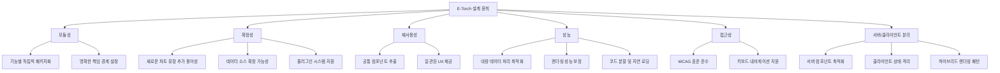
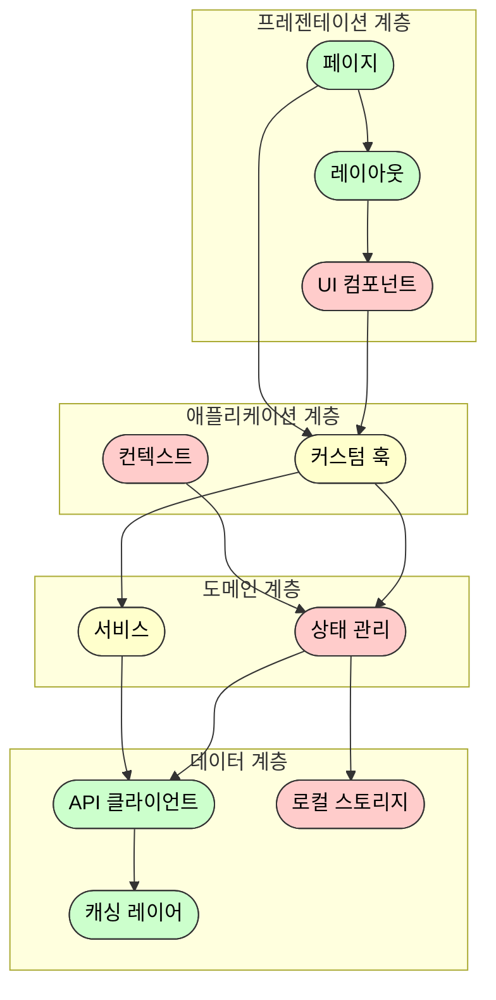
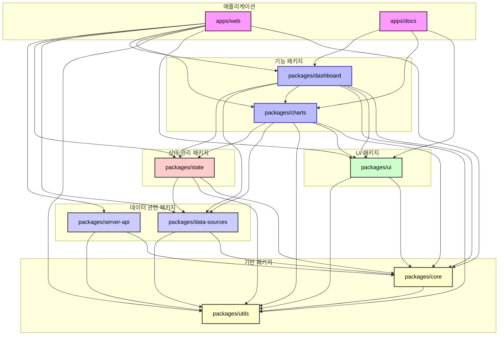
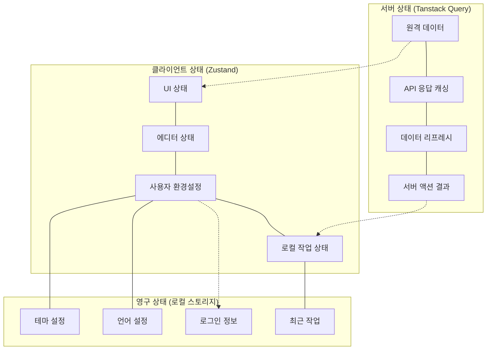
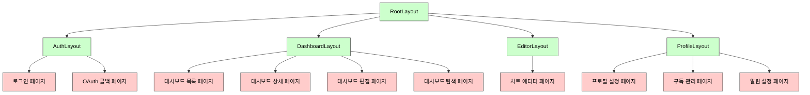

# E-Torch 프론트엔드 아키텍처 설계 문서

## 1. 개요

E-Torch는 다양한 출처(KOSIS, ECOS, OECD)의 경제지표 데이터를 통합하여 시각화하는 대시보드 서비스입니다. 본 문서는 E-Torch의 프론트엔드 아키텍처를 모노레포 구조로 설계하며, 특히 Next.js의 서버/클라이언트 컴포넌트 분리 전략과 핵심 기능을 모듈화하고 확장 가능한 아키텍처를 제시합니다.

### 1.1 프로젝트 목표

- 다양한 출처의 경제지표 데이터를 통합 제공
- 사용자 맞춤형 대시보드를 통한 경제지표 시각화 및 인사이트 도출
- 전문가와 일반 사용자 모두를 위한 경제데이터 접근성 향상
- 직관적이고 유연한 차트 컴포넌트와 에디터 기능 제공

### 1.2 설계 원칙



## 2. 기술 스택

| 영역 | 기술 | 선정 이유 | 버전 |
|------|------|----------|------|
| **모노레포 관리** | Turborepo | 빌드 캐싱, 병렬 실행, 의존성 관리 기능 우수 | 2.0.0+ |
| **패키지 관리** | pnpm | 디스크 공간 절약, 의존성 중복 설치 방지 | 8.0.0+ |
| **프레임워크** | React + Next.js | App Router, 서버 컴포넌트 제공 | React 19, Next.js 15 |
| **UI 프레임워크** | Shadcn/UI + Tailwind CSS | 커스터마이징 용이성, 생산성 향상 | Tailwind CSS 4 |
| **상태 관리** | Zustand, Tanstack Query | 단순한 API, 성능 최적화, 상태 로직 분리 | Zustand 5, TQ 5 |
| **차트 라이브러리** | Recharts | React 친화적, 유연한 커스터마이징 | 2.10.1+ |
| **대시보드 레이아웃** | react-grid-layout | 드래그 앤 드롭, 리사이징 지원 | 1.4.0+ |
| **타입 검사** | TypeScript | 타입 안정성, 개발 생산성 향상 | 5.5+ |
| **폼 관리** | React Hook Form + Zod | 성능 최적화, 선언적 유효성 검사 | RHF 7, Zod 3 |
| **코드 품질 관리** | ESLint | 일관된 코드 스타일, 오류 감지 | ESLint 9 (Standard 규칙) |
| **테스트** | Vitest + Testing Library + Playwright | 단위/통합/E2E 테스트 도구 | Vitest 1, Playwright 1.40+ |
| **문서화** | Storybook | 컴포넌트 문서화, 시각적 테스트 | 8.0+ |
| **아이콘** | Lucide React | 가볍고 확장 가능한 아이콘 세트 | 1.0.0+ |
| **폰트** | Inter, JetBrains Mono | 가독성 및 기술적 콘텐츠 표현에 최적화 | - |

## 3. 아키텍처 계층 구조

E-Torch 프론트엔드 아키텍처는 여러 계층으로 구성되어 관심사를 명확히 분리합니다.



### 3.1 서버/클라이언트 컴포넌트 분리 개요

Next.js App Router 환경에서는 서버와 클라이언트 컴포넌트를 명확히 구분하여 활용합니다.

서버/클라이언트 컴포넌트 주요 구분 원칙:

- 서버 컴포넌트: 데이터 페칭, 메타데이터 생성, 정적 UI 렌더링
- 클라이언트 컴포넌트: 상호작용 UI, 상태 관리, 이벤트 핸들링
- 하이브리드 패턴: 서버에서 데이터를 페칭하여 클라이언트 컴포넌트에 전달

상세 구현 패턴과 전략은 [`core-components.md`](./components/core-components.md) 문서를 참조하십시오.

## 4. 모노레포 패키지 구조 설계

### 4.1 패키지 구조

```mermaid
graph TD
    A[e-torch] --> B[apps/]
    A --> C[packages/]
    
    B --> B1[web]
    B --> B2[docs]
    
    C --> C1[core]
    C --> C2[charts]
    C --> C3[dashboard]
    C --> C4[data-sources]
    C --> C5[ui]
    C --> C6[utils]
    C --> C7[state]
    C --> C8[server-api]
    
    C1 --> C1A[타입 정의]
    C1 --> C1B[상수]
    C1 --> C1C[기본 인터페이스]
    
    C2 --> C2A[차트 컴포넌트]
    C2 --> C2B[차트 렌더러]
    C2 --> C2C[차트 에디터]
    C2 --> C2D[차트 옵션]
    
    C3 --> C3A[대시보드 컴포넌트]
    C3 --> C3B[대시보드 그리드]
    C3 --> C3C[대시보드 관리]
    C3 --> C3D[레이아웃 시스템]
    
    C4 --> C4A[데이터 커넥터]
    C4 --> C4B[데이터 변환]
    C4 --> C4C[쿼리 관리]
    
    C5 --> C5A[UI 컴포넌트]
    C5 --> C5B[서버 래퍼]
    C5 --> C5C[유틸리티 및 훅]
    
    C6 --> C6A[포맷터]
    C6 --> C6B[유효성 검사]
    C6 --> C6C[헬퍼 함수]
    
    C7 --> C7A[Zustand 스토어]
    C7 --> C7B[Tanstack Query 훅]
    C7 --> C7C[컨텍스트 제공자]
    
    C8 --> C8A[API 경로]
    C8 --> C8B[미들웨어]
    C8 --> C8C[서버 액션]
    
    classDef server fill:#ccffcc,stroke:#333,stroke-width:1px,color:#000;
    classDef client fill:#ffcccb,stroke:#333,stroke-width:1px,color:#000;
    classDef shared fill:#ffffcc,stroke:#333,stroke-width:1px,color:#000;
    
    class C8,C8A,C8B,C8C,C5B server;
    class C7,C7A,C7B,C7C,C5A,C5C client;
    class C1,C1A,C1B,C1C,C2,C2A,C2B,C2C,C2D,C3,C3A,C3B,C3C,C3D,C4,C4A,C4B,C4C,C6,C6A,C6B,C6C shared;
```



### 4.2 패키지 의존성 구조

각 패키지 간의 의존성을 명확하게 정의하여 순환 의존성을 방지하고 패키지의 책임을 명확히 합니다.



### 4.3 UI 컴포넌트와 서버/클라이언트 통합 전략

Shadcn/UI는 기본적으로 클라이언트 컴포넌트로 제공되므로, 서버 컴포넌트에서 사용하기 위한 래퍼 패턴을 채택합니다. 상세 구현은 [`core-components.md`](./components/core-components.md#34-ui-컴포넌트-서버-래퍼-패턴) 문서를 참조하십시오.

## 5. 패키지별 책임 구분

### 5.1 `packages/ui`

`ui` 패키지는 기본 UI 컴포넌트만 담당합니다:

- 재사용 가능한 기본 컴포넌트 제공
- Shadcn/UI 기반 컴포넌트 통합
- 클라이언트 컴포넌트와 서버 래퍼 관리
- 도메인 로직 포함하지 않음

### 5.2 `packages/core`

`core` 패키지는 공통 타입과 인터페이스 정의:

- 다른 패키지에 의존하지 않음
- 공통 타입, 상수, 인터페이스 정의
- 모든 패키지에서 사용하는 기본 구조 제공

### 5.3 `packages/charts`

`charts` 패키지는 차트 관련 모든 기능 담당:

- 차트 컴포넌트 구현
- 차트 렌더링 로직
- 차트 에디터 기능
- 차트별 옵션 관리

### 5.4 `packages/dashboard`

`dashboard` 패키지는 대시보드 관련 모든 기능 담당:

- 대시보드 컴포넌트 구현
- 대시보드 그리드 시스템
- 대시보드 CRUD 기능
- 레이아웃 관리 기능

### 5.5 `packages/data-sources`

`data-sources` 패키지는 데이터 통합 담당:

- 다양한 경제지표 데이터 소스 연결
- 데이터 정규화 및 변환
- 쿼리 관리 기능

### 5.6 `packages/state`

`state` 패키지는 상태 관리 담당:

- Zustand 기반 클라이언트 상태
- Tanstack Query 기반 서버 상태
- 상태 관리 패턴 통합

### 5.7 `packages/utils`

`utils` 패키지는 공통 유틸리티 제공:

- 데이터 포맷팅
- 유효성 검사
- 헬퍼 함수

### 5.8 `packages/server-api`

`server-api` 패키지는 서버 API 연동 담당:

- API 경로 핸들러
- 서버 액션 구현
- 미들웨어 관리

## 6. 핵심 패키지 역할

### 6.1 `packages/core`

`core` 패키지는 타입 정의, 상수, 인터페이스를 제공합니다:

- 모든 패키지에서 공통으로 사용하는 타입 정의
- 상수 값 (API 엔드포인트, 스토리지 키 등)
- 기본 인터페이스 정의
- 다른 패키지에 의존하지 않음 (순환 의존성 방지)

### 6.2 `packages/ui`

`ui` 패키지는 Shadcn/UI 기반의 공통 UI 컴포넌트를 제공합니다:

- **접근성 컴포넌트** (src/components/a11y/)
  - SkipLink, VisuallyHidden 등
- **UI 컴포넌트** (src/components/ui/)
  - Button, Card, Dialog 등 Shadcn/UI 기반 기본 컴포넌트
- **피드백 컴포넌트** (src/components/feedback/)
  - Toast, Alert 등 피드백 관련 UI
- **서버 컴포넌트 래퍼** (src/server-components/)
  - 클라이언트 컴포넌트의 서버 사이드 래퍼

### 6.3 `packages/charts`

`charts` 패키지는 차트 관련 모든 기능을 제공합니다:

- **차트 컴포넌트**: 시계열, 바 차트, 산점도 등 다양한 차트 유형 구현
- **차트 렌더러**: 차트 데이터 시각화 로직
- **차트 에디터**: 차트 생성 및 편집 인터페이스
- **차트 옵션**: 차트 커스터마이징 설정
- **차트 유틸리티**: 차트 관련 헬퍼 함수

### 6.4 `packages/dashboard`

`dashboard` 패키지는 대시보드 기능을 모두 구현합니다:

- **대시보드 컴포넌트**: 대시보드 UI 요소 및 위젯
- **대시보드 그리드**: react-grid-layout 기반 그리드 시스템
- **대시보드 관리**: 대시보드 CRUD 기능
- **레이아웃 시스템**: 대시보드 레이아웃 관리

### 6.5 `packages/data-sources`

`data-sources` 패키지는 데이터 소스 연동 기능을 제공합니다:

- **데이터 커넥터**: 경제지표 데이터 소스 연결
- **데이터 변환**: 데이터 정규화 및 변환
- **쿼리 관리**: 데이터 쿼리 구성 및 실행

### 6.6 `packages/state`

`state` 패키지는 상태 관리 기능을 제공합니다:

- **Zustand 스토어**: 클라이언트 상태 관리
- **Tanstack Query 훅**: 서버 상태 관리
- **컨텍스트 제공자**: React Context 기반 상태 공유

### 6.7 `packages/utils`

`utils` 패키지는 유틸리티 함수를 제공합니다:

- **포맷터**: 날짜, 숫자 등 포맷팅 기능
- **유효성 검사**: 데이터 유효성 검사 함수
- **헬퍼 함수**: 공통 유틸리티 함수

### 6.8 `packages/server-api`

`server-api` 패키지는 서버 API 통신 기능을 제공합니다:

- **API 경로**: Next.js API 라우트 핸들러
- **미들웨어**: API 요청/응답 처리 미들웨어
- **서버 액션**: Next.js 서버 액션 구현

## 7. 상태 관리 아키텍처 개요

E-Torch는 상태 유형에 따라 다양한 상태 관리 전략을 사용합니다. 상세 구현은 [`state-management.md`](./state-management.md) 문서를 참조하십시오.

### 7.1 서버 상태와 클라이언트 상태 분리



## 8. 데이터 처리 개요

E-Torch의 데이터 처리 파이프라인은 다음과 같은 단계로 구성됩니다. 상세 구현은 [`data-flow.md`](./data-flow.md) 문서를 참조하십시오.


## 9. 라우팅 및 페이지 구조 개요

E-Torch는 Next.js App Router를 활용한 라우팅 구조를 가집니다. 상세 구현은 [`routing.md`](./routing.md) 문서를 참조하십시오.



## 10. 코드 포맷팅 및 개발 환경 설정

### 10.1 코드 스타일 가이드

E-Torch 프로젝트는 ESLint 9 버전의 Standard 규칙을 사용하여 코드 스타일을 관리합니다:

```js
// .eslintrc.js
module.exports = {
  root: true,
  extends: [
    'standard',
    'plugin:@typescript-eslint/recommended',
    'plugin:react/recommended',
    'plugin:react-hooks/recommended',
    'plugin:jsx-a11y/recommended'
  ],
  parser: '@typescript-eslint/parser',
  plugins: ['@typescript-eslint', 'react', 'react-hooks', 'jsx-a11y'],
  rules: {
    // 프로젝트 특화 규칙
    'react/react-in-jsx-scope': 'off',
    'react/prop-types': 'off',
    'react-hooks/exhaustive-deps': 'warn',
    '@typescript-eslint/explicit-module-boundary-types': 'off',
    '@typescript-eslint/no-explicit-any': 'warn'
  },
  settings: {
    react: {
      version: 'detect'
    }
  }
}
```

### 10.2 VSCode 설정

프로젝트의 일관된 코드 스타일을 위한 VSCode 설정:

```json
// .vscode/settings.json
{
  "editor.formatOnSave": false,
  "editor.codeActionsOnSave": {
    "source.fixAll.eslint": "explicit"
  },
  "eslint.validate": [
    "javascript",
    "javascriptreact",
    "typescript",
    "typescriptreact"
  ],
  "typescript.tsdk": "node_modules/typescript/lib",
  "typescript.enablePromptUseWorkspaceTsdk": true
}
```

### 10.3 Git Hooks 설정

코드 품질 검사를 위한 husky 설정:

```bash
# package.json에 추가
{
  "scripts": {
    "lint": "eslint \"**/*.{ts,tsx}\"",
    "typecheck": "tsc --noEmit",
    "prepare": "husky install"
  },
  "devDependencies": {
    "husky": "^8.0.0",
    "lint-staged": "^13.0.0"
  },
  "lint-staged": {
    "*.{ts,tsx}": [
      "eslint --fix"
    ]
  }
}
```

## 11. 접근성 전략

Next.js 서버 컴포넌트를 활용한 접근성 향상 전략:

- 서버에서 접근성 메타데이터 생성
- 클라이언트 상태 최소화로 스크린 리더 호환성 향상
- 선언적 접근성 속성 관리

자세한 구현은 디자인 시스템 문서를 참조하십시오.

## 12. 결론

E-Torch 프론트엔드 아키텍처는 다음 핵심 원칙을 기반으로 합니다:

- 모듈성: 기능별 패키지 분리
- 확장성: 새로운 기능 추가 용이성
- 재사용성: 공통 컴포넌트 추출
- 성능: 서버/클라이언트 최적화
- 접근성: WCAG 2.1 AA 준수

Next.js 서버 컴포넌트와 App Router를 활용한 이 아키텍처는 경제지표 데이터를 효과적으로 시각화하고 분석할 수 있는 플랫폼을 제공합니다.
