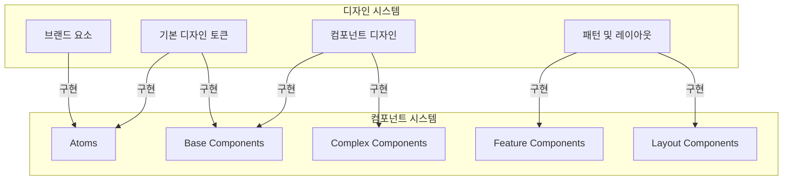

# 디자인 시스템과 컴포넌트 매핑 가이드

## 1. 개요

이 문서는 [`design-system.md`](../ui-design/design-system.md)에 정의된 디자인 시스템 요소와 [`core-components.md`](../frontend/components/core-components.md)에 정의된 실제 컴포넌트 구현 간의 명확한 매핑 관계를 제공합니다. 이 가이드는 프론트엔드 개발자가 디자인 시스템을 일관되게 구현하는 데 도움이 됩니다.

## 2. 디자인 계층과 컴포넌트 계층 관계



## 3. 색상 체계 구현

### 디자인 시스템 정의

`design-system.md`에 정의된 색상 체계:

```
브랜드 색상:
- Primary: #0c1e3e
- Secondary: #1a56db
- Tertiary: #0284c7

차트 색상:
- #1b3a6b (진한 파랑)
- #1c7ed6 (밝은 파랑)
- #12b886 (녹색)
- #9775fa (보라)
- #fd7e14 (주황)
- ...
```

### 구현 매핑

```tsx
// packages/core/src/tokens/colors.ts

// 브랜드 색상 토큰
export const brandColors = {
  primary: {
    DEFAULT: '#0c1e3e',
    light: '#15345c',
    dark: '#102a4c',
  },
  secondary: {
    DEFAULT: '#1a56db',
    light: '#2563eb',
    dark: '#1e429f',
  },
  tertiary: '#0284c7',
};

// 의미적 색상 토큰
export const semanticColors = {
  success: '#059669',
  warning: '#d97706',
  danger: '#dc2626',
  info: '#2563eb',
  highlight: '#7c3aed',
};

// 차트 색상 팔레트
export const chartColors = [
  '#1b3a6b', // series1
  '#1c7ed6', // series2
  '#12b886', // series3
  '#9775fa', // series4
  '#fd7e14', // series5
  '#40c057', // series6
  '#e64980', // series7
];

// Tailwind 설정에 매핑
// tailwind.config.js
module.exports = {
  theme: {
    extend: {
      colors: {
        primary: brandColors.primary,
        secondary: brandColors.secondary,
        tertiary: brandColors.tertiary,
        success: semanticColors.success,
        warning: semanticColors.warning,
        danger: semanticColors.danger,
        info: semanticColors.info,
        highlight: semanticColors.highlight,
      },
    },
  },
};
```

### 차트 컴포넌트에서의 활용

```tsx
// packages/charts/src/components/TimeSeriesChart.tsx
import { chartColors } from '@/packages/core';

interface TimeSeriesChartProps {
  // ...
  seriesIndex?: number;
  color?: string;
}

export const TimeSeriesChart = ({
  // ...
  seriesIndex = 0,
  color,
}: TimeSeriesChartProps) => {
  // 색상 우선순위: 직접 지정 색상 > 시리즈 인덱스 기반 색상
  const seriesColor = color || chartColors[seriesIndex % chartColors.length];
  
  return (
    <ResponsiveContainer width="100%" height={300}>
      <LineChart data={data}>
        <Line 
          type="monotone" 
          dataKey="value" 
          stroke={seriesColor} 
          // ...
        />
        {/* ... */}
      </LineChart>
    </ResponsiveContainer>
  );
};
```

## 4. 타이포그래피 구현

### 디자인 시스템 정의

`design-system.md`에 정의된 타이포그래피:

```
- 기본 폰트: Inter (UI 요소)
- 모노스페이스 폰트: JetBrains Mono (데이터, 코드, 수치값)

타입 스케일:
- Display: 36px / 1.2 / 700
- H1: 28px / 1.3 / 700
- H2: 24px / 1.35 / 600
- ...
- Data Value: 16px / 1.4 / 600
```

### 구현 매핑

```tsx
// packages/ui/src/typography/index.tsx
import { cva } from 'class-variance-authority';

// 타이포그래피 변형 정의
export const typographyVariants = cva('', {
  variants: {
    variant: {
      display: 'text-4xl font-bold leading-tight',    // 36px / 1.2 / 700
      h1: 'text-3xl font-bold leading-snug',          // 28px / 1.3 / 700
      h2: 'text-2xl font-semibold leading-snug',      // 24px / 1.35 / 600
      h3: 'text-xl font-semibold leading-normal',     // 20px / 1.4 / 600
      h4: 'text-lg font-semibold leading-normal',     // 18px / 1.45 / 600
      body: 'text-base font-normal leading-relaxed',  // 16px / 1.5 / 400
      small: 'text-sm font-normal leading-relaxed',   // 14px / 1.5 / 400
      xsmall: 'text-xs font-normal leading-relaxed',  // 12px / 1.5 / 400
      code: 'font-mono text-sm leading-loose',        // 14px / 1.6 / 400
      dataValue: 'font-mono text-base font-semibold leading-normal', // 16px / 1.4 / 600
    },
  },
  defaultVariants: {
    variant: 'body',
  },
});

// 타이포그래피 컴포넌트
export interface TypographyProps
  extends React.HTMLAttributes<HTMLParagraphElement> {
  variant?: keyof typeof typographyVariants.variants.variant;
  as?: React.ElementType;
}

export const Typography = ({
  variant = 'body',
  as: Component = 'p',
  className,
  ...props
}: TypographyProps) => {
  return (
    <Component
      className={cn(typographyVariants({ variant }), className)}
      {...props}
    />
  );
};

// 사용 예시
export const Heading = (props: TypographyProps) => (
  <Typography variant="h1" as="h1" {...props} />
);

export const DataValue = (props: TypographyProps) => (
  <Typography variant="dataValue" {...props} />
);
```

### 차트 및 대시보드에서의 활용

```tsx
// packages/dashboard/components/DashboardHeader.tsx
import { Typography } from '@/packages/ui';

export function DashboardHeader({ title, description }) {
  return (
    <div className="mb-6">
      <Typography variant="h1">{title}</Typography>
      {description && (
        <Typography variant="body" className="text-text-secondary mt-2">
          {description}
        </Typography>
      )}
    </div>
  );
}

// packages/charts/components/ChartHeader.tsx
import { Typography } from '@/packages/ui';

export function ChartHeader({ title, description }) {
  return (
    <div className="mb-4">
      <Typography variant="h3">{title}</Typography>
      {description && (
        <Typography variant="small" className="text-text-secondary mt-1">
          {description}
        </Typography>
      )}
    </div>
  );
}

// 데이터 값 표시 컴포넌트
export function MetricValue({ value, label, trend }) {
  return (
    <div className="flex flex-col">
      <Typography variant="small" className="text-text-secondary">
        {label}
      </Typography>
      <div className="flex items-center gap-2">
        <Typography variant="dataValue">
          {formatNumber(value)}
        </Typography>
        {trend && (
          <TrendIndicator value={trend} />
        )}
      </div>
    </div>
  );
}
```

## 5. 기본 컴포넌트 매핑

### 디자인 시스템 정의

`design-system.md`에 정의된 버튼 컴포넌트:

```
버튼 변형:
- Primary: 주요 액션, 강조된 CTA
- Secondary: 보조 액션
- Outline: 경계선만 있는 버튼
- Ghost: 배경 없는 텍스트 버튼
- Destructive: 삭제 등 위험한 액션

버튼 크기:
- sm: 작은 버튼 (패딩: x-3 y-1.5, 폰트: small)
- md: 기본 버튼 (패딩: x-4 y-2, 폰트: body)
- lg: 큰 버튼 (패딩: x-6 y-3, 폰트: h4)
- icon: 아이콘 전용 (패딩: p-2, 정사각형)
```

### 구현 매핑 - Shadcn/UI 확장

```tsx
// packages/ui/components/ui/button.tsx
'use client';

import * as React from 'react';
import { Slot } from '@radix-ui/react-slot';
import { cva, type VariantProps } from 'class-variance-authority';
import { cn } from '@/lib/utils';

// 디자인 시스템의 버튼 정의를 Tailwind 클래스로 구현
const buttonVariants = cva(
  'inline-flex items-center justify-center rounded-md text-sm font-medium transition-colors focus-visible:outline-none focus-visible:ring-2 focus-visible:ring-offset-2 disabled:opacity-50 disabled:pointer-events-none',
  {
    variants: {
      variant: {
        default: 'bg-primary text-white hover:bg-primary-dark',
        destructive: 'bg-danger text-white hover:bg-red-700',
        outline: 'border border-input bg-transparent hover:bg-accent hover:text-accent-foreground',
        secondary: 'bg-secondary text-white hover:bg-secondary-dark',
        ghost: 'hover:bg-accent hover:text-accent-foreground',
        link: 'underline-offset-4 hover:underline text-primary',
      },
      size: {
        default: 'h-10 px-4 py-2',
        sm: 'h-9 px-3 py-1.5 text-sm',
        lg: 'h-12 px-6 py-3 text-lg',
        icon: 'h-10 w-10 p-2',
      },
    },
    defaultVariants: {
      variant: 'default',
      size: 'default',
    },
  }
);

// 버튼 컴포넌트 타입 정의
export interface ButtonProps
  extends React.ButtonHTMLAttributes<HTMLButtonElement>,
    VariantProps<typeof buttonVariants> {
  asChild?: boolean;
  loading?: boolean; // 로딩 상태 추가
}

// 버튼 컴포넌트 구현
const Button = React.forwardRef<HTMLButtonElement, ButtonProps>(
  ({ className, variant, size, asChild = false, loading = false, children, disabled, ...props }, ref) => {
    const Comp = asChild ? Slot : 'button';
    return (
      <Comp
        className={cn(buttonVariants({ variant, size, className }))}
        ref={ref}
        disabled={disabled || loading}
        {...props}
      >
        {loading ? (
          <div className="flex items-center space-x-2">
            <span className="h-4 w-4 animate-spin rounded-full border-2 border-current border-t-transparent" />
            <span>{typeof children === 'string' ? '로딩 중...' : children}</span>
          </div>
        ) : (
          children
        )}
      </Comp>
    );
  }
);
Button.displayName = 'Button';

// 서버 컴포넌트를 위한 래퍼
// packages/ui/server-wrappers/button.server.tsx
import { Button } from '../components/ui/button';

export interface ButtonServerProps {
  children: React.ReactNode;
  variant?: 'default' | 'destructive' | 'outline' | 'secondary' | 'ghost' | 'link';
  size?: 'default' | 'sm' | 'lg' | 'icon';
  className?: string;
  loading?: boolean;
  onClick?: never; // 서버 컴포넌트에서는 사용 불가
  disabled?: boolean;
}

export function ButtonServer({
  children,
  variant,
  size,
  className,
  loading,
  disabled,
}: ButtonServerProps) {
  return (
    <Button
      variant={variant}
      size={size}
      className={className}
      loading={loading}
      disabled={disabled}
    >
      {children}
    </Button>
  );
}
```

### 활용 예시

```tsx
// 클라이언트 컴포넌트에서 사용
'use client';

import { Button } from '@/packages/ui/components/ui/button';
import { useState } from 'react';

export function SaveDashboardButton({ onSave }) {
  const [loading, setLoading] = useState(false);
  
  const handleSave = async () => {
    setLoading(true);
    try {
      await onSave();
    } finally {
      setLoading(false);
    }
  };
  
  return (
    <Button 
      variant="primary" 
      size="md"
      loading={loading}
      onClick={handleSave}
    >
      저장
    </Button>
  );
}

// 서버 컴포넌트에서 사용
import { ButtonServer } from '@/packages/ui/server-wrappers/button.server';

export default function DashboardHeader({ title }) {
  return (
    <div className="flex justify-between items-center">
      <h1>{title}</h1>
      <div className="space-x-2">
        <ButtonServer variant="outline" size="sm">
          공유
        </ButtonServer>
        <ButtonServer variant="primary" size="sm">
          편집
        </ButtonServer>
      </div>
    </div>
  );
}
```

## 6. 카드 & 폼 컴포넌트 매핑

### 디자인 시스템 정의

`design-system.md`에 정의된 카드 컴포넌트:

```
카드 변형:
- Default: 기본 카드 (배경색, 약간의 그림자)
- Bordered: 테두리가 있는 카드
- Elevated: 더 강한 그림자 효과의 카드

카드 구성:
- Card: 카드 컨테이너
- CardHeader: 제목과 설명을 포함하는 헤더 영역
- CardTitle: 카드 제목 (H3, H4 스타일)
- CardDescription: 카드 설명 (Small 스타일)
- CardContent: 주요 콘텐츠 영역
- CardFooter: 액션 버튼 등의 하단 영역
```

### 구현 매핑

```tsx
// packages/ui/components/ui/card.tsx
import * as React from 'react';
import { cva, type VariantProps } from 'class-variance-authority';
import { cn } from '@/lib/utils';

// 카드 변형 정의
const cardVariants = cva(
  'rounded-lg',
  {
    variants: {
      variant: {
        default: 'bg-surface shadow-sm',
        bordered: 'bg-surface border border-border',
        elevated: 'bg-surface shadow-md',
      },
    },
    defaultVariants: {
      variant: 'default',
    },
  }
);

export interface CardProps
  extends React.HTMLAttributes<HTMLDivElement>,
    VariantProps<typeof cardVariants> {}

const Card = React.forwardRef<HTMLDivElement, CardProps>(
  ({ className, variant, ...props }, ref) => (
    <div
      ref={ref}
      className={cn(cardVariants({ variant }), className)}
      {...props}
    />
  )
);
Card.displayName = 'Card';

const CardHeader = React.forwardRef<
  HTMLDivElement,
  React.HTMLAttributes<HTMLDivElement>
>(({ className, ...props }, ref) => (
  <div
    ref={ref}
    className={cn('flex flex-col space-y-1.5 p-6', className)}
    {...props}
  />
));
CardHeader.displayName = 'CardHeader';

const CardTitle = React.forwardRef<
  HTMLParagraphElement,
  React.HTMLAttributes<HTMLHeadingElement>
>(({ className, ...props }, ref) => (
  <h3
    ref={ref}
    className={cn('text-xl font-semibold leading-normal', className)}
    {...props}
  />
));
CardTitle.displayName = 'CardTitle';

const CardDescription = React.forwardRef<
  HTMLParagraphElement,
  React.HTMLAttributes<HTMLParagraphElement>
>(({ className, ...props }, ref) => (
  <p
    ref={ref}
    className={cn('text-sm text-text-secondary', className)}
    {...props}
  />
));
CardDescription.displayName = 'CardDescription';

const CardContent = React.forwardRef<
  HTMLDivElement,
  React.HTMLAttributes<HTMLDivElement>
>(({ className, ...props }, ref) => (
  <div ref={ref} className={cn('p-6 pt-0', className)} {...props} />
));
CardContent.displayName = 'CardContent';

const CardFooter = React.forwardRef<
  HTMLDivElement,
  React.HTMLAttributes<HTMLDivElement>
>(({ className, ...props }, ref) => (
  <div
    ref={ref}
    className={cn('flex items-center p-6 pt-0', className)}
    {...props}
  />
));
CardFooter.displayName = 'CardFooter';

export {
  Card,
  CardHeader,
  CardTitle,
  CardDescription,
  CardContent,
  CardFooter,
};
```

### 서버 컴포넌트 래퍼

```tsx
// packages/ui/server-wrappers/card.server.tsx
import {
  Card,
  CardHeader,
  CardTitle,
  CardDescription,
  CardContent,
  CardFooter,
} from '../components/ui/card';

// 서버 컴포넌트 래퍼
export function CardServer({
  children,
  variant,
  className,
}: React.ComponentProps<typeof Card>) {
  return (
    <Card variant={variant} className={className}>
      {children}
    </Card>
  );
}

export function CardHeaderServer(props: React.ComponentProps<typeof CardHeader>) {
  return <CardHeader {...props} />;
}

export function CardTitleServer(props: React.ComponentProps<typeof CardTitle>) {
  return <CardTitle {...props} />;
}

export function CardDescriptionServer(props: React.ComponentProps<typeof CardDescription>) {
  return <CardDescription {...props} />;
}

export function CardContentServer(props: React.ComponentProps<typeof CardContent>) {
  return <CardContent {...props} />;
}

export function CardFooterServer(props: React.ComponentProps<typeof CardFooter>) {
  return <CardFooter {...props} />;
}
```

### 대시보드에서의 활용

```tsx
// packages/dashboard/components/DashboardCard.tsx
import {
  Card,
  CardHeader,
  CardTitle,
  CardDescription,
  CardContent,
  CardFooter,
  Button,
} from '@/packages/ui';
import { formatDate } from '@/packages/utils';

export function DashboardCard({ dashboard, onView, onEdit }) {
  return (
    <Card variant="default" className="h-full">
      <CardHeader>
        <CardTitle>{dashboard.title}</CardTitle>
        <CardDescription>{dashboard.description}</CardDescription>
      </CardHeader>
      <CardContent>
        <div className="aspect-video bg-surface-alt rounded-md flex items-center justify-center">
          {dashboard.thumbnail ? (
            
          ) : (
            <span className="text-text-secondary">미리보기 없음</span>
          )}
        </div>
        <div className="mt-4 text-sm text-text-secondary">
          최종 업데이트: {formatDate(dashboard.updatedAt)}
        </div>
      </CardContent>
      <CardFooter className="justify-end space-x-2">
        <Button variant="outline" size="sm" onClick={() => onView(dashboard.id)}>
          보기
        </Button>
        <Button variant="primary" size="sm" onClick={() => onEdit(dashboard.id)}>
          편집
        </Button>
      </CardFooter>
    </Card>
  );
}
```

## 7. 차트 컴포넌트 매핑

### 디자인 시스템 정의

`design-system.md`와 `ui-ux-requirements.md`에 정의된 차트 옵션:

```
차트 유형:
- TimeSeries: 시계열 차트
- Bar: 바 차트
- Scatter: 산점도 차트
- Radar: 레이더 차트
- RadialBar: 방사형 바 차트

차트 공통 옵션:
- Panel Options: 제목, 설명, 배경 투명도
- Tooltip Options: 툴팁 표시 방식, 커서 스타일
- Legend Options: 범례 표시, 레이아웃, 정렬
```

### 구현 매핑

```tsx
// packages/charts/components/chart-types/TimeSeriesChart.tsx
'use client';

import { useMemo } from 'react';
import {
  LineChart,
  Line,
  XAxis,
  YAxis,
  CartesianGrid,
  Tooltip,
  Legend,
  ResponsiveContainer,
} from 'recharts';

import { chartColors } from '@/packages/core';
import { processTimeSeriesData } from '@/packages/data-sources';

// 디자인 시스템의 차트 옵션을 Recharts 옵션으로 매핑
const mapPanelOptions = (options) => ({
  title: options.title,
  description: options.description,
  backgroundTransparent: options.backgroundTransparent,
});

const mapTooltipOptions = (options) => ({
  cursor: {
    stroke: options.cursorColor || '#666',
    strokeWidth: options.cursorWidth || 2,
    strokeDasharray: options.cursorStyle === 'dash' ? options.dashPattern || '3 3' : undefined,
  },
  contentStyle: {
    maxWidth: options.maxWidth || 160,
  },
});

const mapLegendOptions = (options) => ({
  verticalAlign: options.verticalAlign || 'bottom',
  align: options.horizontalAlign || 'center',
  layout: options.layout || 'horizontal',
});

export function TimeSeriesChart({
  data,
  options = {},
  seriesConfig = [],
  width = '100%',
  height = 300,
}) {
  // 옵션 매핑
  const panelOptions = useMemo(() => mapPanelOptions(options.panel || {}), [options.panel]);
  const tooltipOptions = useMemo(() => mapTooltipOptions(options.tooltip || {}), [options.tooltip]);
  const legendOptions = useMemo(() => mapLegendOptions(options.legend || {}), [options.legend]);
  
  // 데이터 전처리
  const processedData = useMemo(() => {
    return processTimeSeriesData(data, options.xAxis?.dataKey || 'date');
  }, [data, options.xAxis?.dataKey]);
  
  // 시리즈 설정
  const seriesElements = useMemo(() => {
    return seriesConfig.map((series, index) => {
      const seriesColor = series.color || chartColors[index % chartColors.length];
      
      return (
        <Line
          key={series.dataKey}
          type="monotone"
          dataKey={series.dataKey}
          name={series.name}
          stroke={seriesColor}
          strokeWidth={series.strokeWidth || 2}
          dot={series.showDots !== false ? { r: 4 } : false}
          activeDot={{ r: 6 }}
          yAxisId={series.yAxisId || 'left'}
        />
      );
    });
  }, [seriesConfig]);
  
  return (
    <div className="chart-container">
      {panelOptions.title && (
        <div className="mb-2">
          <h3 className="text-xl font-semibold">{panelOptions.title}</h3>
          {panelOptions.description && (
            <p className="text-sm text-text-secondary mt-1">{panelOptions.description}</p>
          )}
        </div>
      )}
      
      <div className={panelOptions.backgroundTransparent ? 'bg-transparent' : 'bg-surface p-4 rounded-lg'}>
        <ResponsiveContainer width={width} height={height}>
          <LineChart data={processedData}>
            <CartesianGrid strokeDasharray="3 3" />
            <XAxis 
              dataKey={options.xAxis?.dataKey || 'date'} 
              // 기타 X축 설정
            />
            <YAxis 
              yAxisId="left"
              // 기타 Y축 설정
            />
            {options.yAxis?.secondary?.visible && (
              <YAxis 
                yAxisId="right" 
                orientation="right"
                // 보조 Y축 설정
              />
            )}
            <Tooltip {...tooltipOptions} />
            <Legend {...legendOptions} />
            {seriesElements}
          </LineChart>
        </ResponsiveContainer>
      </div>
    </div>
  );
}
```

### ChartEditor 컴포넌트 매핑

```tsx
// packages/charts/components/ChartEditor.tsx
'use client';
import { useState } from 'react';
import { Tabs, TabsList, TabsTrigger, TabsContent } from '@/packages/ui';
import { 
  PanelOptionsForm, 
  TooltipOptionsForm, 
  LegendOptionsForm, 
  AxisOptionsForm, 
  GraphStylesForm 
} from './options';
import { DataSourcePanel } from '@/packages/data-sources';
import { TimeSeriesChart } from './chart-types/TimeSeriesChart';

export function ChartEditor({ initialConfig = {}, onSave }) {
  const [chartConfig, setChartConfig] = useState(initialConfig);
  const [chartData, setChartData] = useState([]);
  
  // 옵션 업데이트 핸들러
  const updateOptions = (section, newOptions) => {
    setChartConfig(prev => ({
      ...prev,
      options: {
        ...prev.options,
        [section]: {
          ...(prev.options?.[section] || {}),
          ...newOptions
        }
      }
    }));
  };
  
  // 데이터 업데이트 핸들러
  const handleDataUpdate = (newData) => {
    setChartData(newData);
  };
  
  return (
    <div className="chart-editor grid grid-cols-1 md:grid-cols-3 gap-6">
      {/* 차트 미리보기 */}
      <div className="md:col-span-2">
        <TimeSeriesChart 
          data={chartData} 
          options={chartConfig.options || {}}
          seriesConfig={chartConfig.series || []}
        />
      </div>
      
      {/* 옵션 패널 */}
      <div className="options-panel">
        <Tabs defaultValue="panel">
          <TabsList>
            <TabsTrigger value="panel">패널</TabsTrigger>
            <TabsTrigger value="tooltip">툴팁</TabsTrigger>
            <TabsTrigger value="legend">범례</TabsTrigger>
            <TabsTrigger value="axis">축</TabsTrigger>
            <TabsTrigger value="styles">스타일</TabsTrigger>
          </TabsList>
          
          <TabsContent value="panel">
            <PanelOptionsForm 
              value={chartConfig.options?.panel || {}} 
              onChange={(options) => updateOptions('panel', options)} 
            />
          </TabsContent>
          
          <TabsContent value="tooltip">
            <TooltipOptionsForm 
              value={chartConfig.options?.tooltip || {}} 
              onChange={(options) => updateOptions('tooltip', options)} 
            />
          </TabsContent>
          
          <TabsContent value="legend">
            <LegendOptionsForm 
              value={chartConfig.options?.legend || {}} 
              onChange={(options) => updateOptions('legend', options)} 
            />
          </TabsContent>
          
          <TabsContent value="axis">
            <AxisOptionsForm 
              value={{ 
                xAxis: chartConfig.options?.xAxis || {}, 
                yAxis: chartConfig.options?.yAxis || {} 
              }} 
              onChange={(options) => {
                updateOptions('xAxis', options.xAxis);
                updateOptions('yAxis', options.yAxis);
              }} 
            />
          </TabsContent>
          
          <TabsContent value="styles">
            <GraphStylesForm 
              value={chartConfig.options?.graphStyles || {}} 
              onChange={(options) => updateOptions('graphStyles', options)} 
            />
          </TabsContent>
        </Tabs>
      </div>
      
      {/* 데이터 소스 패널 */}
      <div className="md:col-span-3">
        <DataSourcePanel 
          config={chartConfig.dataSource || {}}
          onDataUpdate={handleDataUpdate}
          onConfigChange={(newConfig) => {
            setChartConfig(prev => ({
              ...prev,
              dataSource: newConfig
            }));
          }}
        />
      </div>
      
      {/* 저장 버튼 */}
      <div className="md:col-span-3 flex justify-end">
        <button 
          className="bg-primary text-white px-4 py-2 rounded-md"
          onClick={() => onSave(chartConfig)}
        >
          저장
        </button>
      </div>
    </div>
  );
}
```

## 8. 대시보드 컴포넌트 매핑

### 디자인 시스템 정의

`design-system.md`와 `ui-ux-requirements.md`에 정의된 대시보드 구성 요소:

```
대시보드 그리드:
- 유연한 레이아웃 (react-grid-layout 기반)
- 드래그 앤 드롭 재배치
- 위젯 리사이징

위젯 유형:
- Chart Widget: 다양한 차트 표시
- Text Widget: 마크다운 지원 텍스트
- KPI Widget: 주요 성과 지표
```

### 구현 매핑

```tsx
// packages/dashboard/components/DashboardGrid.tsx
'use client';

import { useMemo } from 'react';
import { Responsive, WidthProvider } from 'react-grid-layout';
import 'react-grid-layout/css/styles.css';
import 'react-resizable/css/styles.css';

import { ChartWidget } from './widgets/ChartWidget';
import { TextWidget } from './widgets/TextWidget';
import { KpiWidget } from './widgets/KpiWidget';

// 반응형 그리드 설정
const ResponsiveGridLayout = WidthProvider(Responsive);

export function DashboardGrid({ 
  items = [], 
  layouts = {}, 
  isEditable = false,
  onLayoutChange,
  className = '',
}) {
  // 기본 레이아웃 설정
  const defaultLayouts = useMemo(() => ({
    lg: items.map((item, i) => ({
      i: item.id,
      x: (i % 3) * 4,
      y: Math.floor(i / 3) * 4,
      w: 4,
      h: 4,
      minW: 2,
      minH: 2,
    })),
    md: items.map((item, i) => ({
      i: item.id,
      x: (i % 2) * 6,
      y: Math.floor(i / 2) * 4,
      w: 6,
      h: 4,
      minW: 2,
      minH: 2,
    })),
    sm: items.map((item, i) => ({
      i: item.id,
      x: 0,
      y: i * 4,
      w: 12,
      h: 4,
      minW: 12,
      minH: 2,
    })),
  }), [items]);
  
  // 현재 레이아웃 (저장된 레이아웃 또는 기본값)
  const currentLayouts = useMemo(() => {
    return layouts && Object.keys(layouts).length > 0 ? layouts : defaultLayouts;
  }, [layouts, defaultLayouts]);
  
  // 레이아웃 변경 핸들러
  const handleLayoutChange = (currentLayout, allLayouts) => {
    if (onLayoutChange && isEditable) {
      onLayoutChange(allLayouts);
    }
  };
  
  // 위젯 렌더링 함수
  const renderWidget = (item) => {
    switch (item.type) {
      case 'chart':
        return <ChartWidget key={item.id} widget={item} isEditable={isEditable} />;
      case 'text':
        return <TextWidget key={item.id} widget={item} isEditable={isEditable} />;
      case 'kpi':
        return <KpiWidget key={item.id} widget={item} isEditable={isEditable} />;
      default:
        return <div key={item.id}>Unknown widget type: {item.type}</div>;
    }
  };
  
  return (
    <ResponsiveGridLayout
      className={`dashboard-grid ${className}`}
      layouts={currentLayouts}
      breakpoints={{ lg: 1200, md: 996, sm: 768, xs: 480, xxs: 0 }}
      cols={{ lg: 12, md: 12, sm: 12, xs: 12, xxs: 12 }}
      rowHeight={60}
      isDraggable={isEditable}
      isResizable={isEditable}
      onLayoutChange={handleLayoutChange}
      margin={[16, 16]}
    >
      {items.map((item) => (
        <div key={item.id} className="widget-container">
          {renderWidget(item)}
        </div>
      ))}
    </ResponsiveGridLayout>
  );
}
```

### 위젯 컴포넌트 매핑

```tsx
// packages/dashboard/components/widgets/ChartWidget.tsx
'use client';

import { useState, useEffect } from 'react';
import {
  Card,
  CardHeader,
  CardTitle,
  CardContent,
  Button,
} from '@/packages/ui';
import { TimeSeriesChart, BarChart, ScatterChart } from '@/packages/charts';
import { LoadingSkeleton } from '@/packages/ui';

export function ChartWidget({ widget, isEditable }) {
  const [loading, setLoading] = useState(true);
  const [chartData, setChartData] = useState([]);
  
  // 차트 데이터 로드
  useEffect(() => {
    if (widget.config?.dataSource) {
      setLoading(true);
      fetchChartData(widget.config.dataSource)
        .then(data => {
          setChartData(data);
          setLoading(false);
        })
        .catch(error => {
          console.error('Failed to load chart data', error);
          setLoading(false);
        });
    } else {
      setLoading(false);
    }
  }, [widget.config?.dataSource]);
  
  // 차트 타입에 따른 렌더링
  const renderChart = () => {
    if (loading) {
      return <LoadingSkeleton type="chart" />;
    }
    
    const chartType = widget.config?.type || 'timeSeries';
    const chartOptions = widget.config?.options || {};
    const seriesConfig = widget.config?.series || [];
    
    switch (chartType) {
      case 'timeSeries':
        return (
          <TimeSeriesChart
            data={chartData}
            options={chartOptions}
            seriesConfig={seriesConfig}
          />
        );
      case 'bar':
        return (
          <BarChart
            data={chartData}
            options={chartOptions}
            seriesConfig={seriesConfig}
          />
        );
      case 'scatter':
        return (
          <ScatterChart
            data={chartData}
            options={chartOptions}
            seriesConfig={seriesConfig}
          />
        );
      default:
        return <div>Unsupported chart type: {chartType}</div>;
    }
  };
  
  return (
    <Card variant="default" className="h-full flex flex-col">
      <CardHeader className="pb-2 flex justify-between items-start">
        <CardTitle className="text-lg">{widget.title || 'Untitled Chart'}</CardTitle>
        {isEditable && (
          <div className="flex space-x-1">
            <Button variant="ghost" size="icon" className="h-8 w-8">
              <span className="sr-only">Settings</span>
              <svg xmlns="http://www.w3.org/2000/svg" width="16" height="16" viewBox="0 0 24 24" fill="none" stroke="currentColor" strokeWidth="2" strokeLinecap="round" strokeLinejoin="round"><circle cx="12" cy="12" r="3"></circle><path d="M19.4 15a1.65 1.65 0 0 0 .33 1.82l.06.06a2 2 0 0 1 0 2.83 2 2 0 0 1-2.83 0l-.06-.06a1.65 1.65 0 0 0-1.82-.33 1.65 1.65 0 0 0-1 1.51V21a2 2 0 0 1-2 2 2 2 0 0 1-2-2v-.09A1.65 1.65 0 0 0 9 19.4a1.65 1.65 0 0 0-1.82.33l-.06.06a2 2 0 0 1-2.83 0 2 2 0 0 1 0-2.83l.06-.06a1.65 1.65 0 0 0 .33-1.82 1.65 1.65 0 0 0-1.51-1H3a2 2 0 0 1-2-2 2 2 0 0 1 2-2h.09A1.65 1.65 0 0 0 4.6 9a1.65 1.65 0 0 0-.33-1.82l-.06-.06a2 2 0 0 1 0-2.83 2 2 0 0 1 2.83 0l.06.06a1.65 1.65 0 0 0 1.82.33H9a1.65 1.65 0 0 0 1-1.51V3a2 2 0 0 1 2-2 2 2 0 0 1 2 2v.09a1.65 1.65 0 0 0 1 1.51 1.65 1.65 0 0 0 1.82-.33l.06-.06a2 2 0 0 1 2.83 0 2 2 0 0 1 0 2.83l-.06.06a1.65 1.65 0 0 0-.33 1.82V9a1.65 1.65 0 0 0 1.51 1H21a2 2 0 0 1 2 2 2 2 0 0 1-2 2h-.09a1.65 1.65 0 0 0-1.51 1z"></path></svg>
            </Button>
            <Button variant="ghost" size="icon" className="h-8 w-8">
              <span className="sr-only">Remove</span>
              <svg xmlns="http://www.w3.org/2000/svg" width="16" height="16" viewBox="0 0 24 24" fill="none" stroke="currentColor" strokeWidth="2" strokeLinecap="round" strokeLinejoin="round"><path d="M3 6h18"></path><path d="M19 6v14a2 2 0 0 1-2 2H7a2 2 0 0 1-2-2V6"></path><path d="M8 6V4a2 2 0 0 1 2-2h4a2 2 0 0 1 2 2v2"></path></svg>
            </Button>
          </div>
        )}
      </CardHeader>
      <CardContent className="flex-1 p-4 pt-2">
        <div className="h-full">
          {renderChart()}
        </div>
      </CardContent>
    </Card>
  );
}
```

## 9. 접근성 매핑

### 디자인 시스템 정의

`design-system.md`의 접근성 고려사항:

```
접근성:
- 키보드 내비게이션
- 스크린 리더 지원
- 색상 및 대비
- 접근성 컴포넌트
```

### 구현 매핑

```tsx
// packages/ui/accessibility/index.tsx
import { forwardRef } from 'react';

// 스크린 리더 전용 텍스트
export const VisuallyHidden = forwardRef<
  HTMLSpanElement,
  React.HTMLAttributes<HTMLSpanElement>
>(({ children, ...props }, ref) => (
  <span
    ref={ref}
    className="sr-only"
    {...props}
  >
    {children}
  </span>
));
VisuallyHidden.displayName = 'VisuallyHidden';

// 메인 콘텐츠로 건너뛰기 링크
export function SkipLink({ href = '#main-content', children = '메인 콘텐츠로 건너뛰기', ...props }) {
  return (
    <a
      href={href}
      className="sr-only focus:not-sr-only focus:absolute focus:top-0 focus:left-0 focus:z-50 focus:p-4 focus:bg-white focus:text-primary"
      {...props}
    >
      {children}
    </a>
  );
}

// 스크린 리더를 위한 차트 데이터 테이블
export function AccessibleChartTable({
  data,
  columns,
  title,
  description,
  ...props
}) {
  return (
    <div className="sr-only">
      <table {...props}>
        <caption>{title}{description && `: ${description}`}</caption>
        <thead>
          <tr>
            {columns.map((column) => (
              <th key={column.key} scope="col">{column.label}</th>
            ))}
          </tr>
        </thead>
        <tbody>
          {data.map((row, i) => (
            <tr key={i}>
              {columns.map((column) => (
                <td key={column.key}>{row[column.key]}</td>
              ))}
            </tr>
          ))}
        </tbody>
      </table>
    </div>
  );
}

// 상태 표시 접근성 컴포넌트
export function StatusIndicator({ status, label, ...props }) {
  let statusClasses = '';
  let iconName = '';
  
  switch (status) {
    case 'success':
      statusClasses = 'text-success';
      iconName = 'check-circle';
      break;
    case 'warning':
      statusClasses = 'text-warning';
      iconName = 'alert-triangle';
      break;
    case 'error':
      statusClasses = 'text-danger';
      iconName = 'x-circle';
      break;
    case 'info':
      statusClasses = 'text-info';
      iconName = 'info';
      break;
    default:
      statusClasses = 'text-text-secondary';
      iconName = 'circle';
  }
  
  return (
    <div className={`inline-flex items-center ${statusClasses}`} {...props}>
      <svg xmlns="http://www.w3.org/2000/svg" width="16" height="16" viewBox="0 0 24 24" fill="none" stroke="currentColor" strokeWidth="2" strokeLinecap="round" strokeLinejoin="round" aria-hidden="true">
        {/* Icon paths based on iconName */}
      </svg>
      <span className="ml-2">{label}</span>
    </div>
  );
}
```

### 차트에서의 접근성 활용

```tsx
// packages/charts/components/chart-types/AccessibleTimeSeriesChart.tsx
'use client';

import { TimeSeriesChart as BaseTimeSeriesChart } from './TimeSeriesChart';
import { AccessibleChartTable } from '@/packages/ui/accessibility';

export function AccessibleTimeSeriesChart({
  data,
  options,
  seriesConfig,
  ...props
}) {
  // 차트 데이터를 테이블 형식으로 변환
  const tableColumns = [
    { key: options.xAxis?.dataKey || 'date', label: '날짜' },
    ...seriesConfig.map(series => ({
      key: series.dataKey,
      label: series.name || series.dataKey
    }))
  ];
  
  return (
    <>
      {/* 스크린 리더를 위한 테이블 */}
      <AccessibleChartTable
        data={data}
        columns={tableColumns}
        title={options.panel?.title || '시계열 차트'}
        description={options.panel?.description}
      />
      
      {/* 시각적 차트 */}
      <BaseTimeSeriesChart
        data={data}
        options={options}
        seriesConfig={seriesConfig}
        {...props}
        aria-hidden="true"
      />
    </>
  );
}
```

## 10. 결론

디자인 시스템과 컴포넌트 매핑을 통해 E-Torch 프로젝트의 디자인 일관성과 개발 효율성을 크게 향상시킬 수 있습니다. 이 가이드에서 설명한 매핑 관계를 따르면 다음과 같은 이점을 얻을 수 있습니다:

1. **디자인과 개발의 일관성**: 디자인 정의가 실제 구현으로 명확하게 연결됩니다.
2. **재사용성 향상**: 공통 컴포넌트를 통해 중복 코드를 줄이고 유지보수성을 높입니다.
3. **확장성**: 새로운 디자인 요소나 컴포넌트를 추가할 때 기존 패턴을 따라 쉽게 통합할 수 있습니다.
4. **개발 속도 향상**: 명확한 매핑 관계를 통해 개발자는 디자인 의도를 빠르게 파악하고 구현할 수 있습니다.

디자인 시스템은 단순한 스타일 가이드가 아니라 실제 구현의 청사진이 되어야 합니다. 이 매핑 가이드를 통해 E-Torch의 디자인 의도가 코드로 정확하게 구현될 수 있을 것입니다.
