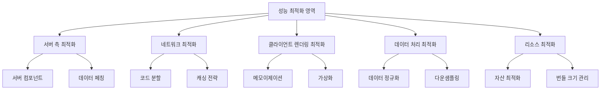

# E-Torch 성능 최적화 통합 가이드

## 1. 개요

E-Torch는 대량의 경제지표 데이터를 처리하고 시각화하는 애플리케이션으로, 성능 최적화가 핵심 요구사항입니다. 이 문서는 프로젝트 전반에 걸친 성능 최적화 전략을 통합적으로 설명합니다.

## 2. 성능 최적화 영역



## 3. 서버 측 최적화

### 3.1 서버 컴포넌트 활용

서버 컴포넌트를 통해 다음과 같은 성능 이점을 얻을 수 있습니다:

1. **초기 로드 시간 단축**: 클라이언트로 전송되는 JavaScript 양 감소
2. **SEO 최적화**: 서버에서 렌더링된 콘텐츠는 검색 엔진에 더 친화적
3. **데이터 페칭 지연 제거**: 서버와 데이터베이스 간 지연 시간 최소화

```tsx
// 효율적인 서버 컴포넌트 패턴
export default async function DashboardPage({ params }: { params: { id: string } }) {
  // 서버에서 데이터 직접 페칭
  const data = await fetchDashboardData(params.id);
  
  // 데이터 가공 및 전처리
  const processedData = processData(data);
  
  // 필요한 데이터만 클라이언트 컴포넌트로 전달
  return <DashboardClient initialData={processedData} />;
}
```

### 3.2 병렬 데이터 페칭

여러 데이터 요청을 병렬로 처리하여 대기 시간을 최소화합니다:

```tsx
// 병렬 데이터 페칭
export default async function EconomicReportPage() {
  // 여러 데이터 요청을 병렬로 실행
  const [gdpData, inflationData, interestRateData] = await Promise.all([
    fetchGDPData(),
    fetchInflationData(),
    fetchInterestRateData()
  ]);
  
  return (
    <div>
      <GDPChart data={gdpData} />
      <InflationChart data={inflationData} />
      <InterestRateChart data={interestRateData} />
    </div>
  );
}
```

### 3.3 Streaming과 Suspense 활용

중요한 콘텐츠를 먼저 표시하고 덜 중요한 부분은 로드될 때 표시합니다:

```tsx
import { Suspense } from 'react';

export default function DashboardPage() {
  return (
    <div>
      {/* 핵심 정보 우선 로드 */}
      <DashboardHeader />
      
      {/* 주요 차트는 로딩 상태와 함께 표시 */}
      <Suspense fallback={<ChartSkeleton />}>
        <MainCharts />
      </Suspense>
      
      {/* 덜 중요한 정보는 나중에 로드 */}
      <Suspense fallback={<TableSkeleton />}>
        <DataTables />
      </Suspense>
    </div>
  );
}
```

## 4. 네트워크 최적화

### 4.1 코드 분할 전략

불필요한 코드 로딩을 방지하기 위해 다양한 수준의 코드 분할을 적용합니다:

1. **페이지 수준 분할**: Next.js의 기본 페이지 분할 활용
2. **컴포넌트 수준 분할**: 대형 컴포넌트 동적 로딩
3. **기능별 분할**: 특정 기능(차트 에디터 등)을 필요 시에만 로딩

```tsx
// 동적 임포트를 사용한 차트 타입별 분할
import dynamic from 'next/dynamic';

// 기본 컴포넌트는 즉시 로드
const ChartContainer = ({ type, ...props }) => {
  // 차트 타입에 따라 동적으로 컴포넌트 로드
  const ChartComponent = useMemo(() => {
    switch (type) {
      case 'timeSeries':
        return dynamic(() => import('@/packages/charts/TimeSeriesChart'), {
          loading: () => <ChartSkeleton type="timeSeries" />,
          ssr: false // 클라이언트 사이드에서만 렌더링
        });
      case 'bar':
        return dynamic(() => import('@/packages/charts/BarChart'), {
          loading: () => <ChartSkeleton type="bar" />,
          ssr: false
        });
      // 다른 차트 타입...
      default:
        return dynamic(() => import('@/packages/charts/DefaultChart'), {
          loading: () => <ChartSkeleton />,
          ssr: false
        });
    }
  }, [type]);
  
  return <ChartComponent {...props} />;
};
```

### 4.2 요청 일괄 처리

여러 API 요청을 하나로 통합하여 네트워크 오버헤드를 줄입니다:

```tsx
// 개별 요청 (비효율적)
const fetchDashboardData = async (dashboardId) => {
  const dashboard = await fetchDashboard(dashboardId);
  const widgets = await fetchWidgets(dashboardId);
  const permissions = await fetchPermissions(dashboardId);
  // 총 3번의 네트워크 요청
  
  return { dashboard, widgets, permissions };
};

// 통합 요청 (효율적)
const fetchDashboardData = async (dashboardId) => {
  const data = await fetch(`/api/dashboards/${dashboardId}/full`);
  // 1번의 네트워크 요청으로 필요한 모든 데이터 조회
  
  return data.json();
};
```

### 4.3 효과적인 캐싱 전략

다양한 레벨의 캐싱을 통해 중복 요청을 방지합니다:

```tsx
// TanStack Query를 활용한 전략적 캐싱
function useEconomicIndicator(indicatorCode, options = {}) {
  return useQuery({
    queryKey: ['indicator', indicatorCode],
    queryFn: () => fetchIndicator(indicatorCode),
    
    // 지표 유형에 따른 최적화된 캐싱 전략
    staleTime: getStaleTimeForIndicator(indicatorCode),  // 지표별 적절한 신선도 설정
    gcTime: getGCTimeForIndicator(indicatorCode),        // 캐시 가비지 컬렉션 타이밍
    refetchOnWindowFocus: shouldRefetchIndicator(indicatorCode), // 필요한 경우에만 리페치
    
    // 초기 데이터 활용 (서버 컴포넌트에서 전달된 데이터)
    initialData: options.initialData,
  });
}

// 지표별 최적화된 캐싱 전략
function getStaleTimeForIndicator(code) {
  // 실시간성 높은 지표 (환율, 주가 등)
  if (isRealtimeIndicator(code)) {
    return 60 * 1000; // 1분
  }
  
  // 일간 지표
  if (isDailyIndicator(code)) {
    return 30 * 60 * 1000; // 30분
  }
  
  // 월간/분기/연간 지표
  return 24 * 60 * 60 * 1000; // 24시간
}
```

## 5. 클라이언트 렌더링 최적화

### 5.1 메모이제이션 전략

불필요한 리렌더링을 방지하기 위한 메모이제이션 전략을 체계적으로 적용합니다:

```tsx
// 차트 컴포넌트 최적화
const TimeSeriesChart = memo(({ data, options, width, height }) => {
  // 데이터 처리 로직 메모이제이션
  const processedData = useMemo(() => {
    return processTimeSeriesData(data);
  }, [data]);
  
  // 차트 옵션 처리 로직 메모이제이션
  const chartOptions = useMemo(() => {
    return {
      ...defaultOptions,
      ...options,
      // 옵션 가공 로직
    };
  }, [options]);
  
  // 이벤트 핸들러 메모이제이션
  const handleMouseMove = useCallback((e) => {
    // 이벤트 처리 로직
  }, []);
  
  // 특정 조건에서만 렌더링
  if (!processedData.length) {
    return <NoDataPlaceholder />;
  }
  
  return (
    <div className="chart-container">
      <LineChart
        data={processedData}
        width={width}
        height={height}
        options={chartOptions}
        onMouseMove={handleMouseMove}
      />
    </div>
  );
});
```

### 5.2 렌더링 최적화 체크리스트

| 최적화 기법 | 적용 방법 | 사용 시점 |
|------------|----------|----------|
| **React.memo** | 컴포넌트를 memo로 래핑 | props가 자주 변경되지 않는 컴포넌트 |
| **useMemo** | 계산 비용이 큰 값 메모이제이션 | 복잡한 데이터 변환, 필터링, 차트 옵션 |
| **useCallback** | 함수 참조 안정화 | 자식 컴포넌트에 전달되는 이벤트 핸들러 |
| **컴포넌트 분할** | 상태 변화에 따라 리렌더링이 필요한 부분 분리 | 상태 변화가 자주 발생하는 UI |
| **지연 평가** | 조건부 렌더링으로 불필요한 렌더링 방지 | 특정 조건에서만 표시되는 복잡한 UI |

### 5.3 가상화(Virtualization)

대량의 항목을 효율적으로 렌더링하기 위한 가상화 기법을 적용합니다:

```tsx
// react-window를 사용한 데이터 테이블 가상화
import { FixedSizeList } from 'react-window';

const DataTable = ({ data }) => {
  // 각 행 렌더링 함수
  const Row = ({ index, style }) => (
    <div style={style} className="table-row">
      <div className="table-cell">{data[index].date}</div>
      <div className="table-cell">{data[index].value}</div>
      {/* 추가 셀 */}
    </div>
  );
  
  return (
    <div className="data-table">
      <div className="table-header">
        <div className="table-cell">날짜</div>
        <div className="table-cell">값</div>
        {/* 헤더 셀 */}
      </div>
      
      <FixedSizeList
        height={400}
        width="100%"
        itemSize={40}
        itemCount={data.length}
        overscanCount={5}
      >
        {Row}
      </FixedSizeList>
    </div>
  );
};
```

## 6. 데이터 처리 최적화

### 6.1 데이터 다운샘플링

대용량 시계열 데이터를 효율적으로 처리하기 위한 다운샘플링 알고리즘을 적용합니다:

```tsx
// LTTB(Largest-Triangle-Three-Buckets) 알고리즘
const downsampleTimeSeries = (data, targetPoints) => {
  // 데이터가 목표 포인트 수보다 적으면 그대로 반환
  if (data.length <= targetPoints) {
    return data;
  }
  
  const sampled = [];
  sampled.push(data[0]); // 첫 포인트는 항상 유지
  
  const bucketSize = (data.length - 2) / (targetPoints - 2);
  
  for (let i = 0; i < targetPoints - 2; i++) {
    const startIdx = Math.floor((i) * bucketSize) + 1;
    const endIdx = Math.floor((i + 1) * bucketSize) + 1;
    
    const prevPoint = sampled[sampled.length - 1];
    const nextBucketAvg = calculateBucketAverage(data, endIdx);
    
    let maxArea = -1;
    let maxAreaIdx = startIdx;
    
    for (let j = startIdx; j < endIdx; j++) {
      const area = calculateTriangleArea(prevPoint, data[j], nextBucketAvg);
      if (area > maxArea) {
        maxArea = area;
        maxAreaIdx = j;
      }
    }
    
    sampled.push(data[maxAreaIdx]);
  }
  
  sampled.push(data[data.length - 1]); // 마지막 포인트는 항상 유지
  
  return sampled;
};
```

### 6.2 성능 중심 상태 관리

데이터 중심 애플리케이션에서 상태 관리의 성능을 최적화합니다:

1. **정규화된 상태 구조**: 중첩 객체 대신 플랫한 정규화 구조 사용
2. **선택적 구독**: 최소한의 상태만 구독하여 불필요한 리렌더링 방지
3. **지연 로딩**: 큰 데이터셋을 청크로 분할하여 필요 시 로드

```tsx
// 정규화된 Zustand 스토어
const useDashboardStore = create((set, get) => ({
  // 정규화된 상태 구조
  dashboards: {
    byId: {}, // id를 키로 사용하는 객체 맵
    allIds: [], // id 목록
  },
  widgets: {
    byId: {},
    allIds: [],
  },
  
  // 관계 매핑
  widgetsByDashboard: {},
  
  // 액션
  addDashboard: (dashboard) => set((state) => ({
    dashboards: {
      byId: {
        ...state.dashboards.byId,
        [dashboard.id]: dashboard,
      },
      allIds: state.dashboards.allIds.includes(dashboard.id)
        ? state.dashboards.allIds
        : [...state.dashboards.allIds, dashboard.id],
    },
  })),
  
  // 선택적 업데이트 - 필요한 부분만 변경
  updateWidget: (widgetId, changes) => set((state) => ({
    widgets: {
      ...state.widgets,
      byId: {
        ...state.widgets.byId,
        [widgetId]: {
          ...state.widgets.byId[widgetId],
          ...changes,
        },
      },
    },
  })),
}));

// 선택적 구독을 통한 최적화
function WidgetComponent({ widgetId }) {
  // 전체 스토어가 아닌 필요한 위젯 데이터만 구독
  const widget = useDashboardStore(
    (state) => state.widgets.byId[widgetId]
  );
  
  // widget 상태가 변경될 때만 리렌더링
  return <div>{widget.title}</div>;
}
```

## 7. 리소스 최적화

### 7.1 이미지 최적화

Next.js의 Image 컴포넌트를 활용하여 이미지를 최적화합니다:

```tsx
import Image from 'next/image';

// 최적화된 이미지 사용
export function DashboardCard({ dashboard }) {
  return (
    <div className="dashboard-card">
      <div className="thumbnail">
        <Image
          src={dashboard.thumbnail || '/images/default-thumbnail.jpg'}
          alt={dashboard.title}
          width={300}
          height={200}
          placeholder="blur"
          blurDataURL={dashboard.thumbnailBlur}
          priority={false}
        />
      </div>
      <h3>{dashboard.title}</h3>
    </div>
  );
}
```

### 7.2 폰트 최적화

Next.js의 폰트 최적화 기능을 활용합니다:

```tsx
// next.config.js
const nextConfig = {
  optimizeFonts: true,
};

// layout.js
import { Inter, JetBrains_Mono } from 'next/font/google';

// 폰트 최적화 설정
const inter = Inter({
  subsets: ['latin'],
  display: 'swap',
  variable: '--font-inter',
});

const jetbrainsMono = JetBrains_Mono({
  subsets: ['latin'],
  display: 'swap',
  variable: '--font-jetbrains-mono',
});

export default function RootLayout({ children }) {
  return (
    <html lang="en" className={`${inter.variable} ${jetbrainsMono.variable}`}>
      <body>{children}</body>
    </html>
  );
}
```

### 7.3 CSS 최적화

Tailwind CSS와 CSS 모듈의 성능을 최적화합니다:

```js
// tailwind.config.js
module.exports = {
  // 사용하지 않는 스타일 제거
  purge: [
    './pages/**/*.{js,ts,jsx,tsx}',
    './components/**/*.{js,ts,jsx,tsx}',
    './packages/**/*.{js,ts,jsx,tsx}',
  ],
  
  // 프로덕션에서 최적화
  future: {
    removeDeprecatedGapUtilities: true,
    purgeLayersByDefault: true,
  },
};
```

## 8. 성능 측정 및 모니터링

### 8.1 핵심 성능 지표

| 지표 | 목표값 | 측정 도구 |
|-----|-------|----------|
| 초기 로드 시간 (FCP) | < 1.5초 | Lighthouse, Web Vitals |
| 상호작용 시간 (TTI) | < 3.5초 | Lighthouse |
| 레이아웃 변경 (CLS) | < 0.1 | Web Vitals |
| 메모리 사용량 | < 150MB | Performance Monitor |
| 번들 크기 | 메인 번들 < 100KB | webpack-bundle-analyzer |
| 차트 렌더링 시간 | < 200ms | 사용자 정의 측정 |

### 8.2 성능 측정 통합

```tsx
// 성능 측정 훅
import { useEffect, useRef } from 'react';

export function usePerformanceMeasure(markName, dependencies = []) {
  const hasRunRef = useRef(false);
  
  useEffect(() => {
    if (!hasRunRef.current && window.performance) {
      // 측정 시작
      performance.mark(`${markName}-start`);
      
      // 리렌더링 후 측정 종료를 위해 다음 프레임으로 지연
      requestAnimationFrame(() => {
        requestAnimationFrame(() => {
          performance.mark(`${markName}-end`);
          performance.measure(
            markName,
            `${markName}-start`,
            `${markName}-end`
          );
          
          // 메트릭 수집
          const metrics = performance.getEntriesByName(markName);
          if (metrics.length) {
            console.log(`${markName} took: ${metrics[0].duration.toFixed(2)}ms`);
            
            // 개발 환경에서만 HUD 표시
            if (process.env.NODE_ENV === 'development') {
              logPerformanceMetric(markName, metrics[0].duration);
            }
            
            // 프로덕션에서는 실제 사용자 모니터링 서비스로 전송
            if (process.env.NODE_ENV === 'production' && window.sendMetric) {
              window.sendMetric(markName, metrics[0].duration);
            }
          }
          
          hasRunRef.current = true;
        });
      });
    }
  }, dependencies);
}
```

### 8.3 성능 디버깅 팁

1. **React DevTools Profiler**: 컴포넌트 렌더링 시간 분석
2. **Chrome Performance 탭**: 프레임 드롭, 자바스크립트 실행 시간 분석
3. **Memory 탭**: 메모리 누수 분석
4. **Network 탭**: 요청 크기, 중복 요청 분석
5. **Lighthouse**: 종합적인 성능 분석

## 9. 결론

E-Torch의 성능 최적화는 여러 계층에 걸쳐 일관된 전략을 적용함으로써 달성됩니다. 서버 컴포넌트와 효율적인 데이터 페칭을 통한 초기 로드 최적화, 코드 분할과 메모이제이션을 통한 클라이언트 성능 향상, 그리고 데이터 처리 알고리즘의 최적화를 통해 대량의 경제지표 데이터를 효율적으로 처리하고 시각화할 수 있습니다.

성능 최적화는 한 번에 완성되는 것이 아닌 지속적인 과정임을 명심하고, 실제 사용자 경험 데이터를 기반으로 끊임없이 개선해 나가야 합니다.
