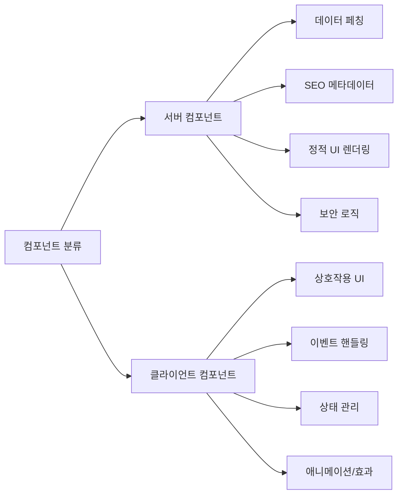

# 서버 컴포넌트 패턴 통합 가이드

## 1. 개요

이 문서는 E-Torch 프로젝트에서 사용하는 Next.js의 서버 컴포넌트(RSC) 패턴을 통합적으로 설명합니다. 서버 컴포넌트와 클라이언트 컴포넌트의 적절한 분리와 통합은 성능 최적화와 개발 효율성을 위해 중요합니다.

## 2. 서버/클라이언트 컴포넌트 구분 원칙



### 2.1 서버 컴포넌트 사용 기준

다음 조건을 만족할 때 서버 컴포넌트를 사용합니다:

- **데이터 페칭이 필요한 경우**: 데이터베이스/API에서 직접 데이터를 가져올 때
- **SEO가 중요한 페이지**: 메타데이터, OpenGraph 태그 등이 필요한 페이지
- **렌더링 비용이 높은 정적 UI**: 인터랙션이 없는 복잡한 UI
- **보안 민감 로직**: 서버에서만 실행되어야 하는 검증/인증 로직

### 2.2 클라이언트 컴포넌트 사용 기준

다음 조건을 만족할 때 클라이언트 컴포넌트를 사용합니다:

- **상호작용이 필요한 UI**: 사용자 입력, 클릭, 드래그 등
- **React 훅 사용**: useState, useEffect, useContext 등
- **브라우저 API 사용**: localStorage, navigator, window 등
- **이벤트 리스너 추가**: onClick, onChange, onSubmit 등
- **애니메이션/효과**: 트랜지션, 애니메이션, 모션 등

## 3. 핵심 패턴

### 3.1 서버 컴포넌트 래퍼 패턴

서버에서 데이터를 페칭하여 클라이언트 컴포넌트에 전달하는 패턴입니다.

```tsx
// ChartServerWrapper.tsx (서버 컴포넌트)
import { ChartComponent } from '../components/ChartComponent';

export async function ChartServerWrapper({ chartId }: { chartId: string }) {
  // 서버에서 데이터 페칭
  const data = await fetchChartData(chartId);
  
  // 페칭한 데이터와 함께 클라이언트 컴포넌트 렌더링
  return <ChartComponent initialData={data} chartId={chartId} />;
}

// ChartComponent.tsx (클라이언트 컴포넌트)
'use client';

import { useState, useEffect } from 'react';

export function ChartComponent({ 
  initialData, 
  chartId 
}: { 
  initialData: any;
  chartId: string;
}) {
  // 서버에서 받은 initialData로 상태 초기화
  const [data, setData] = useState(initialData);
  
  // 클라이언트 측 로직
  // ...
  
  return (
    <div>
      {/* 차트 렌더링 */}
    </div>
  );
}
```

### 3.2 서버 액션 통합 패턴

폼 제출, 데이터 변경 등 서버 상태를 변경하는 작업을 위한 패턴입니다.

```tsx
// actions.ts (서버 액션)
'use server';

import { revalidatePath } from 'next/cache';

export async function saveDashboard(dashboardData: any) {
  // 서버 측 유효성 검증
  if (!isValidDashboard(dashboardData)) {
    return { error: '유효하지 않은 데이터입니다.' };
  }
  
  try {
    // 데이터베이스에 저장
    const result = await db.dashboards.update(dashboardData);
    
    // 관련 경로 캐시 무효화
    revalidatePath(`/dashboard/${dashboardData.id}`);
    revalidatePath('/dashboard');
    
    return { success: true, data: result };
  } catch (error) {
    return { error: '저장 실패: ' + error.message };
  }
}

// SaveButton.tsx (클라이언트 컴포넌트)
'use client';

import { useTransition } from 'react';
import { saveDashboard } from '@/app/actions';

export function SaveButton({ dashboard }: { dashboard: any }) {
  const [isPending, startTransition] = useTransition();
  
  const handleSave = () => {
    startTransition(async () => {
      const result = await saveDashboard(dashboard);
      if (result.success) {
        // 성공 처리
      } else {
        // 오류 처리
      }
    });
  };
  
  return (
    <button 
      onClick={handleSave}
      disabled={isPending}
    >
      {isPending ? '저장 중...' : '저장'}
    </button>
  );
}
```

### 3.3 UI 컴포넌트 서버 래퍼 패턴

Shadcn/UI와 같은 클라이언트 컴포넌트를 서버 컴포넌트에서 사용하기 위한 래퍼 패턴입니다.

```tsx
// button.server.tsx (서버 래퍼)
import { Button } from '@/components/ui/button';

// 타입만 재정의하여 필요한 props만 노출
export interface ButtonServerProps {
  children: React.ReactNode;
  variant?: 'default' | 'outline' | 'secondary' | 'ghost';
  size?: 'default' | 'sm' | 'lg';
  className?: string;
}

// 서버 컴포넌트에서 사용 가능한 래퍼
export function ButtonServer(props: ButtonServerProps) {
  return <Button {...props} />;
}

// 서버 컴포넌트에서 사용 예시
export default async function AdminPage() {
  const data = await fetchAdminData();
  
  return (
    <div>
      <h1>관리자 페이지</h1>
      <ButtonServer variant="outline">
        설정
      </ButtonServer>
    </div>
  );
}
```

### 3.4 병렬 데이터 페칭 패턴

서버 컴포넌트에서 여러 데이터를 병렬로 페칭하여 성능을 최적화하는 패턴입니다.

```tsx
// DashboardPage.tsx (서버 컴포넌트)
export default async function DashboardPage({ params }: { params: { id: string } }) {
  // 여러 데이터 요청을 병렬로 실행
  const [dashboardData, userData, widgetsData] = await Promise.all([
    fetchDashboard(params.id),
    fetchUserPreferences(),
    fetchWidgets(params.id)
  ]);
  
  // 404 처리
  if (!dashboardData) {
    return notFound();
  }
  
  return (
    <div>
      <DashboardHeader 
        title={dashboardData.title} 
        createdBy={dashboardData.createdBy} 
      />
      <DashboardContent 
        dashboard={dashboardData}
        widgets={widgetsData}
        userPreferences={userData}
      />
    </div>
  );
}
```

### 3.5 스트리밍 및 Suspense 패턴

일부 데이터가 지연되더라도 UI 일부를 먼저 렌더링하는 패턴입니다.

```tsx
// DashboardPage.tsx (서버 컴포넌트)
import { Suspense } from 'react';

export default async function DashboardPage({ params }: { params: { id: string } }) {
  // 우선 필요한 기본 데이터만 페칭
  const dashboardData = await fetchDashboard(params.id);
  
  if (!dashboardData) {
    return notFound();
  }
  
  return (
    <div>
      <DashboardHeader title={dashboardData.title} />
      
      {/* 주요 콘텐츠는 바로 렌더링 */}
      <main>
        {/* 위젯 데이터는 별도로 로딩하며 로딩 상태 표시 */}
        <Suspense fallback={<WidgetsLoadingSkeleton />}>
          <DashboardWidgets dashboardId={params.id} />
        </Suspense>
        
        {/* 관련 데이터도 별도 로딩 */}
        <Suspense fallback={<RelatedDashboardsSkeleton />}>
          <RelatedDashboards dashboardId={params.id} />
        </Suspense>
      </main>
    </div>
  );
}

// DashboardWidgets.tsx (서버 컴포넌트)
export async function DashboardWidgets({ dashboardId }: { dashboardId: string }) {
  // 이 컴포넌트가 렌더링될 때 데이터 페칭
  const widgets = await fetchWidgets(dashboardId);
  
  return <WidgetsGrid widgets={widgets} />;
}
```

## 4. 컴포넌트 설계 실제 적용

### 4.1 페이지 설계

```tsx
// app/(dashboard)/dashboard/[id]/page.tsx
export default async function DashboardPage({ params }: { params: { id: string } }) {
  // 1. 서버에서 데이터 페칭
  const dashboardData = await fetchDashboardById(params.id);
  
  // 2. 에러 핸들링
  if (!dashboardData) {
    return notFound();
  }
  
  // 3. 메타데이터 설정
  const metadata = generateDashboardMetadata(dashboardData);
  
  // 4. 서버 래퍼 구성으로 클라이언트 컴포넌트에 초기 데이터 전달
  return (
    <>
      <DashboardContextProvider initialDashboard={dashboardData}>
        <DashboardHeader
          title={dashboardData.title}
          description={dashboardData.description}
        />
        <DashboardControls dashboardId={params.id} />
        <DashboardGridWrapper
          initialLayout={dashboardData.layout}
          widgets={dashboardData.widgets}
        />
      </DashboardContextProvider>
    </>
  );
}
```

### 4.2 컴포넌트 분할 전략

```
pages/
  └─ (dashboard)/
     └─ dashboard/
        └─ [id]/
           ├─ page.tsx             # 서버 컴포넌트 (데이터 페칭)
           ├─ layout.tsx           # 서버 컴포넌트 (레이아웃)
           ├─ error.tsx            # 클라이언트 컴포넌트 (오류 처리)
           └─ loading.tsx          # 서버 컴포넌트 (로딩 UI)

components/
  ├─ dashboard/
  │  ├─ server/
  │  │  ├─ DashboardHeader.tsx    # 서버 컴포넌트
  │  │  └─ DashboardFetcher.tsx   # 서버 컴포넌트 (데이터 페칭 담당)
  │  │
  │  └─ client/
  │     ├─ DashboardControls.tsx   # 클라이언트 컴포넌트 (UI 제어)
  │     ├─ DashboardGrid.tsx       # 클라이언트 컴포넌트 (상호작용)
  │     └─ DashboardContext.tsx    # 클라이언트 컴포넌트 (상태 관리)
  │
  └─ charts/
     ├─ server/
     │  └─ ChartDataFetcher.tsx    # 서버 컴포넌트 (차트 데이터 페칭)
     │
     └─ client/
        ├─ TimeSeriesChart.tsx     # 클라이언트 컴포넌트 (차트 렌더링)
        └─ ChartControls.tsx       # 클라이언트 컴포넌트 (차트 제어)
```

## 5. 모범 사례 및 안티 패턴

### 5.1 모범 사례

1. **데이터 페칭은 최상위 서버 컴포넌트에서 수행**하고 prop으로 전달
2. **서버 컴포넌트 트리 내에 클라이언트 컴포넌트 배치**, 그 반대는 불가능
3. **서버 데이터와 클라이언트 상태를 명확히 구분**하여 관리
4. **서버 컴포넌트는 쿼리 파라미터에 기반하여 조건부 렌더링** 가능
5. **클라이언트와 서버 코드를 명확히 분리**하여 번들 크기 최적화

### 5.2 안티 패턴

1. **서버/클라이언트 컴포넌트 혼합 사용**: 서버 컴포넌트를 클라이언트 컴포넌트의 자식으로 사용하면 서버 컴포넌트가 클라이언트 컴포넌트로 변환됨
2. **클라이언트 측 이벤트 핸들러를 서버 컴포넌트에 추가**: 서버 컴포넌트에는 이벤트 핸들러를 추가할 수 없음
3. **서버 컴포넌트에서 훅 사용**: useState, useEffect 등의 훅은 서버 컴포넌트에서 사용 불가
4. **컴포넌트 간 과도한 props 전달**: 많은 props를 전달하는 대신 컨텍스트나 상태 관리 도구 활용
5. **지나친 세분화**: 모든 작은 컴포넌트를 서버/클라이언트로 분리하면 복잡성 증가

## 6. 성능 최적화 전략

1. **서버 컴포넌트 캐싱**: fetch 요청의 캐시 전략 적용
2. **스트리밍 활용**: Suspense를 사용하여 중요 UI를 먼저 표시
3. **프리페칭**: 사용자의 다음 액션 예측하여 미리 데이터 로드
4. **점진적 렌더링**: 초기 로드는 최소한의 필수 컴포넌트만 포함
5. **클라이언트 상태 최소화**: 필요한 상태만 클라이언트에서 관리

## 7. 디버깅 및 문제 해결

### 7.1 일반적인 문제와 해결책

| 문제 | 원인 | 해결책 |
|-----|------|-------|
| "useState can only be used in Client Components" | 서버 컴포넌트에서 훅 사용 | 해당 로직을 클라이언트 컴포넌트로 이동 |
| "Client Component cannot be rendered by Server Component" | 서버 컴포넌트 안에서 클라이언트 컴포넌트 함수 호출 | 클라이언트 컴포넌트를 JSX 형태로 사용 |
| 서버 액션이 동작하지 않음 | 서버 액션을 클라이언트 컴포넌트에서 정의 | 서버 액션을 별도 파일로 분리 |
| 예상보다 큰 클라이언트 번들 크기 | 서버/클라이언트 컴포넌트 경계 잘못 설정 | 컴포넌트 분할 전략 재검토 |

### 7.2 디버깅 도구

1. **React DevTools**: 컴포넌트 트리와 props 흐름 분석
2. **Next.js 개발 서버 로그**: 서버 컴포넌트 렌더링 로그 확인
3. **Network 탭**: 서버 컴포넌트 스트리밍 분석
4. **크롬 퍼포먼스 탭**: 클라이언트 측 렌더링 성능 분석

## 8. 결론

서버 컴포넌트와 클라이언트 컴포넌트의 효과적인 분리와 통합은 E-Torch 프로젝트의 성능과 개발 효율성을 크게 향상시킵니다. 이 가이드에서 설명한 패턴을 따르면 데이터 페칭, 렌더링, 상호작용이 최적화된 애플리케이션을 구축할 수 있습니다.

데이터 중심 애플리케이션인 E-Torch에서는 특히 서버 컴포넌트를 통한 효율적인 데이터 페칭과 클라이언트 컴포넌트를 통한 풍부한 상호작용 UI를 적절히 조합하는 것이 중요합니다.
