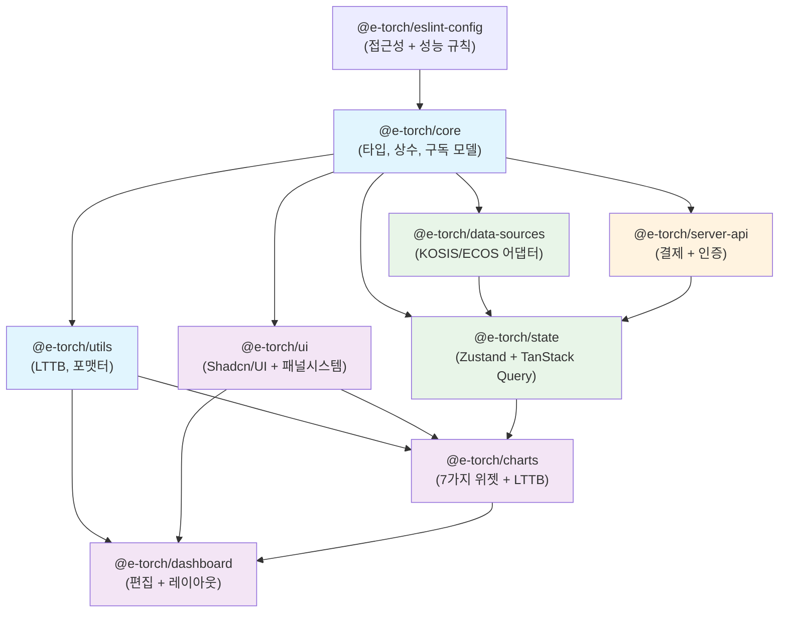
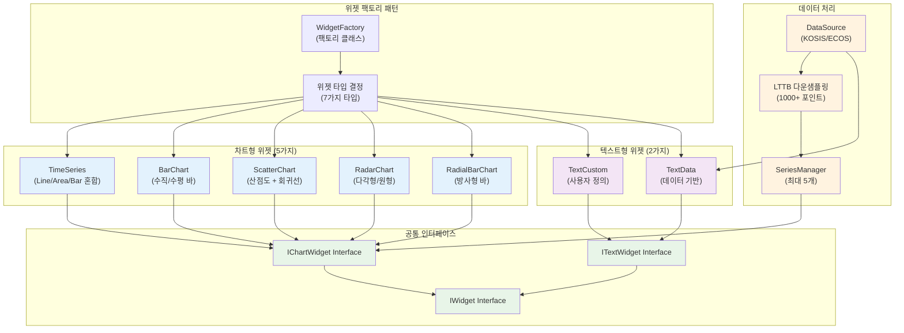
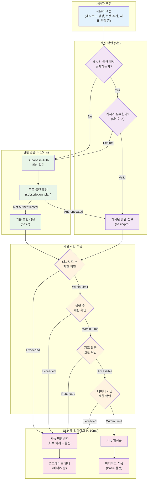

# E-Torch 프론트엔드 아키텍처 가이드

## 1. 아키텍처 개요

### 1.1 E-Torch 특화 제약사항

| 도메인 특성 | 기술적 제약 | 구현 방법 |
|------------|------------|----------|
| **KOSIS/ECOS 통합** | 이기종 API + 구독 플랜별 제한 | 어댑터 패턴 + UI 제한 |
| **1000+ 데이터 포인트** | 메모리 200MB 제한 | LTTB 다운샘플링 |
| **구독 모델** | 권한 검증 < 10ms | 클라이언트 캐시 5분 |
| **7가지 위젯 타입** | 차트 5개 + 텍스트 2개 | 팩토리 패턴 |
| **토스페이먼츠 빌링** | 자동 갱신 구독 | SDK v2 + 빌링키 |

### 1.2 핵심 성능 목표

| 기능 | 목표값 | 측정 기준 |
|------|--------|----------|
| 차트 렌더링 | < 2초 | 1000포인트 시계열 |
| 편집 반응성 | 60fps | 드래그 200ms + 리사이즈 300ms |
| 메모리 사용량 | < 200MB | 대시보드당 |
| 권한 검증 | < 10ms | 플랜별 기능 제한 |

## 2. 기술 스택

### 2.1 핵심 기술

| 영역 | 기술 | 버전 | E-Torch 특화 설정 |
|------|------|------|------------------|
| **모노레포** | Turborepo + pnpm | 2.5.3 + 10.11.0 | 9패키지 분할 |
| **프레임워크** | Next.js + React | 15.3.2 + 19.1.0 | App Router + useOptimistic |
| **UI** | Tailwind CSS + Shadcn/UI | 4.1.7 + latest | CSS-first, OKLCH 색상 |
| **상태관리** | Zustand + TanStack Query | 5.0.5 + 5.77.0 | 서버/클라이언트 분리 |
| **차트** | Recharts | 2.15.3 | LTTB + 7가지 위젯 |
| **레이아웃** | react-grid-layout | 1.5.1 | 200ms/300ms 디바운싱 |
| **인증** | Supabase Auth | v2 | SNS 3개 + 구독 모델 |
| **결제** | 토스페이먼츠 SDK v2 | latest | 통합 SDK + 빌링키 |

### 2.2 Tailwind CSS 4 핵심 설정

```css
@theme {
  /* E-Torch 브랜드 색상 (OKLCH) */
  --color-primary: oklch(0.2 0.15 240);     /* #0c1e3e */
  --color-secondary: oklch(0.5 0.2 230);    /* #1a56db */
  --color-tertiary: oklch(0.45 0.18 220);   /* #0284c7 */
  
  /* 반응형 레이아웃 */
  --header-desktop: 80px; --header-tablet: 72px; --header-mobile: 64px;
  --sidebar-width: 200px; --sidebar-collapsed: 60px;
  --widget-min-desktop: 300px 200px; --widget-min-tablet: 250px 180px;
  
  /* 성능 최적화 디바운싱 */
  --debounce-drag: 200ms; --debounce-resize: 300ms;
  
  /* 터치 최적화 */
  --touch-target: 44px; --touch-spacing: 8px;
}
```

## 3. 아키텍처 계층 구조

### 3.1 서버/클라이언트 컴포넌트 분리

| 컴포넌트 유형 | 책임 | 구현 방식 |
|-------------|------|----------|
| **서버 컴포넌트** | 권한 확인, 메타데이터, 초기 데이터 | App Router RSC |
| **클라이언트 컴포넌트** | 차트 렌더링, 편집, 상태 관리 | "use client" |
| **서버 액션** | 결제, 구독 관리, 데이터 변경 | "use server" |

### 3.2 7가지 위젯 시스템

| 위젯 타입 | 데이터 소스 필요 | 최대 시리즈 | 구현 클래스 |
|----------|----------------|------------|------------|
| time-series | ✅ | 5개 | TimeSeriesWidget |
| bar-chart | ✅ | 5개 | BarChartWidget |
| scatter-chart | ✅ | 5개 | ScatterChartWidget |
| radar-chart | ✅ | 5개 | RadarChartWidget |
| radial-bar-chart | ✅ | 5개 | RadialBarChartWidget |
| text-custom | ❌ | - | TextCustomWidget |
| text-data | ✅ | 1개 | TextDataWidget |

## 4. 모노레포 구조 (9패키지)

### 4.1 패키지 구조

| 패키지 | 주요 책임 | 핵심 export | 특화 기능 |
|--------|----------|-------------|----------|
| @e-torch/core | 타입, 상수, 구독 모델 | PLAN_LIMITS, 위젯 타입 | 구독 모델 제한사항 |
| @e-torch/utils | LTTB, 포맷터, 유틸리티 | useLTTBSampling | 1000+ 포인트 다운샘플링 |
| @e-torch/ui | Shadcn/UI + 패널 시스템 | AccessibleChart, ResizablePanel | WCAG 2.1 AA + 위젯 에디터 패널 |
| @e-torch/data-sources | KOSIS/ECOS 어댑터 | useDataSource | 플랜별 지표 필터링 |
| @e-torch/state | Zustand + TanStack Query | useGlobalState | 서버/클라이언트 분리 |
| @e-torch/charts | 7가지 위젯 + LTTB | WidgetFactory | 위젯 팩토리 패턴 |
| @e-torch/dashboard | 편집 + 레이아웃 | DashboardEditor | react-grid-layout |
| @e-torch/server-api | 결제 + 인증 + 서버액션 | PaymentActions | 토스페이먼츠 SDK v2 |
| @e-torch/eslint | 접근성 + 성능 규칙 | eslintConfig | jsx-a11y 규칙 |

### 4.2 패키지 의존성 그래프



### 4.3 편집 모드 상태 머신


### 4.4 데이터 플로우 아키텍처

```mermaid
graph LR
    subgraph "데이터 소스"
        KOSIS["KOSIS API<br/>(M,Q,A 주기)<br/>자체 DB 저장"]
        ECOS["ECOS API<br/>(D,M,Q,A 주기)<br/>자체 DB 저장"]
        OECD["OECD API<br/>(향후 확장)<br/>현재 비활성화"]
    end
    
    subgraph "어댑터 레이어"
        KOSISAdapter["KOSIS 어댑터<br/>응답 정규화"]
        ECOSAdapter["ECOS 어댑터<br/>응답 정규화"]
        OECDAdapter["OECD 어댑터<br/>(미구현)"]
    end
    
    subgraph "데이터 처리"
        Validator["데이터 검증<br/>(구독 플랜별 제한)"]
        Transformer["데이터 변환<br/>(원본값/변화율/누적값)"]
        LTTB["LTTB 다운샘플링<br/>(1000+ 포인트 임계값)"]
    end
    
    subgraph "캐싱 레이어"
        APICache["API 응답 캐시<br/>(15분)"]
        ComputeCache["계산 결과 캐시<br/>(30분)"]
        HistoryCache["과거 데이터 캐시<br/>(24시간)"]
    end
    
    subgraph "차트 렌더링"
        Recharts["Recharts<br/>(시각화)"]
        AccessibleChart["접근성 차트<br/>(WCAG 2.1 AA)"]
        DataTable["데이터 테이블<br/>(스크린 리더용)"]
    end
    
    subgraph "구독 모델 필터링"
        PlanFilter["플랜별 지표 필터<br/>(Basic: 20개, Pro: 40개)"]
        PeriodFilter["기간 제한 필터<br/>(Basic: 3년, Pro: 무제한)"]
    end
    
    KOSIS --> KOSISAdapter
    ECOS --> ECOSAdapter
    OECD --> OECDAdapter
    
    KOSISAdapter --> Validator
    ECOSAdapter --> Validator
    OECDAdapter --> Validator
    
    Validator --> PlanFilter
    PlanFilter --> PeriodFilter
    PeriodFilter --> Transformer
    
    Transformer --> LTTB
    LTTB --> APICache
    APICache --> ComputeCache
    ComputeCache --> HistoryCache
    
    HistoryCache --> Recharts
    Recharts --> AccessibleChart
    AccessibleChart --> DataTable
    
    classDef source fill:#e3f2fd
    classDef adapter fill:#f3e5f5
    classDef process fill:#e8f5e8
    classDef cache fill:#fff3e0
    classDef render fill:#fce4ec
    classDef filter fill:#f1f8e9
    
    class KOSIS,ECOS,OECD source
    class KOSISAdapter,ECOSAdapter,OECDAdapter adapter
    class Validator,Transformer,LTTB process
    class APICache,ComputeCache,HistoryCache cache
    class Recharts,AccessibleChart,DataTable render
    class PlanFilter,PeriodFilter filter
```



### 4.5 위젯 시스템 아키텍처



## 5. 성능 최적화

### 5.1 핵심 성능 목표

| 지표 | 목표값 | 측정 방법 | 구현 방법 |
|------|--------|----------|----------|
| **LCP** | < 2.5초 | Web Vitals API | 스켈레톤 UI + 지연 로딩 |
| **FID** | < 100ms | Web Vitals API | debounce 200ms/300ms |
| **CLS** | < 0.1 | Web Vitals API | 스켈레톤 UI 크기 고정 |
| **차트 렌더링** | < 2초 | Performance API | LTTB 1000+ 임계값 |
| **메모리 사용량** | < 200MB | Performance API | 위젯 언마운트 시 정리 |

### 5.2 차트 렌더링 최적화

| 조건 | 임계값 | 최적화 방법 | 구현 위치 |
|------|--------|------------|----------|
| 데이터 포인트 | 1000+ | LTTB 다운샘플링 | @e-torch/charts |
| 위젯 개수 | 20+ | react-window 가상화 | @e-torch/dashboard |
| 편집 모드 | 드래그/리사이즈 중 | 차트 렌더링 비활성화 | 편집 컴포넌트 |
| 메모리 사용 | 200MB+ | 컴포넌트 언마운트 시 정리 | useEffect cleanup |

## 6. 구독 모델 + 토스페이먼츠

### 6.1 권한 검증 (< 10ms 캐싱)

| 검증 항목 | 캐시 시간 | 구현 방법 |
|----------|----------|----------|
| 세션 정보 | 5분 | TanStack Query staleTime |
| 구독 플랜 | 5분 | Zustand 상태 + API |
| 기능 권한 | 실시간 | 클라이언트 계산 |

### 6.2 플랜별 제한

| 기능 | Basic (무료) | Pro (유료) | 기술 구현 |
|------|-------------|-----------|----------|
| **대시보드 수** | 3개 | 무제한 | DB 제약 + UI 진행바 |
| **위젯 수** | 6개/대시보드 | 무제한 | react-grid-layout 제한 |
| **경제지표** | 20개 (KOSIS 12개 + ECOS 8개) | 40개 (KOSIS 12개 + ECOS 28개) | 프론트엔드 필터링 |
| **데이터 기간** | 최근 3년 | 전체 기간 | DatePicker 비활성화 |
| **워터마크** | "E-Torch로 제작됨" | 제거 가능 | CSS 오버레이 |
| **대시보드 복사** | 불가 | 가능 | 버튼 비활성화 |
| **임베드 코드** | 불가 | 가능 | Pro 전용 기능 |

### 6.3 구독 모델 권한 검증 플로우



## 7. 에러 바운더리 아키텍처

### 7.1 계층별 에러 처리

| 계층 | 에러 유형 | 처리 방법 | Fallback UI |
|------|----------|----------|------------|
| **차트 레벨** | 렌더링 실패, LTTB 오류 | ChartErrorBoundary | 에러 메시지 + 재시도 |
| **위젯 레벨** | 데이터 로딩 실패 | WidgetErrorBoundary | 스켈레톤 + 오류 아이콘 |
| **대시보드 레벨** | 레이아웃 오류, 권한 오류 | DashboardErrorBoundary | 부분 복구 + 전체 재로드 |
| **앱 레벨** | 예상치 못한 오류 | RootErrorBoundary | 전체 앱 재시작 |

## 8. 타입 안전성 시스템

### 8.1 핵심 타입 정의

| 타입 분류 | 주요 타입 | 용도 |
|----------|----------|-----|
| **위젯 타입** | WidgetType, WidgetProps<T> | 위젯별 props 타입 안전성 |
| **구독 플랜** | SubscriptionPlan, PlanLimits<T> | 플랜별 제한사항 타입 |
| **데이터 소스** | DataSourceType, DataPeriod | API 호출 타입 안전성 |

## 9. 워터마크 + 접근성

### 9.1 워터마크 시스템

| 플랜 | 워터마크 표시 | 내보내기 품질 | 구현 방법 |
|------|-------------|-------------|----------|
| **Basic** | "E-Torch로 제작됨" 우하단 | 1.6배율 + 워터마크 | CSS 오버레이 |
| **Pro** | 제거 가능 | 2.0배율 고품질 | 조건부 렌더링 |

### 9.2 WCAG 2.1 AA 접근성

| 요구사항 | 구현 방법 | 검증 도구 |
|----------|----------|----------|
| 차트 대체 텍스트 | aria-label + 데이터 테이블 | axe-core |
| 키보드 네비게이션 | tabindex, Arrow키 지원 | 수동 테스트 |
| 색상 대비 4.5:1 | OKLCH 기반 자동 검증 | Colour Contrast Analyser |
| 터치 타겟 44×44px | min-w/h-[44px] 클래스 | 시각적 확인 |

## 10. 모바일 최적화

### 10.1 편집 기능 제한

| 화면 크기 | 드래그 | 리사이즈 | 크기 조절 방법 |
|----------|-------|---------|-------------|
| **데스크톱 1200px+** | ✅ 지원 | ✅ 핸들 | 모서리 드래그 |
| **태블릿 768-1199px** | ✅ 지원 | ✅ 확대 핸들 | 터치 최적화 핸들 (48×48px) |
| **모바일 ~767px** | ✅ 지원 | ❌ 비활성화 | 속성 패널 프리셋만 |

### 10.2 터치 인터페이스 최적화

| 설정 | 값 | 적용 범위 |
|------|----|---------|
| 터치 타겟 | 44×44px | 모든 버튼, 링크 |
| 터치 간격 | 8px | 인접 요소 |
| 드래그 핸들 | 48×48px | 위젯 이동 핸들 |
| 스와이프 감지 | 100px 이동 | 대시보드 네비게이션 |

## 11. 개발 도구 설정

### 11.1 성능 모니터링

| 지표 | 목표값 | 경고 임계값 | 에러 임계값 |
|------|--------|------------|-----------|
| LCP | < 2.5초 | > 3초 | > 5초 |
| FID/INP | < 200ms | > 300ms | > 500ms |
| CLS | < 0.1 | > 0.2 | > 0.3 |
| 메모리 | < 200MB | > 250MB | > 300MB |

### 11.2 ESLint 핵심 규칙

| 규칙 분류 | 주요 규칙 | 목적 |
|----------|----------|------|
| **접근성** | jsx-a11y/alt-text, jsx-a11y/aria-label | WCAG 준수 |
| **성능** | react-hooks/exhaustive-deps | 불필요한 리렌더링 방지 |
| **타입 안전성** | @typescript-eslint/no-unused-vars | 코드 품질 |
