# E-Torch 프론트엔드 모노레포 아키텍처 고급 설계서

## 1. 개요

E-Torch는 다양한 출처(KOSIS, ECOS, OECD)의 경제지표 데이터를 통합하여 시각화하는 대시보드 서비스입니다. 본 문서는 E-Torch의 프론트엔드 아키텍처를 모노레포 구조로 설계하며, 특히 Next.js의 서버/클라이언트 컴포넌트 분리 전략과 차트 컴포넌트, 대시보드 시스템 등의 핵심 기능을 모듈화하고 확장 가능한 아키텍처를 제시합니다.

### 1.1 프로젝트 목표

- 다양한 출처의 경제지표 데이터를 통합 제공
- 사용자 맞춤형 대시보드를 통한 경제지표 시각화 및 인사이트 도출
- 전문가와 일반 사용자 모두를 위한 경제데이터 접근성 향상
- 직관적이고 유연한 차트 컴포넌트와 에디터 기능 제공

### 1.2 설계 원칙

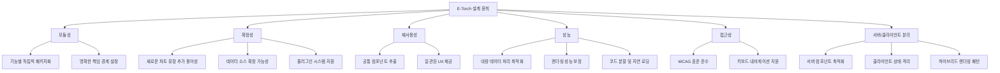

## 2. 기술 스택

| 영역 | 기술 | 선정 이유 | 버전 |
|------|------|----------|------|
| **모노레포 관리** | Turborepo | 빌드 캐싱, 병렬 실행, 의존성 관리 기능 우수, pnpm 호환성 | 2.0.0+ |
| **패키지 관리** | pnpm | 디스크 공간 절약, 의존성 중복 설치 방지, 모노레포 지원 우수 | 8.0.0+ |
| **프레임워크** | React + Next.js | App Router 지원, 서버 컴포넌트 제공, 최신 기능 활용 | React 19, Next.js 15 |
| **UI 프레임워크** | Shadcn/UI + Tailwind CSS | 커스터마이징 용이성, 생산성 향상, 확장성 | Tailwind CSS 4 |
| **상태 관리** | Zustand (클라이언트 상태)<br>Tanstack Query (서버 상태) | 단순한 API, 성능 최적화, 상태 로직 분리 | Zustand 5, Tanstack Query 5 |
| **차트 라이브러리** | Recharts | React 친화적, 유연한 커스터마이징, 높은 성능 | 2.10.1+ |
| **대시보드 레이아웃** | react-grid-layout | 드래그 앤 드롭, 리사이징 지원, 반응형 레이아웃 | 1.4.0+ |
| **타입 검사** | TypeScript | 타입 안정성, 개발 생산성 향상, 오류 감소 | 5.5+ |
| **폼 관리** | React Hook Form + Zod | 성능 최적화, 선언적 유효성 검사, 타입 안전성 | React Hook Form 7, Zod 3 |
| **코드 품질 관리** | ESLint + Prettier | 일관된 코드 스타일, 잠재적 오류 감지 | ESLint 9, Prettier 3 |
| **테스트** | Vitest + Testing Library + Playwright | 단위/통합/E2E 테스트 도구 | Vitest 1, Playwright 1.40+ |
| **문서화** | Storybook | 컴포넌트 문서화, 시각적 테스트, 개발자 협업 용이성 | 8.0+ |

## 3. 아키텍처 계층 구조

E-Torch 프론트엔드 아키텍처는 여러 계층으로 구성되어 관심사를 명확히 분리합니다.


### 3.1 서버/클라이언트 컴포넌트 분리 전략

Next.js App Router를 활용한 서버/클라이언트 컴포넌트 경계를 명확히 구분합니다.

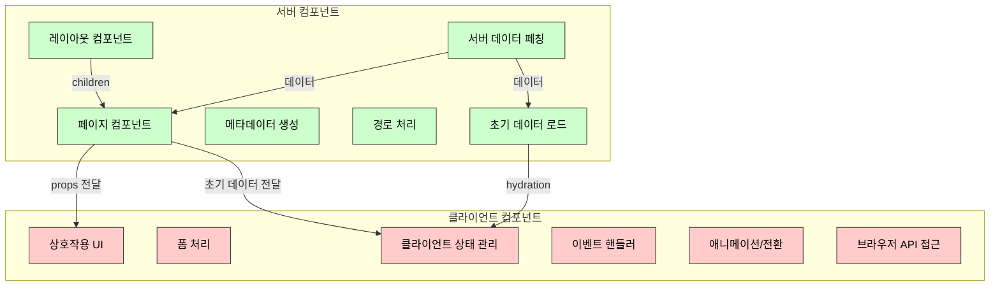

#### 서버 컴포넌트 (RSC) 사용 지침

서버 컴포넌트는 다음과 같은 경우에 사용합니다:

- 데이터 페칭 및 데이터베이스 접근이 필요한 경우
- 서버 측 API에 직접 접근해야 하는 경우
- 민감한 정보(API 키, 토큰 등)가 필요한 경우
- 대용량 의존성을 클라이언트로 전송하지 않아도 되는 경우

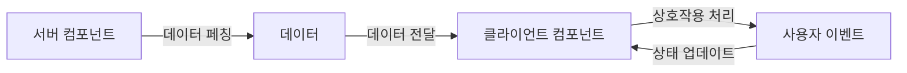

#### 클라이언트 컴포넌트 사용 지침

클라이언트 컴포넌트는 다음과 같은 경우에 사용합니다:

- 사용자 이벤트 처리가 필요한 경우 (onClick, onChange 등)
- useState, useEffect 등 React 훅을 사용해야 하는 경우
- 브라우저 전용 API를 사용해야 하는 경우
- 생명주기 이벤트가 필요한 경우

#### 하이브리드 패턴

서버/클라이언트 컴포넌트를 효과적으로 조합하는 패턴:

```bash
app/
  ├── dashboard/
  │   ├── [id]/
  │   │   ├── page.tsx                # 서버 컴포넌트 (페이지)
  │   │   ├── DashboardClient.tsx     # 클라이언트 컴포넌트
  │   │   └── ChartContainer.tsx      # 클라이언트 컴포넌트
  │   └── layout.tsx                  # 서버 컴포넌트 (레이아웃)
  ├── chart-editor/
  │   ├── [id]/
  │   │   ├── page.tsx                # 서버 컴포넌트 (페이지)
  │   │   ├── EditorClient.tsx        # 클라이언트 컴포넌트
  │   │   └── ChartPreview.tsx        # 클라이언트 컴포넌트
  │   └── layout.tsx                  # 서버 컴포넌트 (레이아웃)
```

## 4. 모노레포 패키지 구조 설계

### 4.1 패키지 구조

```mermaid
graph TD
    A[e-torch] --> B[apps/]
    A --> C[packages/]
    
    B --> B1[web]
    B --> B2[docs]
    
    C --> C1[core]
    C --> C2[charts]
    C --> C3[dashboard]
    C --> C4[data-sources]
    C --> C5[ui]
    C --> C6[utils]
    C --> C7[state]
    C --> C8[server-api]
    
    C1 --> C1A[타입 정의]
    C1 --> C1B[상수]
    C1 --> C1C[기본 인터페이스]
    
    C2 --> C2A[차트 렌더러]
    C2 --> C2B[차트 에디터]
    C2 --> C2C[차트 옵션]
    
    C3 --> C3A[대시보드 그리드]
    C3 --> C3B[대시보드 관리]
    C3 --> C3C[레이아웃 시스템]
    
    C4 --> C4A[데이터 커넥터]
    C4 --> C4B[데이터 변환]
    C4 --> C4C[쿼리 관리]
    
    C5 --> C5A[기본 컴포넌트]
    C5 --> C5B[폼 컴포넌트]
    C5 --> C5C[레이아웃 컴포넌트]
    
    C6 --> C6A[포맷터]
    C6 --> C6B[유효성 검사]
    C6 --> C6C[헬퍼 함수]
    
    C7 --> C7A[Zustand 스토어]
    C7 --> C7B[Tanstack Query 훅]
    C7 --> C7C[컨텍스트 제공자]
    
    C8 --> C8A[API 경로]
    C8 --> C8B[미들웨어]
    C8 --> C8C[서버 액션]
    
    classDef server fill:#ccffcc,stroke:#333,stroke-width:1px,color:#000;
    classDef client fill:#ffcccb,stroke:#333,stroke-width:1px,color:#000;
    classDef shared fill:#ffffcc,stroke:#333,stroke-width:1px,color:#000;
    
    class C8,C8A,C8B,C8C server;
    class C7,C7A,C7B,C7C client;
    class C1,C1A,C1B,C1C,C2,C2A,C2B,C2C,C3,C3A,C3B,C3C,C4,C4A,C4B,C4C,C5,C5A,C5B,C5C,C6,C6A,C6B,C6C shared;
```

### 4.2 패키지 의존성 구조 상세

각 패키지 간의 의존성을 명확하게 정의하여 순환 의존성을 방지하고 패키지의 책임을 명확히 합니다.

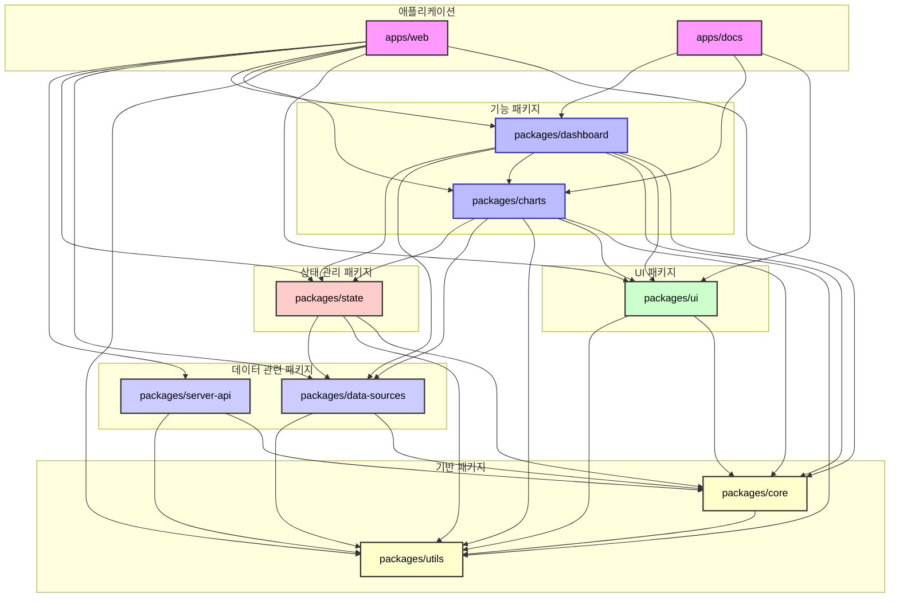

### 4.3 패키지별 서버/클라이언트 컴포넌트 구분

각 패키지에서 서버/클라이언트 컴포넌트를 명확히 구분하는 디렉토리 구조와 네이밍 규칙:

```bash
packages/
├── ui/
│   ├── src/
│   │   ├── server/          # 서버 컴포넌트
│   │   ├── client/          # 클라이언트 컴포넌트
│   │   └── shared/          # 서버/클라이언트 모두에서 사용 가능한 컴포넌트
├── charts/
│   ├── src/
│   │   ├── server/          # 서버 컴포넌트 (초기 데이터 로드, SSR용)
│   │   ├── client/          # 클라이언트 컴포넌트 (인터랙티브 차트)
│   │   └── shared/          # 공유 타입 및 유틸리티
├── dashboard/
│   ├── src/
│   │   ├── server/          # 서버 컴포넌트 (대시보드 초기 데이터)
│   │   ├── client/          # 클라이언트 컴포넌트 (인터랙티브 대시보드)
│   │   └── shared/          # 공유 타입 및 유틸리티
```

또한 파일 네이밍 규칙을 통해 서버/클라이언트 컴포넌트를 구분:

- 클라이언트 컴포넌트: `*.client.tsx`
- 서버 컴포넌트: `*.server.tsx`
- 공유 컴포넌트: `*.tsx`

### 4.4 페이지 라우팅 및 레이아웃 설계

Next.js App Router를 활용한 페이지 라우팅 및 레이아웃 구조:

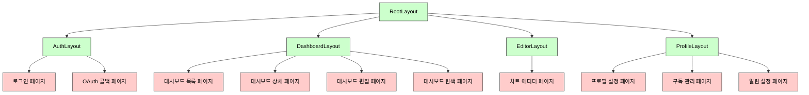

## 5. 핵심 패키지 상세 설계

### 5.1 `packages/core`

`core` 패키지는 타입 정의, 상수, 공통 인터페이스를 제공합니다. 이 패키지는 다른 모든 패키지의 기반이 되며, 순환 의존성을 방지하기 위해 다른 패키지에 의존하지 않아야 합니다.

#### 5.1.1 타입 시스템 설계

```typescript
// packages/core/src/types/index.ts

// 사용자 관련 타입
export interface User {
  id: string;
  email: string;
  name: string;
  avatar?: string;
  role: 'user' | 'admin';
  createdAt: string;
  updatedAt: string;
}

// 시간 범위 관련 타입
export type TimeRangePreset = '1D' | '7D' | '1M' | '3M' | '6M' | '1Y' | '5Y' | 'YTD' | 'custom';

export interface TimeRange {
  from: string;        // ISO 날짜 문자열
  to: string;          // ISO 날짜 문자열
  preset?: TimeRangePreset;
}

// 데이터 관련 타입
export type DataSource = 'KOSIS' | 'ECOS' | 'OECD';
export type Period = 'D' | 'M' | 'Q' | 'A';

export interface DataPoint {
  date: string;        // ISO 날짜 문자열
  value: number;
  [key: string]: any;  // 추가 메타데이터
}

export interface Series {
  id: string;
  name: string;
  data: DataPoint[];
  color?: string;
  yAxisId?: 'primary' | 'secondary';
}

// 차트 관련 타입
export type ChartType = 
  | 'timeSeries' 
  | 'bar' 
  | 'scatter' 
  | 'radar' 
  | 'radialBar' 
  | 'text';

export interface ChartConfig {
  id: string;
  type: ChartType;
  title: string;
  description?: string;
  dataConfig: {
    queries: DataQuery[];
    timeRange: TimeRange;
    refreshInterval?: number;
  };
  options: Record<string, any>;  // 차트 유형별 옵션
}

// 대시보드 관련 타입
export interface DashboardItem {
  id: string;
  type: 'chart' | 'text';
  config: ChartConfig | TextConfig;
  gridPos: {
    x: number;
    y: number;
    w: number;
    h: number;
  };
}

export interface Dashboard {
  id: string;
  title: string;
  description?: string;
  createdBy: string;
  createdAt: string;
  updatedAt: string;
  isPublic: boolean;
  timeRange?: TimeRange;
  refreshInterval?: number;
  items: DashboardItem[];
  layouts: {
    [breakpoint: string]: any[];  // react-grid-layout 레이아웃
  };
}
```

### 5.2 `packages/charts`

`charts` 패키지는 차트 렌더링 및 편집을 위한 컴포넌트를 제공합니다. 서버/클라이언트 컴포넌트 경계를 명확히 구분합니다.

#### 5.2.1 차트 컴포넌트 아키텍처

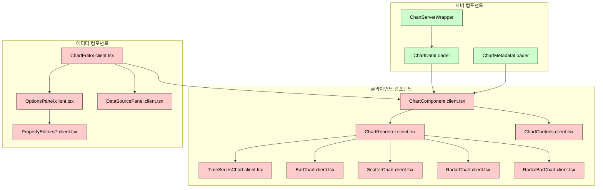

#### 5.2.2 서버 컴포넌트와 클라이언트 컴포넌트 인터페이스

서버 컴포넌트와 클라이언트 컴포넌트 간의 인터페이스 설계:

```typescript
// 서버 컴포넌트
// packages/charts/src/server/ChartServerWrapper.tsx
import { ChartConfig } from '@e-torch/core';
import { ChartComponent } from '../client/ChartComponent.client';
import { fetchChartData } from './data-fetchers';

interface ChartServerWrapperProps {
  chartId: string;
  config: ChartConfig;
  initialTimeRange?: TimeRange;
}

export async function ChartServerWrapper({ 
  chartId, 
  config,
  initialTimeRange
}: ChartServerWrapperProps) {
  // 서버에서 데이터 페칭
  const initialData = await fetchChartData(config, initialTimeRange);
  
  // 클라이언트 컴포넌트로 초기 데이터 전달
  return (
    <ChartComponent
      chartId={chartId}
      config={config}
      initialData={initialData}
      initialTimeRange={initialTimeRange}
    />
  );
}

// 클라이언트 컴포넌트
// packages/charts/src/client/ChartComponent.client.tsx
'use client';

import { useState, useEffect } from 'react';
import { useQuery } from '@tanstack/react-query';
import { ChartConfig, TimeRange } from '@e-torch/core';
import { ChartRenderer } from './ChartRenderer.client';
import { ChartControls } from './ChartControls.client';

interface ChartComponentProps {
  chartId: string;
  config: ChartConfig;
  initialData?: any;
  initialTimeRange?: TimeRange;
  isEditable?: boolean;
}

export function ChartComponent({
  chartId,
  config,
  initialData,
  initialTimeRange,
  isEditable = false
}: ChartComponentProps) {
  const [timeRange, setTimeRange] = useState(initialTimeRange || config.dataConfig.timeRange);
  
  // 초기 데이터 활용 후 필요 시 새로운 데이터 페칭
  const { data, isLoading, error } = useQuery({
    queryKey: ['chart-data', chartId, timeRange],
    queryFn: () => fetchChartDataClient(config, timeRange),
    initialData: initialData
  });
  
  // 나머지 클라이언트 측 로직...
  
  return (
    <div className="chart-component">
      {isEditable && (
        <ChartControls
          timeRange={timeRange}
          onTimeRangeChange={setTimeRange}
        />
      )}
      
      <ChartRenderer
        type={config.type}
        data={data}
        options={config.options}
        isLoading={isLoading}
        error={error}
      />
    </div>
  );
}
```

### 5.3 `packages/dashboard`

`dashboard` 패키지는 대시보드 그리드 및 관리 기능을 제공합니다. 서버/클라이언트 컴포넌트 경계를 명확히 구분합니다.

#### 5.3.1 대시보드 컴포넌트 아키텍처

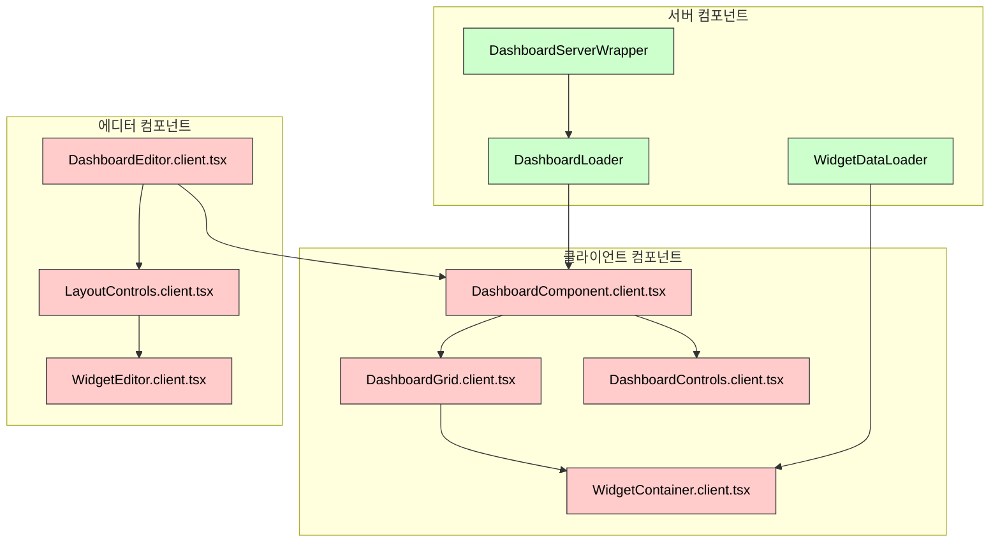

### 5.4 `packages/state`

`state` 패키지는 상태 관리 로직을 제공합니다. Zustand를 사용한 클라이언트 상태와 Tanstack Query를 사용한 서버 상태를 관리합니다.

#### 5.4.1 상태 관리 계층 구조

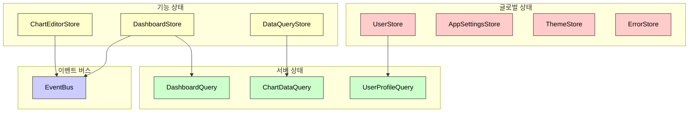

#### 5.4.2 Zustand 스토어 설계

```typescript
// packages/state/src/stores/chart-editor-store.ts
import { create } from 'zustand';
import { persist, devtools } from 'zustand/middleware';
import { immer } from 'zustand/middleware/immer';
import { ChartConfig, ChartType } from '@e-torch/core';

interface ChartEditorState {
  // 현재 편집 중인 차트 데이터
  chartId: string | null;
  config: ChartConfig | null;
  isDirty: boolean;
  history: ChartConfig[];
  historyIndex: number;
  
  // 액션
  initializeEditor: (chartId: string, config: ChartConfig) => void;
  updateChartType: (type: ChartType) => void;
  updateTitle: (title: string) => void;
  updateOptions: (path: string, value: any) => void;
  updateDataQuery: (queryIndex: number, update: Partial<DataQuery>) => void;
  addDataQuery: () => void;
  removeDataQuery: (queryIndex: number) => void;
  updateTimeRange: (timeRange: TimeRange) => void;
  
  // 히스토리 관리
  undo: () => void;
  redo: () => void;
  saveToHistory: () => void;
  
  // 저장/초기화
  saveChart: () => Promise<void>;
  resetEditor: () => void;
}

export const useChartEditorStore = create<ChartEditorState>()(
  devtools(
    immer(
      persist(
        (set, get) => ({
          // 초기 상태
          chartId: null,
          config: null,
          isDirty: false,
          history: [],
          historyIndex: -1,
          
          // 구현 내용...
        }),
        {
          name: 'chart-editor-storage',
        }
      )
    )
  )
);
```

#### 5.4.3 Tanstack Query 훅 설계

```typescript
// packages/state/src/queries/use-dashboard.ts
import { useQuery, useMutation, useQueryClient } from '@tanstack/react-query';
import { Dashboard, DashboardItem } from '@e-torch/core';
import { fetchDashboard, saveDashboard, deleteDashboard } from '@e-torch/server-api/client';

export function useDashboard(dashboardId: string) {
  const queryClient = useQueryClient();
  
  const dashboardQuery = useQuery({
    queryKey: ['dashboard', dashboardId],
    queryFn: () => fetchDashboard(dashboardId),
  });
  
  const saveDashboardMutation = useMutation({
    mutationFn: (dashboard: Dashboard) => saveDashboard(dashboard),
    onSuccess: (data) => {
      queryClient.invalidateQueries({ queryKey: ['dashboard', dashboardId] });
    },
  });
  
  const deleteDashboardMutation = useMutation({
    mutationFn: () => deleteDashboard(dashboardId),
    onSuccess: () => {
      queryClient.invalidateQueries({ queryKey: ['dashboards'] });
    },
  });
  
  return {
    dashboard: dashboardQuery.data,
    isLoading: dashboardQuery.isLoading,
    isError: dashboardQuery.isError,
    error: dashboardQuery.error,
    saveDashboard: saveDashboardMutation.mutate,
    isSaving: saveDashboardMutation.isPending,
    deleteDashboard: deleteDashboardMutation.mutate,
    isDeleting: deleteDashboardMutation.isPending,
  };
}
```

### 5.5 `packages/ui`

`ui` 패키지는 Shadcn/UI 기반의 공통 UI 컴포넌트를 제공합니다. 서버/클라이언트 컴포넌트를 명확히 구분합니다.

#### 5.5.1 UI 컴포넌트 아키텍처

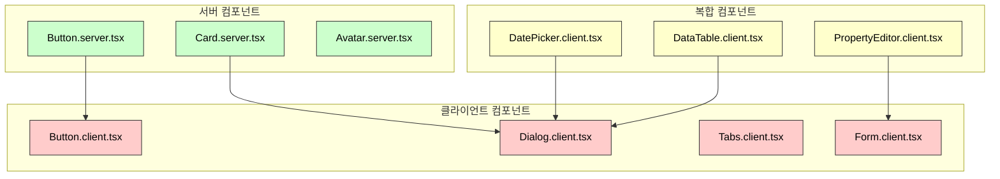

#### 5.5.2 Shadcn/UI 확장 및 커스터마이징

```typescript
// packages/ui/src/server/Button.server.tsx
import { VariantProps } from 'class-variance-authority';
import { buttonVariants } from '../shared/variants';
import { cn } from '../shared/utils';

export interface ButtonProps extends React.ButtonHTMLAttributes<HTMLButtonElement>, VariantProps<typeof buttonVariants> {
  asChild?: boolean;
}

export function Button({ className, variant, size, asChild = false, ...props }: ButtonProps) {
  // 서버 컴포넌트에서 사용할 때의 버튼 렌더링
  return (
    <button
      className={cn(buttonVariants({ variant, size, className }))}
      {...props}
    />
  );
}

// packages/ui/src/client/Button.client.tsx
'use client';

import { forwardRef } from 'react';
import { Slot } from '@radix-ui/react-slot';
import { VariantProps } from 'class-variance-authority';
import { buttonVariants } from '../shared/variants';
import { cn } from '../shared/utils';

export interface ButtonProps extends React.ButtonHTMLAttributes<HTMLButtonElement>, VariantProps<typeof buttonVariants> {
  asChild?: boolean;
}

export const Button = forwardRef<HTMLButtonElement, ButtonProps>(
  ({ className, variant, size, asChild = false, ...props }, ref) => {
    const Comp = asChild ? Slot : "button";
    
    // 클라이언트 컴포넌트에서 사용할 때의 인터랙티브 버튼 렌더링
    return (
      <Comp
        className={cn(buttonVariants({ variant, size, className }))}
        ref={ref}
        {...props}
      />
    );
  }
);
Button.displayName = "Button";
```

## 6. Next.js App Router 구현 전략

### 6.1 라우팅 및 레이아웃 구조

```bash
apps/web/
├── app/
│   ├── (auth)/               # 인증 관련 라우트 그룹
│   │   ├── login/
│   │   │   ├── page.tsx      # 서버 컴포넌트
│   │   │   └── LoginForm.client.tsx
│   │   └── auth/
│   │       ├── callback/
│   │       │   └── route.ts  # 인증 콜백 API 라우트
│   │
│   ├── (dashboard)/         # 대시보드 관련 라우트 그룹
│   │   ├── layout.tsx        # 대시보드 레이아웃
│   │   ├── dashboard/
│   │   │   ├── page.tsx
│   │   │   └── DashboardList.client.tsx
│   │   ├── dashboard/[id]/
│   │   │   ├── page.tsx
│   │   │   └── DashboardView.client.tsx
│   │   ├── dashboard/[id]/edit/
│   │   │   ├── page.tsx
│   │   │   └── DashboardEditor.client.tsx
│   │   └── explore/
│   │       ├── page.tsx
│   │       └── ExploreView.client.tsx
│   │
│   ├── chart-editor/[id]/    # 차트 에디터 라우트
│   │   ├── page.tsx
│   │   └── ChartEditor.client.tsx
│   │
│   ├── profile/              # 프로필 관련 라우트
│   │   ├── layout.tsx
│   │   ├── settings/
│   │   │   ├── page.tsx
│   │   │   └── SettingsForm.client.tsx
│   │   ├── subscription/
│   │   │   ├── page.tsx
│   │   │   └── SubscriptionManager.client.tsx
│   │   └── notifications/
│   │       ├── page.tsx
│   │       └── NotificationSettings.client.tsx
│   │
│   ├── api/                  # API 라우트
│   │   ├── charts/
│   │   │   └── [...params]/
│   │   │       └── route.ts
│   │   ├── dashboards/
│   │   │   └── [...params]/
│   │   │       └── route.ts
│   │   └── auth/
│   │       └── [...nextauth]/
│   │           └── route.ts
│   │
│   ├── layout.tsx            # 루트 레이아웃
│   └── page.tsx              # 홈페이지
```

### 6.2 데이터 페칭 전략

Next.js App Router에서의 데이터 페칭 전략은 서버/클라이언트 컴포넌트에 따라 다릅니다.

#### 6.2.1 서버 컴포넌트에서의 데이터 페칭

```typescript
// apps/web/app/dashboard/[id]/page.tsx
import { Suspense } from 'react';
import { fetchDashboard } from '@e-torch/server-api/server';
import { DashboardView } from './DashboardView.client';
import { DashboardSkeleton } from '@/components/skeletons/DashboardSkeleton';

interface DashboardPageProps {
  params: {
    id: string;
  };
}

export async function generateMetadata({ params }: DashboardPageProps) {
  const dashboard = await fetchDashboard(params.id);
  
  return {
    title: `${dashboard.title} - E-Torch`,
    description: dashboard.description || '경제지표 대시보드',
  };
}

export default async function DashboardPage({ params }: DashboardPageProps) {
  // 서버에서 데이터 페칭
  const dashboard = await fetchDashboard(params.id);
  
  return (
    <Suspense fallback={<DashboardSkeleton />}>
      <DashboardView
        dashboardId={params.id}
        initialData={dashboard}
      />
    </Suspense>
  );
}
```

#### 6.2.2 클라이언트 컴포넌트에서의 데이터 페칭

```typescript
// apps/web/app/dashboard/[id]/DashboardView.client.tsx
'use client';

import { useState } from 'react';
import { useQuery } from '@tanstack/react-query';
import { Dashboard, TimeRange } from '@e-torch/core';
import { DashboardComponent } from '@e-torch/dashboard/client';
import { fetchDashboardClient } from '@e-torch/server-api/client';

interface DashboardViewProps {
  dashboardId: string;
  initialData?: Dashboard;
}

export function DashboardView({ dashboardId, initialData }: DashboardViewProps) {
  const [timeRange, setTimeRange] = useState<TimeRange | undefined>(
    initialData?.timeRange
  );
  
  // 초기 데이터로 시작하고 필요 시 업데이트
  const { data: dashboard, isLoading, error } = useQuery({
    queryKey: ['dashboard', dashboardId, timeRange],
    queryFn: () => fetchDashboardClient(dashboardId, timeRange),
    initialData,
  });
  
  if (isLoading && !initialData) return <p>로딩 중...</p>;
  if (error) return <p>오류가 발생했습니다.</p>;
  if (!dashboard) return <p>대시보드를 찾을 수 없습니다.</p>;
  
  return (
    <DashboardComponent
      dashboard={dashboard}
      onTimeRangeChange={setTimeRange}
    />
  );
}
```

### 6.3 서버 액션 활용

Next.js의 서버 액션을 활용하여 폼 제출 및 데이터 변경을 처리합니다.

```typescript
// apps/web/app/chart-editor/[id]/actions.ts
'use server';

import { revalidatePath } from 'next/cache';
import { redirect } from 'next/navigation';
import { ChartConfig } from '@e-torch/core';
import { saveChart } from '@e-torch/server-api/server';

export async function saveChartAction(chartId: string, config: ChartConfig) {
  try {
    const savedChart = await saveChart(chartId, config);
    
    // 캐시 무효화 및 리디렉션
    revalidatePath(`/chart-editor/${chartId}`);
    revalidatePath(`/dashboard/${savedChart.dashboardId}`);
    
    return { success: true, chartId: savedChart.id };
  } catch (error) {
    return { success: false, error: (error as Error).message };
  }
}

// apps/web/app/chart-editor/[id]/ChartEditor.client.tsx
'use client';

import { useTransition } from 'react';
import { useChartEditorStore } from '@e-torch/state';
import { saveChartAction } from './actions';

export function ChartEditorForm() {
  const [isPending, startTransition] = useTransition();
  const { chartId, config, isDirty } = useChartEditorStore();
  
  const handleSave = () => {
    if (!chartId || !config) return;
    
    startTransition(async () => {
      const result = await saveChartAction(chartId, config);
      
      if (result.success) {
        // 성공 처리
      } else {
        // 오류 처리
      }
    });
  };
  
  return (
    <form>
      {/* 폼 요소들 */}
      <button
        type="button"
        onClick={handleSave}
        disabled={!isDirty || isPending}
      >
        {isPending ? '저장 중...' : '저장'}
      </button>
    </form>
  );
}
```

## 7. 상태 관리 아키텍처

### 7.1 서버 상태와 클라이언트 상태 분리

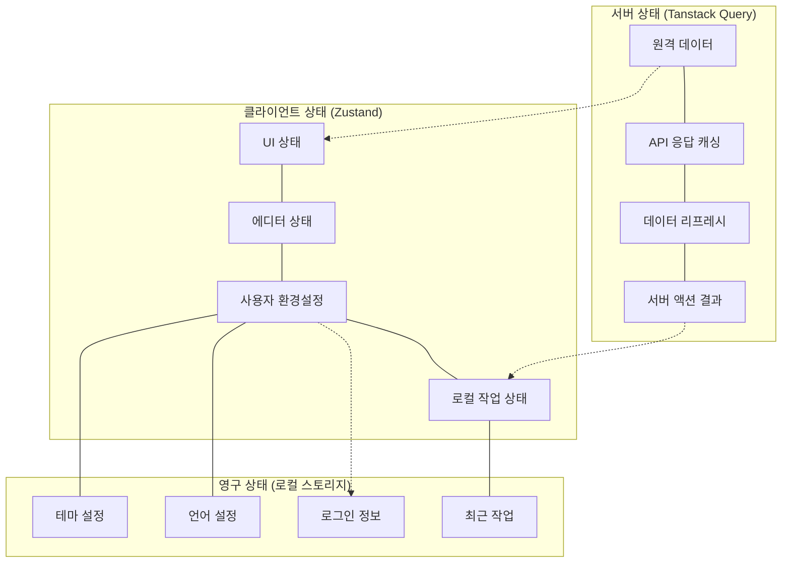

### 7.2 Zustand 상태 설계 원칙

Zustand 상태는 다음 원칙에 따라 설계합니다:

1. **단일 책임 원칙**: 각 스토어는 명확히 정의된 책임 영역을 가집니다.
2. **최소 원칙**: 필요한 상태만 스토어에 포함합니다.
3. **불변성 원칙**: `immer` 미들웨어를 사용하여 불변성을 유지합니다.
4. **선택적 구독**: 컴포넌트는 필요한 상태만 구독합니다.
5. **영구 상태 분리**: 로컬 스토리지에 저장할 상태만 `persist` 미들웨어를 사용합니다.

#### 7.2.1 스토어 구성 예시

```typescript
// 차트 에디터 스토어
const useChartEditorStore = create<ChartEditorState>()(
  devtools(
    immer(
      persist(
        (set, get) => ({
          // 상태 및 액션...
        }),
        {
          name: 'chart-editor-storage',
          partialize: (state) => ({
            // 로컬 스토리지에 저장할 상태만 선택
            chartId: state.chartId,
            config: state.config,
          }),
        }
      )
    ),
    { name: 'chart-editor' }
  )
);

// 컴포넌트에서의 선택적 구독
function ChartTypeSelector() {
  // 필요한 상태만 선택적으로 구독
  const chartType = useChartEditorStore((state) => state.config?.type);
  const updateChartType = useChartEditorStore((state) => state.updateChartType);
  
  // ...
}
```

### 7.3 Tanstack Query 활용 전략

Tanstack Query를 활용한 서버 상태 관리 전략:

1. **리액트 쿼리 클라이언트 설정**:

   ```typescript
   // apps/web/app/providers.tsx
   'use client';
   
   import { QueryClient, QueryClientProvider } from '@tanstack/react-query';
   import { ReactQueryDevtools } from '@tanstack/react-query-devtools';
   
   const queryClient = new QueryClient({
     defaultOptions: {
       queries: {
         staleTime: 1000 * 60 * 5, // 5분
         refetchOnWindowFocus: false,
         retry: 1,
       },
     },
   });
   
   export function Providers({ children }: { children: React.ReactNode }) {
     return (
       <QueryClientProvider client={queryClient}>
         {children}
         <ReactQueryDevtools initialIsOpen={false} />
       </QueryClientProvider>
     );
   }
   ```

2. **쿼리 키 관리 전략**:

   ```typescript
   // packages/state/src/queries/query-keys.ts
   export const queryKeys = {
     dashboard: {
       all: ['dashboards'] as const,
       detail: (id: string) => ['dashboard', id] as const,
       byUser: (userId: string) => ['dashboards', 'user', userId] as const,
     },
     chart: {
       detail: (id: string) => ['chart', id] as const,
       data: (id: string, timeRange?: TimeRange) => 
         ['chart-data', id, timeRange] as const,
     },
     user: {
       detail: (id: string) => ['user', id] as const,
       profile: () => ['user', 'profile'] as const,
     },
   };
   ```

3. **쿼리 무효화 전략**:

   ```typescript
   // 데이터 변경 후 관련 쿼리 무효화
   const saveDashboardMutation = useMutation({
     mutationFn: (dashboard: Dashboard) => saveDashboard(dashboard),
     onSuccess: (data) => {
       // 해당 대시보드 쿼리 무효화
       queryClient.invalidateQueries({ 
         queryKey: queryKeys.dashboard.detail(data.id),
       });
       
       // 관련 차트 쿼리 무효화
       data.items
         .filter(item => item.type === 'chart')
         .forEach(item => {
           queryClient.invalidateQueries({
             queryKey: queryKeys.chart.detail(item.id),
           });
         });
       
       // 사용자의 대시보드 목록 쿼리 무효화
       queryClient.invalidateQueries({ 
         queryKey: queryKeys.dashboard.byUser(data.createdBy),
       });
     },
   });
   ```

### 7.4 이벤트 버스 패턴

컴포넌트 간 느슨한 결합을 위한 이벤트 버스 패턴:

```typescript
// packages/state/src/event-bus.ts
import { create } from 'zustand';

export type EventType = 
  | 'dashboard:timeRangeChanged'
  | 'dashboard:widgetAdded'
  | 'dashboard:widgetRemoved'
  | 'chart:dataUpdated'
  | 'chart:optionsChanged';

interface EventPayload<T = any> {
  type: EventType;
  payload: T;
}

type EventCallback<T = any> = (payload: T) => void;

interface EventBusState {
  listeners: Map<EventType, Set<EventCallback>>;
  
  subscribe: <T>(type: EventType, callback: EventCallback<T>) => () => void;
  publish: <T>(type: EventType, payload: T) => void;
}

export const useEventBus = create<EventBusState>()((set, get) => ({
  listeners: new Map(),
  
  subscribe: (type, callback) => {
    const { listeners } = get();
    
    if (!listeners.has(type)) {
      listeners.set(type, new Set());
    }
    
    const typeListeners = listeners.get(type)!;
    typeListeners.add(callback as EventCallback<any>);
    
    set({ listeners: new Map(listeners) });
    
    // 구독 해제 함수 반환
    return () => {
      const { listeners } = get();
      const typeListeners = listeners.get(type);
      
      if (typeListeners) {
        typeListeners.delete(callback as EventCallback<any>);
        set({ listeners: new Map(listeners) });
      }
    };
  },
  
  publish: (type, payload) => {
    const { listeners } = get();
    const typeListeners = listeners.get(type);
    
    if (typeListeners) {
      typeListeners.forEach(callback => {
        callback(payload);
      });
    }
  },
}));

// 이벤트 구독 훅
export function useEventListener<T = any>(type: EventType, callback: EventCallback<T>) {
  const subscribe = useEventBus(state => state.subscribe);
  
  useEffect(() => {
    return subscribe(type, callback);
  }, [type, callback, subscribe]);
}
```

## 8. 데이터 처리 및 변환 파이프라인

### 8.1 데이터 페칭 및 변환 파이프라인

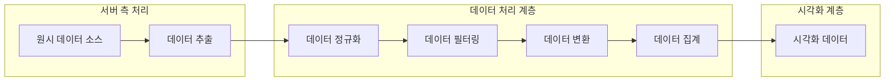

### 8.2 데이터 파이프라인 구현

```typescript
// packages/data-sources/src/pipeline/pipeline.ts
import { DataSource, TimeRange, Period, DataPoint, Series } from '@e-torch/core';
import { fetchRawData } from './connectors';
import { normalizeData } from './normalizers';
import { filterData } from './filters';
import { transformData } from './transformers';
import { aggregateData } from './aggregators';

interface DataPipelineOptions {
  source: DataSource;
  indicatorCode: string;
  timeRange: TimeRange;
  period: Period;
  transformation?: 'original' | 'change' | 'change-yoy' | 'cumulative';
  aggregation?: 'none' | 'sum' | 'average' | 'min' | 'max';
  filters?: Record<string, any>;
}

export async function processDataPipeline(options: DataPipelineOptions): Promise<Series> {
  // 1. 데이터 추출
  const rawData = await fetchRawData(
    options.source, 
    options.indicatorCode, 
    options.timeRange, 
    options.period
  );
  
  // 2. 데이터 정규화
  const normalizedData = normalizeData(rawData, options.source);
  
  // 3. 데이터 필터링
  const filteredData = filterData(normalizedData, options.filters);
  
  // 4. 데이터 변환
  const transformedData = transformData(
    filteredData, 
    options.transformation || 'original'
  );
  
  // 5. 데이터 집계
  const aggregatedData = aggregateData(
    transformedData,
    options.aggregation || 'none'
  );
  
  // 6. 시리즈 생성
  return {
    id: `${options.source}_${options.indicatorCode}`,
    name: `${options.indicatorCode}`,
    data: aggregatedData,
  };
}

// 데이터 처리 파이프라인 훅
export function useDataPipeline(options: DataPipelineOptions) {
  const { source, indicatorCode, timeRange, period } = options;
  
  return useQuery({
    queryKey: ['data-pipeline', source, indicatorCode, timeRange, period, options],
    queryFn: () => processDataPipeline(options),
    staleTime: 1000 * 60 * 10, // 10분
  });
}
