# E-Torch 프론트엔드 아키텍처 설계 문서

## 1. 아키텍처 개요

### 1.1 프론트엔드 아키텍처 목표

E-Torch 프론트엔드는 경제지표 시각화 특성과 구독 모델을 고려한 확장 가능한 아키텍처를 목표로 합니다.

#### 핵심 기술적 목표

- **복잡한 데이터 시각화 최적화**: 1,000+ 데이터 포인트 차트 렌더링 성능 보장
- **실시간 대화형 편집**: react-grid-layout 기반 드래그 앤 드롭 편집기 구현
- **구독 모델 런타임 제어**: 플랜별 기능 제한/활성화 실시간 적용
- **다중 데이터 소스 통합**: KOSIS/ECOS API 응답 차이 흡수 및 정규화
- **적응형 사용자 경험**: 전문가/일반 사용자별 UI 복잡도 동적 조절

### 1.2 아키텍처 설계 원칙

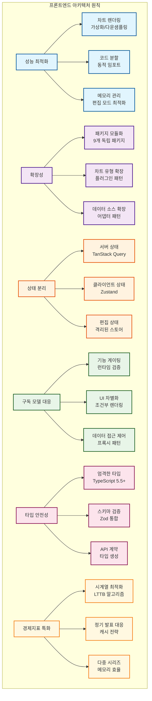

### 1.3 아키텍처 제약사항 및 고려사항

#### 기술적 제약사항

| 제약사항 | 영향 범위 | 아키텍처 대응 |
|---------|----------|-------------|
| **차트 렌더링 성능** | 1,000+ 데이터 포인트 시 3초 이내 | LTTB 다운샘플링, 가상화 적용 |
| **편집 모드 반응성** | 드래그 중 60fps 유지 | 차트 렌더링 비활성화, 300ms 디바운싱 |
| **메모리 사용량** | 대시보드당 200MB 이하 | React.memo, 불필요한 상태 정리 |
| **구독 플랜 검증** | 10ms 이내 권한 확인 | 클라이언트 캐시 + 서버 재검증 |

#### 비즈니스 로직 제약사항

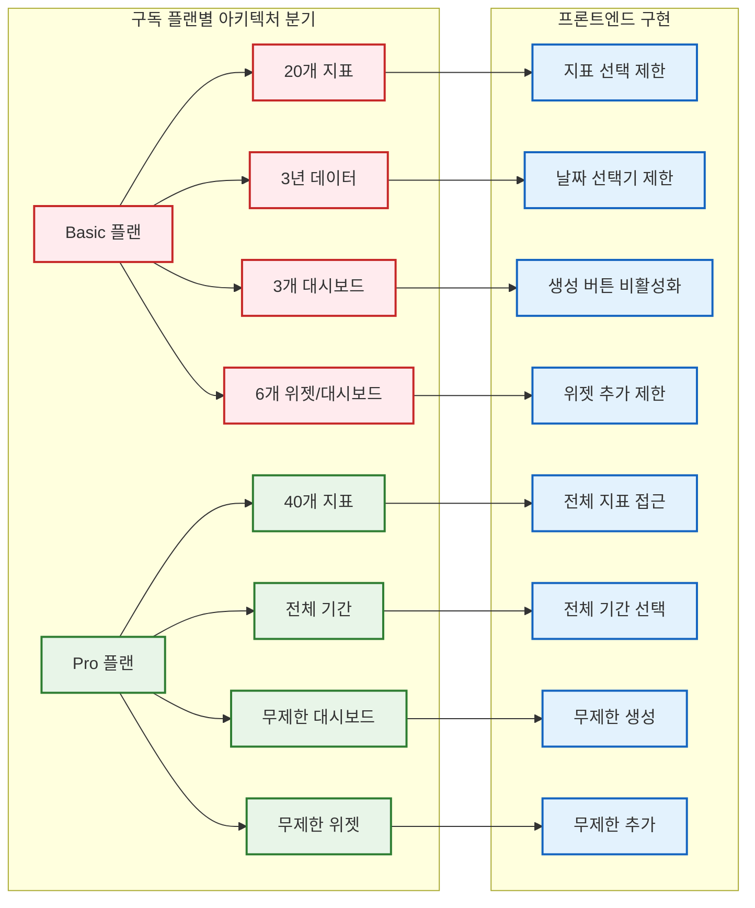

### 1.4 데이터 흐름 아키텍처

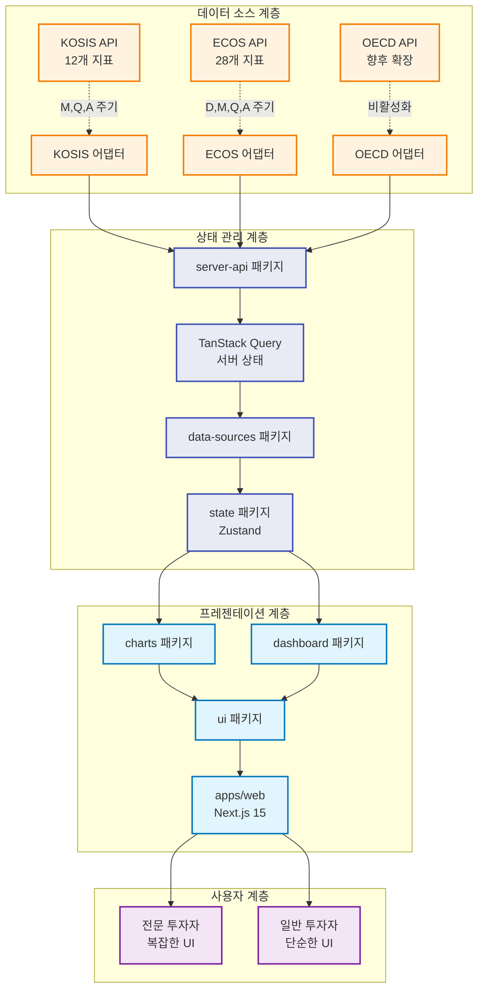

### 1.5 성능 아키텍처 전략

#### 차트 렌더링 최적화

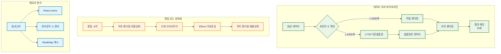

### 1.6 보안 및 인증 아키텍처

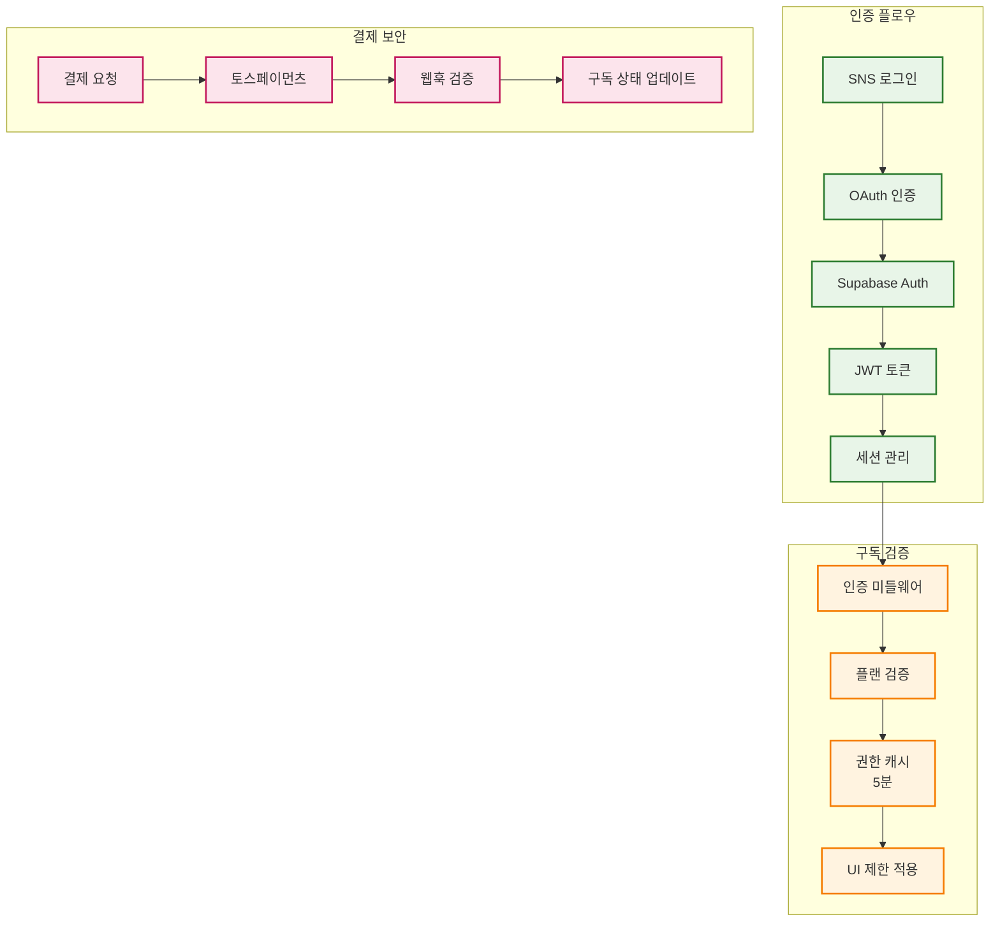

이 아키텍처는 경제지표 시각화의 특수성과 구독 모델의 복잡성을 모두 고려하여 설계되었으며, 성능과 확장성을 동시에 보장합니다.

## 2. 기술 스택

### 2.1 핵심 기술 스택 (E-Torch 특화)

| 영역 | 기술 | 버전 | E-Torch 특화 설정 |
|------|------|------|------------------|
| **모노레포** | Turborepo + pnpm | 2.5.3 + 10.11.0 | 9패키지 분할, 빌드 캐싱 |
| **프레임워크** | Next.js + React | 15.3.2 + 19.1.0 | App Router, 경제지표 캐싱 24h |
| **UI** | Tailwind CSS + Shadcn/UI | 4.1.7 + latest | CSS-first, OKLCH 색상 |
| **상태관리** | Zustand + TanStack Query | 5.0.5 + 5.77.0 | 클라이언트/서버 상태 분리 |
| **차트** | Recharts | 2.15.3 | 1000+ 포인트 LTTB 다운샘플링 |
| **레이아웃** | react-grid-layout | 1.5.1 | 드래그 300ms 디바운싱 |
| **인증** | Supabase Auth | v2 | SNS 로그인 3개 (구글/네이버/카카오) |
| **폼/검증** | React Hook Form + Zod | 7.56.4 + 3.25.28 | 경제지표 스키마 검증 |
| **테스트** | Vitest + Playwright | 1.x + 1.40+ | 차트 시각적 회귀 테스트 |

### 2.2 E-Torch 특화 구현 설정

#### Tailwind CSS 4 (CSS-first)

```css
/* globals.css */
@import "tailwindcss";

@theme {
  /* E-Torch 브랜드 색상 (OKLCH) */
  --color-primary: oklch(0.2 0.15 240);
  --color-secondary: oklch(0.5 0.2 230);
  --color-tertiary: oklch(0.45 0.18 220);
  
  /* 반응형 브레이크포인트 */
  --breakpoint-tablet: 768px;
  --breakpoint-desktop: 1200px;
  --container-max-width: 1440px;
  
  /* 성능 최적화 값 */
  --debounce-resize: 300ms;
  --debounce-drag: 200ms;
}

/* OKLCH 미지원 브라우저 HSL 폴백 */
@supports not (color: oklch(0 0 0)) {
  :root {
    --color-primary: hsl(225, 60%, 15%);
    --color-secondary: hsl(225, 80%, 50%);
    --color-tertiary: hsl(200, 80%, 45%);
  }
}
```

#### 성능 임계값 및 최적화

| 기능 | 임계값 | 최적화 방법 |
|------|--------|------------|
| **차트 렌더링** | 1000+ 포인트 | LTTB 다운샘플링 자동 적용 |
| **편집 반응성** | 드래그 중 60fps | 차트 렌더링 비활성화 |
| **메모리 관리** | 200MB/대시보드 | React.memo + 언마운트 정리 |
| **권한 검증** | < 10ms | 클라이언트 캐시 5분 유지 |
| **데이터 캐싱** | 경제지표 24시간 | TanStack Query staleTime |

#### 구독 모델 런타임 제어

```typescript
// packages/state/src/auth.ts
const FEATURE_GATES = {
  basic: {
    indicators: 20,
    dashboards: 3,
    widgets: 6,
    dataRange: '3years'
  },
  pro: {
    indicators: 40,
    dashboards: Infinity,
    widgets: Infinity,
    dataRange: 'all'
  }
} as const

// 런타임 권한 검증 (10ms 이내)
export const useFeatureGate = (feature: keyof typeof FEATURE_GATES.basic) => {
  const { plan } = useAuth()
  return useMemo(() => FEATURE_GATES[plan][feature], [plan, feature])
}
```

#### react-grid-layout 최적화 설정

```typescript
// packages/dashboard/src/components/DashboardGrid.tsx
const gridLayoutProps = {
  cols: { lg: 12, md: 8, sm: 4 },
  breakpoints: { lg: 1200, md: 768, sm: 0 },
  margin: [16, 16],
  
  // 성능 최적화
  onDragStart: () => setChartRenderingEnabled(false),
  onDragStop: debounce(() => setChartRenderingEnabled(true), 200),
  onResizeStart: () => setChartRenderingEnabled(false),
  onResizeStop: debounce(() => setChartRenderingEnabled(true), 300),
}
```

#### 경제지표 데이터 처리

```typescript
// packages/charts/src/utils/downsampling.ts
export const applyLTTB = (data: DataPoint[], threshold = 1000) => {
  if (data.length <= threshold) return data
  return lttbDownsampling(data, threshold)
}

// 자동 다운샘플링 적용
export const processChartData = (data: DataPoint[]) => {
  return data.length > 1000 ? applyLTTB(data) : data
}
```

### 2.3 개발 환경 설정

#### ESLint 설정 (Flat Config)

```javascript
// eslint.config.mjs
import { nextJsConfig } from '@e-torch/eslint-config/next'

export default [
  ...nextJsConfig,
  {
    rules: {
      // E-Torch 특화 규칙
      '@typescript-eslint/no-unused-vars': ['error', { argsIgnorePattern: '^_' }],
      'react-hooks/exhaustive-deps': 'error'
    }
  }
]
```

#### TypeScript 설정

```json
{
  "compilerOptions": {
    "strict": true,
    "noUncheckedIndexedAccess": true,
    "exactOptionalPropertyTypes": true
  }
}
```

## 3. 아키텍처 계층 구조

### 3.1 핵심 설정

#### Turborepo + pnpm 구성

```json
// turbo.json
{
  "pipeline": {
    "build": { "dependsOn": ["^build"], "outputs": [".next/**", "dist/**"] },
    "dev": { "cache": false, "persistent": true },
    "lint": {},
    "type-check": {}
  }
}
```

```yaml
# pnpm-workspace.yaml
packages:
  - "apps/*"
  - "packages/*"
```

### 3.2 패키지 의존성 (E-Torch 특화)

| 패키지 | 직접 의존성 | 핵심 책임 |
|--------|-------------|----------|
| **core** | utils | 타입 정의, 상수 |
| **ui** | core, utils | Shadcn/UI + CSS-first |
| **charts** | core, ui, utils, data-sources | Recharts + 5가지 차트 |
| **dashboard** | core, ui, charts, data-sources | react-grid-layout |
| **data-sources** | core, utils | KOSIS/ECOS 어댑터 |
| **state** | core, utils, data-sources | Zustand + TanStack Query |
| **server-api** | core, utils | Next.js API 핸들러 |

### 3.3 E-Torch 특화 패키지 설정

#### ESLint Config (Standard 기반)

```javascript
// packages/eslint-config/base.mjs
import standardJs from '@seungwoo321/eslint-plugin-standard-js'
import tseslint from 'typescript-eslint'

export const config = [
  {
    ignores: ['apps/web/app/components/ui/*'] // Shadcn/UI 제외
  },
  {
    files: ['**/*.{js,ts,jsx,tsx}'],
    extends: [
      ...standardJs.configs.recommended,
      ...tseslint.configs.recommended
    ]
  }
]
```

#### 차트 패키지 (성능 최적화)

```typescript
// packages/charts/src/components/ChartRenderer.tsx
import { memo } from 'react'
import { useLTTBSampling } from '@/hooks/useLTTBSampling'

export const ChartRenderer = memo(({ data, type, options }) => {
  const sampledData = useLTTBSampling(data, 1000) // 임계값
  // 렌더링 로직
})
```

#### 상태 패키지 (서버 상태 분리)

```typescript
// packages/state/src/stores/dashboard.ts
import { create } from 'zustand'
import { persist } from 'zustand/middleware'

export const useDashboardStore = create(
  persist(
    (set) => ({
      // 클라이언트 상태만
      editMode: false,
      selectedWidget: null
    }),
    { name: 'dashboard-state' }
  )
)
```

### 3.4 구독 모델 통합

#### 권한 검증 (< 10ms 목표)

```typescript
// packages/core/src/types/subscription.ts
export type PlanLimits = {
  basic: { dashboards: 3, widgets: 6, indicators: 20, dataYears: 3 }
  pro: { dashboards: -1, widgets: -1, indicators: 40, dataYears: -1 }
}

// 런타임 검증
export const checkPlanLimit = (plan: Plan, resource: Resource) => {
  return PLAN_LIMITS[plan][resource] === -1 || 
         currentUsage[resource] < PLAN_LIMITS[plan][resource]
}
```

### 3.5 성능 최적화 설정

#### 메모리 관리 (200MB 제한)

```typescript
// packages/charts/src/hooks/useChartMemory.ts
import { useEffect } from 'react'

export const useChartMemory = (data: ChartData[]) => {
  useEffect(() => {
    return () => {
      // 차트 데이터 정리
      data.forEach(d => d.cleanup?.())
    }
  }, [])
}
```

#### 코드 분할 (동적 임포트)

```typescript
// packages/charts/src/index.ts
export const TimeSeriesChart = lazy(() => 
  import('./components/TimeSeriesChart')
)
export const BarChart = lazy(() => 
  import('./components/BarChart')
)
// 필요시에만 로드
```

---

**핵심**: 의존성 순서 준수, E-Torch 특화 설정 적용, 성능 임계값 준수

## 4. 모노레포 패키지 구조 설계

### 4.1 핵심 설정

#### Turborepo + pnpm 구성

```json
// turbo.json
{
  "pipeline": {
    "build": { "dependsOn": ["^build"], "outputs": [".next/**", "dist/**"] },
    "dev": { "cache": false, "persistent": true },
    "lint": {},
    "type-check": {}
  }
}
```

```yaml
# pnpm-workspace.yaml
packages:
  - "apps/*"
  - "packages/*"
```

### 4.2 패키지 의존성 구조

#### 9개 패키지 구조 (E-Torch 특화)

| 패키지 | 직접 의존성 | 핵심 책임 | E-Torch 특화 |
|--------|-------------|----------|------------|
| **eslint-config** | - | 코드 품질 규칙 | Standard JS 기반 |
| **core** | utils | 타입 정의, 상수 | 차트/구독 타입 |
| **utils** | - | 공통 유틸리티 | LTTB 다운샘플링 |
| **ui** | core, utils | Shadcn/UI 통합 | CSS-first 테마 |
| **data-sources** | core, utils | API 어댑터 | KOSIS/ECOS 통합 |
| **state** | core, utils, data-sources | 상태 관리 | 서버/클라이언트 분리 |
| **charts** | core, ui, utils, data-sources, state | 차트 컴포넌트 | 5가지 차트 타입 |
| **dashboard** | 모든 패키지 | 대시보드 관리 | react-grid-layout |
| **server-api** | core, utils | API 핸들러 | Next.js 15 통합 |

#### 패키지 의존성 그래프

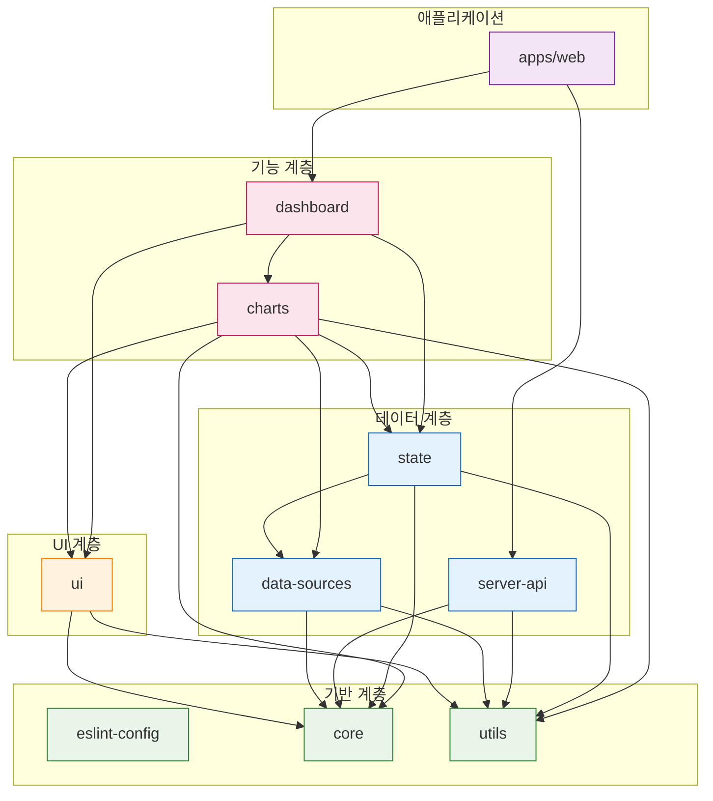

### 4.3 E-Torch 특화 패키지 설정

#### ESLint Config (Standard 기반)

```javascript
// packages/eslint-config/base.mjs
import standardJs from '@seungwoo321/eslint-plugin-standard-js'
import tseslint from 'typescript-eslint'

export const config = [
  {
    ignores: ['apps/web/app/components/ui/*'] // Shadcn/UI 제외
  },
  {
    files: ['**/*.{js,ts,jsx,tsx}'],
    extends: [
      ...standardJs.configs.recommended,
      ...tseslint.configs.recommended
    ]
  }
]
```

#### Charts 패키지 (성능 최적화)

```typescript
// packages/charts/src/components/ChartRenderer.tsx
import { memo } from 'react'
import { useLTTBSampling } from '@/hooks/useLTTBSampling'

export const ChartRenderer = memo(({ data, type, options }) => {
  const sampledData = useLTTBSampling(data, 1000) // 임계값
  return <Chart data={sampledData} type={type} {...options} />
})
```

#### State 패키지 (서버 상태 분리)

```typescript
// packages/state/src/stores/dashboard.ts
import { create } from 'zustand'
import { persist } from 'zustand/middleware'

export const useDashboardStore = create(
  persist(
    (set) => ({
      // 클라이언트 상태만
      editMode: false,
      selectedWidget: null
    }),
    { name: 'dashboard-state' }
  )
)
```

#### 구독 모델 통합 (< 10ms 목표)

```typescript
// packages/core/src/types/subscription.ts
export type PlanLimits = {
  basic: { dashboards: 3, widgets: 6, indicators: 20, dataYears: 3 }
  pro: { dashboards: -1, widgets: -1, indicators: 40, dataYears: -1 }
}

// 런타임 검증
export const checkPlanLimit = (plan: Plan, resource: Resource) => {
  return PLAN_LIMITS[plan][resource] === -1 || 
         currentUsage[resource] < PLAN_LIMITS[plan][resource]
}
```

#### 성능 최적화 설정

메모리 관리 (200MB 제한):

```typescript
// packages/charts/src/hooks/useChartMemory.ts
import { useEffect } from 'react'

export const useChartMemory = (data: ChartData[]) => {
  useEffect(() => {
    return () => {
      // 차트 데이터 정리
      data.forEach(d => d.cleanup?.())
    }
  }, [])
}
```

코드 분할 (동적 임포트):

```typescript
// packages/charts/src/index.ts
export const TimeSeriesChart = lazy(() => 
  import('./components/TimeSeriesChart')
)
export const BarChart = lazy(() => 
  import('./components/BarChart')
)
// 필요시에만 로드
```

---

**핵심**: 의존성 순서 준수, E-Torch 특화 설정 적용, 성능 임계값 준수

## 5. 패키지별 책임 구분

### 5.1 패키지 개요

| 패키지 | 핵심 책임 | E-Torch 특화 설정 | 의존성 |
|--------|-----------|------------------|--------|
| **eslint-config** | 코드 품질 규칙 | Standard JS + TSESLint | 없음 |
| **core** | 타입 정의, 상수 | 구독 모델 타입, 차트 타입 | 없음 |
| **ui** | 기본 UI 컴포넌트 | Shadcn/UI + CSS-first | core, utils |
| **charts** | 차트 렌더링 | 5가지 차트 + LTTB | core, ui, utils, data-sources |
| **dashboard** | 대시보드 관리 | react-grid-layout + 위젯 | core, ui, charts, data-sources |
| **data-sources** | 데이터 연동 | KOSIS/ECOS 어댑터 | core, utils |
| **utils** | 유틸리티 함수 | 경제지표 포맷터 | 없음 |
| **state** | 상태 관리 | Zustand + TanStack Query | core, utils, data-sources |
| **server-api** | API 연동 | Next.js 15 API 핸들러 | core, utils |

### 5.2 ESLint Config 패키지

```javascript
// packages/eslint-config/base.mjs
import standardJs from '@seungwoo321/eslint-plugin-standard-js'
import tseslint from 'typescript-eslint'

export const config = [
  {
    ignores: ['apps/web/app/components/ui/*'] // Shadcn/UI 제외
  },
  {
    files: ['**/*.{js,ts,jsx,tsx}'],
    extends: [
      ...standardJs.configs.recommended,
      ...tseslint.configs.recommended
    ]
  }
]
```

### 5.3 Core 패키지 (타입 정의)

```typescript
// packages/core/src/types/subscription.ts
export type Plan = 'basic' | 'pro'

export type PlanLimits = {
  basic: { dashboards: 3, widgets: 6, indicators: 20, dataYears: 3 }
  pro: { dashboards: -1, widgets: -1, indicators: 40, dataYears: -1 }
}

// packages/core/src/types/chart.ts
export type ChartType = 'timeSeries' | 'bar' | 'scatter' | 'radar' | 'radialBar'
export type DataSource = 'KOSIS' | 'ECOS'
```

### 5.4 UI 패키지 (Shadcn/UI 통합)

```typescript
// packages/ui/src/components/Button.tsx
"use client"
import { cva } from "class-variance-authority"

const buttonVariants = cva(
  "inline-flex items-center justify-center rounded-md text-sm font-medium",
  {
    variants: {
      variant: {
        default: "bg-primary text-primary-foreground hover:bg-primary/90",
        secondary: "bg-secondary text-secondary-foreground hover:bg-secondary/80"
      }
    }
  }
)
```

### 5.5 Charts 패키지 (성능 최적화)

```typescript
// packages/charts/src/hooks/useLTTBSampling.ts
export const useLTTBSampling = (data: DataPoint[], threshold = 1000) => {
  return useMemo(() => {
    if (data.length <= threshold) return data
    return lttbDownsampling(data, threshold)
  }, [data, threshold])
}

// packages/charts/src/components/ChartRenderer.tsx
export const ChartRenderer = memo(({ data, type, options }) => {
  const sampledData = useLTTBSampling(data, 1000)
  // 차트 렌더링 로직
})
```

### 5.6 Dashboard 패키지 (react-grid-layout)

```typescript
// packages/dashboard/src/components/DashboardGrid.tsx
const gridProps = {
  cols: { lg: 12, md: 8, sm: 4 },
  breakpoints: { lg: 1200, md: 768, sm: 0 },
  
  // E-Torch 성능 최적화
  onDragStart: () => setChartRenderingEnabled(false),
  onDragStop: debounce(() => setChartRenderingEnabled(true), 200),
  onResizeStop: debounce(() => setChartRenderingEnabled(true), 300)
}
```

### 5.7 Data-Sources 패키지 (어댑터 패턴)

```typescript
// packages/data-sources/src/adapters/BaseAdapter.ts
export abstract class BaseAdapter {
  abstract fetchData(indicator: string, period: string): Promise<DataPoint[]>
  abstract getAvailableIndicators(): Indicator[]
  abstract getSupportedPeriods(indicator: string): Period[]
}

// KOSIS: M,Q,A만 지원 / ECOS: D,M,Q,A 지원
export class KOSISAdapter extends BaseAdapter {
  getSupportedPeriods() { return ['M', 'Q', 'A'] }
}
```

### 5.8 State 패키지 (상태 분리)

```typescript
// packages/state/src/stores/dashboard.ts - 클라이언트 상태
export const useDashboardStore = create(
  persist(
    (set) => ({
      editMode: false,
      selectedWidget: null
    }),
    { name: 'dashboard-state' }
  )
)

// packages/state/src/hooks/useIndicators.ts - 서버 상태
export const useIndicators = (source: DataSource) => {
  return useQuery({
    queryKey: ['indicators', source],
    queryFn: () => getIndicators(source),
    staleTime: 24 * 60 * 60 * 1000 // 경제지표는 24시간 캐시
  })
}
```

### 5.9 Utils 패키지 (경제지표 특화)

```typescript
// packages/utils/src/formatters.ts
export const formatCurrency = (value: number, currency = 'KRW') => {
  return new Intl.NumberFormat('ko-KR', {
    style: 'currency',
    currency
  }).format(value)
}

export const formatPercentage = (value: number, decimals = 2) => {
  return `${value.toFixed(decimals)}%`
}
```

### 5.10 Server-API 패키지 (Next.js 15)

```typescript
// packages/server-api/src/handlers/indicators.ts
import { NextRequest } from 'next/server'

export async function GET(request: NextRequest) {
  const { searchParams } = new URL(request.url)
  const source = searchParams.get('source') as DataSource
  
  // 구독 플랜 검증 (< 10ms)
  const planLimits = await checkUserPlan(request)
  const indicators = await getIndicators(source, planLimits)
  
  return Response.json(indicators)
}
```

### 5.11 패키지 빌드 설정

```json
// packages/*/package.json 공통 설정
{
  "main": "./dist/index.js",
  "types": "./dist/index.d.ts",
  "scripts": {
    "build": "tsup src/index.ts --format cjs,esm --dts",
    "dev": "tsup src/index.ts --format cjs,esm --dts --watch"
  },
  "devDependencies": {
    "tsup": "^8.0.0",
    "typescript": "^5.5.0"
  }
}
```

## 6. 인증 아키텍처

E-Torch는 Supabase를 활용한 인증 시스템을 구현합니다:

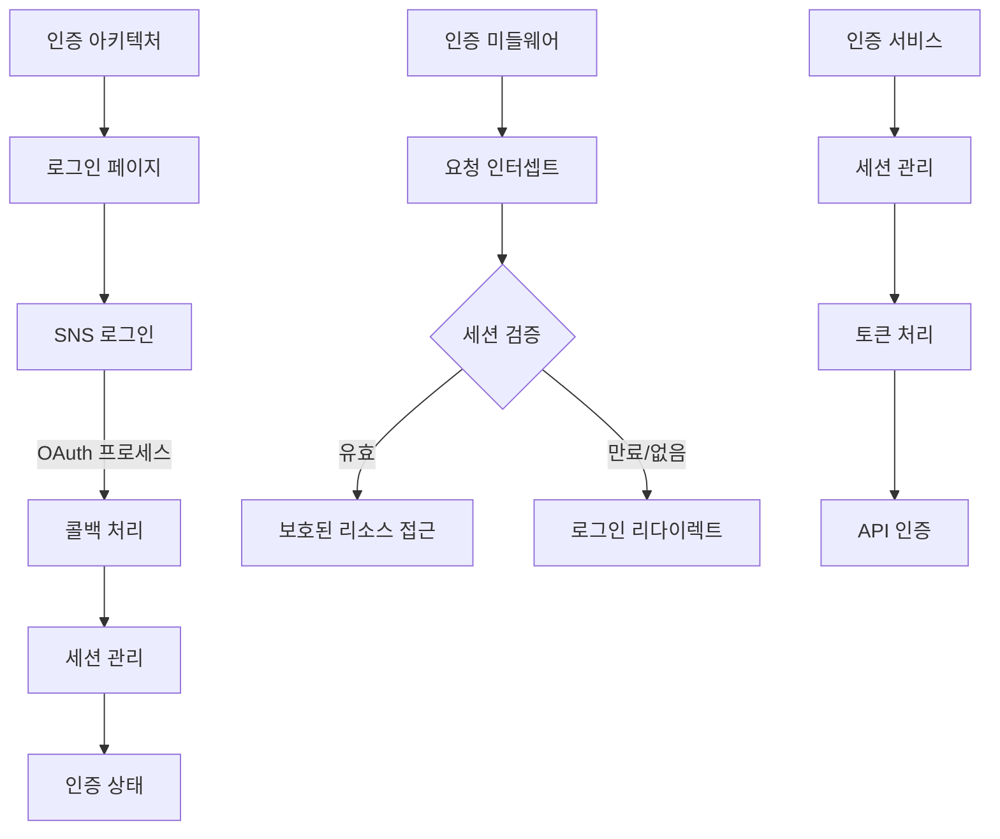

인증 관련 핵심 컴포넌트:

- Supabase 클라이언트 - JWT 기반 인증 처리
- 세션 관리 - 로그인 상태 유지 및 관리
- 인증 미들웨어 - 보호된 라우트에 대한 접근 제어
- 인증 스토어 - 클라이언트 상태에서의 인증 정보 관리
- OAuth 콜백 처리 - SNS 인증 후 리다이렉션 처리

## 7. 차트 컴포넌트 설계

차트 표시 및 편집 관련 컴포넌트는 E-Torch의 핵심 기능으로, 서버 컴포넌트와 클라이언트 컴포넌트의 조합으로 구현됩니다.

### 7.1 차트 컴포넌트 계층 구조

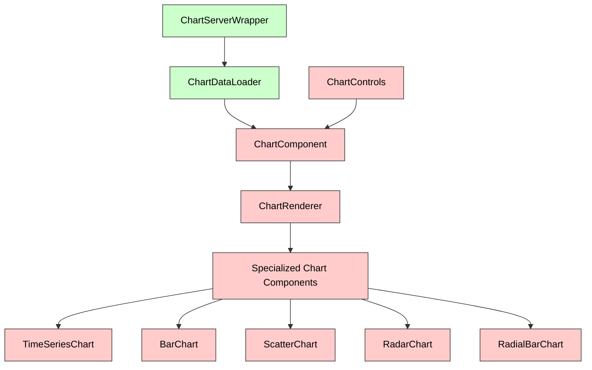

#### 컴포넌트별 책임 정의

| 컴포넌트 | 유형 | 책임 | 연결된 옵션 컴포넌트 |
|---------|------|-----|------------------|
| **ChartServerWrapper** | 서버 | 서버 측 데이터 페칭, 초기 데이터 준비, 메타데이터 로드 | - |
| **ChartDataLoader** | 서버 | 차트별 데이터 로드 최적화, 데이터 변환 | - |
| **ChartComponent** | 클라이언트 | 차트 렌더링 상태 관리, 이벤트 핸들링, 서버 데이터 hydration | ChartControls, OptionsPanel |
| **ChartRenderer** | 클라이언트 | 차트 타입에 따른 렌더링 로직 분기, 공통 렌더링 프로퍼티 관리 | - |
| **TimeSeriesChart** | 클라이언트 | 시계열 데이터 특화 렌더링 | PanelOptions, TooltipOptions, LegendOptions, XAxis, YAxis, GraphStyles |
| **BarChart** | 클라이언트 | 범주형 데이터 비교 시각화 | PanelOptions, TooltipOptions, LegendOptions, XAxis, YAxis |
| **ScatterChart** | 클라이언트 | 상관관계 시각화 | PanelOptions, TooltipOptions, LegendOptions, XAxis, YAxis, ScatterOptions |
| **RadarChart** | 클라이언트 | 다차원 데이터 비교 | PanelOptions, TooltipOptions, LegendOptions, RadarOptions |
| **RadialBarChart** | 클라이언트 | 부분-전체 관계 시각화 | PanelOptions, TooltipOptions, LegendOptions, RadialBarOptions |
| **ChartControls** | 클라이언트 | 차트 인터랙션 컨트롤 | - |

### 7.2 차트 에디터 컴포넌트

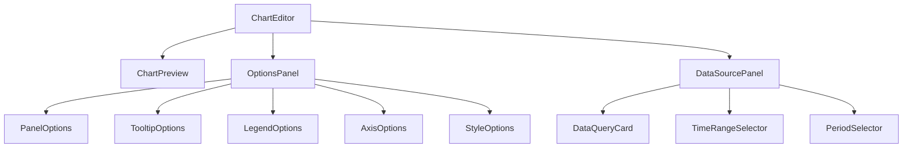

## 8. 대시보드 컴포넌트 설계

대시보드 관련 컴포넌트는 레이아웃 관리와 위젯 상호작용에 초점을 맞추어 설계됩니다.

### 8.1 대시보드 그리드 컴포넌트

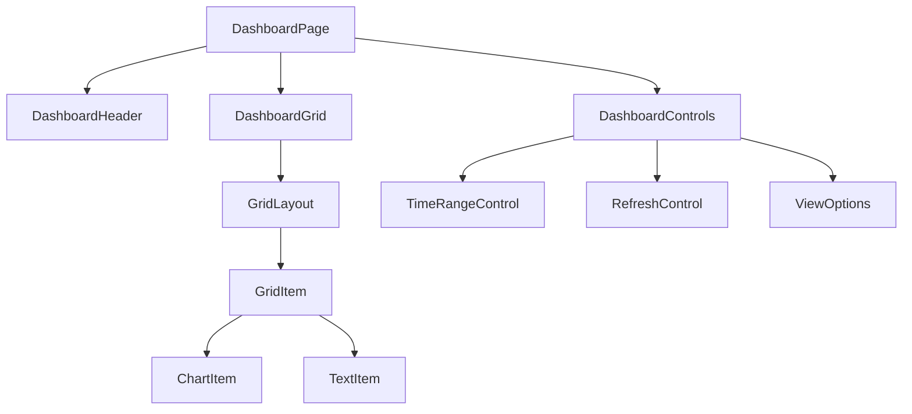

#### 주요 컴포넌트 책임 및 서버/클라이언트 구분

- **DashboardPage** (서버 컴포넌트): 대시보드 페이지 구조 정의 및 초기 데이터 로드
- **DashboardHeader** (서버 컴포넌트): 대시보드 제목, 설명, 메타 정보 표시
- **DashboardGrid** (클라이언트 컴포넌트): react-grid-layout 기반 그리드 시스템 관리
- **GridItem** (클라이언트 컴포넌트): 그리드 내 개별 위젯 아이템 래퍼
- **ChartItem/TextItem** (클라이언트 컴포넌트): 위젯 유형별 특화 컴포넌트

### 8.2 대시보드 편집기 컴포넌트

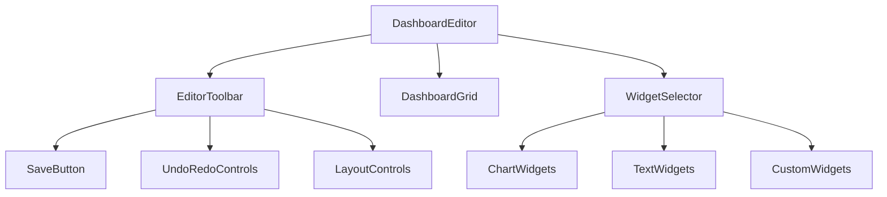

## 9. 데이터 소스 컴포넌트 설계

데이터 소스 관련 컴포넌트는 데이터 선택, 변환, 쿼리 구성에 초점을 맞추어 설계됩니다.

### 9.1 데이터 쿼리 컴포넌트

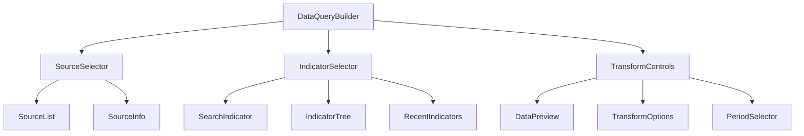

## 10. 서버 액션 통합 패턴

Next.js 서버 액션을 활용하여 데이터 변경을 처리하는 패턴입니다:

```tsx
// app/actions/dashboard.ts (서버 액션)
'use server'

import { revalidatePath } from 'next/cache'
import { saveDashboard } from '@/packages/server-api/dashboard'

export async function saveDashboardAction(
  dashboardId: string,
  dashboardData: any
) {
  try {
    const result = await saveDashboard(dashboardId, dashboardData)
    revalidatePath(`/dashboard/${dashboardId}`)
    return { success: true, data: result }
  } catch (error) {
    return { 
      success: false, 
      error: error instanceof Error ? error.message : '저장 중 오류가 발생했습니다.'
    }
  }
}
```

## 11. 접근성 통합 컴포넌트

E-Torch는 WCAG 2.1 AA 수준 준수를 목표로 접근성 컴포넌트를 통합합니다:

- **SkipLink**: 키보드 사용자를 위한 메인 콘텐츠 바로가기 링크
- **FocusTrap**: 모달 및 다이얼로그에서 포커스를 가두는 컴포넌트
- **KeyboardNavMenu**: 키보드 방향키로 탐색 가능한 내비게이션 메뉴
- **AccessibleChartTable**: 차트 데이터를 스크린 리더가 인식할 수 있는 테이블로 변환
- **VisuallyHidden**: 시각적으로는 숨겨지지만 스크린 리더는 읽을 수 있는 텍스트

## 12. 컴포넌트 성능 최적화

### 12.1 코드 분할 및 지연 로딩

```tsx
// 차트 유형별 다이나믹 임포트
import dynamic from 'next/dynamic'

// 기본 차트 컴포넌트는 즉시 로드
import { ChartProps, ChartType } from '@/packages/charts'
import { ChartSkeleton } from '@/packages/ui/components'

// 차트 유형별 동적 임포트 (필요시 로드)
const TimeSeriesChart = dynamic(() => import('@/packages/charts/src/components/chart-types/TimeSeriesChart'), {
  loading: () => <ChartSkeleton type="timeSeries" />,
  ssr: false // 클라이언트 사이드에서만 렌더링 (Recharts는 SSR 불가)
})
```

### 12.2 데이터 다운샘플링

대량 시계열 데이터를 효율적으로 처리하기 위해 다운샘플링 전략을 사용합니다. 데이터 다운샘플링 알고리즘에 대한 상세 내용은 [`data-flow.md`](./data-flow.md) 문서의 데이터 변환 및 처리 파이프라인 섹션을 참조하십시오.

### 12.3 React 19의 최적화 기능 활용

React 19에서 제공하는 새로운 훅과 최적화 기능을 활용합니다:

```tsx
// useOptimistic 훅 활용
'use client'

import { useOptimistic } from 'react'
import { useDashboardStore } from '@/packages/state'
import { saveDashboardAction } from '@/app/actions/dashboard'

export function TitleEditor({ dashboardId }: { dashboardId: string }) {
  const title = useDashboardStore(state => 
    state.dashboards.byId[dashboardId]?.title || ''
  )
  
  const [optimisticTitle, updateOptimisticTitle] = useOptimistic(
    title,
    (state, newTitle: string) => newTitle
  )
  
  const updateTitle = async (formData: FormData) => {
    const newTitle = formData.get('title') as string
    
    // 낙관적 UI 업데이트
    updateOptimisticTitle(newTitle)
    
    // 서버에 저장
    await saveDashboardAction(dashboardId, { title: newTitle })
  }
  
  return (
    <form action={updateTitle}>
      <input
        name="title"
        defaultValue={optimisticTitle}
        className="border border-input bg-background px-3 py-2 rounded-md"
      />
      <Button type="submit">저장</Button>
    </form>
  )
}
```

## 13. 결론

E-Torch 아키텍처는 모듈성, 유지보수성, 확장성을 핵심 원칙으로 설계되었습니다. 9개의 특화된 패키지와 2개의 애플리케이션으로 구성된 모노레포 구조는 관심사 분리를 통해 각 모듈의 독립적인 개발과 테스트를 용이하게 합니다.

특히 차트 렌더링, 대시보드 관리, 데이터 소스 연동, 상태 관리 등 핵심 기능들이 명확히 구분된 패키지로 분리되어 있어, 복잡한 경제지표 데이터 시각화와 분석을 위한 기술적 기반을 제공합니다. ESLint flat config 기반의 코드 품질 관리와 Next.js 15, React 19의 최신 기능을 활용한 인터페이스 구현은 높은 성능과 개발 생산성을 보장합니다.
