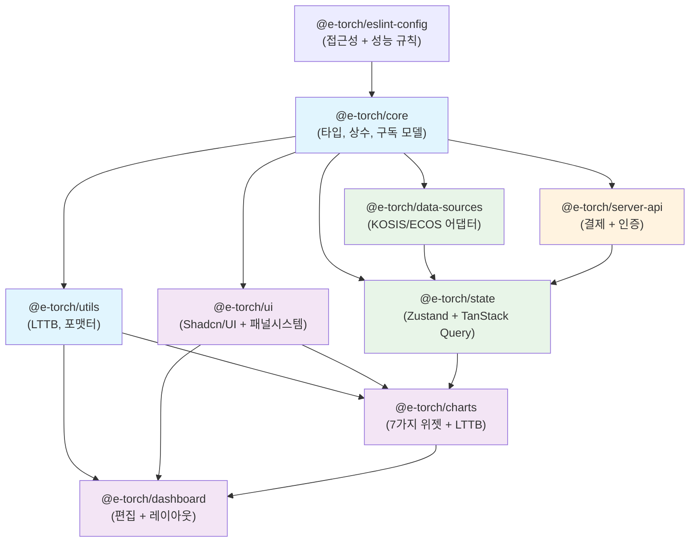
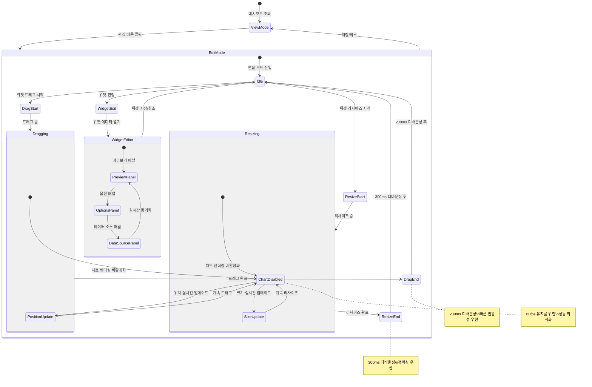
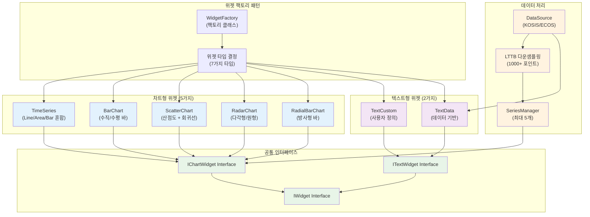
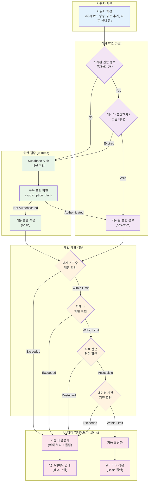

# E-Torch 프론트엔드 아키텍처

## 1. 아키텍처 개요

### 1.1 E-Torch 특화 제약사항

| 도메인 특성 | 기술적 제약 | 구현 방법 |
|------------|------------|----------|
| **KOSIS/ECOS 통합** | 이기종 API + 구독 플랜별 제한 | 어댑터 패턴 + UI 제한 |
| **1000+ 데이터 포인트** | 메모리 200MB 제한 | LTTB 다운샘플링 |
| **구독 모델** | 권한 검증 < 10ms | 클라이언트 캐시 5분 |
| **7가지 위젯 타입** | 차트 5개 + 텍스트 2개 | 팩토리 패턴 |
| **토스페이먼츠 빌링** | 자동 갱신 구독 | SDK v2 + 빌링키 |
| **WCAG 2.1 AA** | 차트 접근성 | 데이터 테이블 + aria-label |

### 1.2 핵심 성능 목표

| 기능 | 목표값 | 측정 기준 |
|------|--------|----------|
| 차트 렌더링 | < 2초 | 1000포인트 시계열 |
| 편집 반응성 | 60fps | 드래그 200ms + 리사이즈 300ms |
| 메모리 사용량 | < 200MB | 대시보드당 |
| 권한 검증 | < 10ms | 플랜별 기능 제한 |
| 터치 타겟 | 44×44px | 모든 인터랙티브 요소 |

## 2. 기술 스택

### 2.1 핵심 기술

| 영역 | 기술 | 버전 | E-Torch 특화 설정 |
|------|------|------|------------------|
| **모노레포** | Turborepo + pnpm | 2.5.3 + 10.11.0 | 9패키지 분할 |
| **프레임워크** | Next.js + React | 15.3.2 + 19.1.0 | App Router + useOptimistic |
| **UI** | Tailwind CSS + Shadcn/UI | 4.1.7 + latest | CSS-first, OKLCH 색상 |
| **상태관리** | Zustand + TanStack Query | 5.0.5 + 5.77.0 | **서버/클라이언트 분리 전략** |
| **차트** | Recharts | 2.15.3 | LTTB + 7가지 위젯 |
| **레이아웃** | react-grid-layout | 1.5.1 | 200ms/300ms 디바운싱 |
| **인증** | Supabase Auth | v2 | SNS 3개 + 구독 모델 |
| **결제** | **토스페이먼츠 SDK v2** | **latest** | **통합 SDK + 빌링키** |

### 2.2 Tailwind CSS 4 레이아웃 설정

```css
@theme {
  /* E-Torch 브랜드 색상 (OKLCH) */
  --color-primary: oklch(0.2 0.15 240);     /* #0c1e3e */
  --color-secondary: oklch(0.5 0.2 230);    /* #1a56db */
  --color-tertiary: oklch(0.45 0.18 220);   /* #0284c7 */
  
  /* 반응형 헤더 높이 */
  --header-desktop: 80px; --header-tablet: 72px; --header-mobile: 64px;
  /* 편집 툴바 높이 */
  --toolbar-desktop: 64px; --toolbar-tablet: 56px;
  /* 사이드바 너비 */
  --sidebar-width: 200px; --sidebar-collapsed: 60px;
  
  /* 위젯 에디터 패널 시스템 */
  --preview-panel-min: 400px; --options-panel-min: 320px;
  --property-panel-width: 320px; --property-panel-range: 280px-480px;
  
  /* 위젯 최소 크기 */
  --widget-min-desktop: 300px 200px; --widget-min-tablet: 250px 180px;
  
  /* 성능 최적화 디바운싱 */
  --debounce-drag: 200ms; --debounce-resize: 300ms; --debounce-search: 300ms;
  
  /* 터치 최적화 */
  --touch-target: 44px; --touch-spacing: 8px;
  
  /* 그리드 시스템 */
  --grid-cols-desktop: 12; --grid-cols-tablet: 8; --grid-cols-mobile: 4;
  --grid-gap-desktop: 16px; --grid-gap-tablet: 12px; --grid-gap-mobile: 8px;
}
```

## 3. 아키텍처 계층 구조

### 3.1 서버/클라이언트 컴포넌트 분리

| 컴포넌트 유형 | 책임 | 구현 방식 |
|-------------|------|----------|
| **서버 컴포넌트** | 권한 확인, 메타데이터, 초기 데이터 | App Router RSC |
| **클라이언트 컴포넌트** | 차트 렌더링, 편집, 상태 관리 | "use client" |
| **서버 액션** | 결제, 구독 관리, 데이터 변경 | "use server" |

### 3.2 데이터 아키텍처 (자체 DB 저장)

| 데이터 계층 | 책임 | 제약사항 |
|------------|------|---------|
| **백엔드 수집** | KOSIS/ECOS 원본 데이터 저장 | 없음 (자체 DB 저장) |
| **프론트엔드 제공** | 구독 플랜별 제한 적용 | Basic: 3년/20개, Pro: 전체/40개 |
| **캐싱 레이어** | 성능 최적화 | API 15분, 계산 30분 |

```typescript
// 데이터 소스 설정 (구독 플랜별 제약 유지)
export const DATA_SOURCE_CONFIG = {
  KOSIS: {
    id: 'kosis',
    name: '통계청 KOSIS',
    status: 'active',
    supportedPeriods: ['M', 'Q', 'A'] as const,
    indicatorCount: { basic: 12, pro: 12 }
  },
  ECOS: {
    id: 'ecos', 
    name: '한국은행 ECOS',
    status: 'active',
    supportedPeriods: ['D', 'M', 'Q', 'A'] as const,
    indicatorCount: { basic: 8, pro: 28 }
  },
  OECD: {
    id: 'oecd',
    name: 'OECD 통계',
    status: 'inactive',          // 현재 완전 비활성화
    supportedPeriods: ['M', 'Q', 'A'], // 계획된 주기
    indicatorCount: { basic: 0, pro: 0 }, // 현재 미제공
    plannedRelease: '2025-Q3',   // 출시 예정일
    note: '향후 확장 예정, 현재 UI에서 비활성화'
  }
} as const

// 구독 플랜별 데이터 기간 제한 (프론트엔드)
export const validateDataPeriod = (plan: 'basic' | 'pro', startDate: Date, endDate: Date) => {
  if (plan === 'basic') {
    const threeYearsAgo = new Date()
    threeYearsAgo.setFullYear(threeYearsAgo.getFullYear() - 3)
    
    if (startDate < threeYearsAgo) {
      throw new Error('Basic 플랜은 최근 3년 데이터만 조회 가능합니다')
    }
  }
  // Pro 플랜: 전체 기간 조회 가능
}
```

### 3.3 7가지 위젯 시스템

| 위젯 타입 | 데이터 소스 필요 | 최대 시리즈 | 구현 클래스 |
|----------|----------------|------------|------------|
| time-series | ✅ | 5개 | TimeSeriesWidget |
| bar-chart | ✅ | 5개 | BarChartWidget |
| scatter-chart | ✅ | 5개 | ScatterChartWidget |
| radar-chart | ✅ | 5개 | RadarChartWidget |
| radial-bar-chart | ✅ | 5개 | RadialBarChartWidget |
| text-custom | ❌ | - | TextCustomWidget |
| text-data | ✅ | 1개 | TextDataWidget |

## 4. 모노레포 구조 (9패키지)

### 4.1 패키지 구조 최적화

| 패키지 | 주요 책임 | 핵심 export | 특화 기능 |
|--------|----------|-------------|----------|
| @e-torch/core | 타입, 상수, 구독 모델 | PLAN_LIMITS, 위젯 타입 | 구독 모델 제한사항 |
| @e-torch/utils | LTTB, 포맷터, 유틸리티 | useLTTBSampling | 1000+ 포인트 다운샘플링 |
| @e-torch/ui | Shadcn/UI + 패널 시스템 | AccessibleChart, ResizablePanel | WCAG 2.1 AA + 위젯 에디터 패널 |
| @e-torch/data-sources | KOSIS/ECOS 어댑터 | useDataSource | 플랜별 지표 필터링 |
| @e-torch/state | Zustand + TanStack Query | useGlobalState | **서버/클라이언트 분리** |
| @e-torch/charts | 7가지 위젯 + LTTB | WidgetFactory | 위젯 팩토리 패턴 |
| @e-torch/dashboard | 편집 + 레이아웃 | DashboardEditor | react-grid-layout |
| @e-torch/server-api | **결제 + 인증 + 서버액션** | **PaymentActions** | **토스페이먼츠 SDK v2** |
| @e-torch/eslint | 접근성 + 성능 규칙 | eslintConfig | jsx-a11y 규칙 |

### 4.2 패키지 의존성 그래프



### 4.3 편집 모드 상태 머신



### 4.4 데이터 플로우 아키텍처

```mermaid
graph LR
    subgraph "데이터 소스"
        KOSIS["KOSIS API<br/>(M,Q,A 주기)<br/>자체 DB 저장"]
        ECOS["ECOS API<br/>(D,M,Q,A 주기)<br/>자체 DB 저장"]
        OECD["OECD API<br/>(향후 확장)<br/>현재 비활성화"]
    end
    
    subgraph "어댑터 레이어"
        KOSISAdapter["KOSIS 어댑터<br/>응답 정규화"]
        ECOSAdapter["ECOS 어댑터<br/>응답 정규화"]
        OECDAdapter["OECD 어댑터<br/>(미구현)"]
    end
    
    subgraph "데이터 처리"
        Validator["데이터 검증<br/>(구독 플랜별 제한)"]
        Transformer["데이터 변환<br/>(원본값/변화율/누적값)"]
        LTTB["LTTB 다운샘플링<br/>(1000+ 포인트 임계값)"]
    end
    
    subgraph "캐싱 레이어"
        APICache["API 응답 캐시<br/>(15분)"]
        ComputeCache["계산 결과 캐시<br/>(30분)"]
        HistoryCache["과거 데이터 캐시<br/>(24시간)"]
    end
    
    subgraph "차트 렌더링"
        Recharts["Recharts<br/>(시각화)"]
        AccessibleChart["접근성 차트<br/>(WCAG 2.1 AA)"]
        DataTable["데이터 테이블<br/>(스크린 리더용)"]
    end
    
    subgraph "구독 모델 필터링"
        PlanFilter["플랜별 지표 필터<br/>(Basic: 20개, Pro: 40개)"]
        PeriodFilter["기간 제한 필터<br/>(Basic: 3년, Pro: 무제한)"]
    end
    
    KOSIS --> KOSISAdapter
    ECOS --> ECOSAdapter
    OECD --> OECDAdapter
    
    KOSISAdapter --> Validator
    ECOSAdapter --> Validator
    OECDAdapter --> Validator
    
    Validator --> PlanFilter
    PlanFilter --> PeriodFilter
    PeriodFilter --> Transformer
    
    Transformer --> LTTB
    LTTB --> APICache
    APICache --> ComputeCache
    ComputeCache --> HistoryCache
    
    HistoryCache --> Recharts
    Recharts --> AccessibleChart
    AccessibleChart --> DataTable
    
    classDef source fill:#e3f2fd
    classDef adapter fill:#f3e5f5
    classDef process fill:#e8f5e8
    classDef cache fill:#fff3e0
    classDef render fill:#fce4ec
    classDef filter fill:#f1f8e9
    
    class KOSIS,ECOS,OECD source
    class KOSISAdapter,ECOSAdapter,OECDAdapter adapter
    class Validator,Transformer,LTTB process
    class APICache,ComputeCache,HistoryCache cache
    class Recharts,AccessibleChart,DataTable render
    class PlanFilter,PeriodFilter filter
```



### 4.5 위젯 시스템 아키텍처



## 5. 성능 최적화

### 5.1 핵심 성능 목표

| 지표 | 목표값 | 측정 방법 | 구현 방법 |
|------|--------|----------|----------|
| **LCP** | < 2.5초 | Web Vitals API | 스켈레톤 UI + 지연 로딩 |
| **FID** | < 100ms | Web Vitals API | debounce 200ms/300ms |
| **CLS** | < 0.1 | Web Vitals API | 스켈레톤 UI 크기 고정 |
| **차트 렌더링** | < 2초 | Performance API | LTTB 1000+ 임계값 |
| **대시보드 로딩** | < 2초 | 사용자 타이밍 | Suspense + 점진적 로딩 |
| **메모리 사용량** | < 200MB | Performance API | 위젯 언마운트 시 정리 |

### 5.2 react-grid-layout 최적화

```typescript
// 정확한 디바운싱 시간 적용
const gridLayoutProps = {
  // 드래그: 빠른 반응성 우선 (200ms)
  onDragStop: debounce((layout) => {
    setChartRenderingEnabled(true)
    saveLayout(layout)
  }, 200),
  
  // 리사이즈: 정확성 우선 (300ms)  
  onResizeStop: debounce((layout) => {
    setChartRenderingEnabled(true)
    saveLayout(layout)
  }, 300),
  
  // 편집 중 성능 최적화
  onDragStart: () => setChartRenderingEnabled(false),
  onResizeStart: () => setChartRenderingEnabled(false),
}
```

### 5.3 차트 렌더링 최적화

| 조건 | 임계값 | 최적화 방법 | 구현 위치 |
|------|--------|------------|----------|
| 데이터 포인트 | 1000+ | LTTB 다운샘플링 | @e-torch/charts |
| 위젯 개수 | 20+ | react-window 가상화 | @e-torch/dashboard |
| 편집 모드 | 드래그/리사이즈 중 | 차트 렌더링 비활성화 | 편집 컴포넌트 |
| 메모리 사용 | 200MB+ | 컴포넌트 언마운트 시 정리 | useEffect cleanup |

## 6. 구독 모델 + 토스페이먼츠

### 6.1 권한 검증 (< 10ms 캐싱)

```typescript
// 5분 캐시로 권한 검증 최적화
export const useAuthWithCache = () => {
  const { data: session } = useQuery({
    queryKey: ['auth-session'],
    queryFn: () => supabase.auth.getSession(),
    staleTime: 5 * 60 * 1000, // 5분 캐시
    gcTime: 10 * 60 * 1000,   // 10분 가비지 컬렉션
  })
  return { 
    user: session?.user, 
    plan: session?.user?.subscription_plan || 'basic' 
  }
}
```

### 6.2 플랜별 제한

| 기능 | Basic (무료) | Pro (유료) | 기술 구현 |
|------|-------------|-----------|----------|
| **대시보드 수** | 3개 | 무제한 | DB 제약 + UI 진행바 |
| **위젯 수** | 6개/대시보드 | 무제한 | react-grid-layout 제한 |
| **경제지표** | 20개 (KOSIS 12개 + ECOS 8개) | 40개 (KOSIS 12개 + ECOS 28개) | 프론트엔드 필터링 |
| **데이터 기간** | 최근 3년 | 전체 기간 | DatePicker 비활성화 |
| **워터마크** | "E-Torch로 제작됨" | 제거 가능 | CSS 오버레이 |
| **대시보드 복사** | 불가 | 가능 | 버튼 비활성화 |
| **임베드 코드** | 불가 | 가능 | Pro 전용 기능 |
| **내보내기 품질** | 워터마크 + 1.6배율 | 고해상도 2배율 | Canvas 렌더링 설정 |

```typescript
// 권한 검증 상수
export const PLAN_LIMITS = {
  basic: {
    dashboards: 3,
    widgets: 6,
    indicators: 20, // KOSIS 12개 + ECOS 8개
    indicatorsBySource: { kosis: 12, ecos: 8, oecd: 0 },
    dataYears: 3,
    watermark: true,
    copyDashboard: false,
    embedCode: false,
    exportScale: 1.6
  },
  'pro-trial': {              // 기획서 SM-007: 7일 무료 체험
    ...PLAN_LIMITS.pro,
    trialDays: 7
  },
  pro: {
    dashboards: Infinity,
    widgets: Infinity,
    indicators: 40, // KOSIS 12개 + ECOS 28개  
    indicatorsBySource: { kosis: 12, ecos: 28, oecd: 0 },
    dataYears: Infinity,
    watermark: false, // 제거 가능
    copyDashboard: true,
    embedCode: true,
    exportScale: 2.0
  }
} as const
```

#### 6.2.1 프로모션 기능 (기획서 SM-007, SM-008)

| 기능 | 기획서 명시 내용 | 구현 위치 | 기술적 제약 |
|------|----------------|----------|------------|
| **7일 무료 체험** | "Pro 플랜 전용, 신규 사용자만 가능" | 클라이언트 권한 체크 | 만료 시 자동 Basic 전환 |
| **첫 달 50% 할인** | "신규 유료 구독 시 할인" | 결제 금액 계산 로직 | E-Torch 서버에서 할인 계산 |

```typescript
// 신규 가입 할인 적용
export const calculateDiscountedPrice = (plan: 'monthly' | 'yearly', isFirstTime: boolean) => {
  const basePrice = plan === 'monthly' ? 9900 : 99000
  const discount = isFirstTime ? 0.5 : 0 // 50% 할인
  
  return {
    originalPrice: basePrice,
    discountedPrice: Math.floor(basePrice * (1 - discount)),
    discount: discount * 100 // 퍼센트
  }
}
```

### 6.3 **토스페이먼츠 SDK v2 통합**

```typescript
// 토스페이먼츠 SDK v2 기반 구독 결제
export const PaymentWidget = ({ plan }: { plan: 'monthly' | 'yearly' }) => {
  const { loadTossPayments } = useTossPayments()
  
  const handleSubscription = async () => {
    const tossPayments = await loadTossPayments(process.env.NEXT_PUBLIC_TOSS_CLIENT_KEY)
    
    // 빌링키 발급 + 첫 결제
    await tossPayments.requestBillingAuth('카드', {
      customerKey: user.id,
      successUrl: '/payment/success',
      failUrl: '/payment/fail',
      // 구독 플랜별 금액
      amount: plan === 'monthly' ? 9900 : 99000
    })
  }
  
  return <button onClick={handleSubscription}>구독하기</button>
}

// 서버 액션: 자동 결제 스케줄링
export async function processSubscriptionPayment(billingKey: string, customerKey: string) {
  'use server'
  
  const payment = await fetch('https://api.tosspayments.com/v1/billing/{billingKey}', {
    method: 'POST',
    headers: {
      'Authorization': `Basic ${Buffer.from(process.env.TOSS_SECRET_KEY + ':').toString('base64')}`,
      'Content-Type': 'application/json'
    },
    body: JSON.stringify({
      customerKey,
      amount: getPlanAmount(customerKey),
      orderId: generateOrderId(),
      orderName: 'E-Torch Pro 구독'
    })
  })
  
  return payment.json()
}

// 7일 무료 체험 시스템
export const ProTrialManager = () => {
  const { user } = useAuth()
  const [trialStatus, setTrialStatus] = useState<'eligible' | 'active' | 'expired' | 'used'>('eligible')
  
  const startProTrial = async () => {
    if (trialStatus !== 'eligible') return
    
    await supabase
      .from('user_subscriptions')
      .upsert({
        user_id: user.id,
        plan: 'pro-trial',
        trial_start: new Date(),
        trial_end: new Date(Date.now() + 7 * 24 * 60 * 60 * 1000), // 7일 후
        status: 'trial_active'
      })
    
    setTrialStatus('active')
  }
  
  return (
    <Button onClick={startProTrial} disabled={trialStatus !== 'eligible'}>
      {trialStatus === 'eligible' ? '7일 무료 체험 시작' : '이미 체험 완료'}
    </Button>
  )
}
```

### 6.4 구독 모델 권한 검증 플로우



## 7. **에러 바운더리 아키텍처**

### 7.1 계층별 에러 처리 전략

| 계층 | 에러 유형 | 처리 방법 | Fallback UI |
|------|----------|----------|------------|
| **차트 레벨** | 렌더링 실패, LTTB 오류 | ChartErrorBoundary | 에러 메시지 + 재시도 |
| **위젯 레벨** | 데이터 로딩 실패 | WidgetErrorBoundary | 스켈레톤 + 오류 아이콘 |
| **대시보드 레벨** | 레이아웃 오류, 권한 오류 | DashboardErrorBoundary | 부분 복구 + 전체 재로드 |
| **앱 레벨** | 예상치 못한 오류 | RootErrorBoundary | 전체 앱 재시작 |

### 7.2 에러 바운더리 구조

```typescript
// 차트 전용 에러 바운더리
export class ChartErrorBoundary extends Component<PropsWithChildren> {
  state = { hasError: false, error: null }
  
  static getDerivedStateFromError(error: Error) {
    return { hasError: true, error }
  }
  
  render() {
    if (this.state.hasError) {
      return (
        <div className="chart-error">
          <AlertTriangle className="w-8 h-8 text-orange-500" />
          <p>차트를 불러올 수 없습니다</p>
          <Button onClick={() => this.setState({ hasError: false })}>
            다시 시도
          </Button>
        </div>
      )
    }
    return this.props.children
  }
}

// 권한 오류 전용 처리
export const AuthErrorBoundary = ({ children }: PropsWithChildren) => {
  return (
    <ErrorBoundary 
      fallback={<UnauthorizedAccess />}
      onError={(error) => {
        if (error.message.includes('unauthorized')) {
          router.push('/login')
        }
      }}
    >
      {children}
    </ErrorBoundary>
  )
}
```

## 8. 알림 시스템 (기획서 NS-007)

### 8.1 구독 관련 알림

| 알림 유형 | 기획서 명시 내용 | 구현 방법 |
|----------|----------------|----------|
| **구독 갱신 예정 알림** | "7일 전, Pro 구독자만 해당" | 이메일 + 인앱 알림 |
| **결제 성공/실패 알림** | 기본 알림 시스템 | 토스트 + 이메일 |

## 9. **타입 안전성 시스템**

### 9.1 위젯 타입 시스템

```typescript
// 위젯 타입별 Props 타입 안전성
export type WidgetType = 
  | 'time-series' 
  | 'bar-chart' 
  | 'scatter-chart' 
  | 'radar-chart' 
  | 'radial-bar-chart'
  | 'text-custom' 
  | 'text-data'

export type WidgetProps<T extends WidgetType> = 
  T extends 'time-series' ? TimeSeriesWidgetProps :
  T extends 'bar-chart' ? BarChartWidgetProps :
  T extends 'scatter-chart' ? ScatterChartWidgetProps :
  T extends 'radar-chart' ? RadarChartWidgetProps :
  T extends 'radial-bar-chart' ? RadialBarChartWidgetProps :
  T extends 'text-custom' ? TextCustomWidgetProps :
  T extends 'text-data' ? TextDataWidgetProps :
  never

// 구독 플랜 타입 안전성
export type SubscriptionPlan = 'basic' | 'pro'

export type PlanLimits<T extends SubscriptionPlan> = {
  readonly dashboards: T extends 'basic' ? 3 : typeof Infinity
  readonly widgets: T extends 'basic' ? 6 : typeof Infinity
  readonly indicators: T extends 'basic' ? 20 : 40
  readonly dataYears: T extends 'basic' ? 3 : typeof Infinity
  readonly watermark: T extends 'basic' ? true : false
  readonly copyDashboard: T extends 'basic' ? false : true
  readonly embedCode: T extends 'basic' ? false : true
  readonly exportScale: T extends 'basic' ? 1.6 : 2.0
}

// 데이터 소스 타입 안전성
export type DataSourceType = 'kosis' | 'ecos' | 'oecd'
export type DataPeriod = 'D' | 'M' | 'Q' | 'A'

export interface DataSourceConfig<T extends DataSourceType> {
  readonly id: T
  readonly name: string
  readonly status: 'active' | 'planned' | 'deprecated'
  readonly supportedPeriods: readonly DataPeriod[]
  readonly indicatorCount: { basic: number; pro: number }
}
```

### 9.2 런타임 타입 검증

```typescript
// Zod를 활용한 런타임 검증
import { z } from 'zod'

export const WidgetConfigSchema = z.discriminatedUnion('type', [
  z.object({
    type: z.literal('time-series'),
    dataSources: z.array(DataSourceSchema).max(5),
    options: TimeSeriesOptionsSchema
  }),
  z.object({
    type: z.literal('text-custom'),
    content: z.string().max(10000),
    options: TextCustomOptionsSchema
  })
])

export type WidgetConfig = z.infer<typeof WidgetConfigSchema>

// API 응답 검증
export const validateApiResponse = <T>(schema: z.ZodSchema<T>) => 
  (data: unknown): T => {
    const result = schema.safeParse(data)
    if (!result.success) {
      throw new Error(`API 응답 검증 실패: ${result.error.message}`)
    }
    return result.data
  }
```

## 10. 워터마크 + 접근성

### 10.1 워터마크 시스템

```typescript
interface WatermarkProps {
  show: boolean
  onExport?: boolean
  position?: 'bottom-right' | 'bottom-left'
  opacity?: number
}

const Watermark = ({ 
  show, 
  onExport = false, 
  position = 'bottom-right',
  opacity = 0.7
}: WatermarkProps) => {
  if (!show) return null
  
  return (
    <div 
      className={cn(
        "absolute bottom-2 z-50 pointer-events-none",
        position === 'bottom-right' ? "right-2" : "left-2",
        "bg-black/10 px-2 py-1 rounded text-xs text-gray-600",
        onExport ? "print:block" : "print:hidden"
      )}
      style={{ opacity }}
      aria-hidden="true"
    >
      E-Torch로 제작됨
    </div>
  )
}

// 내보내기 시 워터마크 + 품질 설정
export const exportDashboard = async (format: 'png' | 'pdf') => {
  const { plan } = useSubscription()
  const scale = PLAN_LIMITS[plan].exportScale
  const includeWatermark = PLAN_LIMITS[plan].watermark
  
  const canvas = await html2canvas(dashboardRef.current, {
    scale,
    useCORS: true,
    backgroundColor: '#ffffff',
    // Pro 플랜: 고품질, Basic: 워터마크 포함
    ignoreElements: (element) => {
      return !includeWatermark && element.classList.contains('watermark')
    }
  })
  
  return canvas.toDataURL('image/png', plan === 'pro' ? 1.0 : 0.8)
}
```

### 10.2 WCAG 2.1 AA 접근성

| 요구사항 | 구현 방법 | 검증 도구 | 패키지 위치 |
|----------|----------|----------|------------|
| 차트 대체 텍스트 | aria-label + 데이터 테이블 | axe-core | @e-torch/ui |
| 키보드 네비게이션 | tabindex, Arrow키 지원 | 수동 테스트 | 모든 컴포넌트 |
| 색상 대비 4.5:1 | OKLCH 기반 자동 검증 | Colour Contrast Analyser | @e-torch/ui |
| 터치 타겟 44×44px | min-w/h-[44px] 클래스 | 시각적 확인 | @e-torch/ui |

```typescript
// 접근성 컴포넌트 (@e-torch/ui)
export const AccessibleChart = ({ 
  data, 
  chartType, 
  ariaLabel 
}: AccessibleChartProps) => {
  const summaryText = generateDataSummary(data)
  
  return (
    <div role="img" aria-label={ariaLabel}>
      {/* 시각적 차트 */}
      <ChartComponent data={data} type={chartType} />
      
      {/* 스크린 리더용 데이터 테이블 (숨김) */}
      <table className="sr-only" aria-label={`${ariaLabel} 데이터 테이블`}>
        <caption>{summaryText}</caption>
        <thead>
          <tr>
            <th>날짜</th>
            <th>값</th>
          </tr>
        </thead>
        <tbody>
          {data.map((item, index) => (
            <tr key={index}>
              <td>{item.date}</td>
              <td>{item.value}</td>
            </tr>
          ))}
        </tbody>
      </table>
    </div>
  )
}
```

## 11. 모바일 최적화

### 11.1 편집 기능 제한사항

| 화면 크기 | 드래그 | 리사이즈 | 크기 조절 방법 | 구현 방식 |
|----------|-------|---------|-------------|----------|
| **데스크톱 1200px+** | ✅ 지원 | ✅ 핸들 | 모서리 드래그 | react-grid-layout 기본 |
| **태블릿 768-1199px** | ✅ 지원 | ✅ 확대 핸들 | 터치 최적화 핸들 (48×48px) | 터치 이벤트 |
| **모바일 ~767px** | ✅ 지원 | ❌ 비활성화 | 속성 패널 프리셋만 | 풀스크린 모달 |

```typescript
// 모바일 편집 제한 구현
const useResponsiveGridProps = () => {
  const isMobile = useMediaQuery("(max-width: 767px)")
  const isTablet = useMediaQuery("(min-width: 768px) and (max-width: 1199px)")
  
  return {
    isDraggable: true, // 모든 화면에서 드래그 지원
    isResizable: !isMobile, // 모바일에서만 리사이즈 비활성화
    
    // 터치 타겟 크기 조정
    ...(isTablet && {
      resizeHandles: ['se'], // 우하단만
      resizeHandle: <div className="w-12 h-12 absolute -bottom-2 -right-2" />
    }),
    
    // 모바일 대체 리사이즈
    ...(isMobile && {
      onLayoutChange: (layout) => {
        // 드래그로만 위치 변경, 크기는 속성 패널에서
      }
    })
  }
}

// 모바일 위젯 크기 프리셋 (속성 패널에서 선택)
const MOBILE_WIDGET_PRESETS = {
  small: { w: 4, h: 2, label: '작게 (2행)', icon: '📊' },
  medium: { w: 4, h: 3, label: '중간 (3행)', icon: '📈' },
  large: { w: 4, h: 4, label: '크게 (4행)', icon: '📉' },
  extra: { w: 4, h: 6, label: '매우 크게 (6행)', icon: '📋' }
} as const

// 모바일 속성 패널 크기 조절 UI
const MobileWidgetSizeSelector = ({ currentSize, onChange }) => (
  <div className="grid grid-cols-2 gap-2 p-4">
    {Object.entries(MOBILE_WIDGET_PRESETS).map(([key, preset]) => (
      <Button
        key={key}
        variant={currentSize.h === preset.h ? "default" : "outline"}
        className="h-16 flex-col"
        onClick={() => onChange(preset)}
      >
        <span className="text-2xl">{preset.icon}</span>
        <span className="text-xs">{preset.label}</span>
      </Button>
    ))}
  </div>
)
```

### 11.2 터치 인터페이스 최적화

| 설정 | 값 | 적용 범위 | CSS 구현 |
|------|----|---------|---------|
| 터치 타겟 | 44×44px | 모든 버튼, 링크 | min-w-[44px] min-h-[44px] |
| 터치 간격 | 8px | 인접 요소 | space-x-2 space-y-2 |
| 드래그 핸들 | 48×48px | 위젯 이동 핸들 | w-12 h-12 |
| 스와이프 감지 | 100px 이동 | 대시보드 네비게이션 | 터치 이벤트 |

## 12. 개발 도구 설정

### 12.1 ESLint 접근성 + 성능 규칙

```json
{
  "extends": [
    "plugin:jsx-a11y/recommended",
    "plugin:react-hooks/recommended"
  ],
  "rules": {
    "jsx-a11y/alt-text": "error",
    "jsx-a11y/aria-label": "error",
    "jsx-a11y/click-events-have-key-events": "error",
    "react-hooks/exhaustive-deps": "warn",
    "@typescript-eslint/no-unused-vars": "error"
  }
}
```

### 12.2 성능 모니터링

| 지표 | 목표값 | 경고 임계값 | 에러 임계값 | 자동 대응 |
|------|--------|------------|-----------|----------|
| LCP | < 2.5초 | > 3초 | > 5초 | 콘솔 경고 |
| FID/INP | < 200ms | > 300ms | > 500ms | 디바운싱 강화 |
| CLS | < 0.1 | > 0.2 | > 0.3 | 스켈레톤 UI 강화 |
| 메모리 | < 200MB | > 250MB | > 300MB | 가비지 컬렉션 강제 |
