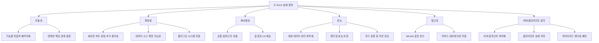
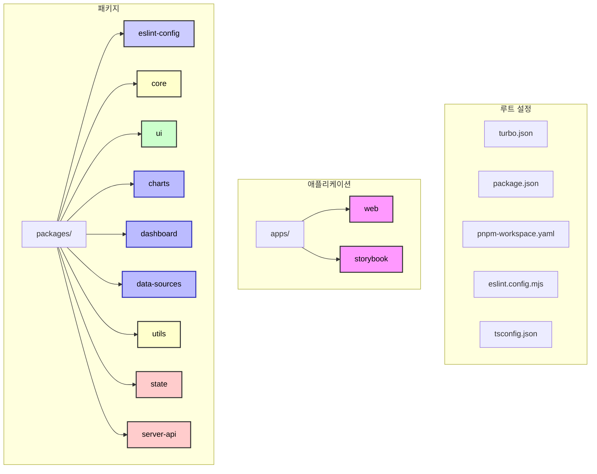
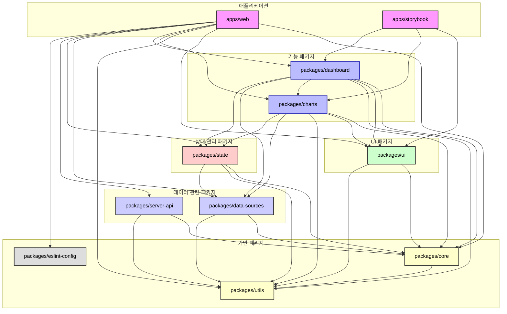
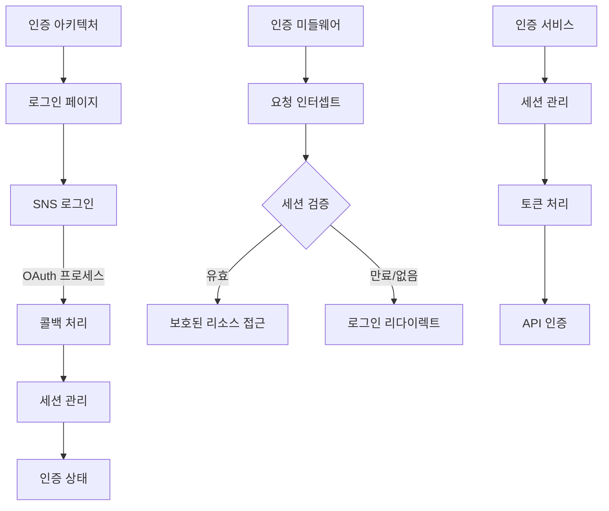
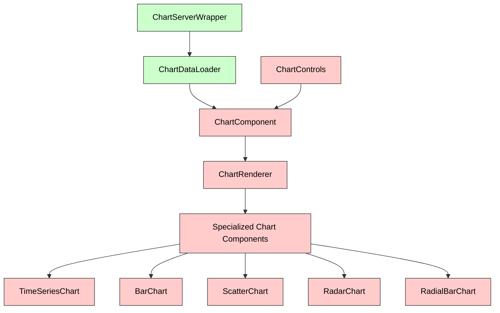
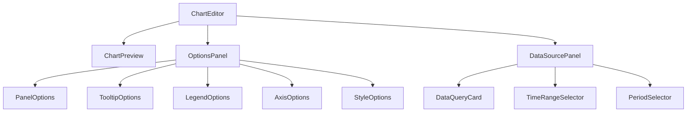
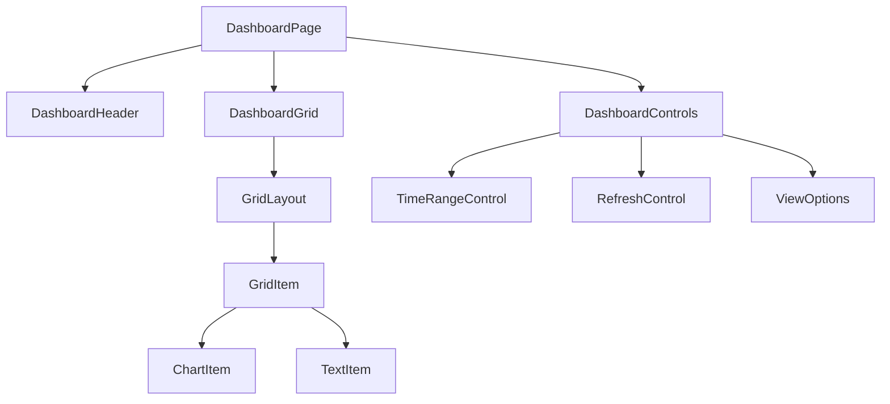
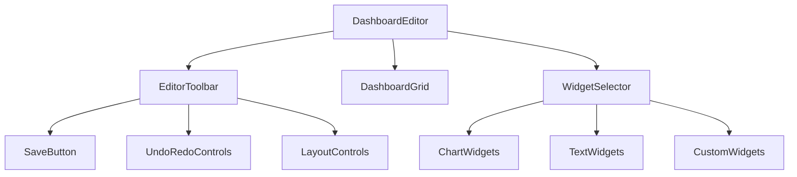
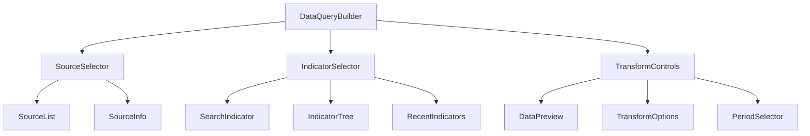

# E-Torch 프론트엔드 아키텍처 설계 문서

## 1. 개요

E-Torch 프로젝트의 프론트엔드 아키텍처는 모듈성, 재사용성, 확장성을 중심으로 구축되었습니다. 본 문서는 E-Torch의 주요 기능 구현에 필요한 핵심 컴포넌트들의 구조, 상호작용, 책임 범위를 정의하며, 특히 Next.js 15의 서버/클라이언트 컴포넌트 아키텍처와 React 19의 새로운 기능을 활용한 설계 패턴을 제시합니다.

### 1.1 프로젝트 목표

- 다양한 출처의 경제지표 데이터를 통합 제공
- 사용자 맞춤형 대시보드를 통한 경제지표 시각화 및 인사이트 도출
- 전문가와 일반 사용자 모두를 위한 경제데이터 접근성 향상
- 직관적이고 유연한 차트 컴포넌트와 에디터 기능 제공

### 1.2 설계 원칙



## 2. 기술 스택

| 영역 | 기술 | 선정 이유 | 버전 |
|------|------|----------|------|
| **모노레포 관리** | Turborepo | 빌드 캐싱, 병렬 실행, 의존성 관리 기능 우수 | 2.0.0+ |
| **패키지 관리** | pnpm | 디스크 공간 절약, 의존성 중복 설치 방지 | 8.0.0+ |
| **프레임워크** | React + Next.js | App Router, 서버 컴포넌트 제공 | React 19, Next.js 15 |
| **UI 프레임워크** | Shadcn/UI + Tailwind CSS | 커스터마이징 용이성, 생산성 향상 | Tailwind CSS 4 |
| **상태 관리** | Zustand, Tanstack Query | 단순한 API, 성능 최적화, 상태 로직 분리 | Zustand 5, TQ 5 |
| **차트 라이브러리** | Recharts | React 친화적, 유연한 커스터마이징 | 2.15.3+ |
| **대시보드 레이아웃** | react-grid-layout | 드래그 앤 드롭, 리사이징 지원 | 1.5.1+ |
| **타입 검사** | TypeScript | 타입 안정성, 개발 생산성 향상 | 5.5+ |
| **폼 관리** | React Hook Form + Zod | 성능 최적화, 선언적 유효성 검사 | RHF 7, Zod 3 |
| **코드 품질 관리** | ESLint | 일관된 코드 스타일, 오류 감지 | ESLint 9 (Standard 규칙) |
| **테스트** | Vitest + Testing Library + Playwright | 단위/통합/E2E 테스트 도구 | Vitest 1, Playwright 1.40+ |
| **문서화** | Storybook | 컴포넌트 문서화, 시각적 테스트 | 8.0+ |
| **아이콘** | Lucide React | 가볍고 확장 가능한 아이콘 세트 | 1.0.0+ |
| **폰트** | Inter, JetBrains Mono | 가독성 및 기술적 콘텐츠 표현에 최적화 | - |
| **인증** | Supabase Auth | OAuth 지원, JWT 토큰 관리 | Supabase JS v2 |

## 3. 아키텍처 계층 구조

E-Torch 프론트엔드 아키텍처는 여러 계층으로 구성되어 관심사를 명확히 분리합니다.


### 3.1 서버/클라이언트 컴포넌트 분리 개요

Next.js App Router 환경에서는 서버와 클라이언트 컴포넌트를 명확히 구분하여 활용합니다.

서버/클라이언트 컴포넌트 주요 구분 원칙:

- 서버 컴포넌트: 데이터 페칭, 메타데이터 생성, 정적 UI 렌더링
- 클라이언트 컴포넌트: 상호작용 UI, 상태 관리, 이벤트 핸들링
- 하이브리드 패턴: 서버에서 데이터를 페칭하여 클라이언트 컴포넌트에 전달

상세 구현 패턴과 전략은 [`core-components.md`](./components/core-components.md) 문서를 참조하십시오.

## 4. 모노레포 패키지 구조 설계

E-Torch 프로젝트는 다음과 같은 패키지로 구성되어 있습니다:



### 4.1 패키지별 책임 구분

| 패키지 | 주요 책임 | 핵심 컴포넌트 |
|-------|---------|-------------|
| **eslint-config** | 코드 스타일 및 품질 규칙 | 기본 ESLint 설정, Next.js ESLint 설정 |
| **core** | 타입 정의, 상수 관리 | 차트 타입, 대시보드 타입, 데이터 소스 타입, 커맨드 패턴 타입 |
| **ui** | Shadcn/UI 기반 UI 컴포넌트 | 버튼, 카드, 다이얼로그, 접근성 컴포넌트, 레이아웃 컴포넌트 |
| **charts** | 차트 관련 컴포넌트 | 시계열 차트, 바 차트, 스캐터 차트, 차트 에디터 |
| **dashboard** | 대시보드 관련 컴포넌트 | 대시보드 그리드, 위젯, 대시보드 에디터 |
| **data-sources** | 데이터 소스 연동 | 데이터 커넥터, 변환, 쿼리 컴포넌트 |
| **utils** | 유틸리티 함수 | 포맷터, 벨리데이터, 헬퍼 함수 |
| **state** | 상태 관리 | Zustand 스토어, TanStack Query 훅, 서비스 |
| **server-api** | 서버 API 연동 | API 클라이언트, 서버 액션, 미들웨어 |

### 4.2 패키지 의존성 구조

각 패키지 간의 의존성을 명확하게 정의하여 순환 의존성을 방지하고 패키지의 책임을 명확히 합니다.



### 4.3 UI 컴포넌트와 서버/클라이언트 통합 전략

Shadcn/UI는 기본적으로 클라이언트 컴포넌트로 제공되므로, 서버 컴포넌트에서 사용하기 위한 래퍼 패턴을 채택합니다. 상세 구현은 [`core-components.md`](./components/core-components.md#34-ui-컴포넌트-서버-래퍼-패턴) 문서를 참조하십시오.

## 5. 패키지별 책임 구분

### 5.1 `packages/eslint-config`

`eslint-config` 패키지는 코드 스타일과 품질 관리를 위한 ESLint 설정을 담당합니다:

- 기본 ESLint 설정(base.mjs): 모든 패키지에 적용되는 기본 린트 규칙
- Next.js 특화 설정(next.mjs): Next.js 앱에 특화된 린트 규칙
- Standard JS/JSX 규칙 통합
- TypeScript ESLint 규칙
- React Hooks 규칙

ESLint 설정 구성:

```javascript
// 프로젝트 루트의 eslint.config.mjs
import { defineConfig } from 'eslint/config'
import { config } from '@e-torch/eslint-config/base'

export default defineConfig([
  {
    ignores: ['apps/**', 'packages/**']
  },
  ...config
])
```

```javascript
// packages/eslint-config/base.mjs
import standardJs from '@seungwoo321/eslint-plugin-standard-js'
import standardJsx from '@seungwoo321/eslint-plugin-standard-jsx'
import tseslint from 'typescript-eslint'

export const config = [
  {
    ignores: ['apps/*/node_modules/*', 'packages/*/node_modules/*', 'node_modules/*', 'apps/web/app/components/ui/*']
  },
  {
    files: ['**/*.{js,mjs,cjs,ts,mts,jsx,tsx}'],
    extends: [
      ...standardJs.configs.recommended,
      ...standardJsx.configs.recommended,
      ...tseslint.configs.recommended,
      ...tseslint.configs.stylistic,
    ],
  }
]
```

```javascript
// packages/eslint-config/next.mjs
import { config as baseConfig } from './base.mjs'
import pluginNext from "@next/eslint-plugin-next"
import pluginReactHooks from "eslint-plugin-react-hooks"
import tseslint from "typescript-eslint"

export const nextJsConfig = [
  ...baseConfig,
  tseslint.configs.recommended,
  {
    plugins: {
      "@next/next": pluginNext,
    },
    rules: {
      ...pluginNext.configs.recommended.rules,
      ...pluginNext.configs["core-web-vitals"].rules,
    },
  },
  {
    plugins: {
      "react-hooks": pluginReactHooks,
    },
    settings: { react: { version: "detect" } },
    rules: {
      ...pluginReactHooks.configs.recommended.rules,
      "react/react-in-jsx-scope": "off",
      "react/prop-types": "off"
    }
  }
]
```

### 5.2 `packages/core`

`core` 패키지는 공통 타입과 인터페이스 정의:

- 다른 패키지에 의존하지 않음
- 공통 타입, 상수, 인터페이스 정의
- 모든 패키지에서 사용하는 기본 구조 제공

### 5.3 `packages/ui`

`ui` 패키지는 기본 UI 컴포넌트만 담당합니다:

- 재사용 가능한 기본 컴포넌트 제공
- Shadcn/UI 기반 컴포넌트 통합
- 클라이언트 컴포넌트와 서버 래퍼 관리
- 도메인 로직 포함하지 않음

### 5.4 `packages/charts`

`charts` 패키지는 차트 관련 모든 기능 담당:

- 차트 컴포넌트 구현
- 차트 렌더링 로직
- 차트 에디터 기능
- 차트별 옵션 관리

### 5.5 `packages/dashboard`

`dashboard` 패키지는 대시보드 관련 모든 기능 담당:

- 대시보드 컴포넌트 구현
- 대시보드 그리드 시스템
- 대시보드 CRUD 기능
- 레이아웃 관리 기능

### 5.6 `packages/data-sources`

`data-sources` 패키지는 데이터 통합 담당:

- 다양한 경제지표 데이터 소스 연결
- 데이터 정규화 및 변환
- 쿼리 관리 기능

### 5.7 `packages/utils`

`utils` 패키지는 공통 유틸리티 제공:

- 데이터 포맷팅
- 유효성 검사
- 헬퍼 함수

### 5.8 `packages/state`

`state` 패키지는 상태 관리 담당:

- Zustand 기반 클라이언트 상태
- Tanstack Query 기반 서버 상태
- 상태 관리 패턴 통합

### 5.9 `packages/server-api`

`server-api` 패키지는 서버 API 연동 담당:

- API 경로 핸들러
- 서버 액션 구현
- 미들웨어 관리

## 6. 인증 아키텍처

E-Torch는 Supabase를 활용한 인증 시스템을 구현합니다:



인증 관련 핵심 컴포넌트:

- Supabase 클라이언트 - JWT 기반 인증 처리
- 세션 관리 - 로그인 상태 유지 및 관리
- 인증 미들웨어 - 보호된 라우트에 대한 접근 제어
- 인증 스토어 - 클라이언트 상태에서의 인증 정보 관리
- OAuth 콜백 처리 - SNS 인증 후 리다이렉션 처리

## 7. 차트 컴포넌트 설계

차트 표시 및 편집 관련 컴포넌트는 E-Torch의 핵심 기능으로, 서버 컴포넌트와 클라이언트 컴포넌트의 조합으로 구현됩니다.

### 7.1 차트 컴포넌트 계층 구조



#### 컴포넌트별 책임 정의

| 컴포넌트 | 유형 | 책임 | 연결된 옵션 컴포넌트 |
|---------|------|-----|------------------|
| **ChartServerWrapper** | 서버 | 서버 측 데이터 페칭, 초기 데이터 준비, 메타데이터 로드 | - |
| **ChartDataLoader** | 서버 | 차트별 데이터 로드 최적화, 데이터 변환 | - |
| **ChartComponent** | 클라이언트 | 차트 렌더링 상태 관리, 이벤트 핸들링, 서버 데이터 hydration | ChartControls, OptionsPanel |
| **ChartRenderer** | 클라이언트 | 차트 타입에 따른 렌더링 로직 분기, 공통 렌더링 프로퍼티 관리 | - |
| **TimeSeriesChart** | 클라이언트 | 시계열 데이터 특화 렌더링 | PanelOptions, TooltipOptions, LegendOptions, XAxis, YAxis, GraphStyles |
| **BarChart** | 클라이언트 | 범주형 데이터 비교 시각화 | PanelOptions, TooltipOptions, LegendOptions, XAxis, YAxis |
| **ScatterChart** | 클라이언트 | 상관관계 시각화 | PanelOptions, TooltipOptions, LegendOptions, XAxis, YAxis, ScatterOptions |
| **RadarChart** | 클라이언트 | 다차원 데이터 비교 | PanelOptions, TooltipOptions, LegendOptions, RadarOptions |
| **RadialBarChart** | 클라이언트 | 부분-전체 관계 시각화 | PanelOptions, TooltipOptions, LegendOptions, RadialBarOptions |
| **ChartControls** | 클라이언트 | 차트 인터랙션 컨트롤 | - |

### 7.2 차트 에디터 컴포넌트



## 8. 대시보드 컴포넌트 설계

대시보드 관련 컴포넌트는 레이아웃 관리와 위젯 상호작용에 초점을 맞추어 설계됩니다.

### 8.1 대시보드 그리드 컴포넌트



#### 주요 컴포넌트 책임 및 서버/클라이언트 구분

- **DashboardPage** (서버 컴포넌트): 대시보드 페이지 구조 정의 및 초기 데이터 로드
- **DashboardHeader** (서버 컴포넌트): 대시보드 제목, 설명, 메타 정보 표시
- **DashboardGrid** (클라이언트 컴포넌트): react-grid-layout 기반 그리드 시스템 관리
- **GridItem** (클라이언트 컴포넌트): 그리드 내 개별 위젯 아이템 래퍼
- **ChartItem/TextItem** (클라이언트 컴포넌트): 위젯 유형별 특화 컴포넌트

### 8.2 대시보드 편집기 컴포넌트



## 9. 데이터 소스 컴포넌트 설계

데이터 소스 관련 컴포넌트는 데이터 선택, 변환, 쿼리 구성에 초점을 맞추어 설계됩니다.

### 9.1 데이터 쿼리 컴포넌트



## 10. 서버 액션 통합 패턴

Next.js 서버 액션을 활용하여 데이터 변경을 처리하는 패턴입니다:

```tsx
// app/actions/dashboard.ts (서버 액션)
'use server'

import { revalidatePath } from 'next/cache'
import { saveDashboard } from '@/packages/server-api/dashboard'

export async function saveDashboardAction(
  dashboardId: string,
  dashboardData: any
) {
  try {
    const result = await saveDashboard(dashboardId, dashboardData)
    revalidatePath(`/dashboard/${dashboardId}`)
    return { success: true, data: result }
  } catch (error) {
    return { 
      success: false, 
      error: error instanceof Error ? error.message : '저장 중 오류가 발생했습니다.'
    }
  }
}
```

## 11. 접근성 통합 컴포넌트

E-Torch는 WCAG 2.1 AA 수준 준수를 목표로 접근성 컴포넌트를 통합합니다:

- **SkipLink**: 키보드 사용자를 위한 메인 콘텐츠 바로가기 링크
- **FocusTrap**: 모달 및 다이얼로그에서 포커스를 가두는 컴포넌트
- **KeyboardNavMenu**: 키보드 방향키로 탐색 가능한 내비게이션 메뉴
- **AccessibleChartTable**: 차트 데이터를 스크린 리더가 인식할 수 있는 테이블로 변환
- **VisuallyHidden**: 시각적으로는 숨겨지지만 스크린 리더는 읽을 수 있는 텍스트

## 12. 컴포넌트 성능 최적화

### 12.1 코드 분할 및 지연 로딩

```tsx
// 차트 유형별 다이나믹 임포트
import dynamic from 'next/dynamic'

// 기본 차트 컴포넌트는 즉시 로드
import { ChartProps, ChartType } from '@/packages/charts'
import { ChartSkeleton } from '@/packages/ui/components'

// 차트 유형별 동적 임포트 (필요시 로드)
const TimeSeriesChart = dynamic(() => import('@/packages/charts/src/components/chart-types/TimeSeriesChart'), {
  loading: () => <ChartSkeleton type="timeSeries" />,
  ssr: false // 클라이언트 사이드에서만 렌더링 (Recharts는 SSR 불가)
})
```

### 12.2 데이터 다운샘플링

대량 시계열 데이터를 효율적으로 처리하기 위해 다운샘플링 전략을 사용합니다. 데이터 다운샘플링 알고리즘에 대한 상세 내용은 [`data-flow.md`](./data-flow.md) 문서의 데이터 변환 및 처리 파이프라인 섹션을 참조하십시오.

### 12.3 React 19의 최적화 기능 활용

React 19에서 제공하는 새로운 훅과 최적화 기능을 활용합니다:

```tsx
// useOptimistic 훅 활용
'use client'

import { useOptimistic } from 'react'
import { useDashboardStore } from '@/packages/state'
import { saveDashboardAction } from '@/app/actions/dashboard'

export function TitleEditor({ dashboardId }: { dashboardId: string }) {
  const title = useDashboardStore(state => 
    state.dashboards.byId[dashboardId]?.title || ''
  )
  
  const [optimisticTitle, updateOptimisticTitle] = useOptimistic(
    title,
    (state, newTitle: string) => newTitle
  )
  
  const updateTitle = async (formData: FormData) => {
    const newTitle = formData.get('title') as string
    
    // 낙관적 UI 업데이트
    updateOptimisticTitle(newTitle)
    
    // 서버에 저장
    await saveDashboardAction(dashboardId, { title: newTitle })
  }
  
  return (
    <form action={updateTitle}>
      <input
        name="title"
        defaultValue={optimisticTitle}
        className="border border-input bg-background px-3 py-2 rounded-md"
      />
      <Button type="submit">저장</Button>
    </form>
  )
}
```

## 13. 결론

E-Torch 아키텍처는 모듈성, 유지보수성, 확장성을 핵심 원칙으로 설계되었습니다. 9개의 특화된 패키지와 2개의 애플리케이션으로 구성된 모노레포 구조는 관심사 분리를 통해 각 모듈의 독립적인 개발과 테스트를 용이하게 합니다.

특히 차트 렌더링, 대시보드 관리, 데이터 소스 연동, 상태 관리 등 핵심 기능들이 명확히 구분된 패키지로 분리되어 있어, 복잡한 경제지표 데이터 시각화와 분석을 위한 기술적 기반을 제공합니다. ESLint flat config 기반의 코드 품질 관리와 Next.js 15, React 19의 최신 기능을 활용한 인터페이스 구현은 높은 성능과 개발 생산성을 보장합니다.
