# E-Torch 프론트엔드 아키텍처 설계 문서

## 1. 개요

E-Torch는 다양한 출처(KOSIS, ECOS, OECD)의 경제지표 데이터를 통합하여 시각화하는 대시보드 서비스입니다. 본 문서는 E-Torch의 프론트엔드 아키텍처를 모노레포 구조로 설계하며, 특히 Next.js의 서버/클라이언트 컴포넌트 분리 전략과 차트 컴포넌트, 대시보드 시스템의 핵심 기능을 모듈화하고 확장 가능한 아키텍처를 제시합니다.

### 1.1 프로젝트 목표

- 다양한 출처의 경제지표 데이터를 통합 제공
- 사용자 맞춤형 대시보드를 통한 경제지표 시각화 및 인사이트 도출
- 전문가와 일반 사용자 모두를 위한 경제데이터 접근성 향상
- 직관적이고 유연한 차트 컴포넌트와 에디터 기능 제공

### 1.2 설계 원칙

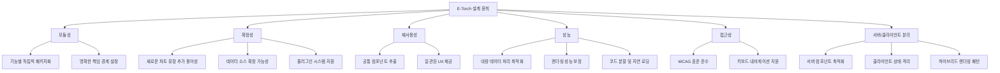

## 2. 기술 스택

| 영역 | 기술 | 선정 이유 | 버전 |
|------|------|----------|------|
| **모노레포 관리** | Turborepo | 빌드 캐싱, 병렬 실행, 의존성 관리 기능 우수 | 2.0.0+ |
| **패키지 관리** | pnpm | 디스크 공간 절약, 의존성 중복 설치 방지 | 8.0.0+ |
| **프레임워크** | React + Next.js | App Router, 서버 컴포넌트 제공 | React 19, Next.js 15 |
| **UI 프레임워크** | Shadcn/UI + Tailwind CSS | 커스터마이징 용이성, 생산성 향상 | Tailwind CSS 4 |
| **상태 관리** | Zustand, Tanstack Query | 단순한 API, 성능 최적화, 상태 로직 분리 | Zustand 5, TQ 5 |
| **차트 라이브러리** | Recharts | React 친화적, 유연한 커스터마이징 | 2.10.1+ |
| **대시보드 레이아웃** | react-grid-layout | 드래그 앤 드롭, 리사이징 지원 | 1.4.0+ |
| **타입 검사** | TypeScript | 타입 안정성, 개발 생산성 향상 | 5.5+ |
| **폼 관리** | React Hook Form + Zod | 성능 최적화, 선언적 유효성 검사 | RHF 7, Zod 3 |
| **코드 품질 관리** | ESLint + Prettier | 일관된 코드 스타일, 오류 감지 | ESLint 9, Prettier 3 |
| **테스트** | Vitest + Testing Library + Playwright | 단위/통합/E2E 테스트 도구 | Vitest 1, Playwright 1.40+ |
| **문서화** | Storybook | 컴포넌트 문서화, 시각적 테스트 | 8.0+ |

## 3. 아키텍처 계층 구조

E-Torch 프론트엔드 아키텍처는 여러 계층으로 구성되어 관심사를 명확히 분리합니다.

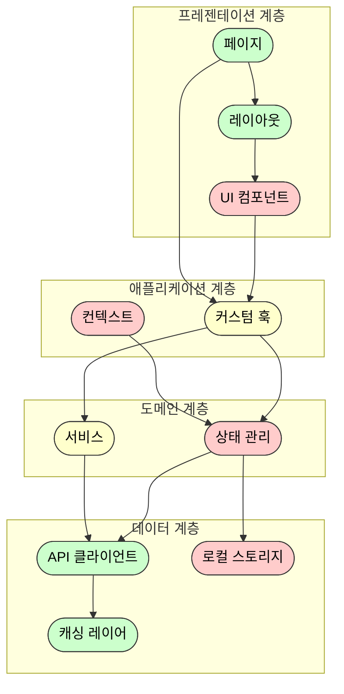

### 3.1 서버/클라이언트 컴포넌트 분리 전략

Next.js App Router를 활용한 서버/클라이언트 컴포넌트 경계를 명확히 구분합니다.

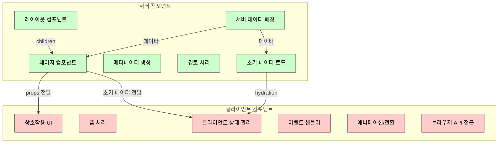

#### 서버 컴포넌트 (RSC) 사용 지침

서버 컴포넌트는 다음과 같은 경우에 사용합니다:

- 데이터 페칭 및 데이터베이스 접근이 필요한 경우
- 서버 측 API에 직접 접근해야 하는 경우
- 민감한 정보(API 키, 토큰 등)가 필요한 경우
- 대용량 의존성을 클라이언트로 전송하지 않아도 되는 경우
- SEO 최적화가 필요한 페이지 컴포넌트
- 정적 렌더링이 가능한 UI 요소

#### 클라이언트 컴포넌트 사용 지침

클라이언트 컴포넌트는 다음과 같은 경우에 사용합니다:

- 사용자 이벤트 처리가 필요한 경우 (onClick, onChange 등)
- useState, useEffect 등 React 훅을 사용해야 하는 경우
- 브라우저 전용 API를 사용해야 하는 경우
- 생명주기 이벤트가 필요한 경우
- 애니메이션 및 상호작용이 많은 UI 컴포넌트
- 클라이언트 상태에 의존적인 컴포넌트

#### 하이브리드 패턴

서버/클라이언트 컴포넌트를 효과적으로 조합하는 패턴:

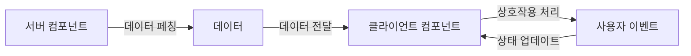

## 4. 모노레포 패키지 구조 설계

### 4.1 패키지 구조

```mermaid
graph TD
    A[e-torch] --> B[apps/]
    A --> C[packages/]
    
    B --> B1[web]
    B --> B2[docs]
    
    C --> C1[core]
    C --> C2[charts]
    C --> C3[dashboard]
    C --> C4[data-sources]
    C --> C5[ui]
    C --> C6[utils]
    C --> C7[state]
    C --> C8[server-api]
    
    C1 --> C1A[타입 정의]
    C1 --> C1B[상수]
    C1 --> C1C[기본 인터페이스]
    
    C2 --> C2A[차트 렌더러]
    C2 --> C2B[차트 에디터]
    C2 --> C2C[차트 옵션]
    
    C3 --> C3A[대시보드 그리드]
    C3 --> C3B[대시보드 관리]
    C3 --> C3C[레이아웃 시스템]
    
    C4 --> C4A[데이터 커넥터]
    C4 --> C4B[데이터 변환]
    C4 --> C4C[쿼리 관리]
    
    C5 --> C5A[컴포넌트]
    C5 --> C5B[서버 래퍼]
    C5 --> C5C[유틸리티 및 훅]
    
    C6 --> C6A[포맷터]
    C6 --> C6B[유효성 검사]
    C6 --> C6C[헬퍼 함수]
    
    C7 --> C7A[Zustand 스토어]
    C7 --> C7B[Tanstack Query 훅]
    C7 --> C7C[컨텍스트 제공자]
    
    C8 --> C8A[API 경로]
    C8 --> C8B[미들웨어]
    C8 --> C8C[서버 액션]
    
    classDef server fill:#ccffcc,stroke:#333,stroke-width:1px,color:#000;
    classDef client fill:#ffcccb,stroke:#333,stroke-width:1px,color:#000;
    classDef shared fill:#ffffcc,stroke:#333,stroke-width:1px,color:#000;
    
    class C8,C8A,C8B,C8C,C5B server;
    class C7,C7A,C7B,C7C,C5A,C5C client;
    class C1,C1A,C1B,C1C,C2,C2A,C2B,C2C,C3,C3A,C3B,C3C,C4,C4A,C4B,C4C,C6,C6A,C6B,C6C shared;
```

### 4.2 패키지 의존성 구조

각 패키지 간의 의존성을 명확하게 정의하여 순환 의존성을 방지하고 패키지의 책임을 명확히 합니다.

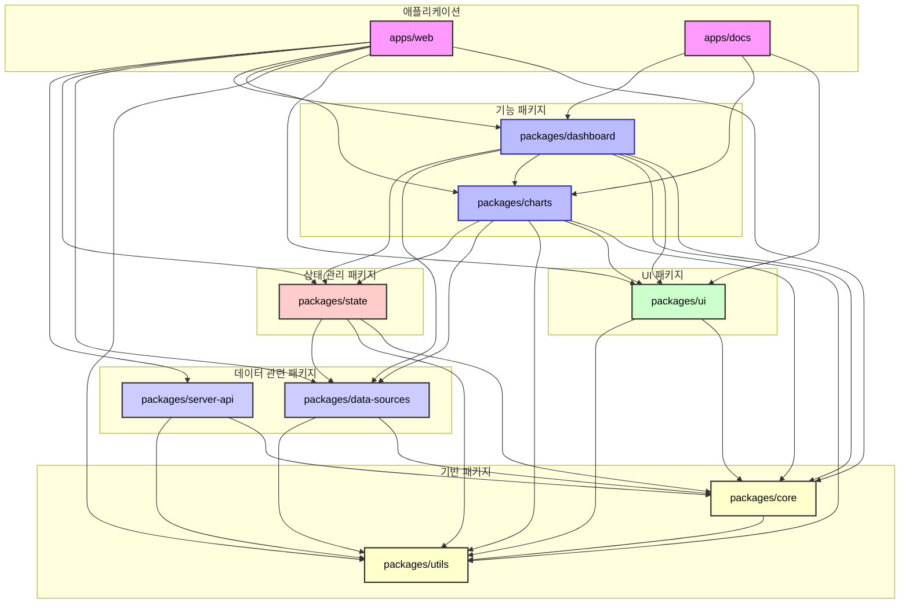

### 4.3 UI 컴포넌트와 서버/클라이언트 통합 전략

Shadcn/UI는 기본적으로 클라이언트 컴포넌트로 제공되므로, 이를 고려한 통합 전략이 필요합니다. 효율적이고 현실적인 접근 방식은 다음과 같습니다:

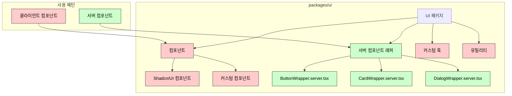

#### UI 패키지 구조 및 파일 구성

```
packages/ui/
├── src/
│   ├── components/             # 모든 UI 컴포넌트 (클라이언트)
│   │   ├── ui/                 # Shadcn/UI 기반 컴포넌트
│   │   │   ├── button.tsx      # ('use client' 포함)
│   │   │   ├── card.tsx        # ('use client' 포함)
│   │   │   └── ...
│   │   ├── custom/             # 추가 커스텀 컴포넌트
│   │   └── index.ts            # 통합 내보내기
│   │
│   ├── server-wrappers/        # 서버 컴포넌트 래퍼
│   │   ├── button.server.tsx   # 서버 컴포넌트에서 Button 사용
│   │   ├── card.server.tsx     # 서버 컴포넌트에서 Card 사용
│   │   └── index.ts
│   │
│   ├── hooks/                  # UI 관련 커스텀 훅
│   └── utils/                  # UI 유틸리티 함수
```

#### 서버 컴포넌트 래퍼 패턴 구현

Shadcn/UI와 같은 클라이언트 컴포넌트를 서버 컴포넌트에서 효율적으로 사용하기 위한 래퍼 패턴:

```tsx
// packages/ui/src/server-wrappers/button.server.tsx
import { Button } from '../components/ui/button';

export interface ButtonServerProps {
  children: React.ReactNode;
  variant?: 'default' | 'destructive' | 'outline' | 'secondary' | 'ghost' | 'link';
  size?: 'default' | 'sm' | 'lg' | 'icon';
  className?: string;
}

export function ButtonServer({ 
  children, 
  variant = 'default',
  size = 'default',
  className 
}: ButtonServerProps) {
  // 서버 컴포넌트에서 필요한 로직 (필요시)
  // 최소한의 props만 전달해 클라이언트 번들 크기 최적화
  return (
    <Button variant={variant} size={size} className={className}>
      {children}
    </Button>
  );
}
```

#### 페이지 및 레이아웃에서의 사용

```tsx
// apps/web/app/some-route/page.tsx (서버 컴포넌트)
import { ButtonServer } from '@/packages/ui/server-wrappers';
import { SomeClientComponent } from './some-client-component';

export default async function Page() {
  const data = await fetchSomeData();
  
  return (
    <div>
      <h1>서버 컴포넌트 페이지</h1>
      
      {/* 서버 컴포넌트 래퍼 사용 */}
      <ButtonServer variant="outline">
        {data.staticButtonText}
      </ButtonServer>
      
      {/* 클라이언트 컴포넌트 사용 */}
      <SomeClientComponent clientData={data.clientData} />
    </div>
  );
}

// apps/web/app/some-route/some-client-component.tsx (클라이언트 컴포넌트)
'use client';

import { Button } from '@/packages/ui/components';

export function SomeClientComponent({ clientData }) {
  return (
    <div>
      {/* 클라이언트 컴포넌트 내에서 직접 UI 컴포넌트 사용 */}
      <Button 
        onClick={() => console.log('clicked')}
        variant="default"
      >
        {clientData.buttonText}
      </Button>
    </div>
  );
}
```

이 접근 방식은 Shadcn/UI 같은 클라이언트 기반 컴포넌트 라이브러리를 서버 컴포넌트 환경에서 효율적으로 사용할 수 있게 해주며, 불필요한 클라이언트 자바스크립트 전송을 최소화합니다.

## 5. 핵심 패키지 상세 설계

### 5.1 `packages/core`

`core` 패키지는 타입 정의, 상수, 인터페이스를 제공합니다. 다른 모든 패키지의 기반이 되며, 순환 의존성 방지를 위해 다른 패키지에 의존하지 않습니다.

#### 5.1.1 타입 시스템 설계

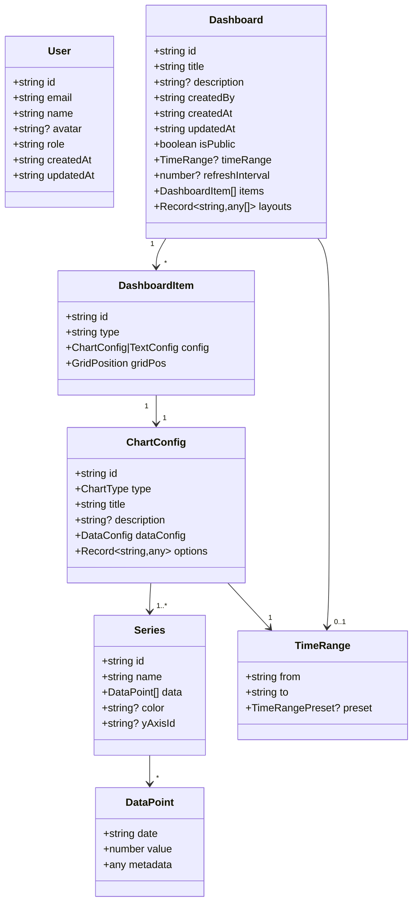

### 5.2 `packages/charts`

`charts` 패키지는 차트 렌더링 및 편집 기능을 제공합니다. 이 패키지는 서버/클라이언트 컴포넌트 분리 전략을 적용하여 설계됩니다.

#### 5.2.1 차트 컴포넌트 아키텍처

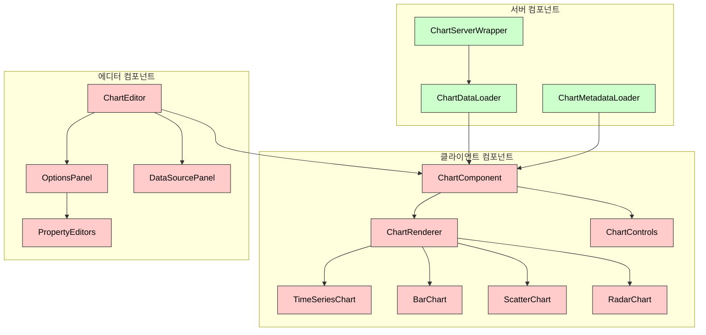

#### 5.2.2 차트 패키지 파일 구조

```
packages/charts/
├── src/
│   ├── components/            # 클라이언트 컴포넌트
│   │   ├── ChartComponent.tsx
│   │   ├── ChartRenderer.tsx
│   │   ├── chart-types/       # 차트 유형별 컴포넌트
│   │   │   ├── TimeSeriesChart.tsx
│   │   │   ├── BarChart.tsx
│   │   │   └── ...
│   │   └── controls/          # 차트 컨트롤 컴포넌트
│   │       ├── ChartControls.tsx
│   │       └── ...
│   │
│   ├── server/                # 서버 컴포넌트
│   │   ├── ChartServerWrapper.tsx
│   │   ├── ChartDataLoader.tsx
│   │   └── ...
│   │
│   ├── editor/                # 차트 에디터 컴포넌트 (클라이언트)
│   │   ├── ChartEditor.tsx
│   │   ├── panels/
│   │   └── property-editors/
│   │
│   ├── hooks/                 # 차트 관련 훅
│   └── utils/                 # 차트 유틸리티 함수
```

#### 5.2.3 서버/클라이언트 인터페이스

서버 컴포넌트와 클라이언트 컴포넌트 간의 인터페이스:

```tsx
// packages/charts/src/server/ChartServerWrapper.tsx
import { ChartComponent } from '../components/ChartComponent';
import { fetchChartData } from '@/packages/data-sources/server';

export interface ChartServerWrapperProps {
  chartId: string;
  config: ChartConfig;
  initialTimeRange?: TimeRange;
}

export async function ChartServerWrapper({
  chartId,
  config,
  initialTimeRange
}: ChartServerWrapperProps) {
  // 서버에서 데이터 페칭
  const initialData = await fetchChartData(config, initialTimeRange);
  
  // 클라이언트 컴포넌트로 초기 데이터 전달
  return (
    <ChartComponent
      chartId={chartId}
      config={config}
      initialData={initialData}
      initialTimeRange={initialTimeRange}
    />
  );
}
```

### 5.3 `packages/dashboard`

`dashboard` 패키지는 대시보드 그리드 및 관리 기능을 제공합니다. 서버/클라이언트 컴포넌트 경계를 명확히 구분합니다.

#### 5.3.1 대시보드 컴포넌트 아키텍처

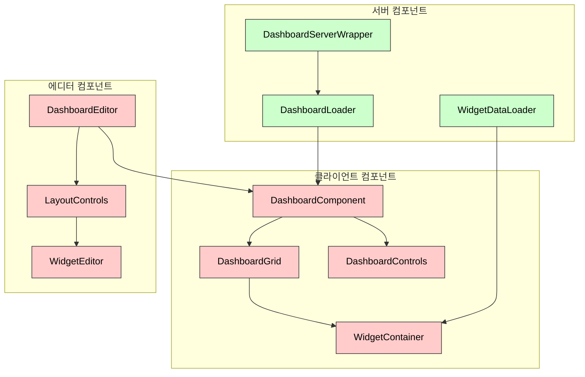

#### 5.3.2 대시보드 파일 구조

```
packages/dashboard/
├── src/
│   ├── components/            # 클라이언트 컴포넌트
│   │   ├── DashboardComponent.tsx
│   │   ├── DashboardGrid.tsx
│   │   ├── DashboardControls.tsx
│   │   └── widgets/
│   │       ├── WidgetContainer.tsx
│   │       └── ...
│   │
│   ├── server/                # 서버 컴포넌트
│   │   ├── DashboardServerWrapper.tsx
│   │   ├── DashboardLoader.tsx
│   │   └── ...
│   │
│   ├── editor/                # 대시보드 에디터 컴포넌트
│   │   ├── DashboardEditor.tsx
│   │   ├── WidgetEditor.tsx
│   │   └── ...
│   │
│   ├── hooks/                 # 대시보드 관련 훅
│   └── utils/                 # 대시보드 유틸리티 함수
```

### 5.4 `packages/state`

`state` 패키지는 상태 관리 로직을 제공합니다. Zustand를 사용한 클라이언트 상태와 Tanstack Query를 사용한 서버 상태를 관리합니다.

#### 5.4.1 상태 관리 계층 구조

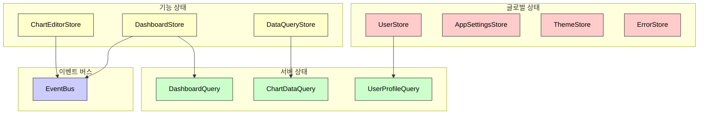

## 6. 상태 관리 아키텍처

### 6.1 서버 상태와 클라이언트 상태 분리

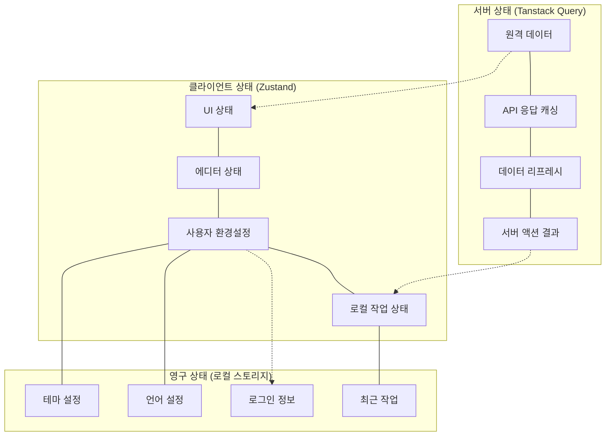

### 6.2 Zustand 상태 설계 원칙

Zustand 상태는 다음 원칙에 따라 설계합니다:

1. **단일 책임 원칙**: 각 스토어는 명확히 정의된 책임 영역을 가집니다.
2. **최소 원칙**: 필요한 상태만 스토어에 포함합니다.
3. **불변성 원칙**: `immer` 미들웨어를 사용하여 불변성을 유지합니다.
4. **선택적 구독**: 컴포넌트는 필요한 상태만 구독합니다.
5. **영구 상태 분리**: 로컬 스토리지에 저장할 상태만 `persist` 미들웨어를 사용합니다.

### 6.3 Tanstack Query 활용 전략

1. **쿼리 키 관리**:
   - 구조화된 쿼리 키 정의
   - 관련 데이터에 대한 쿼리 키 정의 일관성 유지

2. **쿼리 무효화 전략**:
   - 데이터 변경 시 관련 쿼리 자동 무효화
   - 상호 의존적 데이터 간 일관성 유지

3. **리액트 쿼리 최적화**:
   - 적절한 staleTime 설정
   - 선택적 리페칭 전략 적용

## 7. 데이터 처리 및 변환 파이프라인

### 7.1 데이터 페칭 및 변환 파이프라인

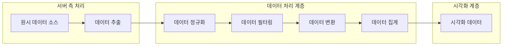

### 7.2 데이터 정규화 전략

데이터 소스별로 다른 형식의 데이터를 통일된 형식으로 변환하는 전략:

1. **소스별 어댑터 패턴**: 각 데이터 소스(KOSIS, ECOS, OECD)에 대한 어댑터 구현
2. **표준 시계열 데이터 형식**: 모든 데이터를 동일한 시계열 데이터 형식으로 변환
3. **메타데이터 통합**: 소스별 메타데이터를 통합된 형식으로 정규화
4. **데이터 변환 파이프라인**: 다양한 변환(YoY, MoM, 누적 등)을 지원하는 파이프라인

## 8. Next.js App Router 라우팅 및 레이아웃 설계

### 8.1 라우팅 및 레이아웃 구조

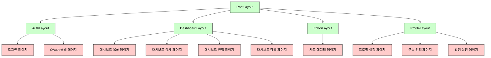

### 8.2 데이터 페칭 전략

Next.js App Router에서의 데이터 페칭 전략은 서버/클라이언트 컴포넌트에 따라 다릅니다:

1. **서버 컴포넌트에서 데이터 페칭**:
   - 직접 데이터 페칭 (API 클라이언트 사용)
   - 서버 액션을 통한 데이터 조작
   - 클라이언트 컴포넌트에 초기 데이터 전달

2. **클라이언트 컴포넌트에서 데이터 페칭**:
   - Tanstack Query를 사용한 데이터 페칭
   - 서버에서 전달받은 초기 데이터 활용
   - 동적 상호작용에 필요한 데이터 업데이트

### 8.3 서버 액션 활용

Next.js의 서버 액션을 활용하여 폼 제출 및 데이터 변경을 처리합니다:

1. **폼 처리**: 클라이언트에서 입력한 데이터를 서버 액션으로 제출
2. **캐시 무효화**: 데이터 변경 후 관련 경로 캐시 무효화
3. **리디렉션**: 작업 완료 후 적절한 페이지로 리디렉션

## 9. 성능 최적화 전략

E-Torch는 대량의 경제 데이터를 효율적으로 처리하고 시각화해야 하므로 다음과 같은 성능 최적화 전략을 적용합니다:

### 9.1 코드 분할 및 지연 로딩

Next.js의 dynamic import를 활용하여 필요한 시점에 코드를 로드함으로써 초기 로딩 시간을 단축합니다:

```typescript
// 차트 유형별 다이나믹 임포트
import dynamic from 'next/dynamic';

// 기본 차트 컴포넌트는 즉시 로드
import { ChartProps, ChartType } from '@/packages/charts';
import { ChartSkeleton } from '@/packages/ui/components';

// 차트 유형별 동적 임포트 (필요시 로드)
const TimeSeriesChart = dynamic(() => import('@/packages/charts/src/components/chart-types/TimeSeriesChart'), {
  loading: () => <ChartSkeleton type="timeSeries" />,
  ssr: false // 클라이언트 사이드에서만 렌더링 (Recharts는 SSR 불가)
});

const BarChart = dynamic(() => import('@/packages/charts/src/components/chart-types/BarChart'), {
  loading: () => <ChartSkeleton type="bar" />,
  ssr: false
});

const ScatterChart = dynamic(() => import('@/packages/charts/src/components/chart-types/ScatterChart'), {
  loading: () => <ChartSkeleton type="scatter" />,
  ssr: false
});

const RadarChart = dynamic(() => import('@/packages/charts/src/components/chart-types/RadarChart'), {
  loading: () => <ChartSkeleton type="radar" />,
  ssr: false
});

const RadialBarChart = dynamic(() => import('@/packages/charts/src/components/chart-types/RadialBarChart'), {
  loading: () => <ChartSkeleton type="radialBar" />,
  ssr: false
});

// 차트 렌더러 컴포넌트 (차트 유형에 따라 적절한 컴포넌트 로드)
export function ChartRenderer({ type, ...props }: ChartProps & { type: ChartType }) {
  // 차트 유형에 따라 적절한 컴포넌트 반환
  switch (type) {
    case 'timeSeries':
      return <TimeSeriesChart {...props} />;
    case 'bar':
      return <BarChart {...props} />;
    case 'scatter':
      return <ScatterChart {...props} />;
    case 'radar':
      return <RadarChart {...props} />;
    case 'radialBar':
      return <RadialBarChart {...props} />;
    default:
      return <div>Unsupported chart type: {type}</div>;
  }
}
```

또한 경로 기반 코드 분할을 활용하여 각 페이지와 관련된 코드만 필요한 시점에 로드합니다:

```typescript
// app/routes.js
import { PageNotFoundError } from 'next/navigation';

// 프로젝트 페이지 레이아웃 및 홈페이지는 즉시 로드
export { default as RootLayout } from './layout';
export { default as HomePage } from './page';

// 대시보드 및 에디터 페이지는 필요시 동적 로드
// 대시보드 페이지와 관련 컴포넌트
export const DashboardPage = dynamic(() => import('./dashboard/page'), {
  loading: () => <PageLoadingSkeleton />,
});

// 대시보드 편집 페이지
export const DashboardEditPage = dynamic(() => import('./dashboard/[id]/edit/page'), {
  loading: () => <PageLoadingSkeleton />,
});

// 차트 에디터 페이지
export const ChartEditorPage = dynamic(() => import('./chart-editor/[id]/page'), {
  loading: () => <PageLoadingSkeleton />,
});
```

에디터 UI 컴포넌트와 데이터 시각화 컴포넌트를 분리하여 필요에 따라 선택적으로 로드합니다:

```typescript
// 차트 에디터와 뷰어 분리
const ChartEditorUI = dynamic(() => import('@/packages/charts/src/editor/ChartEditor'), {
  loading: () => <EditorLoadingSkeleton />,
  ssr: false
});

// 뷰어만 필요한 경우 더 가벼운 컴포넌트 로드
const ChartViewerUI = dynamic(() => import('@/packages/charts/src/components/ChartComponent'), {
  loading: () => <ChartSkeleton />,
  ssr: false
});
```

### 9.2 메모이제이션 및 최적화

React의 메모이제이션 기능을 활용하여 컴포넌트 리렌더링을 최적화합니다:

```typescript
// 차트 옵션 메모이제이션 예시
function TimeSeriesChart({ data, options, width, height }: TimeSeriesChartProps) {
  // 옵션 변경 시에만 재계산
  const processedOptions = useMemo(() => {
    // 복잡한 옵션 처리 로직
    return {
      ...options,
      yAxis: processYAxisOptions(options.yAxis),
      xAxis: processXAxisOptions(options.xAxis, data),
      tooltip: processTooltipOptions(options.tooltip)
    };
  }, [options]);
  
  // 데이터 변경 시에만 재계산
  const processedData = useMemo(() => {
    // 데이터 변환 로직 (포맷팅, 필터링 등)
    return processTimeSeriesData(data);
  }, [data]);
  
  // 이벤트 핸들러 메모이제이션
  const handleMouseMove = useCallback((e) => {
    // 마우스 이벤트 처리 로직
  }, []);
  
  // 차트 컴포넌트 메모이제이션
  return useMemo(() => (
    <ResponsiveContainer width={width} height={height}>
      <LineChart data={processedData} onMouseMove={handleMouseMove}>
        {/* 차트 구성 요소 */}
        <XAxis {...processedOptions.xAxis} />
        <YAxis {...processedOptions.yAxis} />
        <Tooltip {...processedOptions.tooltip} />
        <Legend {...processedOptions.legend} />
        <Line
          type="monotone"
          dataKey="value"
          stroke={processedOptions.color}
          strokeWidth={processedOptions.strokeWidth}
          dot={processedOptions.showDots}
        />
      </LineChart>
    </ResponsiveContainer>
  ), [processedData, processedOptions, width, height, handleMouseMove]);
}

// 컴포넌트 자체도 메모이제이션
export default memo(TimeSeriesChart);
```

차트 옵션 편집 시 효율적인 상태 관리를 위한 패턴:

```typescript
// 옵션 그룹별 메모이제이션
function ChartOptionsPanel({ options, onChange }: ChartOptionsPanelProps) {
  // 각 옵션 그룹별 변경 핸들러 메모이제이션
  const handlePanelOptionsChange = useCallback((panelOptions) => {
    onChange({ ...options, panel: panelOptions });
  }, [options, onChange]);
  
  const handleTooltipOptionsChange = useCallback((tooltipOptions) => {
    onChange({ ...options, tooltip: tooltipOptions });
  }, [options, onChange]);
  
  const handleAxisOptionsChange = useCallback((axisType, axisOptions) => {
    if (axisType === 'xAxis') {
      onChange({ ...options, xAxis: axisOptions });
    } else if (axisType === 'yAxis') {
      onChange({ ...options, yAxis: axisOptions });
    }
  }, [options, onChange]);
  
  // 각 옵션 패널 컴포넌트 메모이제이션
  const PanelOptionsComponent = useMemo(() => (
    <PanelOptions
      options={options.panel}
      onChange={handlePanelOptionsChange}
    />
  ), [options.panel, handlePanelOptionsChange]);
  
  const TooltipOptionsComponent = useMemo(() => (
    <TooltipOptions
      options={options.tooltip}
      onChange={handleTooltipOptionsChange}
    />
  ), [options.tooltip, handleTooltipOptionsChange]);
  
  const XAxisOptionsComponent = useMemo(() => (
    <AxisOptions
      axisType="xAxis"
      options={options.xAxis}
      onChange={(opts) => handleAxisOptionsChange('xAxis', opts)}
    />
  ), [options.xAxis, handleAxisOptionsChange]);
  
  // 렌더링
  return (
    <OptionsContainer>
      <Tabs defaultValue="panel">
        <TabsList>
          <TabsTrigger value="panel">패널</TabsTrigger>
          <TabsTrigger value="tooltip">툴팁</TabsTrigger>
          <TabsTrigger value="axes">축</TabsTrigger>
        </TabsList>
        
        <TabsContent value="panel">
          {PanelOptionsComponent}
        </TabsContent>
        
        <TabsContent value="tooltip">
          {TooltipOptionsComponent}
        </TabsContent>
        
        <TabsContent value="axes">
          {XAxisOptionsComponent}
        </TabsContent>
      </Tabs>
    </OptionsContainer>
  );
}
```

### 9.3 가상화 기법

대량의 데이터를 효율적으로 렌더링하기 위한 가상화 기법을 적용합니다:

```typescript
// 대용량 시계열 데이터의 다운샘플링 알고리즘 (LTTB: Largest-Triangle-Three-Buckets)
function downsampleTimeSeries(data: DataPoint[], targetPoints: number): DataPoint[] {
  // 데이터 포인트가 목표보다 적으면 다운샘플링 필요 없음
  if (data.length <= targetPoints) {
    return data;
  }
  
  // 결과 배열 초기화
  const sampled: DataPoint[] = [];
  
  // 첫 포인트는 항상 유지
  sampled.push(data[0]);
  
  // 각 버킷 크기 계산
  const bucketSize = (data.length - 2) / (targetPoints - 2);
  
  // 각 버킷에서 최적의 포인트 선택
  for (let i = 0; i < targetPoints - 2; i++) {
    // 현재 버킷의 시작과 끝 인덱스
    const startIdx = Math.floor((i) * bucketSize) + 1;
    const endIdx = Math.floor((i + 1) * bucketSize) + 1;
    
    // 이전 포인트와 다음 버킷의 평균 포인트
    const prevPoint = sampled[sampled.length - 1];
    const nextBucketAvg = calculateBucketAverage(data, endIdx, Math.min(endIdx + bucketSize, data.length));
    
    // 각 포인트의 삼각형 면적 계산하여 최대 면적을 가진 포인트 선택
    let maxArea = -1;
    let maxAreaIdx = startIdx;
    
    for (let j = startIdx; j < endIdx; j++) {
      const area = calculateTriangleArea(prevPoint, data[j], nextBucketAvg);
      if (area > maxArea) {
        maxArea = area;
        maxAreaIdx = j;
      }
    }
    
    // 선택된 포인트 추가
    sampled.push(data[maxAreaIdx]);
  }
  
  // 마지막 포인트는 항상 유지
  sampled.push(data[data.length - 1]);
  
  return sampled;
}

// 버킷 내 평균 포인트 계산
function calculateBucketAverage(data: DataPoint[], startIdx: number, endIdx: number): DataPoint {
  let sumX = 0;
  let sumY = 0;
  let count = 0;
  
  for (let i = startIdx; i < endIdx; i++) {
    const timestamp = new Date(data[i].date).getTime();
    sumX += timestamp;
    sumY += data[i].value;
    count++;
  }
  
  return {
    date: new Date(sumX / count).toISOString(),
    value: sumY / count
  };
}

// 세 점으로 이루어진 삼각형 면적 계산
function calculateTriangleArea(p1: DataPoint, p2: DataPoint, p3: DataPoint): number {
  const x1 = new Date(p1.date).getTime();
  const y1 = p1.value;
  
  const x2 = new Date(p2.date).getTime();
  const y2 = p2.value;
  
  const x3 = new Date(p3.date).getTime();
  const y3 = p3.value;
  
  return Math.abs((x1 * (y2 - y3) + x2 * (y3 - y1) + x3 * (y1 - y2)) / 2);
}

// 시계열 차트에서 가상화 적용
function TimeSeriesChartWithVirtualization({ data, width, height, options }: TimeSeriesChartProps) {
  // 화면 해상도에 따른 다운샘플링 포인트 수 계산
  const targetPoints = useMemo(() => {
    // 화면 너비당 최대 1픽셀에 1개 데이터 포인트 (최소 100개, 최대 1000개)
    return Math.min(Math.max(Math.floor(width), 100), 1000);
  }, [width]);
  
  // 다운샘플링 적용
  const optimizedData = useMemo(() => {
    return downsampleTimeSeries(data, targetPoints);
  }, [data, targetPoints]);
  
  // 차트 렌더링
  return (
    <ResponsiveContainer width={width} height={height}>
      <LineChart data={optimizedData}>
        {/* 차트 구성 요소 */}
      </LineChart>
    </ResponsiveContainer>
  );
}
```

대시보드 위젯 목록을 위한 가상화:

```typescript
import { FixedSizeList } from 'react-window';

// 가상화된 대시보드 위젯 목록
function VirtualizedWidgetList({ widgets, onSelect }: WidgetListProps) {
  const Row = ({ index, style }: { index: number, style: React.CSSProperties }) => {
    const widget = widgets[index];
    return (
      <div style={style}>
        <WidgetListItem
          widget={widget}
          onClick={() => onSelect(widget.id)}
        />
      </div>
    );
  };
  
  return (
    <FixedSizeList
      height={400}
      width="100%"
      itemCount={widgets.length}
      itemSize={60}
    >
      {Row}
    </FixedSizeList>
  );
}
```

### 9.4 서버 컴포넌트 최적화

Next.js의 서버 컴포넌트를 활용하여 데이터 페칭과 변환 로직을 서버에서 처리합니다:

```typescript
// 서버 컴포넌트에서 데이터 페칭 및 변환
export default async function DashboardPage({ params }: { params: { id: string } }) {
  // 서버에서 대시보드 데이터 페칭
  const dashboard = await fetchDashboard(params.id);
  
  // 서버에서 차트 데이터 페칭 및 변환
  const chartsData = await Promise.all(
    dashboard.chartIds.map(async (chartId) => {
      const chartConfig = await fetchChartConfig(chartId);
      const rawData = await fetchChartData(chartId, dashboard.timeRange, dashboard.period);
      
      // 서버에서 데이터 변환 및 처리
      const processedData = processChartData(rawData, chartConfig.transformations);
      
      return {
        id: chartId,
        config: chartConfig,
        data: processedData
      };
    })
  );
  
  // 클라이언트 컴포넌트에 데이터 전달
  return (
    <DashboardLayout>
      <DashboardHeader
        title={dashboard.title}
        description={dashboard.description}
        timeRange={dashboard.timeRange}
        period={dashboard.period}
      />
      
      <DashboardGrid
        layout={dashboard.layout}
        chartsData={chartsData}
      />
    </DashboardLayout>
  );
}
```

React Server Components를 활용한 최적화:

```typescript
// 대시보드 컨텐츠를 서버에서 렌더링
export default async function DashboardContent({ id }: { id: string }) {
  // 서버에서 데이터 페칭
  const dashboard = await fetchDashboard(id);
  const widgets = await fetchDashboardWidgets(id);
  
  // 위젯별 메타데이터 계산
  const widgetsWithMeta = await Promise.all(
    widgets.map(async (widget) => {
      // 서버에서 메타데이터 계산
      const meta = await calculateWidgetMetadata(widget);
      return { ...widget, meta };
    })
  );
  
  return (
    <div>
      <h1>{dashboard.title}</h1>
      <p>{dashboard.description}</p>
      
      {/* 스트리밍 서버 컴포넌트로 위젯 렌더링 */}
      <Suspense fallback={<DashboardSkeleton />}>
        <DashboardGrid layout={dashboard.layout}>
          {widgetsWithMeta.map((widget) => (
            <WidgetWrapper key={widget.id} widget={widget} />
          ))}
        </DashboardGrid>
      </Suspense>
    </div>
  );
}

// 위젯 컴포넌트 - 서버에서 데이터를 페칭하여 클라이언트 컴포넌트에 전달
async function WidgetWrapper({ widget }: { widget: Widget }) {
  // 서버에서 위젯 데이터 페칭
  const widgetData = await fetchWidgetData(widget.id);
  
  // 클라이언트 컴포넌트에 데이터 전달
  return (
    <ClientWidgetRenderer
      widget={widget}
      initialData={widgetData}
    />
  );
}
```

### 9.5 데이터 처리 최적화

클라이언트 측에서의 데이터 처리를 최적화합니다:

```typescript
// 시계열 데이터의 변환 최적화
function optimizedDataTransformation(
  data: TimeSeriesData,
  transformation: TransformationType,
  options: TransformationOptions
): TimeSeriesData {
  // 웹 워커로 무거운 계산 오프로드
  if (data.length > 10000 && typeof Worker !== 'undefined') {
    return new Promise((resolve, reject) => {
      const worker = new Worker(new URL('./dataWorker.js', import.meta.url));
      
      worker.onmessage = (e) => {
        resolve(e.data);
        worker.terminate();
      };
      
      worker.onerror = (error) => {
        reject(error);
        worker.terminate();
      };
      
      worker.postMessage({
        data,
        transformation,
        options
      });
    });
  }
  
  // 웹 워커를 사용할 수 없는 경우 메인 스레드에서 처리
  switch (transformation) {
    case 'original':
      return data; // 원본 데이터 반환
    
    case 'change':
      // 최적화된 변화율 계산 (이전 계산 결과 캐싱)
      return calculateChangeRate(data, options);
    
    case 'changePct':
      // 최적화된 변화율(%) 계산
      return calculatePercentageChange(data, options);
    
    case 'cumulative':
      // 최적화된 누적값 계산
      return calculateCumulative(data, options);
    
    default:
      return data;
  }
}

// 캐싱을 활용한 최적화
const transformationCache = new Map<string, TimeSeriesData>();

function calculateChangeRate(data: TimeSeriesData, options: TransformationOptions): TimeSeriesData {
  // 캐시 키 생성
  const cacheKey = `change-${data[0]?.date}-${data[data.length-1]?.date}-${options.baseline}`;
  
  // 캐시된 결과가 있으면 반환
  if (transformationCache.has(cacheKey)) {
    return transformationCache.get(cacheKey)!;
  }
  
  // 결과 계산
  const result = data.map((point, index) => {
    if (index === 0) {
      // 첫 번째 포인트는 변화율 0 또는 null
      return { ...point, value: options.fillFirst ? 0 : null };
    }
    
    // 이전 값과의 차이 계산
    const prevValue = data[index - 1].value;
    const change = point.value - prevValue;
    
    return {
      ...point,
      value: change
    };
  });
  
  // 결과 캐싱
  transformationCache.set(cacheKey, result);
  
  return result;
}

// 프로그레시브 로딩
function ChartWithProgressiveLoading({ chartId, config }: { chartId: string, config: ChartConfig }) {
  // 초기 저해상도 데이터 로드 (빠른 표시)
  const { data: lowResData, isLoading } = useQuery({
    queryKey: ['chart-data', chartId, 'low-res'],
    queryFn: () => fetchChartDataLowRes(chartId),
    staleTime: 5 * 60 * 1000 // 5분
  });
  
  // 고해상도 데이터는 지연 로드
  const { data: highResData } = useQuery({
    queryKey: ['chart-data', chartId, 'high-res'],
    queryFn: () => fetchChartDataHighRes(chartId),
    staleTime: 5 * 60 * 1000, // 5분
    enabled: !isLoading && !!lowResData // 저해상도 데이터 로드 후 활성화
  });
  
  // 가용한 최고 해상도 데이터 사용
  const displayData = highResData || lowResData;
  
  // 로딩 표시
  if (isLoading) {
    return <ChartSkeleton />;
  }
  
  return (
    <ChartComponent
      data={displayData}
      config={config}
      isHighRes={!!highResData}
    />
  );
}
```

이러한 성능 최적화 전략을 통해 E-Torch는 대량의 경제 데이터를 효율적으로 처리하고 시각화하여 우수한 사용자 경험을 제공합니다.

## 10. 결론 및 확장성 고려사항

E-Torch 프론트엔드 아키텍처는 모듈성, 확장성, 재사용성, 성능, 접근성을 핵심 원칙으로 설계되었습니다. Next.js의 서버/클라이언트 컴포넌트 아키텍처를 효과적으로 활용하고, 모노레포 구조를 통해 코드 재사용성과 개발 효율성을 극대화합니다.

### 10.1 향후 확장 가능성

1. **데이터 소스 확장**: 추가 경제 데이터 소스(FRED, World Bank 등) 통합
2. **차트 유형 확장**: 더 다양한 시각화 옵션 제공
3. **협업 기능**: 실시간 대시보드 편집 및 공유 기능
4. **머신러닝 통합**: 경제 지표 예측 및 이상 감지 기능
5. **모바일 최적화**: 다양한 디바이스에 최적화된 대시보드 지원

### 10.2 아키텍처 유지 관리 전략

1. **설계 원칙 준수**: 명확한 책임 경계, 단일 책임 원칙 지속 적용
2. **모듈성 유지**: 기능 확장 시 적절한 패키지 분리 유지
3. **지속적 테스트**: 자동화된 테스트를 통한 아키텍처 안정성 유지
4. **성능 모니터링**: 지속적인 성능 지표 모니터링 및 최적화
5. **문서화**: 아키텍처 변경 사항 지속적 문서화

이 아키텍처는 다양한 경제 데이터 소스를 통합하고, 직관적인 차트 시각화 및 대시보드 기능을 제공하여 사용자 경험을 향상시키는 데 중점을 둡니다. 또한, 확장 가능한 구조로 설계되어 향후 기능 확장과 변경에 유연하게 대응할 수 있습니다.
