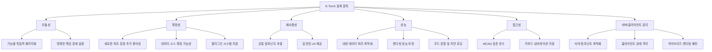
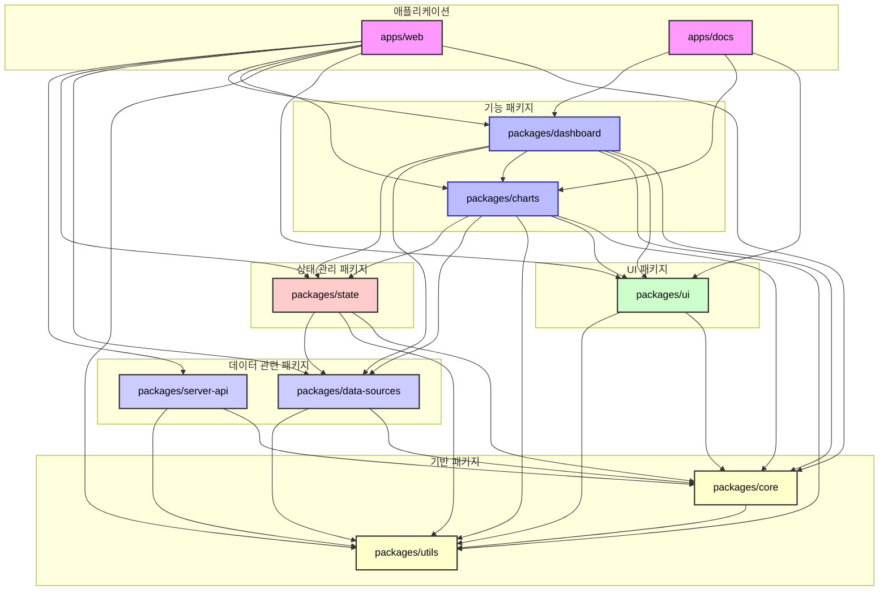
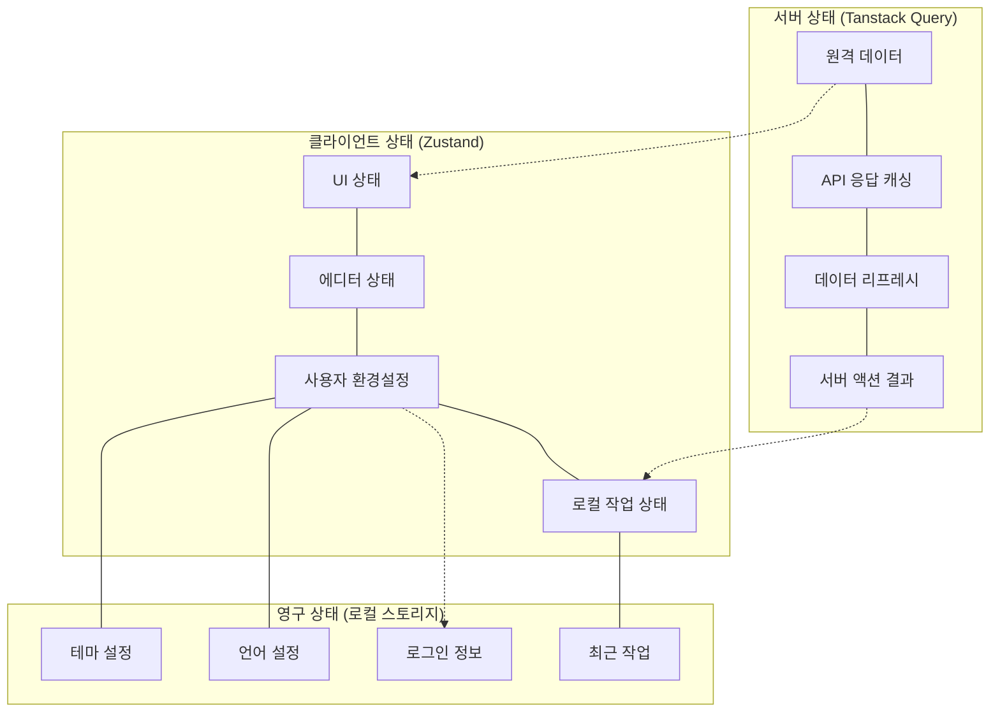
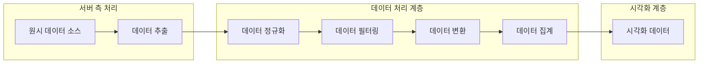
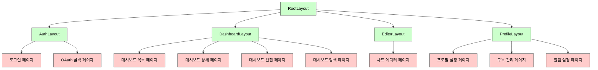

# E-Torch 프론트엔드 아키텍처 설계 문서

## 1. 개요

E-Torch는 다양한 출처(KOSIS, ECOS, OECD)의 경제지표 데이터를 통합하여 시각화하는 대시보드 서비스입니다. 본 문서는 E-Torch의 프론트엔드 아키텍처를 모노레포 구조로 설계하며, 특히 Next.js의 서버/클라이언트 컴포넌트 분리 전략과 핵심 기능을 모듈화하고 확장 가능한 아키텍처를 제시합니다.

### 1.1 프로젝트 목표

- 다양한 출처의 경제지표 데이터를 통합 제공
- 사용자 맞춤형 대시보드를 통한 경제지표 시각화 및 인사이트 도출
- 전문가와 일반 사용자 모두를 위한 경제데이터 접근성 향상
- 직관적이고 유연한 차트 컴포넌트와 에디터 기능 제공

### 1.2 설계 원칙

## 2. 기술 스택

| 영역 | 기술 | 선정 이유 | 버전 |
|------|------|----------|------|
| **모노레포 관리** | Turborepo | 빌드 캐싱, 병렬 실행, 의존성 관리 기능 우수 | 2.0.0+ |
| **패키지 관리** | pnpm | 디스크 공간 절약, 의존성 중복 설치 방지 | 8.0.0+ |
| **프레임워크** | React + Next.js | App Router, 서버 컴포넌트 제공 | React 19, Next.js 15 |
| **UI 프레임워크** | Shadcn/UI + Tailwind CSS | 커스터마이징 용이성, 생산성 향상 | Tailwind CSS 4 |
| **상태 관리** | Zustand, Tanstack Query | 단순한 API, 성능 최적화, 상태 로직 분리 | Zustand 5, TQ 5 |
| **차트 라이브러리** | Recharts | React 친화적, 유연한 커스터마이징 | 2.10.1+ |
| **대시보드 레이아웃** | react-grid-layout | 드래그 앤 드롭, 리사이징 지원 | 1.4.0+ |
| **타입 검사** | TypeScript | 타입 안정성, 개발 생산성 향상 | 5.5+ |
| **폼 관리** | React Hook Form + Zod | 성능 최적화, 선언적 유효성 검사 | RHF 7, Zod 3 |
| **코드 품질 관리** | ESLint + Prettier | 일관된 코드 스타일, 오류 감지 | ESLint 9, Prettier 3 |
| **테스트** | Vitest + Testing Library + Playwright | 단위/통합/E2E 테스트 도구 | Vitest 1, Playwright 1.40+ |
| **문서화** | Storybook | 컴포넌트 문서화, 시각적 테스트 | 8.0+ |

## 3. 아키텍처 계층 구조

E-Torch 프론트엔드 아키텍처는 여러 계층으로 구성되어 관심사를 명확히 분리합니다.

### 3.1 서버/클라이언트 컴포넌트 분리 개요

Next.js App Router 환경에서는 서버와 클라이언트 컴포넌트를 명확히 구분하여 활용합니다.

서버/클라이언트 컴포넌트 주요 구분 원칙:

- 서버 컴포넌트: 데이터 페칭, 메타데이터 생성, 정적 UI 렌더링
- 클라이언트 컴포넌트: 상호작용 UI, 상태 관리, 이벤트 핸들링
- 하이브리드 패턴: 서버에서 데이터를 페칭하여 클라이언트 컴포넌트에 전달

상세 구현 패턴과 전략은 [`core-components.md`](./components/core-components.md) 문서를 참조하십시오.

## 4. 모노레포 패키지 구조 설계

### 4.1 패키지 구조

```mermaid
graph TD
    A[e-torch] --> B[apps/]
    A --> C[packages/]
    
    B --> B1[web]
    B --> B2[docs]
    
    C --> C1[core]
    C --> C2[charts]
    C --> C3[dashboard]
    C --> C4[data-sources]
    C --> C5[ui]
    C --> C6[utils]
    C --> C7[state]
    C --> C8[server-api]
    
    C1 --> C1A[타입 정의]
    C1 --> C1B[상수]
    C1 --> C1C[기본 인터페이스]
    
    C2 --> C2A[차트 렌더러]
    C2 --> C2B[차트 에디터]
    C2 --> C2C[차트 옵션]
    
    C3 --> C3A[대시보드 그리드]
    C3 --> C3B[대시보드 관리]
    C3 --> C3C[레이아웃 시스템]
    
    C4 --> C4A[데이터 커넥터]
    C4 --> C4B[데이터 변환]
    C4 --> C4C[쿼리 관리]
    
    C5 --> C5A[컴포넌트]
    C5 --> C5B[서버 래퍼]
    C5 --> C5C[유틸리티 및 훅]
    
    C6 --> C6A[포맷터]
    C6 --> C6B[유효성 검사]
    C6 --> C6C[헬퍼 함수]
    
    C7 --> C7A[Zustand 스토어]
    C7 --> C7B[Tanstack Query 훅]
    C7 --> C7C[컨텍스트 제공자]
    
    C8 --> C8A[API 경로]
    C8 --> C8B[미들웨어]
    C8 --> C8C[서버 액션]
    
    classDef server fill:#ccffcc,stroke:#333,stroke-width:1px,color:#000;
    classDef client fill:#ffcccb,stroke:#333,stroke-width:1px,color:#000;
    classDef shared fill:#ffffcc,stroke:#333,stroke-width:1px,color:#000;
    
    class C8,C8A,C8B,C8C,C5B server;
    class C7,C7A,C7B,C7C,C5A,C5C client;
    class C1,C1A,C1B,C1C,C2,C2A,C2B,C2C,C3,C3A,C3B,C3C,C4,C4A,C4B,C4C,C6,C6A,C6B,C6C shared;
```

### 4.2 패키지 의존성 구조

각 패키지 간의 의존성을 명확하게 정의하여 순환 의존성을 방지하고 패키지의 책임을 명확히 합니다.

### 4.3 UI 컴포넌트와 서버/클라이언트 통합 전략 개요

Shadcn/UI는 기본적으로 클라이언트 컴포넌트로 제공되므로, 서버 컴포넌트에서 사용하기 위한 래퍼 패턴을 채택합니다. 상세 구현은 [`core-components.md`](./components/core-components.md#34-ui-컴포넌트-서버-래퍼-패턴) 문서를 참조하십시오.

## 5. 핵심 패키지 역할

### 5.1 `packages/core`

`core` 패키지는 타입 정의, 상수, 인터페이스를 제공합니다. 다른 모든 패키지의 기반이 되며, 순환 의존성 방지를 위해 다른 패키지에 의존하지 않습니다.

### 5.2 `packages/charts`

`charts` 패키지는 차트 렌더링 및 편집 기능을 제공합니다. 서버/클라이언트 컴포넌트 분리 전략을 적용하여 설계됩니다. 상세 구현은 [`core-components.md`](./components/core-components.md#4-차트-컴포넌트-설계) 문서를 참조하십시오.

### 5.3 `packages/dashboard`

`dashboard` 패키지는 대시보드 그리드 및 관리 기능을 제공합니다. 서버/클라이언트 컴포넌트 경계를 명확히 구분합니다. 상세 구현은 [`core-components.md`](./components/core-components.md#5-대시보드-컴포넌트-설계) 문서를 참조하십시오.

### 5.4 `packages/state`

`state` 패키지는 상태 관리 로직을 제공합니다. Zustand를 사용한 클라이언트 상태와 Tanstack Query를 사용한 서버 상태를 관리합니다. 상세 구현은 [`state-management.md`](./state-management.md) 문서를 참조하십시오.

### 5.5 `packages/data-sources`

`data-sources` 패키지는 다양한 경제 데이터 소스와의 통합 및 데이터 처리 로직을 제공합니다. 상세 구현은 [`data-flow.md`](./data-flow.md#63-소스별-데이터-통합-로직) 문서를 참조하십시오.

### 5.6 `packages/ui`

`ui` 패키지는 Shadcn/UI 기반의 재사용 가능한 UI 컴포넌트를 제공합니다. 서버 컴포넌트 래퍼를 포함합니다.

## 6. 상태 관리 아키텍처 개요

E-Torch는 상태 유형에 따라 다양한 상태 관리 전략을 사용합니다. 상세 구현은 [`state-management.md`](./state-management.md) 문서를 참조하십시오.

### 6.1 서버 상태와 클라이언트 상태 분리

## 7. 데이터 처리 개요

E-Torch의 데이터 처리 파이프라인은 다음과 같은 단계로 구성됩니다. 상세 구현은 [`data-flow.md`](./data-flow.md) 문서를 참조하십시오.

## 8. 라우팅 및 페이지 구조 개요

E-Torch는 Next.js App Router를 활용한 라우팅 구조를 가집니다. 상세 구현은 [`routing.md`](./routing.md) 문서를 참조하십시오.

## 9. 성능 최적화 전략 개요

E-Torch는 대량의 경제 데이터를 효율적으로 처리하고 시각화하기 위해 다양한 성능 최적화 전략을 적용합니다:

1. **코드 분할 및 지연 로딩**: 필요한 시점에 코드를 로드하여 초기 로딩 시간 단축
2. **메모이제이션**: React의 useMemo, useCallback, memo를 활용한 불필요한 리렌더링 방지
3. **데이터 다운샘플링**: 대량의 시계열 데이터를 효율적으로 시각화하기 위한 다운샘플링 알고리즘 적용
4. **서버 컴포넌트 활용**: 데이터 페칭 및 변환을 서버에서 처리하여 클라이언트 부하 감소
5. **프로그레시브 로딩**: 낮은 해상도 데이터를 먼저 로드하고 고해상도 데이터를 후속 로딩

각 컴포넌트별 구체적인 최적화 전략은 [`core-components.md`](./components/core-components.md) 문서를 참조하십시오.

## 10. 결론 및 확장성 고려사항

E-Torch 프론트엔드 아키텍처는 모듈성, 확장성, 재사용성, 성능, 접근성을 핵심 원칙으로 설계되었습니다. Next.js의 서버/클라이언트 컴포넌트 아키텍처를 효과적으로 활용하고, 모노레포 구조를 통해 코드 재사용성과 개발 효율성을 극대화합니다.

### 10.1 향후 확장 가능성

1. **데이터 소스 확장**: 추가 경제 데이터 소스(FRED, World Bank 등) 통합 - [`data-flow.md`](./data-flow.md) 문서 참조
2. **차트 유형 확장**: 더 다양한 시각화 옵션 제공 - [`core-components.md`](./components/core-components.md) 문서 참조
3. **협업 기능**: 실시간 대시보드 편집 및 공유 기능 - [`routing.md`](./routing.md) 문서의 모달 라우팅 참조
4. **머신러닝 통합**: 경제 지표 예측 및 이상 감지 기능
5. **모바일 최적화**: 다양한 디바이스에 최적화된 대시보드 지원

### 10.2 아키텍처 유지 관리 전략

1. **설계 원칙 준수**: 명확한 책임 경계, 단일 책임 원칙 지속 적용
2. **모듈성 유지**: 기능 확장 시 적절한 패키지 분리 유지
3. **지속적 테스트**: 자동화된 테스트를 통한 아키텍처 안정성 유지
4. **성능 모니터링**: 지속적인 성능 지표 모니터링 및 최적화
5. **문서화**: 아키텍처 변경 사항 지속적 문서화

이 아키텍처는 다양한 경제 데이터 소스를 통합하고, 직관적인 차트 시각화 및 대시보드 기능을 제공하여 사용자 경험을 향상시키는 데 중점을 둡니다. 또한, 확장 가능한 구조로 설계되어 향후 기능 확장과 변경에 유연하게 대응할 수 있습니다.
