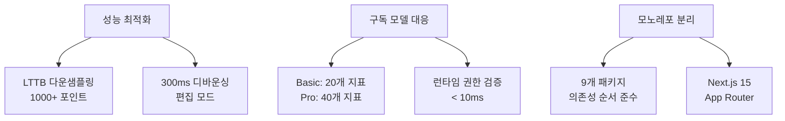
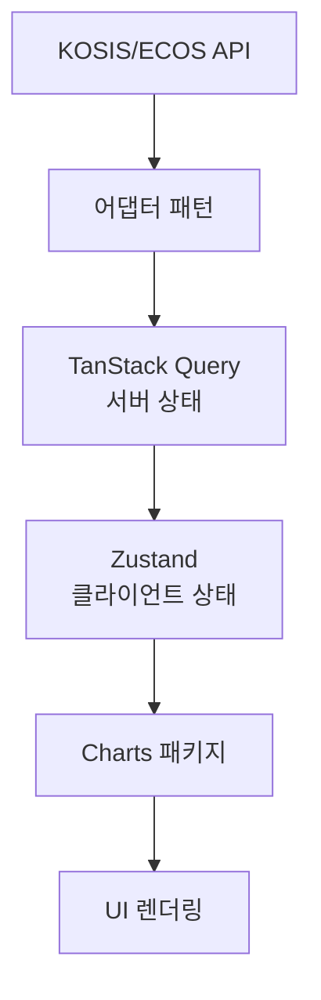

# E-Torch 프론트엔드 아키텍처 설계 문서

## 1. 아키텍처 개요

### 1.1 E-Torch 특화 제약사항

| 도메인 특성 | 기술적 제약 | 구현 방법 |
|------------|------------|----------|
| **KOSIS/ECOS 통합** | 이기종 API 응답 차이 | 어댑터 패턴 |
| **1000+ 데이터 포인트** | 메모리 200MB 제한 | LTTB 다운샘플링 |
| **구독 모델** | 권한 검증 < 10ms | 클라이언트 캐시 5분 |
| **정기 발표 데이터** | 정확성 > 실시간성 | 24시간 캐시 |

### 1.2 핵심 성능 목표

| 기능 | 목표값 | 측정 기준 |
|------|--------|----------|
| 차트 렌더링 | < 3초 | 1000포인트 시계열 |
| 편집 반응성 | 60fps | 드래그 중 |
| 메모리 사용량 | < 200MB | 대시보드당 |
| 권한 검증 | < 10ms | 플랜별 기능 제한 |

### 1.3 아키텍처 설계 원칙



## 2. 기술 스택

### 2.1 핵심 기술 (E-Torch 특화 설정)

| 영역 | 기술 | 버전 | E-Torch 특화 설정 |
|------|------|------|------------------|
| **모노레포** | Turborepo + pnpm | 2.5.3 + 10.11.0 | 9패키지 분할 |
| **프레임워크** | Next.js + React | 15.3.2 + 19.1.0 | App Router 전용 |
| **UI** | Tailwind CSS + Shadcn/UI | 4.1.7 + latest | CSS-first, OKLCH |
| **상태관리** | Zustand + TanStack Query | 5.0.5 + 5.77.0 | 서버/클라이언트 분리 |
| **차트** | Recharts | 2.15.3 | LTTB 다운샘플링 |
| **레이아웃** | react-grid-layout | 1.5.1 | 300ms 디바운싱 |
| **인증** | Supabase Auth | v2 | SNS 로그인 3개 |

### 2.2 Tailwind CSS 4 설정 (CSS-first)

```css
/* globals.css */
@import "tailwindcss";

@theme {
  /* E-Torch 브랜드 색상 (OKLCH) */
  --color-primary: oklch(0.2 0.15 240);
  --color-secondary: oklch(0.5 0.2 230);
  --color-tertiary: oklch(0.45 0.18 220);
  
  /* 성능 최적화 값 */
  --debounce-resize: 300ms;
  --debounce-drag: 200ms;
}

/* OKLCH 미지원 브라우저 HSL 폴백 */
@supports not (color: oklch(0 0 0)) {
  :root {
    --color-primary: hsl(225, 60%, 15%);
  }
}
```

### 2.3 구독 모델 런타임 제어

```typescript
// 권한 검증 (10ms 이내)
const FEATURE_GATES = {
  basic: { indicators: 20, dashboards: 3, widgets: 6 },
  pro: { indicators: 40, dashboards: Infinity, widgets: Infinity }
} as const

export const useFeatureGate = (feature: string) => {
  const { plan } = useAuth()
  return FEATURE_GATES[plan][feature]
}
```

## 3. 아키텍처 계층 구조

### 3.1 서버/클라이언트 컴포넌트 분리

| 컴포넌트 유형 | 책임 | 구현 방식 |
|-------------|------|----------|
| **서버 컴포넌트** | 데이터 페칭, 메타데이터 로드 | Next.js 15 App Router |
| **클라이언트 컴포넌트** | 인터랙션, 상태 관리 | "use client" |
| **서버 액션** | 데이터 변경, 검증 | "use server" |

### 3.2 데이터 흐름



### 3.3 성능 최적화 구현

```typescript
// LTTB 다운샘플링 (1000+ 포인트)
export const processChartData = (data: DataPoint[]) => {
  return data.length > 1000 ? applyLTTB(data, 1000) : data
}

// 편집 모드 디바운싱
const gridLayoutProps = {
  onDragStart: () => setChartRenderingEnabled(false),
  onDragStop: debounce(() => setChartRenderingEnabled(true), 200),
  onResizeStop: debounce(() => setChartRenderingEnabled(true), 300)
}
```

## 4. 모노레포 패키지 구조

### 4.1 패키지 의존성 (9개)

| 패키지 | 의존성 | 핵심 책임 |
|--------|--------|----------|
| **core** | 없음 | 타입, 상수 |
| **utils** | 없음 | LTTB, 포맷터 |
| **ui** | core, utils | Shadcn/UI |
| **data-sources** | core, utils | KOSIS/ECOS 어댑터 |
| **state** | core, utils, data-sources | 상태 관리 |
| **charts** | core, ui, utils, data-sources | 5가지 차트 + 2가지 텍스트 |
| **dashboard** | 모든 패키지 | react-grid-layout |
| **server-api** | core, utils | API 핸들러 |
| **eslint-config** | 없음 | Standard JS |

### 4.2 Turborepo 설정

```json
// turbo.json
{
  "pipeline": {
    "build": { "dependsOn": ["^build"] },
    "dev": { "cache": false }
  }
}
```

```yaml
# pnpm-workspace.yaml
packages:
  - "apps/*"
  - "packages/*"
```

## 5. 패키지별 책임 구분

### 5.1 Core 패키지

```typescript
// 구독 타입
export type Plan = 'basic' | 'pro'
export type PlanLimits = {
  basic: { dashboards: 3, widgets: 6, indicators: 20 }
  pro: { dashboards: -1, widgets: -1, indicators: 40 }
}

// 차트 타입
export type ChartType = 'timeSeries' | 'bar' | 'scatter' | 'radar' | 'radialBar'
export type TextType = 'custom' | 'dataText'
```

### 5.2 Charts 패키지 (성능 최적화)

```typescript
// LTTB 다운샘플링
export const useLTTBSampling = (data: DataPoint[], threshold = 1000) => {
  return useMemo(() => {
    return data.length > threshold ? lttbDownsampling(data, threshold) : data
  }, [data, threshold])
}

// 차트 렌더러
export const ChartRenderer = memo(({ data, type, options }) => {
  const sampledData = useLTTBSampling(data, 1000)
  return <Chart data={sampledData} type={type} {...options} />
})
```

### 5.3 State 패키지 (서버/클라이언트 분리)

```typescript
// 클라이언트 상태 (Zustand)
export const useDashboardStore = create(
  persist((set) => ({
    editMode: false,
    selectedWidget: null
  }), { name: 'dashboard-state' })
)

// 서버 상태 (TanStack Query)
export const useIndicators = (source: DataSource) => {
  return useQuery({
    queryKey: ['indicators', source],
    queryFn: () => getIndicators(source),
    staleTime: 24 * 60 * 60 * 1000 // 24시간 캐시
  })
}
```

### 5.4 Data-Sources 패키지 (어댑터 패턴)

```typescript
// 추상 어댑터
export abstract class BaseAdapter {
  abstract fetchData(indicator: string): Promise<DataPoint[]>
  abstract getSupportedPeriods(): Period[]
}

// KOSIS: M,Q,A / ECOS: D,M,Q,A
export class KOSISAdapter extends BaseAdapter {
  getSupportedPeriods() { return ['M', 'Q', 'A'] }
}

export class ECOSAdapter extends BaseAdapter {
  getSupportedPeriods() { return ['D', 'M', 'Q', 'A'] }
}
```

## 6. 인증 아키텍처

### 6.1 Supabase Auth 설정

| 설정 | 값 | 용도 |
|------|-----|------|
| **OAuth 제공자** | Google, Naver, Kakao | SNS 로그인 전용 |
| **JWT 만료** | 1시간 | 자동 갱신 |
| **세션 유지** | 30일 | 브라우저 저장 |

```typescript
// Supabase 클라이언트
export const supabase = createBrowserClient(
  process.env.NEXT_PUBLIC_SUPABASE_URL!,
  process.env.NEXT_PUBLIC_SUPABASE_ANON_KEY!,
  {
    auth: {
      flowType: 'pkce',
      autoRefreshToken: true
    }
  }
)
```

### 6.2 권한 검증 (< 10ms)

```typescript
// 권한 훅
export const useAuth = () => {
  const { data: session } = useQuery({
    queryKey: ['auth-session'],
    queryFn: () => supabase.auth.getSession(),
    staleTime: 5 * 60 * 1000 // 5분 캐시
  })
  
  const plan = session?.user?.user_metadata?.subscription_plan || 'basic'
  return { user: session?.user, plan, isAuthenticated: !!session?.user }
}
```

### 6.3 미들웨어 (보호된 라우트)

```typescript
// middleware.ts
export async function middleware(request: NextRequest) {
  const supabase = createMiddlewareClient({ req: request, res: response })
  const { data: { session } } = await supabase.auth.getSession()
  
  if (request.nextUrl.pathname.startsWith('/dashboard') && !session) {
    return NextResponse.redirect(new URL('/login', request.url))
  }
  
  return response
}
```

### 6.4 토스페이먼츠 결제 연동

```typescript
// 결제 웹훅
export async function POST(request: Request) {
  const signature = request.headers.get('x-toss-signature')
  const payload = await request.text()
  
  // 서명 검증
  const isValid = verifyTossSignature(payload, signature)
  if (!isValid) return new Response('Unauthorized', { status: 401 })
  
  // 구독 상태 업데이트
  const { orderId, status } = JSON.parse(payload)
  await updateSubscriptionStatus(orderId, status)
  
  return new Response('OK')
}
```

## 7. 차트 컴포넌트 설계

### 7.1 차트 컴포넌트 구조

| 컴포넌트 | 유형 | 책임 | 연결 옵션 |
|---------|------|-----|----------|
| **ChartServerWrapper** | 서버 | 데이터 페칭, 메타데이터 | - |
| **ChartRenderer** | 클라이언트 | 차트 렌더링, LTTB 적용 | 모든 옵션 |
| **TimeSeriesChart** | 클라이언트 | 시계열 특화 | Panel, Tooltip, Legend, Axis, GraphStyles |
| **BarChart** | 클라이언트 | 범주형 비교 | Panel, Tooltip, Legend, Axis |
| **ScatterChart** | 클라이언트 | 상관관계 | Panel, Tooltip, Legend, Axis, ScatterOptions |
| **RadarChart** | 클라이언트 | 다차원 비교 | Panel, Tooltip, Legend, RadarOptions |
| **RadialBarChart** | 클라이언트 | 부분-전체 | Panel, Tooltip, Legend, RadialBarOptions |

### 7.2 차트 성능 최적화

```typescript
// 차트 렌더러 (LTTB 적용)
export const ChartRenderer = memo(({ data, type, options }) => {
  const [chartEnabled, setChartEnabled] = useState(true)
  const sampledData = useLTTBSampling(data, 1000)
  
  // 편집 중 렌더링 비활성화
  useEffect(() => {
    const disable = () => setChartEnabled(false)
    const enable = debounce(() => setChartEnabled(true), 300)
    
    window.addEventListener('chart-edit-start', disable)
    window.addEventListener('chart-edit-end', enable)
    
    return () => {
      window.removeEventListener('chart-edit-start', disable)
      window.removeEventListener('chart-edit-end', enable)
    }
  }, [])
  
  if (!chartEnabled) return <ChartSkeleton />
  return <Chart data={sampledData} type={type} {...options} />
})
```

### 7.3 텍스트 위젯 (2가지 유형)

```typescript
// Text-사용자정의
export const CustomTextWidget = ({ content, options }) => {
  return (
    <div className="prose" {...options}>
      <ReactMarkdown>{content}</ReactMarkdown>
    </div>
  )
}

// Text-데이터기반  
export const DataTextWidget = ({ dataSource, operation, format }) => {
  const { data } = useQuery({
    queryKey: ['data-text', dataSource],
    queryFn: () => fetchIndicatorData(dataSource)
  })
  
  const value = operations[operation](data)
  return <div>{formatNumber(value, format)}</div>
}
```

## 8. 대시보드 컴포넌트 설계

### 8.1 대시보드 그리드 (react-grid-layout)

```typescript
// DashboardGrid.tsx
export const DashboardGrid = ({ widgets, editMode }) => {
  const [layouts, setLayouts] = useState(getLayouts(widgets))
  
  const gridProps = {
    className: "layout",
    cols: { lg: 12, md: 8, sm: 4 },
    breakpoints: { lg: 1200, md: 768, sm: 0 },
    margin: [16, 16],
    
    // E-Torch 최적화
    onDragStart: () => dispatchEvent(new Event('chart-edit-start')),
    onDragStop: debounce(() => dispatchEvent(new Event('chart-edit-end')), 200),
    onResizeStart: () => dispatchEvent(new Event('chart-edit-start')),
    onResizeStop: debounce(() => dispatchEvent(new Event('chart-edit-end')), 300),
    
    onLayoutChange: (layout) => setLayouts(layout)
  }
  
  return (
    <ResponsiveGridLayout {...gridProps}>
      {widgets.map(widget => (
        <div key={widget.id} data-grid={widget.layout}>
          <WidgetRenderer widget={widget} />
        </div>
      ))}
    </ResponsiveGridLayout>
  )
}
```

### 8.2 대시보드 편집기

```typescript
// DashboardEditor.tsx
export const DashboardEditor = ({ dashboardId }) => {
  const [editMode, setEditMode] = useEditMode()
  const [selectedWidget, setSelectedWidget] = useState(null)
  
  return (
    <div className="dashboard-editor">
      <EditorToolbar 
        onSave={saveDashboard}
        onCancel={() => setEditMode(false)}
      />
      <DashboardGrid 
        widgets={widgets}
        editMode={editMode}
        onWidgetSelect={setSelectedWidget}
      />
      {selectedWidget && (
        <PropertyPanel widget={selectedWidget} />
      )}
    </div>
  )
}
```

## 9. 데이터 소스 컴포넌트 설계

### 9.1 데이터 쿼리 빌더

```typescript
// DataQueryBuilder.tsx
export const DataQueryBuilder = ({ onQueryChange }) => {
  const [source, setSource] = useState<'KOSIS' | 'ECOS'>('KOSIS')
  const [indicator, setIndicator] = useState('')
  const [period, setPeriod] = useState('M')
  
  const { data: indicators } = useIndicators(source)
  const supportedPeriods = getSupportedPeriods(source, indicator)
  
  // 구독 플랜 제한
  const { plan } = useAuth()
  const allowedIndicators = plan === 'basic' ? 
    indicators?.slice(0, 20) : indicators
  
  return (
    <div>
      <SourceSelector value={source} onChange={setSource} />
      <IndicatorSelector 
        indicators={allowedIndicators}
        value={indicator}
        onChange={setIndicator}
      />
      <PeriodSelector 
        periods={supportedPeriods}
        value={period}
        onChange={setPeriod}
      />
    </div>
  )
}
```

### 9.2 어댑터 패턴 구현

```typescript
// adapters/KOSISAdapter.ts
export class KOSISAdapter implements DataAdapter {
  async fetchData(indicator: string, options: QueryOptions) {
    const response = await fetch(`/api/kosis/${indicator}`, {
      method: 'POST',
      body: JSON.stringify(options)
    })
    return this.transformResponse(await response.json())
  }
  
  getSupportedPeriods() {
    return ['M', 'Q', 'A'] // KOSIS는 월간, 분기, 연간만
  }
  
  private transformResponse(data: any): DataPoint[] {
    // KOSIS 응답을 표준 형식으로 변환
    return data.map(item => ({
      date: item.TIME,
      value: parseFloat(item.DATA_VALUE),
      metadata: { source: 'KOSIS' }
    }))
  }
}
```

## 10. 서버 액션 통합

### 10.1 대시보드 서버 액션

```typescript
// app/actions/dashboard.ts
'use server'

import { revalidatePath } from 'next/cache'

export async function saveDashboardAction(dashboardId: string, data: any) {
  try {
    // 권한 검증
    const session = await getServerSession()
    if (!session) throw new Error('Unauthorized')
    
    // 구독 플랜 제한 확인
    const planLimits = await getUserPlanLimits(session.user.id)
    validateDashboardLimits(data, planLimits)
    
    const result = await saveDashboard(dashboardId, data)
    revalidatePath(`/dashboard/${dashboardId}`)
    
    return { success: true, data: result }
  } catch (error) {
    return { success: false, error: error.message }
  }
}

export async function createWidgetAction(dashboardId: string, widgetData: any) {
  try {
    const session = await getServerSession()
    const planLimits = await getUserPlanLimits(session.user.id)
    
    // 위젯 수 제한 확인 (Basic: 6개, Pro: 무제한)
    const currentWidgets = await getWidgetCount(dashboardId)
    if (planLimits.widgets !== -1 && currentWidgets >= planLimits.widgets) {
      throw new Error('Widget limit exceeded')
    }
    
    const widget = await createWidget(dashboardId, widgetData)
    revalidatePath(`/dashboard/${dashboardId}`)
    
    return { success: true, data: widget }
  } catch (error) {
    return { success: false, error: error.message }
  }
}
```

### 10.2 구독 관리 액션

```typescript
// app/actions/subscription.ts
'use server'

export async function upgradeSubscriptionAction(planType: 'pro') {
  try {
    const session = await getServerSession()
    if (!session) throw new Error('Unauthorized')
    
    // 토스페이먼츠 결제 세션 생성
    const paymentSession = await createTossPayment({
      amount: planType === 'pro' ? 9900 : 0,
      orderId: generateOrderId(),
      orderName: `E-Torch ${planType.toUpperCase()} 구독`,
      customerEmail: session.user.email
    })
    
    return { success: true, data: paymentSession }
  } catch (error) {
    return { success: false, error: error.message }
  }
}
```

## 11. 접근성 컴포넌트

### 11.1 차트 접근성

```typescript
// AccessibleChart.tsx
export const AccessibleChart = ({ data, type, title }) => {
  const [showTable, setShowTable] = useState(false)
  const chartDescription = generateChartDescription(data, type)
  
  return (
    <div>
      <div 
        role="img" 
        aria-label={chartDescription}
        aria-describedby={`chart-desc-${id}`}
      >
        <Chart data={data} type={type} />
      </div>
      
      <div id={`chart-desc-${id}`} className="sr-only">
        {chartDescription}
      </div>
      
      <button 
        onClick={() => setShowTable(!showTable)}
        aria-expanded={showTable}
      >
        {showTable ? '표 숨기기' : '데이터 표 보기'}
      </button>
      
      {showTable && (
        <table className="accessible-data-table">
          <thead>
            <tr>
              <th>날짜</th>
              <th>값</th>
            </tr>
          </thead>
          <tbody>
            {data.map((point, i) => (
              <tr key={i}>
                <td>{formatDate(point.date)}</td>
                <td>{formatNumber(point.value)}</td>
              </tr>
            ))}
          </tbody>
        </table>
      )}
    </div>
  )
}
```

### 11.2 키보드 네비게이션

```typescript
// KeyboardNav.tsx
export const useKeyboardShortcuts = (editMode: boolean) => {
  useEffect(() => {
    const handleKeyDown = (e: KeyboardEvent) => {
      if (!editMode) return
      
      // Alt + 1: 메인 콘텐츠로 이동
      if (e.altKey && e.key === '1') {
        document.getElementById('main-content')?.focus()
      }
      
      // Ctrl + Z: 실행취소
      if (e.ctrlKey && e.key === 'z') {
        undoLastAction()
      }
      
      // Delete: 선택된 위젯 삭제
      if (e.key === 'Delete' && selectedWidget) {
        deleteWidget(selectedWidget.id)
      }
    }
    
    document.addEventListener('keydown', handleKeyDown)
    return () => document.removeEventListener('keydown', handleKeyDown)
  }, [editMode, selectedWidget])
}
```

## 12. 성능 최적화

### 12.1 코드 분할

```typescript
// 차트 컴포넌트 동적 로딩
const TimeSeriesChart = dynamic(() => 
  import('@/packages/charts/TimeSeriesChart'), {
  loading: () => <ChartSkeleton type="timeSeries" />,
  ssr: false // Recharts SSR 불가
})

const BarChart = dynamic(() => 
  import('@/packages/charts/BarChart'), {
  loading: () => <ChartSkeleton type="bar" />,
  ssr: false
})
```

### 12.2 메모리 관리

```typescript
// 차트 메모리 정리
export const useChartMemory = (data: ChartData[]) => {
  useEffect(() => {
    return () => {
      // 차트 인스턴스 정리
      data.forEach(d => {
        if (d.cleanup) d.cleanup()
      })
    }
  }, [data])
}

// 위젯 언마운트 시 정리
export const WidgetContainer = ({ widget }) => {
  useEffect(() => {
    return () => {
      // 이벤트 리스너 정리
      cleanupWidgetListeners(widget.id)
      // 캐시 정리
      clearWidgetCache(widget.id)
    }
  }, [widget.id])
  
  return <Widget {...widget} />
}
```

### 12.3 React 19 최적화

```typescript
// useOptimistic 활용
export const DashboardTitle = ({ dashboardId, title }) => {
  const [optimisticTitle, setOptimisticTitle] = useOptimistic(
    title,
    (state, newTitle: string) => newTitle
  )
  
  const updateTitle = async (formData: FormData) => {
    const newTitle = formData.get('title') as string
    
    // 즉시 UI 업데이트
    setOptimisticTitle(newTitle)
    
    // 서버에 저장
    await saveDashboardAction(dashboardId, { title: newTitle })
  }
  
  return (
    <form action={updateTitle}>
      <input 
        name="title" 
        defaultValue={optimisticTitle}
        className="dashboard-title-input"
      />
    </form>
  )
```
