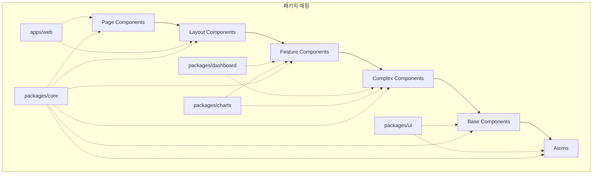
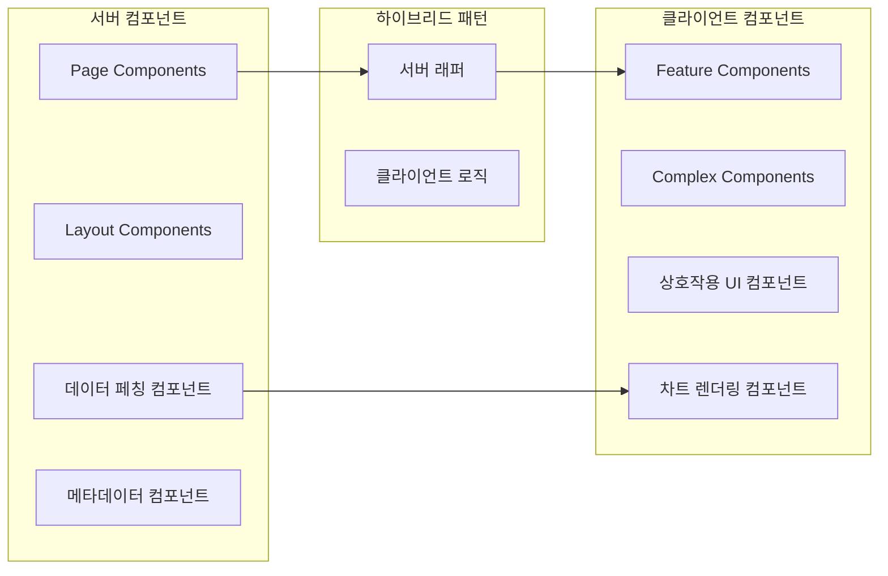
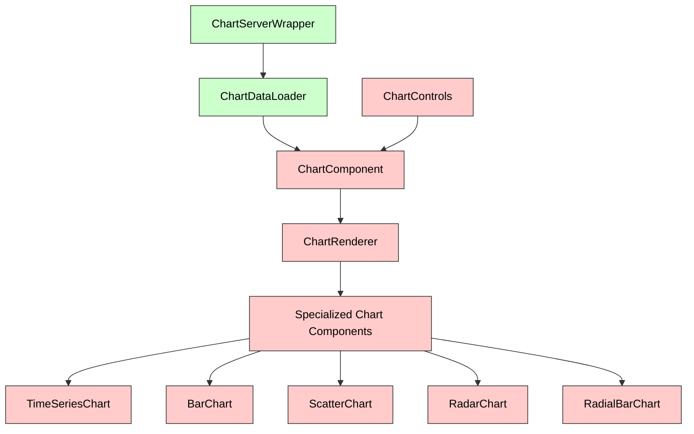
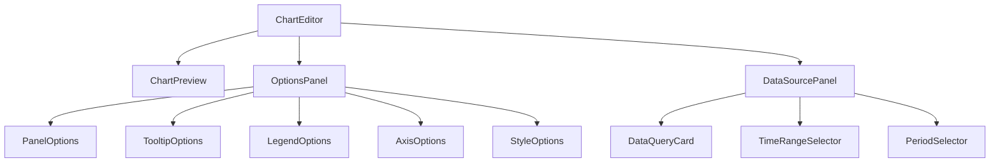
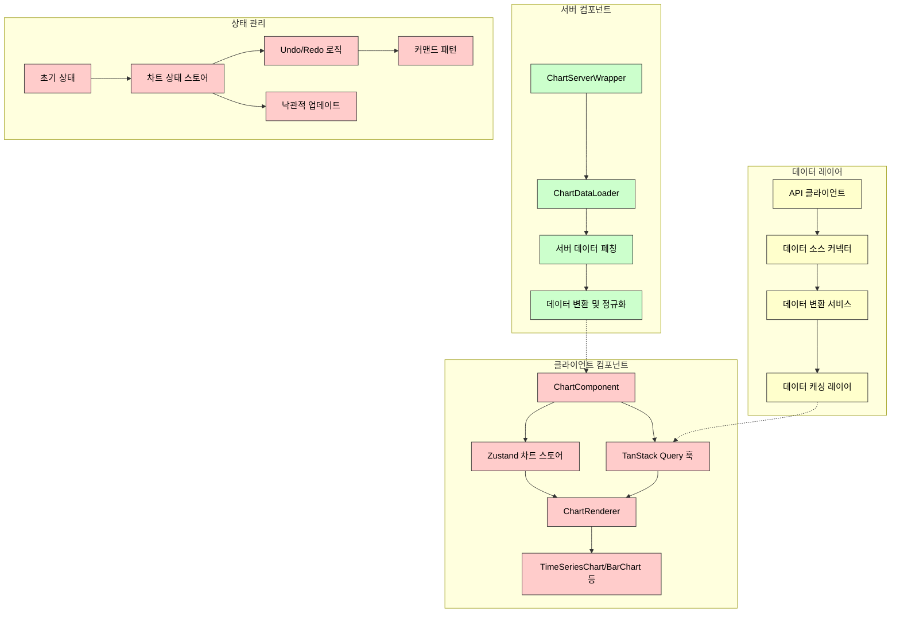
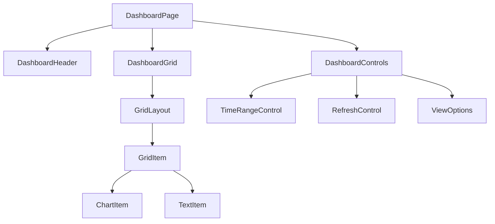
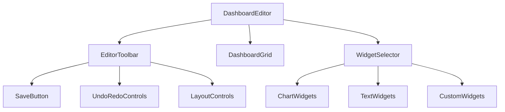
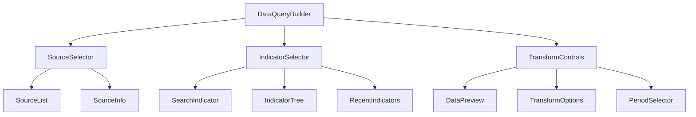

# E-Torch 핵심 컴포넌트 설계

## 1. 개요

E-Torch 프로젝트의 핵심 컴포넌트 설계는 모듈성, 재사용성, 확장성을 중심으로 구축됩니다. 본 문서는 E-Torch의 주요 기능 구현에 필요한 핵심 컴포넌트들의 구조, 상호작용, 책임 범위를 정의합니다.

## 2. 컴포넌트 계층 구조와 패키지 매핑

E-Torch의 컴포넌트 계층 구조는 역할과 책임에 따라 다음과 같이 구성되며, [`architecture.md`](../architecture.md)에 정의된 모노레포 패키지 구조와 매핑됩니다:



### 2.1 계층별 정의 및 패키지 매핑

| 계층 | 정의 | 패키지 위치 | 예시 |
|------|------|-------------|------|
| **Page Components** | 라우트에 연결되는 페이지 단위 컴포넌트 | `apps/web/app/**/page.tsx` | `DashboardPage`, `ChartEditorPage` |
| **Layout Components** | 공통 레이아웃 구조를 제공하는 컴포넌트 | `apps/web/app/**/layout.tsx` | `DashboardLayout`, `AuthLayout` |
| **Feature Components** | 특정 기능을 담당하는 컴포넌트 | `packages/dashboard`, `packages/charts` | `DashboardGrid`, `ChartEditor` |
| **Complex Components** | 여러 기본 컴포넌트로 구성된 복합 UI 요소 | `packages/dashboard`, `packages/charts` | `WidgetContainer`, `TimeSeriesChart` |
| **Base Components** | Shadcn/UI 기반 기본 컴포넌트 | `packages/ui/components` | `Button`, `Card`, `Select` |
| **Atoms** | 가장 기본적인 UI 요소 | `packages/ui/atoms` | `Icon`, `Typography`, `Colors` |

## 3. 서버 컴포넌트 vs 클라이언트 컴포넌트

Next.js의 서버/클라이언트 컴포넌트 구분에 따라 각 컴포넌트는 다음과 같이 분류됩니다:



### 3.1 서버 컴포넌트 (RSC)

서버 컴포넌트는 다음과 같은 책임을 갖습니다:

- **데이터 페칭**: 서버에서 데이터를 페칭하여 클라이언트 컴포넌트에 전달
- **메타데이터 생성**: SEO를 위한 메타데이터 설정
- **초기 데이터 로드**: 초기 데이터를 클라이언트 컴포넌트에 props로 전달
- **정적 UI 렌더링**: 상호작용이 필요 없는 정적 UI 요소 렌더링

**주요 서버 컴포넌트**:

- `DashboardPage` (`app/dashboard/[id]/page.tsx`)
- `DashboardLoader` (`packages/dashboard/server/DashboardLoader.tsx`)
- `ChartDataLoader` (`packages/charts/server/ChartDataLoader.tsx`)

### 3.2 클라이언트 컴포넌트 (RCC)

클라이언트 컴포넌트는 다음과 같은 책임을 갖습니다:

- **상호작용 UI**: 사용자 상호작용이 필요한 UI 요소
- **상태 관리**: React 훅을 사용한 지역 상태 관리
- **이벤트 핸들링**: 사용자 이벤트 처리
- **차트 렌더링**: Recharts 기반 차트 렌더링
- **애니메이션**: 모션 및 트랜지션 효과

**주요 클라이언트 컴포넌트**:

- `DashboardGrid` (`packages/dashboard/components/DashboardGrid.tsx`)
- `ChartComponent` (`packages/charts/components/ChartComponent.tsx`)
- `ChartEditor` (`packages/charts/editor/ChartEditor.tsx`)

### 3.3 서버/클라이언트 통합 패턴

서버 컴포넌트와.클라이언트 컴포넌트를 효과적으로 통합하는 패턴입니다:

```tsx
// 서버 컴포넌트 래퍼 패턴

// packages/charts/server/ChartServerWrapper.tsx (서버 컴포넌트)
import { ChartComponent } from '../components/ChartComponent';
import { fetchChartData } from '@/packages/data-sources/server';

export async function ChartServerWrapper({ chartId, config }: { chartId: string, config: ChartConfig }) {
  // 서버에서 데이터 페칭
  const initialData = await fetchChartData(config);
  
  // 클라이언트 컴포넌트로 초기 데이터 전달
  return (
    <ChartComponent
      chartId={chartId}
      config={config}
      initialData={initialData}
    />
  );
}

// packages/charts/components/ChartComponent.tsx (클라이언트 컴포넌트)
'use client';

import { useChartData } from '@/packages/data-sources/hooks';
import { ChartRenderer } from './ChartRenderer';

export function ChartComponent({ 
  chartId, 
  config, 
  initialData 
}: { 
  chartId: string; 
  config: ChartConfig; 
  initialData?: ChartData;
}) {
  // 클라이언트에서 데이터 관리 (초기 데이터로 시작)
  const { data, isLoading, error, refetch } = useChartData(config, {
    initialData
  });
  
  return (
    <div>
      {isLoading && !initialData ? (
        <LoadingSpinner />
      ) : error ? (
        <ErrorDisplay error={error} onRetry={refetch} />
      ) : (
        <ChartRenderer
          chartId={chartId}
          config={config}
          data={data}
        />
      )}
    </div>
  );
}
```

### 3.4 UI 컴포넌트 서버 래퍼 패턴

Shadcn/UI 같은 클라이언트 컴포넌트를 서버 컴포넌트에서 사용하기 위한 래퍼 패턴입니다:

```tsx
// packages/ui/src/server-wrappers/button.server.tsx
import { Button } from '../components/ui/button';

export interface ButtonServerProps {
  children: React.ReactNode;
  variant?: 'default' | 'destructive' | 'outline' | 'secondary' | 'ghost' | 'link';
  size?: 'default' | 'sm' | 'lg' | 'icon';
  className?: string;
}

export function ButtonServer({ 
  children, 
  variant = 'default',
  size = 'default',
  className 
}: ButtonServerProps) {
  // 서버 컴포넌트에서 필요한 로직 (필요시)
  // 최소한의 props만 전달해 클라이언트 번들 크기 최적화
  return (
    <Button variant={variant} size={size} className={className}>
      {children}
    </Button>
  );
}
```

## 4. 차트 컴포넌트 설계

차트 표시 및 편집 관련 컴포넌트는 E-Torch의 핵심 기능으로, 서버 컴포넌트와 클라이언트 컴포넌트의 조합으로 구현됩니다.

## 4.1 차트 컴포넌트 계층 구조



#### 컴포넌트별 책임 정의

| 컴포넌트 | 유형 | 책임 | 연결된 옵션 컴포넌트 |
|---------|------|-----|------------------|
| **ChartServerWrapper** | 서버 | 서버 측 데이터 페칭, 초기 데이터 준비, 메타데이터 로드 | - |
| **ChartDataLoader** | 서버 | 차트별 데이터 로드 최적화, 데이터 변환 | - |
| **ChartComponent** | 클라이언트 | 차트 렌더링 상태 관리, 이벤트 핸들링, 서버 데이터 hydration | ChartControls, OptionsPanel |
| **ChartRenderer** | 클라이언트 | 차트 타입에 따른 렌더링 로직 분기, 공통 렌더링 프로퍼티 관리 | - |
| **TimeSeriesChart** | 클라이언트 | 시계열 데이터 특화 렌더링 | PanelOptions, TooltipOptions, LegendOptions, XAxis, YAxis, GraphStyles |
| **BarChart** | 클라이언트 | 범주형 데이터 비교 시각화 | PanelOptions, TooltipOptions, LegendOptions, XAxis, YAxis |
| **ScatterChart** | 클라이언트 | 상관관계 시각화 | PanelOptions, TooltipOptions, LegendOptions, XAxis, YAxis, ScatterOptions |
| **RadarChart** | 클라이언트 | 다차원 데이터 비교 | PanelOptions, TooltipOptions, LegendOptions, RadarOptions |
| **RadialBarChart** | 클라이언트 | 부분-전체 관계 시각화 | PanelOptions, TooltipOptions, LegendOptions, RadialBarOptions |
| **ChartControls** | 클라이언트 | 차트 인터랙션 컨트롤 | - |

### 차트 옵션 컴포넌트 매핑

모든 차트는 기본적으로 다음 옵션 컴포넌트를 공유합니다:

1. **PanelOptions**: 제목, 설명, 배경 투명도 (PO-001~003)
2. **TooltipOptions**: 툴팁 표시 방식, 커서 스타일 설정 (TO-001~005)
3. **LegendOptions**: 범례 표시, 레이아웃, 정렬 설정 (LG-001~004)

차트 유형에 따른 특수 옵션:

| 차트 유형 | 특수 옵션 | 관련 기능 ID |
|---------|----------|-------------|
| **TimeSeries** | GraphStyles, XAxis, YAxis, YAxis (Secondary) | GS-001~003, XA-001~010, YA-001~011, YAS-001~011 |
| **BarChart** | XAxis, YAxis | XA-001~010, YA-001~011 |
| **ScatterChart** | XAxis, YAxis, ScatterOptions | XA-001~010, YA-001~011, SC-001~006 |
| **RadarChart** | RadarOptions | RC-001~006 |
| **RadialBarChart** | RadialBarOptions | RB-001~010 |

### 4.2 차트 에디터 컴포넌트



#### 주요 컴포넌트 책임

- **ChartEditor**: 에디터 전체 레이아웃 및 상태 관리
- **ChartPreview**: 현재 설정으로 차트 미리보기 제공
- **OptionsPanel**: 차트 시각적 옵션 편집 UI
- **DataSourcePanel**: 데이터 소스 및 쿼리 설정 UI
- **DataQueryCard**: 개별 데이터 쿼리 설정 UI

### 4.3 차트 커스텀 렌더링 최적화

차트 렌더링 성능을 위한 최적화 전략:

```tsx
// 차트 메모이제이션 예시
function TimeSeriesChart({ data, options, width, height }: TimeSeriesChartProps) {
  // 옵션 변경 시에만 재계산
  const processedOptions = useMemo(() => {
    return {
      ...options,
      yAxis: processYAxisOptions(options.yAxis),
      xAxis: processXAxisOptions(options.xAxis, data),
      tooltip: processTooltipOptions(options.tooltip)
    };
  }, [options, data]);
  
  // 데이터 다운샘플링 최적화
  const optimizedData = useMemo(() => {
    // 화면 너비에 맞춰 데이터 다운샘플링
    if (data.length > width / 2) {
      return downsampleTimeSeries(data, Math.floor(width / 2));
    }
    return data;
  }, [data, width]);
  
  // 이벤트 핸들러 메모이제이션
  const handleMouseMove = useCallback((e) => {
    // 마우스 이벤트 처리 로직
  }, []);
  
  // 차트 컴포넌트 자체도 메모이제이션
  return useMemo(() => (
    <ResponsiveContainer width={width} height={height}>
      <LineChart data={optimizedData} onMouseMove={handleMouseMove}>
        <XAxis {...processedOptions.xAxis} />
        <YAxis {...processedOptions.yAxis} />
        <Tooltip {...processedOptions.tooltip} />
        <Legend {...processedOptions.legend} />
        <Line
          type="monotone"
          dataKey="value"
          stroke={processedOptions.color}
          strokeWidth={processedOptions.strokeWidth}
          dot={processedOptions.showDots}
        />
      </LineChart>
    </ResponsiveContainer>
  ), [optimizedData, processedOptions, width, height, handleMouseMove]);
}

export default memo(TimeSeriesChart);
```

### 4.4 차트 데이터 흐름 통합 다이어그램



#### 통합된 데이터 상태 관리 접근법

E-Torch 프로젝트의 차트 컴포넌트와 데이터 상태 관리는 다음과 같은 통합된 접근법을 사용합니다:

1. **서버 컴포넌트 데이터 페칭**:
   - `ChartServerWrapper`에서 서버 측 데이터 페칭 수행
   - 초기 데이터를 클라이언트 컴포넌트에 전달하여 초기 렌더링 최적화
   - 페이지 로드 시 필요한 데이터만 선택적으로 페칭

2. **클라이언트 상태 관리**:
   - `Zustand` 스토어를 사용하여 UI 상태, 에디터 상태 등 관리
   - 상태를 기능별로 분리하여 관심사 분리와 유지보수성 향상
   - 불변성과 정규화된 상태 구조를 통한 성능 최적화

3. **서버 상태 관리**:
   - `TanStack Query`를 사용하여 원격 데이터 캐싱 및 동기화
   - 경제지표 유형별 최적화된 캐싱 전략 적용
   - 낙관적 업데이트를 통한 사용자 경험 향상

4. **데이터 변환 파이프라인**:
   - 데이터 정규화, 변환, 집계 등의 과정을 표준화된 파이프라인으로 구성
   - 서버와 클라이언트 모두에서 일관된 데이터 모델 유지
   - 변환된 데이터를 차트 렌더링 컴포넌트에 전달

5. **컴포넌트-상태 통합**:
   - 차트 컴포넌트는 `useChartStore`, `useChartData` 등의 훅을 통해 상태에 접근
   - 상태 변경은 스토어의 액션을 통해서만 수행
   - 컴포넌트는 필요한 상태만 선택적으로 구독하여 불필요한 렌더링 방지

이 통합된 접근법은 서버 컴포넌트와 클라이언트 컴포넌트의 장점을 모두 활용하면서, 데이터 흐름의 일관성과 상태 관리의 효율성을 극대화합니다.

## 5. 대시보드 컴포넌트 설계

대시보드 관련 컴포넌트는 레이아웃 관리와 위젯 상호작용에 초점을 맞추어 설계됩니다.

### 5.1 대시보드 그리드 컴포넌트



#### 주요 컴포넌트 책임 및 서버/클라이언트 구분

- **DashboardPage** (서버 컴포넌트): 대시보드 페이지 구조 정의 및 초기 데이터 로드
- **DashboardHeader** (서버 컴포넌트): 대시보드 제목, 설명, 메타 정보 표시
- **DashboardGrid** (클라이언트 컴포넌트): react-grid-layout 기반 그리드 시스템 관리
- **GridItem** (클라이언트 컴포넌트): 그리드 내 개별 위젯 아이템 래퍼
- **ChartItem/TextItem** (클라이언트 컴포넌트): 위젯 유형별 특화 컴포넌트

### 5.2 대시보드 편집기 컴포넌트



#### 주요 컴포넌트 책임

- **DashboardEditor** (클라이언트 컴포넌트): 대시보드 편집 모드 전체 관리
- **EditorToolbar** (클라이언트 컴포넌트): 편집 기능 제공 (저장, 실행 취소/다시 실행, 레이아웃)
- **WidgetSelector** (클라이언트 컴포넌트): 추가 가능한 위젯 목록 제공

### 5.3 서버 컴포넌트와 클라이언트 컴포넌트 통합 예시

```tsx
// app/(dashboard)/dashboard/[id]/page.tsx (서버 컴포넌트)
import { DashboardServerWrapper } from '@/packages/dashboard/server';
import { fetchDashboardById } from '@/packages/server-api/dashboard';
import { notFound } from 'next/navigation';

interface DashboardPageProps {
  params: { id: string };
}

export default async function DashboardPage({ params }: DashboardPageProps) {
  // 서버에서 대시보드 데이터 페칭
  const dashboard = await fetchDashboardById(params.id);
  
  if (!dashboard) {
    return notFound();
  }
  
  // 서버 래퍼 컴포넌트로 초기 데이터 전달
  return <DashboardServerWrapper dashboardId={params.id} initialData={dashboard} />;
}

// packages/dashboard/server/DashboardServerWrapper.tsx (서버 컴포넌트)
import { DashboardComponent } from '../components/DashboardComponent';

export async function DashboardServerWrapper({ 
  dashboardId, 
  initialData 
}: { 
  dashboardId: string;
  initialData: Dashboard;
}) {
  // 추가 데이터가 필요하면 여기서 페치
  const widgetsData = await fetchWidgetsData(dashboardId);
  
  // 클라이언트 컴포넌트에 데이터 전달
  return (
    <DashboardComponent 
      dashboard={initialData}
      widgetsData={widgetsData}
    />
  );
}

// packages/dashboard/components/DashboardComponent.tsx (클라이언트 컴포넌트)
'use client';

import { DashboardGrid } from './DashboardGrid';
import { DashboardControls } from './DashboardControls';
import { useDashboardStore } from '@/packages/state';
import { useEffect } from 'react';

export function DashboardComponent({ 
  dashboard, 
  widgetsData 
}: { 
  dashboard: Dashboard;
  widgetsData: WidgetData[];
}) {
  // 스토어 초기화
  const { initDashboard, setWidgetsData } = useDashboardStore();
  
  useEffect(() => {
    initDashboard(dashboard);
    setWidgetsData(widgetsData);
  }, [dashboard, widgetsData, initDashboard, setWidgetsData]);
  
  return (
    <div>
      <DashboardControls />
      <DashboardGrid />
    </div>
  );
}
```

## 6. 데이터 소스 컴포넌트 설계

데이터 소스 관련 컴포넌트는 데이터 선택, 변환, 쿼리 구성에 초점을 맞추어 설계됩니다.

### 6.1 데이터 쿼리 컴포넌트



#### 주요 컴포넌트 책임

- **DataQueryBuilder**: 데이터 쿼리 구성 전체 관리
- **SourceSelector**: 데이터 출처 선택 UI (KOSIS, ECOS, OECD)
- **IndicatorSelector**: 지표 검색 및 선택 UI
- **TransformControls**: 데이터 변환 옵션 설정
- **DataPreview**: 선택한 데이터의 미리보기 표시

### 6.2 데이터 변환 컴포넌트

```tsx
// packages/data-sources/components/TransformControls.tsx
'use client';

import { TransformType, TimeSeriesData } from '@/packages/core';
import { useState, useEffect } from 'react';
import { Select, Tabs, TabsList, TabsTrigger, TabsContent } from '@/packages/ui/components';

export function TransformControls({
  data,
  initialTransform = 'original',
  onChange
}: {
  data: TimeSeriesData;
  initialTransform?: TransformType;
  onChange: (type: TransformType, data: TimeSeriesData) => void;
}) {
  const [transform, setTransform] = useState<TransformType>(initialTransform);
  
  // 변환 유형에 따라 데이터 처리
  useEffect(() => {
    if (!data) return;
    
    let transformedData: TimeSeriesData;
    
    switch (transform) {
      case 'original':
        transformedData = data;
        break;
      case 'change':
        transformedData = calculateChange(data);
        break;
      case 'changeYoY':
        transformedData = calculateYoYChange(data);
        break;
      case 'cumulative':
        transformedData = calculateCumulative(data);
        break;
      default:
        transformedData = data;
    }
    
    onChange(transform, transformedData);
  }, [transform, data, onChange]);
  
  return (
    <div className="space-y-4">
      <div className="flex items-center justify-between">
        <label className="text-sm font-medium">데이터 변환</label>
        <Select
          value={transform}
          onValueChange={(value: TransformType) => setTransform(value)}
        >
          <SelectItem value="original">원본값</SelectItem>
          <SelectItem value="change">변화율(전기대비)</SelectItem>
          <SelectItem value="changeYoY">변화율(전년동기대비)</SelectItem>
          <SelectItem value="cumulative">누적값</SelectItem>
        </Select>
      </div>
      
      <Tabs defaultValue="preview">
        <TabsList>
          <TabsTrigger value="preview">미리보기</TabsTrigger>
          <TabsTrigger value="options">옵션</TabsTrigger>
        </TabsList>
        
        <TabsContent value="preview">
          <DataPreview data={data} transform={transform} />
        </TabsContent>
        
        <TabsContent value="options">
          <TransformOptions transform={transform} />
        </TabsContent>
      </Tabs>
    </div>
  );
}
```

## 7. 서버 액션 통합 패턴

Next.js 서버 액션을 활용하여 데이터 변경을 처리하는 패턴입니다:

```tsx
// app/actions/dashboard.ts (서버 액션)
'use server';

import { revalidatePath } from 'next/cache';
import { saveDashboard } from '@/packages/server-api/dashboard';

export async function saveDashboardAction(
  dashboardId: string,
  dashboardData: any
) {
  try {
    const result = await saveDashboard(dashboardId, dashboardData);
    revalidatePath(`/dashboard/${dashboardId}`);
    return { success: true, data: result };
  } catch (error) {
    return { 
      success: false, 
      error: error instanceof Error ? error.message : '저장 중 오류가 발생했습니다.'
    };
  }
}

// packages/dashboard/editor/SaveButton.tsx (클라이언트 컴포넌트)
'use client';

import { useTransition } from 'react';
import { Button } from '@/packages/ui/components';
import { useDashboardStore } from '@/packages/state';
import { saveDashboardAction } from '@/app/actions/dashboard';
import { useToast } from '@/packages/ui/hooks';

export function SaveButton({ dashboardId }: { dashboardId: string }) {
  const [isPending, startTransition] = useTransition();
  const { dashboard } = useDashboardStore();
  const { toast } = useToast();
  
  const handleSave = () => {
    startTransition(async () => {
      const result = await saveDashboardAction(dashboardId, dashboard);
      
      if (result.success) {
        toast({
          title: '저장 완료',
          description: '대시보드가 성공적으로 저장되었습니다.',
          variant: 'success'
        });
      } else {
        toast({
          title: '저장 실패',
          description: result.error,
          variant: 'destructive'
        });
      }
    });
  };
  
  return (
    <Button 
      onClick={handleSave}
      disabled={isPending}
    >
      {isPending ? '저장 중...' : '저장'}
    </Button>
  );
}
```

## 8. 접근성 통합 컴포넌트

E-Torch는 WCAG 2.1 AA 수준 준수를 목표로 접근성 컴포넌트를 통합합니다:

### 8.1 키보드 내비게이션 컴포넌트

- **SkipLink**: 키보드 사용자를 위한 메인 콘텐츠 바로가기 링크
- **FocusTrap**: 모달 및 다이얼로그에서 포커스를 가두는 컴포넌트
- **KeyboardNavMenu**: 키보드 방향키로 탐색 가능한 내비게이션 메뉴

```tsx
// 키보드 사용자를 위한 메인 콘텐츠 바로가기 링크
function SkipLink({ targetId }: { targetId: string }) {
  return (
    <a 
      href={`#${targetId}`} 
      className="sr-only focus:not-sr-only focus:absolute focus:top-0 focus:left-0 focus:z-50 focus:p-4 focus:bg-white focus:text-primary"
    >
      콘텐츠로 건너뛰기
    </a>
  );
}

// 모달 및 다이얼로그에서 포커스를 가두는 컴포넌트
function FocusTrap({ children }: { children: React.ReactNode }) {
  const ref = useRef<HTMLDivElement>(null);
  
  // 키보드 탐색 제어 로직
  useEffect(() => {
    const trapFocus = (e: KeyboardEvent) => {
      // 포커스 트랩 구현 로직
      // ...
    };
    
    document.addEventListener('keydown', trapFocus);
    return () => document.removeEventListener('keydown', trapFocus);
  }, []);
  
  return <div ref={ref}>{children}</div>;
}
```

### 8.2 스크린 리더 지원 컴포넌트

- **AccessibleChartTable**: 차트 데이터를 스크린 리더가 인식할 수 있는 테이블로 변환
- **VisuallyHidden**: 시각적으로는 숨겨지지만 스크린 리더는 읽을 수 있는 텍스트

```tsx
// 차트를 위한 접근성 테이블 컴포넌트
function AccessibleChartTable({ 
  data, 
  columns, 
  summary 
}: AccessibleChartTableProps) {
  return (
    <div className="sr-only">
      <table>
        <caption>{summary}</caption>
        <thead>
          <tr>
            {columns.map(column => (
              <th key={column.key} scope="col">{column.label}</th>
            ))}
          </tr>
        </thead>
        <tbody>
          {data.map((row, i) => (
            <tr key={i}>
              {columns.map(column => (
                <td key={column.key}>{row[column.key]}</td>
              ))}
            </tr>
          ))}
        </tbody>
      </table>
    </div>
  );
}
```

### 8.3 색상 및 대비 컴포넌트

- **StatusIndicator**: 색상에만 의존하지 않는 상태 표시 컴포넌트 (아이콘+텍스트 패턴)
- **AccessibleChartPatterns**: 색맹 사용자를 위한 차트 패턴 제공 컴포넌트

```tsx
// 색상에 의존하지 않는 상태 표시 컴포넌트
function StatusIndicator({ 
  status, 
  label 
}: StatusIndicatorProps) {
  // 색상과 함께 아이콘, 텍스트 패턴으로 상태 표시
  return (
    <div className={`status-indicator status-${status}`}>
      <span className="status-icon" aria-hidden="true" />
      <span>{label}</span>
    </div>
  );
}

// 접근성 차트 패턴 컴포넌트
function AccessibleChartPatterns() {
  // SVG 패턴 정의 - 색맹 사용자를 위한 차트 패턴
  return (
    <svg width="0" height="0" style={{ position: 'absolute' }}>
      <defs>
        <pattern id="pattern-stripe" patternUnits="userSpaceOnUse" width="4" height="4" patternTransform="rotate(45)">
          <rect width="2" height="4" transform="translate(0,0)" fill="white"></rect>
        </pattern>
        <pattern id="pattern-dot" patternUnits="userSpaceOnUse" width="4" height="4">
          <rect width="1" height="1" transform="translate(0,0)" fill="white"></rect>
        </pattern>
        {/* 추가 패턴 */}
      </defs>
    </svg>
  );
}
```

## 9. 컴포넌트 성능 최적화

### 9.1 코드 분할 및 지연 로딩

```tsx
// 차트 유형별 다이나믹 임포트
import dynamic from 'next/dynamic';

// 기본 차트 컴포넌트는 즉시 로드
import { ChartProps, ChartType } from '@/packages/charts';
import { ChartSkeleton } from '@/packages/ui/components';

// 차트 유형별 동적 임포트 (필요시 로드)
const TimeSeriesChart = dynamic(() => import('@/packages/charts/src/components/chart-types/TimeSeriesChart'), {
  loading: () => <ChartSkeleton type="timeSeries" />,
  ssr: false // 클라이언트 사이드에서만 렌더링 (Recharts는 SSR 불가)
});

const BarChart = dynamic(() => import('@/packages/charts/src/components/chart-types/BarChart'), {
  loading: () => <ChartSkeleton type="bar" />,
  ssr: false
});

// 차트 렌더러 컴포넌트 (차트 유형에 따라 적절한 컴포넌트 로드)
export function ChartRenderer({ type, ...props }: ChartProps & { type: ChartType }) {
  // 차트 유형에 따라 적절한 컴포넌트 반환
  switch (type) {
    case 'timeSeries':
      return <TimeSeriesChart {...props} />;
    case 'bar':
      return <BarChart {...props} />;
    // ... 다른 차트 유형
    default:
      return <div>Unsupported chart type: {type}</div>;
  }
}
```

### 9.2 데이터 다운샘플링

대량 시계열 데이터를 효율적으로 처리하기 위해 다운샘플링 전략을 사용합니다.
데이터 다운샘플링 알고리즘에 대한 상세 내용은 [`data-flow.md`](../data-flow.md) 문서의 데이터 변환 및 처리 파이프라인 섹션을 참조하십시오.

## 10. 결론

E-Torch의 핵심 컴포넌트 설계는 모듈성, 재사용성, 확장성 원칙을 기반으로 구성되었습니다. 차트 렌더링, 대시보드 관리, 데이터 소스 관리 등 주요 기능별로 특화된 컴포넌트 구조를 갖추고 있으며, Next.js의 서버/클라이언트 컴포넌트 아키텍처를 효과적으로 활용합니다.

특히 다음과 같은 점을 중점적으로 설계했습니다:

1. **명확한 컴포넌트 계층 구조와 패키지 매핑**을 통해 코드 구조 이해도 향상
2. **서버/클라이언트 컴포넌트 분리 전략**을 통한 성능 최적화
3. **차트와 대시보드 컴포넌트의 확장 가능한 설계**로 새로운 기능 추가 용이성 확보
4. **상태 관리 및 데이터 흐름과의 통합** 강화
5. **접근성과 성능 최적화** 통합

이 설계를 통해 E-Torch는 다양한 경제 데이터를 효과적으로 시각화하고 분석할 수 있는 직관적이고 강력한 사용자 경험을 제공할 수 있습니다.
