# E-Torch 핵심 컴포넌트 설계

## 1. 개요

E-Torch 프로젝트의 핵심 컴포넌트 설계는 모듈성, 재사용성, 확장성을 중심으로 구축됩니다. 본 문서는 E-Torch의 주요 기능 구현에 필요한 핵심 컴포넌트들의 구조, 상호작용, 책임 범위를 정의합니다.

## 2. 컴포넌트 계층 구조와 패키지 매핑

E-Torch의 컴포넌트 계층 구조는 역할과 책임에 따라 다음과 같이 구성되며, 모노레포 패키지 구조와 매핑됩니다:

```mermaid
flowchart TD
    A[Page Components] --> B[Layout Components]
    B --> C[Feature Components]
    C --> D[Complex Components]
    D --> E[Base Components]
    E --> F[Atoms]
    
    subgraph "패키지 매핑"
        P1[apps/web] -.-> A & B
        P2[packages/dashboard] -.-> C & D
        P3[packages/charts] -.-> C & D
        P4[packages/ui] -.-> E & F
        P5[packages/core] -.-> "공통 타입 및 인터페이스"
    end
```

### 2.1 계층별 정의 및 패키지 매핑

| 계층 | 정의 | 패키지 위치 | 예시 |
|------|------|-------------|------|
| **Page Components** | 라우트에 연결되는 페이지 단위 컴포넌트 | `apps/web/app/**/page.tsx` | `DashboardPage`, `ChartEditorPage` |
| **Layout Components** | 공통 레이아웃 구조를 제공하는 컴포넌트 | `apps/web/app/**/layout.tsx` | `DashboardLayout`, `AuthLayout` |
| **Feature Components** | 특정 기능을 담당하는 컴포넌트 | `packages/dashboard`, `packages/charts` | `DashboardGrid`, `ChartEditor` |
| **Complex Components** | 여러 기본 컴포넌트로 구성된 복합 UI 요소 | `packages/dashboard`, `packages/charts` | `WidgetContainer`, `TimeSeriesChart` |
| **Base Components** | Shadcn/UI 기반 기본 컴포넌트 | `packages/ui/components` | `Button`, `Card`, `Select` |
| **Atoms** | 가장 기본적인 UI 요소 | `packages/ui/atoms` | `Icon`, `Typography`, `Colors` |

### 2.2 서버 컴포넌트 vs 클라이언트 컴포넌트

Next.js의 서버/클라이언트 컴포넌트 구분에 따라 각 컴포넌트는 다음과 같이 분류됩니다:

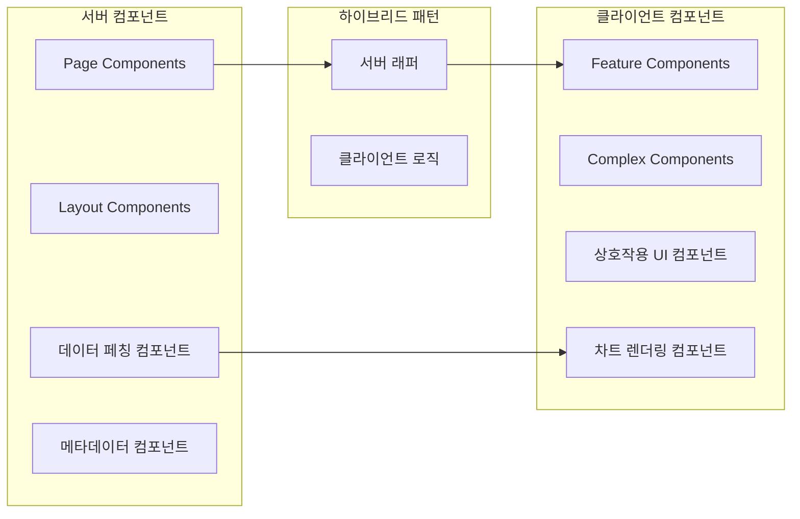

#### 서버 컴포넌트 (RSC)
- **데이터 페칭이 필요한 페이지 컴포넌트**: `app/dashboard/[id]/page.tsx`
- **SEO 관련 메타데이터 컴포넌트**: `app/dashboard/[id]/opengraph-image.tsx`
- **정적 레이아웃 및 UI 요소**: `app/(dashboard)/layout.tsx`
- **렌더링 성능이 중요한 데이터 표시 컴포넌트**: `packages/charts/server/ChartDataLoader.tsx`

#### 클라이언트 컴포넌트 (RCC)
- **인터랙티브한 차트 및 그래프 컴포넌트**: `packages/charts/components/TimeSeriesChart.tsx`
- **사용자 입력 및 이벤트 처리가 필요한 컴포넌트**: `packages/dashboard/editor/DashboardEditor.tsx`
- **드래그 앤 드롭 및 애니메이션 관련 컴포넌트**: `packages/dashboard/components/DashboardGrid.tsx`
- **상태를 직접 관리하는 컴포넌트**: `packages/ui/components/DataSourcePanel.tsx`

### 2.3 컴포넌트 명명 및 파일 구조 규칙

```
apps/web/
├── app/                          # Next.js App Router
│   ├── (auth)/                   # 인증 관련 라우트 그룹
│   │   ├── login/                
│   │   │   └── page.tsx          # 로그인 페이지 (서버 컴포넌트)
│   │   └── layout.tsx            # 인증 레이아웃 (서버 컴포넌트)
│   │
│   ├── (dashboard)/              # 대시보드 관련 라우트 그룹
│   │   ├── dashboard/            
│   │   │   ├── [id]/              
│   │   │   │   ├── page.tsx      # 대시보드 상세 페이지 (서버 컴포넌트)
│   │   │   │   └── edit/         
│   │   │   │       └── page.tsx  # 대시보드 편집 페이지 (서버 컴포넌트)
│   │   │   └── page.tsx          # 대시보드 목록 페이지 (서버 컴포넌트)
│   │   └── layout.tsx            # 대시보드 레이아웃 (서버 컴포넌트)
│   │
│   └── (chart)/                  # 차트 관련 라우트 그룹
│       ├── chart-editor/[id]/    
│       │   └── page.tsx          # 차트 에디터 페이지 (서버 컴포넌트)
│       └── layout.tsx            # 차트 레이아웃 (서버 컴포넌트)

packages/
├── ui/                           # UI 기본 컴포넌트
│   ├── components/               # 클라이언트 컴포넌트
│   │   ├── ui/                   # Shadcn/UI 기반 컴포넌트
│   │   └── custom/               # 커스텀 컴포넌트
│   │
│   └── server-wrappers/          # 서버 컴포넌트 래퍼
│       └── button.server.tsx     # 서버 컴포넌트에서 Button 사용
│
├── charts/                       # 차트 관련 컴포넌트
│   ├── components/               # 클라이언트 컴포넌트
│   │   ├── ChartRenderer.tsx     # 차트 렌더링 컴포넌트
│   │   └── chart-types/          # 차트 유형별 컴포넌트
│   │
│   ├── server/                   # 서버 컴포넌트
│   │   └── ChartServerWrapper.tsx # 차트 서버 래퍼
│   │
│   └── editor/                   # 차트 에디터 컴포넌트
│       └── ChartEditor.tsx       # 차트 에디터
│
└── dashboard/                    # 대시보드 관련 컴포넌트
    ├── components/               # 클라이언트 컴포넌트
    │   ├── DashboardGrid.tsx     # 대시보드 그리드
    │   └── widgets/              # 위젯 컴포넌트
    │
    ├── server/                   # 서버 컴포넌트
    │   └── DashboardServerWrapper.tsx # 대시보드 서버 래퍼
    │
    └── editor/                   # 대시보드 에디터 컴포넌트
        └── DashboardEditor.tsx   # 대시보드 에디터
```

### 2.3 아키텍처 관점과 컴포넌트 계층 통합

본 문서에서 정의하는 UI 컴포넌트 계층 구조(Page → Layout → Feature → Complex → Base → Atoms)와 
`frontend/architecture.md`에서 설명하는 아키텍처 계층 구조(프레젠테이션 → 애플리케이션 → 도메인 → 데이터)는 
서로 다른 관점에서 동일한 시스템을 설명합니다.

다음 매트릭스는 두 관점의 매핑을 보여줍니다:

| UI 컴포넌트 계층 | 주요 책임 | 아키텍처 계층 매핑 |
|----------------|----------|-----------------|
| **Page Components** | 라우트에 직접 매핑, 데이터 페칭 조율 | 프레젠테이션 계층(UI) + 데이터 계층(API) |
| **Layout Components** | 일관된 페이지 구조 제공 | 프레젠테이션 계층(Layout) |
| **Feature Components** | 비즈니스 기능 캡슐화 | 프레젠테이션 계층(UI) + 애플리케이션 계층(상태 사용) |
| **Complex Components** | 재사용 가능한 복합 UI | 프레젠테이션 계층(UI) |
| **Base Components** | 기본 UI 빌딩 블록 | 프레젠테이션 계층(UI) |
| **Atoms** | 디자인 시스템의 기본 요소 | 프레젠테이션 계층(UI) |

이 매핑을 통해 각 컴포넌트가 UI 구조와 데이터 흐름 모두에서 어떤 위치와 책임을 가지는지 이해할 수 있습니다.

#### 예시: 컴포넌트의 두 관점 매핑

```tsx
// DashboardPage: Page Component(UI 계층) + 프레젠테이션/데이터 계층(아키텍처 관점)
// apps/web/app/(dashboard)/dashboard/[id]/page.tsx
export default async function DashboardPage({ params }) {
  // 데이터 계층 접근 (서버 컴포넌트 데이터 페칭)
  const dashboard = await fetchDashboard(params.id);
  
  return (
    <DashboardLayout>
      <DashboardHeader title={dashboard.title} />
      <DashboardGrid layout={dashboard.layout} widgets={dashboard.widgets} />
    </DashboardLayout>
  );
}

// ChartRenderer: Complex Component(UI 계층) + 프레젠테이션 계층(아키텍처 관점)
// packages/charts/src/components/ChartRenderer.tsx
export function ChartRenderer({ chartType, data, config }) {
  // 차트 유형에 따른 렌더링 로직
  return (
    <div className="chart-container">
      {renderChart(chartType, data, config)}
    </div>
  );
}
```

## 3. 차트 컴포넌트 설계

차트 표시 및 편집 관련 컴포넌트는 E-Torch의 핵심 기능으로, 서버 컴포넌트와 클라이언트 컴포넌트의 조합으로 구현됩니다. 아래는 차트 컴포넌트의 전체 계층 구조를 명확히 보여줍니다:

### 3.1 차트 컴포넌트 전체 계층

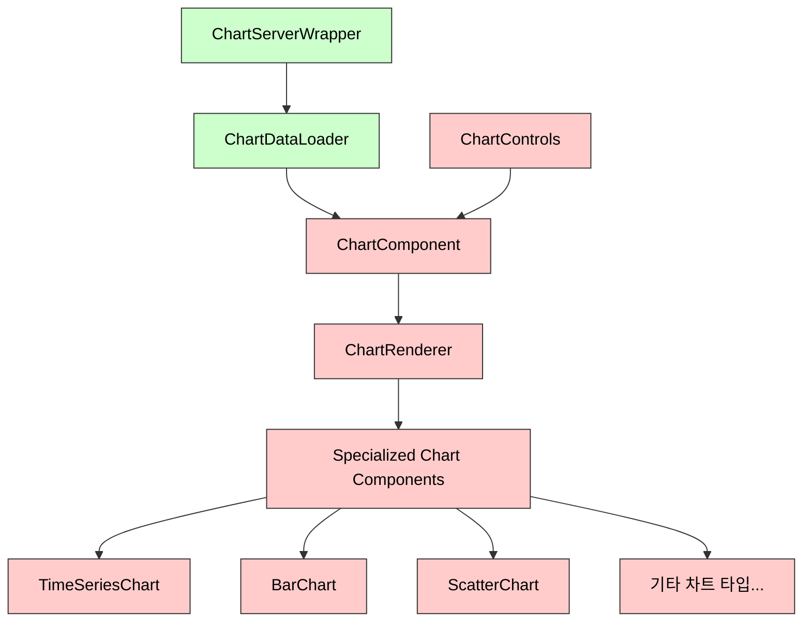

#### 컴포넌트별 책임 정의

| 컴포넌트 | 유형 | 책임 |
|---------|------|-----|
| **ChartServerWrapper** | 서버 | 서버 측 데이터 페칭, 초기 데이터 준비, 메타데이터 로드 |
| **ChartDataLoader** | 서버 | 차트별 데이터 로드 최적화, 데이터 변환 |
| **ChartComponent** | 클라이언트 | 차트 렌더링 상태 관리, 이벤트 핸들링, 서버 데이터 hydration |
| **ChartRenderer** | 클라이언트 | 차트 타입에 따른 렌더링 로직 분기, 공통 렌더링 프로퍼티 관리 |
| **Specialized Charts** | 클라이언트 | 특정 차트 유형(시계열, 바 차트 등)별 렌더링 로직 |
| **ChartControls** | 클라이언트 | 차트 인터랙션 컨트롤(확대/축소, 다운로드 등) |

### 3.2 차트 에디터 컴포넌트

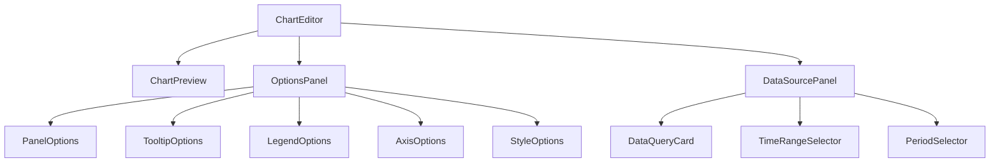

#### 주요 컴포넌트 책임

- **ChartEditor**: 에디터 전체 레이아웃 및 상태 관리
- **ChartPreview**: 현재 설정으로 차트 미리보기 제공
- **OptionsPanel**: 차트 시각적 옵션 편집 UI
- **DataSourcePanel**: 데이터 소스 및 쿼리 설정 UI
- **DataQueryCard**: 개별 데이터 쿼리 설정 UI

### 3.3 차트 옵션 컴포넌트와 차트 기능 명세 매핑

차트 옵션 컴포넌트는 `ui-design/chart-feature-specs.md`에 정의된 차트 기능 명세와 명확하게 매핑됩니다:

| 옵션 컴포넌트 | 기능 명세 ID | 구현 경로 | 책임 |
|-------------|-------------|-----------|------|
| **PanelOptions** | PO-001~003 | `packages/charts/editor/property-editors/PanelOptions.tsx` | 제목, 설명, 배경 투명도 설정 |
| **TooltipOptions** | TO-001~005 | `packages/charts/editor/property-editors/TooltipOptions.tsx` | 툴팁 표시 방식, 커서 스타일 설정 |
| **LegendOptions** | LG-001~004 | `packages/charts/editor/property-editors/LegendOptions.tsx` | 범례 표시 여부, 위치, 스타일 설정 |
| **AxisOptions** | XA-001~010, YA-001~011, YAS-001~011 | `packages/charts/editor/property-editors/AxisOptions.tsx` | 축 범위, 눈금, 레이블 설정 |
| **StyleOptions** | GS-001~003, SC-001~006, RC-001~006, RB-001~010 | `packages/charts/editor/property-editors/StyleOptions.tsx` | 차트 유형별 스타일 설정 |

#### 구현 패턴 예시 (TooltipOptions):

```tsx
// packages/charts/editor/property-editors/TooltipOptions.tsx
'use client';

import { useChartEditorStore } from '@/packages/state';
import { 
  Select, 
  Slider, 
  Input, 
  Switch 
} from '@/packages/ui/components';

export function TooltipOptions({ chartId }: { chartId: string }) {
  const { 
    getChartConfig, 
    updateChartProperty 
  } = useChartEditorStore();
  
  const config = getChartConfig(chartId);
  const tooltipOptions = config?.options?.tooltip || {};
  
  const handleModeChange = (value: string) => {
    updateChartProperty(chartId, 'options.tooltip.mode', value);
  };
  
  // TO-001: Tooltip Mode
  // TO-002: Max Width
  // TO-003: Cursor Style
  // TO-004: Dash Pattern
  // TO-005: Cursor Width
  
  return (
    <div className="space-y-4">
      <div>
        <label className="text-sm font-medium">Tooltip Mode</label>
        <Select
          value={tooltipOptions.mode || 'default'}
          onValueChange={handleModeChange}
          options={[
            { value: 'default', label: 'Default' },
            { value: 'active', label: 'Active' },
            { value: 'hidden', label: 'Hidden' }
          ]}
        />
      </div>
      
      {/* 나머지 TO-002~005 옵션 구현 */}
    </div>
  );
}
```

### 3.4 옵션 컴포넌트 실제 구현

차트 에디터의 옵션 컴포넌트는 복잡한 차트 설정을 사용자 친화적으로 편집할 수 있도록 설계되어 있습니다. 이 섹션에서는 UI 요구사항 명세(PO-001~RB-010)를 기반으로 한 실제 구현 전략을 다룹니다.

#### 옵션 컴포넌트 아키텍처

```typescript
// 옵션 컴포넌트의 구조
import { useForm } from 'react-hook-form';
import { zodResolver } from '@hookform/resolvers/zod';
import * as z from 'zod';
import { Form, FormField, FormItem, FormLabel, FormControl, FormMessage } from '@/packages/ui/components/ui/form';
import { Input, Select, Checkbox, ColorPicker, Slider } from '@/packages/ui/components/ui/form-controls';

// 패널 옵션 스키마 (PO-001~003)
const panelOptionsSchema = z.object({
  title: z.string().max(100, '제목은 최대 100자까지 입력 가능합니다.'),
  description: z.string().max(200, '설명은 최대 200자까지 입력 가능합니다.'),
  transparent: z.boolean().default(false)
});

// 폼 컴포넌트
function PanelOptionsForm({ 
  initialValues, 
  onSubmit 
}: { 
  initialValues: z.infer<typeof panelOptionsSchema>, 
  onSubmit: (values: z.infer<typeof panelOptionsSchema>) => void 
}) {
  // React Hook Form 설정
  const form = useForm<z.infer<typeof panelOptionsSchema>>({
    resolver: zodResolver(panelOptionsSchema),
    defaultValues: initialValues,
    mode: 'onChange' // 입력 변경 시 즉시 유효성 검사
  });
  
  // 폼 제출 핸들러
  const handleSubmit = form.handleSubmit(onSubmit);
  
  // 변경 시 자동 저장
  const handleAutoSave = useCallback(
    debounce((values: z.infer<typeof panelOptionsSchema>) => {
      onSubmit(values);
    }, 500),
    [onSubmit]
  );
  
  // 폼 값 변경 감지 및 자동 저장
  useEffect(() => {
    const subscription = form.watch((values) => {
      handleAutoSave(values as z.infer<typeof panelOptionsSchema>);
    });
    
    return () => subscription.unsubscribe();
  }, [form, handleAutoSave]);
  
  return (
    <Form {...form}>
      <form onSubmit={handleSubmit} className="space-y-4">
        <FormField
          control={form.control}
          name="title"
          render={({ field }) => (
            <FormItem>
              <FormLabel>제목</FormLabel>
              <FormControl>
                <Input {...field} placeholder="차트 제목 입력..." />
              </FormControl>
              <FormMessage />
            </FormItem>
          )}
        />
        
        <FormField
          control={form.control}
          name="description"
          render={({ field }) => (
            <FormItem>
              <FormLabel>설명</FormLabel>
              <FormControl>
                <Input {...field} placeholder="차트에 대한 간략한 설명..." />
              </FormControl>
              <FormMessage />
            </FormItem>
          )}
        />
        
        <FormField
          control={form.control}
          name="transparent"
          render={({ field }) => (
            <FormItem className="flex items-center gap-2">
              <FormControl>
                <Checkbox
                  checked={field.value}
                  onCheckedChange={field.onChange}
                />
              </FormControl>
              <FormLabel>배경 투명</FormLabel>
            </FormItem>
          )}
        />
      </form>
    </Form>
  );
}
```

#### 의존적 옵션 패턴

UI 요구사항 명세에 포함된 의존성 규칙(R-TS-001~005 등)을 구현하기 위한 패턴입니다:

```typescript
// Y축 보조 옵션 의존성 처리 (R-TS-001)
function YAxisOptions({
  options,
  onChange
}: {
  options: YAxisOptions,
  onChange: (options: YAxisOptions) => void
}) {
  // 보조 Y축 표시 여부에 따른 UI 조건부 렌더링
  const showSecondaryOptions = options.secondary?.visibility || false;
  
  // 보조 Y축 표시 상태 변경 핸들러
  const handleSecondaryVisibilityChange = (visible: boolean) => {
    onChange({
      ...options,
      secondary: {
        ...options.secondary,
        visibility: visible
      }
    });
  };
  
  return (
    <div className="space-y-4">
      {/* 기본 Y축 옵션 */}
      <PrimaryYAxisOptions
        options={options.primary}
        onChange={(primaryOptions) => onChange({ ...options, primary: primaryOptions })}
      />
      
      {/* 보조 Y축 활성화 체크박스 */}
      <FormItem className="flex items-center gap-2">
        <Checkbox
          checked={showSecondaryOptions}
          onCheckedChange={handleSecondaryVisibilityChange}
        />
        <Label>보조 Y축 표시</Label>
      </FormItem>
      
      {/* 보조 Y축이 활성화된 경우에만 옵션 표시 */}
      {showSecondaryOptions && (
        <SecondaryYAxisOptions
          options={options.secondary || { visibility: true }}
          onChange={(secondaryOptions) => onChange({ ...options, secondary: secondaryOptions })}
        />
      )}
    </div>
  );
}

// 그래프 스타일 의존성 처리 (R-TS-002, R-TS-003)
function GraphStyleOptions({
  options,
  onChange
}: {
  options: GraphStyleOptions,
  onChange: (options: GraphStyleOptions) => void
}) {
  // 그래프 스타일 변경 핸들러
  const handleStyleChange = (style: 'Line' | 'Area' | 'Bar') => {
    onChange({
      ...options,
      style
    });
  };
  
  return (
    <div className="space-y-4">
      {/* 그래프 스타일 선택 */}
      <FormItem>
        <FormLabel>스타일</FormLabel>
        <Select
          value={options.style}
          onValueChange={handleStyleChange}
        >
          <SelectItem value="Line">Line</SelectItem>
          <SelectItem value="Area">Area</SelectItem>
          <SelectItem value="Bar">Bar</SelectItem>
        </Select>
      </FormItem>
      
      {/* Line 스타일이 선택된 경우에만 선 두께 옵션 표시 (R-TS-002) */}
      {options.style === 'Line' && (
        <FormItem>
          <FormLabel>선 두께</FormLabel>
          <Slider
            value={[options.lineWidth || 1]}
            min={0.5}
            max={10}
            step={0.5}
            onValueChange={([value]) => onChange({ ...options, lineWidth: value })}
          />
        </FormItem>
      )}
      
      {/* Area 스타일이 선택된 경우에만 투명도 옵션 표시 (R-TS-003) */}
      {options.style === 'Area' && (
        <FormItem>
          <FormLabel>채우기 투명도</FormLabel>
          <Slider
            value={[options.fillOpacity || 35]}
            min={0}
            max={100}
            step={5}
            onValueChange={([value]) => onChange({ ...options, fillOpacity: value })}
          />
        </FormItem>
      )}
    </div>
  );
}
```

#### 실시간 미리보기 연동

옵션 변경 시 실시간으로 차트 미리보기를 업데이트하는 메커니즘입니다:

```typescript
// 차트 에디터 컴포넌트
function ChartEditor({ chartId }: { chartId: string }) {
  // 차트 구성 로드
  const { data: chartConfig, isLoading } = useQuery({
    queryKey: ['chartConfig', chartId],
    queryFn: () => fetchChartConfig(chartId)
  });
  
  // 차트 데이터 로드
  const { data: chartData } = useQuery({
    queryKey: ['chartData', chartId, chartConfig?.dataSourceSettings],
    queryFn: () => fetchChartData(chartId, chartConfig?.dataSourceSettings),
    enabled: !!chartConfig
  });
  
  // 옵션 변경 핸들러
  const handleOptionsChange = useCallback(
    debounce((section: string, options: any) => {
      // 차트 옵션 업데이트 뮤테이션
      updateChartConfig({
        chartId,
        path: section,
        options
      });
    }, 500),
    [chartId]
  );
  
  // 로딩 표시
  if (isLoading) {
    return <EditorSkeleton />;
  }
  
  return (
    <EditorLayout>
      {/* 차트 미리보기 영역 */}
      <PreviewPanel>
        <ChartPreview
          config={chartConfig}
          data={chartData}
        />
      </PreviewPanel>
      
      {/* 옵션 패널 */}
      <OptionsPanel>
        <Tabs>
          <TabsList>
            <TabsTrigger value="panel">패널</TabsTrigger>
            <TabsTrigger value="tooltip">툴팁</TabsTrigger>
            <TabsTrigger value="legend">범례</TabsTrigger>
            <TabsTrigger value="axes">축</TabsTrigger>
            <TabsTrigger value="style">스타일</TabsTrigger>
          </TabsList>
          
          <TabsContent value="panel">
            <PanelOptionsForm
              initialValues={chartConfig.panelOptions}
              onSubmit={(options) => handleOptionsChange('panelOptions', options)}
            />
          </TabsContent>
          
          <TabsContent value="tooltip">
            <TooltipOptionsForm
              initialValues={chartConfig.tooltipOptions}
              onSubmit={(options) => handleOptionsChange('tooltipOptions', options)}
            />
          </TabsContent>
          
          {/* 다른 옵션 탭 */}
        </Tabs>
      </OptionsPanel>
      
      {/* 데이터 소스 패널 */}
      <DataSourcePanel
        settings={chartConfig.dataSourceSettings}
        onChange={(settings) => handleOptionsChange('dataSourceSettings', settings)}
      />
    </EditorLayout>
  );
}
```

#### 차트 유형별 옵션 관리

차트 유형에 따라 다른 옵션 세트를 표시하는 패턴입니다:

```typescript
// 차트 유형별 옵션 컴포넌트 선택
function ChartTypeOptions({ 
  chartType, 
  options, 
  onChange 
}: { 
  chartType: ChartType, 
  options: Record<string, any>,
  onChange: (options: Record<string, any>) => void
}) {
  // 차트 유형에 따른 옵션 컴포넌트 선택
  switch (chartType) {
    case 'timeSeries':
      return (
        <TimeSeriesOptions
          options={options}
          onChange={onChange}
        />
      );
    
    case 'bar':
      return (
        <BarChartOptions
          options={options}
          onChange={onChange}
        />
      );
    
    case 'scatter':
      return (
        <ScatterChartOptions
          options={options}
          onChange={onChange}
        />
      );
    
    case 'radar':
      return (
        <RadarChartOptions
          options={options}
          onChange={onChange}
        />
      );
    
    case 'radialBar':
      return (
        <RadialBarChartOptions
          options={options}
          onChange={onChange}
        />
      );
    
    default:
      return <div>Unsupported chart type: {chartType}</div>;
  }
}
```

#### 옵션 의존성 관리

차트 옵션 간의 의존성을 관리하기 위한 패턴입니다:

```typescript
// 옵션 의존성 관리자
function useChartOptionsDependencies(
  chartType: ChartType,
  options: ChartOptions
): ChartOptions {
  // 의존성 규칙 적용 및 옵션 값 조정
  return useMemo(() => {
    let updatedOptions = { ...options };
    
    // 시계열 차트 의존성 규칙
    if (chartType === 'timeSeries') {
      // R-TS-001: 보조 Y축 설정이 비활성화되면 관련 필드 초기화
      if (!updatedOptions.yAxis.secondary?.visibility) {
        updatedOptions.yAxis.secondary = { visibility: false };
      }
      
      // R-TS-002: Line 스타일이 아닌 경우 Line 관련 옵션 비활성화
      if (updatedOptions.graphStyle.style !== 'Line') {
        delete updatedOptions.graphStyle.lineWidth;
      }
      
      // R-TS-003: Area 스타일이 아닌 경우 Area 관련 옵션 비활성화
      if (updatedOptions.graphStyle.style !== 'Area') {
        delete updatedOptions.graphStyle.fillOpacity;
      }
      
      // R-TS-004: 시리즈의 Y축 설정
      updatedOptions.series = updatedOptions.series.map(series => {
        // 보조 Y축이 비활성화되었는데 시리즈가 보조 Y축을 사용하는 경우
        if (!updatedOptions.yAxis.secondary?.visibility && series.yAxisId === 'secondary') {
          return { ...series, yAxisId: 'primary' };
        }
        return series;
      });
    }
    
    // 산점도 차트 의존성 규칙
    if (chartType === 'scatter') {
      // 회귀선 표시 여부에 따른 회귀선 유형 활성화/비활성화
      if (!updatedOptions.scatter.showRegressionLine) {
        delete updatedOptions.scatter.regressionType;
      }
    }
    
    return updatedOptions;
  }, [chartType, options]);
}
```

#### 유효성 검사 전략

Zod를 활용한 차트 옵션 유효성 검사 전략입니다:

```typescript
// 차트 옵션 스키마 정의
import { z } from 'zod';

// 패널 옵션 스키마 (PO-001~003)
const panelOptionsSchema = z.object({
  title: z.string().max(100, '제목은 최대 100자까지 입력 가능합니다.'),
  description: z.string().max(200, '설명은 최대 200자까지 입력 가능합니다.').optional(),
  transparent: z.boolean().default(false)
});

// 툴팁 옵션 스키마 (TO-001~005)
const tooltipOptionsSchema = z.object({
  mode: z.enum(['default', 'active', 'hidden']),
  maxWidth: z.number().min(60).max(500).default(160),
  cursorStyle: z.enum(['solid', 'dash']).default('solid'),
  dashPattern: z.string().optional().refine(val => {
    if (val && !val.match(/^\d+,\d+$/)) {
      return false;
    }
    return true;
  }, { message: "대시 패턴은 '숫자,숫자' 형식이어야 합니다." }),
  cursorWidth: z.number().min(1).max(10).default(2)
});

// X축 옵션 스키마 (XA-001~010)
const xAxisOptionsSchema = z.object({
  visibility: z.boolean().default(true),
  dataKey: z.string().default('date'),
  type: z.enum(['category', 'number']).default('category'),
  minValue: z.union([z.number(), z.literal('auto')]).default(0),
  maxValue: z.union([z.number(), z.literal('auto')]).default('auto'),
  showAxis: z.boolean().default(true),
  tickCount: z.number().min(2).max(20).default(5),
  tickAngle: z.number().min(-90).max(90).default(0),
  showTick: z.boolean().default(true),
  tickSize: z.number().min(0).max(20).default(6)
});

// 전체 차트 옵션 스키마
const chartOptionsSchema = z.object({
  panel: panelOptionsSchema,
  tooltip: tooltipOptionsSchema,
  legend: legendOptionsSchema,
  xAxis: xAxisOptionsSchema,
  yAxis: yAxisOptionsSchema,
  // 차트 유형별 특화 옵션은 조건부로 추가
}).refine(data => {
  // 복합 유효성 검사
  if (data.tooltip.cursorStyle === 'dash' && !data.tooltip.dashPattern) {
    return false;
  }
  return true;
}, {
  message: "대시 스타일을 선택한 경우 대시 패턴을 입력해야 합니다.",
  path: ['tooltip', 'dashPattern']
});

// 차트 유형별 옵션 스키마 확장
function getChartOptionsSchema(chartType: ChartType) {
  let schema = chartOptionsSchema;
  
  // 시계열 차트
  if (chartType === 'timeSeries') {
    schema = schema.extend({
      graphStyle: graphStyleOptionsSchema,
      yAxisSecondary: yAxisSecondaryOptionsSchema.optional()
    });
  }
  
  // 산점도 차트
  if (chartType === 'scatter') {
    schema = schema.extend({
      scatter: scatterOptionsSchema
    });
  }
  
  // 다른 차트 유형별 스키마 확장...
  
  return schema;
}

// 옵션 유효성 검사 함수
function validateChartOptions(chartType: ChartType, options: Record<string, any>) {
  const schema = getChartOptionsSchema(chartType);
  
  try {
    schema.parse(options);
    return { valid: true, errors: null };
  } catch (error) {
    if (error instanceof z.ZodError) {
      return {
        valid: false,
        errors: error.format()
      };
    }
    
    throw error;
  }
}
```

## 4. 대시보드 컴포넌트 설계

대시보드 관련 컴포넌트는 레이아웃 관리와 위젯 상호작용에 초점을 맞추어 설계됩니다.

### 4.1 대시보드 그리드 컴포넌트

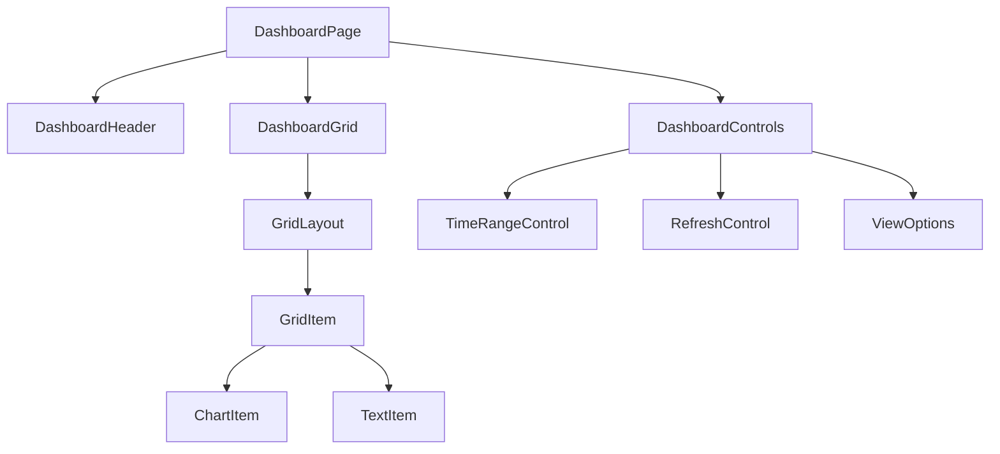

#### 주요 컴포넌트 책임 및 서버/클라이언트 구분

- **DashboardPage** (서버 컴포넌트): 대시보드 페이지 구조 정의 및 초기 데이터 로드
- **DashboardHeader** (서버 컴포넌트): 대시보드 제목, 설명, 메타 정보 표시
- **DashboardGrid** (클라이언트 컴포넌트): react-grid-layout 기반 그리드 시스템 관리
- **GridItem** (클라이언트 컴포넌트): 그리드 내 개별 위젯 아이템 래퍼
- **ChartItem/TextItem** (클라이언트 컴포넌트): 위젯 유형별 특화 컴포넌트

### 4.2 대시보드 편집기 컴포넌트

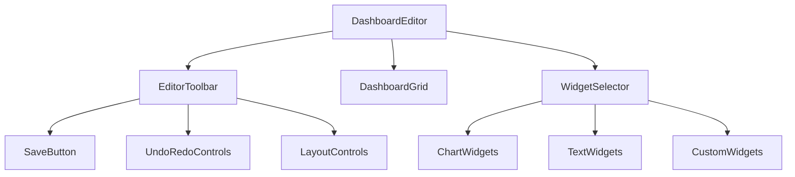

#### 주요 컴포넌트 책임 및 서버/클라이언트 구분

- **DashboardEditor** (클라이언트 컴포넌트): 대시보드 편집 모드 전체 관리
- **EditorToolbar** (클라이언트 컴포넌트): 편집 기능 제공 (저장, 실행 취소/다시 실행, 레이아웃)
- **WidgetSelector** (클라이언트 컴포넌트): 추가 가능한 위젯 목록 제공
- **SaveButton** (클라이언트 컴포넌트): 변경사항 저장 및 성공/실패 상태 표시
- **LayoutControls** (클라이언트 컴포넌트): 그리드 레이아웃 설정 관리 (정렬, 크기 조정 등)

### 4.3 라우팅 구조와 페이지 컴포넌트 연결

대시보드 관련 컴포넌트와 라우팅 구조의 매핑:

| 라우트 | 페이지 컴포넌트 | 레이아웃 | 주요 기능 컴포넌트 |
|--------|----------------|---------|-------------------|
| `/dashboard` | `app/(dashboard)/dashboard/page.tsx` | `app/(dashboard)/layout.tsx` | `DashboardList` |
| `/dashboard/[id]` | `app/(dashboard)/dashboard/[id]/page.tsx` | `app/(dashboard)/layout.tsx` | `DashboardComponent` |
| `/dashboard/[id]/edit` | `app/(dashboard)/dashboard/[id]/edit/page.tsx` | `app/(dashboard)/layout.tsx` | `DashboardEditor` |
| `/explore` | `app/(dashboard)/explore/page.tsx` | `app/(dashboard)/layout.tsx` | `DashboardExplore` |

#### 구현 예시 (대시보드 상세 페이지):

```tsx
// app/(dashboard)/dashboard/[id]/page.tsx
import { DashboardServerWrapper } from '@/packages/dashboard/server';
import { fetchDashboardById } from '@/packages/server-api/dashboard';
import { notFound } from 'next/navigation';

interface DashboardPageProps {
  params: { id: string };
}

export default async function DashboardPage({ params }: DashboardPageProps) {
  // 서버에서 대시보드 데이터 페칭
  const dashboard = await fetchDashboardById(params.id);
  
  if (!dashboard) {
    return notFound();
  }
  
  // 서버 래퍼 컴포넌트로 초기 데이터 전달
  return <DashboardServerWrapper dashboardId={params.id} initialData={dashboard} />;
}

// 메타데이터 생성
export async function generateMetadata({ params }: DashboardPageProps) {
  const dashboard = await fetchDashboardById(params.id);
  
  if (!dashboard) {
    return {
      title: '대시보드 - E-Torch',
    };
  }
  
  return {
    title: `${dashboard.title} - E-Torch`,
    description: dashboard.description || '경제지표 대시보드',
  };
}
```

## 5. 데이터 소스 컴포넌트 설계

데이터 소스 관련 컴포넌트는 데이터 선택, 변환, 쿼리 구성에 초점을 맞추어 설계됩니다.

### 5.1 데이터 쿼리 컴포넌트

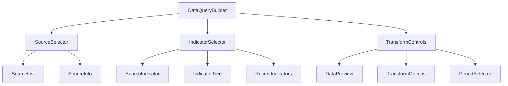

#### 주요 컴포넌트 책임

- **DataQueryBuilder**: 데이터 쿼리 구성 전체 관리
- **SourceSelector**: 데이터 출처 선택 UI (KOSIS, ECOS, OECD)
- **IndicatorSelector**: 지표 검색 및 선택 UI
- **TransformControls**: 데이터 변환 옵션 설정
- **DataPreview**: 선택한 데이터의 미리보기 표시

### 5.2 상태 관리 및 데이터 흐름 통합

데이터 소스 컴포넌트는 다음과 같이 상태 관리 및 데이터 흐름과 통합됩니다:

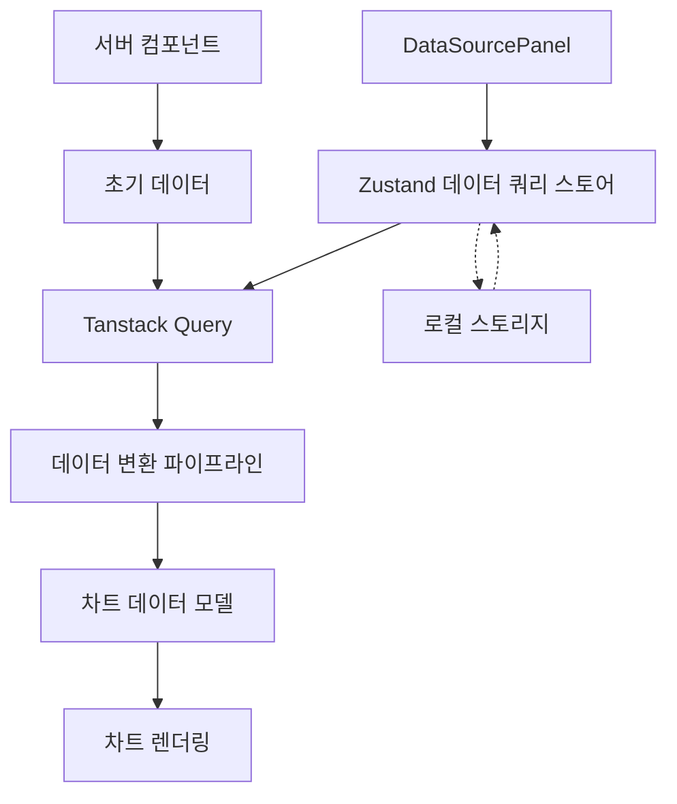

#### DataQueryBuilder와 상태 관리 통합 예시:

```tsx
// packages/charts/components/DataQueryBuilder.tsx
'use client';

import { useQueryBuilderStore } from '@/packages/state';
import { useChartData } from '@/packages/data-sources/hooks';
import { SourceSelector, IndicatorSelector, TransformControls } from '@/packages/ui/components';

export function DataQueryBuilder({ chartId }: { chartId: string }) {
  const { 
    queryConfig, 
    updateSourceSelection,
    updateIndicatorSelection,
    updateTransformOptions
  } = useQueryBuilderStore(state => ({
    queryConfig: state.queries[chartId],
    updateSourceSelection: state.updateSourceSelection,
    updateIndicatorSelection: state.updateIndicatorSelection,
    updateTransformOptions: state.updateTransformOptions
  }));
  
  // Tanstack Query를 통한 데이터 페칭
  const { data, isLoading, error } = useChartData(queryConfig);
  
  // 컴포넌트 렌더링 및 이벤트 핸들러
  return (
    <div className="space-y-4">
      <SourceSelector 
        value={queryConfig?.source}
        onChange={source => updateSourceSelection(chartId, source)}
      />
      
      <IndicatorSelector
        source={queryConfig?.source}
        value={queryConfig?.indicator}
        onChange={indicator => updateIndicatorSelection(chartId, indicator)}
      />
      
      <TransformControls
        options={queryConfig?.transform}
        onChange={options => updateTransformOptions(chartId, options)}
        preview={data}
      />
    </div>
  );
}
```

## 6. 인증 및 사용자 컴포넌트 설계

인증 및 사용자 관련 컴포넌트는 SNS 로그인 및 프로필 관리에 초점을 맞추어 설계됩니다.

### 6.1 인증 컴포넌트

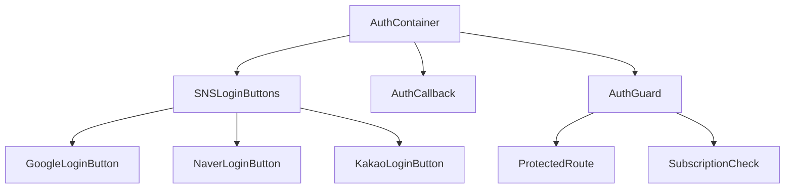

#### 주요 컴포넌트 책임

- **AuthContainer** (서버 컴포넌트): 인증 관련 레이아웃 및 상태 관리
- **SNSLoginButtons** (클라이언트 컴포넌트): SNS 로그인 버튼 컨테이너
- **AuthCallback** (서버 컴포넌트): 인증 콜백 처리 컴포넌트
- **AuthGuard** (클라이언트 컴포넌트): 인증 상태 기반 접근 제어 컴포넌트
- **SubscriptionCheck** (클라이언트 컴포넌트): 구독 상태 확인 및 접근 제어

### 6.2 사용자 프로필 컴포넌트

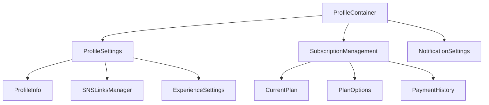

#### 주요 컴포넌트 책임

- **ProfileContainer** (서버 컴포넌트): 프로필 관련 레이아웃 및 상태 관리
- **ProfileSettings** (클라이언트 컴포넌트): 사용자 프로필 설정 UI
- **SubscriptionManagement** (클라이언트 컴포넌트): 구독 관리 UI
- **NotificationSettings** (클라이언트 컴포넌트): 알림 설정 UI
- **SNSLinksManager** (클라이언트 컴포넌트): SNS 계정 연결 관리 UI

## 7. UI/UX 공통 컴포넌트 설계

UI/UX 공통 컴포넌트는 애플리케이션 전반에서 사용되는 재사용 가능한 컴포넌트입니다.

### 7.1 네비게이션 컴포넌트

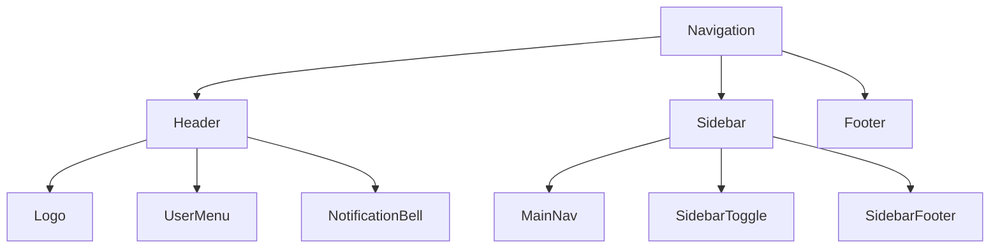

#### 주요 컴포넌트 책임

- **Header** (서버 컴포넌트): 상단 헤더 바 컴포넌트
- **Sidebar** (서버 컴포넌트): 측면 내비게이션 바 컴포넌트
- **UserMenu** (클라이언트 컴포넌트): 사용자 메뉴 드롭다운 컴포넌트
- **MainNav** (서버 컴포넌트): 주요 내비게이션 링크 컴포넌트
- **SidebarToggle** (클라이언트 컴포넌트): 사이드바 토글 버튼 컴포넌트

### 7.2 피드백 컴포넌트

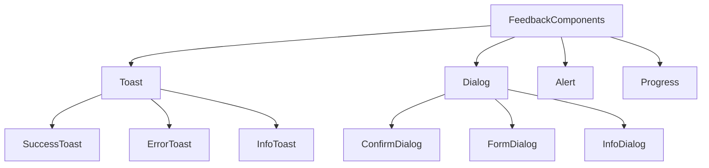

#### 주요 컴포넌트 책임

- **Toast** (클라이언트 컴포넌트): 토스트 알림 컴포넌트
- **Dialog** (클라이언트 컴포넌트): 다이얼로그/모달 컴포넌트
- **Alert** (클라이언트 컴포넌트): 경고 및 알림 컴포넌트
- **Progress** (클라이언트 컴포넌트): 진행 상태 표시 컴포넌트
- **ConfirmDialog** (클라이언트 컴포넌트): 확인 다이얼로그 컴포넌트

### 7.3 폼 컴포넌트

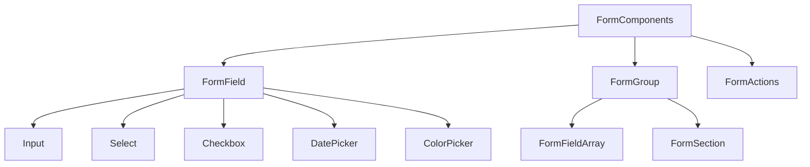

#### 주요 컴포넌트 책임

- **FormField** (클라이언트 컴포넌트): 개별 폼 필드 래퍼 컴포넌트
- **FormGroup** (클라이언트 컴포넌트): 관련 폼 필드 그룹 컴포넌트
- **FormActions** (클라이언트 컴포넌트): 폼 액션 버튼 컨테이너 컴포넌트
- **ColorPicker** (클라이언트 컴포넌트): 색상 선택 컴포넌트
- **FormFieldArray** (클라이언트 컴포넌트): 동적 필드 배열 컴포넌트

## 8. 접근성 및 국제화 지원

## 8.1 접근성 컴포넌트

E-Torch는 WCAG 2.1 AA 수준 준수를 목표로 하며, 다음과 같은 접근성 고려사항을 컴포넌트 설계에 포함합니다:

### 8.1.1 키보드 내비게이션 컴포넌트

```tsx
// 키보드 사용자를 위한 메인 콘텐츠 바로가기 링크
function SkipLink({ targetId }: { targetId: string }) {
  return (
    <a 
      href={`#${targetId}`} 
      className="sr-only focus:not-sr-only focus:absolute focus:top-0 focus:left-0 focus:z-50 focus:p-4 focus:bg-white focus:text-primary"
    >
      콘텐츠로 건너뛰기
    </a>
  );
}

// 모달 및 다이얼로그에서 포커스를 가두는 컴포넌트
function FocusTrap({ children }: { children: React.ReactNode }) {
  // 첫 번째/마지막 포커스 가능 요소 참조
  const ref = useRef<HTMLDivElement>(null);
  
  // 키보드 탐색 제어 로직
  useEffect(() => {
    const trapFocus = (e: KeyboardEvent) => {
      // 포커스 트랩 구현 로직
    };
    
    document.addEventListener('keydown', trapFocus);
    return () => document.removeEventListener('keydown', trapFocus);
  }, []);
  
  return <div ref={ref}>{children}</div>;
}

// 키보드 내비게이션 지원 유틸리티
function KeyboardNavigation({ 
  items, 
  onItemSelect,
  orientation = 'vertical' 
}: KeyboardNavigationProps) {
  // 키보드 내비게이션 처리 로직
  // 수직/수평 방향키 처리, Home/End 키 처리 등
}
```

### 8.1.2 스크린 리더 지원

```tsx
// 시각적으로 숨겨지지만 스크린 리더에서 읽히는 텍스트
function ScreenReaderOnly({ children }: { children: React.ReactNode }) {
  return <span className="sr-only">{children}</span>;
}

// 차트를 위한 접근성 테이블 컴포넌트
function AccessibleChartTable({ 
  data, 
  columns, 
  summary 
}: AccessibleChartTableProps) {
  return (
    <div className="sr-only">
      <table>
        <caption>{summary}</caption>
        <thead>
          <tr>
            {columns.map(column => (
              <th key={column.key} scope="col">{column.label}</th>
            ))}
          </tr>
        </thead>
        <tbody>
          {data.map((row, i) => (
            <tr key={i}>
              {columns.map(column => (
                <td key={column.key}>{row[column.key]}</td>
              ))}
            </tr>
          ))}
        </tbody>
      </table>
    </div>
  );
}

// ARIA 라이브 영역 컴포넌트
function LiveRegion({ 
  children, 
  polite = true 
}: LiveRegionProps) {
  return (
    <div 
      aria-live={polite ? "polite" : "assertive"} 
      aria-atomic="true"
    >
      {children}
    </div>
  );
}
```

### 8.1.3 색상 및 대비 컴포넌트

```tsx
// 색상에 의존하지 않는 상태 표시 컴포넌트
function StatusIndicator({ 
  status, 
  label 
}: StatusIndicatorProps) {
  // 색상과 함께 아이콘, 텍스트 패턴으로 상태 표시
  return (
    <div className={`status-indicator status-${status}`}>
      <span className="status-icon" aria-hidden="true" />
      <span>{label}</span>
    </div>
  );
}

// 높은 대비 모드 지원 테마 토글
function HighContrastToggle({ 
  enabled, 
  onChange 
}: HighContrastToggleProps) {
  return (
    <button 
      onClick={() => onChange(!enabled)}
      aria-pressed={enabled}
    >
      <span className="sr-only">
        {enabled ? '일반 대비 모드로 전환' : '높은 대비 모드로 전환'}
      </span>
      <span aria-hidden="true">
        {enabled ? 'A' : 'A'}
      </span>
    </button>
  );
}

// 접근성 차트 패턴 컴포넌트
function AccessibleChartPatterns() {
  // SVG 패턴 정의 - 색맹 사용자를 위한 차트 패턴
  return (
    <svg width="0" height="0" style={{ position: 'absolute' }}>
      <defs>
        <pattern id="pattern-stripe" patternUnits="userSpaceOnUse" width="4" height="4" patternTransform="rotate(45)">
          <rect width="2" height="4" transform="translate(0,0)" fill="white"></rect>
        </pattern>
        <pattern id="pattern-dot" patternUnits="userSpaceOnUse" width="4" height="4">
          <rect width="1" height="1" transform="translate(0,0)" fill="white"></rect>
        </pattern>
        {/* 추가 패턴 */}
      </defs>
    </svg>
  );
}
```

### 8.1.4 반응형 접근성 컴포넌트

```tsx
// 터치 타겟 최적화 컴포넌트
function TouchTarget({ 
  children, 
  as: Component = 'button',
  ...props 
}: TouchTargetProps) {
  return (
    <Component 
      className="min-h-[44px] min-w-[44px] flex items-center justify-center" 
      {...props}
    >
      {children}
    </Component>
  );
}

// 반응형 접근성 컨텍스트 제공자
function AccessibilityProvider({ children }: { children: React.ReactNode }) {
  // 화면 크기, 입력 방식(터치, 마우스, 키보드), 사용자 선호 설정 등 감지
  const [inputMethod, setInputMethod] = useState<'touch' | 'pointer' | 'keyboard'>('pointer');
  const [reducedMotion, setReducedMotion] = useState(false);
  
  // 사용자 입력 방식 감지 로직
  useEffect(() => {
    // 구현 로직
  }, []);
  
  // prefers-reduced-motion 감지
  useEffect(() => {
    // 구현 로직
  }, []);
  
  return (
    <AccessibilityContext.Provider value={{ inputMethod, reducedMotion }}>
      {children}
    </AccessibilityContext.Provider>
  );
}
```

이 컴포넌트들은 `product-spec.md`의 5.3 섹션에서 정의된 접근성 설계 원칙을 구현하며, 모든 E-Torch 컴포넌트에 통합되어 일관된 접근성 경험을 제공합니다.

### 8.2 국제화 지원 컴포넌트

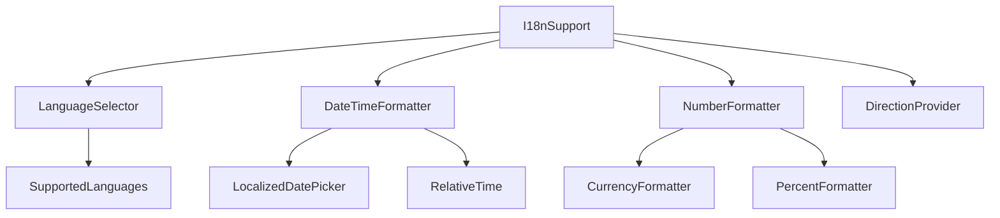

#### 주요 컴포넌트 책임

- **LanguageSelector** (클라이언트 컴포넌트): 언어 선택 UI 제공
- **DateTimeFormatter** (클라이언트 컴포넌트): 지역화된 날짜/시간 포맷팅 컴포넌트
- **NumberFormatter** (클라이언트 컴포넌트): 지역화된 숫자 포맷팅 컴포넌트
- **DirectionProvider** (클라이언트 컴포넌트): RTL/LTR 방향 설정 제공자

## 9. 컴포넌트 성능 최적화

컴포넌트 성능을 최적화하기 위해 다음과 같은 기법을 적용합니다:

### 9.1 렌더링 최적화 컴포넌트

- **MemoizedComponent**: React.memo를 활용한 메모이제이션 래퍼
- **DeferredComponent**: 우선순위가 낮은 컴포넌트 렌더링 지연
- **VirtualizedList**: 가상화된 목록 컴포넌트 (긴 목록 성능 최적화)
- **LazyLoadImage**: 이미지 지연 로딩 컴포넌트

### 9.2 데이터 로딩 최적화 컴포넌트

- **QueryBoundary**: Tanstack Query 에러 및 로딩 상태 처리
- **SuspenseBoundary**: React Suspense 경계 컴포넌트
- **ErrorBoundary**: 컴포넌트 에러 처리 경계
- **DataSplitting**: 데이터 분할 로딩 컴포넌트

## 10. 서버/클라이언트 통합 패턴 예시

다음은 실제 구현에서 서버 컴포넌트와 클라이언트 컴포넌트를 효과적으로 통합하는 패턴의 예시입니다:

### 10.1 서버 컴포넌트에서 데이터 페칭 후 클라이언트 컴포넌트로 전달

```tsx
// packages/charts/server/ChartServerWrapper.tsx (서버 컴포넌트)
import { ChartComponent } from '../components/ChartComponent';
import { fetchChartData } from '@/packages/data-sources/server';

export async function ChartServerWrapper({ chartId, config }: { chartId: string, config: ChartConfig }) {
  // 서버에서 데이터 페칭
  const initialData = await fetchChartData(config);
  
  // 클라이언트 컴포넌트로 초기 데이터 전달
  return (
    <ChartComponent
      chartId={chartId}
      config={config}
      initialData={initialData}
    />
  );
}

// packages/charts/components/ChartComponent.tsx (클라이언트 컴포넌트)
'use client';

import { useChartData } from '@/packages/data-sources/hooks';
import { ChartRenderer } from './ChartRenderer';

export function ChartComponent({ 
  chartId, 
  config, 
  initialData 
}: { 
  chartId: string; 
  config: ChartConfig; 
  initialData?: ChartData;
}) {
  // 클라이언트에서 데이터 관리 (초기 데이터로 시작)
  const { data, isLoading, error, refetch } = useChartData(config, {
    initialData
  });
  
  // 렌더링 로직
  return (
    <div>
      {isLoading && !initialData ? (
        <LoadingSpinner />
      ) : error ? (
        <ErrorDisplay error={error} onRetry={refetch} />
      ) : (
        <ChartRenderer
          chartId={chartId}
          config={config}
          data={data}
        />
      )}
    </div>
  );
}
```

### 10.2 서버 액션과 클라이언트 컴포넌트 통합

```tsx
// app/actions/dashboard.ts (서버 액션)
'use server';

import { revalidatePath } from 'next/cache';
import { saveDashboard } from '@/packages/server-api/dashboard';

export async function saveDashboardAction(
  dashboardId: string,
  dashboardData: any
) {
  try {
    const result = await saveDashboard(dashboardId, dashboardData);
    revalidatePath(`/dashboard/${dashboardId}`);
    return { success: true, data: result };
  } catch (error) {
    return { 
      success: false, 
      error: error instanceof Error ? error.message : '저장 중 오류가 발생했습니다.'
    };
  }
}

// packages/dashboard/editor/SaveButton.tsx (클라이언트 컴포넌트)
'use client';

import { useTransition } from 'react';
import { Button } from '@/packages/ui/components';
import { useDashboardStore } from '@/packages/state';
import { saveDashboardAction } from '@/app/actions/dashboard';
import { useToast } from '@/packages/ui/hooks';

export function SaveButton({ dashboardId }: { dashboardId: string }) {
  const [isPending, startTransition] = useTransition();
  const { dashboard } = useDashboardStore();
  const { toast } = useToast();
  
  const handleSave = () => {
    startTransition(async () => {
      const result = await saveDashboardAction(dashboardId, dashboard);
      
      if (result.success) {
        toast({
          title: '저장 완료',
          description: '대시보드가 성공적으로 저장되었습니다.',
          variant: 'success'
        });
      } else {
        toast({
          title: '저장 실패',
          description: result.error,
          variant: 'destructive'
        });
      }
    });
  };
  
  return (
    <Button 
      onClick={handleSave}
      disabled={isPending}
    >
      {isPending ? '저장 중...' : '저장'}
    </Button>
  );
}
```

## 11. 결론

E-Torch의 핵심 컴포넌트 설계는 모듈성, 재사용성, 확장성 원칙을 기반으로 구성되었습니다. 차트 렌더링, 대시보드 관리, 데이터 소스 관리 등 주요 기능별로 특화된 컴포넌트 구조를 갖추고 있으며, Next.js의 서버/클라이언트 컴포넌트 아키텍처를 효과적으로 활용합니다.

특히 다음과 같은 점을 중점적으로 설계했습니다:

1. **명확한 컴포넌트 계층 구조와 패키지 매핑**을 통해 코드 구조 이해도 향상
2. **서버/클라이언트 컴포넌트 분리 전략**을 통한 성능 최적화
3. **차트와 대시보드 컴포넌트의 확장 가능한 설계**로 새로운 기능 추가 용이성 확보
4. **상태 관리 및 데이터 흐름과의 통합** 강화
5. **라우팅 구조와 페이지 컴포넌트 간 연결** 명확화

이 설계를 통해 E-Torch는 다양한 경제 데이터를 효과적으로 시각화하고 분석할 수 있는 직관적이고 강력한 사용자 경험을 제공할 수 있습니다. 또한, 컴포넌트의 명확한 책임 분리와 계층화된 구조를 통해 향후 기능 확장이나 변경에 유연하게 대응할 수 있는 기반을 마련했습니다.
