# E-Torch 핵심 컴포넌트 설계

## 1. 개요

E-Torch 프로젝트의 핵심 컴포넌트 설계는 모듈성, 재사용성, 확장성을 중심으로 구축됩니다. 본 문서는 E-Torch의 주요 기능 구현에 필요한 핵심 컴포넌트들의 구조, 상호작용, 책임 범위를 정의합니다.

## 2. 컴포넌트 계층 구조

E-Torch의 컴포넌트 계층 구조는 역할과 책임에 따라 다음과 같이 구성됩니다:

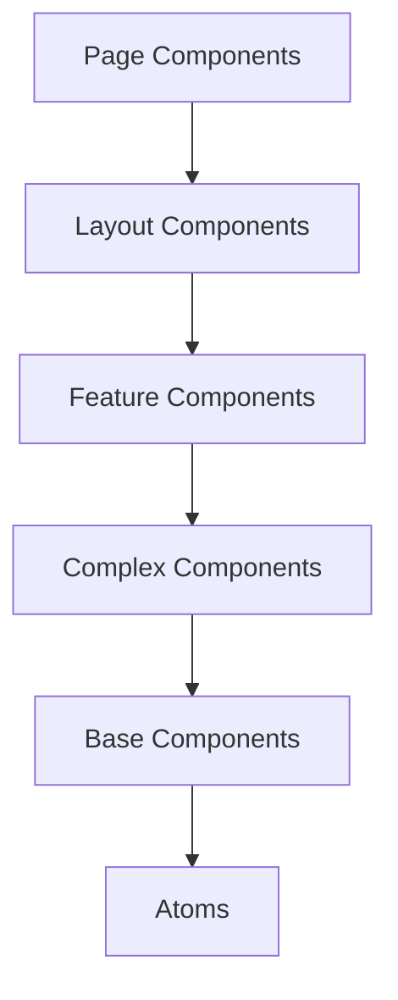

### 2.1 계층별 정의

1. **Page Components**: 라우트에 연결되는 페이지 단위 컴포넌트
2. **Layout Components**: 공통 레이아웃 구조를 제공하는 컴포넌트
3. **Feature Components**: 특정 기능을 담당하는 컴포넌트 (차트 에디터, 대시보드 등)
4. **Complex Components**: 여러 기본 컴포넌트로 구성된 복합 UI 요소
5. **Base Components**: Shadcn/UI 기반 기본 컴포넌트 
6. **Atoms**: 가장 기본적인 UI 요소 (버튼, 입력 필드 등)

### 2.2 서버 컴포넌트 vs 클라이언트 컴포넌트

Next.js의 서버/클라이언트 컴포넌트 구분에 따라 각 컴포넌트는 다음과 같이 분류됩니다:

#### 서버 컴포넌트 (RSC)
- 데이터 페칭이 필요한 페이지 컴포넌트
- SEO 관련 메타데이터 컴포넌트
- 정적 레이아웃 및 UI 요소
- 렌더링 성능이 중요한 데이터 표시 컴포넌트

#### 클라이언트 컴포넌트 (RCC)
- 인터랙티브한 차트 및 그래프 컴포넌트
- 사용자 입력 및 이벤트 처리가 필요한 컴포넌트
- 드래그 앤 드롭 및 애니메이션 관련 컴포넌트
- 상태를 직접 관리하는 컴포넌트

## 3. 차트 컴포넌트 설계

차트 표시 및 편집 관련 컴포넌트는 E-Torch의 핵심 기능으로, 다음과 같은 구조로 설계됩니다.

### 3.1 차트 렌더러 컴포넌트

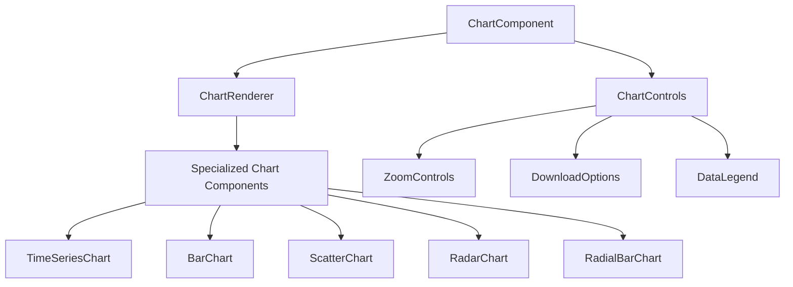

#### 주요 컴포넌트 책임
- **ChartComponent**: 최상위 래퍼 컴포넌트, props 검증 및 기본값 제공
- **ChartRenderer**: 차트 유형에 따라 적절한 렌더러 선택
- **Specialized Chart Components**: 각 차트 유형별 구현 (Recharts 활용)
- **ChartControls**: 차트와 상호작용하는 기본 제어 도구 제공

### 3.2 차트 에디터 컴포넌트

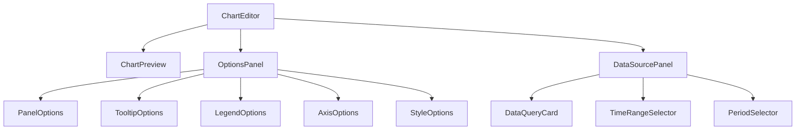

#### 주요 컴포넌트 책임
- **ChartEditor**: 에디터 전체 레이아웃 및 상태 관리
- **ChartPreview**: 현재 설정으로 차트 미리보기 제공
- **OptionsPanel**: 차트 시각적 옵션 편집 UI
- **DataSourcePanel**: 데이터 소스 및 쿼리 설정 UI
- **DataQueryCard**: 개별 데이터 쿼리 설정 UI

### 3.3 차트 옵션 컴포넌트

차트 유형별 옵션 컴포넌트는 다음과 같이 구조화됩니다:

#### 공통 옵션 컴포넌트
- **PanelOptions**: 제목, 설명, 배경 투명도 설정
- **TooltipOptions**: 툴팁 표시 방식, 커서 스타일 설정
- **LegendOptions**: 범례 표시 여부, 위치, 스타일 설정
- **AxisOptions**: 축 범위, 눈금, 레이블 설정

#### 특화 옵션 컴포넌트
- **TimeSeriesStyleOptions**: 시계열 차트 선 스타일, 영역 채우기 설정
- **ScatterOptions**: 산점도 포인트 크기, 모양, 회귀선 설정
- **RadarOptions**: 레이더 차트 그리드, 채우기, 데이터 정규화 설정
- **RadialBarOptions**: 방사형 바 차트 각도, 반지름, 배경 설정

## 4. 대시보드 컴포넌트 설계

대시보드 관련 컴포넌트는 레이아웃 관리와 위젯 상호작용에 초점을 맞추어 설계됩니다.

### 4.1 대시보드 그리드 컴포넌트

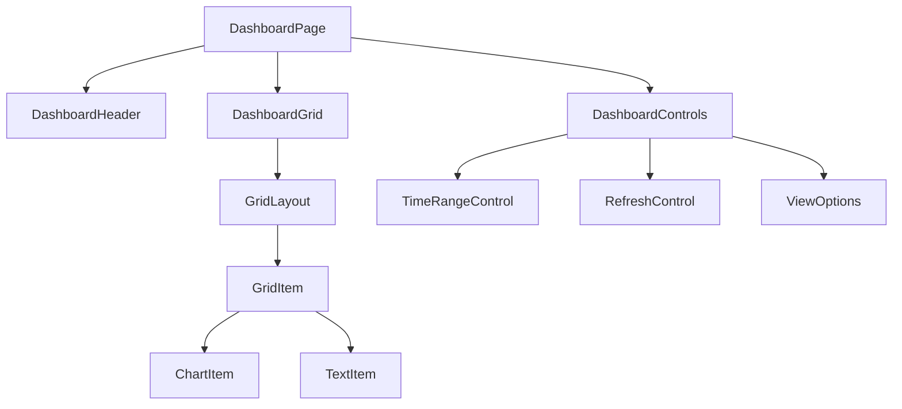

#### 주요 컴포넌트 책임
- **DashboardPage**: 대시보드 페이지 전체 구조 및 상태 관리
- **DashboardHeader**: 대시보드 제목, 설명, 메타 정보 표시
- **DashboardGrid**: react-grid-layout 기반 그리드 시스템 관리
- **GridItem**: 그리드 내 개별 위젯 아이템 래퍼
- **ChartItem/TextItem**: 위젯 유형별 특화 컴포넌트

### 4.2 대시보드 편집기 컴포넌트

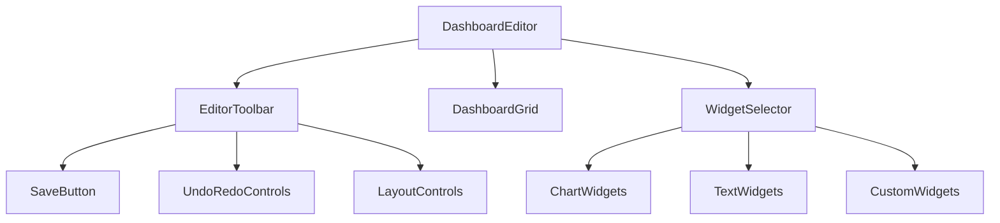

#### 주요 컴포넌트 책임
- **DashboardEditor**: 대시보드 편집 모드 전체 관리
- **EditorToolbar**: 편집 기능 제공 (저장, 실행 취소/다시 실행, 레이아웃)
- **WidgetSelector**: 추가 가능한 위젯 목록 제공
- **SaveButton**: 변경사항 저장 및 성공/실패 상태 표시
- **LayoutControls**: 그리드 레이아웃 설정 관리 (정렬, 크기 조정 등)

### 4.3 공유 대시보드 컴포넌트

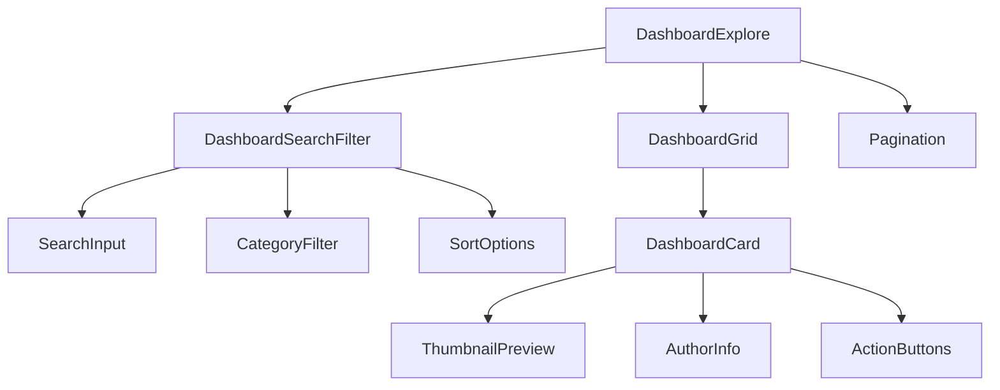

#### 주요 컴포넌트 책임
- **DashboardExplore**: 공유 대시보드 탐색 페이지 관리
- **DashboardSearchFilter**: 검색 및 필터링 기능 제공
- **DashboardCard**: 개별 대시보드 정보 카드 표시
- **ThumbnailPreview**: 대시보드 미리보기 이미지 제공
- **ActionButtons**: 미리보기, 구독 등 작업 버튼 제공

## 5. 데이터 소스 컴포넌트 설계

데이터 소스 관련 컴포넌트는 데이터 선택, 변환, 쿼리 구성에 초점을 맞추어 설계됩니다.

### 5.1 데이터 쿼리 컴포넌트

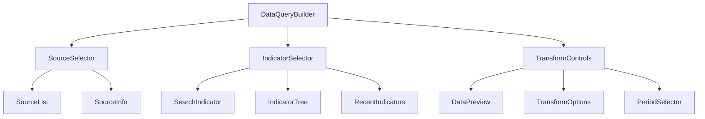

#### 주요 컴포넌트 책임
- **DataQueryBuilder**: 데이터 쿼리 구성 전체 관리
- **SourceSelector**: 데이터 출처 선택 UI (KOSIS, ECOS, OECD)
- **IndicatorSelector**: 지표 검색 및 선택 UI
- **TransformControls**: 데이터 변환 옵션 설정 (원본, 변화율, 누적값 등)
- **DataPreview**: 선택한 데이터의 미리보기 표시

### 5.2 데이터 시각화 헬퍼 컴포넌트

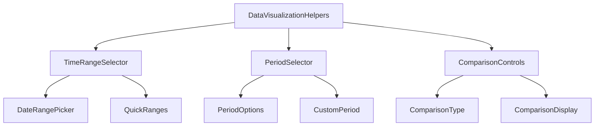

#### 주요 컴포넌트 책임
- **TimeRangeSelector**: 시간 범위 선택 UI
- **PeriodSelector**: 데이터 주기 선택 UI (일간, 월간, 분기, 연간)
- **ComparisonControls**: 데이터 비교 설정 UI (전년동기, 이전기간 등)
- **QuickRanges**: 자주 사용하는 시간 범위 빠른 선택 기능

## 6. 인증 및 사용자 컴포넌트 설계

인증 및 사용자 관련 컴포넌트는 SNS 로그인 및 프로필 관리에 초점을 맞추어 설계됩니다.

### 6.1 인증 컴포넌트

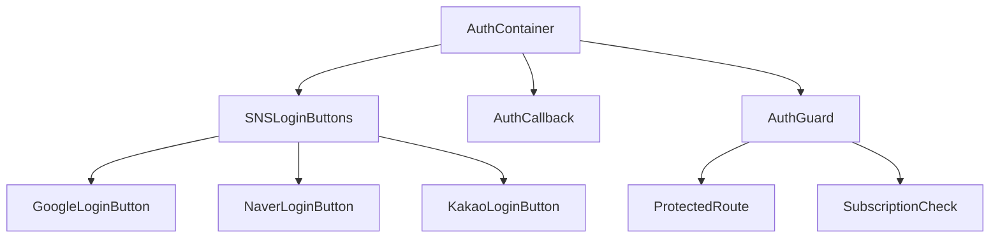

#### 주요 컴포넌트 책임
- **AuthContainer**: 인증 관련 레이아웃 및 상태 관리
- **SNSLoginButtons**: SNS 로그인 버튼 컨테이너
- **AuthCallback**: 인증 콜백 처리 컴포넌트
- **AuthGuard**: 인증 상태 기반 접근 제어 컴포넌트
- **SubscriptionCheck**: 구독 상태 확인 및 접근 제어

### 6.2 사용자 프로필 컴포넌트

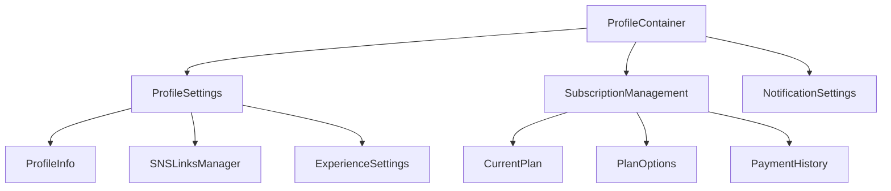

#### 주요 컴포넌트 책임
- **ProfileContainer**: 프로필 관련 레이아웃 및 상태 관리
- **ProfileSettings**: 사용자 프로필 설정 UI
- **SubscriptionManagement**: 구독 관리 UI
- **NotificationSettings**: 알림 설정 UI
- **SNSLinksManager**: SNS 계정 연결 관리 UI

## 7. UI/UX 공통 컴포넌트 설계

UI/UX 공통 컴포넌트는 애플리케이션 전반에서 사용되는 재사용 가능한 컴포넌트입니다.

### 7.1 네비게이션 컴포넌트

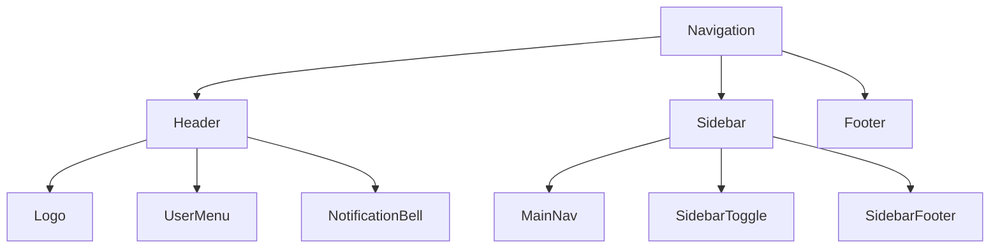

#### 주요 컴포넌트 책임
- **Header**: 상단 헤더 바 컴포넌트
- **Sidebar**: 측면 내비게이션 바 컴포넌트
- **UserMenu**: 사용자 메뉴 드롭다운 컴포넌트
- **MainNav**: 주요 내비게이션 링크 컴포넌트
- **SidebarToggle**: 사이드바 토글 버튼 컴포넌트

### 7.2 피드백 컴포넌트

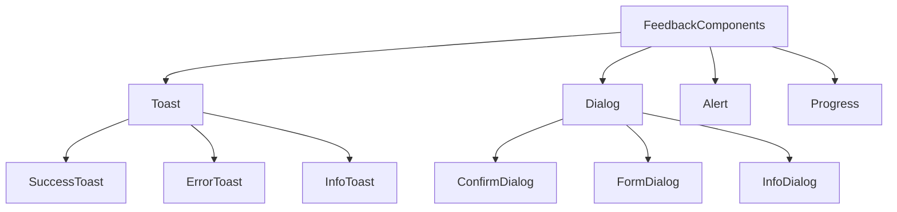

#### 주요 컴포넌트 책임
- **Toast**: 토스트 알림 컴포넌트
- **Dialog**: 다이얼로그/모달 컴포넌트
- **Alert**: 경고 및 알림 컴포넌트
- **Progress**: 진행 상태 표시 컴포넌트
- **ConfirmDialog**: 확인 다이얼로그 컴포넌트

### 7.3 폼 컴포넌트

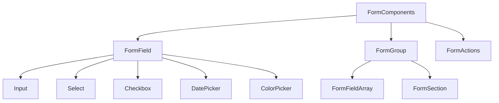

#### 주요 컴포넌트 책임
- **FormField**: 개별 폼 필드 래퍼 컴포넌트
- **FormGroup**: 관련 폼 필드 그룹 컴포넌트
- **FormActions**: 폼 액션 버튼 컨테이너 컴포넌트
- **ColorPicker**: 색상 선택 컴포넌트
- **FormFieldArray**: 동적 필드 배열 컴포넌트

## 8. 접근성 및 국제화 지원

### 8.1 접근성 컴포넌트

모든 컴포넌트는 WCAG 2.1 AA 준수를 목표로 하며, 다음과 같은 접근성 고려사항을 포함합니다:

- **SkipLink**: 키보드 사용자를 위한 메인 콘텐츠 바로가기 링크
- **FocusTrap**: 모달 및 다이얼로그에서 포커스를 가두는 컴포넌트
- **ScreenReaderOnly**: 시각적으로 숨겨지지만 스크린 리더에서 읽히는 텍스트
- **KeyboardNavigation**: 키보드 내비게이션 지원 유틸리티

### 8.2 국제화 지원 컴포넌트

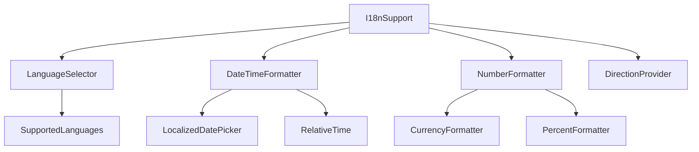

#### 주요 컴포넌트 책임
- **LanguageSelector**: 언어 선택 UI 제공
- **DateTimeFormatter**: 지역화된 날짜/시간 포맷팅 컴포넌트
- **NumberFormatter**: 지역화된 숫자 포맷팅 컴포넌트
- **DirectionProvider**: RTL/LTR 방향 설정 제공자

## 9. 컴포넌트 성능 최적화

컴포넌트 성능을 최적화하기 위해 다음과 같은 기법을 적용합니다:

### 9.1 렌더링 최적화 컴포넌트

- **MemoizedComponent**: React.memo를 활용한 메모이제이션 래퍼
- **DeferredComponent**: 우선순위가 낮은 컴포넌트 렌더링 지연
- **VirtualizedList**: 가상화된 목록 컴포넌트 (긴 목록 성능 최적화)
- **LazyLoadImage**: 이미지 지연 로딩 컴포넌트

### 9.2 데이터 로딩 최적화 컴포넌트

- **QueryBoundary**: Tanstack Query 에러 및 로딩 상태 처리
- **SuspenseBoundary**: React Suspense 경계 컴포넌트
- **ErrorBoundary**: 컴포넌트 에러 처리 경계
- **DataSplitting**: 데이터 분할 로딩 컴포넌트

## 10. 결론

E-Torch의 핵심 컴포넌트 설계는 모듈성, 재사용성, 확장성 원칙을 기반으로 구성되었습니다. 차트 렌더링, 대시보드 관리, 데이터 소스 관리 등 주요 기능별로 특화된 컴포넌트 구조를 갖추고 있으며, Next.js의 서버/클라이언트 컴포넌트 아키텍처를 효과적으로 활용합니다.

이 설계를 통해 E-Torch는 다양한 경제 데이터를 효과적으로 시각화하고 분석할 수 있는 직관적이고 강력한 사용자 경험을 제공할 수 있습니다. 또한, 컴포넌트의 명확한 책임 분리와 계층화된 구조를 통해 향후 기능 확장이나 변경에 유연하게 대응할 수 있는 기반을 마련했습니다.
