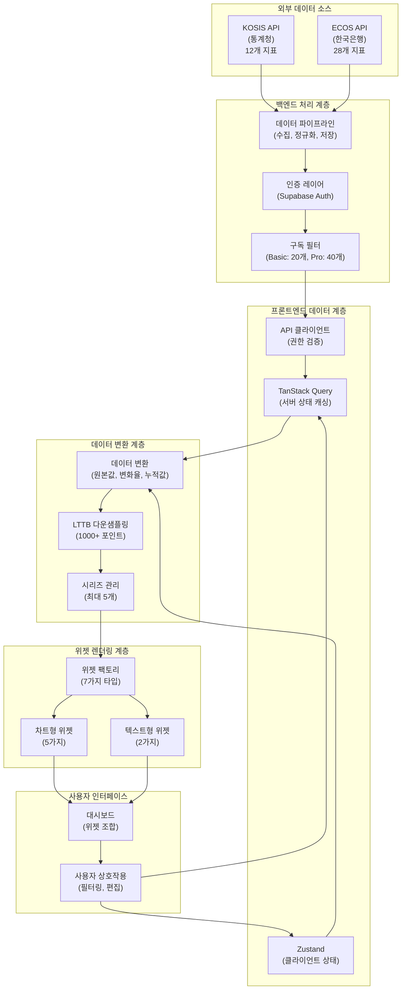
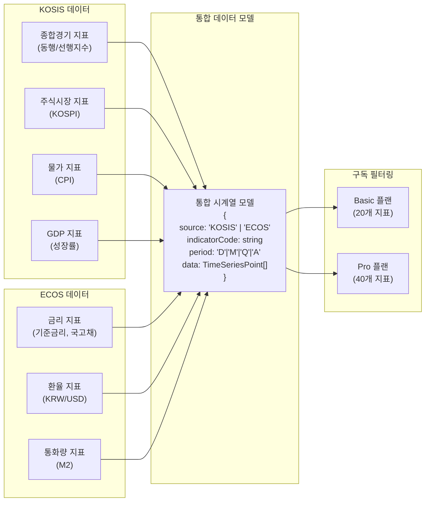
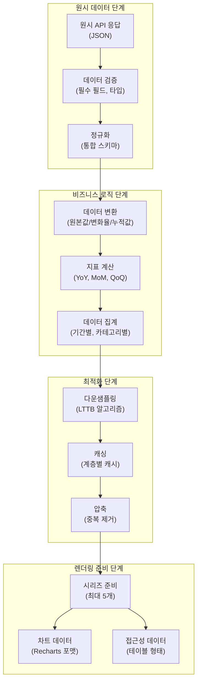
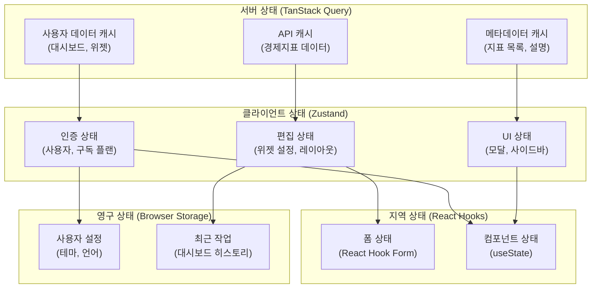
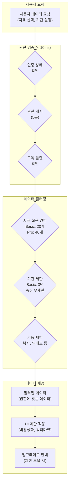
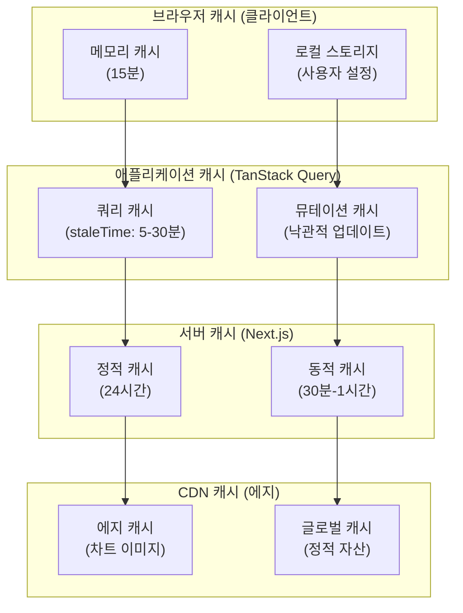
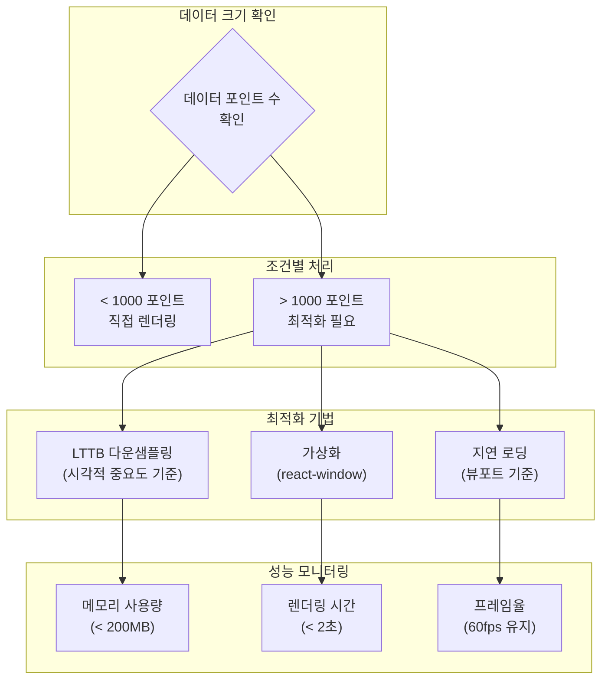
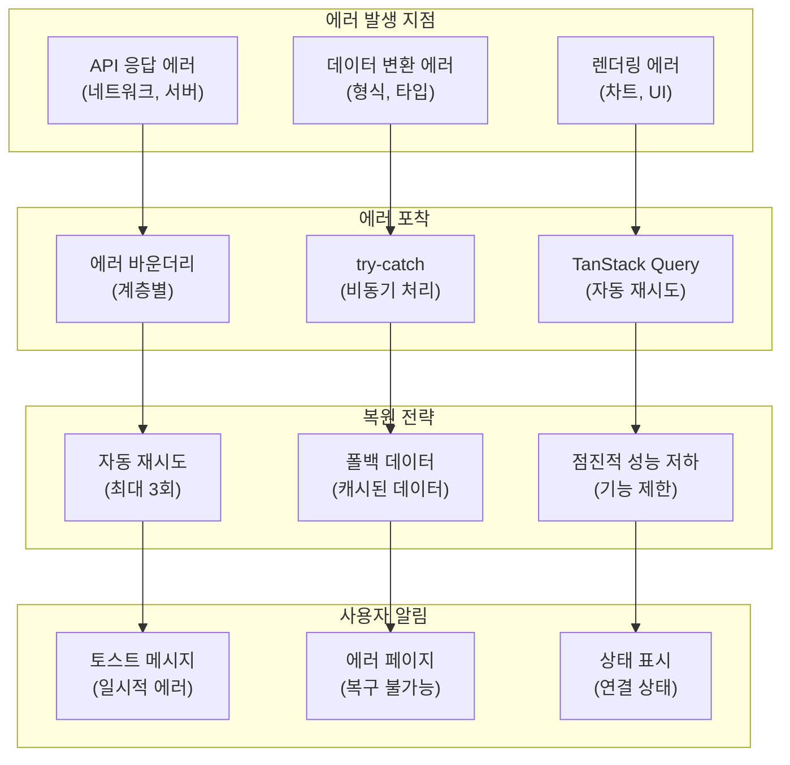
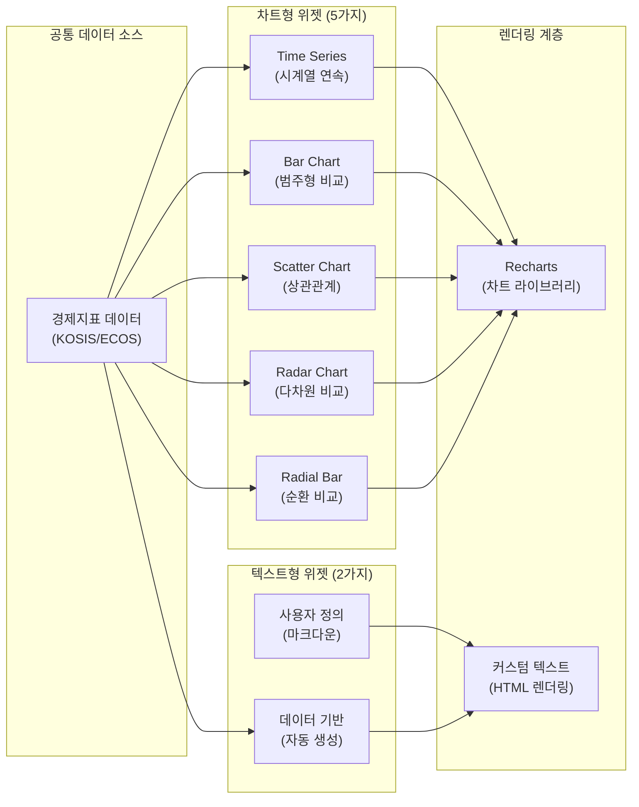
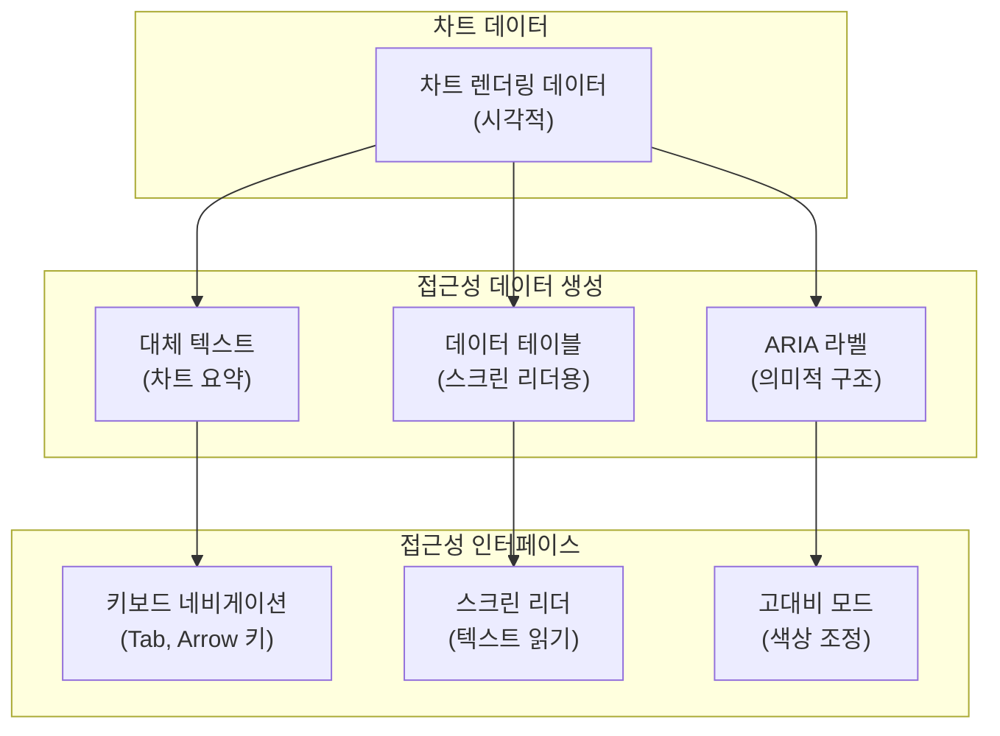

# E-Torch 데이터 흐름 가이드

## 1. 개요

### 1.1 가이드 목적

E-Torch는 한국의 경제지표(KOSIS, ECOS)를 통합 시각화하는 대시보드 서비스입니다. 이 가이드는 복잡한 경제지표 데이터가 외부 API에서 사용자 인터페이스까지 어떻게 흐르는지, 그리고 각 단계에서 어떤 변환과 최적화가 이루어지는지를 개발자 관점에서 설명합니다.

### 1.2 핵심 데이터 특성

- **다중 데이터 소스**: KOSIS(12개 지표), ECOS(28개 지표) 통합
- **구독 모델**: Basic(20개 지표), Pro(40개 지표)로 접근 권한 차별화
- **시계열 중심**: 대부분 시간축 기반 경제지표 데이터
- **대용량 처리**: 1000+ 데이터 포인트에 대한 성능 최적화 필요
- **실시간성**: 정기 발표 데이터로 실시간보다는 정확성과 안정성 우선

## 2. 전체 데이터 흐름 아키텍처

### 2.1 시스템 레벨 데이터 흐름

### 2.2 계층별 책임 분리

| 계층 | 주요 책임 | 기술 스택 | 데이터 유형 |
|------|----------|----------|------------|
| **외부 데이터 소스** | 원시 경제지표 제공 | REST API | JSON 응답 |
| **백엔드 처리** | 수집, 정규화, 권한 관리 | Supabase, 자체 API | 정규화된 시계열 |
| **프론트엔드 데이터** | 캐싱, 상태 관리 | TanStack Query, Zustand | 캐시된 데이터 |
| **데이터 변환** | 실시간 계산, 최적화 | 유틸리티 함수 | 처리된 시계열 |
| **위젯 렌더링** | 시각화, 사용자 인터랙션 | Recharts, React | 렌더링 데이터 |

## 3. 데이터 소스 통합 전략

### 3.1 다중 소스 통합 흐름

### 3.2 데이터 소스별 특성

| 소스 | 제공 지표 | 업데이트 주기 | 데이터 형식 | 접근 제한 |
|------|----------|-------------|------------|----------|
| **KOSIS** | 12개 (기본) | 월별/분기별 | 정형화된 통계 | 공개 |
| **ECOS** | 28개 (확장) | 일별/월별 | 금융 시계열 | 공개 |
| **구독 필터** | 플랜별 제한 | 실시간 | 권한 메타데이터 | 사용자별 |

## 4. 데이터 처리 파이프라인

### 4.1 데이터 변환 단계

### 4.2 데이터 변환 유형

| 변환 유형 | 설명 | 적용 시점 | 성능 고려사항 |
|----------|------|----------|-------------|
| **원본값** | API 응답 그대로 | 백엔드 저장 | 변환 비용 없음 |
| **변화율** | 전년/전월/전기 대비 | 프론트엔드 계산 | 실시간 계산 |
| **이동평균** | 5일/20일/60일 평균 | 프론트엔드 계산 | 메모이제이션 필요 |
| **누적값** | 연초 대비 누적 | 프론트엔드 계산 | 점진적 계산 |
| **정규화** | 0-100 스케일 변환 | 다중 시리즈 비교 시 | 범위 계산 필요 |

## 5. 상태 관리 데이터 흐름

### 5.1 서버/클라이언트 상태 분리

### 5.2 상태 동기화 패턴

| 상태 유형 | 동기화 방향 | 트리거 | 지연 시간 |
|----------|------------|--------|----------|
| **서버 → 클라이언트** | API 응답 → 캐시 → UI | 쿼리 실행 | < 500ms |
| **클라이언트 → 서버** | UI 변경 → 뮤테이션 → DB | 사용자 액션 | < 1초 |
| **클라이언트 ↔ 클라이언트** | 상태 스토어 간 | 이벤트 기반 | 즉시 |
| **영구 ↔ 메모리** | localStorage ↔ 상태 | 앱 시작/종료 | < 100ms |

## 6. 구독 모델과 데이터 접근 제어

### 6.1 플랜별 데이터 필터링 흐름

### 6.2 구독 플랜별 제한 사항

| 제한 요소 | Basic 플랜 | Pro 플랜 | 기술적 구현 |
|----------|-----------|---------|------------|
| **제공 지표** | 20개 | 40개 | 프론트엔드 필터링 |
| **데이터 기간** | 최근 3년 | 전체 기간 | DatePicker 제한 |
| **대시보드 수** | 3개 | 무제한 | 생성 시 검증 |
| **위젯 수** | 6개/대시보드 | 무제한 | 추가 시 검증 |
| **고급 기능** | 제한 | 전체 | 조건부 렌더링 |

## 7. 캐싱 전략

### 7.1 다층 캐싱 아키텍처

### 7.2 캐시 정책

| 데이터 유형 | 캐시 위치 | 유효 시간 | 무효화 조건 |
|------------|----------|----------|------------|
| **경제지표 데이터** | TanStack Query | 15-30분 | 수동 새로고침 |
| **지표 메타데이터** | 서버 캐시 | 24시간 | 관리자 업데이트 |
| **사용자 설정** | localStorage | 영구 | 사용자 변경 |
| **차트 이미지** | CDN | 1시간 | 데이터 변경 |
| **구독 정보** | 메모리 | 5분 | 결제 완료 |

## 8. 성능 최적화

### 8.1 대용량 데이터 처리 최적화

### 8.2 성능 지표 및 목표

| 성능 지표 | 목표값 | 측정 방법 | 최적화 방법 |
|----------|--------|----------|------------|
| **초기 로딩** | < 2.5초 | LCP | 서버 컴포넌트, 스켈레톤 UI |
| **차트 렌더링** | < 2초 | 커스텀 타이머 | LTTB, 메모이제이션 |
| **상호작용 반응** | < 100ms | FID/INP | 디바운싱, 배치 업데이트 |
| **메모리 사용** | < 200MB | Performance API | 가비지 컬렉션, 클린업 |

## 9. 에러 처리 및 복원

### 9.1 데이터 흐름 에러 처리

### 9.2 복원 전략

| 에러 유형 | 복원 방법 | 사용자 경험 | 기술적 구현 |
|----------|----------|------------|------------|
| **네트워크 에러** | 자동 재시도 | 로딩 인디케이터 | TanStack Query retry |
| **데이터 파싱 에러** | 폴백 데이터 | 에러 메시지 + 이전 데이터 | Error Boundary |
| **차트 렌더링 에러** | 대체 UI | 에러 아이콘 + 재시도 버튼 | React Error Boundary |
| **권한 에러** | 로그인 유도 | 로그인 모달 | 미들웨어 리디렉션 |

## 10. 위젯별 데이터 흐름 특성

### 10.1 위젯 타입별 데이터 처리

### 10.2 위젯별 데이터 요구사항

| 위젯 유형 | 최대 시리즈 | 데이터 특성 | 최적화 방법 |
|----------|------------|------------|------------|
| **Time Series** | 5개 | 연속적 시계열 | LTTB 다운샘플링 |
| **Bar Chart** | 5개 | 범주형 비교 | 상위 N개 필터링 |
| **Scatter Chart** | 5개 | X-Y 좌표 쌍 | 밀도 기반 샘플링 |
| **Radar Chart** | 1개 | 다차원 벡터 | 축별 정규화 |
| **Radial Bar** | 1개 | 순환 데이터 | 각도 최적화 |
| **Text Data** | 1개 | 단일 값 | 실시간 계산 |

## 11. 접근성 데이터 흐름

### 11.1 접근성 지원 데이터 변환

### 11.2 접근성 데이터 형식

| 접근성 요소 | 데이터 형식 | 생성 방법 | 업데이트 주기 |
|------------|------------|----------|-------------|
| **데이터 테이블** | HTML table | 차트 데이터 변환 | 실시간 |
| **대체 텍스트** | 요약 문장 | 통계 기반 생성 | 데이터 변경 시 |
| **ARIA 라벨** | 의미적 텍스트 | 컨텍스트 기반 | 렌더링 시 |
| **키보드 네비게이션** | 포커스 순서 | DOM 구조 기반 | 정적 |

## 12. 결론

### 12.1 데이터 흐름 설계 원칙

E-Torch의 데이터 흐름은 다음 원칙을 기반으로 설계되었습니다:

1. **계층적 분리**: 각 계층의 책임을 명확히 구분하여 유지보수 용이성 확보
2. **성능 우선**: 대용량 시계열 데이터 처리를 위한 다단계 최적화 적용
3. **사용자 경험**: 구독 모델과 접근성을 고려한 차별화된 데이터 제공
4. **확장성**: 새로운 데이터 소스와 위젯 타입 추가를 고려한 유연한 구조

### 12.2 핵심 성과 지표

- **데이터 처리 속도**: 1000+ 포인트 시계열을 2초 이내 렌더링
- **캐시 효율성**: 80% 이상의 캐시 적중률로 네트워크 요청 최소화
- **메모리 최적화**: 대시보드당 200MB 이하 메모리 사용량 유지
- **접근성 준수**: WCAG 2.1 AA 수준의 완전한 접근성 지원

이러한 데이터 흐름 아키텍처를 통해 E-Torch는 복잡한 경제지표를 직관적이고 성능 좋은 시각화 도구로 제공할 수 있습니다.
