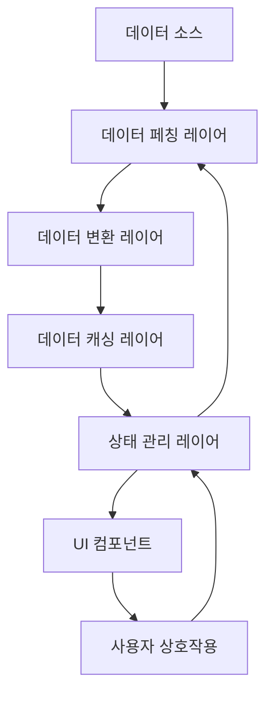
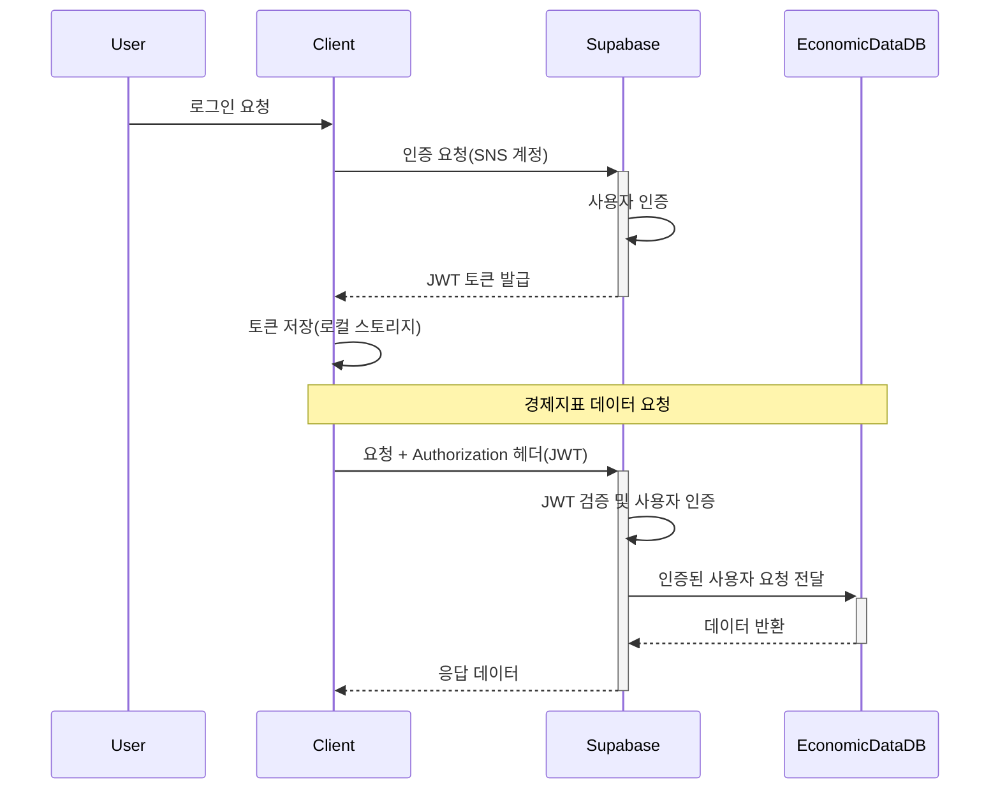
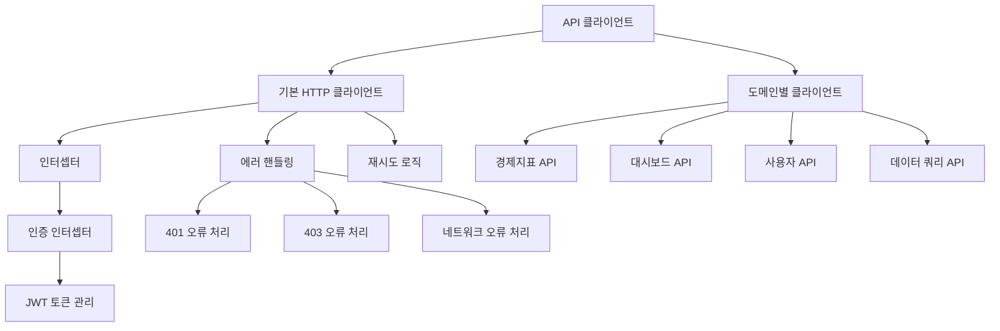
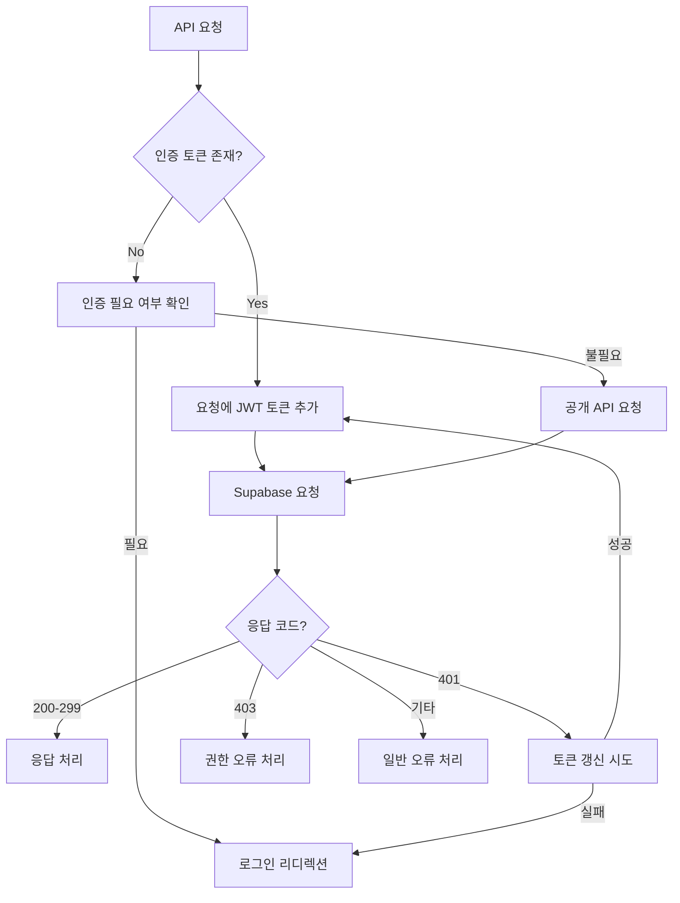
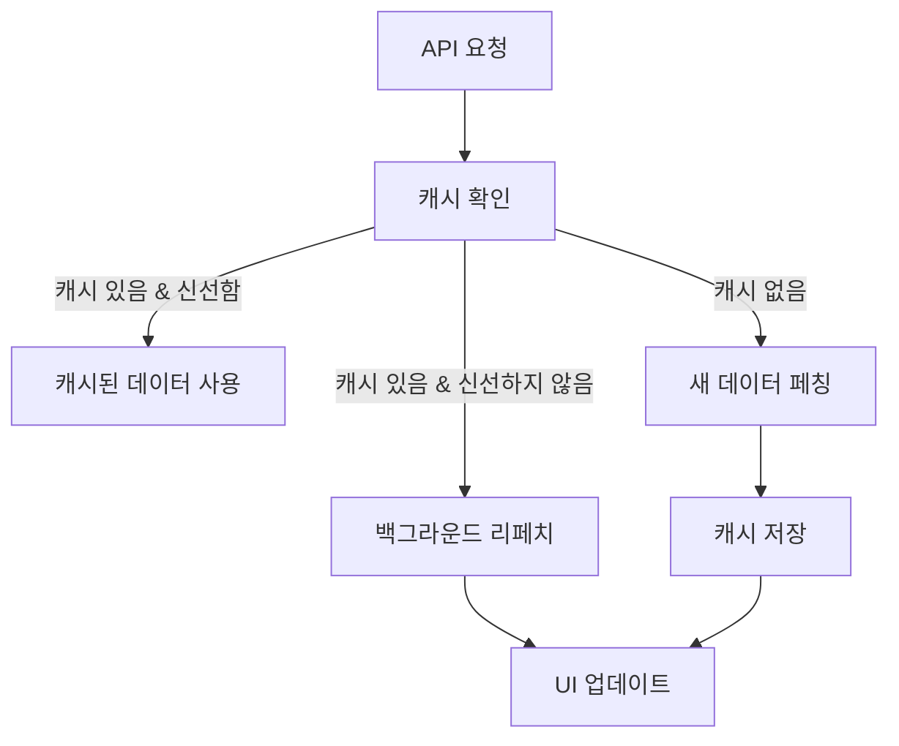
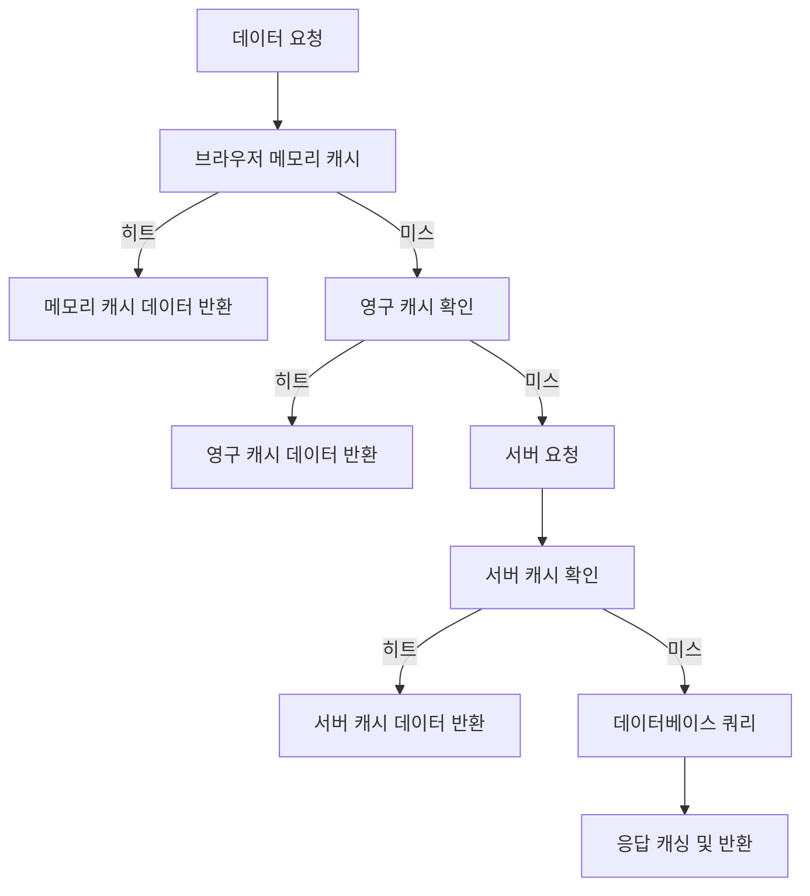
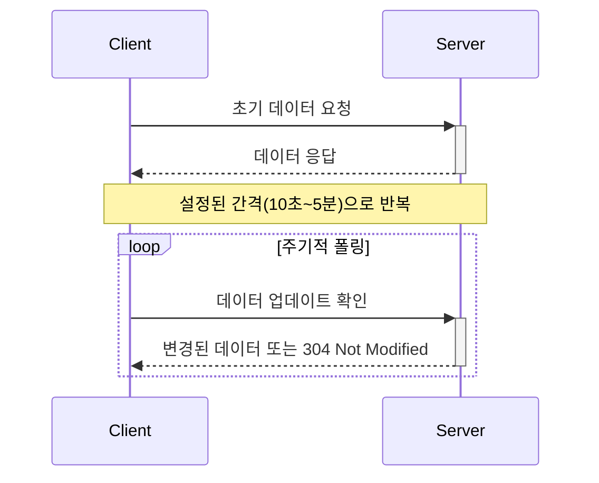
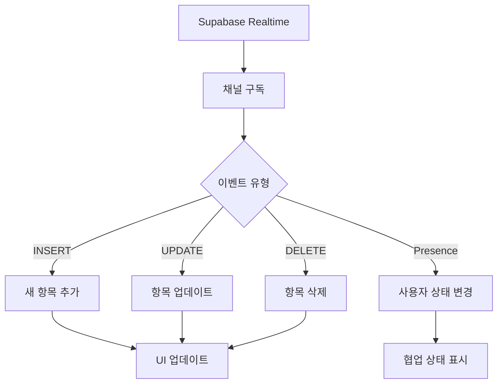
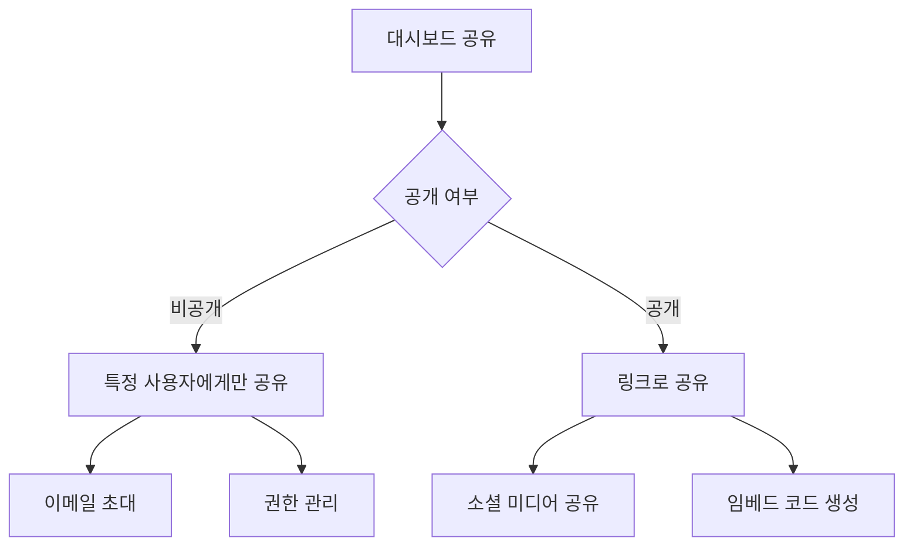
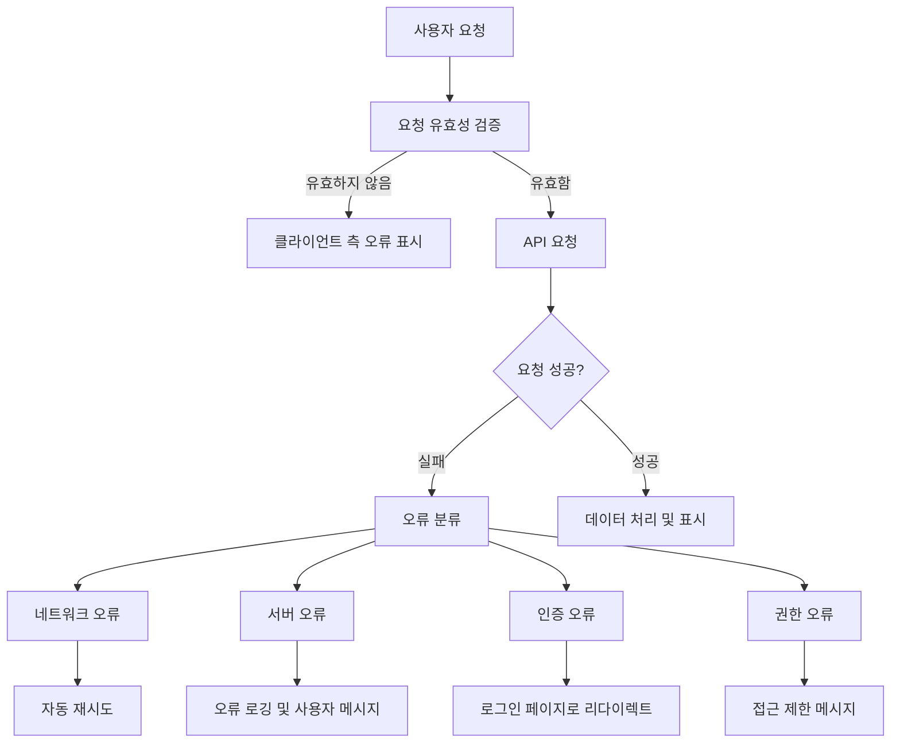

# E-Torch 데이터 흐름 및 API 연동

## 1. 개요

E-Torch 프로젝트의 데이터 흐름 및 API 연동 설계는 마이그레이션된 경제지표 데이터를 효율적으로 활용하고, 사용자에게 최적화된 시각화 환경을 제공하는 데 중점을 둡니다. 본 문서는 데이터의 흐름, 처리 과정, API 연동 전략을 설명합니다.

## 2. 데이터 아키텍처 개요

E-Torch의 데이터 아키텍처는 다음과 같은 주요 컴포넌트로 구성됩니다:

### 2.1 주요 데이터 컴포넌트

1. **데이터 소스**: 마이그레이션된 경제지표 데이터베이스, Supabase
2. **데이터 페칭 레이어**: API 클라이언트, 서버 액션, TanStack Query
3. **데이터 변환 레이어**: 데이터 정규화, 변환, 집계
4. **데이터 캐싱 레이어**: TanStack Query 캐시, 서버 컴포넌트 캐시
5. **상태 관리 레이어**: Zustand 스토어, React Context
6. **UI 컴포넌트**: 데이터 표시 및 사용자 상호작용
7. **사용자 상호작용**: 필터링, 정렬, 데이터 조작

## 3. 데이터 소스 구성

E-Torch는 마이그레이션된 경제지표 데이터와 Supabase를 사용하여 사용자 데이터 및 인증을 관리합니다.

### 3.1 주요 데이터 소스

| 데이터 소스 | 제공 데이터 유형 | 지원 주기 | API 유형 | 인증 방식 |
|------------|--------------|----------|---------|----------|
| **마이그레이션된 경제지표 DB** | KOSIS, ECOS, OECD 기반 경제지표 | D, M, Q, A | REST | Supabase JWT |
| **Supabase** | 사용자, 대시보드, 설정 등 | 실시간 | REST, Realtime | JWT |

### 3.2 인증 및 접근 제어

E-Torch는 Supabase를 통한 단일 인증 시스템을 사용합니다:

1. **통합 인증 구조**:
   - 사용자는 Supabase를 통해 SNS 계정(Google, Naver, Kakao)으로 인증
   - 인증된 사용자만 마이그레이션된 경제지표 데이터베이스에 접근 가능
   - JWT 토큰으로 모든 데이터 접근 권한 관리

2. **권한 관리**:
   - Supabase의 Row Level Security(RLS)를 통한 데이터 접근 제어
   - 사용자 역할 및 구독 상태에 따른 데이터 접근 제한
   - JWT 클레임에 포함된 사용자 정보를 통한 권한 검증

### 3.3 데이터 통합 전략

E-Torch는 다음과 같은 접근 방식으로 다양한 데이터 소스를 통합합니다:

1. **통합 데이터 모델**: 다양한 경제지표 데이터를 통합된 형식으로 관리
2. **표준화된 메타데이터**: 모든 데이터에 대한 일관된 메타데이터 관리
3. **소스 투명성**: 데이터 출처를 항상 명시하여 사용자에게 정보 제공
4. **동적 소스 선택**: 사용자가 동일 지표에 대해 소스 선택 가능
5. **점진적 데이터 로딩**: 필요한 데이터만 필요한 시점에 로딩

## 4. API 클라이언트 설계

### 4.1 API 클라이언트 아키텍처

E-Torch의 API 클라이언트는 모듈화된 구조를 가지며, 다음과 같은 계층으로 구성됩니다:

### 4.2 인증 통합

모든 API 요청은 Supabase를 통한 인증 흐름을 따릅니다:

### 4.3 도메인별 API 클라이언트

사용자, 대시보드, 경제지표 등 도메인 영역별 API 클라이언트를 구현하여 관심사를 분리합니다:

1. **경제지표 API 클라이언트**: 지표 데이터 조회 및 분석
2. **대시보드 API 클라이언트**: 대시보드 생성, 조회, 수정, 삭제
3. **사용자 API 클라이언트**: 사용자 프로필 관리, 구독 정보
4. **데이터 쿼리 API 클라이언트**: 복잡한 데이터 쿼리 처리

## 5. 데이터 페칭 전략

E-Torch는 다양한 데이터 페칭 전략을 사용하여 성능과 사용자 경험을 최적화합니다.

### 5.1 서버 컴포넌트에서의 데이터 페칭

Next.js 서버 컴포넌트를 활용한 데이터 페칭:

1. **초기 데이터 로드**: 페이지 로드 시 서버에서 필요한 데이터 로드
2. **SEO 최적화**: 서버에서 메타데이터 생성 및 최적화
3. **클라이언트 번들 최소화**: 데이터를 서버에서 처리하여 클라이언트 번들 크기 감소
4. **인증 처리**: 서버 컴포넌트에서 Supabase 서버 SDK를 활용한 인증 처리

### 5.2 TanStack Query를 활용한 클라이언트 데이터 페칭

1. **초기 데이터 활용**: 서버에서 제공한 초기 데이터로 시작
2. **지연 로딩**: 필요한 데이터만 지연 로딩
3. **캐싱 전략**: 적절한 캐싱을 통한 네트워크 요청 최소화
4. **자동 리페치**: 데이터 신선도를 유지하기 위한 자동 리페치
5. **낙관적 업데이트**: 사용자 경험 향상을 위한 낙관적 업데이트
6. **인증 통합**: Supabase 클라이언트를 TanStack Query와 통합하여 인증 관리

### 5.3 서버 액션을 활용한 데이터 변경

1. **안전한 데이터 변경**: 서버 측에서 데이터 유효성 검증 및 변경
2. **캐시 무효화**: 관련 페이지의 캐시 자동 무효화
3. **트랜잭션 보장**: 여러 데이터 변경의 원자성 보장
4. **인증 컨텍스트**: 서버 액션에서 사용자 인증 상태 유지 및 확인

## 6. 데이터 변환 및 처리 파이프라인

E-Torch는 경제지표 데이터 처리를 위한 파이프라인을 구현합니다.

### 6.1 데이터 파이프라인 구조

### 6.2 데이터 변환 유형

다양한 형태의 데이터 변환을 지원합니다:

1. **원본값**: 가공 없이 원본 데이터 사용
2. **기간 대비 변화율**: 직전 기간 대비 값의 변화율 계산
3. **전년 동기 대비 변화율**: 전년 동일 기간 대비 변화율 계산
4. **누적값**: 시간 경과에 따른 누적값 계산

## 7. 데이터 캐싱 전략

E-Torch는 다층적 캐싱 전략을 통해 성능을 최적화합니다.

### 7.1 TanStack Query 캐싱 설정

### 7.2 데이터 유형별 캐싱 전략

| 데이터 유형 | staleTime | gcTime | 리페치 전략 | 무효화 조건 |
|------------|-----------|--------|------------|------------|
| 사용자 대시보드 | 5분 | 1시간 | 윈도우 포커스 시 | 대시보드 변경 후 |
| 공유 대시보드 | 10분 | 3시간 | 수동 또는 주기적 | 댓글 작성, 별점 변경 |
| 경제지표 데이터 | 1시간 | 12시간 | 수동 또는 주기적 | 시간 범위 변경 |
| 실시간 지표 | 1분 | 10분 | 주기적 (1분) | 자동 만료 |
| 사용자 구독 정보 | 30분 | 1시간 | 윈도우 포커스 시 | 구독 변경 후 |

### 7.3 다중 계층 캐싱

## 8. 클라이언트-서버 통신 최적화

### 8.1 요청 일괄 처리 (Request Batching)

여러 데이터 요청을 한 번의 네트워크 호출로 처리하는 전략으로, 특히 대시보드 데이터 로딩 시 활용합니다.

### 8.2 점진적 로딩 (Progressive Loading)

대시보드와 같은 복잡한 화면에서 중요한 데이터를 먼저 로드하고, 덜 중요한 데이터는 나중에 로드하는 전략을 사용합니다.

### 8.3 낙관적 UI 업데이트 (Optimistic UI)

사용자 액션 즉시 UI를 업데이트하고, 서버 응답을 기다리는 대신 성공을 가정하여 사용자 경험을 향상시킵니다.

## 9. 실시간 데이터 업데이트

E-Torch는 필요에 따라 실시간 또는 주기적 데이터 업데이트를 지원합니다.

### 9.1 주기적 데이터 폴링

### 9.2 Supabase Realtime을 활용한 실시간 업데이트

Supabase의 Realtime 기능을 활용하여 협업 시나리오를 지원합니다:

1. **대시보드 공동 편집**: 여러 사용자가 동시에 대시보드 편집
2. **실시간 댓글 및 피드백**: 대시보드에 대한 실시간 댓글 및 피드백
3. **알림**: 데이터 변경 또는 이벤트 발생 시 실시간 알림

## 10. 데이터 내보내기 및 공유

E-Torch는 데이터 및 시각화 결과를 다양한 형식으로 내보내고 공유하는 기능을 제공합니다.

### 10.1 차트 내보내기

사용자는 차트를 다양한 형식(PNG, SVG, CSV)으로 내보낼 수 있으며, 모든 내보내기에는 E-Torch 워터마크가 포함됩니다.

### 10.2 대시보드 공유

## 11. 오류 처리 및 복원 전략

E-Torch는 네트워크 오류, 서버 오류 등에 대한 강건한 오류 처리 전략을 구현합니다.

### 11.1 오류 처리 계층

### 11.2 복원 전략

1. **자동 재연결**: 네트워크 연결 복원 시 자동 데이터 동기화
2. **로컬 캐싱**: 오프라인 상태에서도 최근 데이터 접근 가능
3. **변경사항 큐**: 오프라인 상태에서 변경사항을 큐에 저장 후 연결 복원 시 적용
4. **점진적 성능 저하**: 일부 기능만 제한하여 핵심 기능 유지

## 12. 결론

E-Torch의 데이터 흐름 및 API 연동 아키텍처는 마이그레이션된 경제지표 데이터를 효율적으로 활용하고, Supabase를 통한 단일 인증 시스템으로 모든 데이터 접근을 관리합니다. 계층화된 데이터 아키텍처, 모듈화된 API 클라이언트, 최적화된 데이터 페칭 전략, 강력한 캐싱 메커니즘 등이 이를 가능하게 합니다.

특히 데이터 변환 및 처리 파이프라인은 다양한 경제지표 데이터를 일관된 형태로 변환하여 차트와 대시보드 컴포넌트에서 쉽게 사용할 수 있도록 합니다. 또한 낙관적 UI 업데이트, 요청 일괄 처리, 점진적 로딩 등의 최적화 기법은 대량 데이터 처리 시에도 우수한 사용자 경험을 보장합니다.

Supabase의 실시간 기능과 결합된 실시간 데이터 업데이트, 데이터 내보내기 및 공유, 오류 처리 및 복원 전략 등은 E-Torch가 실무적인 요구사항을 충족하는 강력한 경제지표 대시보드 서비스로 기능할 수 있게 합니다.