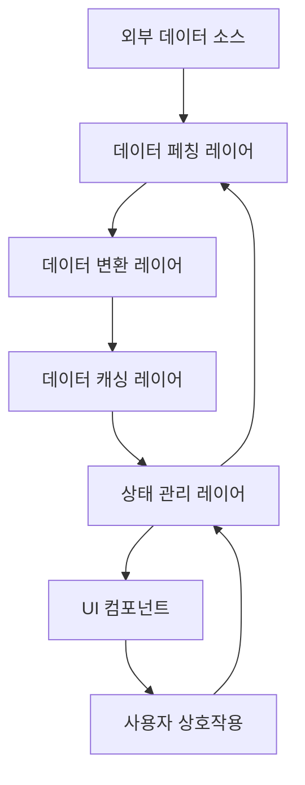
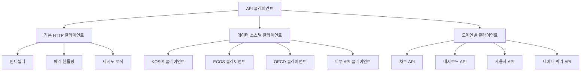
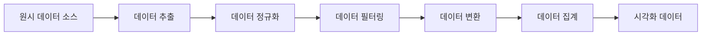

# E-Torch 데이터 흐름 및 API 연동

## 1. 개요

E-Torch 프로젝트의 데이터 흐름 및 API 연동 설계는 다양한 경제지표 데이터 소스(KOSIS, ECOS, OECD)를 효율적으로 통합하고, 사용자에게 최적화된 시각화 환경을 제공하는 데 중점을 두고 있습니다. 본 문서는 데이터의 흐름, 처리 과정, API 연동 전략을 상세히 설명합니다.

## 2. 데이터 아키텍처 개요

E-Torch의 데이터 아키텍처는 다음과 같은 주요 컴포넌트로 구성됩니다:



### 2.1 주요 데이터 컴포넌트

1. **외부 데이터 소스**: KOSIS, ECOS, OECD API 또는 자체 백엔드 API
2. **데이터 페칭 레이어**: API 클라이언트, 서버 액션, TanStack Query
3. **데이터 변환 레이어**: 데이터 정규화, 변환, 집계
4. **데이터 캐싱 레이어**: TanStack Query 캐시, 서버 컴포넌트 캐시
5. **상태 관리 레이어**: Zustand 스토어, React Context
6. **UI 컴포넌트**: 데이터 표시 및 사용자 상호작용
7. **사용자 상호작용**: 필터링, 정렬, 데이터 조작

## 3. 데이터 소스 구성

E-Torch는 여러 경제지표 데이터 소스를 통합하여 사용합니다.

### 3.1 주요 데이터 소스

| 데이터 소스 | 제공 지표 유형 | 지원 주기 | API 유형 | 인증 방식 |
|------------|--------------|----------|---------|----------|
| **KOSIS** | 종합경기지수, 물가지수 등 | M, Q, A | REST | API Key |
| **ECOS** | 금리, 통화량, 환율 등 | D, M, Q, A | REST | API Key |
| **OECD** | 국제 비교 경제지표 | Q, A | REST | API Key |
| **자체 데이터베이스** | 사용자 대시보드, 설정 등 | 실시간 | REST | JWT |

### 3.2 데이터 통합 전략

E-Torch는 다음과 같은 접근 방식으로 다양한 데이터 소스를 통합합니다:

1. **통합 데이터 모델**: 서로 다른 데이터 소스의 데이터를 통합된 형식으로 변환
2. **표준화된 메타데이터**: 모든 데이터 소스에 대한 일관된 메타데이터 관리
3. **소스 투명성**: 데이터 출처를 항상 명시하여 사용자에게 정보 제공
4. **동적 소스 선택**: 사용자가 동일 지표에 대해 소스 선택 가능
5. **점진적 데이터 로딩**: 필요한 데이터만 필요한 시점에 로딩

## 4. API 클라이언트 설계

### 4.1 API 클라이언트 아키텍처

E-Torch의 API 클라이언트는 모듈화된 구조를 가지며, 다음과 같은 계층으로 구성됩니다:



### 4.2 기본 HTTP 클라이언트

E-Torch는 axios 기반의 HTTP 클라이언트를 사용하며, 다음과 같은 기능을 제공합니다:

```typescript
// 추상적인 예시
import axios, { AxiosInstance, AxiosRequestConfig, AxiosResponse } from 'axios';

class HttpClient {
  private client: AxiosInstance;
  
  constructor(baseURL: string, config?: AxiosRequestConfig) {
    this.client = axios.create({
      baseURL,
      timeout: 30000,
      headers: {
        'Content-Type': 'application/json',
      },
      ...config,
    });
    
    this.setupInterceptors();
  }
  
  private setupInterceptors() {
    // 요청 인터셉터
    this.client.interceptors.request.use(
      (config) => {
        // 인증 토큰 추가
        // 요청 로깅
        return config;
      },
      (error) => Promise.reject(error)
    );
    
    // 응답 인터셉터
    this.client.interceptors.response.use(
      (response) => {
        // 응답 데이터 변환 및 로깅
        return response;
      },
      (error) => {
        // 에러 핸들링
        // 인증 오류 처리
        // 재시도 로직
        return Promise.reject(error);
      }
    );
  }
  
  async get<T>(url: string, config?: AxiosRequestConfig): Promise<T> {
    const response = await this.client.get<T>(url, config);
    return response.data;
  }
  
  async post<T>(url: string, data?: any, config?: AxiosRequestConfig): Promise<T> {
    const response = await this.client.post<T>(url, data, config);
    return response.data;
  }
  
  async put<T>(url: string, data?: any, config?: AxiosRequestConfig): Promise<T> {
    const response = await this.client.put<T>(url, data, config);
    return response.data;
  }
  
  async delete<T>(url: string, config?: AxiosRequestConfig): Promise<T> {
    const response = await this.client.delete<T>(url, config);
    return response.data;
  }
}

export default HttpClient;
```

### 4.3 데이터 소스별 클라이언트

각 데이터 소스에 특화된 클라이언트를 구현하여 소스별 인증 및 데이터 형식 처리를 캡슐화합니다:

```typescript
// 추상적인 예시: KOSIS 클라이언트
import HttpClient from './http-client';
import { KosisResponse, IndicatorMetadata, TimeSeriesData } from '@e-torch/core';

class KosisClient {
  private client: HttpClient;
  private apiKey: string;
  
  constructor(apiKey: string) {
    this.client = new HttpClient('https://kosis.kr/api', {
      headers: {
        'Authorization': `Bearer ${apiKey}`
      }
    });
    this.apiKey = apiKey;
  }
  
  async getIndicators(): Promise<IndicatorMetadata[]> {
    const response = await this.client.get<KosisResponse<IndicatorMetadata[]>>('/indicators');
    return response.data;
  }
  
  async getTimeSeriesData(
    indicatorCode: string,
    period: 'M' | 'Q' | 'A',
    fromDate: string,
    toDate: string
  ): Promise<TimeSeriesData> {
    const response = await this.client.get<KosisResponse<TimeSeriesData>>('/data', {
      params: {
        indicator: indicatorCode,
        period,
        fromDate,
        toDate
      }
    });
    
    // KOSIS 특화 데이터 변환
    return this.transformKosisData(response.data);
  }
  
  private transformKosisData(data: any): TimeSeriesData {
    // KOSIS 형식에서 통합 모델로 변환
    // 날짜 형식, 숫자 형식 등 표준화
    return {
      // 변환된 데이터
    };
  }
}

export default KosisClient;
```

### 4.4 도메인별 API 클라이언트

사용자, 대시보드, 차트 등 도메인 영역별로 API 클라이언트를 구현합니다:

```typescript
// 추상적인 예시: 대시보드 API 클라이언트
import HttpClient from './http-client';
import { Dashboard, ApiResponse } from '@e-torch/core';

class DashboardApiClient {
  private client: HttpClient;
  
  constructor(baseURL: string) {
    this.client = new HttpClient(`${baseURL}/dashboards`);
  }
  
  async getDashboards(): Promise<Dashboard[]> {
    return this.client.get<Dashboard[]>('/');
  }
  
  async getDashboardById(id: string): Promise<Dashboard> {
    return this.client.get<Dashboard>(`/${id}`);
  }
  
  async createDashboard(dashboard: Partial<Dashboard>): Promise<Dashboard> {
    return this.client.post<Dashboard>('/', dashboard);
  }
  
  async updateDashboard(id: string, dashboard: Partial<Dashboard>): Promise<Dashboard> {
    return this.client.put<Dashboard>(`/${id}`, dashboard);
  }
  
  async deleteDashboard(id: string): Promise<void> {
    return this.client.delete<void>(`/${id}`);
  }
  
  async shareDashboard(id: string, options: { isPublic: boolean }): Promise<ApiResponse> {
    return this.client.post<ApiResponse>(`/${id}/share`, options);
  }
}

export default DashboardApiClient;
```

## 5. 데이터 페칭 전략

E-Torch는 다양한 데이터 페칭 전략을 사용하여 성능과 사용자 경험을 최적화합니다.

### 5.1 서버 컴포넌트에서의 데이터 페칭

Next.js 서버 컴포넌트를 활용한 데이터 페칭:

```tsx
// 추상적인 예시: 대시보드 페이지
import { fetchDashboard } from '@/services/dashboard-service';
import { DashboardView } from './DashboardView.client';

interface DashboardPageProps {
  params: {
    id: string;
  };
}

export default async function DashboardPage({ params }: DashboardPageProps) {
  // 서버에서 데이터 페칭
  const dashboard = await fetchDashboard(params.id);
  
  if (!dashboard) {
    notFound();
  }
  
  // 클라이언트 컴포넌트에 초기 데이터 전달
  return <DashboardView dashboardId={params.id} initialData={dashboard} />;
}

// 메타데이터 생성
export async function generateMetadata({ params }: DashboardPageProps) {
  const dashboard = await fetchDashboard(params.id);
  
  if (!dashboard) {
    return {
      title: '대시보드 - E-Torch',
    };
  }
  
  return {
    title: `${dashboard.title} - E-Torch`,
    description: dashboard.description || '경제지표 대시보드',
  };
}
```

### 5.2 Tanstack Query를 활용한 클라이언트 데이터 페칭

```tsx
// 추상적인 예시: 대시보드 클라이언트 컴포넌트
'use client';

import { useState } from 'react';
import { useQuery } from '@tanstack/react-query';
import { fetchDashboardClient } from '@/services/dashboard-client-service';

interface DashboardViewProps {
  dashboardId: string;
  initialData?: Dashboard;
}

export function DashboardView({ dashboardId, initialData }: DashboardViewProps) {
  const [timeRange, setTimeRange] = useState<TimeRange>(
    initialData?.timeRange || {
      from: new Date(Date.now() - 30 * 24 * 60 * 60 * 1000).toISOString(),
      to: new Date().toISOString()
    }
  );
  
  // 초기 데이터로 시작하고 필요 시 업데이트
  const { data: dashboard, isLoading, error } = useQuery({
    queryKey: ['dashboard', dashboardId, timeRange],
    queryFn: () => fetchDashboardClient(dashboardId, timeRange),
    initialData,
  });
  
  // 시간 범위 변경 처리
  const handleTimeRangeChange = (newRange: TimeRange) => {
    setTimeRange(newRange);
  };
  
  if (isLoading && !initialData) {
    return <LoadingSpinner />;
  }
  
  if (error) {
    return <ErrorDisplay error={error} />;
  }
  
  return (
    <div>
      <DashboardHeader
        title={dashboard.title}
        timeRange={timeRange}
        onTimeRangeChange={handleTimeRangeChange}
      />
      <DashboardGrid items={dashboard.items} />
    </div>
  );
}
```

### 5.3 서버 액션을 활용한 데이터 변경

```tsx
// 추상적인 예시: 서버 액션
'use server';

import { revalidatePath } from 'next/cache';
import { redirect } from 'next/navigation';
import { saveDashboard } from '@/services/dashboard-service';

export async function saveDashboardAction(
  dashboardId: string,
  formData: FormData
) {
  try {
    // FormData를 객체로 변환
    const dashboardData = {
      title: formData.get('title') as string,
      description: formData.get('description') as string,
      // 기타 필요한 데이터 추출
    };
    
    // 서버에 저장
    const updatedDashboard = await saveDashboard(dashboardId, dashboardData);
    
    // 관련 페이지 캐시 무효화
    revalidatePath(`/dashboard/${dashboardId}`);
    revalidatePath('/dashboard');
    
    // 성공 반환
    return { success: true, dashboard: updatedDashboard };
  } catch (error) {
    // 에러 처리
    return { 
      success: false, 
      error: error instanceof Error ? error.message : '저장 중 오류가 발생했습니다.' 
    };
  }
}

// 클라이언트 컴포넌트에서 사용
'use client';

import { saveDashboardAction } from './actions';
import { useTransition } from 'react';

export function DashboardEditForm({ dashboardId, initialData }) {
  const [isPending, startTransition] = useTransition();
  
  const handleSubmit = (event) => {
    event.preventDefault();
    const formData = new FormData(event.target);
    
    startTransition(async () => {
      const result = await saveDashboardAction(dashboardId, formData);
      
      if (result.success) {
        // 성공 처리
        showSuccessToast('대시보드가 저장되었습니다.');
      } else {
        // 에러 처리
        showErrorToast(result.error);
      }
    });
  };
  
  return (
    <form onSubmit={handleSubmit}>
      {/* 폼 필드 */}
      <button type="submit" disabled={isPending}>
        {isPending ? '저장 중...' : '저장'}
      </button>
    </form>
  );
}
```

## 6. 데이터 변환 및 처리 파이프라인

E-Torch는 경제지표 데이터 처리를 위한 파이프라인을 구현합니다.

### 6.1 데이터 파이프라인 구조



### 6.2 파이프라인 구현

```typescript
// 추상적인 예시: 데이터 파이프라인
import { DataSource, TimeRange, Period, DataPoint, Series } from '@e-torch/core';
import { fetchRawData } from './connectors';
import { normalizeData } from './normalizers';
import { filterData } from './filters';
import { transformData } from './transformers';
import { aggregateData } from './aggregators';

interface DataPipelineOptions {
  source: DataSource;
  indicatorCode: string;
  timeRange: TimeRange;
  period: Period;
  transformation?: 'original' | 'change' | 'change-yoy' | 'cumulative';
  aggregation?: 'none' | 'sum' | 'average' | 'min' | 'max';
  filters?: Record<string, any>;
}

export async function processDataPipeline(options: DataPipelineOptions): Promise<Series> {
  // 1. 데이터 추출
  const rawData = await fetchRawData(
    options.source, 
    options.indicatorCode, 
    options.timeRange, 
    options.period
  );
  
  // 2. 데이터 정규화 (소스별 형식 표준화)
  const normalizedData = normalizeData(rawData, options.source);
  
  // 3. 데이터 필터링 (특정 조건에 맞는 데이터만 선택)
  const filteredData = filterData(normalizedData, options.filters);
  
  // 4. 데이터 변환 (원본, 변화율, 누적값 등)
  const transformedData = transformData(
    filteredData, 
    options.transformation || 'original'
  );
  
  // 5. 데이터 집계 (필요 시 합계, 평균 등 계산)
  const aggregatedData = aggregateData(
    transformedData,
    options.aggregation || 'none'
  );
  
  // 6. 시리즈 객체 생성 (차트에 표시 가능한 형태)
  return {
    id: `${options.source}_${options.indicatorCode}`,
    name: `${options.indicatorCode}`,
    data: aggregatedData,
  };
}

// React 훅 형태로 제공
export function useDataPipeline(options: DataPipelineOptions) {
  return useQuery({
    queryKey: ['data-pipeline', options],
    queryFn: () => processDataPipeline(options),
    staleTime: 1000 * 60 * 10, // 10분
  });
}
```

### 6.3 데이터 변환기

변환기는 다양한 형태의 데이터 변환을 지원합니다:

- **원본값**: 가공 없이 원본 데이터 사용
- **기간 대비 변화율**: 직전 기간 대비 값의 변화율 계산
- **전년 동기 대비 변화율**: 전년 동일 기간 대비 변화율 계산
- **누적값**: 시간 경과에 따른 누적값 계산

각 변환기는 시계열 데이터를 입력받아 변환된 시계열 데이터를 생성합니다.

## 7. 데이터 캐싱 전략

E-Torch는 다층적 캐싱 전략을 통해 성능을 최적화합니다.

### 7.1 Tanstack Query 캐싱 설정

```typescript
// 추상적인 예시: 쿼리 클라이언트 설정
import { QueryClient, QueryClientProvider } from '@tanstack/react-query';
import { ReactQueryDevtools } from '@tanstack/react-query-devtools';

// 캐싱 정책에 따라 설정된 쿼리 클라이언트
const queryClient = new QueryClient({
  defaultOptions: {
    queries: {
      // 기본 staleTime: 5분 (데이터가 신선한 상태로 유지되는 시간)
      staleTime: 1000 * 60 * 5,
      
      // 윈도우 포커스 시 자동 리페치 비활성화
      refetchOnWindowFocus: false,
      
      // 오류 발생 시 1회 재시도
      retry: 1,
      
      // 캐시 유지 시간: 1시간 (staleTime 이후에도 캐시 유지)
      gcTime: 1000 * 60 * 60,
    },
  },
});

// Provider 컴포넌트
export function Providers({ children }: { children: React.ReactNode }) {
  return (
    <QueryClientProvider client={queryClient}>
      {children}
      <ReactQueryDevtools initialIsOpen={false} />
    </QueryClientProvider>
  );
}
```

### 7.2 데이터 유형별 캐싱 전략

| 데이터 유형 | staleTime | gcTime | 리페치 전략 | 무효화 조건 |
|------------|-----------|--------|------------|------------|
| 사용자 대시보드 | 5분 | 1시간 | 윈도우 포커스 시 | 대시보드 변경 후 |
| 공유 대시보드 | 10분 | 3시간 | 수동 또는 주기적 | 댓글 작성, 별점 변경 |
| 경제지표 데이터 | 1시간 | 12시간 | 수동 또는 주기적 | 시간 범위 변경 |
| 실시간 지표 | 1분 | 10분 | 주기적 (1분) | 자동 만료 |
| 시스템 메타데이터 | 1일 | 1주일 | 앱 시작 시 | 버전 업데이트 |

### 7.3 쿼리 키 설계

효율적인 캐시 관리 및 무효화를 위한 쿼리 키 설계:

```typescript
// 추상적인 예시: 쿼리 키 구조
export const queryKeys = {
  // 대시보드 관련 쿼리 키
  dashboards: {
    all: ['dashboards'] as const,
    lists: () => [...queryKeys.dashboards.all, 'list'] as const,
    list: (filters: object) => [...queryKeys.dashboards.lists(), { filters }] as const,
    detail: (id: string) => [...queryKeys.dashboards.all, 'detail', id] as const,
    items: (dashboardId: string) => [...queryKeys.dashboards.all, 'items', dashboardId] as const,
  },
  
  // 차트 관련 쿼리 키
  charts: {
    all: ['charts'] as const,
    detail: (id: string) => [...queryKeys.charts.all, 'detail', id] as const,
    data: (id: string, params: DataQueryParams) => 
      [...queryKeys.charts.detail(id), 'data', params] as const,
  },
  
  // 경제지표 데이터 관련 쿼리 키
  indicators: {
    all: ['indicators'] as const,
    source: (source: DataSource) => [...queryKeys.indicators.all, 'source', source] as const,
    detail: (source: DataSource, code: string) => 
      [...queryKeys.indicators.source(source), code] as const,
    data: (source: DataSource, code: string, params: DataQueryParams) => 
      [...queryKeys.indicators.detail(source, code), 'data', params] as const,
  },
  
  // 사용자 관련 쿼리 키
  user: {
    all: ['user'] as const,
    profile: () => [...queryKeys.user.all, 'profile'] as const,
    settings: () => [...queryKeys.user.all, 'settings'] as const,
    subscription: () => [...queryKeys.user.all, 'subscription'] as const,
  },
};
```

### 7.4 데이터 프리페칭

성능 향상을 위한 데이터 프리페칭 전략:

```typescript
// 추상적인 예시: 대시보드 목록 페이지
import { useQueryClient } from '@tanstack/react-query';
import { queryKeys } from '@/lib/query-keys';

export function DashboardList({ dashboards }) {
  const queryClient = useQueryClient();
  
  // 대시보드 항목 호버 시 상세 데이터 프리페칭
  const prefetchDashboard = (id: string) => {
    queryClient.prefetchQuery({
      queryKey: queryKeys.dashboards.detail(id),
      queryFn: () => fetchDashboardById(id),
    });
  };
  
  return (
    <ul>
      {dashboards.map(dashboard => (
        <li 
          key={dashboard.id}
          onMouseEnter={() => prefetchDashboard(dashboard.id)}
        >
          <Link href={`/dashboard/${dashboard.id}`}>
            {dashboard.title}
          </Link>
        </li>
      ))}
    </ul>
  );
}
```

## 8. 클라이언트-서버 통신 최적화

### 8.1 요청 일괄 처리 (Request Batching)

여러 데이터 요청을 한 번의 네트워크 호출로 처리하는 전략:

```typescript
// 추상적인 예시: 일괄 처리 API
interface BatchRequest {
  id: string;
  path: string;
  method: 'GET' | 'POST' | 'PUT' | 'DELETE';
  body?: any;
}

interface BatchResponse {
  id: string;
  status: number;
  data: any;
  error?: string;
}

// 클라이언트 측
async function batchRequests(requests: BatchRequest[]): Promise<Record<string, any>> {
  const response = await fetch('/api/batch', {
    method: 'POST',
    headers: {
      'Content-Type': 'application/json',
    },
    body: JSON.stringify({ requests }),
  });
  
  const batchData: BatchResponse[] = await response.json();
  
  // 응답을 ID별로 매핑
  const results: Record<string, any> = {};
  
  for (const response of batchData) {
    if (response.status >= 200 && response.status < 300) {
      results[response.id] = response.data;
    } else {
      throw new Error(`Request ${response.id} failed: ${response.error}`);
    }
  }
  
  return results;
}

// 사용 예시
const dashboardData = await batchRequests([
  { id: 'dashboard', path: '/api/dashboards/123', method: 'GET' },
  { id: 'charts', path: '/api/dashboards/123/charts', method: 'GET' },
  { id: 'user', path: '/api/user/profile', method: 'GET' },
]);

// 결과 접근
const dashboard = dashboardData.dashboard;
const charts = dashboardData.charts;
const user = dashboardData.user;
```

### 8.2 점진적 로딩 (Progressive Loading)

대시보드와 같은 복잡한 화면에서 중요한 데이터를 먼저 로드하고, 덜 중요한 데이터는 나중에 로드하는 전략:

```tsx
// 추상적인 예시: 점진적 로딩 구현
'use client';

import { Suspense } from 'react';
import { useQuery } from '@tanstack/react-query';
import { fetchDashboard, fetchChartData } from '@/services/api';

function Dashboard({ dashboardId }) {
  // 대시보드 기본 정보 로딩 (필수 데이터)
  const { data: dashboard, isLoading } = useQuery({
    queryKey: ['dashboard', dashboardId],
    queryFn: () => fetchDashboard(dashboardId),
  });
  
  if (isLoading) {
    return <DashboardSkeleton />;
  }
  
  return (
    <div>
      <h1>{dashboard.title}</h1>
      <p>{dashboard.description}</p>
      
      <div className="dashboard-grid">
        {dashboard.items.map(item => (
          <div key={item.id} className="dashboard-item">
            {/* 개별 차트는 Suspense로 감싸서 병렬 로딩 */}
            <Suspense fallback={<ChartSkeleton />}>
              <ChartLoader itemId={item.id} />
            </Suspense>
          </div>
        ))}
      </div>
      
      {/* 덜 중요한 데이터는 나중에 로드 */}
      <Suspense fallback={<p>추가 정보 로딩 중...</p>}>
        <DashboardMetadata dashboardId={dashboardId} />
      </Suspense>
    </div>
  );
}
```

### 8.3 낙관적 UI 업데이트 (Optimistic UI)

사용자 액션 즉시 UI를 업데이트하고, 서버 응답을 기다리는 대신 성공을 가정하는 전략:

```tsx
// 추상적인 예시: 낙관적 UI 업데이트
import { useMutation, useQueryClient } from '@tanstack/react-query';
import { updateDashboard } from '@/services/api';

function DashboardTitleEditor({ dashboard }) {
  const queryClient = useQueryClient();
  
  const { mutate: updateTitle } = useMutation({
    mutationFn: (newTitle: string) => 
      updateDashboard(dashboard.id, { title: newTitle }),
    
    // 낙관적 업데이트
    onMutate: async (newTitle) => {
      // 진행 중인 관련 쿼리 취소
      await queryClient.cancelQueries({ queryKey: ['dashboard', dashboard.id] });
      
      // 이전 상태 백업
      const previousDashboard = queryClient.getQueryData(['dashboard', dashboard.id]);
      
      // 캐시 데이터 낙관적 업데이트
      queryClient.setQueryData(['dashboard', dashboard.id], old => ({
        ...old,
        title: newTitle
      }));
      
      // 롤백을 위해 이전 상태 반환
      return { previousDashboard };
    },
    
    // 에러 처리 (롤백)
    onError: (err, newTitle, context) => {
      queryClient.setQueryData(
        ['dashboard', dashboard.id],
        context.previousDashboard
      );
      
      alert('제목 업데이트 실패: ' + err.message);
    },
    
    // 성공 여부와 관계없이 서버 상태 리로드
    onSettled: () => {
      queryClient.invalidateQueries({ queryKey: ['dashboard', dashboard.id] });
    },
  });
  
  // 사용 예시
  const handleSubmit = (e) => {
    e.preventDefault();
    const formData = new FormData(e.target);
    const newTitle = formData.get('title') as string;
    
    if (newTitle.trim()) {
      updateTitle(newTitle);
    }
  };
}
```

## 9. 실시간 데이터 업데이트

E-Torch는 필요에 따라 실시간 또는 주기적 데이터 업데이트를 지원합니다.

### 9.1 주기적 데이터 폴링

```tsx
// 추상적인 예시: 주기적 데이터 폴링
function LiveDashboard({ dashboardId }) {
  const [refreshInterval, setRefreshInterval] = useState(0); // 0 = 자동 갱신 없음
  
  const { data: dashboard, refetch } = useQuery({
    queryKey: ['dashboard', dashboardId],
    queryFn: () => fetchDashboard(dashboardId),
    // 설정된 간격으로 주기적 폴링
    refetchInterval: refreshInterval > 0 ? refreshInterval * 1000 : false,
  });
  
  return (
    <div>
      <div className="refresh-controls">
        <select 
          value={refreshInterval}
          onChange={(e) => setRefreshInterval(Number(e.target.value))}
        >
          <option value="0">자동 갱신 없음</option>
          <option value="10">10초</option>
          <option value="30">30초</option>
          <option value="60">1분</option>
          <option value="300">5분</option>
        </select>
        
        <button onClick={() => refetch()}>
          수동 새로고침
        </button>
      </div>
      
      {/* 대시보드 콘텐츠 */}
    </div>
  );
}
```

### 9.2 Server-Sent Events (SSE)

서버에서 클라이언트로 일방향 데이터 스트림을 제공하는 SSE를 활용한 실시간 업데이트:

```tsx
// 추상적인 예시: SSE를 활용한 실시간 데이터
import { useState, useEffect } from 'react';
import { useQuery, useQueryClient } from '@tanstack/react-query';

function RealTimeIndicator({ indicatorId }) {
  const queryClient = useQueryClient();
  const [connected, setConnected] = useState(false);
  
  const { data: initialData } = useQuery({
    queryKey: ['indicator', indicatorId],
    queryFn: () => fetchIndicator(indicatorId),
  });
  
  // SSE 연결 설정
  useEffect(() => {
    let eventSource: EventSource | null = null;
    
    const connectSSE = () => {
      eventSource = new EventSource(`/api/indicators/${indicatorId}/stream`);
      
      eventSource.onopen = () => {
        setConnected(true);
      };
      
      eventSource.onmessage = (event) => {
        try {
          const newData = JSON.parse(event.data);
          
          // 새 데이터로 쿼리 캐시 업데이트
          queryClient.setQueryData(['indicator', indicatorId], oldData => ({
            ...oldData,
            value: newData.value,
            updatedAt: newData.timestamp,
          }));
        } catch (error) {
          console.error('SSE 데이터 파싱 오류:', error);
        }
      };
      
      eventSource.onerror = () => {
        setConnected(false);
        eventSource?.close();
        
        // 일정 시간 후 재연결 시도
        setTimeout(connectSSE, 5000);
      };
    };
    
    connectSSE();
    
    return () => {
      eventSource?.close();
    };
  }, [indicatorId, queryClient]);
}
```

## 10. 데이터 내보내기 및 공유

E-Torch는 데이터 및 시각화 결과를 다양한 형식으로 내보내고 공유하는 기능을 제공합니다.

### 10.1 차트 내보내기

```tsx
// 추상적인 예시: 차트 내보내기
import { useRef } from 'react';
import { exportToImage, exportToSVG, exportToCSV } from '@/utils/export-utils';

function ChartExport({ chartId, chartRef }) {
  const handleExportImage = () => {
    if (chartRef.current) {
      exportToImage(chartRef.current, {
        fileName: `chart-${chartId}.png`,
        watermark: 'Powered by E-Torch',
      });
    }
  };
  
  const handleExportSVG = () => {
    if (chartRef.current) {
      exportToSVG(chartRef.current, {
        fileName: `chart-${chartId}.svg`,
        watermark: 'Powered by E-Torch',
      });
    }
  };
  
  const handleExportData = async () => {
    try {
      const data = await fetchChartData(chartId);
      
      exportToCSV(data, {
        fileName: `chart-${chartId}.csv`,
        columns: [
          { key: 'date', header: '날짜' },
          { key: 'value', header: '값' },
          // 추가 열 정의
        ],
      });
    } catch (error) {
      alert('데이터 내보내기 실패: ' + error.message);
    }
  };
  
  return (
    <div className="chart-export-buttons">
      <button onClick={handleExportImage}>PNG 저장</button>
      <button onClick={handleExportSVG}>SVG 저장</button>
      <button onClick={handleExportData}>데이터 CSV 저장</button>
    </div>
  );
}
```

### 10.2 대시보드 공유

```tsx
// 추상적인 예시: 대시보드 공유
import { useState } from 'react';
import { useMutation } from '@tanstack/react-query';
import { shareDashboard } from '@/services/api';

function DashboardSharing({ dashboardId, isPublic = false }) {
  const [isPublicSharing, setIsPublicSharing] = useState(isPublic);
  const [copied, setCopied] = useState(false);
  
  const { mutate: updateSharing, isPending } = useMutation({
    mutationFn: (isPublic: boolean) => 
      shareDashboard(dashboardId, { isPublic }),
    onSuccess: () => {
      setIsPublicSharing(isPublic);
    },
  });
  
  const shareUrl = `${window.location.origin}/shared/${dashboardId}`;
  
  const handleCopyLink = async () => {
    try {
      await navigator.clipboard.writeText(shareUrl);
      setCopied(true);
      
      // 3초 후 복사 상태 초기화
      setTimeout(() => setCopied(false), 3000);
    } catch (error) {
      alert('링크 복사 실패: ' + error.message);
    }
  };
  
  return (
    <div className="dashboard-sharing">
      <div className="sharing-controls">
        <label>
          <input
            type="checkbox"
            checked={isPublicSharing}
            onChange={(e) => updateSharing(e.target.checked)}
            disabled={isPending}
          />
          공개 대시보드로 설정
        </label>
        
        <p className="sharing-info">
          {isPublicSharing
            ? '이 대시보드는 링크가 있는 모든 사용자가 볼 수 있습니다.'
            : '이 대시보드는 비공개입니다.'}
        </p>
      </div>
      
      {isPublicSharing && (
        <div className="sharing-link">
          <input
            type="text"
            value={shareUrl}
            readOnly
          />
          
          <button onClick={handleCopyLink}>
            {copied ? '복사됨!' : '링크 복사'}
          </button>
        </div>
      )}
      
      <div className="social-sharing">
        {isPublicSharing && (
          <>
            <button 
              onClick={() => window.open(`https://twitter.com/intent/tweet?url=${encodeURIComponent(shareUrl)}&text=E-Torch 대시보드: `)}>
              Twitter에 공유
            </button>
            
            <button 
              onClick={() => window.open(`https://www.facebook.com/sharer/sharer.php?u=${encodeURIComponent(shareUrl)}`)}>
              Facebook에 공유
            </button>
          </>
        )}
      </div>
    </div>
  );
}
```

## 11. 오류 처리 및 복원 전략

E-Torch는 네트워크 오류, 서버 오류 등에 대한 강건한 오류 처리 전략을 구현합니다.

### 11.1 쿼리 오류 처리

```tsx
// 추상적인 예시: 쿼리 오류 처리
import { useQuery } from '@tanstack/react-query';
import { fetchDashboard } from '@/services/api';

function DashboardWithErrorHandling({ dashboardId }) {
  const {
    data: dashboard,
    isLoading,
    isError,
    error,
    refetch
  } = useQuery({
    queryKey: ['dashboard', dashboardId],
    queryFn: () => fetchDashboard(dashboardId),
    retry: 3, // 요청 실패 시 3번 재시도
    retryDelay: (attemptIndex) => Math.min(1000 * 2 ** attemptIndex, 30000), // 지수 백오프
  });
  
  if (isLoading) {
    return <LoadingSpinner />;
  }
  
  if (isError) {
    return (
      <div className="error-container">
        <h2>대시보드를 불러올 수 없습니다</h2>
        <p>{error instanceof Error ? error.message : '알 수 없는 오류가 발생했습니다.'}</p>
        <button onClick={() => refetch()}>다시 시도</button>
      </div>
    );
  }
  
  return (
    <div className="dashboard">
      <h1>{dashboard.title}</h1>
      {/* 나머지 대시보드 콘텐츠 */}
    </div>
  );
}
```

### 11.2 오류 경계 (Error Boundaries)

React의 Error Boundary를 활용하여 컴포넌트 트리의 특정 부분에서 발생하는 오류를 격리하고 복구 UI를 제공합니다.

## 12. 결론

E-Torch의 데이터 흐름 및 API 연동 아키텍처는 다양한 경제지표 데이터 소스를 효율적으로 통합하고, 사용자에게 최적화된 시각화 경험을 제공합니다. 계층화된 데이터 아키텍처, 모듈화된 API 클라이언트, 최적화된 데이터 페칭 전략, 강력한 캐싱 메커니즘 등이 이를 가능하게 합니다.

특히 데이터 변환 및 처리 파이프라인은 서로 다른 출처와 형식의 경제지표 데이터를 일관된 형태로 변환하여 차트와 대시보드 컴포넌트에서 쉽게 사용할 수 있도록 합니다. 또한 낙관적 UI 업데이트, 요청 일괄 처리, 점진적 로딩 등의 최적화 기법은 대량 데이터 처리 시에도 우수한 사용자 경험을 보장합니다.

실시간 데이터 업데이트, 데이터 내보내기 및 공유, 오류 처리 및 복원 전략 등은 E-Torch가 실무적인 요구사항을 충족하는 강력한 경제지표 대시보드 서비스로 기능할 수 있게 합니다.
