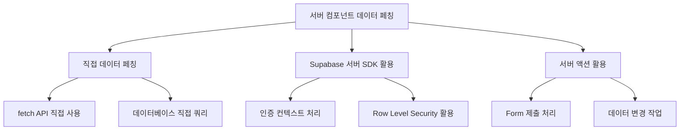

# E-Torch 데이터 흐름 및 API 연동

## 1. 개요

E-Torch 프로젝트의 데이터 흐름 및 API 연동 설계는 마이그레이션된 경제지표 데이터를 효율적으로 활용하고, 사용자에게 최적화된 시각화 환경을 제공하는 데 중점을 둡니다. 본 문서는 데이터의 흐름, 처리 과정, API 연동 전략을 설명합니다.

## 2. 데이터 아키텍처 개요

E-Torch의 데이터 아키텍처는 다음과 같은 주요 컴포넌트로 구성됩니다:


### 2.1 주요 데이터 컴포넌트

1. **데이터 소스**: 마이그레이션된 경제지표 데이터베이스, Supabase
2. **데이터 페칭 레이어**: API 클라이언트, 서버 액션, TanStack Query
3. **데이터 변환 레이어**: 데이터 정규화, 변환, 집계
4. **데이터 캐싱 레이어**: TanStack Query 캐시, 서버 컴포넌트 캐시
5. **상태 관리 레이어**: Zustand 스토어, React Context
6. **UI 컴포넌트**: 데이터 표시 및 사용자 상호작용
7. **사용자 상호작용**: 필터링, 정렬, 데이터 조작

### 2.2 아키텍처 계층과 데이터 흐름 통합

E-Torch의 데이터 흐름은 [`architecture.md`](./architecture.md)에 정의된 아키텍처 계층과 통합되어 동작합니다:

| 데이터 흐름 레이어 | 아키텍처 계층 | 주요 책임 | 구현 기술 |
|------------------|--------------|---------|----------|
| **데이터 소스** | 데이터 계층 | 원시 데이터 제공 | KOSIS, ECOS, OECD API |
| **데이터 페칭 레이어** | 데이터 계층 | API 통신, 서버 액션 | Fetch API, 서버 컴포넌트, API 클라이언트 |
| **데이터 변환 레이어** | 데이터 계층 | 원시 데이터 가공, 정규화 | 유틸리티 함수, 변환 서비스 |
| **데이터 캐싱 레이어** | 데이터 계층 | 데이터 임시 저장, 재사용 | Tanstack Query, Next.js 캐시 |
| **상태 관리 레이어** | 도메인 계층 | 클라이언트 상태 관리 | Zustand 스토어 |
| **UI 컴포넌트** | 프레젠테이션 계층 | 데이터 시각화, 사용자 인터랙션 | React 컴포넌트, Recharts |

## 3. 데이터 소스 구성

E-Torch는 마이그레이션된 경제지표 데이터와 Supabase를 사용하여 사용자 데이터 및 인증을 관리합니다.

### 3.1 주요 데이터 소스

| 데이터 소스 | 제공 데이터 유형 | 지원 주기 | API 유형 | 인증 방식 |
|------------|--------------|----------|---------|----------|
| **마이그레이션된 경제지표 DB** | KOSIS, ECOS, OECD 기반 경제지표 | D, M, Q, A | REST | Supabase JWT |
| **Supabase** | 사용자, 대시보드, 설정 등 | 실시간 | REST, Realtime | JWT |

### 3.2 인증 및 접근 제어


E-Torch는 Supabase를 통한 단일 인증 시스템을 사용합니다:

1. **통합 인증 구조**:
   - 사용자는 Supabase를 통해 SNS 계정(Google, Naver, Kakao)으로 인증
   - 인증된 사용자만 마이그레이션된 경제지표 데이터베이스에 접근 가능
   - JWT 토큰으로 모든 데이터 접근 권한 관리

2. **권한 관리**:
   - Supabase의 Row Level Security(RLS)를 통한 데이터 접근 제어
   - 사용자 역할 및 구독 상태에 따른 데이터 접근 제한
   - JWT 클레임에 포함된 사용자 정보를 통한 권한 검증

### 3.3 데이터 통합 전략

E-Torch는 다음과 같은 접근 방식으로 다양한 데이터 소스를 통합합니다:

1. **통합 데이터 모델**: 다양한 경제지표 데이터를 통합된 형식으로 관리
2. **표준화된 메타데이터**: 모든 데이터에 대한 일관된 메타데이터 관리
3. **소스 투명성**: 데이터 출처를 항상 명시하여 사용자에게 정보 제공
4. **동적 소스 선택**: 사용자가 동일 지표에 대해 소스 선택 가능
5. **점진적 데이터 로딩**: 필요한 데이터만 필요한 시점에 로딩

## 4. API 클라이언트 설계

### 4.1 API 클라이언트 아키텍처

E-Torch의 API 클라이언트는 모듈화된 구조를 가지며, 다음과 같은 계층으로 구성됩니다:


### 4.2 인증 통합

모든 API 요청은 Supabase를 통한 인증 흐름을 따릅니다:


### 4.3 도메인별 API 클라이언트

사용자, 대시보드, 경제지표 등 도메인 영역별 API 클라이언트를 구현하여 관심사를 분리합니다:

1. **경제지표 API 클라이언트**: 지표 데이터 조회 및 분석
2. **대시보드 API 클라이언트**: 대시보드 생성, 조회, 수정, 삭제
3. **사용자 API 클라이언트**: 사용자 프로필 관리, 구독 정보
4. **데이터 쿼리 API 클라이언트**: 복잡한 데이터 쿼리 처리

## 5. 데이터 페칭 전략

E-Torch는 다양한 데이터 페칭 전략을 사용하여 성능과 사용자 경험을 최적화합니다.

### 5.1 서버 컴포넌트에서의 데이터 페칭

Next.js 서버 컴포넌트를 사용한 데이터 페칭은 다음과 같은 패턴으로 구현됩니다:



#### 데이터 페칭 전략 매핑

| 사용 사례 | 권장 접근법 | 이유 |
|----------|------------|------|
| **공개 데이터 로드** | 직접 fetch API 호출 | 인증 없이 간단하게 데이터 로드 가능 |
| **사용자 인증이 필요한 데이터** | Supabase 서버 SDK | 서버 측에서 안전하게 인증 처리 및 데이터 접근 |
| **대량의 대시보드 데이터** | 최적화된 직접 쿼리 | 데이터 변환 및 필터링을 서버에서 효율적으로 처리 |
| **사용자 액션 기반 데이터 변경** | 서버 액션 | 폼 제출 및 클라이언트 상호작용과 연계된 데이터 처리 |

서버 컴포넌트에서의 데이터 페칭 패턴에 대한 상세 구현은 [`core-components.md`](./components/core-components.md) 문서를 참조하십시오.

### 5.2 TanStack Query를 활용한 클라이언트 데이터 페칭

1. **초기 데이터 활용**: 서버에서 제공한 초기 데이터로 시작
2. **지연 로딩**: 필요한 데이터만 지연 로딩
3. **캐싱 전략**: 적절한 캐싱을 통한 네트워크 요청 최소화
4. **자동 리페치**: 데이터 신선도를 유지하기 위한 자동 리페치
5. **낙관적 업데이트**: 사용자 경험 향상을 위한 낙관적 업데이트
6. **인증 통합**: Supabase 클라이언트를 TanStack Query와 통합하여 인증 관리

TanStack Query를 활용한 클라이언트 상태 관리에 대한 상세 구현은 [`state-management.md`](./state-management.md) 문서를 참조하십시오.

### 5.3 서버 액션을 활용한 데이터 변경

1. **안전한 데이터 변경**: 서버 측에서 데이터 유효성 검증 및 변경
2. **캐시 무효화**: 관련 페이지의 캐시 자동 무효화
3. **트랜잭션 보장**: 여러 데이터 변경의 원자성 보장
4. **인증 컨텍스트**: 서버 액션에서 사용자 인증 상태 유지 및 확인

서버 액션을 활용한 데이터 변경 패턴에 대한 상세 구현은 [`core-components.md`](./components/core-components.md) 문서를 참조하십시오.

## 6. 데이터 변환 및 처리 파이프라인

E-Torch는 경제지표 데이터 처리를 위한 파이프라인을 구현합니다.

### 6.1 데이터 파이프라인 구조


### 6.2 데이터 변환 유형

다양한 형태의 데이터 변환을 지원합니다:

1. **원본값**: 가공 없이 원본 데이터 사용
2. **기간 대비 변화율**: 직전 기간 대비 값의 변화율 계산
3. **전년 동기 대비 변화율**: 전년 동일 기간 대비 변화율 계산
4. **누적값**: 시간 경과에 따른 누적값 계산

### 6.3 소스별 데이터 통합 로직

E-Torch는 다양한 데이터 소스(KOSIS, ECOS, OECD)의 데이터를 통합하여 일관된 형식으로 처리합니다.

#### 6.3.1 통합 데이터 모델

모든 소스의 데이터를 통합된 표준 형식으로 변환합니다:

```typescript
// 정규화된 데이터 구조
interface NormalizedTimeSeriesData {
  source: "KOSIS" | "ECOS" | "OECD";
  indicatorCode: string;
  indicatorName: string;
  period: "D" | "M" | "Q" | "A";
  unit: string;
  data: Array<{
    date: string; // ISO 형식의 날짜 문자열
    value: number;
    formattedDate?: string; // 표시용 날짜 포맷
    metadata?: Record<string, any>; // 추가 메타데이터
  }>;
}
```

#### 6.3.2 결측치 처리 알고리즘

시계열 데이터의 결측치는 다음 방법으로 처리합니다:

```typescript
enum InterpolationMethod {
  LINEAR = "linear",
  PREVIOUS = "previous",
  NEXT = "next",
  ZERO = "zero",
  NONE = "none"
}

// 결측치 처리 함수 - 주요 알고리즘만 표시
function handleMissingValues(
  data: NormalizedTimeSeriesData,
  method: InterpolationMethod = InterpolationMethod.LINEAR
): NormalizedTimeSeriesData {
  // 결측치가 없거나 처리 불필요시 원본 반환
  if (method === InterpolationMethod.NONE || data.data.length <= 1) {
    return data;
  }

  // 데이터 처리 로직...
  // 1. 날짜별로 정렬
  // 2. 기대 간격 계산 (기간에 따라 다름)
  // 3. 결측치 위치 확인
  // 4. 선택한 방법으로 결측치 보간
  
  return processedData;
}
```

#### 6.3.3 기간 동기화 전략

서로 다른 주기의 데이터를 비교하거나 통합할 때 사용하는 전략입니다:

```typescript
enum SynchronizationMethod {
  UPSAMPLE = "upsample", // 낮은 주기를 높은 주기로 (연간→분기→월간→일간)
  DOWNSAMPLE = "downsample" // 높은 주기를 낮은 주기로 (일간→월간→분기→연간)
}

enum AggregationMethod {
  AVERAGE = "average",
  SUM = "sum",
  FIRST = "first",
  LAST = "last",
  MAX = "max",
  MIN = "min"
}

// 시계열 동기화 함수 - 주요 개념만 표시
function synchronizeTimeSeries(
  seriesArray: NormalizedTimeSeriesData[],
  targetPeriod: "D" | "M" | "Q" | "A",
  method: SynchronizationMethod = SynchronizationMethod.DOWNSAMPLE,
  aggregation: AggregationMethod = AggregationMethod.AVERAGE
): NormalizedTimeSeriesData[] {
  // 주기 우선순위: D > M > Q > A
  
  return seriesArray.map(series => {
    // 이미 타겟 주기와 같으면 변환 불필요
    if (series.period === targetPeriod) {
      return series;
    }
    
    // 업샘플링 (더 세분화된 주기로 변환: A→Q→M→D)
    if (method === SynchronizationMethod.UPSAMPLE) {
      return upsampleTimeSeries(series, targetPeriod);
    }
    
    // 다운샘플링 (더 넓은 주기로 변환: D→M→Q→A)
    return downsampleTimeSeries(series, targetPeriod, aggregation);
  });
}
```

### 6.4 데이터 다운샘플링 알고리즘

대량의 시계열 데이터를 효율적으로 시각화하기 위해 다음과 같은 데이터 다운샘플링 알고리즘을 적용합니다:

- **LTTB(Largest-Triangle-Three-Buckets)**: 시각적 특성을 보존하면서 데이터 포인트 수를 줄이는 알고리즘
- **M4 알고리즘**: 구간별 최대, 최소, 첫 값, 마지막 값을 유지하여 트렌드 보존
- **리샘플링**: 균등한 간격으로 데이터 포인트를 재배치

이 알고리즘들은 대시보드 성능 최적화를 위해 시각화 계층에서 활용됩니다.

```tsx
// LTTB(Largest-Triangle-Three-Buckets) 알고리즘
function downsampleTimeSeries(data: DataPoint[], targetPoints: number): DataPoint[] {
  // 데이터가 목표 포인트 수보다 적으면 그대로 반환
  if (data.length <= targetPoints) {
    return data;
  }
  
  // 결과 배열 초기화
  const sampled: DataPoint[] = [];
  
  // 첫 포인트는 항상 유지
  sampled.push(data[0]);
  
  // 각 버킷 크기 계산
  const bucketSize = (data.length - 2) / (targetPoints - 2);
  
  // 각 버킷에서 최적의 포인트 선택
  for (let i = 0; i < targetPoints - 2; i++) {
    // 현재 버킷의 시작과 끝 인덱스
    const startIdx = Math.floor((i) * bucketSize) + 1;
    const endIdx = Math.floor((i + 1) * bucketSize) + 1;
    
    // 이전 포인트와 다음 버킷의 평균 포인트
    const prevPoint = sampled[sampled.length - 1];
    const nextBucketAvg = calculateBucketAverage(data, endIdx, Math.min(endIdx + bucketSize, data.length));
    
    // 각 포인트의 삼각형 면적 계산하여 최대 면적을 가진 포인트 선택
    let maxArea = -1;
    let maxAreaIdx = startIdx;
    
    for (let j = startIdx; j < endIdx; j++) {
      const area = calculateTriangleArea(prevPoint, data[j], nextBucketAvg);
      if (area > maxArea) {
        maxArea = area;
        maxAreaIdx = j;
      }
    }
    
    // 선택된 포인트 추가
    sampled.push(data[maxAreaIdx]);
  }
  
  // 마지막 포인트는 항상 유지
  sampled.push(data[data.length - 1]);
  
  return sampled;
}
```

데이터 변환 및 처리 관련 상세 알고리즘은 `packages/data-sources` 모듈의 구현 코드를 참조하십시오.

## 7. 데이터 캐싱 전략

E-Torch는 다층적 캐싱 전략을 통해 성능을 최적화합니다. 이 섹션에서는 데이터 캐싱의 기술적 구현에 초점을 맞춥니다. 상태 관리 관점의 캐싱 전략은 [`state-management.md`](./state-management.md) 문서를 참조하십시오.

### 7.1 캐싱 계층 구조


## 7.2 캐시 무효화 전략

E-Torch는 데이터의 최신성과 일관성을 보장하기 위해 다음과 같은 캐시 무효화 전략을 구현합니다:

### 7.2.1 시간 기반 무효화

데이터 유형별로 적절한 캐시 만료 시간을 설정하여 자동 무효화를 구현합니다:

```typescript
// 지표 유형별 캐시 만료 시간 설정
const cacheTTLConfig = {
  'FINANCIAL_REALTIME': 60 * 1000, // 1분
  'FINANCIAL_DAILY': 30 * 60 * 1000, // 30분
  'ECONOMIC_MONTHLY': 3 * 60 * 60 * 1000, // 3시간
  'ECONOMIC_QUARTERLY': 12 * 60 * 60 * 1000 // 12시간
};
```

### 7.2.2 이벤트 기반 무효화

사용자 액션이나 서버 푸시에 의한 데이터 변경 시 관련 캐시를 즉시 무효화합니다:

- **사용자 액션**: 대시보드 저장, 차트 업데이트 등 사용자 액션 후 관련 캐시 무효화
- **웹훅**: Supabase 테이블 변경 이벤트에 구독하여 데이터 변경 시 캐시 무효화
- **서버 푸시**: 중요 데이터 업데이트 시 서버에서 클라이언트로 무효화 이벤트 전송

```typescript
// 서버 액션에서의 캐시 무효화 예시
export async function updateDashboardAction(dashboardId: string, data: any) {
  // 데이터 업데이트 로직...
  
  // 관련 캐시 무효화
  revalidatePath(`/dashboard/${dashboardId}`);
  revalidatePath('/dashboard');
  
  // 맞춤형 태그 기반 무효화
  revalidateTag(`dashboard-${dashboardId}`);
}
```

### 7.2.3 선택적 무효화

네트워크 요청을 최소화하기 위해 필요한 캐시만 선택적으로 무효화합니다:

```typescript
// TanStack Query에서의 선택적 쿼리 무효화
const invalidateDashboardCharts = (dashboardId: string, chartId?: string) => {
  if (chartId) {
    // 특정 차트 데이터만 무효화
    queryClient.invalidateQueries({ 
      queryKey: queryKeys.charts.detail(chartId)
    });
  } else {
    // 대시보드의 모든 차트 데이터 무효화
    queryClient.invalidateQueries({ 
      queryKey: queryKeys.charts.byDashboard(dashboardId)
    });
  }
  
  // 대시보드 메타데이터는 유지 (차트 데이터만 리페치)
};
```

### 7.2.4 선제적 리페치

중요 데이터의 경우 만료 전에 백그라운드에서 선제적으로 리페치하여 항상 최신 데이터를 유지합니다:

```typescript
// 금융 시장 데이터는 만료 15초 전에 백그라운드 리페치
useQuery({
  queryKey: ['market', 'realtime'],
  queryFn: fetchMarketData,
  staleTime: 60 * 1000, // 1분
  refetchInterval: 45 * 1000, // 45초마다 백그라운드 리페치
});
```

### 7.2.5 우선순위 기반 무효화

리소스 사용 최적화를 위해 캐시 무효화 우선순위를 설정합니다:

- **즉시 무효화**: 사용자가 현재 보고 있는 화면의 데이터
- **지연 무효화**: 백그라운드 데이터 또는 현재 화면에 표시되지 않는 데이터
- **조건부 무효화**: 특정 조건 충족 시에만 무효화 (예: 변경 감지된 경우)

```typescript
// IntersectionObserver를 활용한 가시성 기반 리페치
const { ref, inView } = useInView();
useQuery({
  queryKey: ['chart', chartId],
  queryFn: () => fetchChartData(chartId),
  // 화면에 보이는 차트만 자주 리페치
  refetchInterval: inView ? 30000 : false,
});

return <div ref={ref}>{/* 차트 컴포넌트 */}</div>;
```

이러한 다층적 캐시 무효화 전략을 통해 E-Torch는 데이터의 최신성을 보장하면서도 네트워크 요청과 서버 부하를 최소화합니다.

## 8. 클라이언트-서버 통신 최적화

### 8.1 요청 일괄 처리 (Request Batching)

여러 데이터 요청을 한 번의 네트워크 호출로 처리하는 전략으로, 특히 대시보드 데이터 로딩 시 활용합니다.

### 8.2 점진적 로딩 (Progressive Loading)

대시보드와 같은 복잡한 화면에서 중요한 데이터를 먼저 로드하고, 덜 중요한 데이터는 나중에 로드하는 전략을 사용합니다.

### 8.3 낙관적 UI 업데이트 (Optimistic UI)

사용자 액션 즉시 UI를 업데이트하고, 서버 응답을 기다리는 대신 성공을 가정하여 사용자 경험을 향상시킵니다.

## 9. 실시간 데이터 업데이트

E-Torch는 필요에 따라 실시간 또는 주기적 데이터 업데이트를 지원합니다.

### 9.1 주기적 데이터 폴링


### 9.2 Supabase Realtime을 활용한 실시간 업데이트

Supabase의 Realtime 기능을 활용하여 다음과 같은 실시간 협업 시나리오를 지원합니다:

- **대시보드 공동 편집**: 여러 사용자가 동시에 대시보드 편집
- **실시간 댓글 및 피드백**: 대시보드에 대한 실시간 댓글 및 피드백
- **알림**: 데이터 변경 또는 이벤트 발생 시 실시간 알림
- **사용자 상태 표시**: 현재 대시보드를 보고 있는 사용자 표시

구현 상세는 Supabase Realtime 문서를 참조하십시오.


## 10. 데이터 내보내기 및 공유

E-Torch는 데이터 및 시각화 결과를 다양한 형식으로 내보내고 공유하는 기능을 제공합니다.

### 10.1 차트 내보내기

사용자는 차트를 다양한 형식(PNG, SVG, CSV)으로 내보낼 수 있으며, 모든 내보내기에는 E-Torch 워터마크가 포함됩니다.

### 10.2 대시보드 공유


## 11. 오류 처리 및 복원 전략

E-Torch는 네트워크 오류, 서버 오류 등에 대한 강건한 오류 처리 전략을 구현합니다.

### 11.1 오류 처리 계층


### 11.2 복원 전략

1. **자동 재연결**: 네트워크 연결 복원 시 자동 데이터 동기화
2. **로컬 캐싱**: 오프라인 상태에서도 최근 데이터 접근 가능
3. **변경사항 큐**: 오프라인 상태에서 변경사항을 큐에 저장 후 연결 복원 시 적용
4. **점진적 성능 저하**: 일부 기능만 제한하여 핵심 기능 유지

## 12. 결론

E-Torch의 데이터 흐름 및 API 연동 아키텍처는 마이그레이션된 경제지표 데이터를 효율적으로 활용하고, Supabase를 통한 단일 인증 시스템으로 모든 데이터 접근을 관리합니다. 계층화된 데이터 아키텍처, 모듈화된 API 클라이언트, 최적화된 데이터 페칭 전략, 강력한 캐싱 메커니즘 등이 이를 가능하게 합니다.

특히 데이터 변환 및 처리 파이프라인은 다양한 경제지표 데이터를 일관된 형태로 변환하여 차트와 대시보드 컴포넌트에서 쉽게 사용할 수 있도록 합니다. 또한 낙관적 UI 업데이트, 요청 일괄 처리, 점진적 로딩 등의 최적화 기법은 대량 데이터 처리 시에도 우수한 사용자 경험을 보장합니다.

Supabase의 실시간 기능과 결합된 실시간 데이터 업데이트, 데이터 내보내기 및 공유, 오류 처리 및 복원 전략 등은 E-Torch가 실무적인 요구사항을 충족하는 강력한 경제지표 대시보드 서비스로 기능할 수 있게 합니다.
