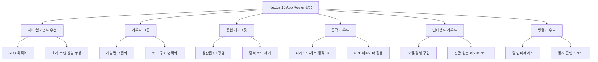
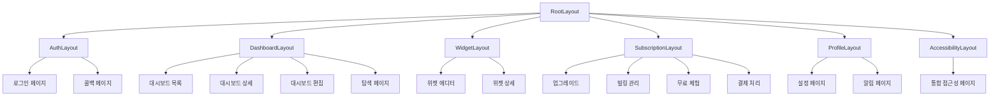
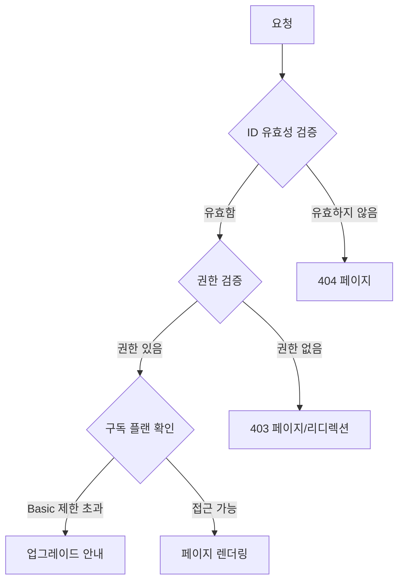
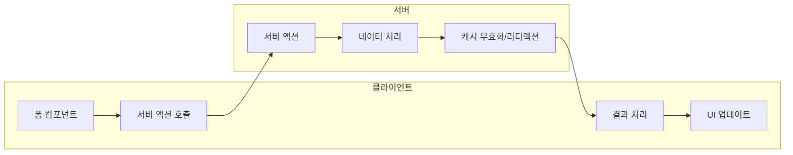

# E-Torch 라우팅 구조

## 1. 개요

E-Torch는 Next.js 15 App Router를 활용하여 직관적이고 체계적인 라우팅 구조를 구현합니다. 이 문서는 E-Torch의 라우팅 아키텍처, 페이지 구성, 라우트 그룹, 레이아웃, 그리고 내비게이션 전략을 설명합니다.

## 2. Next.js 15 App Router 활용 전략

Next.js 15의 App Router 파일 시스템 기반 라우팅을 활용하여 다음과 같은 기능들을 구현합니다:



## 3. 라우팅 구조 설계

E-Torch의 라우팅 구조는 `architecture.md`에 정의된 모노레포 패키지 구조와 통합되어 기능별로 그룹화됩니다:

```mermaid
graph TD
    Root[app/] --> Auth["(auth)/"]
    Root --> Dashboard["(dashboard)/"]
    Root --> Widget["(widget)/"]
    Root --> Subscription["(subscription)/"]
    Root --> Profile["(profile)/"]
    Root --> API["api/"]
    Root --> Layout["layout.tsx"]
    Root --> Page["page.tsx"]
    
    Auth --> Auth1["login/"]
    Auth --> Auth2["callback/"]
    Auth --> AuthLayout["layout.tsx"]
    
    Dashboard --> Dash1["dashboard/"]
    Dashboard --> Dash2["dashboard/[id]/"]
    Dashboard --> Dash3["dashboard/new/"]
    Dashboard --> Dash4["dashboard/[id]/edit/"]
    Dashboard --> Dash5["explore/"]
    Dashboard --> DashLayout["layout.tsx"]
    
    Widget --> Widget1["widget-editor/[id]/"]
    Widget --> Widget2["widget/[id]/"]
    Widget --> WidgetLayout["layout.tsx"]
    
    Subscription --> Sub1["subscription/upgrade/"]
    Subscription --> Sub2["subscription/billing/"]
    Subscription --> Sub3["subscription/trial/"]
    Subscription --> Sub4["subscription/payment/"]
    Subscription --> SubLayout["layout.tsx"]
    
    Profile --> Prof1["profile/settings/"]
    Profile --> Prof2["profile/notifications/"]
    Profile --> ProfLayout["layout.tsx"]
    
    API --> API1["auth/"]
    API --> API2["charts/"]
    API --> API3["dashboards/"]
    API --> API4["data-sources/"]
    API --> API5["payments/"]
```



## 4. 기본 및 확장 라우팅 구조

E-Torch의 라우팅 구조는 **기본 라우팅**과 **확장 라우팅**으로 구분됩니다. 이는 개발 단계와 기능 구현 우선순위에 따라 점진적으로 구현됩니다.

### 4.1 기본 라우팅 구조

기본 라우팅 구조는 제품의 핵심 기능을 제공하는 필수 경로로 구성됩니다. 이는 MVP(Minimum Viable Product) 단계에서 우선적으로 구현됩니다.

```
app/
├── (auth)/               # 인증 관련 라우트 그룹
│   ├── login/            # SNS 로그인 페이지 (Google, Naver, Kakao)
│   ├── callback/         # OAuth 콜백 처리
│   └── layout.tsx        # 인증 레이아웃
│
├── (dashboard)/          # 대시보드 관련 라우트 그룹
│   ├── dashboard/        # 대시보드 목록 페이지
│   ├── dashboard/[id]/   # 개별 대시보드 상세 페이지
│   ├── dashboard/new/    # 새 대시보드 생성 페이지
│   ├── dashboard/[id]/edit/ # 대시보드 편집 페이지
│   ├── explore/          # 공개 대시보드 탐색/발견 페이지
│   └── layout.tsx        # 대시보드 레이아웃
│
├── (widget)/             # 위젯 관련 라우트 그룹
│   ├── widget-editor/[id]/ # 위젯 에디터 페이지 (5가지 차트형 + 2가지 텍스트형)
│   ├── widget/[id]/      # 개별 위젯 상세 페이지
│   └── layout.tsx        # 위젯 레이아웃
│
├── (subscription)/       # 구독 관련 라우트 그룹
│   ├── subscription/upgrade/ # Pro 플랜 업그레이드
│   ├── subscription/billing/ # 결제 내역 및 빌링 관리
│   ├── subscription/trial/   # 7일 무료 체험
│   ├── subscription/payment/ # 토스페이먼츠 결제 처리
│   │   ├── success/      # 결제 성공
│   │   ├── fail/         # 결제 실패
│   │   └── cancel/       # 결제 취소
│   └── layout.tsx        # 구독 레이아웃
│
├── (profile)/            # 사용자 프로필 관련 라우트 그룹
│   ├── profile/settings/ # 프로필 설정 페이지
│   ├── profile/notifications/ # 알림 설정 페이지
│   └── layout.tsx        # 프로필 레이아웃
│
├── accessibility/        # 통합 접근성 지원 페이지
│   └── page.tsx          # 키보드 도움말, 스크린 리더 가이드, 고대비 모드를 탭으로 통합
│
├── layout.tsx            # 루트 레이아웃
└── page.tsx              # 홈페이지
```

### 4.2 확장 라우팅 구조

확장 라우팅 구조는 향상된 사용자 경험을 위한 고급 라우팅 패턴을 포함합니다. 이는 기본 기능 구현 후 점진적으로 추가됩니다.

```
# 기본 라우팅 구조에 다음과 같은 확장 패턴 추가

app/
├── @modal/               # 인터셉트 라우트 (선별적 모달용)
│   ├── dashboard/[id]/   # 대시보드 미리보기 모달 (높은 사용 빈도)
│   └── subscription/upgrade/ # 업그레이드 모달 (컨텍스트 유지 필요)
│
├── (dashboard)/          
│   └── @tabs/            # 병렬 라우트 (대시보드 탭용)
│       ├── info/         # 대시보드 정보 탭
│       ├── share/        # 대시보드 공유 탭
│       └── analytics/    # 대시보드 분석 탭
│
├── (widget)/              
│   ├── widget-editor/[id]/
│   │   ├── @preview/     # 미리보기 패널 (병렬 라우트)
│   │   ├── @options/     # 옵션 패널 (병렬 라우트)
│   │   └── @datasource/  # 데이터 소스 패널 (병렬 라우트)
│   └── preview/          # 위젯 미리보기 페이지
│
└── [locale]/             # 국제화 대응 (향후 확장)
    ├── (dashboard)/
    ├── (auth)/
    └── middleware.ts     # 언어 감지 및 리디렉션
```

### 4.3 라우팅 유형 매핑 테이블

| 경로 | 기본/확장 | 라우팅 패턴 | 구현 우선순위 | 구독 플랜 제한 |
|-----|-----------|-----------|-------------|-------------|
| `/login`, `/callback` | 기본 | 일반 라우트 | 상 (MVP) | 없음 |
| `/dashboard`, `/dashboard/[id]` | 기본 | 일반 라우트 | 상 (MVP) | Basic: 3개, Pro: 무제한 |
| `/dashboard/new`, `/dashboard/[id]/edit` | 기본 | 일반 라우트 | 상 (MVP) | Basic: 6개 위젯, Pro: 무제한 |
| `/explore` | 기본 | 일반 라우트 | 상 (MVP) | 없음 |
| `/widget-editor/[id]`, `/widget/[id]` | 기본 | 동적 라우트 | 상 (MVP) | Basic: 기본 옵션, Pro: 고급 옵션 |
| `/subscription/*` | 기본 | 일반 라우트 | 상 (MVP) | 없음 |
| `/profile/*` | 기본 | 일반 라우트 | 중 | 없음 |
| `/accessibility` | 기본 | 일반 라우트 | 중 | 없음 |
| `@modal/dashboard/[id]` | 확장 | 인터셉트 라우트 | 중 | 없음 |
| `@tabs/*` | 확장 | 병렬 라우트 | 하 | 없음 |
| `[locale]/*` | 확장 | 국제화 라우트 | 하 | 없음 |

## 5. 페이지별 라우트 설계

### 5.1 인증 관련 페이지

| 라우트 | 설명 | 권한 | 컴포넌트 타입 | SNS 연동 |
|-------|------|------|--------------|----------|
| `/login` | SNS 로그인 페이지 | Public | 서버 + 클라이언트 폼 | Google, Naver, Kakao |
| `/callback` | OAuth 콜백 처리 | Public | 서버 컴포넌트 | Supabase Auth |

### 5.2 대시보드 관련 페이지

| 라우트 | 설명 | 권한 | 컴포넌트 타입 | 구독 플랜 제한 |
|-------|------|------|--------------|-------------|
| `/dashboard` | 대시보드 목록 | Authenticated | 서버 + 클라이언트 기능 | Basic: 최대 3개 |
| `/dashboard/[id]` | 대시보드 상세 조회 | Authenticated | 서버 + 클라이언트 차트 | Basic: 워터마크 표시 |
| `/dashboard/new` | 새 대시보드 생성 | Authenticated | 서버 + 클라이언트 에디터 | Basic: 3개 한도 확인 |
| `/dashboard/[id]/edit` | 대시보드 편집 | Owner | 서버 + 클라이언트 에디터 | Basic: 6개 위젯 한도 |
| `/explore` | 공개 대시보드 탐색 | Authenticated | 서버 + 클라이언트 필터링 | Basic: 복사 불가 |

### 5.3 위젯 관련 페이지

| 라우트 | 설명 | 권한 | 컴포넌트 타입 | 지원 위젯 유형 |
|-------|------|------|--------------|-------------|
| `/widget-editor/[id]` | 위젯 생성/편집 | Authenticated | 서버 + 클라이언트 에디터 | 5가지 차트형 + 2가지 텍스트형 |
| `/widget/[id]` | 개별 위젯 상세 조회 | Authenticated | 서버 + 클라이언트 차트 | 모든 위젯 유형 |

### 5.4 구독 관련 페이지

| 라우트 | 설명 | 권한 | 컴포넌트 타입 | 토스페이먼츠 연동 |
|-------|------|------|--------------|-----------------|
| `/subscription/upgrade` | Pro 플랜 업그레이드 | Authenticated | 서버 + 클라이언트 폼 | 결제 위젯 |
| `/subscription/billing` | 결제 내역 및 빌링 관리 | Authenticated | 서버 + 클라이언트 | 빌링키 관리 |
| `/subscription/trial` | 7일 무료 체험 | Authenticated | 서버 + 클라이언트 | 체험 시작 |
| `/subscription/payment/success` | 결제 성공 | Public | 서버 컴포넌트 | 결과 처리 |
| `/subscription/payment/fail` | 결제 실패 | Public | 서버 컴포넌트 | 에러 처리 |
| `/subscription/payment/cancel` | 결제 취소 | Public | 서버 컴포넌트 | 취소 처리 |

### 5.5 프로필 관련 페이지

| 라우트 | 설명 | 권한 | 컴포넌트 타입 | 기능 |
|-------|------|------|--------------|------|
| `/profile/settings` | 사용자 설정 | Authenticated | 서버 + 클라이언트 폼 | 프로필 편집 |
| `/profile/notifications` | 알림 설정 | Authenticated | 서버 + 클라이언트 토글 | 구독 갱신 알림 |

### 5.6 접근성 지원 페이지

| 라우트 | 설명 | 권한 | 컴포넌트 타입 | 기능 |
|-------|------|------|--------------|------|
| `/accessibility` | 통합 접근성 지원 | Public | 서버 + 클라이언트 탭 | 키보드 도움말, 스크린 리더 가이드, 고대비 모드 |

## 6. 레이아웃 구조

E-Torch는 계층적 레이아웃 구조를 사용하여 일관된 사용자 경험을 제공합니다:



### 6.1 레이아웃 책임 분리

각 레이아웃은 명확한 책임을 갖는 구조로 설계되어 있습니다:

| 레이아웃 | 책임 |
|---------|-----|
| **RootLayout** | 전역 CSS/폰트(Inter, JetBrains_Mono), 테마 제공자, 메타데이터, OKLCH 색상 시스템, 전역 에러 바운더리 |
| **AuthLayout** | 최소 디자인, 로고 및 설명, 중앙 정렬 컨테이너 |
| **DashboardLayout** | 사이드 내비게이션, 상단 헤더, 메인 콘텐츠 영역, 구독 상태 표시 |
| **WidgetLayout** | 상단 헤더, 전체 화면 콘텐츠, 백 버튼, 저장 상태 |
| **SubscriptionLayout** | 결제 보안 헤더, 진행 상태 표시, 토스페이먼츠 스크립트 로드 |
| **ProfileLayout** | 사이드 내비게이션, 상단 헤더, 메인 콘텐츠 영역 |
| **AccessibilityLayout** | 접근성 최적화 헤더, 탭 네비게이션, 고대비 모드 지원 |

## 7. 동적 라우팅 전략

### 7.1 대시보드 및 위젯 ID 라우팅 패턴

동적 ID 기반 라우팅은 다음과 같은 패턴으로 구현됩니다:

```tsx
// app/(dashboard)/dashboard/[id]/page.tsx (서버 컴포넌트)
import { fetchDashboardById } from '@/e-torch/server-api/dashboard';
import { notFound } from 'next/navigation';
import { DashboardServerWrapper } from '@/e-torch/dashboard/server';

interface DashboardPageProps {
  params: { id: string };
}

export default async function DashboardPage({ params }: DashboardPageProps) {
  const dashboard = await fetchDashboardById(params.id);
  
  if (!dashboard) {
    return notFound();
  }
  
  return <DashboardServerWrapper dashboardId={params.id} initialData={dashboard} />;
}
```

### 7.2 동적 라우트 접근 제어 패턴



## 8. 네비게이션 및 라우트 보호

### 8.1 네비게이션 컴포넌트 구조

E-Torch의 네비게이션 시스템은 다음과 같은 주요 컴포넌트로 구성됩니다:

- **SideNavigation**: 주요 메뉴 항목 및 네비게이션 링크 제공
- **HeaderNavigation**: 현재 페이지 제목, 사용자 메뉴, 구독 상태 표시
- **BreadcrumbNavigation**: 현재 위치 및 상위 카테고리 표시

### 8.2 라우트 보호 아키텍처

라우트 보호는 다층적 접근으로 구현됩니다:

1. **최적화된 미들웨어 보호**:
   - JWT 토큰 로컬 검증 우선
   - 필요시에만 Supabase 세션 검증
   - 구독 플랜별 접근 제한
   - 인증 필요 시 리다이렉션

```tsx
// middleware.ts
import { createMiddlewareClient } from '@supabase/auth-helpers-nextjs';
import { isValidJWT, getCachedSession } from '@/lib/auth-utils';

export async function middleware(request: NextRequest) {
  const pathname = request.nextUrl.pathname;
  
  // 공개 라우트는 통과
  if (publicRoutes.some(route => pathname.startsWith(route))) {
    return NextResponse.next();
  }
  
  // JWT 토큰 로컬 검증 우선
  const token = request.cookies.get('supabase-auth-token')?.value;
  if (token && isValidJWT(token)) {
    // 토큰이 유효하면 바로 통과 (성능 최적화)
    return NextResponse.next();
  }
  
  // 세션 캐시 확인
  const cachedSession = await getCachedSession(request);
  if (cachedSession?.isValid) {
    return NextResponse.next();
  }
  
  // 필요시에만 Supabase 세션 검증
  const res = NextResponse.next();
  const supabase = createMiddlewareClient({ req: request, res });
  
  const { data: { session } } = await supabase.auth.getSession();
  
  if (!session) {
    const url = new URL('/login', request.url);
    url.searchParams.set('redirectTo', pathname);
    return NextResponse.redirect(url);
  }
  
  // 구독 플랜별 접근 제한
  const userPlan = session.user.app_metadata?.subscription_plan || 'basic';
  
  // Pro 전용 기능 보호
  const proOnlyRoutes = [
    '/dashboard/[id]/copy',
    '/dashboard/[id]/embed',
    '/widget-editor/[id]/advanced'
  ];
  
  if (proOnlyRoutes.some(route => pathname.match(route.replace('[id]', '\\w+')))) {
    if (userPlan !== 'pro') {
      return NextResponse.redirect(new URL('/subscription/upgrade', request.url));
    }
  }
  
  return res;
}
```

2. **서버 컴포넌트 보호**:
   - 세션 검증
   - 권한 검증
   - 리다이렉션/404 처리

3. **클라이언트 래퍼 보호**:
   - AuthGuard 컴포넌트
   - 세션 상태 검사
   - 로딩 상태 처리

### 8.3 구독 플랜 검증 최적화

구독 플랜 검증 로직을 커스텀 훅으로 중앙화하여 중복을 제거합니다:

```tsx
// hooks/useSubscriptionGuard.ts
import { useAuth } from '@/lib/auth';
import { useRouter } from 'next/navigation';
import { useEffect } from 'react';

export function useSubscriptionGuard(requiredPlan: 'basic' | 'pro' = 'basic') {
  const { user, plan, isLoading } = useAuth();
  const router = useRouter();
  
  useEffect(() => {
    if (!isLoading && plan && !hasAccess(plan, requiredPlan)) {
      router.push('/subscription/upgrade');
    }
  }, [plan, requiredPlan, isLoading, router]);
  
  const hasAccess = (currentPlan: string, required: string) => {
    if (required === 'basic') return true;
    if (required === 'pro') return currentPlan === 'pro';
    return false;
  };
  
  return { 
    canAccess: hasAccess(plan, requiredPlan), 
    isLoading,
    needsUpgrade: !hasAccess(plan, requiredPlan)
  };
}

// 사용 예시
export function ProFeatureComponent() {
  const { canAccess, isLoading, needsUpgrade } = useSubscriptionGuard('pro');
  
  if (isLoading) return <LoadingSpinner />;
  if (needsUpgrade) return <UpgradePrompt />;
  
  return <ProFeatureContent />;
}
```

## 9. API 라우팅 구조

### 9.1 데이터 소스별 API 라우팅

```
app/api/
├── auth/                 # Supabase Auth 연동
│   ├── login/route.ts    # SNS 로그인 처리
│   ├── logout/route.ts   # 로그아웃 처리
│   └── session/route.ts  # 세션 확인
│
├── data/                 # 경제지표 데이터 API
│   ├── kosis/            # KOSIS 데이터 소스
│   │   ├── indicators/route.ts    # 지표 목록 (MVP 12개)
│   │   └── series/[id]/route.ts   # 시계열 데이터
│   ├── ecos/             # ECOS 데이터 소스
│   │   ├── indicators/route.ts    # 지표 목록 (MVP 8개)
│   │   └── series/[id]/route.ts   # 시계열 데이터
│   └── combined/route.ts # 다중 소스 통합 조회
│
├── dashboards/           # 대시보드 관리
│   ├── route.ts          # 목록 조회, 생성
│   ├── [id]/route.ts     # 상세 조회, 수정, 삭제
│   ├── [id]/copy/route.ts # 복사 (Pro 전용)
│   └── [id]/embed/route.ts # 임베드 코드 (Pro 전용)
│
├── widgets/              # 위젯 관리
│   ├── route.ts          # 목록 조회, 생성
│   └── [id]/route.ts     # 상세 조회, 수정, 삭제
│
├── payments/             # 토스페이먼츠 연동
│   ├── create/route.ts   # 결제 생성
│   ├── confirm/route.ts  # 결제 승인
│   ├── webhook/route.ts  # 웹훅 처리
│   └── billing/route.ts  # 빌링키 관리
│
└── subscription/         # 구독 관리
    ├── status/route.ts   # 구독 상태 조회
    ├── upgrade/route.ts  # 플랜 업그레이드
    ├── cancel/route.ts   # 구독 취소
    └── trial/route.ts    # 무료 체험 시작
```

### 9.2 구독 플랜별 API 접근 제한

| API 경로 | Basic 플랜 | Pro 플랜 | 제한 내용 |
|----------|-----------|----------|----------|
| `/api/data/*/indicators` | 20개 지표 | 40개 지표 | 지표 목록 필터링 |
| `/api/data/*/series` | 최근 3년 | 전체 기간 | 데이터 기간 제한 |
| `/api/dashboards` | 최대 3개 | 무제한 | 생성 개수 제한 |
| `/api/dashboards/[id]/copy` | 접근 불가 | 접근 가능 | 기능 제한 |
| `/api/dashboards/[id]/embed` | 접근 불가 | 접근 가능 | 기능 제한 |
| `/api/widgets` | 대시보드당 6개 | 무제한 | 생성 개수 제한 |

## 10. 클라이언트 측 네비게이션 최적화

### 10.1 효율적인 네비게이션 패턴

```tsx
// 링크 컴포넌트 사용 예시 - OKLCH 색상 시스템 활용
import Link from 'next/link';

export function DashboardCard({ dashboard }) {
  return (
    <Link 
      href={`/dashboard/${dashboard.id}`}
      prefetch={true}
      className="rounded-lg border bg-card shadow-sm hover:bg-muted/50 transition-colors"
    >
      <div className="p-4">
        <h3 className="text-xl font-semibold leading-snug">{dashboard.title}</h3>
        <p className="text-sm text-muted-foreground">{dashboard.description}</p>
      </div>
    </Link>
  );
}

// 프로그래매틱 네비게이션
import { useRouter } from 'next/navigation';

export function SaveButton({ dashboardId, onSave }) {
  const router = useRouter();
  
  const handleSave = async () => {
    const result = await onSave();
    if (result.success) {
      router.push(`/dashboard/${dashboardId}`);
    }
  };
  
  return (
    <button 
      onClick={handleSave} 
      className="inline-flex items-center justify-center whitespace-nowrap rounded-md text-sm font-medium ring-offset-background transition-colors bg-primary text-primary-foreground hover:bg-primary/90 h-10 px-4 py-2"
    >
      저장
    </button>
  );
}
```

### 10.2 선별적 모달 라우팅 구조

높은 사용 빈도와 컨텍스트 유지가 중요한 경우에만 인터셉트 라우트를 적용합니다:

```
app/
├── dashboard/[id]/
│   └── page.tsx         # 일반 대시보드 페이지
│
└── @modal/
    ├── dashboard/[id]/
    │   └── page.tsx     # 대시보드 미리보기 모달 (높은 사용 빈도)
    └── subscription/upgrade/
        └── page.tsx     # 업그레이드 모달 (컨텍스트 유지 중요)
```

```tsx
// app/@modal/dashboard/[id]/page.tsx
import { fetchDashboardById } from '@/e-torch/server-api/dashboard';
import { DashboardModalContent } from '@/e-torch/dashboard/components/dashboard-modal-content';

export default async function DashboardModal({ params }) {
  const dashboard = await fetchDashboardById(params.id);
  
  return (
    <div className="fixed inset-0 z-50 bg-background/80 backdrop-blur-sm">
      <div className="fixed left-1/2 top-1/2 z-50 max-h-[85vh] w-[90%] max-w-3xl -translate-x-1/2 -translate-y-1/2 rounded-lg border bg-card p-6 shadow-lg">
        <h2 className="text-xl font-semibold leading-snug">{dashboard.title}</h2>
        <DashboardModalContent dashboard={dashboard} />
      </div>
    </div>
  );
}
```

## 11. 메타데이터 전략

### 11.1 메타데이터 계층 구조

```tsx
// app/layout.tsx (기본 메타데이터)
import { Inter, JetBrains_Mono } from 'next/font/google';
import '@e-torch/ui/styles/globals.css';

const inter = Inter({ 
  subsets: ['latin'],
  variable: '--font-inter'
});

const jetBrainsMono = JetBrains_Mono({
  subsets: ['latin'],
  variable: '--font-jetbrains-mono'
});

export const metadata: Metadata = {
  title: {
    template: '%s | E-Torch',
    default: 'E-Torch - 경제지표 대시보드 서비스',
  },
  description: '다양한 출처의 경제지표 데이터를 시각화하는 대시보드 서비스',
  keywords: ['경제지표', 'KOSIS', 'ECOS', '대시보드', '데이터 시각화'],
  authors: [{ name: 'E-Torch Team' }],
  openGraph: {
    type: 'website',
    locale: 'ko_KR',
    url: 'https://e-torch.com',
    siteName: 'E-Torch',
  },
};

export default function RootLayout({ children }) {
  return (
    <html lang="ko" className={`${inter.variable} ${jetBrainsMono.variable}`}>
      <body>
        <GlobalErrorBoundary>
          {children}
        </GlobalErrorBoundary>
      </body>
    </html>
  );
}

// app/(dashboard)/layout.tsx (섹션 메타데이터)
export const metadata: Metadata = {
  title: 'Dashboard',
  description: '대시보드를 관리하고 시각화하세요',
};

// app/(dashboard)/dashboard/[id]/page.tsx (동적 메타데이터)
export async function generateMetadata({ params }: { params: { id: string } }): Promise<Metadata> {
  const dashboard = await fetchDashboardById(params.id);
  const userPlan = await getUserPlan();
  
  if (!dashboard) {
    return {
      title: 'Dashboard Not Found',
    };
  }
  
  return {
    title: dashboard.title,
    description: dashboard.description || '대시보드 상세 정보',
    openGraph: {
      // Pro 사용자는 워터마크 없는 이미지
      images: [userPlan === 'pro' ? dashboard.thumbnail : dashboard.thumbnailWithWatermark],
    },
  };
}
```

## 12. 서버 액션 활용 전략

Next.js 서버 액션을 활용하여 클라이언트-서버 통신을 간소화합니다. 이 섹션에서는 서버 액션의 라우팅 관점에서의 활용에 초점을 맞춥니다.

### 12.1 서버 액션 워크플로우



### 12.2 개선된 서버 액션 패턴

- **폼 제출 처리**: 사용자 입력 검증 및 데이터베이스 저장 (`/dashboard/new`, `/dashboard/edit`)
- **구독 플랜 검증**: 플랜별 제한 확인 및 업그레이드 유도
- **캐시 무효화**: 관련 페이지의 캐시 자동 무효화 (`revalidatePath`)
- **리디렉션**: 액션 완료 후 적절한 페이지로 이동 (`redirect`)
- **향상된 에러 처리**: 구체적 에러 타입별 처리 및 로깅

```tsx
// app/actions/dashboard.ts
'use server';

import { revalidatePath } from 'next/cache';
import { redirect } from 'next/navigation';
import { saveDashboard } from '@/e-torch/server-api/dashboard';
import { getCurrentUser } from '@/e-torch/server-api/auth';
import { ValidationError, QuotaExceededError } from '@/lib/errors';
import { logger } from '@/lib/logger';

export async function saveDashboardAction(formData: FormData | Record<string, any>) {
  const user = await getCurrentUser();
  if (!user) {
    return { success: false, error: '인증되지 않은 사용자' };
  }
  
  // 구독 플랜별 제한 검증
  if (user.plan === 'basic') {
    const dashboardCount = await getUserDashboardCount(user.id);
    if (dashboardCount >= 3) {
      redirect('/subscription/upgrade?reason=dashboard_limit');
    }
  }
  
  try {
    const dashboardData = formData instanceof FormData 
      ? Object.fromEntries(formData.entries())
      : formData;
    
    dashboardData.userId = user.id;
    dashboardData.updatedAt = new Date().toISOString();
    
    const result = await saveDashboard(dashboardData);
    
    // 캐시 무효화
    revalidatePath(`/dashboard/${result.id}`);
    revalidatePath('/dashboard');
    
    return { success: true, data: result };
  } catch (error) {
    // 구체적 에러 타입별 처리
    if (error instanceof ValidationError) {
      return { 
        success: false, 
        error: '입력값을 확인해주세요', 
        field: error.field,
        details: error.details
      };
    }
    
    if (error instanceof QuotaExceededError) {
      redirect('/subscription/upgrade?reason=quota_exceeded');
    }
    
    // 로깅 및 모니터링
    logger.error('Dashboard save failed', { 
      error: error.message, 
      userId: user.id,
      dashboardData: dashboardData 
    });
    
    return { 
      success: false, 
      error: '일시적 오류가 발생했습니다. 잠시 후 다시 시도해주세요.'
    };
  }
}
```

### 12.3 구독 플랜별 서버 액션 제한

```tsx
// app/actions/subscription.ts
'use server';

export async function createWidgetAction(widgetData: any) {
  const user = await getCurrentUser();
  
  try {
    // Basic 플랜 위젯 개수 제한
    if (user.plan === 'basic') {
      const widgetCount = await getUserWidgetCount(user.id, widgetData.dashboardId);
      if (widgetCount >= 6) {
        redirect('/subscription/upgrade?reason=widget_limit');
      }
    }
    
    // 위젯 생성 로직
    const result = await createWidget(widgetData);
    
    revalidatePath(`/dashboard/${widgetData.dashboardId}/edit`);
    return { success: true, data: result };
  } catch (error) {
    logger.error('Widget creation failed', { 
      error: error.message, 
      userId: user.id,
      widgetData 
    });
    
    return { 
      success: false, 
      error: '위젯 생성에 실패했습니다.' 
    };
  }
}
```

## 13. 에러 처리 및 로딩 최적화

### 13.1 표준화된 에러 처리 시스템

```tsx
// app/error-boundary.tsx
'use client';

import { useEffect } from 'react';
import { logger } from '@/lib/logger';

type ErrorType = 'SUBSCRIPTION_REQUIRED' | 'NETWORK_ERROR' | 'VALIDATION_ERROR' | 'UNKNOWN';

function classifyError(error: Error): ErrorType {
  if (error.message.includes('subscription')) return 'SUBSCRIPTION_REQUIRED';
  if (error.message.includes('network') || error.name === 'NetworkError') return 'NETWORK_ERROR';
  if (error.name === 'ValidationError') return 'VALIDATION_ERROR';
  return 'UNKNOWN';
}

export function GlobalErrorBoundary({ 
  error, 
  reset 
}: { 
  error: Error & { digest?: string }; 
  reset: () => void; 
}) {
  const errorType = classifyError(error);
  
  useEffect(() => {
    // 에러 로깅
    logger.error('Global error boundary triggered', {
      error: error.message,
      stack: error.stack,
      digest: error.digest,
      type: errorType
    });
  }, [error, errorType]);
  
  const renderErrorContent = () => {
    switch (errorType) {
      case 'SUBSCRIPTION_REQUIRED':
        return (
          <div className="text-center p-6">
            <h2 className="text-2xl font-bold mb-4">업그레이드가 필요합니다</h2>
            <p className="text-muted-foreground mb-6">
              이 기능을 사용하려면 Pro 플랜으로 업그레이드하세요.
            </p>
            <a 
              href="/subscription/upgrade" 
              className="inline-flex items-center justify-center rounded-md bg-primary px-4 py-2 text-sm font-medium text-primary-foreground hover:bg-primary/90"
            >
              Pro 플랜 보기
            </a>
          </div>
        );
      
      case 'NETWORK_ERROR':
        return (
          <div className="text-center p-6">
            <h2 className="text-2xl font-bold mb-4">연결 오류</h2>
            <p className="text-muted-foreground mb-6">
              네트워크 연결을 확인하고 다시 시도해주세요.
            </p>
            <button 
              onClick={reset}
              className="inline-flex items-center justify-center rounded-md bg-primary px-4 py-2 text-sm font-medium text-primary-foreground hover:bg-primary/90"
            >
              다시 시도
            </button>
          </div>
        );
      
      case 'VALIDATION_ERROR':
        return (
          <div className="text-center p-6">
            <h2 className="text-2xl font-bold mb-4">입력 오류</h2>
            <p className="text-muted-foreground mb-6">
              입력값을 확인하고 다시 시도해주세요.
            </p>
            <button 
              onClick={reset}
              className="inline-flex items-center justify-center rounded-md bg-primary px-4 py-2 text-sm font-medium text-primary-foreground hover:bg-primary/90"
            >
              돌아가기
            </button>
          </div>
        );
      
      default:
        return (
          <div className="text-center p-6">
            <h2 className="text-2xl font-bold mb-4">오류가 발생했습니다</h2>
            <p className="text-muted-foreground mb-6">
              일시적인 오류입니다. 잠시 후 다시 시도해주세요.
            </p>
            <div className="space-x-4">
              <button 
                onClick={reset}
                className="inline-flex items-center justify-center rounded-md bg-primary px-4 py-2 text-sm font-medium text-primary-foreground hover:bg-primary/90"
              >
                다시 시도
              </button>
              <a 
                href="/dashboard"
                className="inline-flex items-center justify-center rounded-md border border-input bg-background px-4 py-2 text-sm font-medium hover:bg-accent hover:text-accent-foreground"
              >
                홈으로 이동
              </a>
            </div>
          </div>
        );
    }
  };
  
  return (
    <div className="min-h-screen flex items-center justify-center">
      <div className="max-w-md w-full">
        {renderErrorContent()}
      </div>
    </div>
  );
}
```

### 13.2 로딩 및 에러 처리 구조

```
app/
├── (dashboard)/
│   ├── dashboard/
│   │   ├── loading.tsx    # 대시보드 목록 로딩
│   │   ├── error.tsx      # 대시보드 목록 에러
│   │   └── [id]/
│   │       ├── loading.tsx # 개별 대시보드 로딩
│   │       └── error.tsx   # 개별 대시보드 에러
│   └── explore/
│       ├── loading.tsx     # 탐색 페이지 로딩
│       └── error.tsx       # 탐색 페이지 에러
│
├── (widget)/
│   └── widget-editor/[id]/
│       ├── loading.tsx     # 위젯 에디터 로딩
│       └── error.tsx       # 위젯 에디터 에러
│
├── (subscription)/
│   └── subscription/
│       ├── loading.tsx      # 구독 페이지 로딩
│       └── error.tsx        # 구독 페이지 에러
│
└── error-boundary.tsx      # 전역 에러 바운더리
```

### 13.3 캐싱 전략

- **정적 생성**: 공개 대시보드 탐색 페이지, 접근성 페이지
- **ISR**: 경제지표 데이터 (30분 간격)
- **동적 렌더링**: 개인 대시보드, 위젯 에디터
- **부분 사전 렌더링**: 대시보드 목록 페이지

## 14. 접근성 라우팅 패턴

### 14.1 통합 접근성 지원 구조

```tsx
// app/accessibility/page.tsx
import { Tabs, TabsContent, TabsList, TabsTrigger } from "@/components/ui/tabs";

export default function AccessibilityPage() {
  return (
    <div className="container mx-auto px-4 py-8">
      <h1 className="text-3xl font-bold mb-8">접근성 지원</h1>
      
      <Tabs defaultValue="keyboard" className="w-full">
        <TabsList className="grid w-full grid-cols-3">
          <TabsTrigger value="keyboard">키보드 네비게이션</TabsTrigger>
          <TabsTrigger value="screen-reader">스크린 리더</TabsTrigger>
          <TabsTrigger value="high-contrast">고대비 모드</TabsTrigger>
        </TabsList>
        
        <TabsContent value="keyboard" className="mt-6">
          <div className="space-y-4">
            <h2 className="text-2xl font-semibold">키보드 단축키</h2>
            <div className="grid gap-4">
              <div className="flex justify-between items-center p-3 border rounded">
                <span>메인 콘텐츠로 이동</span>
                <kbd className="px-2 py-1 bg-muted rounded text-sm">Alt + 1</kbd>
              </div>
              <div className="flex justify-between items-center p-3 border rounded">
                <span>네비게이션으로 이동</span>
                <kbd className="px-2 py-1 bg-muted rounded text-sm">Alt + 2</kbd>
              </div>
              <div className="flex justify-between items-center p-3 border rounded">
                <span>대시보드 편집 모드</span>
                <kbd className="px-2 py-1 bg-muted rounded text-sm">E</kbd>
              </div>
            </div>
          </div>
        </TabsContent>
        
        <TabsContent value="screen-reader" className="mt-6">
          <div className="space-y-4">
            <h2 className="text-2xl font-semibold">스크린 리더 지원</h2>
            <p>E-Torch는 다음 스크린 리더와 호환됩니다:</p>
            <ul className="list-disc list-inside space-y-2">
              <li>NVDA (Windows)</li>
              <li>JAWS (Windows)</li>
              <li>VoiceOver (macOS, iOS)</li>
              <li>TalkBack (Android)</li>
            </ul>
          </div>
        </TabsContent>
        
        <TabsContent value="high-contrast" className="mt-6">
          <div className="space-y-4">
            <h2 className="text-2xl font-semibold">고대비 모드</h2>
            <p>시각적 접근성을 위한 고대비 모드를 지원합니다.</p>
            <button className="px-4 py-2 bg-primary text-primary-foreground rounded">
              고대비 모드 활성화
            </button>
          </div>
        </TabsContent>
      </Tabs>
    </div>
  );
}
```

### 14.2 Skip Navigation 패턴

```tsx
// app/layout.tsx에 Skip Links 포함
export default function RootLayout({ children }) {
  return (
    <html lang="ko">
      <body>
        <a href="#main-content" className="sr-only focus:not-sr-only focus:absolute focus:top-0 focus:left-0 z-50 bg-primary text-primary-foreground px-4 py-2">
          메인 콘텐츠로 건너뛰기
        </a>
        <a href="#navigation" className="sr-only focus:not-sr-only focus:absolute focus:top-0 focus:left-20 z-50 bg-primary text-primary-foreground px-4 py-2">
          네비게이션으로 건너뛰기
        </a>
        <GlobalErrorBoundary>
          {children}
        </GlobalErrorBoundary>
      </body>
    </html>
  );
}
```

## 15. 국제화 대응 구조 (향후 확장)

### 15.1 다국어 라우팅 준비

향후 영어 지원을 위한 국제화 라우팅 구조를 확장 계획에 포함합니다:

```
app/
├── [locale]/             # 국제화 대응 (향후 확장)
│   ├── (dashboard)/
│   │   ├── dashboard/
│   │   └── layout.tsx
│   ├── (auth)/
│   │   ├── login/
│   │   └── layout.tsx
│   └── layout.tsx
│
└── middleware.ts         # 언어 감지 및 리디렉션
```

```tsx
// middleware.ts (국제화 대응 부분)
import { match } from '@formatjs/intl-localematcher';
import Negotiator from 'negotiator';

function getLocale(request: NextRequest): string {
  const negotiatorHeaders: Record<string, string> = {};
  request.headers.forEach((value, key) => (negotiatorHeaders[key] = value));

  const locales = ['ko', 'en'];
  const languages = new Negotiator({ headers: negotiatorHeaders }).languages();

  return match(languages, locales, 'ko');
}

export async function middleware(request: NextRequest) {
  // 국제화 처리 (향후 활성화)
  /*
  const pathname = request.nextUrl.pathname;
  const pathnameIsMissingLocale = locales.every(
    (locale) => !pathname.startsWith(`/${locale}/`) && pathname !== `/${locale}`
  );

  if (pathnameIsMissingLocale) {
    const locale = getLocale(request);
    return NextResponse.redirect(
      new URL(`/${locale}${pathname.startsWith('/') ? '' : '/'}${pathname}`, request.url)
    );
  }
  */
  
  // 현재는 인증 및 구독 검증만 수행
  // ... 기존 미들웨어 로직
}
```

## 16. 성능 최적화 라우팅 전략

### 16.1 캐싱 및 성능 최적화

```tsx
// app/(dashboard)/dashboard/[id]/page.tsx
import { unstable_cache } from 'next/cache';

// 대시보드 데이터 캐싱
const getCachedDashboard = unstable_cache(
  async (id: string) => {
    return await fetchDashboardById(id);
  },
  ['dashboard'],
  {
    tags: [`dashboard-${id}`],
    revalidate: 3600, // 1시간 캐시
  }
);

export default async function DashboardPage({ params }: { params: { id: string } }) {
  const dashboard = await getCachedDashboard(params.id);
  
  if (!dashboard) {
    return notFound();
  }
  
  return <DashboardServerWrapper dashboardId={params.id} initialData={dashboard} />;
}

// 캐시 무효화
export async function invalidateDashboardCache(id: string) {
  revalidateTag(`dashboard-${id}`);
}
```

### 16.2 사용자 인식 성능 최적화

```tsx
// components/DashboardCard.tsx
import Link from 'next/link';
import { Suspense } from 'react';

export function DashboardCard({ dashboard }) {
  return (
    <Link 
      href={`/dashboard/${dashboard.id}`}
      prefetch={true} // 호버 시 프리페치
      className="block"
    >
      <div className="rounded-lg border bg-card shadow-sm hover:bg-muted/50 transition-colors">
        <Suspense fallback={<DashboardCardSkeleton />}>
          <DashboardCardContent dashboard={dashboard} />
        </Suspense>
      </div>
    </Link>
  );
}

function DashboardCardSkeleton() {
  return (
    <div className="p-4 animate-pulse">
      <div className="h-6 bg-muted rounded mb-2"></div>
      <div className="h-4 bg-muted rounded w-3/4"></div>
    </div>
  );
}
```

## 17. 결론

E-Torch의 라우팅 구조는 Next.js 15 App Router의 최신 기능을 활용하여 사용자 중심의 직관적인 인터페이스를 제공합니다. 주요 특징은 다음과 같습니다:

- **계층적 레이아웃**: 페이지 간 일관된 사용자 경험 제공
- **기능별 라우트 그룹화**: 코드 구조의 명확한 조직화
- **서버/클라이언트 분리**: 성능과 사용자 경험 최적화
- **동적 라우팅**: 대시보드와 위젯에 대한 유연한 접근
- **최적화된 구독 플랜별 라우트 보호**: 성능을 고려한 다층적 인증 및 권한 검증
- **토스페이먼츠 연동**: 완전한 결제 시스템 라우팅
- **메타데이터 최적화**: SEO 및 소셜 공유 최적화
- **개선된 서버 액션**: 향상된 에러 처리와 타입 안전성을 갖춘 클라이언트-서버 통신
- **표준화된 에러 처리**: 일관된 에러 처리 및 사용자 경험
- **통합 접근성 지원**: WCAG 2.1 AA 수준 접근성을 효율적으로 제공
- **선별적 모달 라우팅**: 사용 빈도를 고려한 실용적 인터셉트 라우트 적용
- **경제지표 특화**: KOSIS, ECOS 데이터 소스별 최적화
- **확장 가능한 구조**: 향후 국제화 및 새로운 기능 추가를 고려한 설계

이 구조는 E-Torch의 복잡한 기능을 직관적으로 접근 가능하게 만들며, 향후 기능 추가 시에도 확장 가능한 견고한 기반을 제공합니다. 특히 성능 최적화, 에러 처리 표준화, 접근성 통합을 통해 더욱 안정적이고 사용자 친화적인 서비스를 구현할 수 있습니다.
