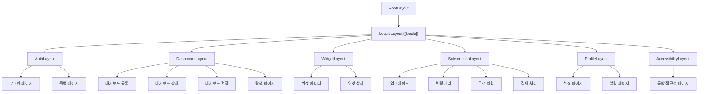
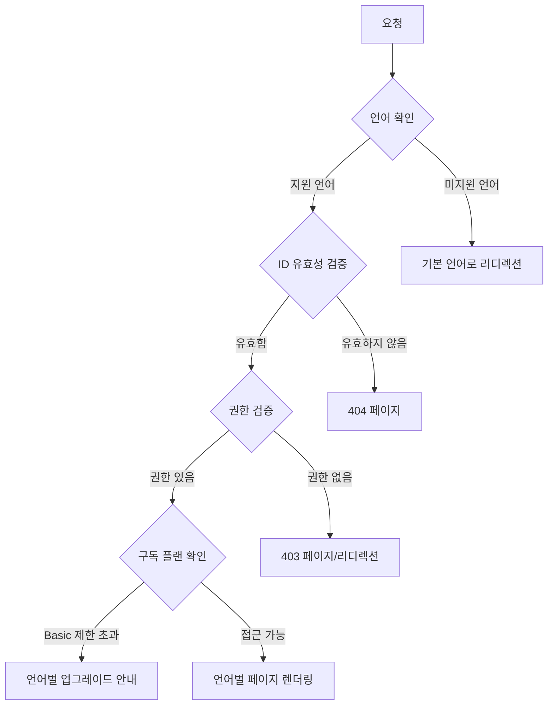
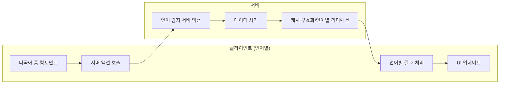

# E-Torch 라우팅 구조

## 1. 개요

E-Torch는 Next.js 15 App Router를 활용하여 국제화를 고려한 직관적이고 체계적인 라우팅 구조를 구현합니다. **[locale] 구조**를 채택하여 SEO 최적화, 사용자 경험, 공유 편의성, 캐싱 효율성을 극대화합니다. 이 문서는 E-Torch의 라우팅 아키텍처, 페이지 구성, 라우트 그룹, 레이아웃, 그리고 내비게이션 전략을 설명합니다.

## 2. Next.js 15 App Router + 국제화 활용 전략

Next.js 15의 App Router 파일 시스템 기반 라우팅과 [locale] 구조를 활용하여 다음과 같은 기능들을 구현합니다:

```mermaid
flowchart TD
    A[Next.js 15 App Router + [locale]] --> B[서버 컴포넌트 우선]
    A --> C[국제화 라우트 그룹]
    A --> D[중첩 레이아웃]
    A --> E[동적 라우트]
    A --> F[인터셉트 라우트]
    A --> G[병렬 라우트]
    
    B --> B1[언어별 SEO 최적화]
    B --> B2[초기 로딩 성능 향상]
    
    C --> C1[언어별 기능 그룹화]
    C --> C2[코드 구조 명확화]
    
    D --> D1[언어별 일관된 UI 경험]
    D --> D2[중복 코드 제거]
    
    E --> E1[대시보드/차트 동적 ID]
    E --> E2[언어별 URL 파라미터 활용]
    
    F --> F1[언어별 모달/팝업 구현]
    F --> F2[전환 없는 데이터 로드]
    
    G --> G1[언어별 탭 인터페이스]
    G --> G2[동시 콘텐츠 로드]
```

## 3. 국제화 [locale] 라우팅 구조 설계

E-Torch의 라우팅 구조는 `architecture.md`에 정의된 모노레포 패키지 구조와 통합되어 **언어별로 최상위에서 분리**됩니다:

```mermaid
graph TD
    Root[app/] --> Locale["[locale]/"]
    Root --> API["api/"]
    Root --> Middleware["middleware.ts"]
    Root --> Layout["layout.tsx (Root)"]
    Root --> Page["page.tsx (Redirect)"]
    
    Locale --> Auth["(auth)/"]
    Locale --> Dashboard["(dashboard)/"]
    Locale --> Widget["(widget)/"]
    Locale --> Subscription["(subscription)/"]
    Locale --> Profile["(profile)/"]
    Locale --> LocaleLayout["layout.tsx (Locale)"]
    Locale --> LocalePage["page.tsx (Home)"]
    
    Auth --> Auth1["login/"]
    Auth --> Auth2["callback/"]
    Auth --> AuthLayout["layout.tsx"]
    
    Dashboard --> Dash1["dashboard/"]
    Dashboard --> Dash2["dashboard/[id]/"]
    Dashboard --> Dash3["dashboard/new/"]
    Dashboard --> Dash4["dashboard/[id]/edit/"]
    Dashboard --> Dash5["explore/"]
    Dashboard --> DashLayout["layout.tsx"]
    
    Widget --> Widget1["widget-editor/[id]/"]
    Widget --> Widget2["widget/[id]/"]
    Widget --> WidgetLayout["layout.tsx"]
    
    Subscription --> Sub1["subscription/upgrade/"]
    Subscription --> Sub2["subscription/billing/"]
    Subscription --> Sub3["subscription/trial/"]
    Subscription --> Sub4["subscription/payment/"]
    Subscription --> SubLayout["layout.tsx"]
    
    Profile --> Prof1["profile/settings/"]
    Profile --> Prof2["profile/notifications/"]
    Profile --> ProfLayout["layout.tsx"]
    
    API --> API1["auth/"]
    API --> API2["charts/"]
    API --> API3["dashboards/"]
    API --> API4["data-sources/"]
    API --> API5["payments/"]
```



## 4. 국제화 라우팅 구조

### 4.1 기본 [locale] 라우팅 구조

국제화를 고려한 기본 라우팅 구조는 **언어별 URL 경로**로 구성됩니다. 초기에는 한국어(`ko`)와 영어(`en`)를 지원합니다.

```
app/
├── [locale]/             # 국제화 라우트 (ko, en)
│   ├── (auth)/           # 인증 관련 라우트 그룹
│   │   ├── login/        # SNS 로그인 페이지 (Google, Naver, Kakao)
│   │   ├── callback/     # OAuth 콜백 처리
│   │   └── layout.tsx    # 인증 레이아웃
│   │
│   ├── (dashboard)/      # 대시보드 관련 라우트 그룹
│   │   ├── dashboard/    # 대시보드 목록 페이지
│   │   ├── dashboard/[id]/   # 개별 대시보드 상세 페이지
│   │   ├── dashboard/new/    # 새 대시보드 생성 페이지
│   │   ├── dashboard/[id]/edit/ # 대시보드 편집 페이지
│   │   ├── explore/      # 공개 대시보드 탐색/발견 페이지
│   │   └── layout.tsx    # 대시보드 레이아웃
│   │
│   ├── (widget)/         # 위젯 관련 라우트 그룹
│   │   ├── widget-editor/[id]/ # 위젯 에디터 페이지 (5가지 차트형 + 2가지 텍스트형)
│   │   ├── widget/[id]/  # 개별 위젯 상세 페이지
│   │   └── layout.tsx    # 위젯 레이아웃
│   │
│   ├── (subscription)/   # 구독 관련 라우트 그룹
│   │   ├── subscription/upgrade/ # Pro 플랜 업그레이드
│   │   ├── subscription/billing/ # 결제 내역 및 빌링 관리
│   │   ├── subscription/trial/   # 7일 무료 체험
│   │   ├── subscription/payment/ # 토스페이먼츠 결제 처리
│   │   │   ├── success/  # 결제 성공
│   │   │   ├── fail/     # 결제 실패
│   │   │   └── cancel/   # 결제 취소
│   │   ├── subscription/limit-reached/ # Basic 플랜 제한 도달 안내
│   │   │   ├── dashboard/    # 대시보드 한도 도달 안내
│   │   │   ├── widget/       # 위젯 한도 도달 안내
│   │   │   └── data-period/  # 데이터 기간 제한 안내
│   │   └── layout.tsx    # 구독 레이아웃
│   │
│   ├── (profile)/        # 사용자 프로필 관련 라우트 그룹
│   │   ├── profile/settings/ # 프로필 설정 페이지
│   │   ├── profile/notifications/ # 알림 설정 페이지
│   │   └── layout.tsx    # 프로필 레이아웃
│   │
│   ├── accessibility/    # 통합 접근성 지원 페이지
│   │   └── page.tsx      # 키보드 도움말, 스크린 리더 가이드, 고대비 모드를 탭으로 통합
│   │
│   ├── layout.tsx        # 언어별 레이아웃
│   └── page.tsx          # 언어별 홈페이지
│
├── api/                  # API 라우트 (언어 무관)
├── middleware.ts         # 언어 감지 및 리디렉션
├── layout.tsx            # 루트 레이아웃
└── page.tsx              # 언어 리디렉션 페이지
```

### 4.2 확장 국제화 라우팅 구조

향상된 사용자 경험을 위한 고급 라우팅 패턴을 포함합니다:

```
# 기본 라우팅 구조에 다음과 같은 확장 패턴 추가

app/
├── [locale]/
│   ├── @modal/           # 인터셉트 라우트 (선별적 모달용)
│   │   ├── dashboard/[id]/   # 대시보드 미리보기 모달 (높은 사용 빈도)
│   │   └── subscription/upgrade/ # 업그레이드 모달 (컨텍스트 유지 필요)
│   │
│   ├── (dashboard)/          
│   │   └── @tabs/        # 병렬 라우트 (대시보드 탭용)
│   │       ├── info/     # 대시보드 정보 탭
│   │       ├── share/    # 대시보드 공유 탭
│   │       └── analytics/ # 대시보드 분석 탭
│   │
│   └── (widget)/              
│       ├── widget-editor/[id]/
│       │   ├── @preview/ # 미리보기 패널 (병렬 라우트)
│       │   ├── @options/ # 옵션 패널 (병렬 라우트)
│       │   └── @datasource/ # 데이터 소스 패널 (병렬 라우트)
│       └── preview/      # 위젯 미리보기 페이지
│
└── dictionaries/         # 다국어 사전 파일
    ├── ko.json
    └── en.json
```

### 4.3 라우팅 유형 매핑 테이블

| 경로 | 한국어 URL | 영어 URL | 라우팅 패턴 | 구현 우선순위 | 구독 플랜 제한 |
|-----|-----------|---------|-----------|-------------|-------------|
| 로그인/콜백 | `/ko/login`, `/ko/callback` | `/en/login`, `/en/callback` | 일반 라우트 | 상 (MVP) | 없음 |
| 대시보드 | `/ko/dashboard`, `/ko/dashboard/[id]` | `/en/dashboard`, `/en/dashboard/[id]` | 일반 라우트 | 상 (MVP) | Basic: 3개, Pro: 무제한 |
| 대시보드 생성/편집 | `/ko/dashboard/new`, `/ko/dashboard/[id]/edit` | `/en/dashboard/new`, `/en/dashboard/[id]/edit` | 일반 라우트 | 상 (MVP) | Basic: 6개 위젯, Pro: 무제한 |
| 탐색 | `/ko/explore` | `/en/explore` | 일반 라우트 | 상 (MVP) | 없음 |
| 위젯 에디터 | `/ko/widget-editor/[id]`, `/ko/widget/[id]` | `/en/widget-editor/[id]`, `/en/widget/[id]` | 동적 라우트 | 상 (MVP) | Basic: 기본 옵션, Pro: 고급 옵션 |
| 구독 | `/ko/subscription/*` | `/en/subscription/*` | 일반 라우트 | 상 (MVP) | 없음 |
| 프로필 | `/ko/profile/*` | `/en/profile/*` | 일반 라우트 | 중 | 없음 |
| 접근성 | `/ko/accessibility` | `/en/accessibility` | 일반 라우트 | 중 | 없음 |
| 모달 | `/ko/@modal/dashboard/[id]` | `/en/@modal/dashboard/[id]` | 인터셉트 라우트 | 중 | 없음 |
| 탭 | `/ko/@tabs/*` | `/en/@tabs/*` | 병렬 라우트 | 하 | 없음 |
| 제한 도달 안내 | `/ko/subscription/limit-reached/*` | `/en/subscription/limit-reached/*` | 일반 라우트 | 상 (MVP) | Basic 플랜만 해당 |

## 5. 국제화 미들웨어 구현

### 5.1 언어 감지 및 리디렉션 로직

```tsx
// middleware.ts
import { NextRequest, NextResponse } from 'next/server';
import { match } from '@formatjs/intl-localematcher';
import Negotiator from 'negotiator';
import { createMiddlewareClient } from '@supabase/auth-helpers-nextjs';

// 지원 언어 목록
const locales = ['ko', 'en'];
const defaultLocale = 'ko';
const publicRoutes = ['/login', '/callback', '/accessibility'];

// 미들웨어 체인 타입 정의
type MiddlewareFunction = (
  request: NextRequest,
  context: MiddlewareContext
) => Promise<NextResponse | null>;

interface MiddlewareContext {
  locale: string;
  pathname: string;
  pathWithoutLocale: string;
  session?: any;
}

// 언어 감지 함수 (기존과 동일)
function getLocale(request: NextRequest): string {
  const pathname = request.nextUrl.pathname;
  const pathnameLocale = locales.find(
    (locale) => pathname.startsWith(`/${locale}/`) || pathname === `/${locale}`
  );
  
  if (pathnameLocale) return pathnameLocale;
  
  const negotiatorHeaders: Record<string, string> = {};
  request.headers.forEach((value, key) => (negotiatorHeaders[key] = value));

  const languages = new Negotiator({ headers: negotiatorHeaders }).languages();
  return match(languages, locales, defaultLocale);
}

// JWT 토큰 검증 함수 (기존과 동일)
function isValidJWT(token: string): boolean {
  try {
    const payload = JSON.parse(atob(token.split('.')[1]));
    return payload.exp * 1000 > Date.now();
  } catch {
    return false;
  }
}

// 1. 언어 처리 미들웨어
const languageMiddleware: MiddlewareFunction = async (request, context) => {
  const pathname = request.nextUrl.pathname;
  
  // 언어가 없는 경로는 감지된 언어로 리디렉션
  const pathnameIsMissingLocale = locales.every(
    (locale) => !pathname.startsWith(`/${locale}/`) && pathname !== `/${locale}`
  );

  if (pathnameIsMissingLocale) {
    const locale = getLocale(request);
    const newUrl = new URL(`/${locale}${pathname}`, request.url);
    return NextResponse.redirect(newUrl);
  }
  
  // 컨텍스트 업데이트
  context.locale = pathname.split('/')[1];
  context.pathname = pathname;
  context.pathWithoutLocale = pathname.replace(`/${context.locale}`, '');
  
  return null; // 다음 미들웨어로 계속
};

// 2. 라우트 필터링 미들웨어
const routeFilterMiddleware: MiddlewareFunction = async (request, context) => {
  const { pathname } = context;
  
  // API 라우트는 패스
  if (pathname.startsWith('/api/')) {
    return NextResponse.next();
  }
  
  // 정적 파일은 패스
  if (pathname.includes('.')) {
    return NextResponse.next();
  }
  
  // 공개 라우트 확인
  if (publicRoutes.some(route => context.pathWithoutLocale.startsWith(route))) {
    return NextResponse.next();
  }
  
  return null; // 다음 미들웨어로 계속
};

// 3. 인증 미들웨어
const authMiddleware: MiddlewareFunction = async (request, context) => {
  const token = request.cookies.get('supabase-auth-token')?.value;
  
  // JWT 토큰 로컬 검증 우선 (성능 최적화)
  if (token && isValidJWT(token)) {
    return null; // 인증 성공, 다음 미들웨어로
  }
  
  // 필요시에만 Supabase 세션 검증
  const res = NextResponse.next();
  const supabase = createMiddlewareClient({ req: request, res });
  
  const { data: { session } } = await supabase.auth.getSession();
  
  if (!session) {
    const loginUrl = new URL(`/${context.locale}/login`, request.url);
    loginUrl.searchParams.set('redirectTo', context.pathname);
    return NextResponse.redirect(loginUrl);
  }
  
  // 세션을 컨텍스트에 저장
  context.session = session;
  return null; // 다음 미들웨어로 계속
};

// 4. 구독 플랜 검증 미들웨어
const subscriptionMiddleware: MiddlewareFunction = async (request, context) => {
  if (!context.session) {
    return null; // 세션이 없으면 패스 (이전 미들웨어에서 처리됨)
  }
  
  const userPlan = context.session.user.app_metadata?.subscription_plan || 'basic';
  
  // Pro 전용 기능 보호
  const proOnlyRoutes = [
    '/dashboard/[id]/copy',
    '/dashboard/[id]/embed',
    '/widget-editor/[id]/advanced'
  ];
  
  const routePattern = context.pathWithoutLocale;
  const isProOnlyRoute = proOnlyRoutes.some(route => 
    routePattern.match(route.replace('[id]', '\\w+'))
  );
  
  if (isProOnlyRoute && userPlan !== 'pro') {
    // 제한 유형별 단계적 안내 페이지로 리디렉션
    const limitType = getLimitTypeFromRoute(context.pathWithoutLocale);
    return NextResponse.redirect(
      new URL(`/${context.locale}/subscription/limit-reached/${limitType}?redirectTo=${encodeURIComponent(context.pathname)}`, request.url)
    );
  }

  // 제한 유형 판별 함수 추가
  function getLimitTypeFromRoute(route: string): string {
    if (route.includes('/dashboard/') && route.includes('/new')) return 'dashboard';
    if (route.includes('/widget-editor/')) return 'widget';
    if (route.includes('/data') || route.includes('/period')) return 'data-period';
    return 'general';
  }
  
  return null; // 모든 검증 통과
};

// 미들웨어 체인 실행 함수
async function runMiddlewareChain(
  request: NextRequest,
  middlewares: MiddlewareFunction[]
): Promise<NextResponse> {
  const context: MiddlewareContext = {
    locale: '',
    pathname: '',
    pathWithoutLocale: '',
  };
  
  for (const middleware of middlewares) {
    const result = await middleware(request, context);
    if (result) {
      return result; // 미들웨어에서 응답을 반환하면 체인 종료
    }
  }
  
  return NextResponse.next(); // 모든 미들웨어 통과
}

// 메인 미들웨어 함수
export async function middleware(request: NextRequest) {
  const middlewareChain = [
    languageMiddleware,
    routeFilterMiddleware,
    authMiddleware,
    subscriptionMiddleware,
  ];
  
  return runMiddlewareChain(request, middlewareChain);
}

export const config = {
  matcher: [
    // Skip all internal paths (_next)
    '/((?!_next/static|_next/image|favicon.ico).*)',
  ],
};
```

### 5.2 언어별 사전 및 컨텍스트

```tsx
// dictionaries/ko.json
{
  "navigation": {
    "dashboard": "대시보드",
    "explore": "탐색",
    "subscription": "구독",
    "profile": "프로필"
  },
  "dashboard": {
    "title": "내 대시보드",
    "create_new": "새 대시보드 생성",
    "edit": "편집",
    "share": "공유",
    "delete": "삭제"
  },
  "subscription": {
    "basic_plan": "Basic 플랜",
    "pro_plan": "Pro 플랜",
    "upgrade": "업그레이드",
    "trial": "무료 체험"
  },
  "errors": {
    "dashboard_limit": "대시보드 생성 한도에 도달했습니다.",
    "widget_limit": "위젯 생성 한도에 도달했습니다.",
    "network_error": "네트워크 연결을 확인해주세요."
  },
  "limit_reached": {
    "dashboard": {
      "title": "대시보드 생성 한도에 도달했습니다",
      "current_usage": "현재 {{current}}/{{limit}}개 사용 중",
      "pro_benefit": "Pro 플랜으로 무제한 대시보드를 만들어보세요",
      "upgrade_now": "지금 업그레이드하기"
    },
    "widget": {
      "title": "위젯 추가 한도에 도달했습니다", 
      "current_usage": "이 대시보드에서 {{current}}/{{limit}}개 사용 중",
      "pro_benefit": "Pro 플랜으로 원하는 만큼 위젯을 추가하세요"
    },
    "data_period": {
      "title": "데이터 조회 기간이 제한되어 있습니다",
      "current_limit": "Basic 플랜은 최근 3년 데이터만 조회 가능",
      "pro_benefit": "Pro 플랜으로 전체 기간 데이터를 분석하세요"
    }
  }
}

// dictionaries/en.json
{
  "navigation": {
    "dashboard": "Dashboard",
    "explore": "Explore",
    "subscription": "Subscription",
    "profile": "Profile"
  },
  "dashboard": {
    "title": "My Dashboards",
    "create_new": "Create New Dashboard",
    "edit": "Edit",
    "share": "Share",
    "delete": "Delete"
  },
  "subscription": {
    "basic_plan": "Basic Plan",
    "pro_plan": "Pro Plan",
    "upgrade": "Upgrade",
    "trial": "Free Trial"
  },
  "errors": {
    "dashboard_limit": "Dashboard creation limit reached.",
    "widget_limit": "Widget creation limit reached.",
    "network_error": "Please check your network connection."
  },
  "limit_reached": {
    "dashboard": {
      "title": "Dashboard Creation Limit Reached",
      "current_usage": "Currently using {{current}}/{{limit}} dashboards",
      "pro_benefit": "Create unlimited dashboards with Pro plan",
      "upgrade_now": "Upgrade Now"
    }
    // ... 영어 번역
  }
}

// lib/dictionaries.ts
import 'server-only';

const dictionaries = {
  ko: () => import('../dictionaries/ko.json').then((module) => module.default),
  en: () => import('../dictionaries/en.json').then((module) => module.default),
};

export const getDictionary = async (locale: 'ko' | 'en') =>
  dictionaries[locale]();

// hooks/use-dictionary.ts (클라이언트용)
'use client';

import { createContext, useContext } from 'react';

type Dictionary = Record<string, any>;

const DictionaryContext = createContext<Dictionary | null>(null);

export function DictionaryProvider({ 
  children, 
  dictionary 
}: { 
  children: React.ReactNode;
  dictionary: Dictionary;
}) {
  return (
    <DictionaryContext.Provider value={dictionary}>
      {children}
    </DictionaryContext.Provider>
  );
}

export function useDictionary() {
  const dictionary = useContext(DictionaryContext);
  if (!dictionary) {
    throw new Error('useDictionary must be used within a DictionaryProvider');
  }
  return dictionary;
}
```

## 6. 언어별 페이지 구성

### 6.1 인증 관련 페이지

| 라우트 | 한국어 URL | 영어 URL | 권한 | 컴포넌트 타입 | SNS 연동 |
|-------|-----------|---------|------|--------------|----------|
| 로그인 | `/ko/login` | `/en/login` | Public | 서버 + 클라이언트 폼 | Google, Naver, Kakao |
| 콜백 | `/ko/callback` | `/en/callback` | Public | 서버 컴포넌트 | Supabase Auth |

### 6.2 대시보드 관련 페이지

| 라우트 | 한국어 URL | 영어 URL | 권한 | 컴포넌트 타입 | 구독 플랜 제한 |
|-------|-----------|---------|------|--------------|-------------|
| 대시보드 목록 | `/ko/dashboard` | `/en/dashboard` | Authenticated | 서버 + 클라이언트 기능 | Basic: 최대 3개 |
| 대시보드 상세 | `/ko/dashboard/[id]` | `/en/dashboard/[id]` | Authenticated | 서버 + 클라이언트 차트 | Basic: 워터마크 표시 |
| 새 대시보드 | `/ko/dashboard/new` | `/en/dashboard/new` | Authenticated | 서버 + 클라이언트 에디터 | Basic: 3개 한도 확인 |
| 대시보드 편집 | `/ko/dashboard/[id]/edit` | `/en/dashboard/[id]/edit` | Owner | 서버 + 클라이언트 에디터 | Basic: 6개 위젯 한도 |
| 공개 대시보드 탐색 | `/ko/explore` | `/en/explore` | Authenticated | 서버 + 클라이언트 필터링 | Basic: 복사 불가 |

### 6.3 위젯 관련 페이지

| 라우트 | 한국어 URL | 영어 URL | 권한 | 컴포넌트 타입 | 지원 위젯 유형 |
|-------|-----------|---------|------|--------------|-------------|
| 위젯 에디터 | `/ko/widget-editor/[id]` | `/en/widget-editor/[id]` | Authenticated | 서버 + 클라이언트 에디터 | 5가지 차트형 + 2가지 텍스트형 |
| 위젯 상세 | `/ko/widget/[id]` | `/en/widget/[id]` | Authenticated | 서버 + 클라이언트 차트 | 모든 위젯 유형 |

### 6.4 구독 관련 페이지

| 라우트 | 한국어 URL | 영어 URL | 권한 | 컴포넌트 타입 | 토스페이먼츠 연동 |
|-------|-----------|---------|------|--------------|-----------------|
| 업그레이드 | `/ko/subscription/upgrade` | `/en/subscription/upgrade` | Authenticated | 서버 + 클라이언트 폼 | 결제 위젯 |
| 빌링 관리 | `/ko/subscription/billing` | `/en/subscription/billing` | Authenticated | 서버 + 클라이언트 | 빌링키 관리 |
| 무료 체험 | `/ko/subscription/trial` | `/en/subscription/trial` | Authenticated | 서버 + 클라이언트 | 체험 시작 |
| 결제 성공 | `/ko/subscription/payment/success` | `/en/subscription/payment/success` | Public | 서버 컴포넌트 | 결과 처리 |
| 결제 실패 | `/ko/subscription/payment/fail` | `/en/subscription/payment/fail` | Public | 서버 컴포넌트 | 에러 처리 |
| 결제 취소 | `/ko/subscription/payment/cancel` | `/en/subscription/payment/cancel` | Public | 서버 컴포넌트 | 취소 처리 |
| 대시보드 한도 | `/ko/subscription/limit-reached/dashboard` | `/en/subscription/limit-reached/dashboard` | Authenticated | 서버 + 클라이언트 | 현재 사용량 표시, Pro 혜택 비교, 업그레이드 유도 |
| 위젯 한도 | `/ko/subscription/limit-reached/widget` | `/en/subscription/limit-reached/widget` | Authenticated | 서버 + 클라이언트 | 위젯 한도 설명, 무제한 혜택 강조 |
| 데이터 기간 제한 | `/ko/subscription/limit-reached/data-period` | `/en/subscription/limit-reached/data-period` | Authenticated | 서버 + 클라이언트 | 3년 vs 전체 기간 비교, 장기 분석 가치 설명 |

### 6.5 프로필 관련 페이지

| 라우트 | 한국어 URL | 영어 URL | 권한 | 컴포넌트 타입 | 기능 |
|-------|-----------|---------|------|--------------|------|
| 사용자 설정 | `/ko/profile/settings` | `/en/profile/settings` | Authenticated | 서버 + 클라이언트 폼 | 프로필 편집, 언어 설정 |
| 알림 설정 | `/ko/profile/notifications` | `/en/profile/notifications` | Authenticated | 서버 + 클라이언트 토글 | 구독 갱신 알림 |

### 6.6 접근성 지원 페이지

| 라우트 | 한국어 URL | 영어 URL | 권한 | 컴포넌트 타입 | 기능 |
|-------|-----------|---------|------|--------------|------|
| 통합 접근성 | `/ko/accessibility` | `/en/accessibility` | Public | 서버 + 클라이언트 탭 | 키보드 도움말, 스크린 리더 가이드, 고대비 모드 |

## 7. 언어별 레이아웃 구조

E-Torch는 국제화를 고려한 계층적 레이아웃 구조를 사용하여 언어별 일관된 사용자 경험을 제공합니다:



### 7.1 레이아웃 책임 분리

각 레이아웃은 명확한 책임을 갖는 구조로 설계되어 있습니다:

| 레이아웃 | 책임 |
|---------|-----|
| **RootLayout** | 전역 CSS/폰트(Inter, JetBrains_Mono), 테마 제공자, 메타데이터, OKLCH 색상 시스템, 전역 에러 바운더리, **언어 리디렉션** |
| **LocaleLayout** | **언어별 사전 제공, 언어별 메타데이터, 언어 전환 UI, RTL/LTR 방향 설정** |
| **AuthLayout** | 최소 디자인, 로고 및 설명, 중앙 정렬 컨테이너, **언어별 폼 검증** |
| **DashboardLayout** | 사이드 내비게이션, 상단 헤더, 메인 콘텐츠 영역, 구독 상태 표시, **언어별 네비게이션** |
| **WidgetLayout** | 상단 헤더, 전체 화면 콘텐츠, 백 버튼, 저장 상태, **언어별 위젯 타입명** |
| **SubscriptionLayout** | 결제 보안 헤더, 진행 상태 표시, 토스페이먼츠 스크립트 로드, **언어별 결제 정보** |
| **ProfileLayout** | 사이드 내비게이션, 상단 헤더, 메인 콘텐츠 영역, **언어 설정 UI** |
| **AccessibilityLayout** | 접근성 최적화 헤더, 탭 네비게이션, 고대비 모드 지원, **언어별 접근성 가이드** |

## 8. 동적 라우팅 전략

### 8.1 대시보드 및 위젯 ID 라우팅 패턴

동적 ID 기반 라우팅은 언어별로 다음과 같은 패턴으로 구현됩니다:

```tsx
// app/[locale]/(dashboard)/dashboard/[id]/page.tsx (서버 컴포넌트)
import { fetchDashboardById } from '@/e-torch/server-api/dashboard';
import { notFound } from 'next/navigation';
import { DashboardServerWrapper } from '@/e-torch/dashboard/server';
import { getDictionary } from '@/lib/dictionaries';

interface DashboardPageProps {
  params: { 
    locale: 'ko' | 'en';
    id: string;
  };
}

export default async function DashboardPage({ params }: DashboardPageProps) {
  const [dashboard, dictionary] = await Promise.all([
    fetchDashboardById(params.id),
    getDictionary(params.locale)
  ]);
  
  if (!dashboard) {
    return notFound();
  }
  
  return (
    <DashboardServerWrapper 
      dashboardId={params.id} 
      initialData={dashboard}
      dictionary={dictionary}
      locale={params.locale}
    />
  );
}

// 언어별 메타데이터 생성
export async function generateMetadata({ 
  params 
}: { 
  params: { locale: 'ko' | 'en'; id: string } 
}): Promise<Metadata> {
  const [dashboard, dictionary] = await Promise.all([
    fetchDashboardById(params.id),
    getDictionary(params.locale)
  ]);
  
  if (!dashboard) {
    return {
      title: dictionary.errors.not_found,
    };
  }
  
  return {
    title: dashboard.title,
    description: dashboard.description || dictionary.dashboard.description_default,
    alternates: {
      languages: {
        'ko': `/ko/dashboard/${params.id}`,
        'en': `/en/dashboard/${params.id}`,
        'x-default': `/ko/dashboard/${params.id}`,
      },
    },
    openGraph: {
      locale: params.locale === 'ko' ? 'ko_KR' : 'en_US',
      alternateLocale: params.locale === 'ko' ? 'en_US' : 'ko_KR',
    },
  };
}
```

### 8.2 동적 라우트 접근 제어 패턴



## 9. 네비게이션 및 라우트 보호

### 9.1 네비게이션 컴포넌트 구조

E-Torch의 네비게이션 시스템은 다음과 같은 주요 컴포넌트로 구성됩니다:

- **LocalizedSideNavigation**: 언어별 메뉴 항목 및 네비게이션 링크 제공
- **LocalizedHeaderNavigation**: 언어별 페이지 제목, 사용자 메뉴, 구독 상태 표시, **언어 전환 버튼**
- **LocalizedBreadcrumbNavigation**: 언어별 현재 위치 및 상위 카테고리 표시

```tsx
// components/navigation/LocalizedSideNavigation.tsx
'use client';

import Link from 'next/link';
import { useParams } from 'next/navigation';
import { useDictionary } from '@/hooks/use-dictionary';

export function LocalizedSideNavigation() {
  const params = useParams();
  const locale = params.locale as string;
  const dictionary = useDictionary();
  
  const navigationItems = [
    {
      href: `/${locale}/dashboard`,
      label: dictionary.navigation.dashboard,
      icon: 'Dashboard'
    },
    {
      href: `/${locale}/explore`,
      label: dictionary.navigation.explore,
      icon: 'Explore'
    },
    {
      href: `/${locale}/subscription`,
      label: dictionary.navigation.subscription,
      icon: 'Subscription'
    },
    {
      href: `/${locale}/profile`,
      label: dictionary.navigation.profile,
      icon: 'Profile'
    }
  ];
  
  return (
    <nav className="space-y-2">
      {navigationItems.map((item) => (
        <Link
          key={item.href}
          href={item.href}
          className="flex items-center space-x-3 px-3 py-2 rounded-md hover:bg-muted"
        >
          <span>{item.label}</span>
        </Link>
      ))}
    </nav>
  );
}

// components/navigation/LanguageSwitcher.tsx
'use client';

import { useParams, usePathname, useRouter } from 'next/navigation';
import { Button } from '@/components/ui/button';
import {
  DropdownMenu,
  DropdownMenuContent,
  DropdownMenuItem,
  DropdownMenuTrigger,
} from '@/components/ui/dropdown-menu';

const languages = [
  { code: 'ko', name: '한국어', flag: '🇰🇷' },
  { code: 'en', name: 'English', flag: '🇺🇸' },
];

export function LanguageSwitcher() {
  const params = useParams();
  const pathname = usePathname();
  const router = useRouter();
  
  const currentLocale = params.locale as string;
  const currentLanguage = languages.find(lang => lang.code === currentLocale);
  
  const switchLanguage = (newLocale: string) => {
    // 현재 경로에서 언어 부분을 교체
    const newPathname = pathname.replace(`/${currentLocale}`, `/${newLocale}`);
    router.push(newPathname);
  };
  
  return (
    <DropdownMenu>
      <DropdownMenuTrigger asChild>
        <Button variant="ghost" size="sm">
          <span className="mr-2">{currentLanguage?.flag}</span>
          <span>{currentLanguage?.name}</span>
        </Button>
      </DropdownMenuTrigger>
      <DropdownMenuContent align="end">
        {languages.map((language) => (
          <DropdownMenuItem
            key={language.code}
            onClick={() => switchLanguage(language.code)}
            className={currentLocale === language.code ? 'bg-muted' : ''}
          >
            <span className="mr-2">{language.flag}</span>
            <span>{language.name}</span>
          </DropdownMenuItem>
        ))}
      </DropdownMenuContent>
    </DropdownMenu>
  );
}
```

## 10. API 라우팅 구조 (언어 무관)

### 10.1 데이터 소스별 API 라우팅

API 라우트는 언어와 무관하게 단일 엔드포인트로 구성됩니다. 필요한 경우 Accept-Language 헤더를 통해 언어별 응답을 제공합니다.

```
app/api/
├── auth/                 # Supabase Auth 연동
│   ├── login/route.ts    # SNS 로그인 처리
│   ├── logout/route.ts   # 로그아웃 처리
│   └── session/route.ts  # 세션 확인
│
├── data/                 # 경제지표 데이터 API
│   ├── kosis/            # KOSIS 데이터 소스
│   │   ├── indicators/route.ts    # 지표 목록 (MVP 12개, 언어별 번역)
│   │   └── series/[id]/route.ts   # 시계열 데이터
│   ├── ecos/             # ECOS 데이터 소스
│   │   ├── indicators/route.ts    # 지표 목록 (MVP 8개, 언어별 번역)
│   │   └── series/[id]/route.ts   # 시계열 데이터
│   └── combined/route.ts # 다중 소스 통합 조회
│
├── dashboards/           # 대시보드 관리
│   ├── route.ts          # 목록 조회, 생성
│   ├── [id]/route.ts     # 상세 조회, 수정, 삭제
│   ├── [id]/copy/route.ts # 복사 (Pro 전용)
│   └── [id]/embed/route.ts # 임베드 코드 (Pro 전용)
│
├── widgets/              # 위젯 관리
│   ├── route.ts          # 목록 조회, 생성
│   └── [id]/route.ts     # 상세 조회, 수정, 삭제
│
├── payments/             # 토스페이먼츠 연동
│   ├── create/route.ts   # 결제 생성
│   ├── confirm/route.ts  # 결제 승인
│   ├── webhook/route.ts  # 웹훅 처리
│   └── billing/route.ts  # 빌링키 관리
│
└── subscription/         # 구독 관리
    ├── status/route.ts   # 구독 상태 조회
    ├── upgrade/route.ts  # 플랜 업그레이드
    ├── cancel/route.ts   # 구독 취소
    └── trial/route.ts    # 무료 체험 시작
```

### 10.2 언어별 API 응답 처리

```tsx
// app/api/data/kosis/indicators/route.ts
import { NextRequest, NextResponse } from 'next/server';
import { getKosisIndicators } from '@/lib/data-sources/kosis';

export async function GET(request: NextRequest) {
  // Accept-Language 헤더에서 언어 감지
  const acceptLanguage = request.headers.get('accept-language');
  const locale = acceptLanguage?.includes('en') ? 'en' : 'ko';
  
  try {
    const indicators = await getKosisIndicators();
    
    // 언어별 번역 적용
    const translatedIndicators = indicators.map(indicator => ({
      ...indicator,
      name: locale === 'en' ? indicator.nameEn : indicator.nameKo,
      description: locale === 'en' ? indicator.descriptionEn : indicator.descriptionKo,
      category: locale === 'en' ? indicator.categoryEn : indicator.categoryKo,
    }));
    
    const response = NextResponse.json({
      success: true,
      data: translatedIndicators,
      locale,
    });
    
    // 지표 목록은 거의 변경되지 않으므로 긴 캐시 적용
    response.headers.set('Cache-Control', 'public, s-maxage=86400, max-age=43200'); // CDN 24시간, 브라우저 12시간
    response.headers.set('Vary', 'Accept-Language'); // 언어별 캐시 분리
    
    return response;
  } catch (error) {
    const errorMessage = locale === 'en' 
      ? 'Failed to fetch indicators'
      : '지표 조회에 실패했습니다';
      
    return NextResponse.json(
      { success: false, error: errorMessage },
      { status: 500 }
    );
  }
}

// app/api/data/[source]/series/[id]/route.ts
export async function GET(
  request: NextRequest,
  { params }: { params: { source: string; id: string } }
) {
  const { searchParams } = new URL(request.url);
  const period = searchParams.get('period') || 'M';
  const startDate = searchParams.get('startDate');
  const endDate = searchParams.get('endDate');
  
  try {
    // 서버 캐싱 없이 직접 데이터 조회
    const data = await getSeriesData(params.source as 'KOSIS' | 'ECOS', params.id, period, startDate, endDate);
    
    const response = NextResponse.json({
      success: true,
      data,
      metadata: {
        source: params.source,
        indicator: params.id,
        period,
        dateRange: { startDate, endDate },
        fetchedAt: new Date().toISOString(),
      },
    });
    
    // TanStack Query와 조화되는 HTTP 캐시 설정
    const isHistoricalData = new Date(endDate!) < new Date(Date.now() - 30 * 24 * 60 * 60 * 1000);
    
    if (isHistoricalData) {
      // 과거 데이터: 긴 캐시 + TanStack Query와 일치하는 설정
      response.headers.set('Cache-Control', 'public, max-age=86400, s-maxage=604800'); // 브라우저 1일, CDN 7일
    } else {
      // 최신 데이터: TanStack Query staleTime과 일치하는 짧은 캐시
      const cacheTime = params.source === 'ECOS' && period === 'D' ? 900 : 1800; // 15분 또는 30분
      response.headers.set('Cache-Control', `public, max-age=${cacheTime}, s-maxage=${cacheTime * 2}`);
    }
    
    // ETag로 조건부 요청 지원 (TanStack Query가 활용 가능)
    const etag = `"${params.source}-${params.id}-${period}-${startDate}-${endDate}"`;
    response.headers.set('ETag', etag);
    
    return response;
  } catch (error) {
    return NextResponse.json(
      { success: false, error: 'Failed to fetch series data' },
      { status: 500 }
    );
  }
}
```

## 11. 클라이언트 측 네비게이션 최적화

### 11.1 효율적인 언어별 네비게이션 패턴

```tsx
// components/LocalizedLink.tsx
import Link from 'next/link';
import { useParams } from 'next/navigation';

interface LocalizedLinkProps {
  href: string;
  children: React.ReactNode;
  className?: string;
  prefetch?: boolean;
}

export function LocalizedLink({ 
  href, 
  children, 
  className, 
  prefetch = true 
}: LocalizedLinkProps) {
  const params = useParams();
  const locale = params.locale as string;
  
  // href가 이미 언어 코드를 포함하고 있는지 확인
  const localizedHref = href.startsWith(`/${locale}`) 
    ? href 
    : `/${locale}${href}`;
  
  return (
    <Link 
      href={localizedHref}
      prefetch={prefetch}
      className={className}
    >
      {children}
    </Link>
  );
}

// components/DashboardCard.tsx
import { LocalizedLink } from './LocalizedLink';
import { useDictionary } from '@/hooks/use-dictionary';

export function DashboardCard({ dashboard }) {
  const dictionary = useDictionary();
  
  return (
    <LocalizedLink 
      href={`/dashboard/${dashboard.id}`}
      className="block rounded-lg border bg-card shadow-sm hover:bg-muted/50 transition-colors"
    >
      <div className="p-4">
        <h3 className="text-xl font-semibold leading-snug">{dashboard.title}</h3>
        <p className="text-sm text-muted-foreground">{dashboard.description}</p>
        <div className="mt-2 text-xs text-muted-foreground">
          {dictionary.dashboard.last_updated}: {dashboard.updatedAt}
        </div>
      </div>
    </LocalizedLink>
  );
}

// hooks/useLocalizedRouter.ts
'use client';

import { useRouter, useParams } from 'next/navigation';

export function useLocalizedRouter() {
  const router = useRouter();
  const params = useParams();
  const locale = params.locale as string;
  
  const push = (href: string) => {
    const localizedHref = href.startsWith(`/${locale}`) 
      ? href 
      : `/${locale}${href}`;
    router.push(localizedHref);
  };
  
  const replace = (href: string) => {
    const localizedHref = href.startsWith(`/${locale}`) 
      ? href 
      : `/${locale}${href}`;
    router.replace(localizedHref);
  };
  
  return {
    ...router,
    push,
    replace,
    locale,
  };
}

// 사용 예시
export function SaveButton({ dashboardId, onSave }) {
  const router = useLocalizedRouter();
  const dictionary = useDictionary();
  
  const handleSave = async () => {
    const result = await onSave();
    if (result.success) {
      router.push(`/dashboard/${dashboardId}`);
    }
  };
  
  return (
    <button 
      onClick={handleSave} 
      className="inline-flex items-center justify-center whitespace-nowrap rounded-md text-sm font-medium ring-offset-background transition-colors bg-primary text-primary-foreground hover:bg-primary/90 h-10 px-4 py-2"
    >
      {dictionary.common.save}
    </button>
  );
}
```

## 12. 메타데이터 전략

### 12.1 언어별 메타데이터 계층 구조

```tsx
// app/layout.tsx (루트 레이아웃)
import { Inter, JetBrains_Mono } from 'next/font/google';
import '@e-torch/ui/styles/globals.css';

const inter = Inter({ 
  subsets: ['latin'],
  variable: '--font-inter'
});

const jetBrainsMono = JetBrains_Mono({
  subsets: ['latin'],
  variable: '--font-jetbrains-mono'
});

export const metadata: Metadata = {
  metadataBase: new URL('https://e-torch.com'),
  alternates: {
    canonical: '/ko',
    languages: {
      'ko': '/ko',
      'en': '/en',
    },
  },
};

export default function RootLayout({ children }) {
  return (
    <html className={`${inter.variable} ${jetBrainsMono.variable}`}>
      <body>
        <GlobalErrorBoundary>
          {children}
        </GlobalErrorBoundary>
      </body>
    </html>
  );
}

// app/[locale]/layout.tsx (언어별 레이아웃)
import { getDictionary } from '@/lib/dictionaries';
import { DictionaryProvider } from '@/hooks/use-dictionary';

export async function generateMetadata({ 
  params 
}: { 
  params: { locale: 'ko' | 'en' } 
}): Promise<Metadata> {
  const dictionary = await getDictionary(params.locale);
  
  return {
    title: {
      template: `%s | ${dictionary.site.name}`,
      default: dictionary.site.title,
    },
    description: dictionary.site.description,
    keywords: dictionary.site.keywords,
    authors: [{ name: 'E-Torch Team' }],
    openGraph: {
      type: 'website',
      locale: params.locale === 'ko' ? 'ko_KR' : 'en_US',
      url: `/${params.locale}`,
      siteName: dictionary.site.name,
      title: dictionary.site.title,
      description: dictionary.site.description,
    },
    alternates: {
      canonical: `/${params.locale}`,
      languages: {
        'ko': '/ko',
        'en': '/en',
        'x-default': '/ko',
      },
    },
    other: {
      'google-site-verification': process.env.GOOGLE_SITE_VERIFICATION || '',
    },
  };
}

export default async function LocaleLayout({
  children,
  params,
}: {
  children: React.ReactNode;
  params: { locale: 'ko' | 'en' };
}) {
  const dictionary = await getDictionary(params.locale);
  
  return (
    <html lang={params.locale} dir="ltr">
      <body>
        <DictionaryProvider dictionary={dictionary}>
          {children}
        </DictionaryProvider>
      </body>
    </html>
  );
}

// app/[locale]/(dashboard)/layout.tsx (섹션별 메타데이터)
export async function generateMetadata({ 
  params 
}: { 
  params: { locale: 'ko' | 'en' } 
}): Promise<Metadata> {
  const dictionary = await getDictionary(params.locale);
  
  return {
    title: dictionary.dashboard.title,
    description: dictionary.dashboard.description,
  };
}

// app/[locale]/(dashboard)/dashboard/[id]/page.tsx (동적 메타데이터)
export async function generateMetadata({ 
  params 
}: { 
  params: { locale: 'ko' | 'en'; id: string } 
}): Promise<Metadata> {
  const [dashboard, dictionary] = await Promise.all([
    fetchDashboardById(params.id),
    getDictionary(params.locale)
  ]);
  
  if (!dashboard) {
    return {
      title: dictionary.errors.not_found,
    };
  }
  
  const userPlan = await getUserPlan();
  
  return {
    title: dashboard.title,
    description: dashboard.description || dictionary.dashboard.description_default,
    alternates: {
      canonical: `/${params.locale}/dashboard/${params.id}`,
      languages: {
        'ko': `/ko/dashboard/${params.id}`,
        'en': `/en/dashboard/${params.id}`,
        'x-default': `/ko/dashboard/${params.id}`,
      },
    },
    openGraph: {
      title: dashboard.title,
      description: dashboard.description || dictionary.dashboard.description_default,
      locale: params.locale === 'ko' ? 'ko_KR' : 'en_US',
      alternateLocale: params.locale === 'ko' ? 'en_US' : 'ko_KR',
      // Pro 사용자는 워터마크 없는 이미지
      images: [userPlan === 'pro' ? dashboard.thumbnail : dashboard.thumbnailWithWatermark],
    },
    robots: {
      index: dashboard.isPublic,
      follow: dashboard.isPublic,
    },
  };
}
```

## 13. 서버 액션 활용 전략

### 13.1 다국어 서버 액션 워크플로우



### 13.2 향상된 다국어 서버 액션 패턴

```tsx
// app/actions/dashboard.ts
'use server';

import { revalidatePath } from 'next/cache';
import { redirect } from 'next/navigation';
import { saveDashboard } from '@/e-torch/server-api/dashboard';
import { getCurrentUser } from '@/e-torch/server-api/auth';
import { getDictionary } from '@/lib/dictionaries';
import { ValidationError, QuotaExceededError } from '@/lib/errors';
import { logger } from '@/lib/logger';

export async function saveDashboardAction(
  locale: 'ko' | 'en',
  formData: FormData | Record<string, any>
) {
  const [user, dictionary] = await Promise.all([
    getCurrentUser(),
    getDictionary(locale)
  ]);
  
  if (!user) {
    return { 
      success: false, 
      error: dictionary.errors.unauthorized 
    };
  }
  
  // 구독 플랜별 제한 검증 (언어별 메시지)
  if (user.plan === 'basic') {
    const dashboardCount = await getUserDashboardCount(user.id);
    if (dashboardCount >= 3) {
      // 단계적 안내 페이지로 먼저 리디렉션
      redirect(`/${locale}/subscription/limit-reached/dashboard?current=${dashboardCount}&limit=3`);
    }
  }
  
  try {
    const dashboardData = formData instanceof FormData 
      ? Object.fromEntries(formData.entries())
      : formData;
    
    dashboardData.userId = user.id;
    dashboardData.updatedAt = new Date().toISOString();
    
    const result = await saveDashboard(dashboardData);
    
    // 언어별 캐시 무효화
    revalidatePath(`/${locale}/dashboard/${result.id}`);
    revalidatePath(`/${locale}/dashboard`);
    
    return { 
      success: true, 
      data: result,
      message: dictionary.dashboard.save_success
    };
  } catch (error) {
    // 언어별 에러 처리
    if (error instanceof ValidationError) {
      return { 
        success: false, 
        error: dictionary.errors.validation_failed,
        field: error.field,
        details: error.details
      };
    }
    
    if (error instanceof QuotaExceededError) {
      redirect(`/${locale}/subscription/upgrade?reason=quota_exceeded`);
    }
    
    // 로깅 및 모니터링
    logger.error('Dashboard save failed', { 
      error: error.message, 
      userId: user.id,
      locale,
      dashboardData 
    });
    
    return { 
      success: false, 
      error: dictionary.errors.generic_error
    };
  }
}

// 언어별 리디렉션 헬퍼
export async function redirectToUpgrade(
  locale: 'ko' | 'en',
  reason: string
) {
  redirect(`/${locale}/subscription/upgrade?reason=${reason}`);
}
```

### 13.3 다국어 구독 플랜별 서버 액션 제한

```tsx
// app/actions/subscription.ts
'use server';

export async function createWidgetAction(
  locale: 'ko' | 'en',
  widgetData: any
) {
  const [user, dictionary] = await Promise.all([
    getCurrentUser(),
    getDictionary(locale)
  ]);
  
  if (!user) {
    return { 
      success: false, 
      error: dictionary.errors.unauthorized 
    };
  }
  
  try {
    // Basic 플랜 위젯 개수 제한 (언어별 메시지)
    if (user.plan === 'basic') {
      const widgetCount = await getUserWidgetCount(user.id, widgetData.dashboardId);
      if (widgetCount >= 6) {
        redirect(`/${locale}/subscription/upgrade?reason=widget_limit`);
      }
    }
    
    // 위젯 생성 로직
    const result = await createWidget(widgetData);
    
    revalidatePath(`/${locale}/dashboard/${widgetData.dashboardId}/edit`);
    return { 
      success: true, 
      data: result,
      message: dictionary.widget.create_success
    };
  } catch (error) {
    logger.error('Widget creation failed', { 
      error: error.message, 
      userId: user.id,
      locale,
      widgetData 
    });
    
    return { 
      success: false, 
      error: dictionary.errors.widget_create_failed
    };
  }
}
```

## 14. 에러 처리 및 로딩 최적화

### 14.1 다국어 에러 처리 시스템

```tsx
// types/errors.ts
export interface LocalizedError {
  type: ErrorType;
  code: ErrorCode;
  message: string;
  userMessage: Record<'ko' | 'en', string>;
  recoverable: boolean;
  retryable: boolean;
  context?: Record<string, any>;
}

// utils/error-classifier.ts
import { LocalizedError, ErrorType, ErrorCode } from '@/types/errors';

export function classifyLocalizedError(
  error: Error,
  locale: 'ko' | 'en' = 'ko'
): LocalizedError {
  // 구독 관련 에러
  if (error.message.includes('dashboard_limit')) {
    return {
      type: ErrorType.SUBSCRIPTION_REQUIRED,
      code: ErrorCode.SUB_001,
      message: error.message,
      userMessage: {
        ko: '대시보드 생성 한도에 도달했습니다. Pro 플랜으로 업그레이드하세요.',
        en: 'Dashboard creation limit reached. Please upgrade to Pro plan.'
      },
      recoverable: true,
      retryable: false,
      context: { upgradeUrl: `/${locale}/subscription/upgrade?reason=dashboard_limit` }
    };
  }
  
  if (error.message.includes('widget_limit')) {
    return {
      type: ErrorType.SUBSCRIPTION_REQUIRED,
      code: ErrorCode.SUB_002,
      message: error.message,
      userMessage: {
        ko: '위젯 생성 한도에 도달했습니다. Pro 플랜으로 업그레이드하세요.',
        en: 'Widget creation limit reached. Please upgrade to Pro plan.'
      },
      recoverable: true,
      retryable: false,
      context: { upgradeUrl: `/${locale}/subscription/upgrade?reason=widget_limit` }
    };
  }
  
  // 네트워크 에러
  if (error.name === 'NetworkError' || error.message.includes('fetch')) {
    return {
      type: ErrorType.NETWORK_ERROR,
      code: ErrorCode.NET_001,
      message: error.message,
      userMessage: {
        ko: '네트워크 연결을 확인하고 다시 시도해주세요.',
        en: 'Please check your network connection and try again.'
      },
      recoverable: true,
      retryable: true
    };
  }
  
  // 기본값
  return {
    type: ErrorType.UNKNOWN,
    code: 'UNKNOWN' as ErrorCode,
    message: error.message,
    userMessage: {
      ko: '일시적 오류가 발생했습니다. 잠시 후 다시 시도해주세요.',
      en: 'A temporary error occurred. Please try again later.'
    },
    recoverable: true,
    retryable: true
  };
}

// app/[locale]/error.tsx (언어별 에러 페이지)
'use client';

import { useEffect } from 'react';
import { useParams } from 'next/navigation';
import { logger } from '@/lib/logger';
import { classifyLocalizedError, LocalizedError, ErrorType } from '@/utils/error-classifier';
import { useDictionary } from '@/hooks/use-dictionary';

export default function ErrorPage({ 
  error, 
  reset 
}: { 
  error: Error & { digest?: string }; 
  reset: () => void; 
}) {
  const params = useParams();
  const locale = params.locale as 'ko' | 'en';
  const dictionary = useDictionary();
  const structuredError = classifyLocalizedError(error, locale);
  
  useEffect(() => {
    // 구조화된 에러 로깅
    logger.error('Localized error boundary triggered', {
      ...structuredError,
      originalError: error.message,
      stack: error.stack,
      digest: error.digest,
      locale,
      timestamp: new Date().toISOString(),
      userAgent: typeof window !== 'undefined' ? window.navigator.userAgent : '',
      url: typeof window !== 'undefined' ? window.location.href : '',
    });
  }, [error, structuredError, locale]);
  
  const handleRetry = () => {
    if (structuredError.retryable) {
      reset();
    }
  };
  
  const handleRecover = () => {
    if (structuredError.context?.upgradeUrl) {
      window.location.href = structuredError.context.upgradeUrl;
    } else if (structuredError.recoverable) {
      window.location.href = `/${locale}/dashboard`;
    }
  };
  
  const getErrorTitle = (type: ErrorType): string => {
    const titles = {
      [ErrorType.SUBSCRIPTION_REQUIRED]: {
        ko: '업그레이드가 필요합니다',
        en: 'Upgrade Required'
      },
      [ErrorType.NETWORK_ERROR]: {
        ko: '연결 오류',
        en: 'Connection Error'
      },
      [ErrorType.VALIDATION_ERROR]: {
        ko: '입력 오류',
        en: 'Input Error'
      },
      [ErrorType.AUTH_ERROR]: {
        ko: '인증 오류',
        en: 'Authentication Error'
      },
      [ErrorType.QUOTA_EXCEEDED]: {
        ko: '사용량 한도 초과',
        en: 'Quota Exceeded'
      },
      [ErrorType.UNKNOWN]: {
        ko: '오류가 발생했습니다',
        en: 'An Error Occurred'
      }
    };
    
    return titles[type]?.[locale] || titles[ErrorType.UNKNOWN][locale];
  };
  
  return (
    <div className="text-center p-6">
      <h2 className="text-2xl font-bold mb-4">{getErrorTitle(structuredError.type)}</h2>
      <p className="text-muted-foreground mb-6">
        {structuredError.userMessage[locale]}
      </p>
      
      <div className="space-x-4">
        {structuredError.retryable && (
          <button 
            onClick={handleRetry}
            className="inline-flex items-center justify-center rounded-md bg-primary px-4 py-2 text-sm font-medium text-primary-foreground hover:bg-primary/90"
          >
            {dictionary.common.retry}
          </button>
        )}
        
        {structuredError.recoverable && (
          <button 
            onClick={handleRecover}
            className={structuredError.context?.upgradeUrl 
              ? "inline-flex items-center justify-center rounded-md bg-orange-600 px-4 py-2 text-sm font-medium text-white hover:bg-orange-700"
              : "inline-flex items-center justify-center rounded-md border border-input bg-background px-4 py-2 text-sm font-medium hover:bg-accent hover:text-accent-foreground"
            }
          >
            {structuredError.context?.upgradeUrl 
              ? dictionary.subscription.view_pro_plan 
              : dictionary.navigation.go_home
            }
          </button>
        )}
      </div>
    </div>
  );
}
```

### 14.2 다국어 로딩 및 에러 처리 구조

```
app/[locale]/
├── (dashboard)/
│   ├── dashboard/
│   │   ├── loading.tsx    # 언어별 대시보드 목록 로딩
│   │   ├── error.tsx      # 언어별 대시보드 목록 에러
│   │   └── [id]/
│   │       ├── loading.tsx # 언어별 개별 대시보드 로딩
│   │       └── error.tsx   # 언어별 개별 대시보드 에러
│   └── explore/
│       ├── loading.tsx     # 언어별 탐색 페이지 로딩
│       └── error.tsx       # 언어별 탐색 페이지 에러
│
├── (widget)/
│   └── widget-editor/[id]/
│       ├── loading.tsx     # 언어별 위젯 에디터 로딩
│       └── error.tsx       # 언어별 위젯 에디터 에러
│
├── (subscription)/
│   └── subscription/
│       ├── loading.tsx      # 언어별 구독 페이지 로딩
│       └── error.tsx        # 언어별 구독 페이지 에러
│
├── loading.tsx             # 언어별 전역 로딩
└── error.tsx               # 언어별 전역 에러
```

## 15. 접근성 라우팅 패턴

### 15.1 다국어 통합 접근성 지원 구조

```tsx
// app/[locale]/accessibility/page.tsx
import { Tabs, TabsContent, TabsList, TabsTrigger } from "@/components/ui/tabs";
import { getDictionary } from '@/lib/dictionaries';

interface AccessibilityPageProps {
  params: { locale: 'ko' | 'en' };
}

export default async function AccessibilityPage({ params }: AccessibilityPageProps) {
  const dictionary = await getDictionary(params.locale);
  
  return (
    <div className="container mx-auto px-4 py-8">
      <h1 className="text-3xl font-bold mb-8">{dictionary.accessibility.title}</h1>
      
      <Tabs defaultValue="keyboard" className="w-full">
        <TabsList className="grid w-full grid-cols-3">
          <TabsTrigger value="keyboard">{dictionary.accessibility.keyboard_navigation}</TabsTrigger>
          <TabsTrigger value="screen-reader">{dictionary.accessibility.screen_reader}</TabsTrigger>
          <TabsTrigger value="high-contrast">{dictionary.accessibility.high_contrast}</TabsTrigger>
        </TabsList>
        
        <TabsContent value="keyboard" className="mt-6">
          <div className="space-y-4">
            <h2 className="text-2xl font-semibold">{dictionary.accessibility.keyboard_shortcuts}</h2>
            <div className="grid gap-4">
              <div className="flex justify-between items-center p-3 border rounded">
                <span>{dictionary.accessibility.go_to_main}</span>
                <kbd className="px-2 py-1 bg-muted rounded text-sm">Alt + 1</kbd>
              </div>
              <div className="flex justify-between items-center p-3 border rounded">
                <span>{dictionary.accessibility.go_to_navigation}</span>
                <kbd className="px-2 py-1 bg-muted rounded text-sm">Alt + 2</kbd>
              </div>
              <div className="flex justify-between items-center p-3 border rounded">
                <span>{dictionary.accessibility.dashboard_edit_mode}</span>
                <kbd className="px-2 py-1 bg-muted rounded text-sm">E</kbd>
              </div>
            </div>
          </div>
        </TabsContent>
        
        <TabsContent value="screen-reader" className="mt-6">
          <div className="space-y-4">
            <h2 className="text-2xl font-semibold">{dictionary.accessibility.screen_reader_support}</h2>
            <p>{dictionary.accessibility.compatible_screen_readers}:</p>
            <ul className="list-disc list-inside space-y-2">
              <li>NVDA (Windows)</li>
              <li>JAWS (Windows)</li>
              <li>VoiceOver (macOS, iOS)</li>
              <li>TalkBack (Android)</li>
            </ul>
          </div>
        </TabsContent>
        
        <TabsContent value="high-contrast" className="mt-6">
          <div className="space-y-4">
            <h2 className="text-2xl font-semibold">{dictionary.accessibility.high_contrast_mode}</h2>
            <p>{dictionary.accessibility.high_contrast_description}</p>
            <button className="px-4 py-2 bg-primary text-primary-foreground rounded">
              {dictionary.accessibility.enable_high_contrast}
            </button>
          </div>
        </TabsContent>
      </Tabs>
    </div>
  );
}

// 언어별 메타데이터
export async function generateMetadata({ 
  params 
}: { 
  params: { locale: 'ko' | 'en' } 
}): Promise<Metadata> {
  const dictionary = await getDictionary(params.locale);
  
  return {
    title: dictionary.accessibility.title,
    description: dictionary.accessibility.description,
    alternates: {
      canonical: `/${params.locale}/accessibility`,
      languages: {
        'ko': '/ko/accessibility',
        'en': '/en/accessibility',
        'x-default': '/ko/accessibility',
      },
    },
  };
}
```

### 15.2 다국어 Skip Navigation 패턴

```tsx
// app/[locale]/layout.tsx에 언어별 Skip Links 포함
export default async function LocaleLayout({
  children,
  params,
}: {
  children: React.ReactNode;
  params: { locale: 'ko' | 'en' };
}) {
  const dictionary = await getDictionary(params.locale);
  
  return (
    <html lang={params.locale}>
      <body>
        <a href="#main-content" className="sr-only focus:not-sr-only focus:absolute focus:top-0 focus:left-0 z-50 bg-primary text-primary-foreground px-4 py-2">
          {dictionary.accessibility.skip_to_main}
        </a>
        <a href="#navigation" className="sr-only focus:not-sr-only focus:absolute focus:top-0 focus:left-20 z-50 bg-primary text-primary-foreground px-4 py-2">
          {dictionary.accessibility.skip_to_navigation}
        </a>
        <DictionaryProvider dictionary={dictionary}>
          <GlobalErrorBoundary>
            {children}
          </GlobalErrorBoundary>
        </DictionaryProvider>
      </body>
    </html>
  );
}
```

## 16. 성능 최적화 라우팅 전략

### 16.1 언어별 캐싱 및 성능 최적화

```tsx
// app/[locale]/(dashboard)/dashboard/[id]/page.tsx
import { unstable_cache } from 'next/cache';

// 언어별 대시보드 데이터 캐싱
const getCachedLocalizedDashboard = unstable_cache(
  async (id: string, locale: 'ko' | 'en') => {
    const [dashboard, dictionary] = await Promise.all([
      fetchDashboardById(id),
      getDictionary(locale)
    ]);
    return { dashboard, dictionary };
  },
  ['localized-dashboard'],
  {
    tags: [`dashboard-${id}`, `locale-${locale}`],
    revalidate: 3600, // 1시간 캐시
  }
);

// 지표 메타데이터만 서버 캐싱 (리스트는 자주 바뀌지 않음)
const getCachedIndicatorsList = unstable_cache(
  async (source: 'KOSIS' | 'ECOS', locale: 'ko' | 'en') => {
    const indicators = await getIndicatorsList(source);
    return indicators.map(indicator => ({
      ...indicator,
      name: locale === 'en' ? indicator.nameEn : indicator.nameKo,
      description: locale === 'en' ? indicator.descriptionEn : indicator.descriptionKo,
    }));
  },
  ['indicators-list'],
  {
    tags: [`source-${source}`, `locale-${locale}`],
    revalidate: 86400, // 24시간 캐시 (지표 목록은 거의 변경되지 않음)
  }
);

export default async function DashboardPage({ 
  params 
}: { 
  params: { locale: 'ko' | 'en'; id: string } 
}) {
  const { dashboard, dictionary } = await getCachedLocalizedDashboard(
    params.id, 
    params.locale
  );
  
  if (!dashboard) {
    return notFound();
  }
  
  return (
    <DashboardServerWrapper 
      dashboardId={params.id} 
      initialData={dashboard}
      dictionary={dictionary}
      locale={params.locale}
    />
  );
}

// 언어별 캐시 무효화
export async function invalidateLocalizedDashboardCache(
  id: string, 
  locale?: 'ko' | 'en'
) {
  revalidateTag(`dashboard-${id}`);
  if (locale) {
    revalidateTag(`locale-${locale}`);
  }
}
```

### 16.2 언어별 사용자 인식 성능 최적화

```tsx
// ✅ TanStack Query 기반 캐싱 전략
import { useQuery, useQueries } from '@tanstack/react-query';

// 데이터 특성별 TanStack Query 설정
export function getIndicatorQueryConfig(
  source: 'KOSIS' | 'ECOS',
  period: string,
  isHistorical: boolean
) {
  if (isHistorical) {
    // 과거 데이터는 거의 변경되지 않음
    return {
      staleTime: 24 * 60 * 60 * 1000, // 24시간
      gcTime: 7 * 24 * 60 * 60 * 1000, // 7일간 메모리 보관
      refetchOnMount: false,
      refetchOnWindowFocus: false,
      refetchOnReconnect: false,
    };
  }
  
  // 최신 데이터는 소스별 차별화
  const configMatrix = {
    'KOSIS': {
      'D': {
        staleTime: 30 * 60 * 1000, // 30분
        gcTime: 2 * 60 * 60 * 1000, // 2시간
        refetchInterval: 60 * 60 * 1000, // 1시간마다 백그라운드 갱신
      },
      'M': {
        staleTime: 6 * 60 * 60 * 1000, // 6시간
        gcTime: 24 * 60 * 60 * 1000, // 24시간
        refetchOnWindowFocus: false,
      },
      'Q': {
        staleTime: 12 * 60 * 60 * 1000, // 12시간
        gcTime: 24 * 60 * 60 * 1000, // 24시간
        refetchOnWindowFocus: false,
      },
      'A': {
        staleTime: 24 * 60 * 60 * 1000, // 24시간
        gcTime: 7 * 24 * 60 * 60 * 1000, // 7일
        refetchOnWindowFocus: false,
      }
    },
    'ECOS': {
      'D': {
        staleTime: 15 * 60 * 1000, // 15분 (더 빈번한 업데이트)
        gcTime: 60 * 60 * 1000, // 1시간
        refetchInterval: 30 * 60 * 1000, // 30분마다 백그라운드 갱신
      },
      // ... 다른 주기는 KOSIS보다 짧게 설정
    }
  };
  
  const baseConfig = configMatrix[source][period] || configMatrix[source]['M'];
  
  return {
    ...baseConfig,
    retry: 3, // 네트워크 오류 시 3회 재시도
    retryDelay: (attemptIndex) => Math.min(1000 * 2 ** attemptIndex, 30000),
  };
}

// 단일 지표 데이터 조회
export function useIndicatorData(
  source: 'KOSIS' | 'ECOS',
  indicatorCode: string,
  period: string,
  startDate: string,
  endDate: string
) {
  const isHistorical = new Date(endDate) < new Date(Date.now() - 30 * 24 * 60 * 60 * 1000);
  const queryConfig = getIndicatorQueryConfig(source, period, isHistorical);
  
  return useQuery({
    queryKey: ['indicator', source, indicatorCode, period, startDate, endDate],
    queryFn: async () => {
      const response = await fetch(
        `/api/data/${source.toLowerCase()}/series/${indicatorCode}?period=${period}&startDate=${startDate}&endDate=${endDate}`
      );
      
      if (!response.ok) {
        throw new Error(`Failed to fetch ${source} data: ${response.statusText}`);
      }
      
      return response.json();
    },
    ...queryConfig,
  });
}

// 다중 지표 동시 조회 (대시보드용)
export function useMultipleIndicatorData(indicators: Array<{
  source: 'KOSIS' | 'ECOS';
  code: string;
  period: string;
  startDate: string;
  endDate: string;
}>) {
  return useQueries({
    queries: indicators.map(indicator => ({
      queryKey: ['indicator', indicator.source, indicator.code, indicator.period, indicator.startDate, indicator.endDate],
      queryFn: async () => {
        const response = await fetch(
          `/api/data/${indicator.source.toLowerCase()}/series/${indicator.code}?period=${indicator.period}&startDate=${indicator.startDate}&endDate=${indicator.endDate}`
        );
        return response.json();
      },
      ...getIndicatorQueryConfig(
        indicator.source, 
        indicator.period, 
        new Date(indicator.endDate) < new Date(Date.now() - 30 * 24 * 60 * 60 * 1000)
      ),
    })),
  });
}
```

## 17. 결론

E-Torch의 **국제화 [locale] 라우팅 구조**는 Next.js 15 App Router의 최신 기능을 활용하여 다국어 사용자 중심의 직관적인 인터페이스를 제공합니다. 주요 특징은 다음과 같습니다:

### 17.1 국제화 우선 설계

- **SEO 최적화**: `/ko/dashboard`, `/en/dashboard` 형태의 검색 엔진 친화적 URL
- **사용자 경험**: URL만 봐도 언어 인식 가능한 명확한 구조
- **공유 편의성**: 특정 언어 페이지를 직접 공유 가능
- **캐싱 효율성**: 언어별 페이지 캐싱 최적화

### 17.2 기술적 우수성

- **계층적 레이아웃**: 언어별 일관된 사용자 경험 제공
- **기능별 라우트 그룹화**: 언어별 코드 구조의 명확한 조직화
- **서버/클라이언트 분리**: 다국어 성능과 사용자 경험 최적화
- **동적 라우팅**: 대시보드와 위젯에 대한 언어별 유연한 접근
- **최적화된 미들웨어**: 언어 감지, 인증, 구독 플랜 검증의 효율적 통합

### 17.3 비즈니스 요구사항 완벽 반영

- **구독 모델 통합**: 언어별 구독 플랜 제한 및 업그레이드 유도
- **토스페이먼츠 연동**: 다국어 결제 시스템 라우팅
- **경제지표 특화**: KOSIS, ECOS 데이터 소스별 언어별 최적화
- **타겟 사용자 고려**: 전문가와 일반 투자자를 위한 언어별 차별화

### 17.4 확장성 및 유지보수성

- **메타데이터 최적화**: 언어별 SEO 및 소셜 공유 최적화
- **향상된 서버 액션**: 다국어 에러 처리와 타입 안전성을 갖춘 통신
- **표준화된 에러 처리**: 언어별 일관된 에러 처리 및 사용자 경험
- **통합 접근성 지원**: 다국어 WCAG 2.1 AA 수준 접근성
- **선별적 모달 라우팅**: 언어별 사용 패턴을 고려한 실용적 적용

### 17.5 미래 지향적 설계

- **점진적 언어 확장**: 추가 언어 지원 시 최소한의 구조 변경
- **경제지표 확장**: 향후 OECD 등 추가 데이터 소스 통합 용이
- **새로운 위젯 유형**: 언어별 위젯 확장 시 구조적 안정성
- **글로벌 서비스**: 해외 시장 진출 시 즉시 활용 가능한 구조
개
이 **[locale] 기반 라우팅 구조**는 E-Torch의 복잡한 다국어 기능을 직관적으로 접근 가능하게 만들며, 향후 글로벌 서비스 확장 시에도 견고한 기반을 제공합니다. 특히 한국 시장에서의 성공적 검증 후 영어권 시장 진출 시 최소한의 개발 비용으로 최대한의 효과를 달성할 수 있는 전략적 설계입니다.
