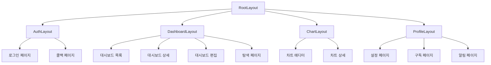

# E-Torch 라우팅 구조

## 1. 개요

E-Torch는 Next.js App Router를 활용하여 직관적이고 체계적인 라우팅 구조를 구현합니다. 이 문서는 E-Torch의 라우팅 아키텍처, 페이지 구성, 라우트 그룹, 레이아웃, 그리고 내비게이션 전략을 설명합니다.

## 2. Next.js App Router 활용 전략

Next.js App Router는 파일 시스템 기반 라우팅을 제공하며, E-Torch는 다음과 같은 기능들을 활용합니다:

### 2.1 주요 활용 기능

- **서버 컴포넌트 우선**: 기본적으로 모든 페이지는 서버 컴포넌트로 구현
- **라우트 그룹**: 관련 기능별로 라우트 그룹화하여 구조화
- **중첩 레이아웃**: 페이지 간에 공유되는 UI 요소를 계층적 레이아웃으로 구현
- **동적 라우트**: 대시보드 ID, 차트 ID 등 동적 파라미터 활용
- **파라렐 라우트**: 동시에 여러 페이지 또는 모달 표시 구현
- **인터셉트 라우트**: 페이지 이동 없이 모달/팝업으로 콘텐츠 표시
- **라우트 핸들러**: API 엔드포인트 구현

## 3. 라우팅 구조 설계

E-Torch의 라우팅 구조는 기능별로 그룹화되어 있으며, 다음과 같은 주요 섹션으로 구성됩니다:

```
app/
├── (auth)/               # 인증 관련 라우트 그룹
│   ├── login/            # 로그인 페이지
│   ├── callback/         # 소셜 로그인 콜백 처리
│   └── layout.tsx        # 인증 레이아웃
│
├── (dashboard)/          # 대시보드 관련 라우트 그룹
│   ├── dashboard/        # 대시보드 목록 페이지
│   ├── dashboard/[id]/   # 개별 대시보드 상세 페이지
│   ├── dashboard/new/    # 새 대시보드 생성 페이지
│   ├── dashboard/[id]/edit/ # 대시보드 편집 페이지
│   ├── explore/          # 대시보드 탐색/발견 페이지
│   └── layout.tsx        # 대시보드 레이아웃
│
├── (chart)/              # 차트 관련 라우트 그룹
│   ├── chart-editor/[id]/ # 차트 에디터 페이지
│   ├── chart/[id]/       # 개별 차트 상세 페이지
│   └── layout.tsx        # 차트 레이아웃
│
├── (profile)/            # 사용자 프로필 관련 라우트 그룹
│   ├── profile/settings/ # 프로필 설정 페이지
│   ├── profile/subscription/ # 구독 관리 페이지
│   ├── profile/notifications/ # 알림 설정 페이지
│   └── layout.tsx        # 프로필 레이아웃
│
├── api/                  # API 라우트
│   ├── auth/             # 인증 관련 API
│   ├── charts/           # 차트 관련 API
│   ├── dashboards/       # 대시보드 관련 API
│   └── data-sources/     # 데이터 소스 관련 API
│
├── layout.tsx            # 루트 레이아웃
└── page.tsx              # 홈페이지
```

## 4. 페이지별 라우트 설계

### 4.1 인증 관련 페이지

| 라우트 | 설명 | 권한 | 컴포넌트 타입 |
|-------|------|------|--------------|
| `/login` | 로그인 페이지 | Public | 서버 컴포넌트 + 클라이언트 폼 |
| `/callback` | OAuth 콜백 처리 | Public | 서버 컴포넌트 |

### 4.2 대시보드 관련 페이지

| 라우트 | 설명 | 권한 | 컴포넌트 타입 |
|-------|------|------|--------------|
| `/dashboard` | 대시보드 목록 | Authenticated | 서버 컴포넌트 + 클라이언트 기능 |
| `/dashboard/[id]` | 대시보드 상세 조회 | Authenticated | 서버 컴포넌트 + 클라이언트 차트 |
| `/dashboard/new` | 새 대시보드 생성 | Authenticated | 서버 컴포넌트 + 클라이언트 에디터 |
| `/dashboard/[id]/edit` | 대시보드 편집 | Owner | 서버 컴포넌트 + 클라이언트 에디터 |
| `/explore` | 공유 대시보드 탐색 | Authenticated | 서버 컴포넌트 + 클라이언트 필터링 |

### 4.3 차트 관련 페이지

| 라우트 | 설명 | 권한 | 컴포넌트 타입 |
|-------|------|------|--------------|
| `/chart-editor/[id]` | 차트 생성/편집 | Authenticated | 서버 컴포넌트 + 클라이언트 에디터 |
| `/chart/[id]` | 개별 차트 상세 조회 | Authenticated | 서버 컴포넌트 + 클라이언트 차트 |

### 4.4 프로필 관련 페이지

| 라우트 | 설명 | 권한 | 컴포넌트 타입 |
|-------|------|------|--------------|
| `/profile/settings` | 사용자 설정 | Authenticated | 서버 컴포넌트 + 클라이언트 폼 |
| `/profile/subscription` | 구독 관리 | Authenticated | 서버 컴포넌트 + 클라이언트 결제 |
| `/profile/notifications` | 알림 설정 | Authenticated | 서버 컴포넌트 + 클라이언트 토글 |

## 5. 레이아웃 구조

E-Torch는 계층적 레이아웃 구조를 사용하여 일관된 사용자 경험을 제공합니다:



### 5.1 루트 레이아웃 (`app/layout.tsx`)

루트 레이아웃은 모든 페이지에 공통적으로 적용되는 레이아웃으로, 다음 요소를 포함합니다:

- 전역 CSS 및 폰트 로드
- 서비스 제공자 (React Query, 상태 관리 등)
- 테마 설정
- 메타데이터 기본값

```tsx
// 추상적인 예시
export default function RootLayout({
  children,
}: {
  children: React.ReactNode
}) {
  return (
    <html lang="ko">
      <body>
        <ThemeProvider>
          <StoreProvider>
            <QueryProvider>
              <ToastProvider>
                {children}
              </ToastProvider>
            </QueryProvider>
          </StoreProvider>
        </ThemeProvider>
      </body>
    </html>
  )
}
```

### 5.2 기능별 레이아웃

#### 5.2.1 인증 레이아웃 (`app/(auth)/layout.tsx`)

- 최소한의 디자인: 로고, 서비스 설명만 표시
- 사이드바 및 헤더 제외
- 중앙 정렬된 카드 형태의 컨테이너

#### 5.2.2 대시보드 레이아웃 (`app/(dashboard)/layout.tsx`)

- 사이드 내비게이션 바: 대시보드 목록, 탐색, 설정 등 링크
- 상단 헤더: 검색, 사용자 메뉴, 알림 등
- 메인 콘텐츠 영역: 페이지별 콘텐츠 표시

#### 5.2.3 차트 레이아웃 (`app/(chart)/layout.tsx`)

- 상단 헤더: 차트 제목, 저장/취소 버튼 등
- 전체 화면 콘텐츠 영역: 에디터/뷰어 표시
- 백 버튼: 이전 페이지로 돌아가기

#### 5.2.4 프로필 레이아웃 (`app/(profile)/layout.tsx`)

- 사이드 내비게이션 바: 설정 카테고리 링크
- 상단 헤더: 프로필 제목, 사용자 정보
- 메인 콘텐츠 영역: 설정 폼 표시

## 6. 동적 라우팅 전략

### 6.1 대시보드 및 차트 ID 라우팅

```tsx
// 추상적인 예시: app/dashboard/[id]/page.tsx
export default async function DashboardPage({ params }: { params: { id: string } }) {
  // 서버에서 대시보드 데이터 페칭
  const dashboard = await fetchDashboard(params.id);
  
  // 메타데이터 생성
  export async function generateMetadata({ params }: { params: { id: string } }) {
    const dashboard = await fetchDashboard(params.id);
    return {
      title: `${dashboard.title} - E-Torch`,
      description: dashboard.description || '경제지표 대시보드',
    };
  }
  
  // 클라이언트 컴포넌트로 데이터 전달
  return <DashboardView dashboardId={params.id} initialData={dashboard} />;
}
```

### 6.2 동적 라우트 유효성 검증

```tsx
// 추상적인 예시: 유효한 대시보드 ID만 허용
export async function generateStaticParams() {
  // 빌드 타임에 모든 대시보드 ID 생성
  const dashboards = await fetchAllDashboards();
  return dashboards.map(dashboard => ({
    id: dashboard.id,
  }));
}
```

## 7. 네비게이션 및 라우트 보호

### 7.1 네비게이션 컴포넌트

E-Torch는 다음과 같은 네비게이션 컴포넌트를 사용합니다:

#### 7.1.1 주요 사이드바 (`MainSidebar`)

- 대시보드 섹션: 내 대시보드, 새 대시보드 생성
- 탐색 섹션: 공유 대시보드 탐색
- 설정 섹션: 프로필 설정

#### 7.1.2 헤더 네비게이션 (`HeaderNav`)

- 서비스 로고 및 브랜드
- 현재 페이지 제목
- 사용자 메뉴 (프로필, 설정, 로그아웃)
- 검색 바

#### 7.1.3 브레드크럼 네비게이션 (`Breadcrumbs`)

- 현재 페이지 경로 표시
- 상위 카테고리로 이동 링크

### 7.2 라우트 보호 전략

E-Torch는 여러 수준의 라우트 보호를 구현합니다:

#### 7.2.1 미들웨어 기반 인증 검사

```typescript
// middleware.ts 추상적인 예시
export function middleware(request: NextRequest) {
  const { pathname } = request.nextUrl;
  const token = request.cookies.get('token')?.value;
  
  // 공개 경로 패턴
  const publicPaths = ['/login', '/callback', '/api/auth'];
  const isPublicPath = publicPaths.some(path => pathname.startsWith(path));
  
  // 인증이 필요한 경로에 토큰 없이 접근하는 경우
  if (!isPublicPath && !token) {
    return NextResponse.redirect(new URL('/login', request.url));
  }
  
  return NextResponse.next();
}

export const config = {
  matcher: ['/((?!_next/static|_next/image|favicon.ico).*)'],
};
```

#### 7.2.2 서버 컴포넌트에서의 권한 검사

```tsx
// 추상적인 예시
export default async function ProtectedPage() {
  const session = await getServerSession();
  
  if (!session) {
    redirect('/login');
  }
  
  // 추가 권한 검사
  if (session.user.role !== 'admin') {
    notFound(); // 404 페이지 표시 또는
    // redirect('/unauthorized'); // 권한 없음 페이지로 리디렉션
  }
  
  return <ProtectedContent />;
}
```

#### 7.2.3 클라이언트 컴포넌트 보호 래퍼

```tsx
// 추상적인 예시
'use client';

import { useSession } from 'next-auth/react';
import { useRouter } from 'next/navigation';
import { useEffect } from 'react';

export function AuthGuard({ children }: { children: React.ReactNode }) {
  const { data: session, status } = useSession();
  const router = useRouter();
  
  useEffect(() => {
    if (status === 'unauthenticated') {
      router.push('/login');
    }
  }, [status, router]);
  
  if (status === 'loading') {
    return <LoadingSpinner />;
  }
  
  return session ? <>{children}</> : null;
}
```

## 8. 클라이언트 측 네비게이션

E-Torch는 Next.js의 클라이언트 측 네비게이션을 최대한 활용하여 SPA 같은 사용자 경험을 제공합니다:

### 8.1 프리페칭 전략

```tsx
// 추상적인 예시
import Link from 'next/link';

export function DashboardList({ dashboards }) {
  return (
    <ul>
      {dashboards.map(dashboard => (
        <li key={dashboard.id}>
          <Link
            href={`/dashboard/${dashboard.id}`}
            prefetch={true} // 자동 프리페칭 활성화
          >
            {dashboard.title}
          </Link>
        </li>
      ))}
    </ul>
  );
}
```

### 8.2 프로그래매틱 네비게이션

```tsx
// 추상적인 예시
'use client';

import { useRouter } from 'next/navigation';

export function CreateDashboardForm() {
  const router = useRouter();
  
  const handleSubmit = async (event) => {
    event.preventDefault();
    // 폼 데이터 처리 및 대시보드 생성
    const newDashboard = await createDashboard(formData);
    
    // 생성된 대시보드 페이지로 리디렉션
    router.push(`/dashboard/${newDashboard.id}`);
  };
  
  return (
    <form onSubmit={handleSubmit}>
      {/* 폼 필드들 */}
      <button type="submit">생성</button>
    </form>
  );
}
```

### 8.3 모달 및 인터셉트 라우트

E-Torch는 인터셉트 라우트를 활용하여 페이지 전환 없이 모달 형태로 콘텐츠를 표시합니다:

```
app/
├── dashboard/
│   ├── page.tsx                # 대시보드 목록 페이지
│   ├── [id]/
│   │   └── page.tsx            # 대시보드 상세 페이지
│   │
│   └── @modal/                 # 모달용 인터셉트 라우트
│       └── [id]/
│           └── page.tsx        # 모달로 표시할 대시보드 상세
```

## 9. 메타데이터 전략

E-Torch는 각 페이지별로 적절한 메타데이터를 생성하여 SEO 및 소셜 공유를 최적화합니다:

### 9.1 정적 메타데이터

```tsx
// 추상적인 예시: app/page.tsx
export const metadata = {
  title: 'E-Torch - 경제지표 대시보드 서비스',
  description: '다양한 출처의 경제지표 데이터를 통합 제공하는 데이터 시각화 플랫폼',
  keywords: '경제지표, 대시보드, 데이터 시각화, KOSIS, ECOS, OECD',
};
```

### 9.2 동적 메타데이터

```tsx
// 추상적인 예시: app/dashboard/[id]/page.tsx
export async function generateMetadata({ params }: { params: { id: string } }) {
  const dashboard = await fetchDashboard(params.id);
  
  return {
    title: `${dashboard.title} - E-Torch`,
    description: dashboard.description || '경제지표 대시보드',
    openGraph: {
      title: dashboard.title,
      description: dashboard.description,
      images: [
        {
          url: dashboard.thumbnailUrl || '/images/dashboard-default-thumbnail.png',
          width: 1200,
          height: 630,
        },
      ],
    },
  };
}
```

## 10. 라우트 핸들러 (API 라우트)

E-Torch는 Next.js의 라우트 핸들러를 활용하여 클라이언트와 서버 간 통신을 위한 API 엔드포인트를 구현합니다:

### 10.1 기본 라우트 핸들러 구조

```typescript
// 추상적인 예시: app/api/dashboards/route.ts
import { NextResponse } from 'next/server';

export async function GET(request: Request) {
  try {
    // 쿼리 파라미터 추출
    const { searchParams } = new URL(request.url);
    const userId = searchParams.get('userId');
    
    // 데이터 조회
    const dashboards = await fetchDashboardsByUser(userId);
    
    // 응답 반환
    return NextResponse.json(dashboards);
  } catch (error) {
    return NextResponse.json(
      { error: 'Failed to fetch dashboards' },
      { status: 500 }
    );
  }
}

export async function POST(request: Request) {
  try {
    // 요청 본문 파싱
    const body = await request.json();
    
    // 데이터 생성
    const dashboard = await createDashboard(body);
    
    // 응답 반환
    return NextResponse.json(dashboard, { status: 201 });
  } catch (error) {
    return NextResponse.json(
      { error: 'Failed to create dashboard' },
      { status: 500 }
    );
  }
}
```

### 10.2 동적 세그먼트를 활용한 API 라우트

```typescript
// 추상적인 예시: app/api/dashboards/[id]/route.ts
import { NextResponse } from 'next/server';

export async function GET(
  request: Request,
  { params }: { params: { id: string } }
) {
  try {
    const dashboard = await fetchDashboardById(params.id);
    
    if (!dashboard) {
      return NextResponse.json(
        { error: 'Dashboard not found' },
        { status: 404 }
      );
    }
    
    return NextResponse.json(dashboard);
  } catch (error) {
    return NextResponse.json(
      { error: 'Failed to fetch dashboard' },
      { status: 500 }
    );
  }
}

export async function PUT(
  request: Request,
  { params }: { params: { id: string } }
) {
  try {
    const body = await request.json();
    const dashboard = await updateDashboard(params.id, body);
    
    return NextResponse.json(dashboard);
  } catch (error) {
    return NextResponse.json(
      { error: 'Failed to update dashboard' },
      { status: 500 }
    );
  }
}

export async function DELETE(
  request: Request,
  { params }: { params: { id: string } }
) {
  try {
    await deleteDashboard(params.id);
    
    return NextResponse.json(
      { message: 'Dashboard deleted successfully' },
      { status: 200 }
    );
  } catch (error) {
    return NextResponse.json(
      { error: 'Failed to delete dashboard' },
      { status: 500 }
    );
  }
}
```

## 11. 서버 액션 활용

E-Torch는 Next.js의 서버 액션을 활용하여 폼 제출 및 데이터 변경을 처리합니다:

```typescript
// 추상적인 예시: app/dashboard/[id]/edit/actions.ts
'use server';

import { revalidatePath } from 'next/cache';
import { redirect } from 'next/navigation';
import { saveDashboard } from '@/services/dashboard-service';
import { Dashboard } from '@e-torch/core';

export async function saveDashboardAction(
  dashboardId: string,
  formData: FormData | Dashboard
) {
  try {
    // FormData를 JavaScript 객체로 변환 (필요 시)
    const dashboardData = formData instanceof FormData
      ? Object.fromEntries(formData.entries())
      : formData;
    
    // 서버에 저장
    const savedDashboard = await saveDashboard(dashboardId, dashboardData);
    
    // 캐시 무효화
    revalidatePath(`/dashboard/${dashboardId}`);
    
    // 리디렉션
    redirect(`/dashboard/${dashboardId}`);
    
    // 또는 성공 결과 반환
    return { success: true, dashboard: savedDashboard };
  } catch (error) {
    return {
      success: false,
      error: error instanceof Error ? error.message : '알 수 없는 오류가 발생했습니다.'
    };
  }
}
```

## 12. 결론

E-Torch의 라우팅 구조는 Next.js App Router의 최신 기능을 활용하여 사용자 중심의 직관적인 인터페이스를 제공합니다. 페이지 간 일관된 경험을 위한 중첩 레이아웃, 효율적인 데이터 로딩을 위한 서버 컴포넌트, 그리고 보안을 위한 라우트 보호 전략이 핵심 요소로 구현되었습니다.

계층적인 라우트 그룹화를 통해 코드 구조가 명확하게 정리되어 있으며, 동적 라우팅을 통해 대시보드와 차트의 유연한 접근이 가능합니다. 또한 서버 액션과 라우트 핸들러를 통해 클라이언트와 서버 간 효율적인 통신이 이루어집니다.

이러한 라우팅 구조는 E-Torch의 복잡한 기능을 직관적으로 사용할 수 있게 해주며, 확장 가능한 아키텍처를 제공하여 향후 새로운 기능 추가에도 유연하게 대응할 수 있습니다.
