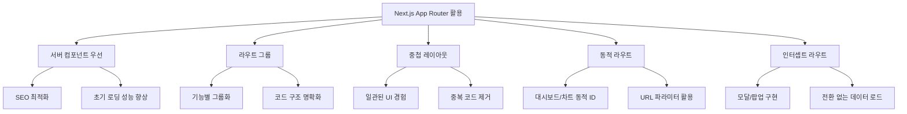
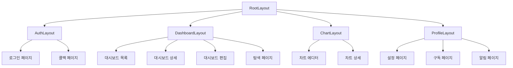
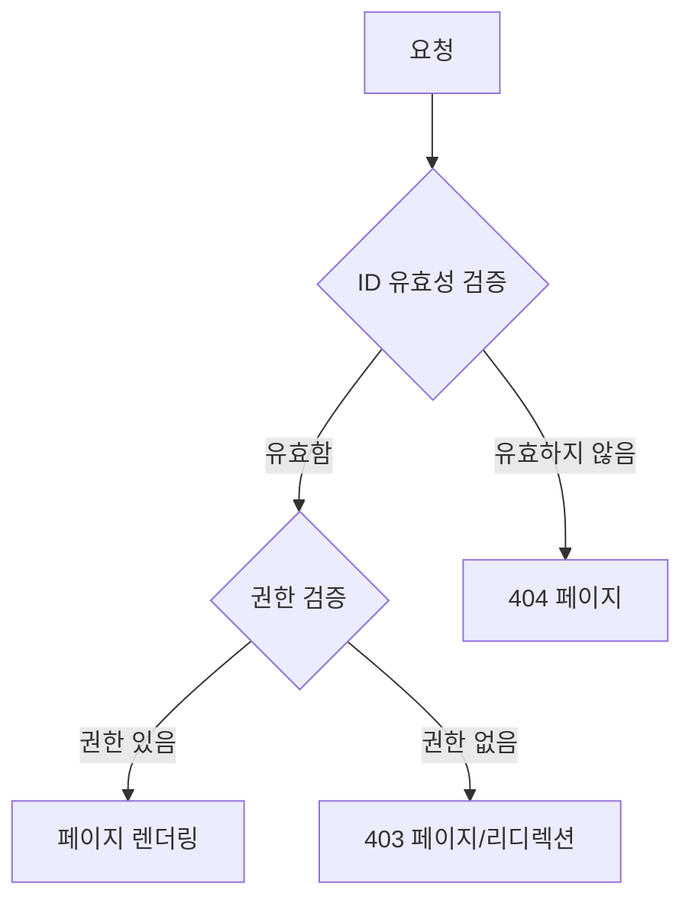
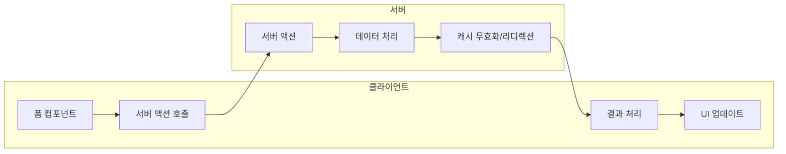

# E-Torch 라우팅 구조

## 1. 개요

E-Torch는 Next.js App Router를 활용하여 직관적이고 체계적인 라우팅 구조를 구현합니다. 이 문서는 E-Torch의 라우팅 아키텍처, 페이지 구성, 라우트 그룹, 레이아웃, 그리고 내비게이션 전략을 설명합니다.

## 2. Next.js App Router 활용 전략

Next.js App Router의 파일 시스템 기반 라우팅을 활용하여 다음과 같은 기능들을 구현합니다:



## 3. 라우팅 구조 설계

E-Torch의 라우팅 구조는 기능별로 그룹화되며, 다음과 같은 주요 섹션으로 구성됩니다:

```mermaid
graph TD
    Root[app/] --> Auth["(auth)/"]
    Root --> Dashboard["(dashboard)/"]
    Root --> Chart["(chart)/"]
    Root --> Profile["(profile)/"]
    Root --> API["api/"]
    Root --> Layout["layout.tsx"]
    Root --> Page["page.tsx"]
    
    Auth --> Auth1["login/"]
    Auth --> Auth2["callback/"]
    Auth --> AuthLayout["layout.tsx"]
    
    Dashboard --> Dash1["dashboard/"]
    Dashboard --> Dash2["dashboard/[id]/"]
    Dashboard --> Dash3["dashboard/new/"]
    Dashboard --> Dash4["dashboard/[id]/edit/"]
    Dashboard --> Dash5["explore/"]
    Dashboard --> DashLayout["layout.tsx"]
    
    Chart --> Chart1["chart-editor/[id]/"]
    Chart --> Chart2["chart/[id]/"]
    Chart --> ChartLayout["layout.tsx"]
    
    Profile --> Prof1["profile/settings/"]
    Profile --> Prof2["profile/subscription/"]
    Profile --> Prof3["profile/notifications/"]
    Profile --> ProfLayout["layout.tsx"]
    
    API --> API1["auth/"]
    API --> API2["charts/"]
    API --> API3["dashboards/"]
    API --> API4["data-sources/"]
```



## 4. 기본 및 확장 라우팅 구조

E-Torch의 라우팅 구조는 **기본 라우팅**과 **확장 라우팅**으로 구분됩니다. 이는 개발 단계와 기능 구현 우선순위에 따라 점진적으로 구현됩니다.

### 4.1 기본 라우팅 구조

기본 라우팅 구조는 제품의 핵심 기능을 제공하는 필수 경로로 구성됩니다. 이는 MVP(Minimum Viable Product) 단계에서 우선적으로 구현됩니다.

```
app/
├── (auth)/               # 인증 관련 라우트 그룹
│   ├── login/            # 로그인 페이지
│   ├── callback/         # 소셜 로그인 콜백 처리
│   └── layout.tsx        # 인증 레이아웃
│
├── (dashboard)/          # 대시보드 관련 라우트 그룹
│   ├── dashboard/        # 대시보드 목록 페이지
│   ├── dashboard/[id]/   # 개별 대시보드 상세 페이지
│   ├── dashboard/new/    # 새 대시보드 생성 페이지
│   ├── dashboard/[id]/edit/ # 대시보드 편집 페이지
│   ├── explore/          # 대시보드 탐색/발견 페이지
│   └── layout.tsx        # 대시보드 레이아웃
│
├── (chart)/              # 차트 관련 라우트 그룹
│   ├── chart-editor/[id]/ # 차트 에디터 페이지
│   ├── chart/[id]/       # 개별 차트 상세 페이지
│   └── layout.tsx        # 차트 레이아웃
│
├── (profile)/            # 사용자 프로필 관련 라우트 그룹
│   ├── profile/settings/ # 프로필 설정 페이지
│   ├── profile/subscription/ # 구독 관리 페이지
│   └── layout.tsx        # 프로필 레이아웃
│
├── layout.tsx            # 루트 레이아웃
└── page.tsx              # 홈페이지
```

### 4.2 확장 라우팅 구조

확장 라우팅 구조는 향상된 사용자 경험을 위한 고급 라우팅 패턴을 포함합니다. 이는 기본 기능 구현 후 점진적으로 추가됩니다.

```
# 기본 라우팅 구조에 다음과 같은 확장 패턴 추가

app/
├── @modal/               # 인터셉트 라우트 (모달용)
│   ├── dashboard/[id]/   # 대시보드 모달 표시
│   └── chart/[id]/       # 차트 모달 표시
│
├── (dashboard)/          
│   └── @dashboard/       # 병렬 라우트 (대시보드 부가 정보용)
│       ├── info/         # 대시보드 정보 탭
│       └── share/        # 대시보드 공유 탭
│
├── (chart)/              
│   └── preview/          # 차트 미리보기 페이지
│
└── (profile)/             
    └── notifications/    # 알림 설정 페이지
```

### 4.3 라우팅 유형 매핑 테이블

| 경로 | 기본/확장 | 라우팅 패턴 | 구현 우선순위 |
|-----|-----------|-----------|-------------|
| `/login`, `/callback` | 기본 | 일반 라우트 | 상 (MVP) |
| `/dashboard`, `/dashboard/[id]` | 기본 | 일반 라우트 | 상 (MVP) |
| `/dashboard/new`, `/dashboard/[id]/edit` | 기본 | 일반 라우트 | 상 (MVP) |
| `/explore` | 기본 | 일반 라우트 | 상 (MVP) |
| `/chart-editor/[id]`, `/chart/[id]` | 기본 | 일반 라우트 | 상 (MVP) |
| `/profile/*` | 기본 | 일반 라우트 | 중 |
| `@modal/dashboard/[id]` | 확장 | 인터셉트 라우트 | 중 |
| `@modal/chart/[id]` | 확장 | 인터셉트 라우트 | 중 |
| `@dashboard/info`, `@dashboard/share` | 확장 | 병렬 라우트 | 하 |
| `/chart/preview` | 확장 | 일반 라우트 | 하 |
| `/profile/notifications` | 확장 | 일반 라우트 | 하 |

## 5. 페이지별 라우트 설계

### 5.1 인증 관련 페이지

| 라우트 | 설명 | 권한 | 컴포넌트 타입 |
|-------|------|------|--------------|
| `/login` | 로그인 페이지 | Public | 서버 + 클라이언트 폼 |
| `/callback` | OAuth 콜백 처리 | Public | 서버 컴포넌트 |

### 5.2 대시보드 관련 페이지

| 라우트 | 설명 | 권한 | 컴포넌트 타입 |
|-------|------|------|--------------|
| `/dashboard` | 대시보드 목록 | Authenticated | 서버 + 클라이언트 기능 |
| `/dashboard/[id]` | 대시보드 상세 조회 | Authenticated | 서버 + 클라이언트 차트 |
| `/dashboard/new` | 새 대시보드 생성 | Authenticated | 서버 + 클라이언트 에디터 |
| `/dashboard/[id]/edit` | 대시보드 편집 | Owner | 서버 + 클라이언트 에디터 |
| `/explore` | 공유 대시보드 탐색 | Authenticated | 서버 + 클라이언트 필터링 |

### 5.3 차트 관련 페이지

| 라우트 | 설명 | 권한 | 컴포넌트 타입 |
|-------|------|------|--------------|
| `/chart-editor/[id]` | 차트 생성/편집 | Authenticated | 서버 + 클라이언트 에디터 |
| `/chart/[id]` | 개별 차트 상세 조회 | Authenticated | 서버 + 클라이언트 차트 |

### 5.4 프로필 관련 페이지

| 라우트 | 설명 | 권한 | 컴포넌트 타입 |
|-------|------|------|--------------|
| `/profile/settings` | 사용자 설정 | Authenticated | 서버 + 클라이언트 폼 |
| `/profile/subscription` | 구독 관리 | Authenticated | 서버 + 클라이언트 결제 |
| `/profile/notifications` | 알림 설정 | Authenticated | 서버 + 클라이언트 토글 |

## 6. 레이아웃 구조

E-Torch는 계층적 레이아웃 구조를 사용하여 일관된 사용자 경험을 제공합니다:



### 6.1 레이아웃 책임 분리

각 레이아웃은 명확한 책임을 갖는 구조로 설계되어 있습니다:

| 레이아웃 | 책임 |
|---------|-----|
| **RootLayout** | 전역 CSS/폰트, 서비스 프로바이더, 테마 설정, 기본 메타데이터 |
| **AuthLayout** | 최소 디자인, 로고 및 설명, 중앙 정렬 컨테이너 |
| **DashboardLayout** | 사이드 내비게이션, 상단 헤더, 메인 콘텐츠 영역 |
| **ChartLayout** | 상단 헤더, 전체 화면 콘텐츠, 백 버튼 |
| **ProfileLayout** | 사이드 내비게이션, 상단 헤더, 메인 콘텐츠 영역 |

## 7. 동적 라우팅 전략

### 7.1 대시보드 및 차트 ID 라우팅 패턴

동적 ID 기반 라우팅은 다음과 같은 패턴으로 구현됩니다:

```tsx
// app/(dashboard)/dashboard/[id]/page.tsx (서버 컴포넌트)
import { fetchDashboardById } from '@/packages/server-api/dashboard';
import { notFound } from 'next/navigation';

interface DashboardPageProps {
  params: { id: string };
}

export default async function DashboardPage({ params }: DashboardPageProps) {
  // 서버에서 대시보드 데이터 페칭
  const dashboard = await fetchDashboardById(params.id);
  
  if (!dashboard) {
    return notFound();
  }
  
  // 데이터가 있으면 대시보드 렌더링
  return <DashboardContent dashboard={dashboard} />;
}
```

### 7.2 동적 라우트 접근 제어 패턴



## 8. 네비게이션 및 라우트 보호

### 8.1 네비게이션 컴포넌트 구조

E-Torch의 네비게이션 시스템은 다음과 같은 주요 컴포넌트로 구성됩니다:

- **SideNavigation**: 주요 메뉴 항목 및 네비게이션 링크 제공
- **HeaderNavigation**: 현재 페이지 제목, 사용자 메뉴, 검색 바 등
- **BreadcrumbNavigation**: 현재 위치 및 상위 카테고리 표시

### 8.2 라우트 보호 아키텍처

라우트 보호는 다층적 접근으로 구현됩니다:

1. **미들웨어 보호**:
   - 요청 경로 검사
   - 토큰 유효성 검증
   - 인증 필요 시 리디렉션

2. **서버 컴포넌트 보호**:
   - 세션 검증
   - 권한 검증
   - 리디렉션/404 처리

3. **클라이언트 래퍼 보호**:
   - AuthGuard 컴포넌트
   - 세션 상태 검사
   - 로딩 상태 처리

```tsx
// middleware.ts
export function middleware(request: NextRequest) {
  const pathname = request.nextUrl.pathname;
  
  // 공개 라우트는 통과
  if (publicRoutes.some(route => pathname.startsWith(route))) {
    return NextResponse.next();
  }
  
  // 토큰 검증
  const token = request.cookies.get('authToken')?.value;
  
  if (!token) {
    const url = new URL('/login', request.url);
    url.searchParams.set('redirectTo', pathname);
    return NextResponse.redirect(url);
  }
  
  // 토큰 유효성 검사
  try {
    const decoded = validateToken(token);
    // 유효하면 통과
    return NextResponse.next();
  } catch (error) {
    // 유효하지 않으면 로그인으로 리디렉션
    const url = new URL('/login', request.url);
    return NextResponse.redirect(url);
  }
}
```

## 9. 클라이언트 측 네비게이션 최적화

### 9.1 효율적인 네비게이션 패턴

```tsx
// 링크 컴포넌트 사용 예시
import Link from 'next/link';

export function DashboardCard({ dashboard }) {
  return (
    <Link 
      href={`/dashboard/${dashboard.id}`}
      prefetch={true} // 자동 prefetch
    >
      <div className="card">
        <h3>{dashboard.title}</h3>
        <p>{dashboard.description}</p>
      </div>
    </Link>
  );
}

// 프로그래매틱 네비게이션
import { useRouter } from 'next/navigation';

export function SaveButton({ dashboardId, onSave }) {
  const router = useRouter();
  
  const handleSave = async () => {
    const result = await onSave();
    if (result.success) {
      router.push(`/dashboard/${dashboardId}`);
    }
  };
  
  return <button onClick={handleSave}>저장</button>;
}
```

### 9.2 모달 라우팅 구조

모달 라우팅은 인터셉트 라우트를 사용하여 구현합니다:

```
app/
├── dashboard/[id]/
│   └── page.tsx         # 일반 대시보드 페이지
│
└── @modal/
    └── dashboard/[id]/
        └── page.tsx     # 모달로 표시되는 대시보드 페이지
```

```tsx
// app/@modal/dashboard/[id]/page.tsx
import { fetchDashboardById } from '@/packages/server-api/dashboard';

export default async function DashboardModal({ params }) {
  const dashboard = await fetchDashboardById(params.id);
  
  return (
    <div className="modal">
      <h2>{dashboard.title}</h2>
      <DashboardModalContent dashboard={dashboard} />
    </div>
  );
}
```

## 10. 메타데이터 전략

### 10.1 메타데이터 계층 구조

```tsx
// app/layout.tsx (기본 메타데이터)
export const metadata: Metadata = {
  title: {
    template: '%s | E-Torch',
    default: 'E-Torch - 경제지표 대시보드 서비스',
  },
  description: '다양한 출처의 경제지표 데이터를 시각화하는 대시보드 서비스',
  // ... 기타 메타데이터
};

// app/(dashboard)/layout.tsx (섹션 메타데이터)
export const metadata: Metadata = {
  title: 'Dashboard',
  description: '대시보드를 관리하고 시각화하세요',
};

// app/(dashboard)/dashboard/[id]/page.tsx (동적 메타데이터)
export async function generateMetadata({ params }: { params: { id: string } }): Promise<Metadata> {
  const dashboard = await fetchDashboardById(params.id);
  
  if (!dashboard) {
    return {
      title: 'Dashboard Not Found',
    };
  }
  
  return {
    title: dashboard.title,
    description: dashboard.description || '대시보드 상세 정보',
    openGraph: {
      images: [dashboard.thumbnail || '/images/default-dashboard.png'],
    },
  };
}
```

## 11. 서버 액션 활용 전략

Next.js 서버 액션을 활용하여 클라이언트-서버 통신을 간소화합니다. 이 섹션에서는 서버 액션의 라우팅 관점에서의 활용에 초점을 맞춥니다. 컴포넌트 통합 관점의 서버 액션 패턴은 `core-components.md` 문서를 참조하십시오.

### 11.1 서버 액션 워크플로우



### 11.2 라우팅 관련 서버 액션 패턴

- 폼 제출 처리: 사용자 입력 검증 및 데이터베이스 저장 (`/dashboard/new`, `/dashboard/edit`)
- 캐시 무효화: 관련 페이지의 캐시 자동 무효화 (`revalidatePath`)
- 리디렉션: 액션 완료 후 적절한 페이지로 이동 (`redirect`)
- 데이터 프리페칭: 페이지 전환 전 데이터 미리 로드 (`prefetch`)

```tsx
// app/actions/dashboard.ts
'use server';

import { revalidatePath } from 'next/cache';
import { saveDashboard } from '@/packages/server-api/dashboard';
import { getCurrentUser } from '@/packages/server-api/auth';
import { redirect } from 'next/navigation';

export async function saveDashboardAction(
  formData: FormData | Record<string, any>
) {
  // 현재 사용자 가져오기
  const user = await getCurrentUser();
  if (!user) {
    return { success: false, error: '인증되지 않은 사용자' };
  }
  
  try {
    // FormData를 객체로 변환 (필요시)
    const dashboardData = formData instanceof FormData 
      ? Object.fromEntries(formData.entries())
      : formData;
    
    // 소유자 정보 추가
    dashboardData.userId = user.id;
    dashboardData.updatedAt = new Date().toISOString();
    
    // 저장 처리
    const result = await saveDashboard(dashboardData);
    
    // 캐시 무효화
    revalidatePath(`/dashboard/${result.id}`);
    revalidatePath('/dashboard');
    
    return { success: true, data: result };
  } catch (error) {
    return { 
      success: false, 
      error: error instanceof Error ? error.message : '저장 실패'
    };
  }
}
```

```tsx
// 클라이언트 컴포넌트에서 사용 예시
'use client';

import { saveDashboardAction } from '@/app/actions/dashboard';
import { useTransition } from 'react';

export function DashboardForm({ initialData }) {
  const [isPending, startTransition] = useTransition();
  const [formData, setFormData] = useState(initialData || {});
  
  const handleSubmit = (e) => {
    e.preventDefault();
    startTransition(async () => {
      const result = await saveDashboardAction(formData);
      if (result.success) {
        // 성공 처리
      } else {
        // 에러 처리
      }
    });
  };
  
  return (
    <form onSubmit={handleSubmit}>
      {/* 폼 필드들 */}
      <button type="submit" disabled={isPending}>
        {isPending ? '저장 중...' : '저장'}
      </button>
    </form>
  );
}
```

## 12. 결론

E-Torch의 라우팅 구조는 Next.js App Router의 최신 기능을 활용하여 사용자 중심의 직관적인 인터페이스를 제공합니다. 주요 특징은 다음과 같습니다:

- **계층적 레이아웃**: 페이지 간 일관된 사용자 경험 제공
- **기능별 라우트 그룹화**: 코드 구조의 명확한 조직화
- **서버/클라이언트 분리**: 성능과 사용자 경험 최적화
- **동적 라우팅**: 대시보드와 차트에 대한 유연한 접근
- **안전한 라우트 보호**: 다층적 인증 및 권한 검증
- **메타데이터 최적화**: SEO 및 소셜 공유 최적화
- **서버 액션**: 클라이언트-서버 통신 간소화

이 구조는 E-Torch의 복잡한 기능을 직관적으로 접근 가능하게 만들며, 향후 기능 추가 시에도 확장 가능한 견고한 기반을 제공합니다.
