# E-Torch 라우팅 구조

## 1. 개요

E-Torch는 Next.js App Router를 활용하여 직관적이고 체계적인 라우팅 구조를 구현합니다. 이 문서는 E-Torch의 라우팅 아키텍처, 페이지 구성, 라우트 그룹, 레이아웃, 그리고 내비게이션 전략을 설명합니다.

## 2. Next.js App Router 활용 전략

Next.js App Router의 파일 시스템 기반 라우팅을 활용하여 다음과 같은 기능들을 구현합니다:

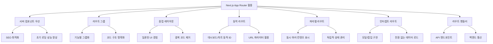

## 3. 라우팅 구조 설계

E-Torch의 라우팅 구조는 기능별로 그룹화되며, 다음과 같은 주요 섹션으로 구성됩니다:

```mermaid
graph TD
    Root[app/] --> Auth["(auth)/"]
    Root --> Dashboard["(dashboard)/"]
    Root --> Chart["(chart)/"]
    Root --> Profile["(profile)/"]
    Root --> API["api/"]
    Root --> Layout["layout.tsx"]
    Root --> Page["page.tsx"]
    
    Auth --> Auth1["login/"]
    Auth --> Auth2["callback/"]
    Auth --> AuthLayout["layout.tsx"]
    
    Dashboard --> Dash1["dashboard/"]
    Dashboard --> Dash2["dashboard/[id]/"]
    Dashboard --> Dash3["dashboard/new/"]
    Dashboard --> Dash4["dashboard/[id]/edit/"]
    Dashboard --> Dash5["explore/"]
    Dashboard --> DashLayout["layout.tsx"]
    
    Chart --> Chart1["chart-editor/[id]/"]
    Chart --> Chart2["chart/[id]/"]
    Chart --> ChartLayout["layout.tsx"]
    
    Profile --> Prof1["profile/settings/"]
    Profile --> Prof2["profile/subscription/"]
    Profile --> Prof3["profile/notifications/"]
    Profile --> ProfLayout["layout.tsx"]
    
    API --> API1["auth/"]
    API --> API2["charts/"]
    API --> API3["dashboards/"]
    API --> API4["data-sources/"]
```

## 4. 기본 및 확장 라우팅 구조

E-Torch의 라우팅 구조는 **기본 라우팅**과 **확장 라우팅**으로 구분됩니다. 이는 개발 단계와 기능 구현 우선순위에 따라 점진적으로 구현됩니다.

### 4.1 기본 라우팅 구조

기본 라우팅 구조는 제품의 핵심 기능을 제공하는 필수 경로로 구성됩니다. 이는 MVP(Minimum Viable Product) 단계에서 우선적으로 구현됩니다.

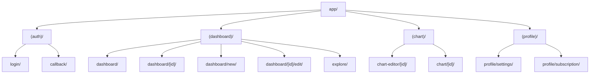

### 4.2 확장 라우팅 구조

확장 라우팅 구조는 향상된 사용자 경험을 위한 고급 라우팅 패턴을 포함합니다. 이는 기본 기능 구현 후 점진적으로 추가됩니다.

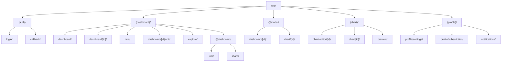

### 4.3 라우팅 유형 매핑 테이블

| 경로 | 기본/확장 | 라우팅 패턴 | 구현 우선순위 |
|-----|-----------|-----------|-------------|
| `/login`, `/callback` | 기본 | 일반 라우트 | 상 (MVP) |
| `/dashboard`, `/dashboard/[id]` | 기본 | 일반 라우트 | 상 (MVP) |
| `/dashboard/new`, `/dashboard/[id]/edit` | 기본 | 일반 라우트 | 상 (MVP) |
| `/explore` | 기본 | 일반 라우트 | 상 (MVP) |
| `/chart-editor/[id]`, `/chart/[id]` | 기본 | 일반 라우트 | 상 (MVP) |
| `/profile/*` | 기본 | 일반 라우트 | 중 |
| `@modal/dashboard/[id]` | 확장 | 인터셉트 라우트 | 중 |
| `@modal/chart/[id]` | 확장 | 인터셉트 라우트 | 중 |
| `@dashboard/info`, `@dashboard/share` | 확장 | 병렬 라우트 | 하 |
| `/chart/preview` | 확장 | 일반 라우트 | 하 |
| `/profile/notifications` | 확장 | 일반 라우트 | 하 |

이 구조를 통해 E-Torch는 핵심 기능을 우선적으로 구현하면서도, 향후 사용자 경험을 향상시키기 위한 고급 라우팅 기능을 점진적으로 도입할 수 있습니다.

## 5. 페이지별 라우트 설계

### 5.1 인증 관련 페이지

| 라우트 | 설명 | 권한 | 컴포넌트 타입 |
|-------|------|------|--------------|
| `/login` | 로그인 페이지 | Public | 서버 + 클라이언트 폼 |
| `/callback` | OAuth 콜백 처리 | Public | 서버 컴포넌트 |

### 5.2 대시보드 관련 페이지

| 라우트 | 설명 | 권한 | 컴포넌트 타입 |
|-------|------|------|--------------|
| `/dashboard` | 대시보드 목록 | Authenticated | 서버 + 클라이언트 기능 |
| `/dashboard/[id]` | 대시보드 상세 조회 | Authenticated | 서버 + 클라이언트 차트 |
| `/dashboard/new` | 새 대시보드 생성 | Authenticated | 서버 + 클라이언트 에디터 |
| `/dashboard/[id]/edit` | 대시보드 편집 | Owner | 서버 + 클라이언트 에디터 |
| `/explore` | 공유 대시보드 탐색 | Authenticated | 서버 + 클라이언트 필터링 |

### 5.3 차트 관련 페이지

| 라우트 | 설명 | 권한 | 컴포넌트 타입 |
|-------|------|------|--------------|
| `/chart-editor/[id]` | 차트 생성/편집 | Authenticated | 서버 + 클라이언트 에디터 |
| `/chart/[id]` | 개별 차트 상세 조회 | Authenticated | 서버 + 클라이언트 차트 |

### 5.4 프로필 관련 페이지

| 라우트 | 설명 | 권한 | 컴포넌트 타입 |
|-------|------|------|--------------|
| `/profile/settings` | 사용자 설정 | Authenticated | 서버 + 클라이언트 폼 |
| `/profile/subscription` | 구독 관리 | Authenticated | 서버 + 클라이언트 결제 |
| `/profile/notifications` | 알림 설정 | Authenticated | 서버 + 클라이언트 토글 |

## 6. 레이아웃 구조

E-Torch는 계층적 레이아웃 구조를 사용하여 일관된 사용자 경험을 제공합니다:

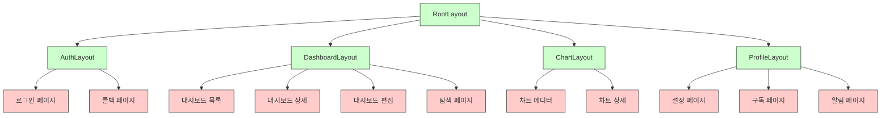

### 6.1 레이아웃 책임 분리

각 레이아웃은 명확한 책임을 갖는 구조로 설계되어 있습니다:

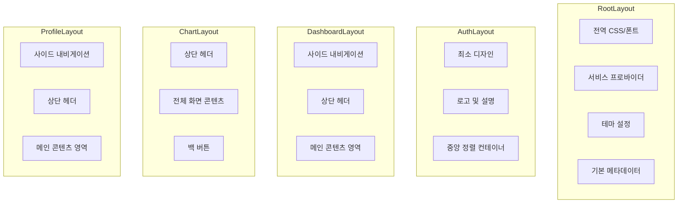

## 7. 동적 라우팅 전략

### 7.1 대시보드 및 차트 ID 라우팅 패턴

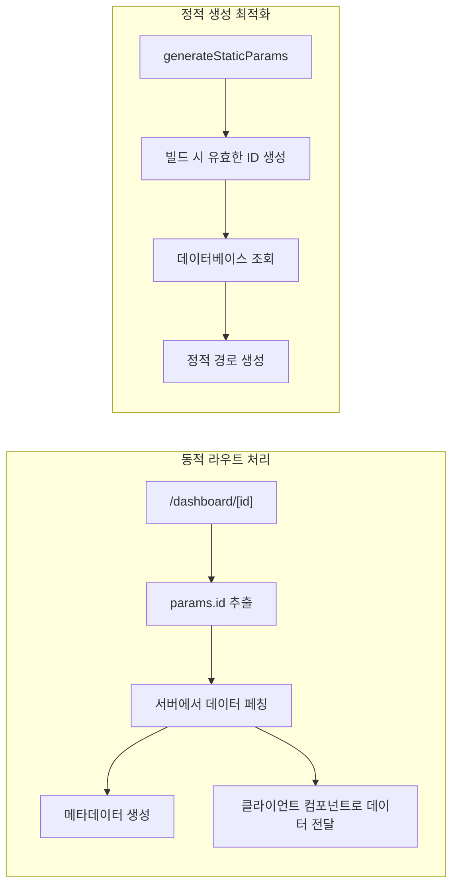

### 7.2 동적 라우트 접근 제어 패턴

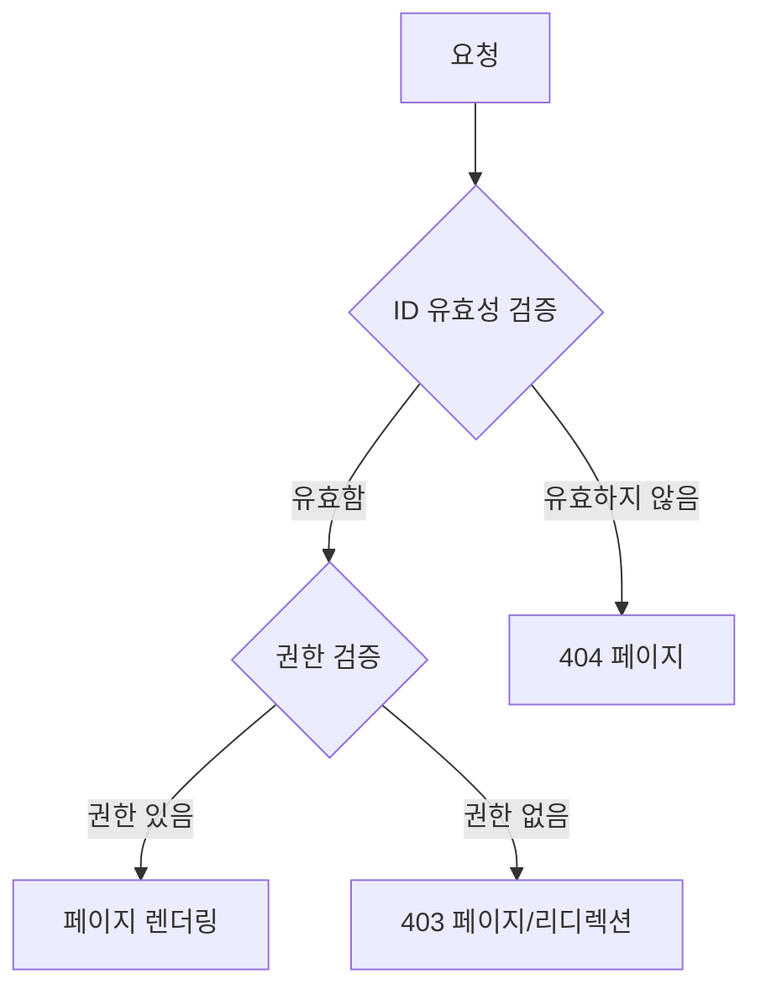

## 8. 네비게이션 및 라우트 보호

### 8.1 네비게이션 컴포넌트 구조

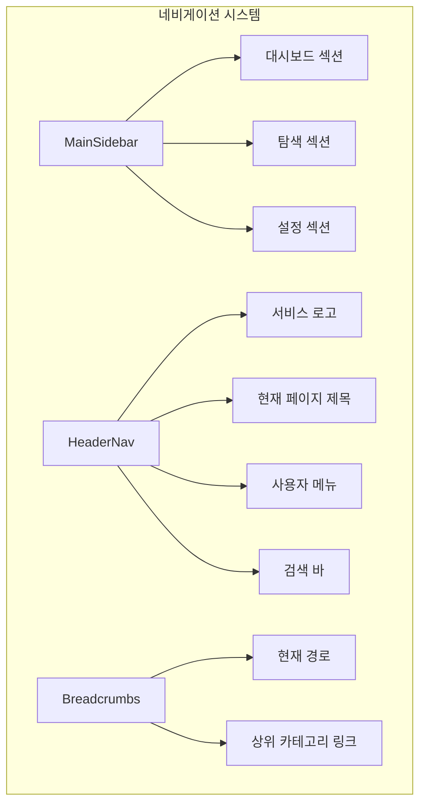

### 8.2 라우트 보호 아키텍처

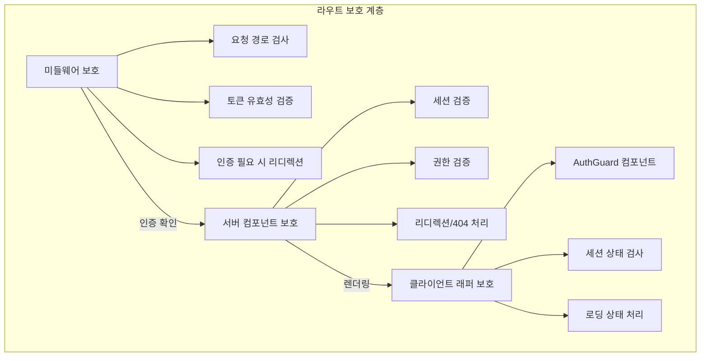

## 9. 클라이언트 측 네비게이션 최적화

### 9.1 효율적인 네비게이션 패턴

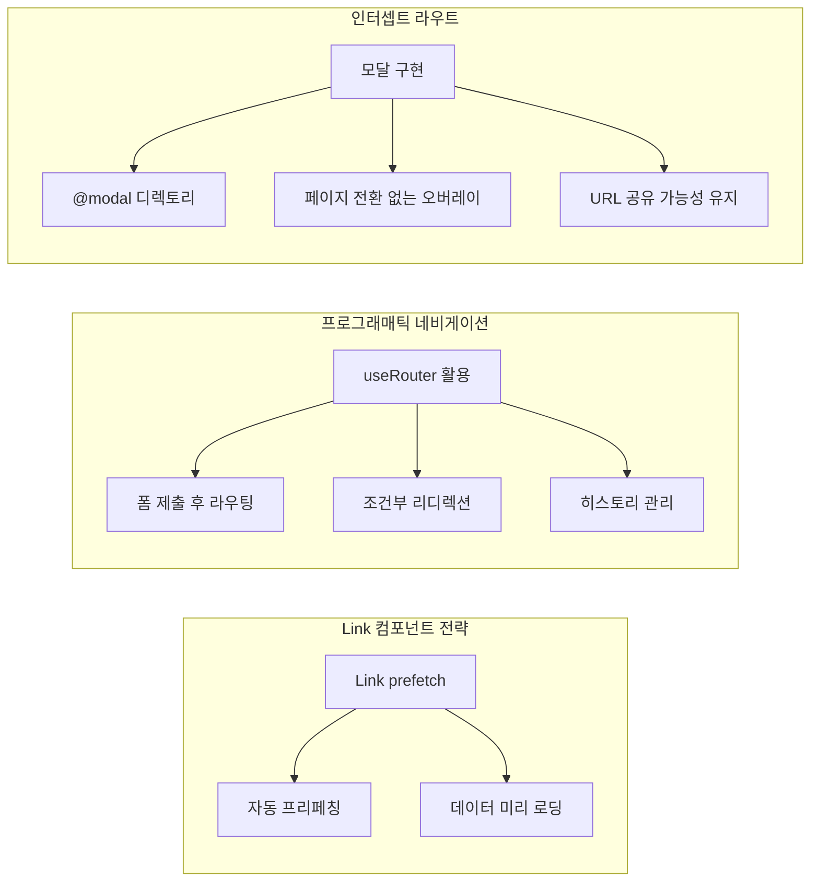

### 9.2 모달 라우팅 구조

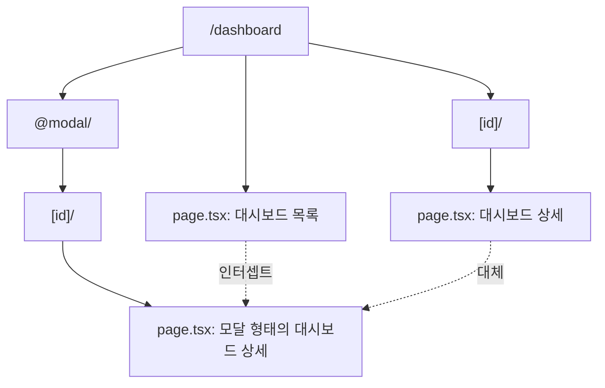

## 10. 메타데이터 전략

### 10.1 메타데이터 계층 구조

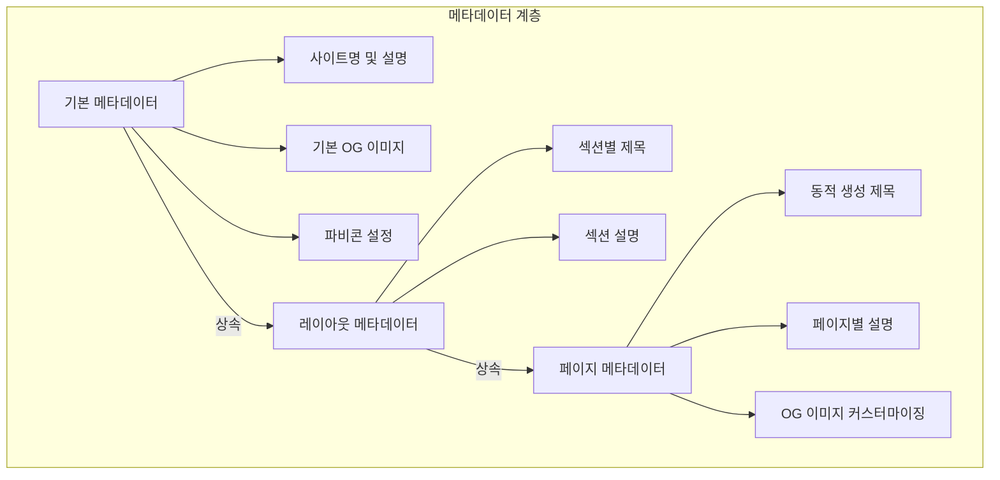

### 10.2 동적 메타데이터 생성 전략

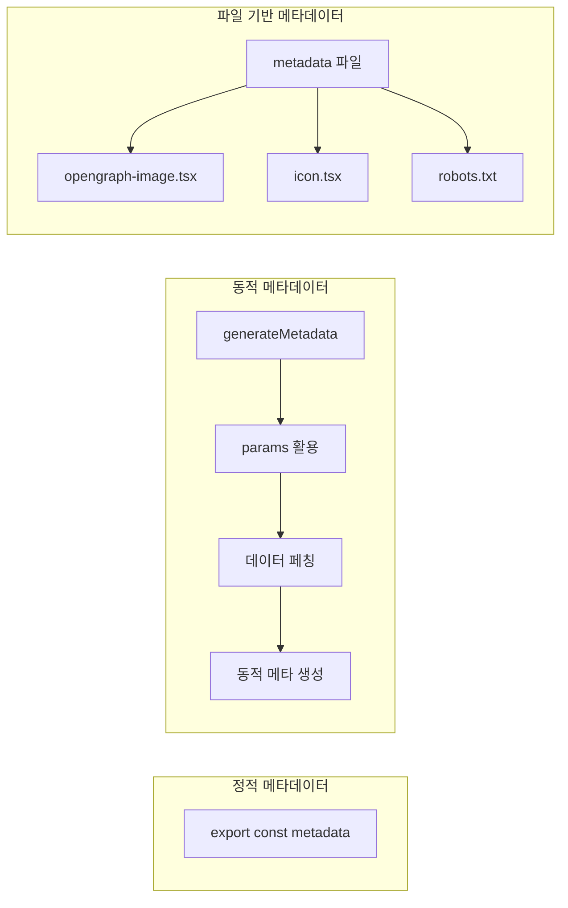

## 11. 라우트 핸들러 (API 라우트)

### 11.1 API 라우트 구조

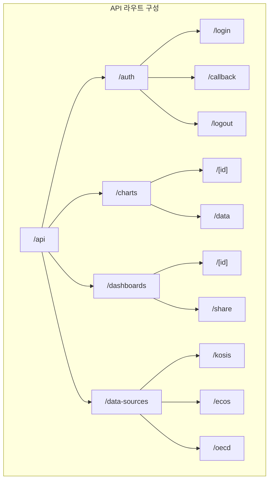

### 11.2 라우트 핸들러 응답 패턴

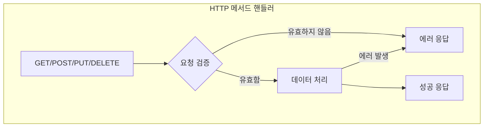

## 12. 서버 액션 활용 전략

### 12.1 서버 액션 워크플로우

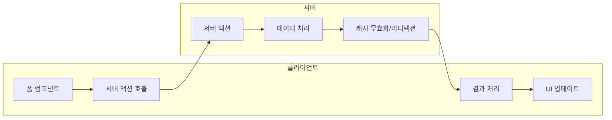

### 12.2 주요 서버 액션 분류

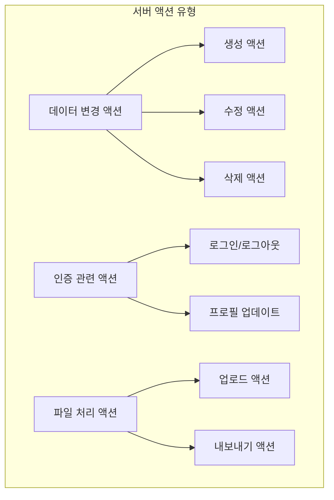

## 13. 결론

E-Torch의 라우팅 구조는 Next.js App Router의 최신 기능을 활용하여 사용자 중심의 직관적인 인터페이스를 제공합니다. 주요 특징은 다음과 같습니다:

- **계층적 레이아웃**: 페이지 간 일관된 사용자 경험 제공
- **기능별 라우트 그룹화**: 코드 구조의 명확한 조직화
- **서버/클라이언트 분리**: 성능과 사용자 경험 최적화
- **동적 라우팅**: 대시보드와 차트에 대한 유연한 접근
- **안전한 라우트 보호**: 다층적 인증 및 권한 검증
- **메타데이터 최적화**: SEO 및 소셜 공유 최적화
- **서버 액션**: 클라이언트-서버 통신 간소화

이 구조는 E-Torch의 복잡한 기능을 직관적으로 접근 가능하게 만들며, 향후 기능 추가 시에도 확장 가능한 견고한 기반을 제공합니다.
