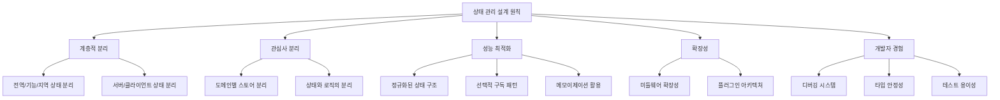
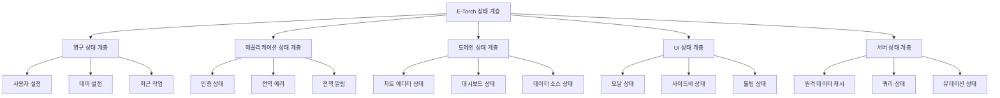

# E-Torch 상태 관리 접근법

## 1. 상태 관리 설계 원칙

E-Torch 프로젝트의 상태 관리는 다음 원칙을 기반으로 설계되었습니다:



## 2. 상태 유형 분류

E-Torch에서는 상태를 다음과 같이 분류하여 관리합니다:

### 2.1 서버 상태 vs 클라이언트 상태

| 서버 상태 | 클라이언트 상태 |
|----------|----------------|
| 원격 서버에 저장된 데이터 | 로컬에서만 의미 있는 UI 상태 |
| API를 통해 CRUD 작업 | 사용자 상호작용에 의한 변경 |
| 여러 클라이언트에서 공유 | 단일 클라이언트에서만 사용 |
| 비동기 로직과 연관 | 동기적 작업 |
| 서버 상태 캐싱/동기화 필요 | 즉시 변경 반영 |

### 2.2 상태 지속성 및 범위

| 상태 유형 | 지속성 | 범위 | 관리 도구 |
|----------|--------|------|----------|
| **영구 상태** | 앱 재시작 후에도 유지 | 사용자 설정, 테마, 최근 작업 | Zustand + persist |
| **애플리케이션 상태** | 세션 동안 유지 | 인증, 전역 알림, 에러 | Zustand |
| **도메인 상태** | 기능별 컨텍스트 동안 유지 | 차트 에디터, 대시보드 에디터 상태 | Zustand, Context API |
| **UI 상태** | 컴포넌트 라이프사이클 | 모달, 드롭다운, 펼침 상태 | useState, useReducer |
| **서버 상태** | 캐시 정책에 따라 유지 | 원격 데이터, API 응답 | Tanstack Query |

## 3. 기술 스택 및 도구

### 3.1 상태 관리 도구 선정 및 이유

| 도구 | 사용 영역 | 선정 이유 |
|------|-----------|----------|
| **Zustand** | 클라이언트 상태 | 간결한 API, 유연한 미들웨어, Redux보다 낮은 보일러플레이트, React와 통합 우수 |
| **Tanstack Query** | 서버 상태 | 캐싱, 재시도, 낙관적 업데이트, 자동 리페칭, devtools 지원 |
| **React Context** | 테마, 인증 등 | 깊은 컴포넌트 트리에서의 상태 공유, 간단한 전역 상태 |
| **React Hook Form** | 폼 상태 | 비제어 컴포넌트 최적화, 유효성 검사, 성능 우수 |
| **localStorage/sessionStorage** | 영구/세션 저장소 | 브라우저 기본 제공 API |

### 3.2 Zustand 미들웨어 활용

E-Torch는 다음 Zustand 미들웨어를 활용하여 상태 관리를 강화합니다:

1. **immer**: 불변성 관리 간소화
2. **persist**: 상태 영속성 (localStorage, sessionStorage)
3. **devtools**: 개발 도구 연동
4. **subscribeWithSelector**: 선택적 구독 최적화
5. **custom middleware**: 로깅, 디버깅, 분석용 커스텀 미들웨어

## 4. 다중 계층 상태 아키텍처

### 4.1 계층 구조



### 4.2 주요 스토어 설계

#### 4.2.1 애플리케이션 상태 스토어

```typescript
// 추상적인 예시
interface AppState {
  theme: 'light' | 'dark' | 'system';
  notifications: Notification[];
  globalErrors: ErrorRecord[];
  isLoading: boolean;
  
  // 액션
  setTheme: (theme: ThemeType) => void;
  addNotification: (notification: Notification) => void;
  clearNotification: (id: string) => void;
  setError: (error: ErrorRecord) => void;
  clearError: (id: string) => void;
  setLoading: (isLoading: boolean) => void;
}
```

#### 4.2.2 차트 에디터 스토어

```typescript
// 추상적인 예시
interface ChartEditorState {
  charts: NormalizedState<ChartConfig>;
  activeChartId: string | null;
  undoStack: Command[];
  redoStack: Command[];
  viewMode: 'edit' | 'preview';
  
  // 액션
  selectChart: (chartId: string | null) => void;
  updateChartProperty: (chartId: string, path: string, value: any) => void;
  createChart: (type: ChartType) => string;
  deleteChart: (id: string) => void;
  undo: () => void;
  redo: () => void;
}
```

#### 4.2.3 대시보드 스토어

```typescript
// 추상적인 예시
interface DashboardState {
  dashboards: NormalizedState<Dashboard>;
  dashboardItems: NormalizedState<DashboardItem>;
  activeDashboardId: string | null;
  layouts: Record<string, Layout[]>;
  
  // 액션
  selectDashboard: (id: string | null) => void;
  addWidget: (dashboardId: string, widget: DashboardItem) => void;
  removeWidget: (dashboardId: string, widgetId: string) => void;
  updateLayout: (dashboardId: string, layout: Layout[]) => void;
  saveDashboard: (dashboard: Dashboard) => Promise<void>;
}
```

## 5. 정규화된 상태 구조

### 5.1 엔티티 정규화 패턴

복잡한 중첩 객체 대신 정규화된 데이터 구조를 사용합니다:

```typescript
// 정규화 전 (중첩 구조)
interface DashboardState {
  dashboards: Dashboard[];
}

interface Dashboard {
  id: string;
  title: string;
  items: DashboardItem[];
}

// 정규화 후 (플랫 구조)
interface NormalizedDashboardState {
  dashboards: {
    byId: Record<string, DashboardInfo>;
    allIds: string[];
  };
  items: {
    byId: Record<string, DashboardItem>;
    allIds: string[];
  };
  itemsByDashboard: Record<string, string[]>;
}

interface DashboardInfo {
  id: string;
  title: string;
  // items 참조 없음
}
```

### 5.2 관계 관리 패턴

엔티티 간 관계는 ID 참조를 사용하여 관리합니다:

```typescript
// 추상적인 예시
{
  dashboards: {
    byId: {
      'dash1': { id: 'dash1', title: 'Economic Trends' },
      'dash2': { id: 'dash2', title: 'Market Analysis' }
    },
    allIds: ['dash1', 'dash2']
  },
  
  items: {
    byId: {
      'chart1': { id: 'chart1', type: 'timeSeries', config: {...} },
      'chart2': { id: 'chart2', type: 'bar', config: {...} },
      'text1': { id: 'text1', type: 'text', content: '...' }
    },
    allIds: ['chart1', 'chart2', 'text1']
  },
  
  itemsByDashboard: {
    'dash1': ['chart1', 'text1'],
    'dash2': ['chart2']
  }
}
```

## 6. 성능 최적화 전략

### 6.1 선택적 구독 패턴

Zustand의 selectors를 활용하여 필요한 상태만 구독합니다:

```jsx
// 비효율적인 방식
const dashboard = useDashboardStore();
// dashboard 전체가 변경될 때마다 리렌더링

// 최적화된 방식
const dashboardTitle = useDashboardStore(state => state.dashboards.byId[activeDashboardId]?.title);
const chartCount = useDashboardStore(state => 
  state.itemsByDashboard[activeDashboardId]?.filter(
    id => state.items.byId[id].type === 'chart'
  ).length
);
// 특정 값이 변경될 때만 리렌더링
```

### 6.2 메모이제이션 활용

계산 비용이 큰 상태 파생 데이터는 메모이제이션을 통해 최적화합니다:

```jsx
// 추상적인 예시
const useChartStatistics = () => {
  const charts = useChartsStore(state => state.charts.allIds.map(id => state.charts.byId[id]));
  
  // 고비용 계산을 메모이제이션
  const statistics = useMemo(() => {
    return {
      byType: charts.reduce((acc, chart) => {
        acc[chart.type] = (acc[chart.type] || 0) + 1;
        return acc;
      }, {}),
      totalDataPoints: charts.reduce((acc, chart) => {
        return acc + (chart.data?.length || 0);
      }, 0)
    };
  }, [charts]); // charts 변경 시에만 재계산
  
  return statistics;
};
```

### 6.3 상태 업데이트 일괄 처리

여러 상태 업데이트를 일괄 처리하여 불필요한 리렌더링을 방지합니다:

```jsx
// 개별 업데이트 (비효율적)
const updateDashboard = () => {
  setTitle('New Title'); // 리렌더링 발생
  setDescription('New Description'); // 리렌더링 발생
  setTimeRange({ from: '2023-01-01', to: '2023-12-31' }); // 리렌더링 발생
};

// 일괄 업데이트 (최적화)
const updateDashboard = () => {
  batchUpdates(() => {
    setTitle('New Title');
    setDescription('New Description');
    setTimeRange({ from: '2023-01-01', to: '2023-12-31' });
  }); // 한 번만 리렌더링 발생
};
```

## 7. 서버 상태 관리

### 7.1 Tanstack Query 활용 전략

```typescript
// 추상적인 예시
const useDashboard = (dashboardId: string) => {
  return useQuery({
    queryKey: ['dashboards', dashboardId],
    queryFn: () => api.getDashboard(dashboardId),
    staleTime: 5 * 60 * 1000, // 5분
    refetchOnWindowFocus: true,
    select: (data) => normalizeData(data) // 응답 데이터 변환
  });
};

const useChartData = (chartId: string, timeRange, period) => {
  return useQuery({
    queryKey: ['chart-data', chartId, timeRange, period],
    queryFn: () => api.getChartData(chartId, timeRange, period),
    staleTime: 2 * 60 * 1000, // 2분
    refetchInterval: 5 * 60 * 1000, // 5분마다 자동 리페치
    select: (data) => processChartData(data)
  });
};
```

### 7.2 낙관적 업데이트 패턴

```typescript
// 추상적인 예시
const useSaveDashboard = () => {
  const queryClient = useQueryClient();
  
  return useMutation({
    mutationFn: (dashboard: Dashboard) => api.saveDashboard(dashboard),
    onMutate: async (newDashboard) => {
      // 기존 쿼리 취소
      await queryClient.cancelQueries({ queryKey: ['dashboards', newDashboard.id] });
      
      // 이전 상태 저장
      const previousDashboard = queryClient.getQueryData(['dashboards', newDashboard.id]);
      
      // 낙관적 업데이트
      queryClient.setQueryData(['dashboards', newDashboard.id], newDashboard);
      
      // onError, onSettled에서 사용할 컨텍스트 반환
      return { previousDashboard };
    },
    onError: (err, newDashboard, context) => {
      // 에러 발생 시 이전 상태로 롤백
      queryClient.setQueryData(
        ['dashboards', newDashboard.id], 
        context.previousDashboard
      );
    },
    onSettled: (data, error, variables) => {
      // 무조건 서버에서 리페치
      queryClient.invalidateQueries({ queryKey: ['dashboards', variables.id] });
    }
  });
};
```

### 7.3 쿼리 키 설계 전략

계층적 쿼리 키를 사용하여 관련 쿼리를 효율적으로 관리합니다:

```typescript
// 추상적인 예시
const queryKeys = {
  dashboards: {
    all: ['dashboards'] as const,
    lists: () => [...queryKeys.dashboards.all, 'list'] as const,
    list: (filters: string) => [...queryKeys.dashboards.lists(), { filters }] as const,
    details: () => [...queryKeys.dashboards.all, 'detail'] as const,
    detail: (id: string) => [...queryKeys.dashboards.details(), id] as const,
  },
  charts: {
    all: ['charts'] as const,
    details: () => [...queryKeys.charts.all, 'detail'] as const,
    detail: (id: string) => [...queryKeys.charts.details(), id] as const,
    data: (id: string, params: ChartDataParams) => 
      [...queryKeys.charts.detail(id), 'data', params] as const,
  }
};

// 사용 예시
useQuery({
  queryKey: queryKeys.dashboards.detail('dash1'),
  queryFn: () => api.getDashboard('dash1')
});

// 관련 쿼리 무효화
queryClient.invalidateQueries({
  queryKey: queryKeys.dashboards.details(),
});
```

### 7.4 경제지표별 쿼리 최적화 전략

경제지표 데이터는 갱신 주기, 중요도, 데이터 양이 각기 달라 유형별 최적화가 필요합니다.

#### 7.4.1 지표별 캐싱 전략

```typescript
// 지표 유형별 캐싱 설정
interface CachingStrategy {
  staleTime: number; // ms
  gcTime: number; // ms
  refetchOnWindowFocus: boolean;
  refetchOnMount: boolean;
  refetchInterval: number | false; // ms or false
}

// 지표 유형에 따른 캐싱 전략 맵
const indicatorCachingStrategies: Record<IndicatorCategory, CachingStrategy> = {
  // 실시간 금융 지표 (환율, 주가 등)
  FINANCIAL_REALTIME: {
    staleTime: 60 * 1000, // 1분
    gcTime: 5 * 60 * 1000, // 5분
    refetchOnWindowFocus: true,
    refetchOnMount: true,
    refetchInterval: 60 * 1000 // 1분마다 갱신
  },
  
  // 일일 경제지표 (금융시장 일별 지표)
  FINANCIAL_DAILY: {
    staleTime: 30 * 60 * 1000, // 30분
    gcTime: 24 * 60 * 60 * 1000, // 1일
    refetchOnWindowFocus: true,
    refetchOnMount: true,
    refetchInterval: false // 자동 갱신 없음
  },
  
  // 월간 경제지표 (물가지수, 실업률 등)
  ECONOMIC_MONTHLY: {
    staleTime: 3 * 60 * 60 * 1000, // 3시간
    gcTime: 7 * 24 * 60 * 60 * 1000, // 7일
    refetchOnWindowFocus: false,
    refetchOnMount: true,
    refetchInterval: false
  },
  
  // 분기별/연간 경제지표 (GDP 등)
  ECONOMIC_QUARTERLY: {
    staleTime: 12 * 60 * 60 * 1000, // 12시간
    gcTime: 30 * 24 * 60 * 60 * 1000, // 30일
    refetchOnWindowFocus: false,
    refetchOnMount: true,
    refetchInterval: false
  }
};

// 지표 코드별 카테고리 매핑 및 최적 캐싱 전략 적용
function useIndicatorData(
  source: 'KOSIS' | 'ECOS' | 'OECD',
  indicatorCode: string,
  timeRange: TimeRange,
  period: 'D' | 'M' | 'Q' | 'A'
) {
  // 지표에 대한 카테고리 및 캐싱 전략 조회
  const category = getIndicatorCategory(indicatorCode);
  const cachingStrategy = indicatorCachingStrategies[category];
  
  // Tanstack Query로 데이터 조회
  return useQuery({
    queryKey: ['indicator', source, indicatorCode, timeRange, period],
    queryFn: () => fetchIndicatorData(source, indicatorCode, timeRange, period),
    ...cachingStrategy
  });
}
```

#### 7.4.2 의존적 쿼리 관리

경제지표 간 의존성이 있는 경우(예: 금리차 지표)의 쿼리 관리 패턴:

```typescript
// 종속적 지표 데이터 조회 예시 (장단기 금리차)
function useInterestRateSpread() {
  // 장기 금리 조회
  const { data: longTermRate, isLoading: isLoadingLong } = useQuery({
    queryKey: ['indicator', 'ECOS', 'Bond_Yield_10yr'],
    queryFn: () => fetchIndicatorData('ECOS', 'Bond_Yield_10yr', defaultTimeRange, 'D')
  });
  
  // 단기 금리 조회 (장기 금리 로드 후)
  const { data: shortTermRate, isLoading: isLoadingShort } = useQuery({
    queryKey: ['indicator', 'ECOS', 'Bond_Yield_1yr'],
    queryFn: () => fetchIndicatorData('ECOS', 'Bond_Yield_1yr', defaultTimeRange, 'D'),
    enabled: !!longTermRate // 장기 금리 데이터가 있을 때만 로드
  });
  
  // 금리차 계산 (두 데이터 모두 로드 후)
  const spreadData = useMemo(() => {
    if (!longTermRate || !shortTermRate) return null;
    
    // 날짜별로 데이터 매핑하여 차이 계산
    return calculateRateSpread(longTermRate, shortTermRate);
  }, [longTermRate, shortTermRate]);
  
  return {
    data: spreadData,
    isLoading: isLoadingLong || isLoadingShort
  };
}
```

## 8. Undo/Redo 기능 구현

### 8.1 커맨드 패턴 기반 히스토리 관리

상태 변경을 명령 객체로 캡슐화하여 Undo/Redo 기능을 구현합니다:

```typescript
// 추상적인 예시
interface Command {
  execute: () => void;
  undo: () => void;
  redo: () => void;
  merge?: (command: Command) => boolean; // 유사 커맨드 병합
}

interface HistoryManager {
  past: Command[];
  future: Command[];
  
  execute: (command: Command) => void;
  undo: () => void;
  redo: () => void;
  canUndo: () => boolean;
  canRedo: () => boolean;
  clear: () => void;
}
```

### 8.2 차트 에디터 Undo/Redo 구현

```typescript
// 추상적인 예시
class UpdateChartPropertyCommand implements Command {
  constructor(
    private chartId: string,
    private propertyPath: string,
    private oldValue: any,
    private newValue: any,
    private store: ChartEditorStore
  ) {}
  
  execute() {
    this.store.updateChartProperty(this.chartId, this.propertyPath, this.newValue);
  }
  
  undo() {
    this.store.updateChartProperty(this.chartId, this.propertyPath, this.oldValue);
  }
  
  redo() {
    this.execute();
  }
  
  // 연속된 동일 속성 변경은 병합 (드래그 중 연속 업데이트 등)
  merge(command: Command): boolean {
    if (command instanceof UpdateChartPropertyCommand) {
      if (this.chartId === command.chartId && 
          this.propertyPath === command.propertyPath) {
        this.newValue = command.newValue;
        return true;
      }
    }
    return false;
  }
}
```

### 8.3 트랜잭션 지원

복합 작업을 단일 Undo/Redo 단위로 처리하는 트랜잭션 지원:

```typescript
// 추상적인 예시
class TransactionCommand implements Command {
  constructor(
    private commands: Command[],
    private name: string = "Transaction"
  ) {}
  
  execute() {
    this.commands.forEach(cmd => cmd.execute());
  }
  
  undo() {
    // 역순으로 실행
    [...this.commands].reverse().forEach(cmd => cmd.undo());
  }
  
  redo() {
    this.commands.forEach(cmd => cmd.redo());
  }
}

// 사용 예시
historyManager.execute(
  new TransactionCommand([
    new AddChartCommand(chartId, store),
    new PositionChartCommand(chartId, position, store),
    new StyleChartCommand(chartId, style, store)
  ], "차트 추가 및 구성")
);
```

## 9. 이벤트 버스 패턴

컴포넌트 간 느슨한 결합을 위한 이벤트 버스 패턴:

```typescript
// 추상적인 예시
export type EventType = 
  | 'dashboard:timeRangeChanged'
  | 'dashboard:widgetAdded'
  | 'dashboard:widgetRemoved'
  | 'chart:dataUpdated'
  | 'chart:optionsChanged';

interface EventPayload<T = any> {
  type: EventType;
  payload: T;
}

type EventCallback<T = any> = (payload: T) => void;

interface EventBusState {
  listeners: Map<EventType, Set<EventCallback>>;
  
  subscribe: <T>(type: EventType, callback: EventCallback<T>) => () => void;
  publish: <T>(type: EventType, payload: T) => void;
}

// 사용 예시
const unsubscribe = useEventBus.getState().subscribe(
  'dashboard:timeRangeChanged', 
  (newTimeRange) => {
    // 시간 범위 변경에 대응하는 로직
  }
);

// 이벤트 발행
useEventBus.getState().publish(
  'dashboard:timeRangeChanged',
  { from: '2023-01-01', to: '2023-12-31' }
);
```

## 10. 대시보드-차트 컴포넌트 간 상태 동기화

대시보드와 차트 컴포넌트 간의 효율적인 상태 동기화는 E-Torch의 핵심 기능입니다.

### 10.1 계층화된 상태 구조

대시보드와 차트 컴포넌트 간의 상태는 다음과 같이 계층화됩니다:

```typescript
// 글로벌 대시보드 상태 (Zustand)
interface DashboardState {
  // 전역 상태
  dashboardId: string;
  title: string;
  
  // 공유 상태 (모든 차트에 적용)
  sharedState: {
    timeRange: TimeRange;
    period: "D" | "M" | "Q" | "A";
    refreshInterval: number | null;
  };
  
  // 개별 차트 상태 (차트별 커스텀 설정)
  chartStates: Record<string, ChartState>;
  
  // 액션
  setSharedTimeRange: (timeRange: TimeRange) => void;
  setSharedPeriod: (period: "D" | "M" | "Q" | "A") => void;
  updateChartState: (chartId: string, state: Partial<ChartState>) => void;
  resetChartToShared: (chartId: string) => void;
}
```

### 10.2 공유 상태와 개별 상태의 조화

```typescript
// 시간 범위 동기화 훅
function useTimeRangeSync(chartId: string, options = { respectChartSettings: true }) {
  const { sharedTimeRange, chartTimeRange, setSharedTimeRange, updateChartState } = useDashboardStore(
    state => ({
      sharedTimeRange: state.sharedState.timeRange,
      chartTimeRange: state.chartStates[chartId]?.timeRange,
      setSharedTimeRange: state.setSharedTimeRange,
      updateChartState: state.updateChartState
    })
  );
  
  // 현재 적용된 시간 범위 계산
  const effectiveTimeRange = options.respectChartSettings && chartTimeRange 
    ? chartTimeRange 
    : sharedTimeRange;
  
  // 시간 범위 변경 핸들러
  const handleTimeRangeChange = (newTimeRange: TimeRange) => {
    if (options.respectChartSettings && chartTimeRange) {
      // 차트별 설정이 있는 경우 차트 상태만 업데이트
      updateChartState(chartId, { timeRange: newTimeRange });
    } else {
      // 공유 설정 사용 시 전체 대시보드에 적용
      setSharedTimeRange(newTimeRange);
    }
  };
  
  return {
    timeRange: effectiveTimeRange,
    isCustomRange: !!chartTimeRange,
    setTimeRange: handleTimeRangeChange
  };
}
```

## 11. 상태 디버깅 시스템

### 11.1 Zustand 디버깅 도구

```typescript
// 추상적인 예시
const useDebugStore = create<DebugState>()(
  persist(
    (set, get) => ({
      // 디버깅 활성화 상태
      enabled: process.env.NODE_ENV === 'development',
      
      // 액션 히스토리
      actionHistory: [],
      
      // 상태 스냅샷
      stateSnapshots: {},
      
      // 필터 옵션
      filters: {
        storeNames: [],
        actionTypes: []
      },
      
      // 액션 기록
      recordAction: (action) => {
        if (!get().enabled) return;
        
        set(state => ({
          actionHistory: [...state.actionHistory, {
            ...action,
            timestamp: Date.now()
          }]
        }));
      },
      
      // 상태 스냅샷 저장
      saveSnapshot: (storeName, state) => {
        if (!get().enabled) return;
        
        set(prev => ({
          stateSnapshots: {
            ...prev.stateSnapshots,
            [storeName]: {
              state,
              timestamp: Date.now()
            }
          }
        }));
      },
    }),
    {
      name: 'e-torch-debug-storage'
    }
  )
);
```

### 11.2 시간 여행 디버깅

과거 상태로 돌아가서 디버깅할 수 있는 기능:

```typescript
// 추상적인 예시
interface TimeTravelDebugger {
  snapshots: Array<{
    timestamp: number;
    state: Record<string, any>; // 모든 스토어 상태 통합
    actionName: string;
  }>;
  
  travelTo: (snapshotIndex: number) => void;
  getCurrentIndex: () => number;
  getSnapshots: () => Array<{timestamp: number, actionName: string}>;
  
  startRecording: () => void;
  stopRecording: () => void;
  clearHistory: () => void;
}
```

## 12. 모범 사례 및 패턴

### 12.1 상태 초기화 및 리셋 패턴

컴포넌트 마운트/언마운트와 관련된 상태 관리:

```jsx
// 추상적인 예시
const ChartEditor = ({ chartId }) => {
  const { initializeEditor, resetEditor } = useChartEditorStore();
  
  useEffect(() => {
    // 컴포넌트 마운트 시 에디터 초기화
    initializeEditor(chartId);
    
    // 컴포넌트 언마운트 시 에디터 상태 리셋
    return () => resetEditor();
  }, [chartId, initializeEditor, resetEditor]);
  
  // 나머지 컴포넌트 로직...
};
```

### 12.2 동적 상태 생성 패턴

필요에 따라 동적으로 상태를 생성하는 패턴:

```typescript
// 추상적인 예시
// 상태 팩토리 함수
const createChartStore = (chartId: string) => {
  return create<ChartState>()((set, get) => ({
    // 차트별 상태...
  }));
};

// 상태 레지스트리
let chartStores: Record<string, StoreApi<ChartState>> = {};

// 동적 상태 훅
const useChartStore = (chartId: string) => {
  // 첫 호출 시 스토어 생성
  if (!chartStores[chartId]) {
    chartStores[chartId] = createChartStore(chartId);
  }
  
  // 해당 차트 ID의 스토어 반환
  return chartStores[chartId](selector);
};
```

### 12.3 비동기 작업 상태 관리 패턴

Zustand에서 비동기 작업 상태 관리:

```typescript
// 추상적인 예시
type AsyncState<T> = {
  data: T | null;
  loading: boolean;
  error: Error | null;
};

const createAsyncSlice = <T, P = void>(
  asyncFn: (params: P) => Promise<T>
) => {
  return {
    state: {
      data: null,
      loading: false,
      error: null
    } as AsyncState<T>,
    
    actions: {
      start: (state: AsyncState<T>) => {
        state.loading = true;
        state.error = null;
      },
      
      success: (data: T) => (state: AsyncState<T>) => {
        state.data = data;
        state.loading = false;
        state.error = null;
      },
      
      failure: (error: Error) => (state: AsyncState<T>) => {
        state.loading = false;
        state.error = error;
      },
      
      execute: async (params: P, set: any) => {
        set(slice.actions.start());
        try {
          const data = await asyncFn(params);
          set(slice.actions.success(data));
          return data;
        } catch (error) {
          set(slice.actions.failure(error as Error));
          throw error;
        }
      }
    }
  };
};
```

## 13. 결론

E-Torch의 상태 관리 아키텍처는 서버/클라이언트 상태 분리, 계층적 상태 구조, 정규화된 상태 모델을 통해 복잡한 경제지표 대시보드 서비스의 상태를 효율적으로 관리합니다.

Zustand와 Tanstack Query를 중심으로 한 도구 선택은 개발 생산성과 런타임 성능 모두를 고려한 것으로, 선택적 구독, 메모이제이션, 정규화 등의 최적화 기법을 통해 대량 데이터 처리와 복잡한 UI 상호작용에서도 우수한 성능을 보장합니다.

이벤트 버스, 커맨드 패턴, 시간 여행 디버깅 등의 고급 패턴은 컴포넌트 간 느슨한 결합과 강력한 기능 구현을 가능하게 합니다.

Next.js의 서버 컴포넌트 아키텍처와 통합을 통해, 서버에서 페칭한 데이터를 클라이언트 상태로 효율적으로 변환하고 관리함으로써 최적의 사용자 경험을 제공합니다.
