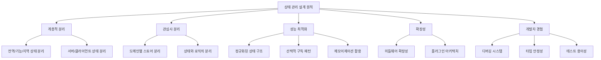
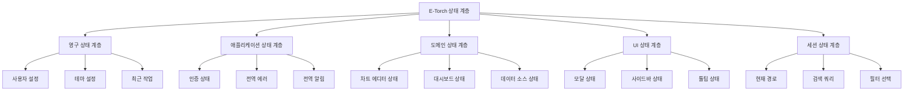
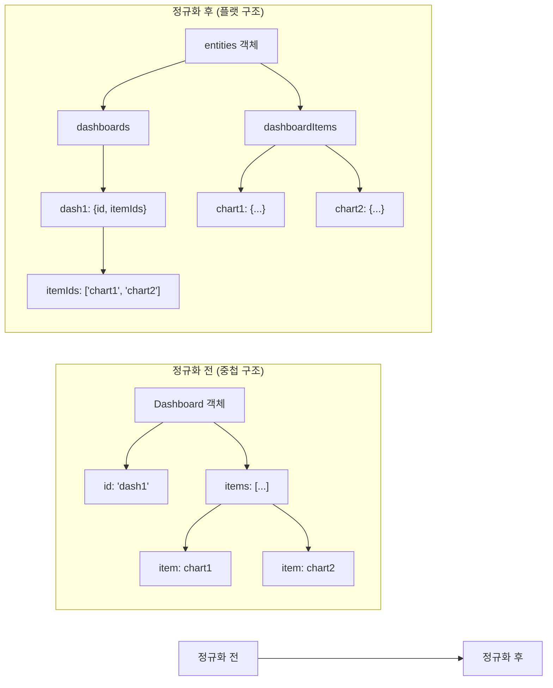
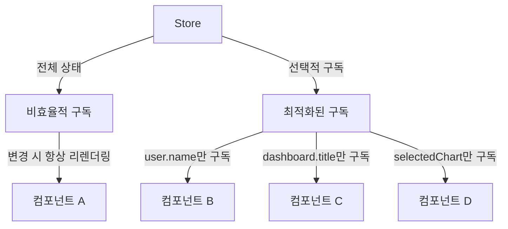
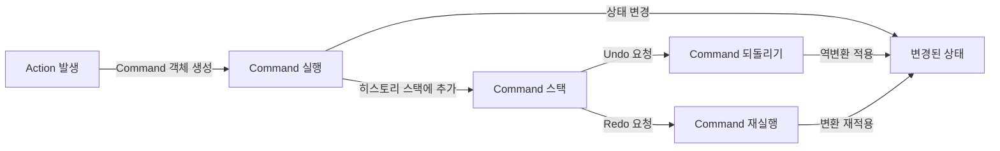
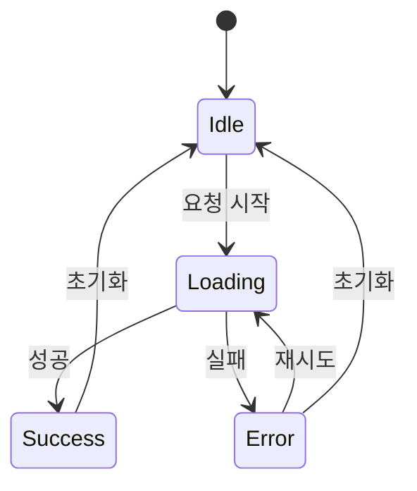
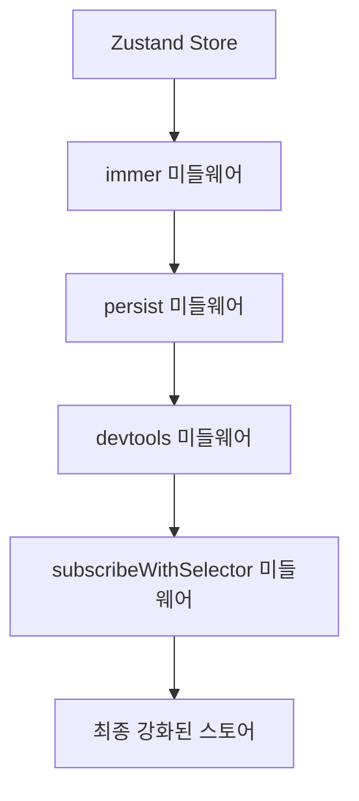
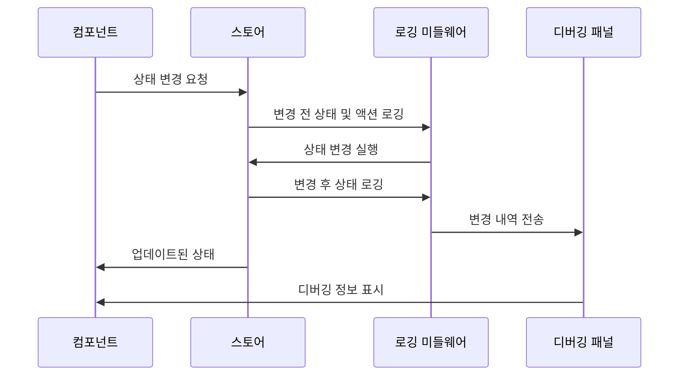
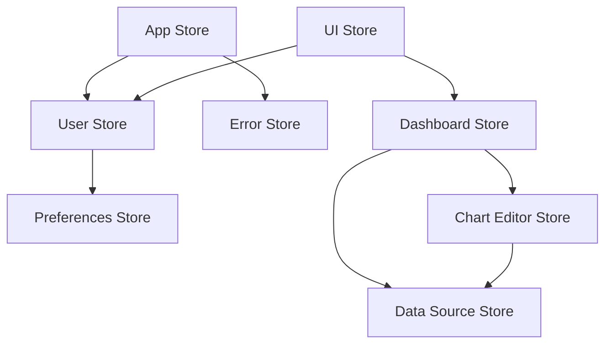

# E-Torch 클라이언트 상태관리 고급 아키텍처

## 1. 개요

E-Torch 프로젝트의 클라이언트 상태 관리는 차트 에디터와 대시보드 시스템의 복잡한 요구사항을 충족하기 위해 다중 계층 아키텍처로 설계되었습니다. 본 문서는 기존 상태 관리 구조를 더욱 견고하고 확장 가능하게 개선하는 고급 아키텍처를 제시합니다.

### 1.1 설계 원칙



### 1.2 상태 관리 기술 스택

E-Torch는 클라이언트 상태 관리를 위해 다음 기술 스택을 활용합니다:

| 영역 | 기술 | 목적 |
|------|------|------|
| **클라이언트 상태** | Zustand | 컴포넌트 간 공유되는 UI 상태 및 복잡한 에디터 상태 관리 |
| **서버 상태** | TanStack Query | 원격 데이터 페칭, 캐싱, 동기화, 업데이트 관리 |
| **폼 상태** | React Hook Form + Zod | 폼 입력 상태 및 유효성 검증 관리 |
| **미들웨어** | immer, persist, devtools | 불변성 관리, 영속성, 개발 도구 지원 |
| **유틸리티** | lodash-es, nanoid | 성능 최적화된 데이터 조작, 고유 ID 생성 |

## 2. 다중 계층 상태 아키텍처

### 2.1 계층 구조 개요

기존의 단순 3계층(전역/기능/지역) 구조에서 더 세분화된 다중 계층 구조로 개선합니다:



### 2.2 계층별 책임 분리

각 계층은 명확한 책임과 수명 주기를 가지며, 서로 다른 지속성 요구사항을 갖습니다:

| 계층 | 책임 | 지속성 | 구현 방식 |
|------|------|--------|-----------|
| **영구 상태** | 사용자 간 세션에서 유지되어야 하는 설정 | 영구 저장(로컬 스토리지) | Zustand + persist 미들웨어 |
| **애플리케이션 상태** | 앱 전체에서 공유되는 상태 | 세션 유지 | Zustand |
| **도메인 상태** | 특정 기능 영역 관련 비즈니스 로직 상태 | 컨텍스트 유지 | Zustand + Context API(선택적) |
| **UI 상태** | 시각적 요소 제어 상태 | 컴포넌트 수명주기 | Zustand(공유 UI) / useState(지역 UI) |
| **세션 상태** | 현재 사용자 세션에 한정된 임시 상태 | 브라우저 세션 | Zustand + sessionStorage |

## 3. 정규화된 상태 구조

### 3.1 정규화 패턴

복잡한 중첩 객체 대신 정규화된 데이터 구조를 사용하여 성능과 유지보수성을 향상시킵니다:



### 3.2 정규화된 도메인 스토어 구조

```typescript
// 정규화된 도메인 스토어 구조 예시
interface NormalizedState<T> {
  byId: Record<string, T>;
  allIds: string[];
  selectedId: string | null;
  status: {
    loading: boolean;
    error: Error | null;
  };
}

// 대시보드 스토어 구조
interface DashboardState {
  dashboards: NormalizedState<Dashboard>;
  dashboardItems: NormalizedState<DashboardItem>;
  itemsByDashboard: Record<string, string[]>;
  
  // 나머지 상태 및 액션...
}
```

## 4. 업데이트 최적화 전략

### 4.1 선택적 구독 패턴

Zustand의 선택자 함수를 활용하여 컴포넌트가 필요한 상태 부분만 구독하도록 합니다:



### 4.2 메모이제이션 활용

계산 비용이 큰 상태 파생 데이터는 메모이제이션을 통해 최적화합니다:

```typescript
// 메모이제이션 상태 셀렉터 패턴
const useDashboardStats = create<DashboardStatsState>()(
  immer((set, get) => ({
    // 기본 상태...
    
    // 메모이제이션된 셀렉터
    selectors: {
      getFilteredDashboards: createSelector(
        (state: DashboardStatsState) => state.dashboards,
        (state: DashboardStatsState) => state.filter,
        (dashboards, filter) => {
          // 필터링 로직...
          return filteredDashboards;
        }
      ),
      
      getChartStatistics: createSelector(
        (state: DashboardStatsState) => state.dashboardItems,
        (items) => {
          // 통계 계산 로직...
          return statistics;
        }
      )
    }
  }))
);
```

### 4.3 상태 업데이트 배치 처리

여러 상태 업데이트를 일괄 처리하여 불필요한 리렌더링을 방지합니다:

```typescript
// 배치 업데이트 관리자
interface BatchUpdateManager {
  startBatch: () => void;
  commitBatch: () => void;
  discardBatch: () => void;
  inBatch: () => boolean;
}

// 스토어에 배치 업데이트 통합
const useDashboardStore = create<DashboardState & BatchUpdateManager>()(
  immer((set, get) => ({
    // 기본 상태...
    _batchState: {
      active: false,
      changes: {} as Partial<DashboardState>
    },
    
    startBatch: () => set(state => {
      state._batchState.active = true;
      return state;
    }),
    
    commitBatch: () => set(state => {
      if (!state._batchState.active) return state;
      
      // 모든 변경사항 한 번에 적용
      const changes = state._batchState.changes;
      Object.assign(state, changes);
      
      // 배치 상태 초기화
      state._batchState.active = false;
      state._batchState.changes = {};
      
      return state;
    }),
    
    // 나머지 배치 관련 메서드...
  }))
);
```

## 5. Undo/Redo 상태 히스토리 관리

### 5.1 커맨드 패턴 기반 히스토리 관리

상태 변경을 명령 객체로 캡슐화하여 Undo/Redo 기능을 구현합니다:



### 5.2 도메인별 커맨드 구현

각 도메인 스토어는 자체적인 커맨드 집합과 히스토리 관리 기능을 갖습니다:

```typescript
// 커맨드 인터페이스
interface Command {
  execute: () => void;
  undo: () => void;
  redo: () => void;
  merge?: (command: Command) => boolean; // 유사 커맨드 병합
}

// 히스토리 관리자 인터페이스
interface HistoryManager {
  past: Command[];
  future: Command[];
  
  execute: (command: Command) => void;
  undo: () => void;
  redo: () => void;
  canUndo: () => boolean;
  canRedo: () => boolean;
  clear: () => void;
}

// 차트 에디터용 커맨드 예시
class UpdateChartPropertyCommand implements Command {
  constructor(
    private chartId: string,
    private propertyPath: string,
    private oldValue: any,
    private newValue: any,
    private store: ChartEditorStore
  ) {}
  
  execute() {
    this.store.updateChartProperty(this.chartId, this.propertyPath, this.newValue);
  }
  
  undo() {
    this.store.updateChartProperty(this.chartId, this.propertyPath, this.oldValue);
  }
  
  redo() {
    this.execute();
  }
  
  // 연속된 동일 속성 변경은 병합 (드래그 중 연속 업데이트 등)
  merge(command: Command): boolean {
    if (command instanceof UpdateChartPropertyCommand) {
      if (this.chartId === command.chartId && 
          this.propertyPath === command.propertyPath) {
        this.newValue = command.newValue;
        return true;
      }
    }
    return false;
  }
}
```

### 5.3 트랜잭션 지원

복합 작업을 단일 Undo/Redo 단위로 처리하는 트랜잭션 지원:

```typescript
// 트랜잭션 커맨드
class TransactionCommand implements Command {
  constructor(
    private commands: Command[],
    private name: string = "Transaction"
  ) {}
  
  execute() {
    this.commands.forEach(cmd => cmd.execute());
  }
  
  undo() {
    // 역순으로 실행
    [...this.commands].reverse().forEach(cmd => cmd.undo());
  }
  
  redo() {
    this.commands.forEach(cmd => cmd.redo());
  }
}

// 사용 예:
historyManager.execute(
  new TransactionCommand([
    new AddChartCommand(chartId, store),
    new PositionChartCommand(chartId, position, store),
    new StyleChartCommand(chartId, style, store)
  ], "차트 추가 및 구성")
);
```

## 6. 비동기 작업 관리 전략

### 6.1 상태 기반 비동기 작업 관리

각 비동기 작업의 상태(로딩, 에러, 성공)를 명시적으로 관리:



### 6.2 비동기 작업 추상화

도메인 스토어에서 일관된 비동기 작업 패턴을 적용합니다:

```typescript
// 비동기 작업 상태 타입
type AsyncState<T> = {
  data: T | null;
  loading: boolean;
  error: Error | null;
};

// 비동기 작업 생성 함수
function createAsyncSlice<T, P = void>(
  asyncFn: (params: P) => Promise<T>
) {
  return {
    state: {
      data: null,
      loading: false,
      error: null
    } as AsyncState<T>,
    
    actions: {
      start: (params: P) => 
        immer((state: AsyncState<T>) => {
          state.loading = true;
          state.error = null;
        }),
      
      success: (data: T) => 
        immer((state: AsyncState<T>) => {
          state.data = data;
          state.loading = false;
          state.error = null;
        }),
      
      failure: (error: Error) => 
        immer((state: AsyncState<T>) => {
          state.loading = false;
          state.error = error;
        }),
      
      reset: () => 
        immer((state: AsyncState<T>) => {
          state.data = null;
          state.loading = false;
          state.error = null;
        }),
      
      execute: async (params: P, set: any) => {
        set(slice.actions.start(params));
        try {
          const data = await asyncFn(params);
          set(slice.actions.success(data));
          return data;
        } catch (error) {
          set(slice.actions.failure(error as Error));
          throw error;
        }
      }
    }
  };
}

// 사용 예시:
const saveDashboardSlice = createAsyncSlice(
  (dashboard: Dashboard) => api.dashboards.save(dashboard)
);

const useDashboardStore = create<DashboardState>()(
  immer((set, get) => ({
    // 기본 상태...
    saveDashboard: saveDashboardSlice.state,
    
    // 액션
    save: async (dashboard) => {
      return await saveDashboardSlice.actions.execute(dashboard, set);
    }
  }))
);
```

### 6.3 취소 가능한 비동기 작업

오래 걸리는 작업을 취소할 수 있는 메커니즘:

```typescript
// 취소 가능한 비동기 작업
function createCancellableAsyncSlice<T, P = void>(
  asyncFn: (params: P, signal: AbortSignal) => Promise<T>
) {
  // AbortController 인스턴스 관리
  let currentController: AbortController | null = null;
  
  return {
    state: {
      data: null,
      loading: false,
      error: null
    } as AsyncState<T>,
    
    actions: {
      // 상태 관리 액션들...
      
      execute: async (params: P, set: any) => {
        // 이전 요청 취소
        if (currentController) {
          currentController.abort();
        }
        
        // 새 컨트롤러 생성
        currentController = new AbortController();
        
        set(slice.actions.start(params));
        try {
          const data = await asyncFn(params, currentController.signal);
          if (!currentController.signal.aborted) {
            set(slice.actions.success(data));
            return data;
          }
        } catch (error) {
          if (error.name !== 'AbortError') {
            set(slice.actions.failure(error as Error));
            throw error;
          }
        } finally {
          if (currentController.signal.aborted) {
            currentController = null;
          }
        }
      },
      
      cancel: () => {
        if (currentController) {
          currentController.abort();
          currentController = null;
        }
      }
    }
  };
}
```

## 7. Zustand 미들웨어 활용 전략

### 7.1 미들웨어 구성

다양한 미들웨어를 조합하여 스토어를 강화합니다:



### 7.2 스토어별 미들웨어 조합

각 스토어의 요구사항에 맞는 미들웨어 조합을 적용합니다:

```typescript
// 미들웨어 조합 패턴
// 1. 사용자 설정 스토어 (영구 상태)
const useUserPreferencesStore = create<UserPreferencesState>()(
  subscribeWithSelector(
    persist(
      immer((set, get) => ({
        // 스토어 구현...
      })),
      {
        name: 'e-torch-user-preferences',
        partialize: (state) => ({
          // 필요한 부분만 보존
          theme: state.theme,
          defaultTimeRange: state.defaultTimeRange,
          // ...
        })
      }
    )
  )
);

// 2. 차트 에디터 스토어 (도메인 상태)
const useChartEditorStore = create<ChartEditorState>()(
  subscribeWithSelector(
    devtools(
      immer((set, get) => ({
        // 스토어 구현...
      })),
      { name: 'chart-editor' }
    )
  )
);

// 3. UI 상태 스토어 (휘발성 상태)
const useUIStore = create<UIState>()(
  subscribeWithSelector(
    immer((set, get) => ({
      // 스토어 구현...
    }))
  )
);
```

### 7.3 커스텀 미들웨어 구현

프로젝트 특화 미들웨어를 개발하여 상태 관리를 확장합니다:

```typescript
// 로깅 미들웨어
const logMiddleware = (config) => (set, get, api) => config(
  (...args) => {
    console.log('이전 상태:', get());
    console.log('액션 인자:', args);
    set(...args);
    console.log('다음 상태:', get());
    return get();
  },
  get,
  api
);

// 히스토리 미들웨어
const historyMiddleware = (config) => (set, get, api) => {
  const history = {
    past: [],
    present: null,
    future: [],
    inTransaction: false,
    
    // 히스토리 관리 메서드...
  };
  
  // 초기 상태 저장
  api.subscribe((state) => {
    if (!history.present) {
      history.present = state;
    }
  });
  
  return config(
    (...args) => {
      // 현재 상태를 과거로 이동
      if (!history.inTransaction) {
        history.past.push(get());
        history.future = [];
      }
      
      // 상태 업데이트
      set(...args);
      
      // 새 상태를 현재로 설정
      history.present = get();
      
      return get();
    },
    get,
    {
      ...api,
      undo: () => { /* undo 구현 */ },
      redo: () => { /* redo 구현 */ },
      // 히스토리 API 확장...
    }
  );
};
```

## 8. 상태 변경 디버깅 시스템

### 8.1 통합 로깅 시스템

모든 상태 변경을 추적하고 로깅하는 시스템을 구축합니다:



### 8.2 개발 모드 디버깅 패널

개발 중 상태 변경을 실시간으로 모니터링할 수 있는 디버깅 패널:

```typescript
// 개발 모드 디버깅 히스토리 스토어
const useDebugStore = create<DebugState>()(
  persist(
    (set, get) => ({
      // 디버깅 활성화 상태
      enabled: process.env.NODE_ENV === 'development',
      
      // 액션 히스토리
      actionHistory: [],
      
      // 상태 스냅샷
      stateSnapshots: {},
      
      // 필터 옵션
      filters: {
        storeNames: [],
        actionTypes: []
      },
      
      // 액션 기록
      recordAction: (action) => {
        if (!get().enabled) return;
        
        set(state => ({
          actionHistory: [...state.actionHistory, {
            ...action,
            timestamp: Date.now()
          }]
        }));
      },
      
      // 상태 스냅샷 저장
      saveSnapshot: (storeName, state) => {
        if (!get().enabled) return;
        
        set(prev => ({
          stateSnapshots: {
            ...prev.stateSnapshots,
            [storeName]: {
              state,
              timestamp: Date.now()
            }
          }
        }));
      },
      
      // 디버깅 제어 기능들...
    }),
    {
      name: 'e-torch-debug-storage'
    }
  )
);

// 디버깅 미들웨어 (모든 스토어에 적용)
const debugMiddleware = (storeName) => (config) => (set, get, api) => config(
  (...args) => {
    // 디버깅 스토어에 현재 상태 스냅샷 저장
    useDebugStore.getState().saveSnapshot(storeName, get());
    
    // 액션 정보 추출
    const [state, replace] = args;
    const actionName = typeof state === 'function' 
      ? (state.name || 'anonymous')
      : 'setState';
    
    // 액션 기록
    useDebugStore.getState().recordAction({
      storeName,
      actionName,
      args: args.slice(1),  // 첫 번째 인자(상태/함수) 제외
      replace
    });
    
    // 원래 set 호출
    set(...args);
    
    // 변경 후 상태 스냅샷 저장
    useDebugStore.getState().saveSnapshot(`${storeName}:after`, get());
    
    return get();
  },
  get,
  api
);
```

### 8.3 시간 여행 디버깅 (Time-Travel Debugging)

과거 상태로 돌아가서 디버깅할 수 있는 시간 여행 기능:

```typescript
// 시간 여행 디버깅 인터페이스
interface TimeTravelDebugger {
  snapshots: Array<{
    timestamp: number;
    state: Record<string, any>; // 모든 스토어 상태 통합
    actionName: string;
  }>;
  
  travelTo: (snapshotIndex: number) => void;
  getCurrentIndex: () => number;
  getSnapshots: () => Array<{timestamp: number, actionName: string}>;
  
  startRecording: () => void;
  stopRecording: () => void;
  clearHistory: () => void;
}

// 구현:
const createTimeTravelDebugger = (): TimeTravelDebugger => {
  let snapshots = [];
  let currentIndex = -1;
  let isRecording = process.env.NODE_ENV === 'development';
  
  // 스토어들의 리셋 함수 매핑
  const resetFunctions: Record<string, (state: any) => void> = {
    // 각 스토어별 상태 복원 함수
    chartEditor: useChartEditorStore.setState,
    dashboard: useDashboardStore.setState,
    // ...
  };
  
  return {
    snapshots,
    
    travelTo: (index) => {
      if (index < 0 || index >= snapshots.length) return;
      
      const snapshot = snapshots[index];
      
      // 각 스토어의 상태 복원
      Object.keys(snapshot.state).forEach(storeName => {
        if (resetFunctions[storeName]) {
          resetFunctions[storeName](snapshot.state[storeName]);
        }
      });
      
      currentIndex = index;
    },
    
    getCurrentIndex: () => currentIndex,
    getSnapshots: () => snapshots.map(s => ({
      timestamp: s.timestamp,
      actionName: s.actionName
    })),
    
    startRecording: () => { isRecording = true; },
    stopRecording: () => { isRecording = false; },
    clearHistory: () => {
      snapshots = [];
      currentIndex = -1;
    }
  };
};
```

## 9. 스토어 통합 및 의존성 관리

### 9.1 스토어 의존성 관리

스토어 간의 의존성은 명시적으로 관리하고 순환 의존성을 방지합니다:



### 9.2 스토어 통합 API

여러 스토어를 효율적으로 사용할 수 있는 통합 API를 제공합니다:

```typescript
// 스토어 통합 훅
function useStores() {
  const user = useUserStore();
  const dashboard = useDashboardStore();
  const chartEditor = useChartEditorStore();
  const ui = useUIStore();
  
  return {
    user,
    dashboard,
    chartEditor,
    ui,
    
    // 스토어 간 조합 유틸리티
    createDashboardFromTemplate: (templateId) => {
      // 템플릿으로부터 대시보드 생성 로직
      const template = dashboard.templates.byId[templateId];
      const newDashboard = { ...template, id: nanoid() };
      dashboard.addDashboard(newDashboard);
      return newDashboard.id;
    },
    
    // 다른 스토어 간 상호작용 유틸리티...
  };
}
```

### 9.3 스토어 셀렉터 최적화

여러 스토어에서 데이터를 조합하는 최적화된 셀렉터:

```typescript
// 최적화된 복합 셀렉터
const useDashboardStats = () => {
  // 각 스토어에서 필요한 데이터만 선택적으로 구독
  const dashboards = useDashboardStore(state => state.dashboards.byId);
  const dashboardIds = useDashboardStore(state => state.dashboards.allIds);
  const chartItems = useChartEditorStore(state => state.chartItems.byId);
  const userPreferences = useUserStore(state => state.preferences);
  
  // 메모이제이션된 복합 데이터 계산
  const dashboardStats = useMemo(() => {
    return dashboardIds.map(id => {
      const dashboard = dashboards[id];
      const items = dashboard.itemIds.map(itemId => chartItems[itemId]);
      
      return {
        id: dashboard.id,
        title: dashboard.title,
        itemCount: items.length,
        chartTypes: countChartTypes(items),
        lastModified: dashboard.updatedAt,
        // 기타 통계...
      };
    }).sort((a, b) => {
      // 사용자 기본 설정에 따른 정렬
      const sortOrder = userPreferences.dashboardSortOrder;
      // 정렬 로직...
      return 0;
    });
  }, [dashboards, dashboardIds, chartItems, userPreferences.dashboardSortOrder]);
  
  return dashboardStats;
};
```

## 10. 실제 구현 예시: 차트 에디터 상태 관리

### 10.1 차트 에디터 스토어 설계

차트 에디터의 상태 구조와 주요 액션을 설계합니다:

```typescript
// 차트 에디터 스토어 설계
interface ChartEditorState {
  // 정규화된 상태
  charts: NormalizedState<ChartConfig>;
  
  // 에디터 UI 상태
  editor: {
    selectedChartId: string | null;
    activePropertyPanel: string | null;
    viewMode: 'edit' | 'preview' | 'code';
    zoomLevel: number;
    undoStack: Command[];
    redoStack: Command[];
  };
  
  // 데이터 쿼리 상태
  queries: {
    byId: Record<string, DataQuery>;
    byChartId: Record<string, string[]>;
  };
  
  // 비동기 작업 상태
  saveChart: AsyncState<ChartConfig>;
  loadChart: AsyncState<ChartConfig>;
  
  // 액션
  selectChart: (id: string | null) => void;
  updateChartProperty: (chartId: string, path: string, value: any) => void;
  createChart: (type: ChartType, initialConfig?: Partial<ChartConfig>) => string;
  deleteChart: (id: string) => void;
  
  // 데이터 쿼리 액션
  addQuery: (chartId: string, query?: Partial<DataQuery>) => string;
  updateQuery: (queryId: string, updates: Partial<DataQuery>) => void;
  removeQuery: (queryId: string) => void;
  
  // 비동기 액션
  saveChartToServer: (chartId: string) => Promise<ChartConfig>;
  loadChartFromServer: (chartId: string) => Promise<void>;
  
  // 히스토리 액션
  undo: () => void;
  redo: () => void;
  canUndo: () => boolean;
  canRedo: () => boolean;
  
  // 편의 셀렉터
  getSelectedChart: () => ChartConfig | null;
  getChartQueries: (chartId: string) => DataQuery[];
}

// 구현
const useChartEditorStore = create<ChartEditorState>()(
  subscribeWithSelector(
    persist(
      devtools(
        immer((set, get) => ({
          // 정규화된 상태 초기화
          charts: {
            byId: {},
            allIds: [],
            selectedId: null,
            status: { loading: false, error: null }
          },
          
          editor: {
            selectedChartId: null,
            activePropertyPanel: null,
            viewMode: 'edit',
            zoomLevel: 1,
            undoStack: [],
            redoStack: []
          },
          
          queries: {
            byId: {},
            byChartId: {}
          },
          
          saveChart: { data: null, loading: false, error: null },
          loadChart: { data: null, loading: false, error: null },
          
          // 상세 액션 구현...
          
          // 편의 셀렉터
          getSelectedChart: () => {
            const { selectedChartId } = get().editor;
            if (!selectedChartId) return null;
            return get().charts.byId[selectedChartId] || null;
          },
          
          getChartQueries: (chartId: string) => {
            const queryIds = get().queries.byChartId[chartId] || [];
            return queryIds.map(id => get().queries.byId[id]);
          }
        })),
        { name: 'chart-editor' }
      ),
      {
        name: 'e-torch-chart-editor',
        partialize: (state) => ({
          // 자동 저장할 상태 선택
          charts: state.charts,
          // 임시 에디터 상태는 제외
        })
      }
    )
  )
);
```

### 10.2 차트 에디터 Undo/Redo 구현

차트 에디터의 작업 취소/재실행 기능을 구현합니다:

```typescript
// 커맨드 정의
const ChartEditorCommands = {
  UpdateProperty: class implements Command {
    constructor(
      private chartId: string,
      private path: string,
      private oldValue: any,
      private newValue: any
    ) {}
    
    execute(store = useChartEditorStore.getState()) {
      store.updateChartProperty(this.chartId, this.path, this.newValue, false);
    }
    
    undo(store = useChartEditorStore.getState()) {
      store.updateChartProperty(this.chartId, this.path, this.oldValue, false);
    }
    
    redo(store = useChartEditorStore.getState()) {
      this.execute(store);
    }
    
    merge(command: Command): boolean {
      if (command instanceof ChartEditorCommands.UpdateProperty) {
        if (this.chartId === command.chartId && 
            this.path === command.path) {
          this.newValue = command.newValue;
          return true;
        }
      }
      return false;
    }
  },
  
  // 다른 커맨드 정의...
};

// 스토어 액션에 히스토리 관리 추가
const useChartEditorStore = create<ChartEditorState>()(
  subscribeWithSelector(
    devtools(
      immer((set, get) => ({
        // 기본 상태...
        
        // 속성 업데이트 액션 (히스토리 추적 포함)
        updateChartProperty: (chartId, path, value, addToHistory = true) => {
          // 이전 값 가져오기
          const chart = get().charts.byId[chartId];
          const oldValue = get(chart, path);
          
          // 값이 같으면 무시
          if (isEqual(oldValue, value)) return;
          
          // 상태 업데이트
          set(state => {
            set(state.charts.byId[chartId], path, value);
            return state;
          });
          
          // 히스토리 추적이 활성화된 경우
          if (addToHistory) {
            const command = new ChartEditorCommands.UpdateProperty(
              chartId, path, oldValue, value
            );
            
            // 히스토리 스택 업데이트
            set(state => {
              // 현재 명령이 이전 명령과 병합 가능한지 확인
              const lastCommand = state.editor.undoStack[state.editor.undoStack.length - 1];
              
              if (lastCommand && lastCommand.merge && lastCommand.merge(command)) {
                // 병합 가능한 경우 기존 명령 업데이트 (별도 처리 불필요)
              } else {
                // 새 명령을 스택에 추가
                state.editor.undoStack.push(command);
              }
              
              // Redo 스택 초기화
              state.editor.redoStack = [];
              
              return state;
            });
          }
        },
        
        // Undo 액션
        undo: () => {
          const { undoStack, redoStack } = get().editor;
          if (undoStack.length === 0) return;
          
          // 마지막 명령 가져오기
          const command = undoStack[undoStack.length - 1];
          
          // 명령 실행 취소
          command.undo();
          
          // 스택 업데이트
          set(state => {
            state.editor.undoStack.pop();
            state.editor.redoStack.push(command);
            return state;
          });
        },
        
        // Redo 액션
        redo: () => {
          const { redoStack } = get().editor;
          if (redoStack.length === 0) return;
          
          // 마지막 명령 가져오기
          const command = redoStack[redoStack.length - 1];
          
          // 명령 재실행
          command.redo();
          
          // 스택 업데이트
          set(state => {
            state.editor.redoStack.pop();
            state.editor.undoStack.push(command);
            return state;
          });
        },
        
        canUndo: () => get().editor.undoStack.length > 0,
        canRedo: () => get().editor.redoStack.length > 0,
        
        // 기타 액션...
      })),
      { name: 'chart-editor' }
    )
  )
);
```

### 10.3 차트 에디터 비동기 작업 처리

차트 에디터의 비동기 작업을 관리합니다:

```typescript
// 비동기 작업 슬라이스 생성
const saveChartSlice = createAsyncSlice<ChartConfig, { chartId: string }>(
  async ({ chartId }) => {
    // 차트 데이터 가져오기
    const store = useChartEditorStore.getState();
    const chart = store.charts.byId[chartId];
    
    if (!chart) {
      throw new Error(`Chart with ID ${chartId} not found`);
    }
    
    // 서버에 저장
    const savedChart = await api.charts.save(chart);
    return savedChart;
  }
);

const loadChartSlice = createAsyncSlice<ChartConfig, string>(
  async (chartId) => {
    // 서버에서 차트 가져오기
    const chart = await api.charts.getById(chartId);
    return chart;
  }
);

// 스토어에 통합
const useChartEditorStore = create<ChartEditorState>()(
  // 미들웨어...
  (set, get) => ({
    // 기본 상태...
    saveChart: saveChartSlice.state,
    loadChart: loadChartSlice.state,
    
    // 비동기 액션
    saveChartToServer: async (chartId) => {
      try {
        // 현재 수정 중인 내용 저장 (예: 포커스된 입력 필드 등)
        get().commitPendingChanges();
        
        // 저장 실행
        const savedChart = await saveChartSlice.actions.execute({ chartId }, set);
        
        // UI 업데이트
        useUIStore.getState().showToast({
          type: 'success',
          message: '차트가 저장되었습니다'
        });
        
        return savedChart;
      } catch (error) {
        useUIStore.getState().showToast({
          type: 'error',
          message: '차트 저장 중 오류가 발생했습니다'
        });
        throw error;
      }
    },
    
    loadChartFromServer: async (chartId) => {
      try {
        // 현재 작업 중인 내용이 있으면 확인
        if (get().isDirty()) {
          const confirmed = window.confirm(
            '저장되지 않은 변경사항이 있습니다. 계속 진행하시겠습니까?'
          );
          if (!confirmed) return;
        }
        
        // 로드 실행
        const chart = await loadChartSlice.actions.execute(chartId, set);
        
        // 차트 데이터로 에디터 상태 업데이트
        set(state => {
          // 차트 추가
          state.charts.byId[chart.id] = chart;
          if (!state.charts.allIds.includes(chart.id)) {
            state.charts.allIds.push(chart.id);
          }
          
          // 선택된 차트 설정
          state.editor.selectedChartId = chart.id;
          
          // 히스토리 스택 초기화
          state.editor.undoStack = [];
          state.editor.redoStack = [];
          
          return state;
        });
      } catch (error) {
        useUIStore.getState().showToast({
          type: 'error',
          message: '차트 로드 중 오류가 발생했습니다'
        });
        throw error;
      }
    }
  })
);
```

## 11. 결론

E-Torch의 클라이언트 상태 관리 아키텍처는 다중 계층 구조, 정규화된 상태, 성능 최적화, 상태 히스토리 관리, 비동기 작업 추상화 등의 고급 패턴을 통해 복잡한 차트 에디터와 대시보드 시스템의 요구사항을 충족시킵니다.

이러한 아키텍처는 다음과 같은 이점을 제공합니다:

1. **코드 품질 향상**: 명확한 책임 분리와 관심사 분리로 코드 유지보수성 증가
2. **성능 최적화**: 정규화된 상태 구조와 선택적 구독을 통한 렌더링 최적화
3. **사용자 경험 개선**: Undo/Redo, 트랜잭션 등의 고급 기능 제공
4. **개발자 경험 향상**: 디버깅 도구, 타입 안정성, 테스트 용이성
5. **확장성**: 플러그인 아키텍처로 쉬운 기능 확장

이 아키텍처는 Zustand의 장점을 극대화하면서 복잡한 상태 관리 요구사항을 충족시키는 균형 잡힌 접근 방식을 제공합니다.
