# E-Torch 상태 관리 아키텍처

## 1. 개요

E-Torch 프로젝트의 상태 관리 아키텍처는 복잡한 경제지표 데이터와 사용자 인터페이스를 효율적으로 관리하기 위해 설계되었습니다. 이 문서는 프론트엔드 상태 관리 전략과 주요 개념을 설명합니다.

## 2. 상태 관리 설계 원칙

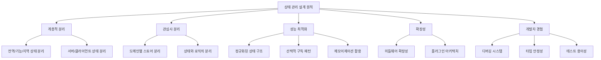

## 3. 상태 유형 분류

### 3.1 서버 상태 vs 클라이언트 상태

| 서버 상태 | 클라이언트 상태 |
|----------|----------------|
| 원격 서버에 저장된 데이터 | 로컬에서만 의미 있는 UI 상태 |
| API를 통해 CRUD 작업 | 사용자 상호작용에 의한 변경 |
| 여러 클라이언트에서 공유 | 단일 클라이언트에서만 사용 |
| 비동기 로직과 연관 | 동기적 작업 |
| 서버 상태 캐싱/동기화 필요 | 즉시 변경 반영 |

### 3.2 상태 지속성 및 범위

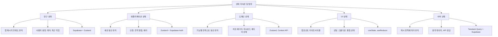

## 4. 기술 스택 및 도구

### 4.1 상태 관리 도구 선정 및 이유

| 도구 | 사용 영역 | 선정 이유 |
|------|-----------|----------|
| **Zustand** | 클라이언트 상태 | 간결한 API, 유연한 미들웨어, 낮은 보일러플레이트, React와 통합 우수 |
| **Tanstack Query** | 서버 상태 | 캐싱, 재시도, 낙관적 업데이트, 자동 리페칭, devtools 지원 |
| **React Context** | 테마, 인증 등 | 깊은 컴포넌트 트리에서의 상태 공유, 간단한 전역 상태 |
| **React Hook Form** | 폼 상태 | 비제어 컴포넌트 최적화, 유효성 검사, 성능 우수 |
| **Supabase Auth** | 인증 상태 | SNS 로그인 통합, 세션 관리, 보안 강화 |
| **Supabase Database** | 영구 데이터 | 사용자 데이터, 대시보드 정보, 설정 저장 |

### 4.2 Zustand와 Supabase 통합 전략

E-Torch는 다음과 같이 Zustand와 Supabase를 통합하여 상태 관리를 강화합니다:

1. **Supabase Auth와 인증 상태 동기화**
   - 로그인/로그아웃 시 즉시 상태 업데이트
   - 세션 만료 처리 및 자동 갱신

2. **사용자 데이터 관리**
   - 프로필 정보 및 개인화 설정 저장
   - 구독 상태 및 결제 정보 관리

3. **대시보드 및 차트 영구 저장**
   - 사용자별 대시보드 데이터 저장 및 검색
   - 차트 설정 및 시각화 옵션 보존

4. **실시간 데이터 구독**
   - Supabase의 실시간 구독 기능을 활용한 데이터 업데이트
   - 공유 대시보드 변경사항 실시간 동기화

## 5. 다중 계층 상태 아키텍처

### 5.1 계층 구조

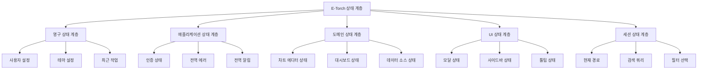

### 5.2 주요 스토어 설계

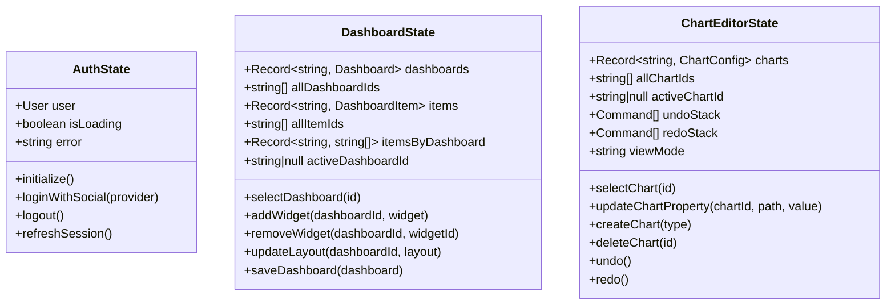

## 6. 정규화된 상태 구조

### 6.1 엔티티 정규화 패턴

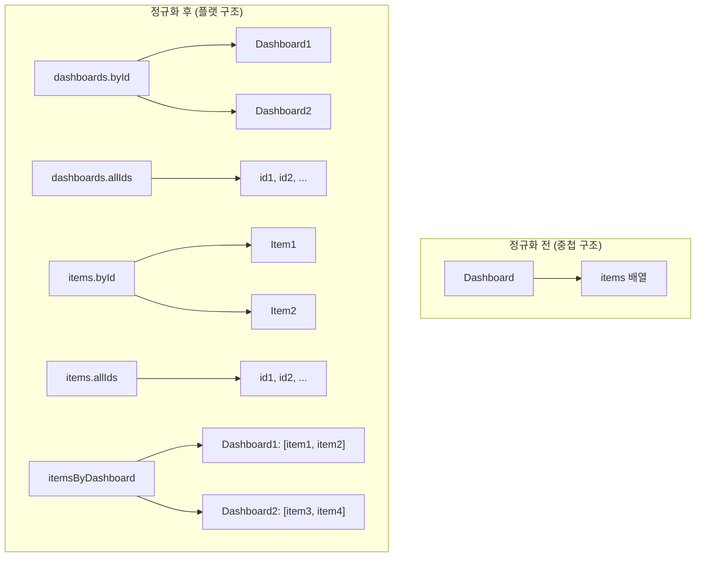

이 패턴은 다음과 같은 장점을 제공합니다:
- 데이터 중복 방지
- 특정 항목 업데이트 용이성
- 관계 관리 명확화
- 성능 최적화 용이성

## 7. Supabase 통합 상태 관리

### 7.1 인증 상태 관리

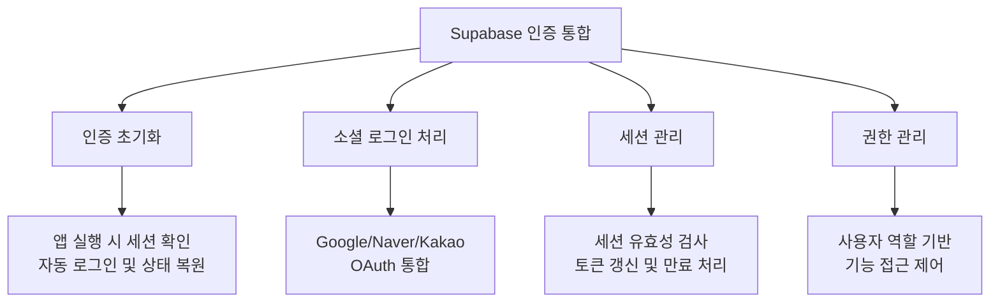

### 7.2 대시보드 및 차트 데이터 관리

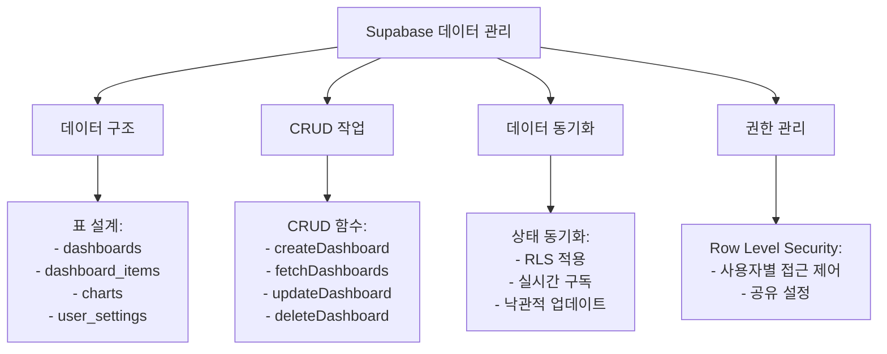

## 8. 성능 최적화 전략

### 8.1 선택적 구독 패턴

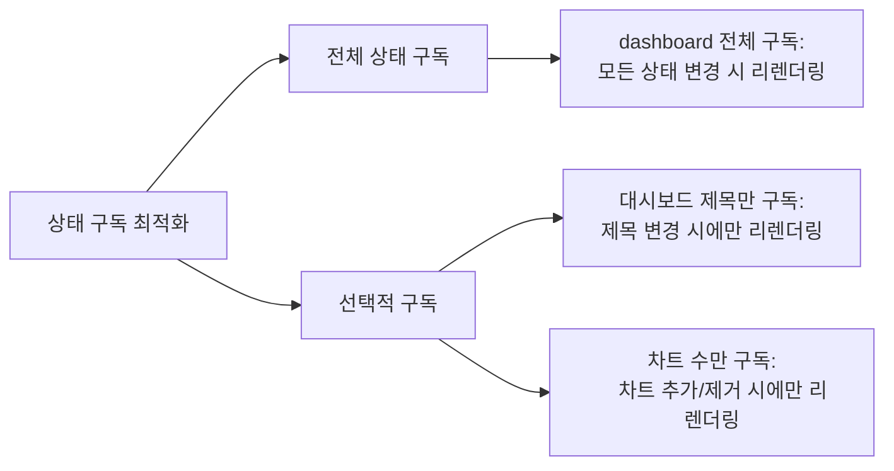

### 8.2 메모이제이션 전략

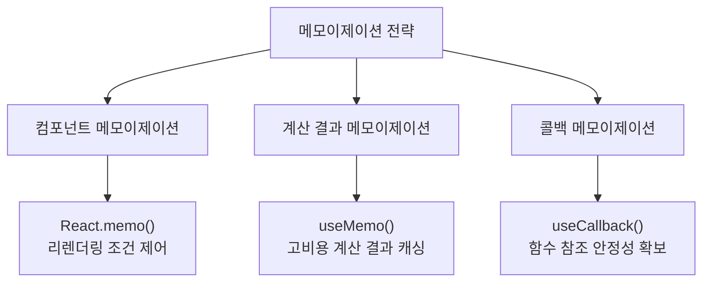

### 8.3 상태 업데이트 일괄 처리

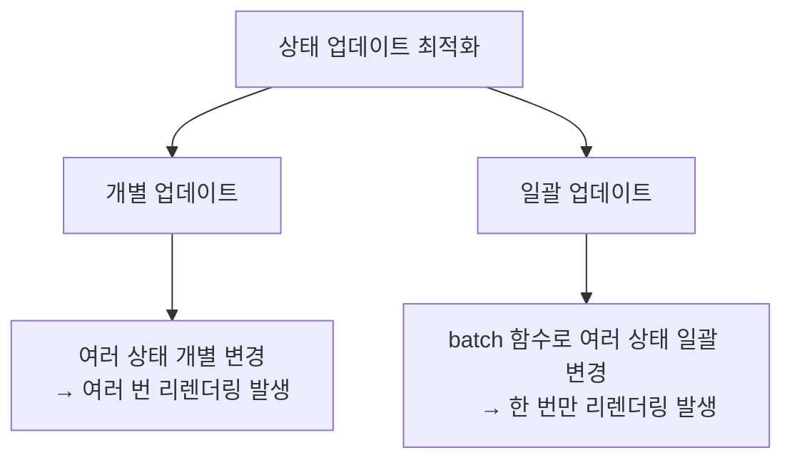

## 9. 서버 상태 관리

### 9.1 Tanstack Query와 Supabase 통합

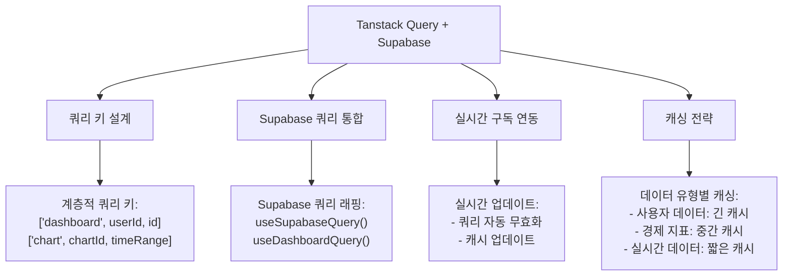

### 9.2 데이터 유형별 캐싱 전략

| 데이터 유형 | staleTime | gcTime | 리페치 전략 | 무효화 조건 |
|------------|-----------|--------|------------|------------|
| 사용자 대시보드 | 5분 | 1시간 | 윈도우 포커스 시 | 대시보드 변경 후 |
| 공유 대시보드 | 10분 | 3시간 | 수동 또는 주기적 | 댓글 작성, 별점 변경 |
| 경제지표 데이터 | 1시간 | 12시간 | 수동 또는 주기적 | 시간 범위 변경 |
| 실시간 지표 | 1분 | 10분 | 주기적 (1분) | 자동 만료 |
| 사용자 설정 | 1일 | 7일 | 앱 시작 시 | 설정 변경 시 |

## 10. Undo/Redo 기능 구현

### 10.1 커맨드 패턴 기반 히스토리 관리

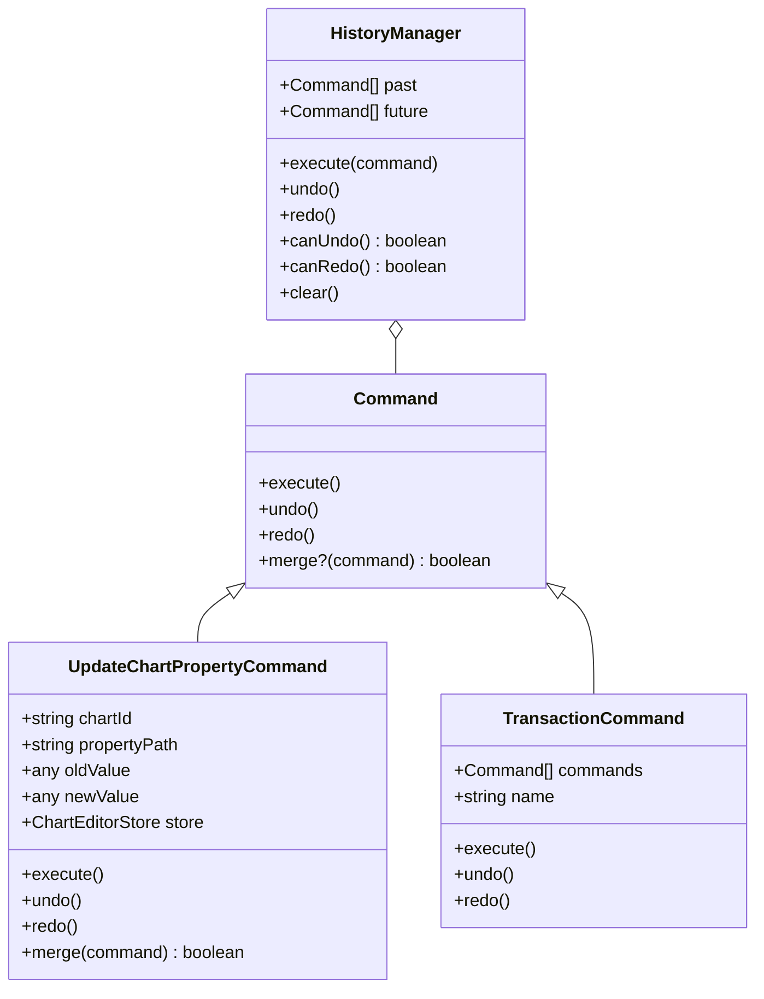

## 11. 이벤트 버스 패턴

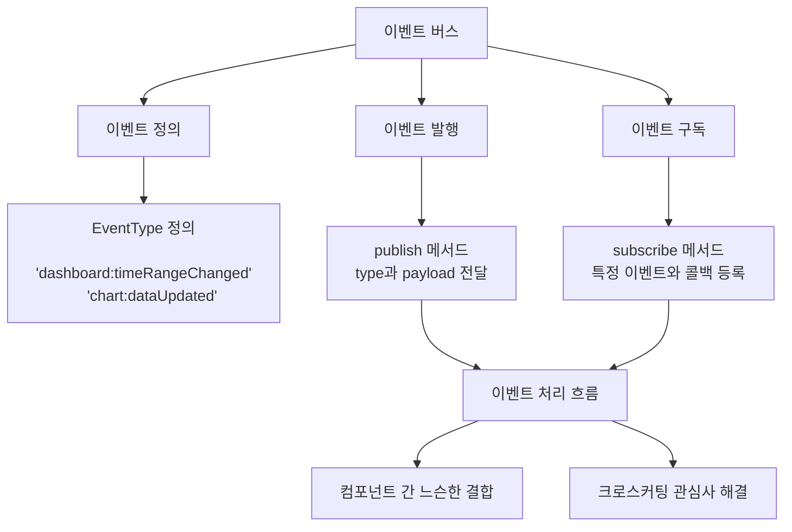

## 12. Supabase 인증 및 권한 관리

### 12.1 SNS 로그인 흐름

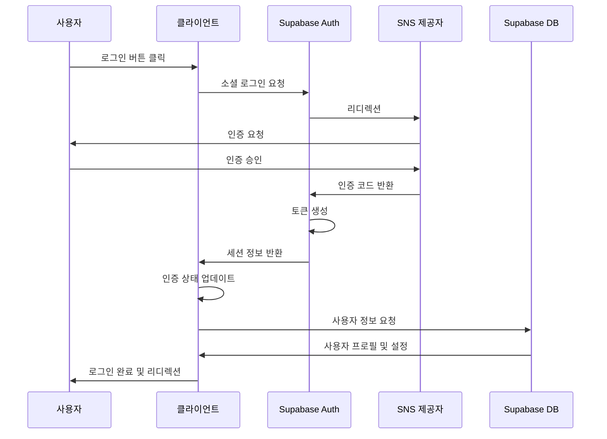

### 12.2 RLS(Row Level Security) 정책

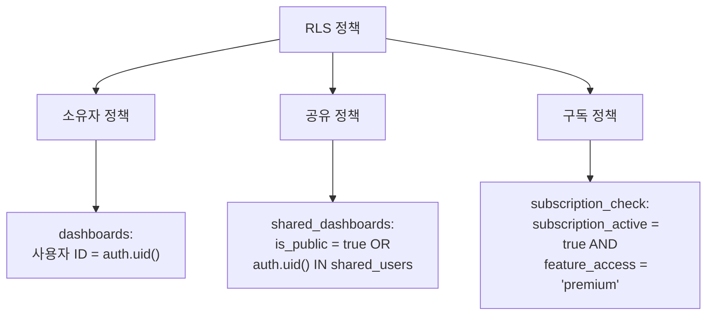

## 13. 결론

E-Torch의 상태 관리 아키텍처는 Zustand와 Tanstack Query를 중심으로 효율적인 클라이언트 및 서버 상태 관리 전략을 구현하며, Supabase를 통해 SNS 로그인 인증 및 사용자 데이터 관리를 통합적으로 처리합니다.

정규화된 상태 구조, 선택적 구독 패턴, 메모이제이션 등의 최적화 기법을 통해 대량의 경제 데이터를 처리하면서도 우수한 성능을 제공합니다. Supabase의 실시간 구독 기능과 RLS 정책을 활용하여 데이터 동기화 및 보안을 강화하였습니다.

이벤트 버스 패턴과 커맨드 패턴을 통해 컴포넌트 간 느슨한 결합을 유지하면서도 Undo/Redo와 같은 고급 기능을 구현할 수 있습니다. 이러한 아키텍처는 E-Torch가 복잡한 경제지표 대시보드 서비스로서 확장성과 유지보수성을 갖추도록 설계되었습니다.
