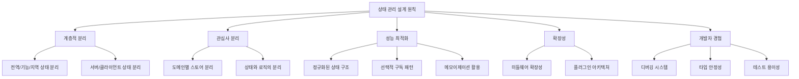
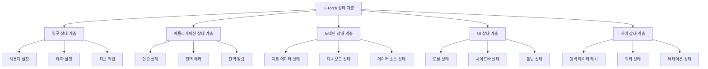

# E-Torch 상태 관리 접근법

## 1. 상태 관리 설계 원칙

E-Torch 프로젝트의 상태 관리는 다음 원칙을 기반으로 설계되었습니다:



## 2. 상태 유형 분류

E-Torch에서는 상태를 다음과 같이 분류하여 관리합니다:

### 2.1 서버 상태 vs 클라이언트 상태

| 서버 상태 | 클라이언트 상태 |
|----------|----------------|
| 원격 서버에 저장된 데이터 | 로컬에서만 의미 있는 UI 상태 |
| API를 통해 CRUD 작업 | 사용자 상호작용에 의한 변경 |
| 여러 클라이언트에서 공유 | 단일 클라이언트에서만 사용 |
| 비동기 로직과 연관 | 동기적 작업 |
| 서버 상태 캐싱/동기화 필요 | 즉시 변경 반영 |

### 2.2 상태 지속성 및 범위

| 상태 유형 | 지속성 | 범위 | 관리 도구 |
|----------|--------|------|----------|
| **영구 상태** | 앱 재시작 후에도 유지 | 사용자 설정, 테마, 최근 작업 | Zustand + persist |
| **애플리케이션 상태** | 세션 동안 유지 | 인증, 전역 알림, 에러 | Zustand |
| **도메인 상태** | 기능별 컨텍스트 동안 유지 | 차트 에디터, 대시보드 에디터 상태 | Zustand, Context API |
| **UI 상태** | 컴포넌트 라이프사이클 | 모달, 드롭다운, 펼침 상태 | useState, useReducer |
| **서버 상태** | 캐시 정책에 따라 유지 | 원격 데이터, API 응답 | Tanstack Query |

## 3. 기술 스택 및 도구

### 3.1 상태 관리 도구 선정 및 이유

| 도구 | 사용 영역 | 선정 이유 |
|------|-----------|----------|
| **Zustand 5** | 클라이언트 상태 | 간결한 API, 유연한 미들웨어, Redux보다 낮은 보일러플레이트, React와 통합 우수 |
| **TanStack Query 5** | 서버 상태 | 캐싱, 재시도, 낙관적 업데이트, 자동 리페칭, devtools 지원 |
| **React Context** | 테마, 인증 등 | 깊은 컴포넌트 트리에서의 상태 공유, 간단한 전역 상태 |
| **React Hook Form 7** | 폼 상태 | 비제어 컴포넌트 최적화, 유효성 검사, 성능 우수 |
| **localStorage/sessionStorage** | 영구/세션 저장소 | 브라우저 기본 제공 API |

### 3.2 Zustand 미들웨어 활용

E-Torch는 다음 Zustand 미들웨어를 활용하여 상태 관리를 강화합니다:

1. **immer**: 불변성 관리 간소화
2. **persist**: 상태 영속성 (localStorage, sessionStorage)
3. **devtools**: 개발 도구 연동
4. **subscribeWithSelector**: 선택적 구독 최적화
5. **custom middleware**: 로깅, 디버깅, 분석용 커스텀 미들웨어

## 4. 다중 계층 상태 아키텍처

### 4.1 계층 구조



### 4.2 패키지 구조와 통합된 스토어 설계

아키텍처 문서의 모노레포 패키지 구조와 일치하도록 스토어를 설계합니다:

```typescript
// packages/state/src/stores/app-store.ts
import { create } from 'zustand'
import { persist } from 'zustand/middleware'
import { immer } from 'zustand/middleware/immer'
import { type Theme } from '@e-torch/core'

interface AppState {
  theme: Theme
  notifications: Notification[]
  globalErrors: ErrorRecord[]
  isLoading: boolean
  
  // 액션
  setTheme: (theme: Theme) => void
  addNotification: (notification: Notification) => void
  clearNotification: (id: string) => void
  setError: (error: ErrorRecord) => void
  clearError: (id: string) => void
  setLoading: (isLoading: boolean) => void
}

export const useAppStore = create<AppState>()(
  persist(
    immer((set) => ({
      theme: 'system',
      notifications: [],
      globalErrors: [],
      isLoading: false,
      
      setTheme: (theme) => set((state) => {
        state.theme = theme
      }),
      
      addNotification: (notification) => set((state) => {
        state.notifications.push(notification)
      }),
      
      clearNotification: (id) => set((state) => {
        state.notifications = state.notifications.filter(n => n.id !== id)
      }),
      
      setError: (error) => set((state) => {
        state.globalErrors.push(error)
      }),
      
      clearError: (id) => set((state) => {
        state.globalErrors = state.globalErrors.filter(e => e.id !== id)
      }),
      
      setLoading: (isLoading) => set((state) => {
        state.isLoading = isLoading
      })
    })),
    {
      name: 'e-torch-app-state',
      partialize: (state) => ({ theme: state.theme })
    }
  )
)
```

### 4.3 차트 에디터 스토어 예시

```typescript
// packages/state/src/stores/chart-editor-store.ts
import { create } from 'zustand'
import { immer } from 'zustand/middleware/immer'
import { devtools } from 'zustand/middleware'
import type { ChartConfig, ChartType, Command } from '@e-torch/core'

// 정규화된 상태 유형
interface NormalizedState<T> {
  byId: Record<string, T>
  allIds: string[]
}

interface ChartEditorState {
  charts: NormalizedState<ChartConfig>
  activeChartId: string | null
  undoStack: Command[]
  redoStack: Command[]
  viewMode: 'edit' | 'preview'
  
  // 액션
  selectChart: (chartId: string | null) => void
  updateChartProperty: (chartId: string, path: string, value: any) => void
  createChart: (type: ChartType) => string
  deleteChart: (id: string) => void
  undo: () => void
  redo: () => void
  setViewMode: (mode: 'edit' | 'preview') => void
}

export const useChartEditorStore = create<ChartEditorState>()(
  devtools(
    immer((set, get) => ({
      charts: { byId: {}, allIds: [] },
      activeChartId: null,
      undoStack: [],
      redoStack: [],
      viewMode: 'edit',
      
      selectChart: (chartId) => set((state) => {
        state.activeChartId = chartId
      }),
      
      updateChartProperty: (chartId, path, value) => set((state) => {
        if (!state.charts.byId[chartId]) return
        
        // 커맨드 패턴을 위한 이전 값 저장
        const oldValue = get().charts.byId[chartId][path]
        
        // 커맨드 생성 및 언두 스택에 추가
        const command = {
          execute: () => get().updateChartProperty(chartId, path, value),
          undo: () => get().updateChartProperty(chartId, path, oldValue),
          redo: () => get().updateChartProperty(chartId, path, value),
        }
        
        // 스택 업데이트
        state.undoStack.push(command)
        state.redoStack = []
        
        // 실제 프로퍼티 업데이트
        // 이 코드는 path가 중첩 경로일 경우 처리가 필요 (예: 'options.title.text')
        // 간단한 예시로 직접 접근을 사용
        state.charts.byId[chartId][path] = value
      }),
      
      createChart: (type) => {
        const id = `chart-${Date.now()}`
        
        set((state) => {
          // 새 차트 생성
          state.charts.byId[id] = {
            id,
            type,
            title: `New ${type} Chart`,
            options: {},
            data: []
          }
          
          // ID 목록에 추가
          state.charts.allIds.push(id)
          
          // 활성 차트로 설정
          state.activeChartId = id
        })
        
        return id
      },
      
      deleteChart: (id) => set((state) => {
        // 차트가 존재하는지 확인
        if (!state.charts.byId[id]) return
        
        // ID 목록에서 제거
        state.charts.allIds = state.charts.allIds.filter(chartId => chartId !== id)
        
        // 객체에서 제거
        delete state.charts.byId[id]
        
        // 활성 차트가 삭제된 차트라면 null로 설정
        if (state.activeChartId === id) {
          state.activeChartId = state.charts.allIds[0] || null
        }
      }),
      
      undo: () => {
        const undoStack = get().undoStack
        if (undoStack.length === 0) return
        
        const command = undoStack[undoStack.length - 1]
        
        set((state) => {
          // 스택 업데이트
          state.undoStack = state.undoStack.slice(0, -1)
          state.redoStack.push(command)
        })
        
        // 실행
        command.undo()
      },
      
      redo: () => {
        const redoStack = get().redoStack
        if (redoStack.length === 0) return
        
        const command = redoStack[redoStack.length - 1]
        
        set((state) => {
          // 스택 업데이트
          state.redoStack = state.redoStack.slice(0, -1)
          state.undoStack.push(command)
        })
        
        // 실행
        command.redo()
      },
      
      setViewMode: (mode) => set((state) => {
        state.viewMode = mode
      })
    })),
    {
      name: 'chart-editor-store',
      enabled: process.env.NODE_ENV === 'development',
    }
  )
)
```

### 4.4 대시보드 스토어 예시

```typescript
// packages/state/src/stores/dashboard-store.ts
import { create } from 'zustand'
import { immer } from 'zustand/middleware/immer'
import { devtools } from 'zustand/middleware'
import type { Dashboard, DashboardItem, Layout } from '@e-torch/core'

// 정규화된 상태 유형
interface NormalizedState<T> {
  byId: Record<string, T>
  allIds: string[]
}

interface DashboardState {
  dashboards: NormalizedState<Dashboard>
  items: NormalizedState<DashboardItem>
  itemsByDashboard: Record<string, string[]>
  activeDashboardId: string | null
  layouts: Record<string, Layout[]>
  isEditing: boolean
  savingStatus: 'idle' | 'saving' | 'success' | 'error'
  
  // 액션
  selectDashboard: (id: string | null) => void
  addItem: (dashboardId: string, item: DashboardItem) => void
  removeItem: (dashboardId: string, itemId: string) => void
  updateLayout: (dashboardId: string, layout: Layout[]) => void
  saveDashboard: (dashboardId: string) => Promise<void>
  toggleEditMode: () => void
}

export const useDashboardStore = create<DashboardState>()(
  devtools(
    immer((set, get) => ({
      dashboards: { byId: {}, allIds: [] },
      items: { byId: {}, allIds: [] },
      itemsByDashboard: {},
      activeDashboardId: null,
      layouts: {},
      isEditing: false,
      savingStatus: 'idle',
      
      selectDashboard: (id) => set((state) => {
        state.activeDashboardId = id
        state.isEditing = false
      }),
      
      addItem: (dashboardId, item) => set((state) => {
        // 아이템 추가
        state.items.byId[item.id] = item
        state.items.allIds.push(item.id)
        
        // 대시보드-아이템 관계 설정
        if (!state.itemsByDashboard[dashboardId]) {
          state.itemsByDashboard[dashboardId] = []
        }
        
        state.itemsByDashboard[dashboardId].push(item.id)
        
        // 레이아웃에 반영
        if (!state.layouts[dashboardId]) {
          state.layouts[dashboardId] = []
        }
        
        state.layouts[dashboardId].push({
          i: item.id,
          x: 0,
          y: 0,
          w: 6,
          h: 4,
          minW: 2,
          minH: 2
        })
      }),
      
      removeItem: (dashboardId, itemId) => set((state) => {
        // 대시보드-아이템 관계에서 제거
        if (state.itemsByDashboard[dashboardId]) {
          state.itemsByDashboard[dashboardId] = state.itemsByDashboard[dashboardId]
            .filter(id => id !== itemId)
        }
        
        // 레이아웃에서 제거
        if (state.layouts[dashboardId]) {
          state.layouts[dashboardId] = state.layouts[dashboardId]
            .filter(layout => layout.i !== itemId)
        }
        
        // 다른 대시보드에서 사용하지 않는 아이템인 경우 제거
        const isUsedInOtherDashboard = Object.values(state.itemsByDashboard)
          .some(itemIds => itemIds.includes(itemId))
        
        if (!isUsedInOtherDashboard) {
          state.items.allIds = state.items.allIds.filter(id => id !== itemId)
          delete state.items.byId[itemId]
        }
      }),
      
      updateLayout: (dashboardId, layout) => set((state) => {
        state.layouts[dashboardId] = layout
      }),
      
      saveDashboard: async (dashboardId) => {
        set(state => { state.savingStatus = 'saving' })
        
        try {
          // 현재 상태에서 저장할 대시보드 데이터 가져오기
          const dashboard = get().dashboards.byId[dashboardId]
          const items = get().itemsByDashboard[dashboardId]?.map(id => get().items.byId[id]) || []
          const layout = get().layouts[dashboardId] || []
          
          // 여기서 서버 액션 호출이 필요
          // 실제 구현에서는 app/actions/dashboard.ts의 saveDashboardAction 사용
          const payload = {
            dashboard,
            items,
            layout
          }
          
          // 성공 상태로 설정 (실제 호출 후)
          set(state => { state.savingStatus = 'success' })
          
          // 3초 후 상태 초기화
          setTimeout(() => {
            set(state => { state.savingStatus = 'idle' })
          }, 3000)
        } catch (error) {
          // 오류 상태로 설정
          set(state => { state.savingStatus = 'error' })
          
          // 3초 후 상태 초기화
          setTimeout(() => {
            set(state => { state.savingStatus = 'idle' })
          }, 3000)
          
          throw error
        }
      },
      
      toggleEditMode: () => set((state) => {
        state.isEditing = !state.isEditing
      })
    })),
    {
      name: 'dashboard-store',
      enabled: process.env.NODE_ENV === 'development',
    }
  )
)
```

## 5. 정규화된 상태 구조

### 5.1 엔티티 정규화 패턴

복잡한 중첩 객체 대신 정규화된 데이터 구조를 사용합니다:

```typescript
// 정규화 전 (중첩 구조)
interface DashboardState {
  dashboards: Dashboard[]
}

interface Dashboard {
  id: string
  title: string
  items: DashboardItem[]
}

// 정규화 후 (플랫 구조)
interface NormalizedDashboardState {
  dashboards: {
    byId: Record<string, DashboardInfo>
    allIds: string[]
  }
  items: {
    byId: Record<string, DashboardItem>
    allIds: string[]
  }
  itemsByDashboard: Record<string, string[]>
}

interface DashboardInfo {
  id: string
  title: string
  // items 참조 없음
}
```

### 5.2 관계 관리 패턴

엔티티 간 관계는 ID 참조를 사용하여 관리합니다:

```typescript
// 예시 상태 스냅샷
{
  dashboards: {
    byId: {
      'dash1': { id: 'dash1', title: 'Economic Trends' },
      'dash2': { id: 'dash2', title: 'Market Analysis' }
    },
    allIds: ['dash1', 'dash2']
  },
  
  items: {
    byId: {
      'chart1': { id: 'chart1', type: 'timeSeries', config: {...} },
      'chart2': { id: 'chart2', type: 'bar', config: {...} },
      'text1': { id: 'text1', type: 'text', content: '...' }
    },
    allIds: ['chart1', 'chart2', 'text1']
  },
  
  itemsByDashboard: {
    'dash1': ['chart1', 'text1'],
    'dash2': ['chart2']
  }
}
```

## 6. 성능 최적화 전략

### 6.1 선택적 구독 패턴

Zustand의 selectors를 활용하여 필요한 상태만 구독합니다:

```tsx
// 비효율적인 방식
const dashboard = useDashboardStore()
// dashboard 전체가 변경될 때마다 리렌더링

// 최적화된 방식
const dashboardTitle = useDashboardStore(state => 
  state.dashboards.byId[state.activeDashboardId]?.title
)
const chartCount = useDashboardStore(state => 
  state.itemsByDashboard[state.activeDashboardId]?.filter(
    id => state.items.byId[id].type === 'chart'
  ).length
)
// 특정 값이 변경될 때만 리렌더링
```

### 6.2 메모이제이션 활용

계산 비용이 큰 상태 파생 데이터는 메모이제이션을 통해 최적화합니다:

```tsx
// 예시: 차트 통계 계산 훅
export function useChartStatistics() {
  const charts = useChartsStore(state => 
    state.charts.allIds.map(id => state.charts.byId[id])
  )
  
  // 고비용 계산을 메모이제이션
  const statistics = useMemo(() => {
    return {
      byType: charts.reduce((acc, chart) => {
        acc[chart.type] = (acc[chart.type] || 0) + 1
        return acc
      }, {} as Record<string, number>),
      totalDataPoints: charts.reduce((acc, chart) => {
        return acc + (chart.data?.length || 0)
      }, 0)
    }
  }, [charts]) // charts 변경 시에만 재계산
  
  return statistics
}
```

### 6.3 상태 업데이트 일괄 처리

여러 상태 업데이트를 일괄 처리하여 불필요한 리렌더링을 방지합니다:

```tsx
// Next.js 15와 React 19의 useOptimistic 활용
'use client'

import { useOptimistic } from 'react'
import { saveDashboardAction } from '@/app/actions/dashboard'
import { useDashboardStore } from '@/e-torch/state'

export function DashboardEditor() {
  const dashboard = useDashboardStore(state => 
    state.dashboards.byId[state.activeDashboardId]
  )
  
  const [optimisticDashboard, updateOptimisticDashboard] = useOptimistic(
    dashboard,
    (state, newTitle) => ({
      ...state,
      title: newTitle
    })
  )
  
  const updateDashboardTitle = async (formData: FormData) => {
    const newTitle = formData.get('title') as string
    
    // 낙관적 UI 업데이트
    updateOptimisticDashboard(newTitle)
    
    // 서버 액션 호출
    await saveDashboardAction({
      id: dashboard.id,
      title: newTitle
    })
  }
  
  return (
    <form action={updateDashboardTitle}>
      <input 
        name="title"
        defaultValue={optimisticDashboard.title}
        className="border border-input bg-background px-3 py-2 rounded-md"
      />
      <button type="submit" className="bg-primary text-primary-foreground px-4 py-2 rounded-md">
        저장
      </button>
    </form>
  )
}
```

## 7. 서버 상태 관리

### 7.1 Tanstack Query 5 활용 전략

```tsx
// packages/state/src/hooks/use-dashboard.ts
'use client'

import { useQuery } from '@tanstack/react-query'
import { getDashboard } from '@/e-torch/data-sources'
import { normalizeData } from '@/e-torch/utils'

export function useDashboard(dashboardId: string) {
  return useQuery({
    queryKey: ['dashboards', dashboardId],
    queryFn: () => getDashboard(dashboardId),
    staleTime: 5 * 60 * 1000, // 5분
    gcTime: 10 * 60 * 1000, // 10분
    select: (data) => normalizeData(data) // 응답 데이터 변환
  })
}

// packages/state/src/hooks/use-chart-data.ts
'use client'

import { useQuery } from '@tanstack/react-query'
import { getChartData } from '@/e-torch/data-sources'
import { processChartData } from '@/e-torch/utils'

export function useChartData(chartId: string, timeRange, period) {
  return useQuery({
    queryKey: ['chart-data', chartId, timeRange, period],
    queryFn: () => getChartData(chartId, timeRange, period),
    staleTime: 2 * 60 * 1000, // 2분
    gcTime: 5 * 60 * 1000, // 5분
    refetchInterval: 5 * 60 * 1000, // 5분마다 자동 리페치
    select: (data) => processChartData(data)
  })
}
```

### 7.2 낙관적 업데이트 패턴

```tsx
// packages/state/src/hooks/use-save-dashboard.ts
'use client'

import { useMutation, useQueryClient } from '@tanstack/react-query'
import { saveDashboardAction } from '@/app/actions/dashboard'
import type { Dashboard } from '@/e-torch/core'

export function useSaveDashboard() {
  const queryClient = useQueryClient()
  
  return useMutation({
    mutationFn: (dashboard: Dashboard) => saveDashboardAction(dashboard),
    
    onMutate: async (newDashboard) => {
      // 기존 쿼리 취소
      await queryClient.cancelQueries({ 
        queryKey: ['dashboards', newDashboard.id] 
      })
      
      // 이전 상태 저장
      const previousDashboard = queryClient.getQueryData<Dashboard>(
        ['dashboards', newDashboard.id]
      )
      
      // 낙관적 업데이트
      queryClient.setQueryData(
        ['dashboards', newDashboard.id],
        newDashboard
      )
      
      // onError, onSettled에서 사용할 컨텍스트 반환
      return { previousDashboard }
    },
    
    onError: (err, newDashboard, context) => {
      // 에러 발생 시 이전 상태로 롤백
      if (context?.previousDashboard) {
        queryClient.setQueryData(
          ['dashboards', newDashboard.id], 
          context.previousDashboard
        )
      }
    },
    
    onSettled: (data, error, variables) => {
      // 무조건 서버에서 리페치
      queryClient.invalidateQueries({ 
        queryKey: ['dashboards', variables.id] 
      })
    }
  })
}
```

### 7.3 쿼리 키 설계 전략

계층적 쿼리 키를 사용하여 관련 쿼리를 효율적으로 관리합니다:

```tsx
// packages/state/src/query-keys.ts
export const queryKeys = {
  dashboards: {
    all: ['dashboards'] as const,
    lists: () => [...queryKeys.dashboards.all, 'list'] as const,
    list: (filters: string) => [...queryKeys.dashboards.lists(), { filters }] as const,
    details: () => [...queryKeys.dashboards.all, 'detail'] as const,
    detail: (id: string) => [...queryKeys.dashboards.details(), id] as const,
  },
  charts: {
    all: ['charts'] as const,
    details: () => [...queryKeys.charts.all, 'detail'] as const,
    detail: (id: string) => [...queryKeys.charts.details(), id] as const,
    data: (id: string, params: ChartDataParams) => 
      [...queryKeys.charts.detail(id), 'data', params] as const,
  }
}

// 사용 예시
const { data } = useQuery({
  queryKey: queryKeys.dashboards.detail('dash1'),
  queryFn: () => getDashboard('dash1')
})

// 관련 쿼리 무효화
queryClient.invalidateQueries({
  queryKey: queryKeys.dashboards.details(),
})
```

### 7.4 서버 액션과의 통합

서버 액션과 TanStack Query를 통합하여 서버 상태 관리를 최적화합니다:

```tsx
// packages/state/src/hooks/use-action-mutation.ts
'use client'

import { useMutation, useQueryClient } from '@tanstack/react-query'
import { useState, useTransition } from 'react'

type ActionMutationOptions<TData, TVariables, TContext> = {
  action: (variables: TVariables) => Promise<TData>
  onMutate?: (variables: TVariables) => Promise<TContext> | TContext
  onSuccess?: (data: TData, variables: TVariables, context: TContext) => void
  onError?: (error: Error, variables: TVariables, context: TContext) => void
  onSettled?: (
    data: TData | undefined,
    error: Error | null,
    variables: TVariables,
    context: TContext
  ) => void
  invalidateQueries?: { queryKey: unknown[] }[]
}

// 서버 액션과 TanStack Query의 통합 훅
export function useActionMutation
  TData = unknown,
  TVariables = void,
  TContext = unknown
>({
  action,
  onMutate,
  onSuccess,
  onError,
  onSettled,
  invalidateQueries = []
}: ActionMutationOptions<TData, TVariables, TContext>) {
  const queryClient = useQueryClient()
  const [isPending, startTransition] = useTransition()
  const [error, setError] = useState<Error | null>(null)
  
  const { mutate, mutateAsync } = useMutation
    TData,
    Error,
    TVariables,
    TContext
  >({
    mutationFn: (variables) => {
      return new Promise<TData>((resolve, reject) => {
        startTransition(async () => {
          try {
            const result = await action(variables)
            resolve(result)
          } catch (e) {
            setError(e as Error)
            reject(e)
          }
        })
      })
    },
    
    onMutate,
    
    onSuccess: (data, variables, context) => {
      // 관련 쿼리 무효화
      if (invalidateQueries.length > 0) {
        invalidateQueries.forEach(({ queryKey }) => {
          queryClient.invalidateQueries({ queryKey })
        })
      }
      
      // 성공 콜백 호출
      onSuccess?.(data, variables, context)
    },
    
    onError: (error, variables, context) => {
      setError(error)
      onError?.(error, variables, context)
    },
    
    onSettled: (data, error, variables, context) => {
      if (error) setError(error)
      onSettled?.(data, error, variables, context)
    }
  })
  
  return {
    mutate,
    mutateAsync,
    isPending,
    error
  }
}

// 사용 예시
export function SaveDashboardButton({ dashboardId }: { dashboardId: string }) {
  const dashboard = useDashboardStore(state => 
    state.dashboards.byId[dashboardId]
  )
  
  const { mutate, isPending } = useActionMutation({
    action: saveDashboardAction,
    invalidateQueries: [
      { queryKey: queryKeys.dashboards.detail(dashboardId) },
      { queryKey: queryKeys.dashboards.lists() }
    ],
    onSuccess: () => {
      toast({
        title: "성공",
        description: "대시보드가 저장되었습니다.",
        variant: "default"
      })
    },
    onError: (error) => {
      toast({
        title: "오류",
        description: error.message,
        variant: "destructive"
      })
    }
  })
  
  return (
    <Button 
      onClick={() => mutate(dashboard)}
      disabled={isPending}
    >
      {isPending ? "저장 중..." : "저장"}
    </Button>
  )
}
```

## 8. Undo/Redo 기능 구현

### 8.1 커맨드 패턴 기반 히스토리 관리

상태 변경을 명령 객체로 캡슐화하여 Undo/Redo 기능을 구현합니다:

```typescript
// packages/core/src/types/command.ts
export interface Command {
  execute: () => void
  undo: () => void
  redo: () => void
  merge?: (command: Command) => boolean // 유사 커맨드 병합
}

// packages/state/src/services/history-manager.ts
import type { Command } from '@/e-torch/core'

export class HistoryManager {
  private past: Command[] = []
  private future: Command[] = []
  private limit: number
  
  constructor(limit = 50) {
    this.limit = limit
  }
  
  execute(command: Command): void {
    // 명령 실행
    command.execute()
    
    // 과거 스택에 추가
    this.past.push(command)
    
    // 제한 개수 유지
    if (this.past.length > this.limit) {
      this.past.shift()
    }
    
    // 미래 스택 초기화
    this.future = []
  }
  
  undo(): void {
    if (this.past.length === 0) return
    
    // 마지막 명령 가져오기
    const command = this.past.pop()!
    
    // 명령 실행 취소
    command.undo()
    
    // 미래 스택에 추가
    this.future.push(command)
  }
  
  redo(): void {
    if (this.future.length === 0) return
    
    // 마지막 명령 가져오기
    const command = this.future.pop()!
    
    // 명령 재실행
    command.redo()
    
    // 과거 스택에 추가
    this.past.push(command)
  }
  
  canUndo(): boolean {
    return this.past.length > 0
  }
  
  canRedo(): boolean {
    return this.future.length > 0
  }
  
  clear(): void {
    this.past = []
    this.future = []
  }
}
```

### 8.2 차트 에디터 Undo/Redo 구현

```typescript
// packages/charts/src/commands/update-chart-property-command.ts
import type { Command } from '@/e-torch/core'
import { useChartEditorStore } from '@/e-torch/state'

export class UpdateChartPropertyCommand implements Command {
  constructor(
    private chartId: string,
    private propertyPath: string,
    private oldValue: any,
    private newValue: any
  ) {}
  
  execute() {
    useChartEditorStore.getState().updateChartProperty(
      this.chartId, 
      this.propertyPath, 
      this.newValue
    )
  }
  
  undo() {
    useChartEditorStore.getState().updateChartProperty(
      this.chartId, 
      this.propertyPath, 
      this.oldValue
    )
  }
  
  redo() {
    this.execute()
  }
  
  // 연속된 동일 속성 변경은 병합 (드래그 중 연속 업데이트 등)
  merge(command: Command): boolean {
    if (command instanceof UpdateChartPropertyCommand) {
      if (this.chartId === command.chartId && 
          this.propertyPath === command.propertyPath) {
        this.newValue = command.newValue
        return true
      }
    }
    return false
  }
}
```

### 8.3 트랜잭션 지원

복합 작업을 단일 Undo/Redo 단위로 처리하는 트랜잭션 지원:

```typescript
// packages/charts/src/commands/transaction-command.ts
import type { Command } from '@/e-torch/core'

export class TransactionCommand implements Command {
  constructor(
    private commands: Command[],
    private name: string = "Transaction"
  ) {}
  
  execute() {
    this.commands.forEach(cmd => cmd.execute())
  }
  
  undo() {
    // 역순으로 실행
    [...this.commands].reverse().forEach(cmd => cmd.undo())
  }
  
  redo() {
    this.commands.forEach(cmd => cmd.redo())
  }
}

// 사용 예시
import { AddChartCommand, PositionChartCommand, StyleChartCommand } from '@/e-torch/charts/commands'
import { TransactionCommand } from '@/e-torch/charts/commands'
import { HistoryManager } from '@/e-torch/state/services'

const historyManager = new HistoryManager()

// 여러 명령을 하나의 트랜잭션으로 묶기
const chartId = 'chart1'
historyManager.execute(
  new TransactionCommand([
    new AddChartCommand(chartId),
    new PositionChartCommand(chartId, { x: 0, y: 0 }),
    new StyleChartCommand(chartId, { color: 'blue' })
  ], "차트 추가 및 구성")
)
```

## 9. 이벤트 버스 패턴 및 컴포넌트 간 상태 동기화

### 9.1 이벤트 버스 패턴

컴포넌트 간 느슨한 결합을 위한 이벤트 버스 패턴을 구현합니다:

```typescript
// packages/state/src/services/event-bus.ts
import { create } from 'zustand'

export type EventType = 
  | 'dashboard:timeRangeChanged'
  | 'dashboard:widgetAdded'
  | 'dashboard:widgetRemoved'
  | 'chart:dataUpdated'
  | 'chart:optionsChanged'

export interface EventPayload<T = any> {
  type: EventType
  payload: T
}

type EventCallback<T = any> = (payload: T) => void

interface EventBusState {
  listeners: Map<EventType, Set<EventCallback>>
  
  subscribe: <T>(type: EventType, callback: EventCallback<T>) => () => void
  publish: <T>(type: EventType, payload: T) => void
}

export const useEventBus = create<EventBusState>()((set, get) => ({
  listeners: new Map(),
  
  subscribe: <T>(type: EventType, callback: EventCallback<T>) => {
    const { listeners } = get()
    
    if (!listeners.has(type)) {
      listeners.set(type, new Set())
    }
    
    listeners.get(type)!.add(callback as EventCallback)
    
    // 구독 취소 함수 반환
    return () => {
      const listeners = get().listeners
      const typeListeners = listeners.get(type)
      
      if (typeListeners) {
        typeListeners.delete(callback as EventCallback)
        
        if (typeListeners.size === 0) {
          listeners.delete(type)
        }
      }
    }
  },
  
  publish: <T>(type: EventType, payload: T) => {
    const { listeners } = get()
    const typeListeners = listeners.get(type)
    
    if (typeListeners) {
      typeListeners.forEach(callback => {
        callback(payload)
      })
    }
  }
}))

// 사용 예시
// 구독
const unsubscribe = useEventBus.getState().subscribe(
  'dashboard:timeRangeChanged', 
  (newTimeRange) => {
    // 시간 범위 변경에 대응하는 로직
    console.log('Time range changed:', newTimeRange)
  }
)

// 발행
useEventBus.getState().publish(
  'dashboard:timeRangeChanged',
  { from: '2023-01-01', to: '2023-12-31' }
)

// 구독 취소 (컴포넌트 언마운트 시)
useEffect(() => {
  return () => unsubscribe()
}, [])
```

### 9.2 대시보드-차트 컴포넌트 간 상태 동기화

```tsx
// packages/state/src/hooks/use-time-range-sync.ts
'use client'

import { useEffect } from 'react'
import { useDashboardStore } from '../stores/dashboard-store'
import { useEventBus } from '../services/event-bus'
import type { TimeRange } from '@/e-torch/core'

interface UseTimeRangeSyncOptions {
  respectChartSettings?: boolean
}

export function useTimeRangeSync(
  chartId: string, 
  options: UseTimeRangeSyncOptions = { respectChartSettings: true }
) {
  const { 
    sharedTimeRange, 
    chartTimeRange, 
    setSharedTimeRange, 
    updateChartState 
  } = useDashboardStore(state => ({
    sharedTimeRange: state.dashboards.byId[state.activeDashboardId]?.timeRange,
    chartTimeRange: state.items.byId[chartId]?.timeRange,
    setSharedTimeRange: state.setSharedTimeRange,
    updateChartState: state.updateItemProperty
  }))
  
  // 현재 적용된 시간 범위 계산
  const effectiveTimeRange = options.respectChartSettings && chartTimeRange 
    ? chartTimeRange 
    : sharedTimeRange
  
  // 시간 범위 변경 이벤트 구독
  useEffect(() => {
    // 전역 시간 범위 변경 이벤트를 구독
    const unsubscribe = useEventBus.getState().subscribe(
      'dashboard:timeRangeChanged',
      (newTimeRange: TimeRange) => {
        // 개별 차트 설정이 없거나 무시해야 할 경우에만 업데이트
        if (!options.respectChartSettings || !chartTimeRange) {
          updateChartState(chartId, 'timeRange', newTimeRange)
        }
      }
    )
    
    return () => unsubscribe()
  }, [chartId, chartTimeRange, options.respectChartSettings, updateChartState])
  
  // 시간 범위 변경 핸들러
  const handleTimeRangeChange = (newTimeRange: TimeRange) => {
    if (options.respectChartSettings && chartTimeRange) {
      // 차트별 설정이 있는 경우 차트 상태만 업데이트
      updateChartState(chartId, 'timeRange', newTimeRange)
    } else {
      // 공유 설정 사용 시 전체 대시보드에 적용하고 이벤트 발행
      setSharedTimeRange(newTimeRange)
      useEventBus.getState().publish(
        'dashboard:timeRangeChanged',
        newTimeRange
      )
    }
  }
  
  return {
    timeRange: effectiveTimeRange,
    isCustomRange: !!chartTimeRange,
    setTimeRange: handleTimeRangeChange
  }
}
```

## 10. 상태 디버깅 시스템

### 10.1 Zustand 디버깅 도구

```typescript
// packages/state/src/stores/debug-store.ts
import { create } from 'zustand'
import { persist } from 'zustand/middleware'
import { immer } from 'zustand/middleware/immer'

interface ActionRecord {
  storeName: string
  actionName: string
  payload: any
  timestamp: number
}

interface StateSnapshot {
  storeName: string
  state: any
  timestamp: number
}

interface DebugState {
  enabled: boolean
  actionHistory: ActionRecord[]
  stateSnapshots: Record<string, StateSnapshot>
  filters: {
    storeNames: string[]
    actionTypes: string[]
  }
  
  // 액션
  recordAction: (action: Omit<ActionRecord, 'timestamp'>) => void
  saveSnapshot: (storeName: string, state: any) => void
  clearHistory: () => void
  setEnabled: (enabled: boolean) => void
  setFilters: (filters: Partial<DebugState['filters']>) => void
}

export const useDebugStore = create<DebugState>()(
  persist(
    immer((set, get) => ({
      // 디버깅 활성화 상태 (개발 환경에서만 기본 활성화)
      enabled: process.env.NODE_ENV === 'development',
      
      // 액션 히스토리
      actionHistory: [],
      
      // 상태 스냅샷
      stateSnapshots: {},
      
      // 필터 옵션
      filters: {
        storeNames: [],
        actionTypes: []
      },
      
      // 액션 기록
      recordAction: (action) => {
        if (!get().enabled) return
        
        set(state => {
          state.actionHistory.push({
            ...action,
            timestamp: Date.now()
          })
          
          // 최대 100개 항목만 유지
          if (state.actionHistory.length > 100) {
            state.actionHistory.shift()
          }
        })
      },
      
      // 상태 스냅샷 저장
      saveSnapshot: (storeName, state) => {
        if (!get().enabled) return
        
        set(prev => {
          prev.stateSnapshots[storeName] = {
            storeName,
            state,
            timestamp: Date.now()
          }
        })
      },
      
      // 히스토리 초기화
      clearHistory: () => {
        set(state => {
          state.actionHistory = []
          state.stateSnapshots = {}
        })
      },
      
      // 디버깅 활성화/비활성화
      setEnabled: (enabled) => {
        set(state => {
          state.enabled = enabled
        })
      },
      
      // 필터 설정
      setFilters: (filters) => {
        set(state => {
          state.filters = {
            ...state.filters,
            ...filters
          }
        })
      }
    })),
    {
      name: 'e-torch-debug-storage',
      partialize: (state) => ({
        enabled: state.enabled,
        filters: state.filters
      })
    }
  )
)
```

### 10.2 시간 여행 디버깅

과거 상태로 돌아가서 디버깅할 수 있는 기능:

```typescript
// packages/state/src/services/time-travel-debugger.ts
import { useDebugStore } from '../stores/debug-store'

interface TimeTravelDebuggerOptions {
  stores: Record<string, any> // 스토어 객체 맵
}

export class TimeTravelDebugger {
  private snapshots: Array<{
    timestamp: number
    state: Record<string, any> // 모든 스토어 상태 통합
    actionName: string
  }> = []
  
  private currentIndex: number = -1
  private stores: Record<string, any>
  private originalStates: Record<string, any> = {}
  private isRecording: boolean = false
  
  constructor(options: TimeTravelDebuggerOptions) {
    this.stores = options.stores
    
    // 초기 상태 저장
    Object.entries(this.stores).forEach(([name, store]) => {
      this.originalStates[name] = store.getState()
    })
  }
  
  startRecording(): void {
    if (this.isRecording) return
    
    this.isRecording = true
    
    // 모든 스토어의 액션 구독
    Object.entries(this.stores).forEach(([name, store]) => {
      store.subscribe((state: any, prevState: any) => {
        if (!this.isRecording) return
        
        // 액션 감지 로직 필요
        const actionName = this.detectAction(state, prevState) || 'State Changed'
        
        // 모든 스토어의 현재 상태 스냅샷
        const fullState = Object.entries(this.stores).reduce(
          (acc, [storeName, s]) => {
            acc[storeName] = s.getState()
            return acc
          },
          {} as Record<string, any>
        )
        
        // 스냅샷 추가
        this.snapshots.push({
          timestamp: Date.now(),
          state: fullState,
          actionName
        })
        
        // 현재 인덱스 업데이트
        this.currentIndex = this.snapshots.length - 1
        
        // 디버그 스토어에 기록
        useDebugStore.getState().recordAction({
          storeName: name,
          actionName,
          payload: state
        })
      })
    })
  }
  
  stopRecording(): void {
    this.isRecording = false
  }
  
  travelTo(snapshotIndex: number): void {
    if (snapshotIndex < 0 || snapshotIndex >= this.snapshots.length) return
    
    const snapshot = this.snapshots[snapshotIndex]
    
    // 모든 스토어의 상태 복원
    Object.entries(snapshot.state).forEach(([name, state]) => {
      if (this.stores[name]) {
        // 스토어의 setState 메서드 사용
        this.stores[name].setState(state)
      }
    })
    
    this.currentIndex = snapshotIndex
  }
  
  getCurrentIndex(): number {
    return this.currentIndex
  }
  
  getSnapshots(): Array<{ timestamp: number actionName: string }> {
    return this.snapshots.map(({ timestamp, actionName }) => ({
      timestamp,
      actionName
    }))
  }
  
  reset(): void {
    // 모든 스토어를 원래 상태로 복원
    Object.entries(this.originalStates).forEach(([name, state]) => {
      if (this.stores[name]) {
        this.stores[name].setState(state)
      }
    })
    
    // 스냅샷 초기화
    this.snapshots = []
    this.currentIndex = -1
  }
  
  clearHistory(): void {
    this.snapshots = []
    this.currentIndex = -1
    useDebugStore.getState().clearHistory()
  }
  
  // 액션 감지 헬퍼 메서드 (간단한 차이 감지)
  private detectAction(state: any, prevState: any): string | null {
    // 실제 구현에서는 더 정교한 액션 감지 로직 필요
    return null
  }
}
```

## 11. 서버 액션 통합

Next.js 15의 서버 액션과 상태 관리 시스템을 통합하는 패턴을 제공합니다:

```tsx
// packages/state/src/hooks/use-server-action.ts
'use client'

import { useState, useTransition } from 'react'
import { useToast } from '@/e-torch/ui/hooks'

interface ServerActionOptions<TData, TVariables> {
  onSuccess?: (data: TData) => void
  onError?: (error: Error) => void
  onSettled?: (data: TData | undefined, error: Error | null) => void
}

export function useServerAction<TData, TVariables>(
  action: (variables: TVariables) => Promise<TData>,
  options?: ServerActionOptions<TData, TVariables>
) {
  const [data, setData] = useState<TData | undefined>(undefined)
  const [error, setError] = useState<Error | null>(null)
  const [isPending, startTransition] = useTransition()
  const { toast } = useToast()
  
  const execute = (variables: TVariables) => {
    startTransition(async () => {
      try {
        const result = await action(variables)
        setData(result)
        setError(null)
        
        options?.onSuccess?.(result)
        options?.onSettled?.(result, null)
        
        return result
      } catch (e) {
        const err = e as Error
        setError(err)
        
        toast({
          title: '오류',
          description: err.message,
          variant: 'destructive',
        })
        
        options?.onError?.(err)
        options?.onSettled?.(undefined, err)
        
        throw err
      }
    })
  }
  
  return {
    execute,
    data,
    error,
    isPending,
    reset: () => {
      setData(undefined)
      setError(null)
    }
  }
}

// 사용 예시
export function SaveButton({ dashboardId }: { dashboardId: string }) {
  const dashboard = useDashboardStore(state => 
    state.dashboards.byId[dashboardId]
  )
  
  const { execute, isPending } = useServerAction(
    saveDashboardAction,
    {
      onSuccess: () => {
        toast({
          title: '성공',
          description: '대시보드가 저장되었습니다.',
          variant: 'default',
        })
      }
    }
  )
  
  return (
    <Button
      onClick={() => execute(dashboard)}
      disabled={isPending}
      className="bg-primary text-primary-foreground px-4 py-2 rounded-md"
    >
      {isPending ? '저장 중...' : '저장'}
    </Button>
  )
}
```

## 12. Next.js 15 앱 라우터와의 통합

Next.js 15 App Router를 활용한 상태 관리 패턴을 제공합니다:

```tsx
// packages/state/src/providers/query-provider.tsx
'use client'

import { useState } from 'react'
import { QueryClient, QueryClientProvider } from '@tanstack/react-query'
import { ReactQueryDevtools } from '@tanstack/react-query-devtools'

export function QueryProvider({ children }: { children: React.ReactNode }) {
  const [queryClient] = useState(() => new QueryClient({
    defaultOptions: {
      queries: {
        staleTime: 60 * 1000, // 1분
        gcTime: 5 * 60 * 1000, // 5분
        refetchOnWindowFocus: process.env.NODE_ENV === 'production',
        retry: 1
      }
    }
  }))
  
  return (
    <QueryClientProvider client={queryClient}>
      {children}
      {process.env.NODE_ENV === 'development' && (
        <ReactQueryDevtools initialIsOpen={false} />
      )}
    </QueryClientProvider>
  )
}

// app/layout.tsx
import { QueryProvider } from '@/e-torch/state'

export default function RootLayout({ children }: { children: React.ReactNode }) {
  return (
    <html lang="ko">
      <body>
        <QueryProvider>
          {children}
        </QueryProvider>
      </body>
    </html>
  )
}
```

## 13. 결론

E-Torch의 상태 관리 아키텍처는 서버/클라이언트 상태 분리, 계층적 상태 구조, 정규화된 상태 모델을 통해 복잡한 경제지표 대시보드 서비스의 상태를 효율적으로 관리합니다.

Zustand 5와 Tanstack Query 5를 중심으로 한 도구 선택은 개발 생산성과 런타임 성능 모두를 고려한 것으로, 선택적 구독, 메모이제이션, 정규화 등의 최적화 기법을 통해 대량 데이터 처리와 복잡한 UI 상호작용에서도 우수한 성능을 보장합니다.

이벤트 버스, 커맨드 패턴, 시간 여행 디버깅 등의 고급 패턴은 컴포넌트 간 느슨한 결합과 강력한 기능 구현을 가능하게 합니다.

Next.js 15의 서버 컴포넌트 아키텍처와 React 19의 새로운 기능을 활용하여, 서버에서 페칭한 데이터를 클라이언트 상태로 효율적으로 변환하고 관리함으로써 최적의 사용자 경험을 제공합니다.
