# E-Torch: 경제지표 대시보드 서비스 기획서

## 1. 서비스 개요

**서비스명**: E-Torch (eTorch, etorch)

- **의미**: 경제에 횃불을 더해 길을 밝혀준다는 의미
- **비전**: 복잡한 경제 데이터를 누구나 쉽게 이해하고 활용할 수 있도록 시각화

**서비스 목적**:

- 다양한 출처(KOSIS, ECOS, OECD)의 경제지표 데이터를 통합 제공
- 사용자 맞춤형 대시보드를 통한 경제지표 시각화 및 인사이트 도출
- 전문가와 일반 사용자 모두를 위한 경제데이터 접근성 향상

## 2. 타겟 사용자 분석 및 니즈

### 사용자 1: 전문 투자자 및 경제 전문가

- **특징**: 경제 데이터 분석 능력이 뛰어나고, 엑셀 등 도구 활용에 익숙함
- **니즈**:
  - 다양한 출처의 데이터를 일괄적으로 확인하고 비교 분석
  - 세부적인 차트 편집과 커스터마이징 기능
  - 트렌드 라인, 기준선 등을 활용한 전문적 분석
  - 데이터 시각화를 통한 강의자료 및 분석자료 생성 (다운로드 시 E-Torch 워터마크 포함)

### 사용자 2: 일반 투자자 및 경제 관심층

- **특징**: 경제 데이터에 관심은 있으나 전문성이 부족, UI 편의성 중요
- **니즈**:
  - 간편한 대시보드 설정
  - 전문가가 제공하는 인사이트 있는 대시보드 구독
  - 직관적인 경제지표 시각화

## 3. 핵심 서비스 기능

### 3.1 사용자 관리 시스템

- **SNS 로그인 연동**
  - Google, Naver, Kakao 등 주요 SNS 로그인 지원
  - 사용자 인증 및 악성 사용자 관리
  - 개인정보 최소화(자체 회원가입 미지원)
  - Supabase를 활용한 인증 시스템

- **인증 흐름**
  - AuthCallback 컴포넌트를 통한 인증 정보 처리
  - AuthGuard 컴포넌트를 통한 보호된 경로 접근 제어
  - 첫 방문 사용자를 위한 온보딩 프로세스
  - 재방문 사용자는 이전 세션 상태 복원

### 3.2 대시보드 시스템

#### 3.2.1 대시보드 컴포넌트 계층 구조

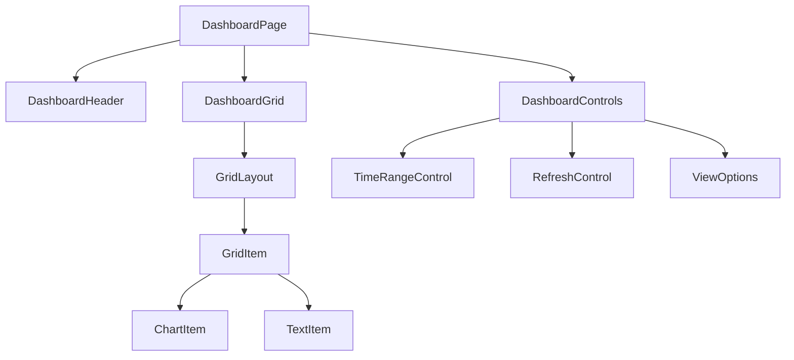

- **DashboardPage**: 대시보드 페이지 전체 구조 및 상태 관리
- **DashboardHeader**: 대시보드 제목, 설명, 메타 정보 표시
- **DashboardGrid**: react-grid-layout 기반 그리드 시스템 관리
- **GridItem**: 그리드 내 개별 위젯 아이템 래퍼
- **ChartItem/TextItem**: 위젯 유형별 특화 컴포넌트
- **DashboardControls**: 기간, 새로고침, 보기 옵션 등 제어

#### 3.2.2 대시보드 편집기 기능

- **레이아웃 관리**:
  - 드래그 앤 드롭을 통한 위젯 배치
  - 크기 조절 및 위치 변경
  - 그리드 정렬 및 스냅 기능
  - 레이아웃 잠금/해제

- **위젯 관리**:
  - 차트, 텍스트, 지표 등 다양한 위젯 추가
  - 위젯 속성 편집 및 스타일링
  - 위젯 복제, 삭제, 이동

- **대시보드 설정**:
  - 제목, 설명, 태그 설정
  - 공개/비공개 설정
  - 시간 범위 및 자동 새로고침 설정

### 3.3 차트 시스템

#### 3.3.1 차트 컴포넌트 구조

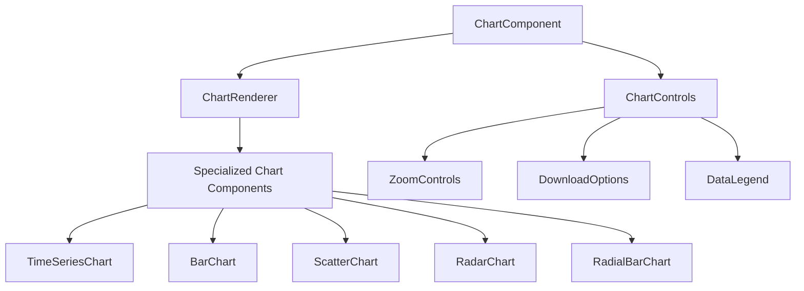

- **ChartComponent**: 최상위 래퍼 컴포넌트, props 검증 및 기본값 제공
- **ChartRenderer**: 차트 유형에 따라 적절한 렌더러 선택
- **Specialized Chart Components**: 각 차트 유형별 구현 (Recharts 활용)
- **ChartControls**: 차트와 상호작용하는 기본 제어 도구 제공

#### 3.3.2 차트 에디터 컴포넌트

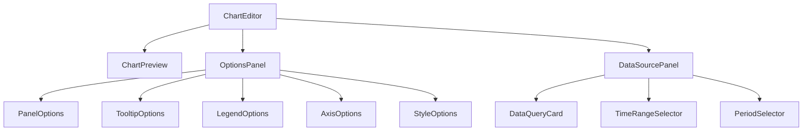

- **ChartEditor**: 에디터 전체 레이아웃 및 상태 관리
- **ChartPreview**: 현재 설정으로 차트 미리보기 제공
- **OptionsPanel**: 차트 시각적 옵션 편집 UI
- **DataSourcePanel**: 데이터 소스 및 쿼리 설정 UI
- **DataQueryCard**: 개별 데이터 쿼리 설정 UI

#### 3.3.3 차트 옵션 컴포넌트

**공통 옵션 컴포넌트**:
- **PanelOptions**: 제목, 설명, 배경 투명도 설정
- **TooltipOptions**: 툴팁 표시 방식, 커서 스타일 설정
- **LegendOptions**: 범례 표시 여부, 위치, 스타일 설정
- **AxisOptions**: 축 범위, 눈금, 레이블 설정

**특화 옵션 컴포넌트**:
- **TimeSeriesStyleOptions**: 시계열 차트 선 스타일, 영역 채우기 설정
- **ScatterOptions**: 산점도 포인트 크기, 모양, 회귀선 설정
- **RadarOptions**: 레이더 차트 그리드, 채우기, 데이터 정규화 설정
- **RadialBarOptions**: 방사형 바 차트 각도, 반지름, 배경 설정

### 3.4 데이터 소스 및 처리 시스템

#### 3.4.1 데이터 쿼리 컴포넌트

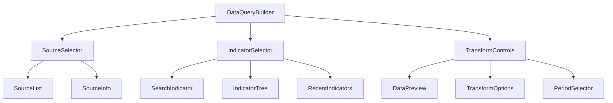

- **DataQueryBuilder**: 데이터 쿼리 구성 전체 관리
- **SourceSelector**: 데이터 출처 선택 UI (KOSIS, ECOS, OECD)
- **IndicatorSelector**: 지표 검색 및 선택 UI
- **TransformControls**: 데이터 변환 옵션 설정
- **DataPreview**: 선택한 데이터의 미리보기 표시

#### 3.4.2 데이터 변환 및 처리 파이프라인


- **데이터 추출**: 각 데이터 소스에서 원시 데이터 가져오기
- **데이터 정규화**: 소스별 다른 형식의 데이터를 통일된 형식으로 변환
- **데이터 필터링**: 필요한 데이터만 선택
- **데이터 변환**:
  - 원본값: 가공 없이 원본 데이터 사용
  - 변화율(전기대비): 직전 기간 대비 변화율
  - 변화율(전년동기대비): 전년 동일 기간 대비 변화율
  - 누적값: 시간 경과에 따른 누적값
- **데이터 집계**: 필요 시 합계, 평균 등 계산
- **시각화 데이터**: 차트에 표시 가능한 형태로 변환

#### 3.4.3 데이터 시각화 헬퍼 컴포넌트

- **TimeRangeSelector**: 시간 범위 선택 UI
- **PeriodSelector**: 데이터 주기 선택 UI (일간, 월간, 분기, 연간)
- **ComparisonControls**: 데이터 비교 설정 UI (전년동기, 이전기간 등)
- **DataExportOptions**: 데이터 내보내기 옵션

### 3.5 공유 대시보드 시스템

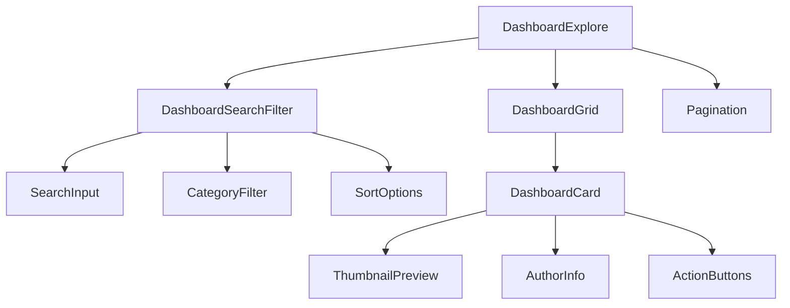

- **DashboardExplore**: 공유 대시보드 탐색 페이지 관리
- **DashboardSearchFilter**: 검색 및 필터링 기능 제공
- **DashboardCard**: 개별 대시보드 정보 카드 표시
- **ThumbnailPreview**: 대시보드 미리보기 이미지 제공
- **ActionButtons**: 미리보기, 구독 등 작업 버튼 제공

### 3.6 구독 및 결제 시스템

- **유/무료 플랜 구분**
  - 무료: 제한된 지표, 제한된 기간, 광고 포함
  - 유료: 모든 지표, 무제한 조회, 광고 제거, 우선 지원
  
- **결제 시스템**
  - 토스페이먼츠 연동
  - 월간/연간 구독 옵션
  
- **계정 관리**
  - 개인 계정 설정
  - 결제 내역 및 구독 상태 확인

## 4. 기술 아키텍처

### 4.1 모노레포 패키지 구조

E-Torch는 모노레포 구조를 채택하여 코드 재사용성과 관리 용이성을 높입니다:

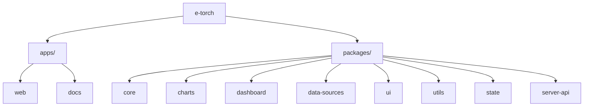

- **apps/web**: 메인 웹 애플리케이션
- **apps/docs**: 문서 사이트
- **packages/core**: 핵심 타입, 상수, 인터페이스
- **packages/charts**: 차트 컴포넌트 및 유틸리티
- **packages/dashboard**: 대시보드 컴포넌트 및 유틸리티
- **packages/data-sources**: 데이터 소스 커넥터 및 변환 로직
- **packages/ui**: UI 컴포넌트 라이브러리
- **packages/utils**: 범용 유틸리티 함수
- **packages/state**: 상태 관리 스토어 및 훅
- **packages/server-api**: 서버 API 클라이언트 및 타입

### 4.2 프론트엔드 기술 스택

| 영역 | 기술 | 선정 이유 | 버전 |
|------|------|----------|------|
| **모노레포 관리** | Turborepo | 빌드 캐싱, 병렬 실행, 의존성 관리 기능 우수 | 2.0.0+ |
| **패키지 관리** | pnpm | 디스크 공간 절약, 의존성 중복 설치 방지 | 8.0.0+ |
| **프레임워크** | React + Next.js | App Router, 서버 컴포넌트 제공 | React 19, Next.js 15 |
| **UI 프레임워크** | Shadcn/UI + Tailwind CSS | 커스터마이징 용이성, 생산성 향상 | Tailwind CSS 4 |
| **상태 관리** | Zustand, Tanstack Query | 단순한 API, 성능 최적화, 상태 로직 분리 | Zustand 5, TQ 5 |
| **차트 라이브러리** | Recharts | React 친화적, 유연한 커스터마이징 | 2.10.1+ |
| **대시보드 레이아웃** | react-grid-layout | 드래그 앤 드롭, 리사이징 지원 | 1.4.0+ |
| **타입 검사** | TypeScript | 타입 안정성, 개발 생산성 향상 | 5.5+ |
| **폼 관리** | React Hook Form + Zod | 성능 최적화, 선언적 유효성 검사 | RHF 7, Zod 3 |
| **코드 품질 관리** | ESLint + Prettier | 일관된 코드 스타일, 오류 감지 | ESLint 9, Prettier 3 |
| **테스트** | Vitest + Testing Library + Playwright | 단위/통합/E2E 테스트 도구 | Vitest 1, Playwright 1.40+ |
| **문서화** | Storybook | 컴포넌트 문서화, 시각적 테스트 | 8.0+ |

### 4.3 서버/클라이언트 컴포넌트 분리 전략

Next.js App Router 환경에서 서버/클라이언트 컴포넌트를 효율적으로 분리합니다:

#### 서버 컴포넌트 (RSC)
- 데이터 페칭이 필요한 페이지 컴포넌트
- SEO 관련 메타데이터 컴포넌트
- 정적 레이아웃 및 UI 요소
- 렌더링 성능이 중요한 데이터 표시 컴포넌트

#### 클라이언트 컴포넌트 (RCC)
- 인터랙티브한 차트 및 그래프 컴포넌트
- 사용자 입력 및 이벤트 처리가 필요한 컴포넌트
- 드래그 앤 드롭 및 애니메이션 관련 컴포넌트
- 상태를 직접 관리하는 컴포넌트

#### 하이브리드 패턴
서버 컴포넌트에서 데이터를 페치하고, 클라이언트 컴포넌트에 props로 전달하는 패턴:

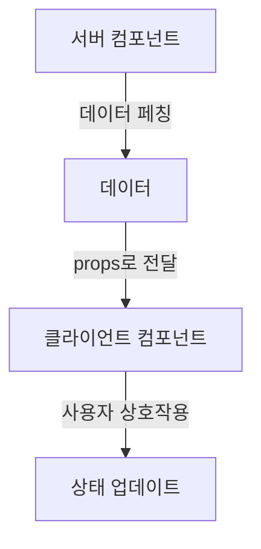

### 4.4 상태 관리 아키텍처

E-Torch는 다층적 상태 관리 아키텍처를 구현합니다:

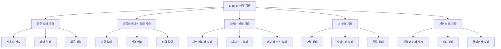

#### 상태 유형 분류

| 상태 유형 | 지속성 | 범위 | 관리 도구 |
|----------|--------|------|----------|
| **영구 상태** | 앱 재시작 후에도 유지 | 사용자 설정, 테마, 최근 작업 | Zustand + persist |
| **애플리케이션 상태** | 세션 동안 유지 | 인증, 전역 알림, 에러 | Zustand |
| **도메인 상태** | 기능별 컨텍스트 동안 유지 | 차트 에디터, 대시보드 에디터 상태 | Zustand, Context API |
| **UI 상태** | 컴포넌트 라이프사이클 | 모달, 드롭다운, 펼침 상태 | useState, useReducer |
| **서버 상태** | 캐시 정책에 따라 유지 | 원격 데이터, API 응답 | Tanstack Query |

### 4.5 데이터 캐싱 전략

| 데이터 유형 | staleTime | gcTime | 리페치 전략 | 무효화 조건 |
|------------|-----------|--------|------------|------------|
| 사용자 대시보드 | 5분 | 1시간 | 윈도우 포커스 시 | 대시보드 변경 후 |
| 공유 대시보드 | 10분 | 3시간 | 수동 또는 주기적 | 댓글 작성, 별점 변경 |
| 경제지표 데이터 | 1시간 | 12시간 | 수동 또는 주기적 | 시간 범위 변경 |
| 실시간 지표 | 1분 | 10분 | 주기적 (1분) | 자동 만료 |
| 시스템 메타데이터 | 1일 | 1주일 | 앱 시작 시 | 버전 업데이트 |

### 4.6 라우팅 구조

Next.js App Router를 활용한 라우팅 구조:

```
app/
├── (auth)/               # 인증 관련 라우트 그룹
│   ├── login/            # 로그인 페이지
│   ├── callback/         # 소셜 로그인 콜백 처리
│   └── layout.tsx        # 인증 레이아웃
│
├── (dashboard)/          # 대시보드 관련 라우트 그룹
│   ├── dashboard/        # 대시보드 목록 페이지
│   ├── dashboard/[id]/   # 개별 대시보드 상세 페이지
│   ├── dashboard/new/    # 새 대시보드 생성 페이지
│   ├── dashboard/[id]/edit/ # 대시보드 편집 페이지
│   ├── explore/          # 대시보드 탐색/발견 페이지
│   └── layout.tsx        # 대시보드 레이아웃
│
├── (chart)/              # 차트 관련 라우트 그룹
│   ├── chart-editor/[id]/ # 차트 에디터 페이지
│   ├── chart/[id]/       # 개별 차트 상세 페이지
│   └── layout.tsx        # 차트 레이아웃
│
├── (profile)/            # 사용자 프로필 관련 라우트 그룹
│   ├── profile/settings/ # 프로필 설정 페이지
│   ├── profile/subscription/ # 구독 관리 페이지
│   ├── profile/notifications/ # 알림 설정 페이지
│   └── layout.tsx        # 프로필 레이아웃
│
├── api/                  # API 라우트
├── layout.tsx            # 루트 레이아웃
└── page.tsx              # 홈페이지
```

### 4.7 백엔드 아키텍처

- **서버**: Node.js
- **데이터베이스**: MariaDB
- **API**: RESTful API
- **인증**: Supabase (추후 AWS Cognito, Firebase 등 고려)
- **개발 현황**: 모킹 서버 및 데이터 마이그레이션 초기 단계 완료

## 5. UI/UX 설계

### 5.1 디자인 시스템

#### 5.1.1 색상 팔레트

**브랜드 색상**:
- Primary: #0c1e3e
- Secondary: #1a56db
- Tertiary: #0284c7

**중립 색상**:
- Background: #ffffff
- Surface: #f8fafc
- Surface Alt: #f1f5f9
- Border: #e2e8f0
- Text Primary: #0f172a
- Text Secondary: #334155

**액센트 색상**:
- Success: #059669
- Warning: #d97706
- Danger: #dc2626
- Info: #2563eb
- Highlight: #7c3aed

**차트 색상**: #1b3a6b, #1c7ed6, #12b886, #9775fa, #fd7e14, #40c057, #e64980

#### 5.1.2 타이포그래피

**폰트 패밀리**:
- 기본 폰트: Inter (헤더, 내비게이션, 대시보드 컨트롤)
- 모노스페이스 폰트: JetBrains Mono (코드, 데이터 테이블, 수치 데이터)

**타입 스케일**:
- Display (36px / 1.2) - 대시보드 제목
- H1 (28px / 1.3) - 섹션 제목
- H2 (24px / 1.35) - 위젯 그룹 제목
- H3 (20px / 1.4) - 위젯 제목
- H4 (18px / 1.45) - 카드 제목
- Body (16px / 1.5) - 본문 텍스트
- Small (14px / 1.5) - 보조 텍스트
- XSmall (12px / 1.5) - 캡션, 도움말
- Code (14px / 1.6) - 데이터 테이블, 수치
- Data Value (16px / 1.4) - 주요 지표

#### 5.1.3 컴포넌트 디자인

**버튼 스타일**:
- Primary: #0c1e3e 배경, 흰색 텍스트
- Secondary: #1a56db 배경, 흰색 텍스트
- Outline: 투명 배경, #0c1e3e 테두리와 텍스트
- Ghost: 투명 배경, #0c1e3e 텍스트
- Destructive: #dc2626 배경, 흰색 텍스트

**버튼 크기**:
- Small: 120px × 34px, 12px 폰트
- Default: 150px × 44px, 14px 폰트
- Large: 180px × 54px, 16px 폰트
- Icon: 44px × 44px

### 5.2 주요 화면 설계

#### 5.2.1 메인 대시보드 화면

- **헤더**: 로고, 검색, 사용자 메뉴
- **사이드바**: 내 대시보드, 대시보드 탐색, 설정 등 링크
- **대시보드 목록**: 카드 형태로 표시된 대시보드 목록
- **대시보드 카드**: 타이틀, 설명, 썸네일, 최종 업데이트 정보
- **액션 버튼**: 새 대시보드 생성, 정렬, 필터 등

#### 5.2.2 대시보드 상세 화면

- **대시보드 헤더**: 타이틀, 시간 범위 선택, 주기 선택
- **대시보드 제어**: 편집, 공유, 내보내기 버튼
- **위젯 그리드**: 차트, 텍스트 등 다양한 위젯을 그리드 레이아웃으로 표시
- **위젯 컨트롤**: 위젯별 확대/축소, 설정, 다운로드 옵션

#### 5.2.3 차트 에디터 화면

- **상단 제어**: 차트 제목, 기간, 주기 설정
- **미리보기 영역**: 현재 설정의 차트 미리보기
- **옵션 패널**: 패널, 툴팁, 범례, 축, 스타일 등 옵션
- **데이터 소스 패널**: 데이터 출처, 지표, 변환 설정

#### 5.2.4 대시보드 편집 화면

- **편집 툴바**: 위젯 추가, 배열, 이동, 저장 버튼
- **그리드 에디터**: 드래그 앤 드롭으로 위젯 배치 및 크기 조절
- **위젯 속성 패널**: 선택한 위젯의 속성 편집

### 5.3 접근성 설계

#### 5.3.1 키보드 내비게이션

- Tab 키를 통한 포커스 이동
- Enter/Space 키를 통한 버튼 활성화
- 화살표 키를 통한 드롭다운 메뉴 탐색
- Esc 키를 통한 모달/팝업 닫기

#### 5.3.2 스크린 리더 지원

- 의미 있는 구조화: 적절한 HTML 시맨틱 요소 사용
- 모든 이미지 및 아이콘에 대체 텍스트 제공
- ARIA 레이블 및 역할 적절히 사용
- 차트 데이터에 대한 텍스트 대체 콘텐츠 제공

#### 5.3.3 색상 및 대비

- WCAG 2.1 AA 수준 준수: 텍스트와 배경 간 4.5:1 이상의 대비
- 색상에만 의존하지 않는 정보 전달
- 높은 대비 모드 지원
- 색맹 사용자를 위한 차트 패턴 추가 옵션

#### 5.3.4 반응형 디자인

- 모바일 우선 접근 방식
- 적응형 레이아웃: 그리드 시스템 활용
- 터치 타겟 최적화: 모바일에서 최소 44x44px 터치 영역
- 콘텐츠 재배치: 화면 크기에 따른 컴포넌트 재배치

## 6. 사용자 흐름

### 6.1 온보딩 및 로그인 흐름

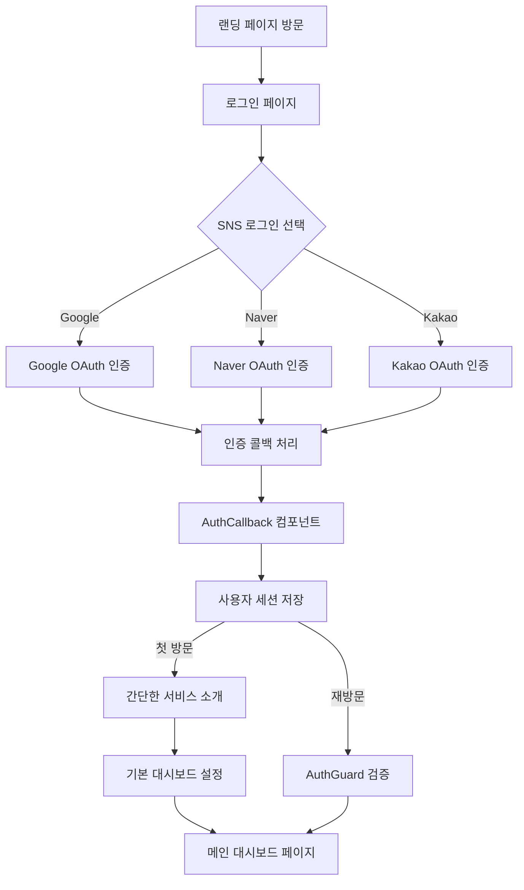

### 6.2 대시보드 관리 흐름

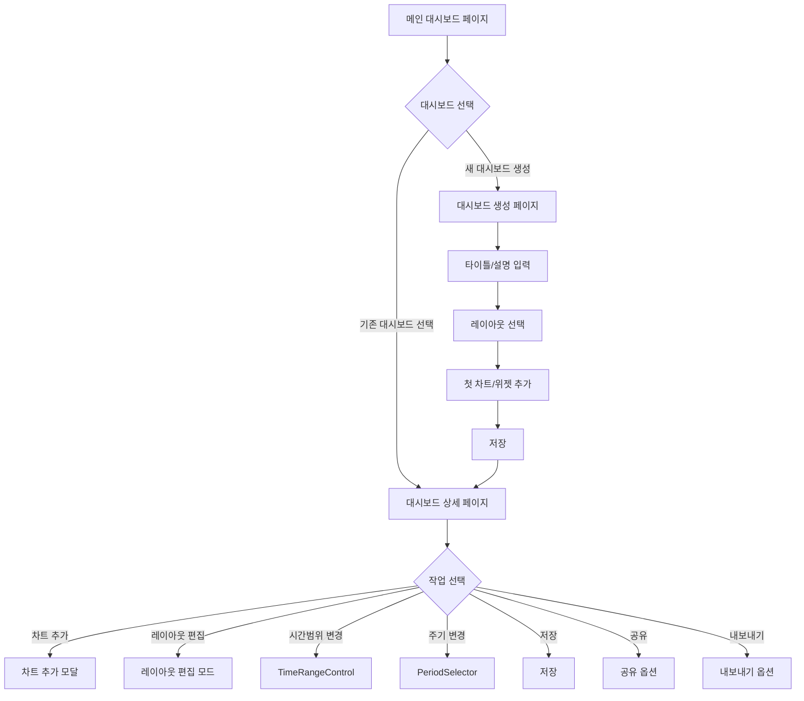

### 6.3 차트 생성 및 편집 흐름

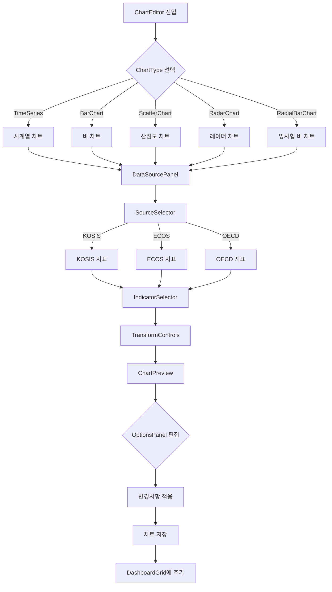

### 6.4 데이터 비교 분석 흐름

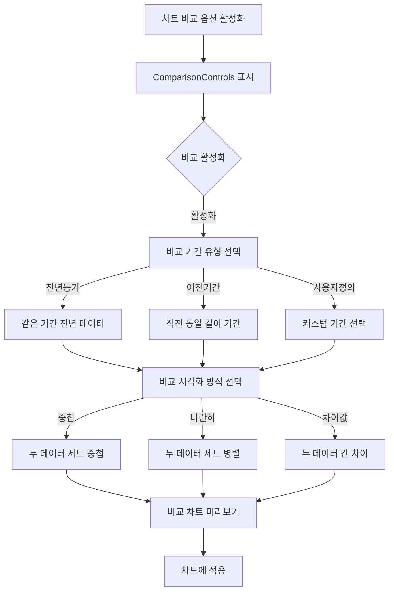

## 7. 데이터 관리 계획

### 7.1 우선 제공 경제지표

- KOSIS, ECOS 지표 중심 제공(요구사항에 명시된 지표 목록)
- 주요 지표 카테고리:
  - 종합경기지수(동행지수, 선행지수)
  - 주가지수(KOSPI)
  - 물가지수(CPI)
  - GDP 관련 지표
  - 금리 관련 지표
  - 통화량 지표
  - 환율 지표

### 7.2 데이터 업데이트 주기

- 일간 데이터: 매일 1회 업데이트(장 마감 후)
- 월간 데이터: 해당 기관 발표 후 자동 업데이트
- 분기/연간 데이터: 발표 직후 업데이트
- 수동 데이터: 관리자 페이지를 통한 수동 입력 지원

### 7.3 데이터 품질 관리

- 출처별 데이터 무결성 검증
- 데이터 업데이트 히스토리 관리
- 수동 입력 데이터 검증 절차

## 8. 서비스 차별화 전략

### 8.1 전문가 인사이트 제공

- 경제 전문가들의 분석 템플릿 제공
- 전문가가 제작한 대시보드 구독 서비스
- 차트 내 전문가 수준의 트렌드 분석 도구

### 8.2 통합 데이터 플랫폼

- 다양한 출처의 경제지표를 한 곳에서 제공
- 동일 지표에 대한 출처별 비교 분석
- 지표 간 상관관계 분석 도구

### 8.3 커스터마이징 유연성

- 사용자 수준별 UI 최적화
- 전문가용 고급 편집 기능
- 일반 사용자용 템플릿 기반 간편 설정

## 9. 개발 단계 계획

### 9.1 개발 일정

#### MVP 출시 (6/20 완료)

- **기획**: 완료
- **설계**: 완료
- **백엔드 개발**: 모킹 서버 및 데이터 마이그레이션 초기단계 완료, API 기능 확장 및 안정화 진행 중
- **프론트엔드 개발**: 진행 중
- **통합 테스트**: 예정

### 9.2 출시 전략

- MVP 출시 후 지속적 업데이트 방식 채택
- 초기 핵심 기능 위주로 개발 후 출시
- 사용자 피드백 기반 기능 개선 및 추가

## 10. 기술적 고려사항 및 제약조건

### 10.1 비용 최적화

- 인프라 비용 최소화 전략
- 안정성 우선, 과도한 확장성 구현은 지양
- AWS 또는 다른 클라우드 서비스 활용 시 비용 효율적 설계

### 10.2 보안 고려사항

- SNS 로그인만 지원하여 개인정보 보호 강화
- Supabase의 보안 기능 활용
- HTTPS 통신 및 데이터 암호화

### 10.3 성능 최적화

- 코드 분할 및 지연 로딩
- 메모이제이션 및 렌더링 최적화
- 데이터 캐싱 및 효율적인 상태 관리
- 서버 컴포넌트 활용을 통한 초기 로딩 성능 개선

### 10.4 서비스 연속성

- 외부 데이터 소스 변경 시 대응 방안
- 데이터 소스 변경 감지 시스템
- 백업 데이터 보관
- 관리자 알림 시스템

## 11. 마케팅 및 사용자 확보 전략

### 11.1 초기 사용자 확보

- 전문가 대상 무료 체험 프로그램
- 경제학과 교수 및 연구자 타겟 마케팅
- 경제/금융 관련 유튜버 및 인플루언서 협업

### 11.2 마케팅 채널

- 블로그 포스팅
- SNS 유료 광고 (토스, 페이스북, 인스타그램, 구글 등)
- 경제/금융 커뮤니티 타겟 마케팅

### 11.3 브랜딩 전략

- "경제 데이터의 길잡이" 포지셔닝
- 전문성과 접근성을 동시에 강조
- 워터마크가 포함된 공유 콘텐츠를 통한 자연스러운 브랜드 확산

## 12. 위험 요소 및 대응 방안

### 12.1 데이터 소스 안정성

- **위험**: 외부 데이터 소스(KOSIS, ECOS 등)의 API 변경 또는 서비스 중단
- **대응**:
  - 서비스 중단 시 사용자에게 명확한 알림 제공
  - 복구 시간 예측 정보 공유
  - 대체 데이터 확보 가능한 경우 대체 정보 제공

### 12.2 성능 관리

- **위험**: 대량 데이터 처리 시 성능 저하
- **대응**:
  - 점진적 로딩 전략 구현
  - 데이터 샘플링 및 집계 기법 활용
  - 캐싱 최적화 및 CDN 활용

### 12.3 사용자 확보 전략

- **위험**: 초기 사용자 유입 부족
- **대응**:
  - 전문가 타겟 무료 체험 제공
  - 워터마크가 포함된 콘텐츠 공유를 통한 간접 마케팅
  - 경제/금융 관련 커뮤니티 및 플랫폼 협업

## 부록: 제공 경제지표 상세 목록

### KOSIS 지표코드

| 지표코드 | 지표명 | 기간 |
|---------|-------|-----|
| CCI | 동행지수 순환변동치 | M |
| CLI | 선행지수 순환변동치 | M |
| LCI | 선행종합지수 | M |
| KOSPI | 코스피 지수 | M |
| CPI_CR_YoY | 월별 소비자 물가 등락률 전년동월비(%) | M |
| KOSPI_MARKET_CAP | 코스피 시가총액 | M |
| RGDP_QoQ_SA | 경제성장률(GDP)(실질, 계절조정, 전기비) | Q |
| RGDP_YoY_V | 경제성장률(GDP)(실질, 원계열, 전년동기비) | Q |
| GDPD_CR_YoY_V | GDP 디플레이터 등락률(원계열, 전년동기비) | Q |
| NGDP_KRW | 국내총생산(GDP)(명목, 원화표시)(십억원) | A |
| NGDP_USD | 국내총생산(GDP)(명목, 달러표시)(억달러) | A |
| GDP_RGR | 경제성장률(실질성장률)(%) | A |
| GDPD_B2015 | GDP 디플레이터(2015=100) | A |
| GDPD_B2015_CR | GDP 디플레이터(2015=100) 등락률(%) | A |

### ECOS 지표코드

| 지표코드 | 지표명 | 기간 |
|---------|-------|-----|
| Bond_Yield_1yr | 시장금리 국고채 (1년) | D,M,Q,A |
| Bond_Yield_3yr | 시장금리 국고채 (3년) | D,M,Q,A |
| Bond_Yield_10yr | 시장금리 국고채 (10년) | D,M,Q,A |
| C_Bond_Yield_AA_MINUS | 회사채수익률 (AA-) | D,M,Q,A |
| BOK_RATE | 한국은행 기준금리 | M,D |
| NGDP_SA | 국내총생산(GDP)(계절조정, 명목) | Q |
| RGDP_SA | 국내총생산(GDP)(계절조정, 실질) | Q |
| NGDP_V | 국내총생산(GDP)(원계열, 명목) | Q |
| RDGP_V | 국내총생산(GDP)(원계열, 실질) | Q |
| GDPD_B2015 | GDP 디플레이터 (2015=100) | Q |
| RGDP_QoQ_SA | 경제성장률(GDP)(실질, 계절조정, 전기비) | Q |
| RGDP_YoY_V | 경제성장률(GDP)(실질, 원계열, 전년동기비) | Q |
| GDPD_CR_YoY_V | GDP 디플레이터 등락률(원계열, 전년동기비) | Q |
| GDPD_B2015 | GDP 디플레이터(2015=100) | A |
| GDPD_B2015_CR | GDP 디플레이터(2015=100) 등락률(%) | A |
| NGDP_KRW | 국내총생산(GDP)(명목, 원화표시)(십억원) | A |
| NGDP_USD | 국내총생산(GDP)(명목, 달러표시)(억달러) | A |
| GDP_RGR | 경제성장률(실질성장률)(%) | A |
| KRW_USD_D | 원/미국달러(매매기준율)(일별) | D |
| KRW_CNY_D | 원/위안(매매기준율)(일별) | D |
| KRW_JPY_D | 원/일본엔(100엔)(일별) | D |
| KRW_USD_M | 원/미국달러(매매기준율)(월별) | M |
| KRW_CNY_M | 원/위안(매매기준율)(월별) | M |
| KRW_JPY_M | 원/일본엔(100엔)(월별) | M |
| CrudeOil | 원유-WTI | M |
| IRLT | 장기금리(IRLT) | M |
| IR3TIP | 단기금리(IR3TIP) | M |
| M2_AVG_V | M2(평잔, 원계열) | M |
| CURRENCY | 현금통화(단기부동자금) | M |
| DEMAND_DEPOSITS | 요구불예금(단기부동자금) | M |
| SAVINGS_ACCOUNT_DEPOSITS | 수시입출식저축성예금(단기부동자금) | M |
| MMF | MMF(단기부동자금) | M |
| NCD | 양도서예금증서(단기부동자금) | M |
| CMA | CMA(단기부동자금) | M |
| REPO | 환매조건부채권매도(단기부동자금) | M |
| Lf | Lf | M |

### 코드 약어 설명

| 특징 | 줄임말 | 의미 |
|------|------|------|
| 전년 대비 | YoY | Year-over-Year |
| 월별 대비 | MoM | Month-over-Month |
| 분기별 대비 | QoQ | Quarter-over-Quarter |
| 일별 대비 | DoD | Day-over-Day |
| 주별 대비 | WoW | Week-over-Week |
| 특정 요일 대비 | YoY DoW | Year-over-Year Day-of-Week-over-Day-of-Week |
| 원계열 | V | - |
| 계절조정 | SA | Seasonally Adjusted |
| 명목GDP | NGDP | - |
| 실질GDP | RGDP | - |