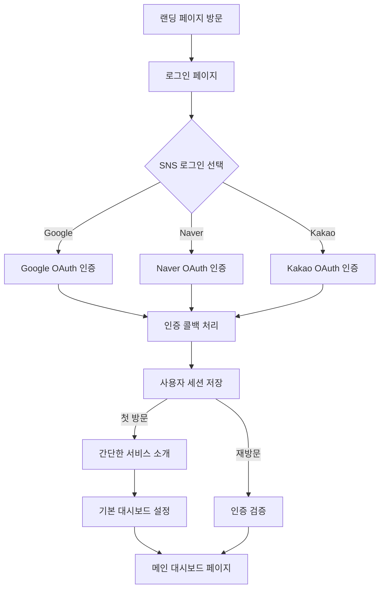
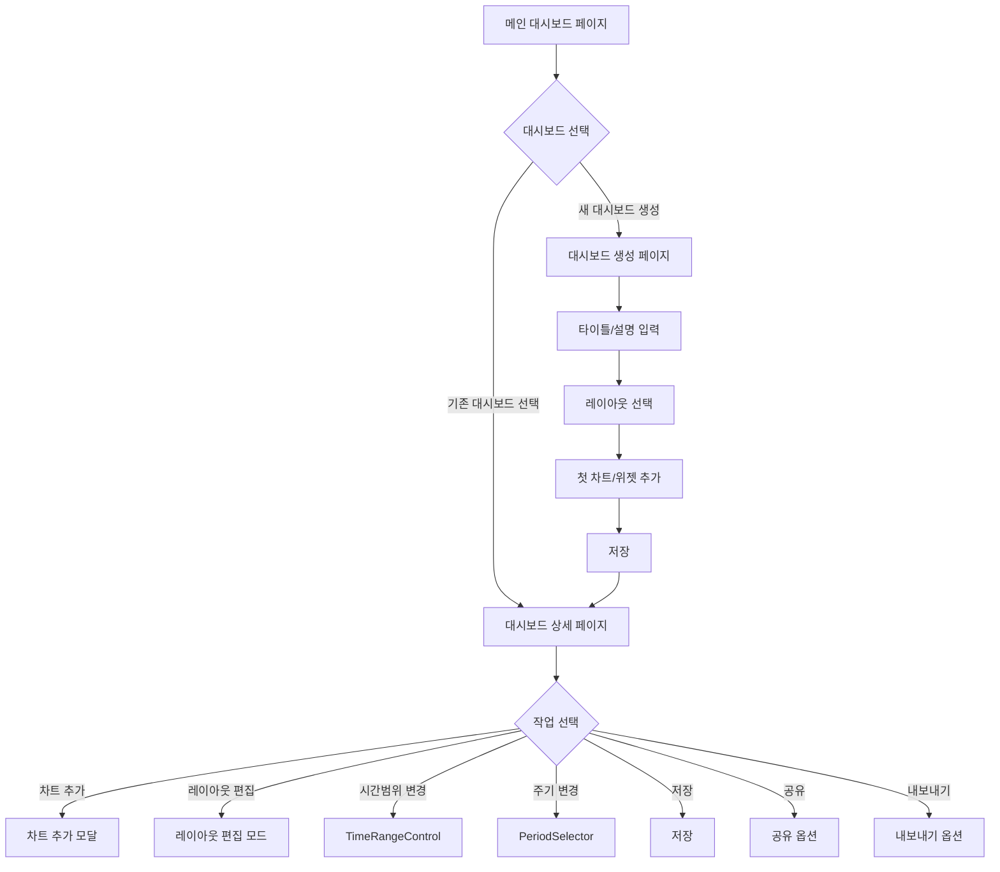
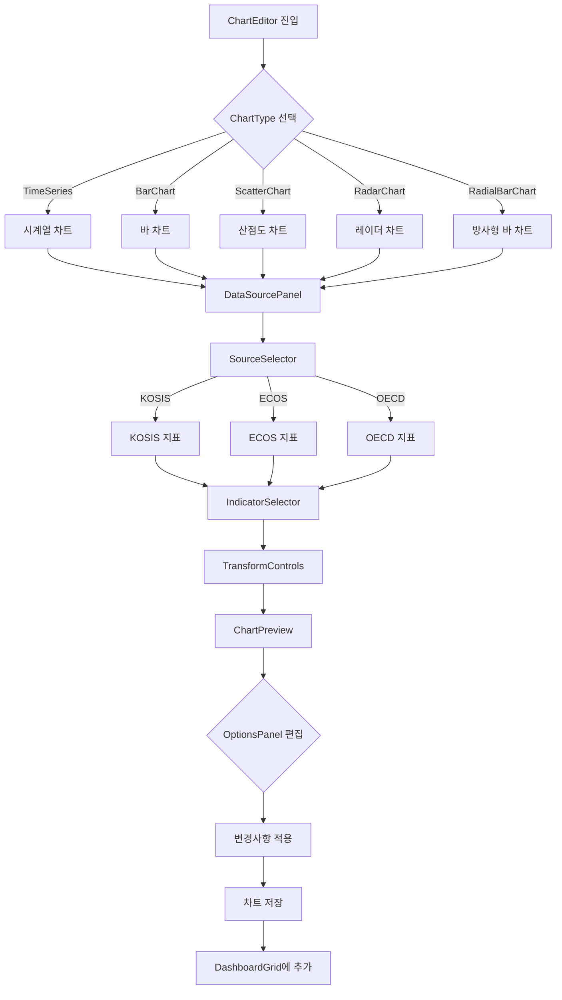

# E-Torch: 경제지표 대시보드 서비스 기획서

## 1. 서비스 개요

**서비스명**: E-Torch (eTorch, etorch)

- **의미**: 경제에 횃불을 더해 길을 밝혀준다는 의미
- **비전**: 복잡한 경제 데이터를 누구나 쉽게 이해하고 활용할 수 있도록 시각화

**서비스 목적**:

- 다양한 출처(KOSIS, ECOS, OECD)의 경제지표 데이터를 통합 제공
- 사용자 맞춤형 대시보드를 통한 경제지표 시각화 및 인사이트 도출
- 전문가와 일반 사용자 모두를 위한 경제데이터 접근성 향상

## 2. 타겟 사용자 분석 및 니즈

### 사용자 1: 전문 투자자 및 경제 전문가

- **특징**: 경제 데이터 분석 능력이 뛰어나고, 엑셀 등 도구 활용에 익숙함
- **니즈**:
  - 다양한 출처의 데이터를 일괄적으로 확인하고 비교 분석
  - 세부적인 차트 편집과 커스터마이징 기능
  - 트렌드 라인, 기준선 등을 활용한 전문적 분석
  - 데이터 시각화를 통한 강의자료 및 분석자료 생성 (다운로드 시 E-Torch 워터마크 포함)

### 사용자 2: 일반 투자자 및 경제 관심층

- **특징**: 경제 데이터에 관심은 있으나 전문성이 부족, UI 편의성 중요
- **니즈**:
  - 간편한 대시보드 설정
  - 전문가가 제공하는 인사이트 있는 대시보드 구독
  - 직관적인 경제지표 시각화

## 3. 핵심 서비스 기능

### 3.1 사용자 관리 시스템

- **SNS 로그인 연동**
  - Google, Naver, Kakao 등 주요 SNS 로그인 지원
  - 사용자 인증 및 악성 사용자 관리
  - 개인정보 최소화(자체 회원가입 미지원)
  - Supabase를 활용한 인증 시스템

- **인증 흐름**
  - 첫 방문 사용자를 위한 온보딩 프로세스
  - 재방문 사용자는 이전 세션 상태 복원

### 3.2 대시보드 시스템

- **대시보드 페이지**: 사용자의 모든 대시보드를 관리하고 탐색할 수 있는 메인 페이지
- **대시보드 상세**: 개별 대시보드를 조회하고 상호작용하는 페이지
- **대시보드 에디터**: 대시보드를 생성하고 편집하는 페이지
- **대시보드 공유**: 다른 사용자와 대시보드를 공유하는 기능

#### 대시보드 편집기 기능

- **레이아웃 관리**:
  - 드래그 앤 드롭을 통한 위젯 배치
  - 크기 조절 및 위치 변경
  - 그리드 정렬 및 스냅 기능
  - 레이아웃 잠금/해제

- **위젯 관리**:
  - 차트, 텍스트, 지표 등 다양한 위젯 추가
  - 위젯 속성 편집 및 스타일링
  - 위젯 복제, 삭제, 이동

- **대시보드 설정**:
  - 제목, 설명, 태그 설정
  - 공개/비공개 설정
  - 시간 범위 및 자동 새로고침 설정

### 3.3 위젯 시스템

- **위젯 편집기**: 차트형 및 텍스트형 위젯을 통합 생성/편집하는 도구
- **차트형 위젯**: Time Series, Bar Chart, Scatter Chart, Radar Chart, Radial Bar Chart 등
- **텍스트형 위젯**: 사용자 정의 텍스트, 데이터 기반 텍스트 표시

#### 위젯 편집기 주요 기능

- **위젯 유형 선택**: 데이터에 적합한 차트 및 텍스트 유형 선택
- **데이터 소스 설정**: 여러 경제지표 데이터 소스 연결
- **시각화 옵션**: 축, 범례, 색상, 그리드 등 시각화 요소 커스터마이징
- **데이터 변환**: 원본값, 변화율, 누적값 등 다양한 데이터 표현 방식
- **미리보기**: 실시간 위젯 미리보기

### 3.4 데이터 소스 및 처리 시스템

- **다중 데이터 소스**: KOSIS, ECOS, OECD 등 다양한 데이터 소스 통합
- **데이터 변환**: 원본 데이터를 사용자가 원하는 형태로 변환
- **데이터 쿼리**: 직관적인 인터페이스로 데이터 조회 조건 설정

#### 데이터 쿼리 기능

- **소스 선택**: 데이터 출처 선택 (KOSIS, ECOS, OECD)
- **지표 검색**: 키워드 및 카테고리별 지표 검색
- **시간 범위 선택**: 사용자 정의 시간 범위 설정
- **주기 선택**: 일별, 월별, 분기별, 연간 데이터 선택
- **데이터 미리보기**: 쿼리 결과 미리보기

### 3.5 공유 대시보드 시스템

- **대시보드 탐색**: 다른 사용자가 공유한 대시보드 검색 및 탐색
- **대시보드 구독**: 관심 있는 대시보드 구독 및 업데이트 알림
- **대시보드 포크**: 다른 사용자의 대시보드를 복제하여 커스터마이징

### 3.6 구독 및 결제 시스템

- **유/무료 플랜 구분**
  - 무료: 제한된 지표, 제한된 기간, 광고 포함
  - 유료: 모든 지표, 무제한 조회, 광고 제거, 우선 지원
  
- **결제 시스템**
  - 토스페이먼츠 연동
  - 월간/연간 구독 옵션
  
- **계정 관리**
  - 개인 계정 설정
  - 결제 내역 및 구독 상태 확인

## 4. 주요 화면 설계

### 4.1 메인 대시보드 화면

- **헤더**: 로고, 검색, 사용자 메뉴
- **사이드바**: 내 대시보드, 대시보드 탐색, 설정 등 링크
- **대시보드 목록**: 카드 형태로 표시된 대시보드 목록
- **대시보드 카드**: 타이틀, 설명, 썸네일, 최종 업데이트 정보
- **액션 버튼**: 새 대시보드 생성, 정렬, 필터 등

### 4.2 대시보드 상세 화면

- **대시보드 헤더**: 타이틀, 시간 범위 선택
- **대시보드 제어**: 편집, 공유, 내보내기 버튼
- **위젯 그리드**: 차트, 텍스트 등 다양한 위젯을 그리드 레이아웃으로 표시
- **위젯 컨트롤**: 위젯별 확대/축소, 설정, 다운로드 옵션

### 4.3 차트 에디터 화면

- **상단 제어**: 차트 제목, 기간, 주기 설정
- **미리보기 영역**: 현재 설정의 차트 미리보기
- **옵션 패널**: 패널, 툴팁, 범례, 축, 스타일 등 옵션
- **데이터 소스 패널**: 데이터 출처, 지표, 변환 설정

### 4.4 대시보드 편집 화면

- **편집 툴바**: 위젯 추가, 배열, 이동, 저장 버튼
- **그리드 에디터**: 드래그 앤 드롭으로 위젯 배치 및 크기 조절
- **위젯 속성 패널**: 선택한 위젯의 속성 편집

## 5. 사용자 흐름

### 5.1 온보딩 및 로그인 흐름



### 5.2 대시보드 관리 흐름



### 5.3 차트 생성 및 편집 흐름



## 6. UI/UX 설계

### 6.1 디자인 시스템 개요

E-Torch는 일관된 사용자 경험을 위해 체계적인 디자인 시스템을 구축합니다:

- **브랜드 색상**: Primary (#0c1e3e), Secondary (#1a56db), Tertiary (#0284c7)
- **타이포그래피**: Inter (기본 폰트), JetBrains Mono (모노스페이스 폰트)
- **컴포넌트 원칙**: 일관성, 재사용성, 접근성, 반응형 디자인
- **색상 체계**: OKLCH 색상 공간을 활용한 다크/라이트 모드 지원

### 6.2 접근성 설계

- **키보드 내비게이션**: 모든 기능을 키보드로 사용 가능하도록 설계
- **스크린 리더 지원**: 차트 데이터를 스크린 리더가 인식할 수 있는 대체 텍스트 제공
- **색상 및 대비**: WCAG 2.1 AA 수준 준수, 색상에만 의존하지 않는 정보 전달
- **반응형 디자인**: 모든 디바이스에서 최적의 경험 제공

## 7. 데이터 관리 계획

### 7.1 우선 제공 경제지표

- KOSIS, ECOS 지표 중심 제공(요구사항에 명시된 지표 목록)
- 주요 지표 카테고리:
  - 종합경기지수(동행지수, 선행지수)
  - 주가지수(KOSPI)
  - 물가지수(CPI)
  - GDP 관련 지표
  - 금리 관련 지표
  - 통화량 지표
  - 환율 지표

### 7.2 데이터 업데이트 주기

- 일간 데이터: 매일 1회 업데이트(장 마감 후)
- 월간 데이터: 해당 기관 발표 후 자동 업데이트
- 분기/연간 데이터: 발표 직후 업데이트
- 수동 데이터: 관리자 페이지를 통한 수동 입력 지원

### 7.3 데이터 품질 관리

- 출처별 데이터 무결성 검증
- 데이터 업데이트 히스토리 관리
- 수동 입력 데이터 검증 절차

### 7.4 데이터 변환 및 처리 파이프라인

- 결측치 처리 알고리즘 (선형 보간법, 이전/이후 값 복제 등)
- 주기 변환 (일간→월간→분기→연간) 및 동기화
- LTTB(Largest-Triangle-Three-Buckets) 다운샘플링으로 대량 데이터 최적화
- 데이터 캐싱 전략으로 성능 최적화

## 8. 서비스 차별화 전략

### 8.1 전문가 인사이트 제공

- 경제 전문가들의 분석 템플릿 제공
- 전문가가 제작한 대시보드 구독 서비스
- 차트 내 전문가 수준의 트렌드 분석 도구

### 8.2 통합 데이터 플랫폼

- 다양한 출처의 경제지표를 한 곳에서 제공
- 동일 지표에 대한 출처별 비교 분석
- 지표 간 상관관계 분석 도구

### 8.3 커스터마이징 유연성

- 사용자 수준별 UI 최적화
- 전문가용 고급 편집 기능
- 일반 사용자용 템플릿 기반 간편 설정

## 9. 개발 및 출시 계획

### 9.1 개발 일정

#### MVP 출시 (2025-06-20 완료 예정)

- **기획**: 완료
- **설계**: 완료
- **백엔드 개발**: 모킹 서버 및 데이터 마이그레이션 초기단계 완료, API 기능 확장 및 안정화 진행 중
- **프론트엔드 개발**: 진행 중
- **통합 테스트**: 예정

### 9.2 출시 전략

- MVP 출시 후 지속적 업데이트 방식 채택
- 초기 핵심 기능 위주로 개발 후 출시
- 사용자 피드백 기반 기능 개선 및 추가

## 10. 기술적 고려사항

### 10.1 기술 스택

- **프레임워크**: React 19, Next.js 15
- **모노레포**: Turborepo, pnpm
- **상태 관리**: Zustand 5, TanStack Query 5
- **UI 프레임워크**: Shadcn/UI, Tailwind CSS 4
- **차트 시각화**: Recharts 2.15.3+
- **폼 관리**: React Hook Form 7, Zod 3
- **타입 관리**: TypeScript 5.5+
- **테스트**: Vitest, Testing Library, Playwright
- **인증**: Supabase Auth

### 10.2 아키텍처 설계 원칙

- **모듈성**: 기능별 독립적 패키지화
- **확장성**: 새 차트 유형, 데이터 소스 쉽게 추가 가능
- **재사용성**: 공통 컴포넌트 추출
- **성능**: 대량 데이터 처리 최적화
- **접근성**: WCAG 표준 준수
- **서버/클라이언트 분리**: Next.js App Router 아키텍처 활용

### 10.3 패키지 구조

```
e-torch/
├── apps/                # 애플리케이션
│   ├── web/            # 웹 애플리케이션
│   └── storybook/      # 컴포넌트 문서화
│
└── packages/            # 공유 패키지
    ├── eslint-config/  # ESLint 설정
    ├── core/           # 타입, 상수, 인터페이스
    ├── ui/             # UI 컴포넌트
    ├── charts/         # 차트 컴포넌트
    ├── dashboard/      # 대시보드 컴포넌트
    ├── data-sources/   # 데이터 소스 연동
    ├── state/          # 상태 관리
    ├── utils/          # 유틸리티 함수
    └── server-api/     # API 경로 및 서버 액션
```

### 10.4 성능 최적화 전략

- 서버 컴포넌트를 활용한 초기 로딩 성능 최적화
- 데이터 다운샘플링을 통한 대량 데이터 처리 최적화
- 메모이제이션 및 선택적 렌더링으로 UI 반응성 개선
- 코드 분할 및 지연 로딩으로 초기 번들 크기 최소화
- 다층적 캐싱 전략으로 네트워크 요청 최소화

## 11. 마케팅 및 사용자 확보 전략

### 11.1 초기 사용자 확보

- 전문가 대상 무료 체험 프로그램
- 경제학과 교수 및 연구자 타겟 마케팅
- 경제/금융 관련 유튜버 및 인플루언서 협업

### 11.2 마케팅 채널

- 블로그 포스팅
- SNS 유료 광고 (토스, 페이스북, 인스타그램, 구글 등)
- 경제/금융 커뮤니티 타겟 마케팅

### 11.3 브랜딩 전략

- "경제 데이터의 길잡이" 포지셔닝
- 전문성과 접근성을 동시에 강조
- 워터마크가 포함된 공유 콘텐츠를 통한 자연스러운 브랜드 확산

## 12. 위험 요소 및 대응 방안

### 12.1 데이터 소스 안정성

- **위험**: 외부 데이터 소스(KOSIS, ECOS 등)의 API 변경 또는 서비스 중단
- **대응**:
  - 서비스 중단 시 사용자에게 명확한 알림 제공
  - 복구 시간 예측 정보 공유
  - 대체 데이터 확보 가능한 경우 대체 정보 제공

### 12.2 성능 관리

- **위험**: 대량 데이터 처리 시 성능 저하
- **대응**:
  - 점진적 로딩 전략 구현
  - 데이터 샘플링 및 집계 기법 활용
  - 캐싱 최적화 및 CDN 활용

### 12.3 사용자 확보 전략

- **위험**: 초기 사용자 유입 부족
- **대응**:
  - 전문가 타겟 무료 체험 제공
  - 워터마크가 포함된 콘텐츠 공유를 통한 간접 마케팅
  - 경제/금융 관련 커뮤니티 및 플랫폼 협업

## 부록: 제공 경제지표 상세 목록

### KOSIS 지표코드

| 지표코드 | 지표명 | 기간 |
|---------|-------|-----|
| CCI | 동행지수 순환변동치 | M |
| CLI | 선행지수 순환변동치 | M |
| LCI | 선행종합지수 | M |
| KOSPI | 코스피 지수 | M |
| CPI_CR_YoY | 월별 소비자 물가 등락률 전년동월비(%) | M |
| KOSPI_MARKET_CAP | 코스피 시가총액 | M |
| RGDP_QoQ_SA | 경제성장률(GDP)(실질, 계절조정, 전기비) | Q |
| RGDP_YoY_V | 경제성장률(GDP)(실질, 원계열, 전년동기비) | Q |
| GDPD_CR_YoY_V | GDP 디플레이터 등락률(원계열, 전년동기비) | Q |
| NGDP_KRW | 국내총생산(GDP)(명목, 원화표시)(십억원) | A |
| NGDP_USD | 국내총생산(GDP)(명목, 달러표시)(억달러) | A |
| GDP_RGR | 경제성장률(실질성장률)(%) | A |
| GDPD_B2015 | GDP 디플레이터(2015=100) | A |
| GDPD_B2015_CR | GDP 디플레이터(2015=100) 등락률(%) | A |

### ECOS 지표코드

| 지표코드 | 지표명 | 기간 |
|---------|-------|-----|
| Bond_Yield_1yr | 시장금리 국고채 (1년) | D,M,Q,A |
| Bond_Yield_3yr | 시장금리 국고채 (3년) | D,M,Q,A |
| Bond_Yield_10yr | 시장금리 국고채 (10년) | D,M,Q,A |
| C_Bond_Yield_AA_MINUS | 회사채수익률 (AA-) | D,M,Q,A |
| BOK_RATE | 한국은행 기준금리 | M,D |
| NGDP_SA | 국내총생산(GDP)(계절조정, 명목) | Q |
| RGDP_SA | 국내총생산(GDP)(계절조정, 실질) | Q |
| NGDP_V | 국내총생산(GDP)(원계열, 명목) | Q |
| RDGP_V | 국내총생산(GDP)(원계열, 실질) | Q |
| GDPD_B2015 | GDP 디플레이터 (2015=100) | Q |
| RGDP_QoQ_SA | 경제성장률(GDP)(실질, 계절조정, 전기비) | Q |
| RGDP_YoY_V | 경제성장률(GDP)(실질, 원계열, 전년동기비) | Q |
| GDPD_CR_YoY_V | GDP 디플레이터 등락률(원계열, 전년동기비) | Q |
| GDPD_B2015 | GDP 디플레이터(2015=100) | A |
| GDPD_B2015_CR | GDP 디플레이터(2015=100) 등락률(%) | A |
| NGDP_KRW | 국내총생산(GDP)(명목, 원화표시)(십억원) | A |
| NGDP_USD | 국내총생산(GDP)(명목, 달러표시)(억달러) | A |
| GDP_RGR | 경제성장률(실질성장률)(%) | A |
| KRW_USD_D | 원/미국달러(매매기준율)(일별) | D |
| KRW_CNY_D | 원/위안(매매기준율)(일별) | D |
| KRW_JPY_D | 원/일본엔(100엔)(일별) | D |
| KRW_USD_M | 원/미국달러(매매기준율)(월별) | M |
| KRW_CNY_M | 원/위안(매매기준율)(월별) | M |
| KRW_JPY_M | 원/일본엔(100엔)(월별) | M |
| CrudeOil | 원유-WTI | M |
| IRLT | 장기금리(IRLT) | M |
| IR3TIP | 단기금리(IR3TIP) | M |
| M2_AVG_V | M2(평잔, 원계열) | M |
| CURRENCY | 현금통화(단기부동자금) | M |
| DEMAND_DEPOSITS | 요구불예금(단기부동자금) | M |
| SAVINGS_ACCOUNT_DEPOSITS | 수시입출식저축성예금(단기부동자금) | M |
| MMF | MMF(단기부동자금) | M |
| NCD | 양도서예금증서(단기부동자금) | M |
| CMA | CMA(단기부동자금) | M |
| REPO | 환매조건부채권매도(단기부동자금) | M |
| Lf | Lf | M |

### 코드 약어 설명

| 특징 | 줄임말 | 의미 |
|------|------|------|
| 전년 대비 | YoY | Year-over-Year |
| 월별 대비 | MoM | Month-over-Month |
| 분기별 대비 | QoQ | Quarter-over-Quarter |
| 일별 대비 | DoD | Day-over-Day |
| 주별 대비 | WoW | Week-over-Week |
| 특정 요일 대비 | YoY DoW | Year-over-Year Day-of-Week-over-Day-of-Week |
| 원계열 | V | - |
| 계절조정 | SA | Seasonally Adjusted |
| 명목GDP | NGDP | - |
| 실질GDP | RGDP | - |
