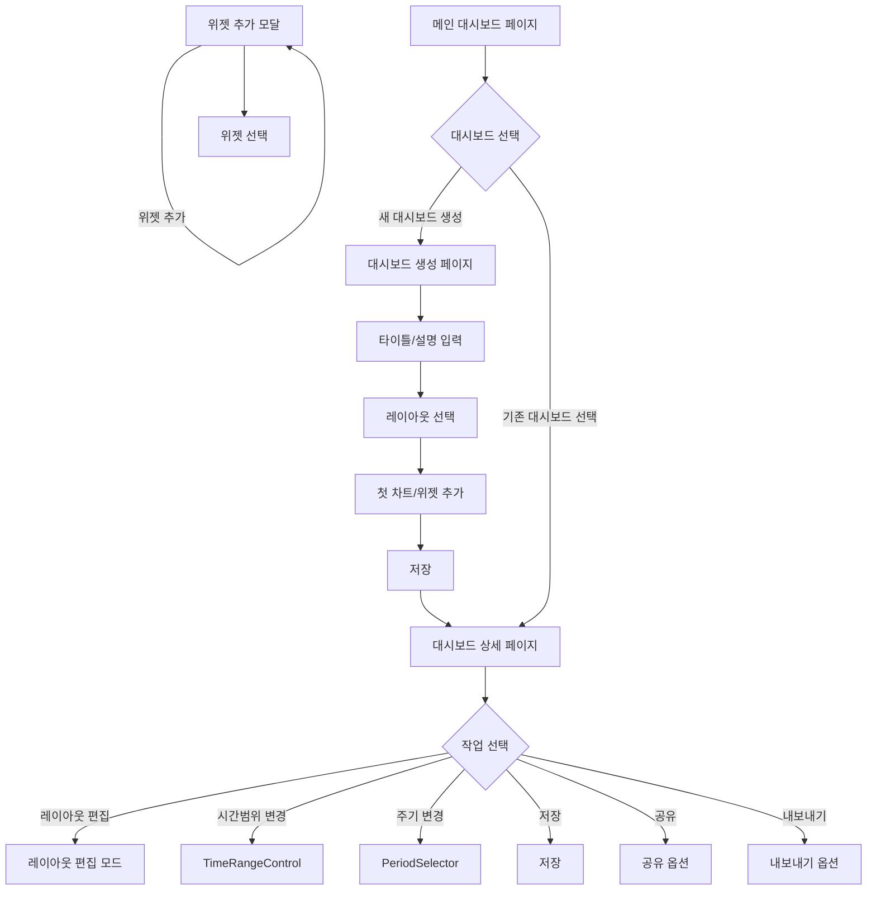

# E-Torch: 경제지표 대시보드 서비스 기획서

## 1. 서비스 개요

**서비스명**: E-Torch (eTorch, etorch)

- **의미**: 경제에 횃불을 더해 길을 밝혀준다는 의미
- **비전**: 복잡한 경제 데이터를 누구나 쉽게 이해하고 활용할 수 있도록 시각화

**서비스 목적**:

- 📊 **데이터 통합 자동화**: KOSIS, ECOS, OECD 등에서 제공하는 API 개발자 친화적 형태로 제공
- 🎯 **중장기 투자 분석 도구**: 거시경제 관점에서 중장기 투자 방향 설정을 위한 경제지표 시각화 및 인사이트 도출  
- 🔧 **수작업 자동화**: 기존 분석가들이 수행하던 데이터 수집→정리→시각화 과정의 완전 자동화

**핵심 차별화 포인트**:

- **시장 최초**: 국내 경제지표(KOSIS, ECOS, OECD)를 통합 시각화하는 플랫폼 부재
- **Pain Point 해결**: PDF/한글문서 수동 파싱 → 엑셀 정리 → 차트 생성의 번거로운 과정 자동화
- **개발자 친화적**: API 형태의 구조화된 데이터 제공으로 추가 활용 가능

**서비스 운영 전략**:

- **점진적 확장**: 작은 인프라로 무료 서비스 시작 후 사용자 피드백 기반 점진적 기능 확장
- **니치 타겟**: 명확한 타겟층(경제 분석가, 투자자) 대상 고품질 서비스 제공

## 2. 타겟 사용자 분석 및 니즈

### 2.1 사용자 1: 전문 투자자 및 경제 전문가

- **특징**: 경제 데이터 분석 능력이 뛰어나고, 엑셀 등 도구 활용에 익숙함
- **니즈**:
  - 다양한 출처의 데이터를 일괄적으로 확인하고 비교 분석
  - 세부적인 차트 편집과 커스터마이징 기능
  - 트렌드 라인, 기준선 등을 활용한 전문적 분석
  - 데이터 시각화를 통한 강의자료 및 분석자료 생성 (다운로드 시 E-Torch 워터마크 포함)

### 2.2 사용자 2: 일반 투자자 및 경제 관심층

- **특징**: 경제 데이터에 관심은 있으나 전문성이 부족, UI 편의성 중요
- **니즈**:
  - 간편한 대시보드 설정
  - 전문가가 제공하는 인사이트 있는 대시보드 구독
  - 직관적인 경제지표 시각화

### 2.3 타겟 사용자 우선순위

**1단계 (MVP): 전문 투자자 및 경제 전문가 우선 타겟**

- **선정 이유**:
  - 높은 지불 의향과 명확한 ROI 인식
  - 현재 수작업으로 인한 강한 Pain Point 보유
  - 입소문 효과 및 신뢰성 구축에 유리
- **접근 전략**: 증권사 리서치센터, 경제연구소 대상 직접 마케팅

**2단계: 일반 투자자 자연 확장**  

- **확장 방법**: 전문가가 공유한 대시보드를 통한 바이럴 유입
- **전환 전략**: 전문가 인사이트 구독을 통한 점진적 유료 전환

## 3. 핵심 서비스 기능

### 3.1 사용자 관리 시스템

- **SNS 로그인 연동**
  - Google, Naver, Kakao 등 주요 SNS 로그인 지원
  - 사용자 인증 및 악성 사용자 관리
  - 개인정보 최소화(자체 회원가입 미지원)
  - Supabase를 활용한 인증 시스템

- **인증 흐름**
  - 첫 방문 사용자를 위한 온보딩 프로세스
  - 재방문 사용자는 이전 세션 상태 복원

### 3.2 대시보드 시스템

- **대시보드 페이지**: 사용자의 모든 대시보드를 관리하고 탐색할 수 있는 메인 페이지
- **대시보드 상세**: 개별 대시보드를 조회하고 상호작용하는 페이지
- **대시보드 에디터**: 대시보드를 생성하고 편집하는 페이지
- **대시보드 공유**: 다른 사용자와 대시보드를 공유하는 기능

#### 대시보드 에디터 기능

- **레이아웃 관리 (react-grid-layout 활용)**:
  - 드래그 앤 드롭: 위젯을 마우스로 끌어서 위치 변경
  - 크기 조절: 위젯 모서리 드래그로 크기 변경
  - 자동 충돌 방지: 위젯 이동 시 다른 위젯과 겹치지 않도록 자동 재배치
  - 수직 압축: 빈 공간 자동 정리로 깔끔한 레이아웃 유지
  - 그리드 스냅: 드래그 시 그리드 선에 자동 정렬
  - 반응형 레이아웃: 화면 크기별 (lg/md/sm) 독립적인 레이아웃 설정
  - 위젯 고정: 특정 위젯을 고정하여 이동/크기변경 방지 옵션

- **위젯 조작**:
  - 새 위젯 생성 (위젯 에디터로 연결)
  - 기존 위젯 복제 및 삭제
  - 활성 위젯 시각적 표시 (선택 상태)

- **대시보드 설정**:
  - 제목, 설명, 태그 설정
  - 공개/비공개 설정
  - 전역 시간 범위 설정 (모든 위젯에 적용)
  - 데이터 최종 업데이트 시간 표시
  - 페이지 새로고침 시 최신 데이터 자동 조회 (자동 새로고침은 선택사항)

### 3.3 위젯 시스템

- **위젯 에디터**: 차트형 및 텍스트형 위젯을 통합 생성/편집하는 도구
- **차트형 위젯**: Time Series, Bar Chart, Scatter Chart, Radar Chart, Radial Bar Chart 등
- **텍스트형 위젯**: 사용자 정의 텍스트, 데이터 기반 텍스트 표시

#### 위젯 에디터 주요 기능

- **위젯 유형 선택**: 데이터에 적합한 차트 및 텍스트 유형 선택
- **데이터 소스 설정**: 여러 경제지표 데이터 소스 연결
- **시각화 옵션**: 축, 범례, 색상, 그리드 등 시각화 요소 커스터마이징
- **데이터 변환**: 원본값, 변화율, 누적값 등 다양한 데이터 표현 방식
- **미리보기**: 실시간 위젯 미리보기

### 3.4 데이터 소스 및 처리 시스템

- **다중 데이터 소스**: KOSIS, ECOS, OECD 등 다양한 데이터 소스 통합
- **데이터 변환 및 계산**:
  - 원본값 표시 (백엔드 API에서 제공되는 그대로)
  - 프론트엔드 추가 계산: 전년 동기 대비 변화율, 전기 대비 변화율, 이동평균, 누적값 등
  - 기존 제공 지표: 일부 지표는 YoY, QoQ 등이 별도 지표로 제공됨
- **데이터 쿼리**: 직관적인 인터페이스로 데이터 조회 조건 설정

#### 데이터 쿼리 기능

- **소스 선택**: 데이터 출처 선택 (KOSIS, ECOS, OECD)
- **지표 선택**:
  - 지표 목록 표시 (약 40여개)
  - 기본 텍스트 검색 기능
  - 지표명 및 설명 표시
- **시간 범위 선택**: 시작일/종료일 설정 및 프리셋 옵션
- **주기 선택**: 일별, 월별, 분기별, 연간 데이터 선택
- **데이터 변환 선택**: 원본값, 변화율, 이동평균 등 계산 방식 선택
- **데이터 미리보기**: 선택된 조건의 데이터 샘플 및 기본 차트 표시

### 3.5 공유 대시보드 시스템

- **대시보드 둘러보기**: 다른 사용자가 공개한 대시보드 검색 및 조회
- **관심 대시보드 저장**: 관심 있는 대시보드를 개인 컬렉션에 저장하여 빠른 접근
- **대시보드 복사**: 다른 사용자의 대시보드를 내 계정으로 복사하여 수정 가능

#### 대시보드 공유 기능

- **공개 설정**: 대시보드별 공개/비공개 설정
- **링크 공유**: 대시보드 고유 URL을 통한 직접 공유
- **소셜 공유**: 카카오톡, 페이스북, 트위터 등 소셜미디어 공유 버튼
- **임베드 코드**: 외부 웹사이트나 블로그에 대시보드 삽입 가능

#### 대시보드 발견 기능

- **인기 대시보드**: 조회수, 복사수 기준 인기 대시보드 추천
- **카테고리별 분류**: 투자 분야별 대시보드 분류
  - 주식시장 분석
  - 부동산 경제지표
  - 거시경제 동향
  - GDP 및 성장률
  - 물가 및 금리
  - 통화 및 환율
- **최신 대시보드**: 최근 생성된 대시보드 목록
- **추천 대시보드**: 사용자 관심사 기반 맞춤 추천

#### 사용자 상호작용

- **대시보드 평가**: 좋아요/싫어요 또는 별점 평가 시스템
- **댓글 기능**: 대시보드에 대한 의견이나 질문 작성
- **제작자 팔로우**: 관심 있는 대시보드 제작자 팔로우
- **태그 시스템**: 대시보드에 태그 추가로 검색 및 분류 개선

### 3.6 구독 및 결제 시스템

#### 플랜별 서비스 구성

**무료 플랜 (Basic)**

- **제공 지표**: 핵심 경제지표 20개 (KOSPI, CPI, GDP 등 주요 지표)
- **데이터 기간**: 최근 3년간 데이터만 조회 가능
- **대시보드**: 최대 3개까지 생성 가능
- **위젯**: 대시보드당 최대 6개 위젯
- **공유**: 공개 대시보드 조회만 가능 (복사 불가)
- **워터마크**: 대시보드 하단에 "E-Torch로 제작됨" 표시

**유료 플랜 (Pro)**

- **제공 지표**: 전체 경제지표 40여개 이용 가능
- **데이터 기간**: 전체 기간 데이터 조회 가능
- **대시보드**: 무제한 생성
- **위젯**: 무제한 위젯 생성
- **공유**: 대시보드 복사, 임베드 코드 생성 가능
- **다운로드**: 차트 이미지 다운로드 (고해상도)
- **워터마크**: 제거 가능
- **우선 지원**: 이메일 지원 우선 처리

#### 가격 정책

- **무료 플랜**: 0원
- **Pro 월간**: 9,900원/월
- **Pro 연간**: 99,000원/년 (17% 할인)

#### 구독 전환 촉진 전략

- **7일 무료 체험**: Pro 플랜 전체 기능 체험 가능
- **첫 달 50% 할인**: 신규 유료 구독 시 할인 혜택
- **자연스러운 업그레이드 유도**: 무료 플랜 제한 도달 시 Pro 기능 안내

#### 결제 시스템

**토스페이먼츠 통합 연동**

- **카드결제**: 국내외 신용카드, 체크카드
- **계좌이체**: 실시간 계좌이체
- **간편결제**: 카카오페이, 네이버페이, 페이팔, 토스페이
- **빌링**: 정기구독 자동결제 (빌링키 방식)
- **확장성**: 향후 자체 브랜드 페이 확장 가능

**결제 옵션**

- 월간/연간 구독 선택
- 구독 자동 갱신 및 취소 기능
- 결제 실패 시 자동 재시도 및 알림

#### 구독 관리 기능

**개인 계정 설정**

- 프로필 정보 관리
- 알림 설정 (구독 갱신, 결제 실패 등)
- 서비스 이용 약관 및 개인정보 처리방침 동의 관리

**구독 및 결제 관리**

- 현재 구독 상태 확인
- 플랜 업그레이드/다운그레이드
- 구독 취소 및 환불 신청
- 결제 내역 조회 및 영수증 다운로드
- 결제 수단 변경

**사용량 통계**

- 생성한 대시보드 수
- 위젯 사용 현황
- 데이터 조회 통계
- 무료 플랜 제한 사용률 표시

**알림 시스템**

- 구독 갱신 예정 알림 (7일 전)
- 결제 성공/실패 알림
- 무료 플랜 제한 도달 알림
- Pro 플랜 혜택 안내

## 4. 주요 화면 설계

### 4.1 메인 대시보드 화면

#### 레이아웃 구조

**헤더**

- **로고 및 서비스명**: E-Torch 브랜딩
- **통합 검색창**: 내 대시보드, 공개 대시보드, 경제지표 통합 검색
- **구독 상태 표시**: Basic/Pro 배지 및 플랜 정보
- **알림 아이콘**: 구독 갱신, 결제 관련 알림
- **사용자 메뉴**: 프로필, 설정, 로그아웃 드롭다운

**사이드바**

- **내 대시보드**: 개인이 생성한 대시보드 목록
- **대시보드 둘러보기**: 공개된 다른 사용자 대시보드 탐색
- **관심 대시보드**: 저장한 관심 대시보드 목록
- **최근 활동**: 최근 조회/편집한 대시보드
- **설정**: 계정 및 구독 관리

**상호작용 요소**

- **기본 액션**: 카드 클릭 시 대시보드 상세 페이지로 이동
- **편집 버튼**: 연필 아이콘, 호버 시 표시
- **더보기 메뉴**: 3점 메뉴 (복사, 공유, 삭제 옵션)
- **관심 등록**: 별 아이콘 토글

#### 메인 컨텐츠 영역

**페이지 제목 및 요약**

- **"내 대시보드" 타이틀**: 현재 페이지 명확한 표시
- **대시보드 통계**: 총 대시보드 수, 최근 업데이트 정보
- **사용량 표시**: 구독 플랜별 제한 현황 (예: 무료 플랜 3/3개 사용 중)

**액션 바**

- **새 대시보드 생성**: Primary CTA 버튼, 가장 눈에 띄는 위치
- **정렬 옵션**: 최근 수정순, 이름순, 생성일순 드롭다운
- **뷰 타입 변경**: 카드뷰/리스트뷰 토글 버튼
- **필터 옵션**: 공개/비공개 상태, 태그별 필터링

**대시보드 그리드**

- **반응형 레이아웃**:
  - 데스크톱 (1200px+): 3열 그리드
  - 태블릿 (768px-1199px): 2열 그리드  
  - 모바일 (767px 이하): 1열 리스트
- **카드 간격**: 적절한 여백으로 시각적 구분
- **무한 스크롤**: 대시보드 수가 많을 경우 점진적 로딩

#### 대시보드 카드 구성

**시각적 요소**

- **썸네일**: 대시보드 미리보기 이미지 (16:9 비율, 320x180px)
- **상태 표시**: 공개/비공개 아이콘, 색상으로 구분
- **태그**: 컬러칩 형태로 카테고리 표시

**텍스트 정보**

- **타이틀**: 대시보드 제목 (2줄 말줄임 처리)
- **설명**: 간단한 설명 텍스트 (1줄 말줄임 처리)
- **메타데이터**:
  - 최종 수정일 (상대시간: "2일 전", "1주 전")
  - 위젯 수 ("6개 위젯")
  - 조회수 (공개 대시보드의 경우)

**상호작용 요소**

- **기본 액션**: 카드 클릭 시 대시보드 상세 페이지로 이동
- **편집 버튼**: 연필 아이콘, 호버 시 표시
- **더보기 메뉴**: 3점 메뉴 (복사, 공유, 삭제 옵션)
- **관심 등록**: 별 아이콘 토글

#### 상태별 UI 처리

**빈 상태 (Empty State)**

- **일러스트레이션**: 친근한 그래픽으로 시각적 안내
- **안내 메시지**: "첫 번째 대시보드를 만들어보세요"
- **CTA 버튼**: "대시보드 생성하기" 큰 버튼
- **도움말 링크**: "대시보드 만들기 가이드" 링크

**로딩 상태 (Loading State)**

- **스켈레톤 UI**: 카드 형태의 회색 플레이스홀더
- **애니메이션**: 부드러운 펄스 효과
- **개수**: 예상 카드 수만큼 스켈레톤 표시

**에러 상태 (Error State)**

- **에러 메시지**: 사용자 친화적 에러 설명
- **재시도 버튼**: "다시 시도" 버튼 제공  
- **지원 링크**: 문제 지속 시 고객지원 연결

#### 반응형 디자인 고려사항

**데스크톱 (1200px+)**

- 3열 카드 그리드
- 사이드바 고정 표시
- 풀사이즈 검색창

**태블릿 (768px-1199px)**

- 2열 카드 그리드
- 접을 수 있는 사이드바
- 압축된 헤더 레이아웃

**모바일 (767px 이하)**

- 1열 리스트 형태
- 햄버거 메뉴로 사이드바 숨김
- 모바일 최적화된 터치 인터페이스

### 4.2 대시보드 상세 화면

#### 레이아웃 구조

**헤더 영역**

- **대시보드 정보**:
  - 대시보드 제목 (편집 가능한 경우 인라인 편집)
  - 생성자 정보 및 최종 수정일
  - 공개/비공개 상태 표시
  - 태그 목록 (컬러칩 형태)

- **전역 컨트롤**:
  - **시간 범위 선택**: DateRangePicker 컴포넌트
    - 프리셋 옵션: 최근 1년, 3년, 5년, 전체 기간
    - 커스텀 날짜 범위 직접 입력
    - 선택된 범위가 모든 위젯에 자동 적용
  - **새로고침**: 모든 위젯 데이터 동시 업데이트

- **액션 버튼**:
  - **편집 모드**: 소유자만 표시, 편집 페이지로 이동
  - **공유하기**: 링크 복사, 소셜 공유, 임베드 코드 생성
  - **다운로드**: PDF/PNG 형태로 전체 대시보드 내보내기
  - **복사하기**: 내 계정으로 대시보드 복사 (타인 대시보드인 경우)

#### 메인 컨텐츠 영역

**위젯 그리드 (react-grid-layout 기반)**

- **반응형 레이아웃**:
  - 데스크톱 (1200px+): 12 컬럼 그리드 (최소 위젯 크기: 3x2)
  - 태블릿 (768px-1199px): 8 컬럼 그리드 (최소 위젯 크기: 2x2)  
  - 모바일 (767px 이하): 4 컬럼 그리드 (최소 위젯 크기: 4x2, 세로 스택)

- **위젯 렌더링**:
  - 차트형 위젯: 동적 크기 조절 및 반응형 차트
  - 텍스트형 위젯: 폰트 크기 자동 조절
  - 로딩 상태: 스켈레톤 UI로 위젯 영역 표시
  - 에러 상태: 에러 메시지 및 재시도 버튼

- **위젯 인터랙션** (뷰 모드):
  - **확대 보기**: 위젯 클릭 시 모달로 풀사이즈 표시
  - **개별 다운로드**: 위젯 호버 시 다운로드 아이콘 표시
  - **툴팁**: 차트 포인트별 상세 데이터 표시
  - **범례 토글**: 클릭으로 데이터 시리즈 표시/숨김

#### 상태별 UI 처리

**로딩 상태**

- 헤더 정보: 스켈레톤 텍스트
- 위젯 영역: 그리드 구조 유지한 스켈레톤 박스
- 전역 컨트롤: 비활성화 상태

**에러 상태**

- 네트워크 에러: "데이터를 불러올 수 없습니다" + 재시도 버튼
- 권한 에러: "접근 권한이 없습니다" + 로그인 유도
- 404 에러: "존재하지 않는 대시보드입니다" + 홈으로 이동

**빈 대시보드 상태**

- 일러스트레이션과 "위젯이 없습니다" 메시지
- 편집 권한 있는 경우: "위젯 추가하기" CTA 버튼

#### 반응형 디자인 세부사항

**데스크톱 (1200px+)**

- 헤더 높이: 80px
- 위젯 간격: 16px
- 최소 위젯 크기: 300x200px
- 사이드 여백: 24px

**태블릿 (768px-1199px)**

- 헤더 높이: 72px (압축 레이아웃)
- 위젯 간격: 12px
- 최소 위젯 크기: 250x180px
- 사이드 여백: 16px

**모바일 (767px 이하)**

- 헤더 높이: 64px (최소 레이아웃)
- 위젯 간격: 8px
- 위젯 너비: 100% (세로 스택)
- 사이드 여백: 12px

#### 성능 최적화 고려사항

- **가상화**: 20개 이상 위젯 시 react-window로 가상 스크롤
- **지연 로딩**: 뷰포트 밖 위젯은 플레이스홀더로 처리
- **메모이제이션**: 위젯별 React.memo로 불필요한 리렌더링 방지
- **데이터 캐싱**: SWR 캐시로 동일 데이터 중복 요청 방지

### 4.3 차트 에디터 화면

- **상단 제어**: 위젯 유형 선택, 위젯 제목, 기간, 주기 설정
- **미리보기 영역**: 현재 설정의 위젯 미리보기
- **옵션 패널**: 선택된 위젯 유형에 따른 동적 옵션 (패널, 툴팁, 범례, 축, 스타일, 텍스트 등)
- **데이터 소스 패널**: 데이터 출처, 지표, 변환 설정 (차트형 위젯, 데이터 기반 텍스트 표시 유형만 해당)

### 4.4 대시보드 편집 화면

#### 레이아웃 구조

**상단 편집 툴바**

- **좌측 영역**:
  - **위젯 추가**: Primary 버튼, 드롭다운 메뉴
    - "새 차트 위젯 생성" → 위젯 에디터로 이동
    - "새 텍스트 위젯 생성" → 위젯 에디터로 이동
    - "내 위젯에서 추가" → 기존 위젯 라이브러리 모달
    - "위젯 복사하기" → 현재 대시보드 내 위젯 복사
  - **레이아웃 도구**:
    - "자동 정렬": 위젯을 그리드에 맞춰 자동 배치

- **우측 영역**:
  - **편집 상태 표시**: "편집 중..." 텍스트 및 인디케이터
  - **실행취소/재실행**: Ctrl+Z, Ctrl+Y 단축키 지원
  - **저장**: "저장" 버튼 (변경사항 있을 때만 활성화)
  - **취소**: "편집 취소" 버튼 → 확인 모달 후 뷰 모드로 복귀

**메인 편집 영역**

- **그리드 배경**: 위젯 배치를 돕는 격자 가이드 표시
- **편집 가능한 위젯들**: 테두리 표시로 편집 모드임을 시각화
- **선택된 위젯 강조**: 현재 선택된 위젯을 시각적으로 구분
- **크기 조절 핸들**: 선택된 위젯에 크기 조절 도구 표시

**우측 속성 패널** (선택적 표시)

- **위젯 선택 시 표시**:
  - 위젯 기본 정보 (제목, 타입, 크기)
  - 빠른 편집 옵션 (제목 변경, 삭제)
  - "위젯 편집" 버튼 → 위젯 에디터로 이동
  - "위젯 복제" 버튼

- **미선택 시**:
  - 대시보드 전체 설정
  - 제목, 설명, 태그 편집
  - 공개/비공개 설정
  - 레이아웃 옵션 (위젯 간격, 여백 조정)

#### 편집 인터랙션 세부사항

**위젯 선택 및 조작**

- **단일 선택**: 위젯 클릭으로 선택, 다른 영역 클릭으로 해제
- **삭제**: Delete 키 또는 컨텍스트 메뉴에서 개별 삭제

**드래그 앤 드롭**

- **드래그 시작**: 위젯 헤더 영역에서 드래그 가능
- **드래그 중**: 반투명 효과와 함께 실시간 위치 표시
- **스냅 가이드**: 다른 위젯과 정렬될 때 보조선 표시
- **드롭 완료**: 자동으로 그리드에 스냅, 충돌 시 자동 재배치

**크기 조절**

- **리사이즈 핸들**: 우하단 핸들로 크기 조절 (react-grid-layout 기본 제공)
- **최소 크기 제한**: 위젯 타입별 최소 크기 (minW, minH 속성으로 설정)
- **그리드 단위**: 그리드 셀 단위로만 크기 조절 가능
- **실시간 미리보기**: 크기 조절 중 내용 실시간 업데이트

#### 편집 상태 관리

**변경사항 추적**

- **자동저장**: 5초 간격으로 임시저장 (localStorage)
- **변경 표시**: 저장되지 않은 변경사항이 있을 때 "*" 표시
- **실행취소 스택**: 최대 20단계까지 실행취소 지원
- **브라우저 이탈 경고**: 저장하지 않고 페이지 벗어날 때 확인 모달

**편집 완료 플로우**

- **저장 성공**: 성공 토스트 메시지 → 뷰 모드로 자동 전환
- **저장 실패**: 에러 메시지와 함께 편집 모드 유지, 재시도 옵션 제공
- **편집 취소**: 변경사항 있을 시 확인 모달 → 임시저장 삭제 → 뷰 모드로 복귀

#### 반응형 편집 UI

**데스크톱 (1200px+)**

- 툴바 높이: 64px
- 우측 속성 패널: 320px 너비 (토글 가능)
- 편집 영역: 나머지 전체 너비
- 키보드 단축키 모든 기능 지원

**태블릿 (768px-1199px)**

- 툴바 높이: 56px (아이콘 크기 축소)
- 속성 패널: 하단 서랍 형태로 표시
- 터치 인터랙션: 드래그/리사이즈 터치 최적화
- 일부 키보드 단축키 제한

**모바일 (767px 이하)**

- 툴바: 상하 2줄로 분할 배치
- 속성 패널: 풀스크린 모달 형태
- 편집 기능 제한: 드래그만 지원, 리사이즈는 속성 패널에서
- 터치 전용 인터랙션

#### 성능 및 UX 최적화

**편집 성능 최적화**

- **지연 렌더링**: 드래그 중 차트 렌더링 비활성화
- **디바운싱**: 크기 조절 중 차트 업데이트 지연 (300ms)
- **가상화 비활성화**: 편집 모드에서는 모든 위젯 DOM 유지
- **메모리 정리**: 편집 완료 시 임시 상태 및 이벤트 리스너 정리

**사용자 경험 개선**

- **시각적 피드백**: 모든 인터랙션에 즉각적인 시각적 반응
- **에러 방지**: 유효하지 않은 조작 시 사전 차단 및 안내
- **접근성**: 키보드만으로도 모든 편집 기능 수행 가능
- **도움말**: 첫 편집 시 간단한 온보딩 툴팁 제공

## 5. 사용자 흐름

### 5.1 온보딩 및 로그인 흐름


### 5.2 대시보드 관리 흐름



### 5.3 위젯 생성 및 편집 흐름

```
flowchart TD
    A[WidgetEditor 진입] --> B{위젯 유형 선택}
    B -->|TimeSeries| TS[시계열 차트]
    B -->|BarChart| BC[바 차트]
    B -->|ScatterChart| SC[산점도 차트]
    B -->|RadarChart| RC[레이더 차트]
    B -->|RadialBarChart| RB[방사형 바 차트]
    B -->|Text-사용자정의| TX1[텍스트 위젯 (사용자 정의)]
    B -->|Text-데이터기반| TX2[텍스트 위젯 (데이터 기반)]

    TS --> C[DataSourcePanel]
    BC --> C
    SC --> C
    RC --> C
    RB --> C
    
    C --> D[SourceSelector]
    D -->|KOSIS| F1[KOSIS 지표]
    D -->|ECOS| F2[ECOS 지표]
    D -->|OECD| F3[OECD 지표]
    
    F1 --> G[IndicatorSelector]
    F2 --> G
    F3 --> G
    
    G --> H[TransformControls]
    H --> I[ChartPreview]
    
    TX1 --> K[CustomContent 편집]
    TX2 --> L[DataSource 설정]
    L --> M[DataOperation 선택]
    M --> N[TextPreview]
    K --> N
    
    I --> O{차트 OptionsPanel 편집}
    O -->|PanelOptions| P1[타이틀/설명 설정]
    O -->|TooltipOptions| P2[툴팁 설정]
    O -->|LegendOptions| P3[범례 설정]
    O -->|AxisOptions| P4[X/Y축 설정]
    O -->|StyleOptions| P5[스타일 설정]
    
    N --> Q{텍스트 OptionsPanel 편집}
    Q -->|PanelOptions| R1[타이틀/설명 설정]
    Q -->|TextOptions| R2[폰트/정렬/색상 설정]
    Q -->|FormatOptions| R3[숫자 포맷/조건부 서식]
    
    P1 --> S[변경사항 적용]
    P2 --> S
    P3 --> S
    P4 --> S
    P5 --> S
    R1 --> S
    R2 --> S
    R3 --> S
    
    S --> T[위젯 저장]
    T --> U[DashboardGrid에 추가]

```

## 6. UI/UX 설계

### 6.1 디자인 시스템 개요

E-Torch는 일관된 사용자 경험을 위해 체계적인 디자인 시스템을 구축합니다:

- **브랜드 색상**: Primary (#0c1e3e), Secondary (#1a56db), Tertiary (#0284c7)
- **타이포그래피**: Inter (기본 폰트), JetBrains Mono (모노스페이스 폰트)
- **컴포넌트 원칙**: 일관성, 재사용성, 접근성, 반응형 디자인
- **색상 체계**: OKLCH 색상 공간을 활용한 다크/라이트 모드 지원

### 6.2 접근성 설계

- **키보드 내비게이션**: 모든 기능을 키보드로 사용 가능하도록 설계
- **스크린 리더 지원**: 차트 데이터를 스크린 리더가 인식할 수 있는 대체 텍스트 제공
- **색상 및 대비**: WCAG 2.1 AA 수준 준수, 색상에만 의존하지 않는 정보 전달
- **반응형 디자인**: 모든 디바이스에서 최적의 경험 제공

## 7. 데이터 관리 계획

### 7.1 우선 제공 경제지표

- KOSIS, ECOS 지표 중심 제공(요구사항에 명시된 지표 목록)
- 주요 지표 카테고리:
  - 종합경기지수(동행지수, 선행지수)
  - 주가지수(KOSPI)
  - 물가지수(CPI)
  - GDP 관련 지표
  - 금리 관련 지표
  - 통화량 지표
  - 환율 지표

### 7.2 데이터 업데이트 주기

- 일간 데이터: 매일 1회 업데이트(장 마감 후)
- 월간 데이터: 해당 기관 발표 후 자동 업데이트
- 분기/연간 데이터: 발표 직후 업데이트
- 수동 데이터: 관리자 페이지를 통한 수동 입력 지원

### 7.3 데이터 품질 관리

- 출처별 데이터 무결성 검증
- 데이터 업데이트 히스토리 관리
- 수동 입력 데이터 검증 절차

### 7.4 데이터 변환 및 처리 파이프라인

- 결측치 처리 알고리즘 (선형 보간법, 이전/이후 값 복제 등)
- 주기 변환 (일간→월간→분기→연간) 및 동기화
- LTTB(Largest-Triangle-Three-Buckets) 다운샘플링으로 대량 데이터 최적화
- 데이터 캐싱 전략으로 성능 최적화

## 8. 서비스 차별화 전략

### 8.1 전문가 인사이트 제공

- 경제 전문가들의 분석 템플릿 제공
- 전문가가 제작한 대시보드 구독 서비스
- 차트 내 전문가 수준의 트렌드 분석 도구

### 8.2 통합 데이터 플랫폼

- 다양한 출처의 경제지표를 한 곳에서 제공
- 동일 지표에 대한 출처별 비교 분석
- 지표 간 상관관계 분석 도구

### 8.3 커스터마이징 유연성

- 사용자 수준별 UI 최적화
- 전문가용 고급 편집 기능
- 일반 사용자용 템플릿 기반 간편 설정

## 9. 개발 및 출시 계획

### 9.1 개발 일정

#### MVP 출시 (2025-06-20 완료 예정)

- **기획**: 완료
- **설계**: 완료
- **백엔드 개발**: 모킹 서버 및 데이터 마이그레이션 초기단계 완료, API 기능 확장 및 안정화 진행 중
- **프론트엔드 개발**: 진행 중
- **통합 테스트**: 예정

### 9.2 출시 전략

- MVP 출시 후 지속적 업데이트 방식 채택
- 초기 핵심 기능 위주로 개발 후 출시
- 사용자 피드백 기반 기능 개선 및 추가

## 10. 기술적 고려사항

### 10.1 기술 스택

- **프레임워크**: React 19, Next.js 15
- **모노레포**: Turborepo, pnpm
- **상태 관리**: Zustand 5, TanStack Query 5
- **UI 프레임워크**: Shadcn/UI, Tailwind CSS 4
- **차트 시각화**: Recharts 2.15.3+
- **폼 관리**: React Hook Form 7, Zod 3
- **타입 관리**: TypeScript 5.5+
- **테스트**: Vitest, Testing Library, Playwright
- **인증**: Supabase Auth

### 10.2 아키텍처 설계 원칙

- **모듈성**: 기능별 독립적 패키지화
- **확장성**: 새 차트 유형, 데이터 소스 쉽게 추가 가능
- **재사용성**: 공통 컴포넌트 추출
- **성능**: 대량 데이터 처리 최적화
- **접근성**: WCAG 표준 준수
- **서버/클라이언트 분리**: Next.js App Router 아키텍처 활용

### 10.3 패키지 구조

```

e-torch/
├── apps/                # 애플리케이션
│   ├── web/            # 웹 애플리케이션
│   └── storybook/      # 컴포넌트 문서화
│
└── packages/            # 공유 패키지
    ├── eslint-config/  # ESLint 설정
    ├── core/           # 타입, 상수, 인터페이스
    ├── ui/             # UI 컴포넌트
    ├── widgets/        # 위젯 컴포넌트 (차트형/텍스트형 통합)
    ├── charts/         # 차트 전용 렌더링 엔진
    ├── dashboard/      # 대시보드 컴포넌트
    ├── data-sources/   # 데이터 소스 연동
    ├── state/          # 상태 관리
    ├── utils/          # 유틸리티 함수
    └── server-api/     # API 경로 및 서버 액션

```

### 10.4 성능 최적화 전략

- 서버 컴포넌트를 활용한 초기 로딩 성능 최적화
- 데이터 다운샘플링을 통한 대량 데이터 처리 최적화
- 메모이제이션 및 선택적 렌더링으로 UI 반응성 개선
- 코드 분할 및 지연 로딩으로 초기 번들 크기 최소화
- 다층적 캐싱 전략으로 네트워크 요청 최소화

## 11. 마케팅 및 사용자 확보 전략

### 11.1 사용자 여정 맵

#### 전문가(1차 타겟) 사용자 여정

**인지 단계**

- 현재 작업 방식의 비효율성 인식 (PDF 파싱, 수동 데이터 정리)
- 지인 추천이나 타겟 마케팅을 통한 서비스 노출
- 서비스 랜딩페이지 방문 및 기능 확인

**관심 단계**  

- 핵심 기능(데이터 자동화, 차트 커스터마이징) 살펴보기
- 무료 체험 신청 및 계정 생성

**경험 단계**

- 첫 대시보드 생성 및 데이터 자동 파싱 체험
- 기존 수작업 대비 시간 절약 효과 체감 (Wow Moment)
- 동료와 완성된 대시보드 공유

**정착 단계**

- 업무 효율성 개선 인식 후 유료 플랜 전환
- 일상 업무 루틴에 서비스 통합
- 동종 업계 동료에게 서비스 추천

#### 일반 투자자(2차 타겟) 사용자 여정

**인지 단계**

- 전문가가 공유한 대시보드 링크 접근
- "이 차트는 어디서 만든 것인가?" 호기심 발생

**관심 단계**

- 더 많은 콘텐츠 확인을 위한 회원가입  
- 관심 있는 전문가 대시보드 구독

**경험 단계**

- 템플릿을 활용한 개인 대시보드 간단 제작
- 투자 의사결정 과정에서 경제지표 참고 활용

**정착 단계**

- 정기적인 대시보드 확인이 투자 루틴으로 정착
- 유용한 대시보드를 지인에게 공유

#### 사용자 여정 성공 지표

| 단계 | 전문가 목표 | 일반투자자 목표 | 측정 방법 |
|------|------------|----------------|-----------|
| 인지→관심 | 랜딩페이지 3분+ 체류 | 공유링크 클릭 후 가입률 30% | Google Analytics |
| 관심→경험 | 7일 내 첫 대시보드 완성 | 7일 내 대시보드 3개+ 조회 | 사용자 행동 추적 |
| 경험→정착 | 30일 내 유료 전환률 40% | 30일 MAU 유지율 60% | 결제/재방문 데이터 |
| 정착→추천 | 분기당 추천 1명 이상 | 월 1회 이상 공유 액션 | 레퍼럴 추적 시스템 |

### 11.2 초기 사용자 확보

- **전문가 대상 무료 체험 프로그램**
  - 증권사 리서치센터 대상 1개월 무료 체험 제공
  - 경제연구소 및 대학 경제학과 교수진 타겟 마케팅
  - 경제/금융 관련 유튜버 및 인플루언서와의 협업 콘텐츠 제작

### 11.3 마케팅 채널

- **블로그 포스팅**
  - 경제지표 분석 방법론 및 인사이트 콘텐츠 제작
  - SEO 최적화를 통한 자연 유입 확보
  
- **SNS 유료 광고**
  - 토스, 페이스북, 인스타그램, 구글 애드워즈 등
  - 경제/투자 관심사 기반 타겟팅
  
- **경제/금융 커뮤니티 타겟 마케팅**
  - 네이버 카페, 디시인사이드 주식 갤러리 등
  - 유용한 분석 자료 공유를 통한 자연스러운 브랜드 노출

### 11.4 브랜딩 전략

- **"경제 데이터의 길잡이" 포지셔닝**
  - 복잡한 경제지표를 누구나 쉽게 이해할 수 있도록 돕는 서비스
  - 전문성과 접근성을 동시에 강조하는 브랜드 메시지

- **전문성과 접근성 균형**
  - 전문가용 고급 기능과 일반인용 간편 기능의 조화
  - 신뢰할 수 있는 데이터 소스 기반의 분석 도구임을 강조

- **워터마크 콘텐츠 확산 전략**
  - 다운로드되는 모든 차트에 E-Torch 워터마크 포함
  - 공유되는 콘텐츠를 통한 자연스러운 브랜드 인지도 확산
  
## 12. 위험 요소 및 대응 방안

### 12.1 데이터 소스 안정성

- **위험**: 외부 데이터 소스(KOSIS, ECOS 등)의 API 변경 또는 서비스 중단
- **대응**:
  - 서비스 중단 시 사용자에게 명확한 알림 제공
  - 복구 시간 예측 정보 공유
  - 대체 데이터 확보 가능한 경우 대체 정보 제공

### 12.2 성능 관리

- **위험**: 대량 데이터 처리 시 성능 저하
- **대응**:
  - 점진적 로딩 전략 구현
  - 데이터 샘플링 및 집계 기법 활용
  - 캐싱 최적화 및 CDN 활용

### 12.3 사용자 확보 전략

- **위험**: 초기 사용자 유입 부족
- **대응**:
  - 전문가 타겟 무료 체험 제공
  - 워터마크가 포함된 콘텐츠 공유를 통한 간접 마케팅
  - 경제/금융 관련 커뮤니티 및 플랫폼 협업

## 부록: 제공 경제지표 상세 목록

### KOSIS 지표코드

| 지표코드 | 지표명 | 기간 |
|---------|-------|-----|
| CCI | 동행지수 순환변동치 | M |
| CLI | 선행지수 순환변동치 | M |
| LCI | 선행종합지수 | M |
| KOSPI | 코스피 지수 | M |
| CPI_CR_YoY | 월별 소비자 물가 등락률 전년동월비(%) | M |
| KOSPI_MARKET_CAP | 코스피 시가총액 | M |
| RGDP_QoQ_SA | 경제성장률(GDP)(실질, 계절조정, 전기비) | Q |
| RGDP_YoY_V | 경제성장률(GDP)(실질, 원계열, 전년동기비) | Q |
| GDPD_CR_YoY_V | GDP 디플레이터 등락률(원계열, 전년동기비) | Q |
| NGDP_KRW | 국내총생산(GDP)(명목, 원화표시)(십억원) | A |
| NGDP_USD | 국내총생산(GDP)(명목, 달러표시)(억달러) | A |
| GDP_RGR | 경제성장률(실질성장률)(%) | A |
| GDPD_B2015 | GDP 디플레이터(2015=100) | A |
| GDPD_B2015_CR | GDP 디플레이터(2015=100) 등락률(%) | A |

### ECOS 지표코드

| 지표코드 | 지표명 | 기간 |
|---------|-------|-----|
| Bond_Yield_1yr | 시장금리 국고채 (1년) | D,M,Q,A |
| Bond_Yield_3yr | 시장금리 국고채 (3년) | D,M,Q,A |
| Bond_Yield_10yr | 시장금리 국고채 (10년) | D,M,Q,A |
| C_Bond_Yield_AA_MINUS | 회사채수익률 (AA-) | D,M,Q,A |
| BOK_RATE | 한국은행 기준금리 | M,D |
| NGDP_SA | 국내총생산(GDP)(계절조정, 명목) | Q |
| RGDP_SA | 국내총생산(GDP)(계절조정, 실질) | Q |
| NGDP_V | 국내총생산(GDP)(원계열, 명목) | Q |
| RDGP_V | 국내총생산(GDP)(원계열, 실질) | Q |
| GDPD_B2015 | GDP 디플레이터 (2015=100) | Q |
| RGDP_QoQ_SA | 경제성장률(GDP)(실질, 계절조정, 전기비) | Q |
| RGDP_YoY_V | 경제성장률(GDP)(실질, 원계열, 전년동기비) | Q |
| GDPD_CR_YoY_V | GDP 디플레이터 등락률(원계열, 전년동기비) | Q |
| GDPD_B2015 | GDP 디플레이터(2015=100) | A |
| GDPD_B2015_CR | GDP 디플레이터(2015=100) 등락률(%) | A |
| NGDP_KRW | 국내총생산(GDP)(명목, 원화표시)(십억원) | A |
| NGDP_USD | 국내총생산(GDP)(명목, 달러표시)(억달러) | A |
| GDP_RGR | 경제성장률(실질성장률)(%) | A |
| KRW_USD_D | 원/미국달러(매매기준율)(일별) | D |
| KRW_CNY_D | 원/위안(매매기준율)(일별) | D |
| KRW_JPY_D | 원/일본엔(100엔)(일별) | D |
| KRW_USD_M | 원/미국달러(매매기준율)(월별) | M |
| KRW_CNY_M | 원/위안(매매기준율)(월별) | M |
| KRW_JPY_M | 원/일본엔(100엔)(월별) | M |
| CrudeOil | 원유-WTI | M |
| IRLT | 장기금리(IRLT) | M |
| IR3TIP | 단기금리(IR3TIP) | M |
| M2_AVG_V | M2(평잔, 원계열) | M |
| CURRENCY | 현금통화(단기부동자금) | M |
| DEMAND_DEPOSITS | 요구불예금(단기부동자금) | M |
| SAVINGS_ACCOUNT_DEPOSITS | 수시입출식저축성예금(단기부동자금) | M |
| MMF | MMF(단기부동자금) | M |
| NCD | 양도서예금증서(단기부동자금) | M |
| CMA | CMA(단기부동자금) | M |
| REPO | 환매조건부채권매도(단기부동자금) | M |
| Lf | Lf | M |

### 코드 약어 설명

| 특징 | 줄임말 | 의미 |
|------|------|------|
| 전년 대비 | YoY | Year-over-Year |
| 월별 대비 | MoM | Month-over-Month |
| 분기별 대비 | QoQ | Quarter-over-Quarter |
| 일별 대비 | DoD | Day-over-Day |
| 주별 대비 | WoW | Week-over-Week |
| 특정 요일 대비 | YoY DoW | Year-over-Year Day-of-Week-over-Day-of-Week |
| 원계열 | V | - |
| 계절조정 | SA | Seasonally Adjusted |
| 명목GDP | NGDP | - |
| 실질GDP | RGDP | - |
