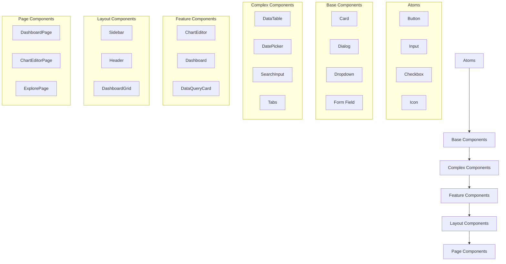
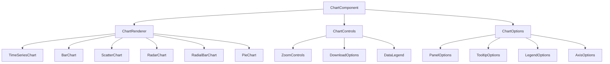
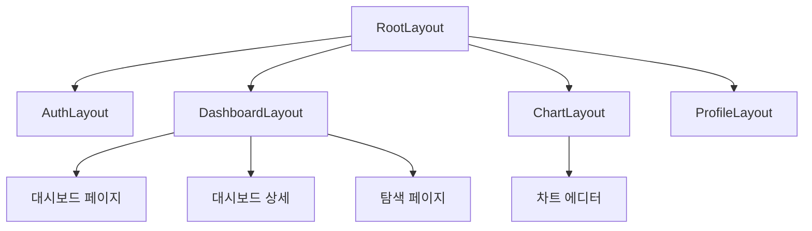
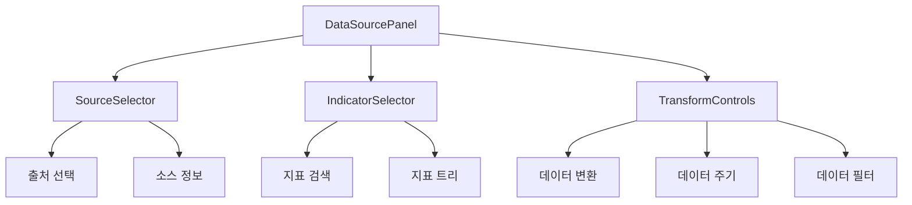
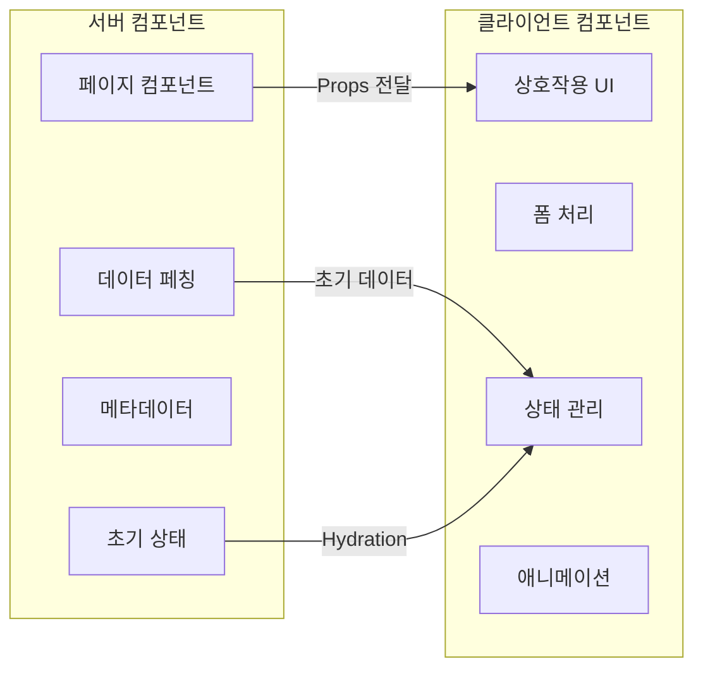

# E-Torch 디자인 시스템

## 목차

1. [개요](#1-개요)
2. [디자인 원칙](#2-디자인-원칙)
3. [색상 체계](#3-색상-체계)
4. [타이포그래피](#4-타이포그래피)
5. [컴포넌트 시스템](#5-컴포넌트-시스템)
   - [5.1 컴포넌트 계층 구조](#51-컴포넌트-계층-구조)
   - [5.2 기본 컴포넌트 (버튼)](#52-기본-컴포넌트-버튼)
   - [5.3 카드 & 폼 컴포넌트](#53-카드--폼-컴포넌트)
   - [5.4 차트 컴포넌트](#54-차트-컴포넌트)
   - [5.5 대시보드 컴포넌트](#55-대시보드-컴포넌트)
6. [패턴 및 레이아웃](#6-패턴-및-레이아웃)
7. [접근성](#7-접근성)
8. [테마 및 다크모드](#8-테마-및-다크모드)
9. [컴포넌트 구현 가이드라인](#9-컴포넌트-구현-가이드라인)
10. [버전 관리 및 문서화](#10-버전-관리-및-문서화)

## 1. 개요

E-Torch 디자인 시스템은 경제지표 대시보드 서비스의 일관되고 효율적인 사용자 경험을 제공하기 위해 설계되었습니다. 본 시스템은 Shadcn/UI와 Tailwind CSS를 기반으로 하며, 복잡한 경제 데이터를 직관적으로 시각화하는데 중점을 둡니다.

### 1.1 목적

- 일관된 사용자 경험 제공
- 개발 효율성 향상
- 컴포넌트 재사용성 극대화
- 접근성 및 사용성 최적화
- 데이터 시각화를 위한 특화된 UI 요소 제공

### 1.2 기술 스택

- **UI 프레임워크**: Shadcn/UI + Tailwind CSS 4
- **차트 라이브러리**: Recharts
- **아이콘**: Lucide React
- **폰트**: Inter (UI), JetBrains Mono (데이터/코드)

## 2. 디자인 원칙

E-Torch의 디자인 원칙은 데이터 중심 애플리케이션의 특성을 고려하여 다음과 같이 설정합니다:

### 2.1 명확성(Clarity)
복잡한 경제 데이터를 명확하게 전달하는 것이 최우선입니다. 불필요한 시각적 요소를 최소화하고 데이터에 집중합니다.

### 2.2 일관성(Consistency)
시각적 언어와 상호작용 패턴은 전체 애플리케이션에서 일관되게 적용됩니다.

### 2.3 효율성(Efficiency)
사용자가 최소한의 단계로 원하는 정보를 찾고 분석할 수 있도록 설계합니다.

### 2.4 적응성(Adaptability)
전문가와 일반 사용자 모두에게 적합한 유연한 인터페이스를 제공합니다.

### 2.5 신뢰성(Reliability)
데이터 표현의 정확성과 일관성을 보장하여 사용자의 신뢰를 구축합니다.

## 3. 색상 체계

E-Torch 색상 체계는 데이터 시각화에 최적화된 팔레트를 제공하며, 사용성과 접근성을 고려합니다.


### 3.1 브랜드 색상

| 이름 | 값 | 용도 |
|------|------|------|
| Primary | `#0c1e3e` | 주요 강조, 헤더, 주 버튼 |
| Secondary | `#1a56db` | 보조 강조, 호버 상태, 부 버튼 |
| Tertiary | `#0284c7` | 추가 강조, 링크, 특수 요소 |

### 3.2 중립 색상

| 이름 | 값 | 용도 |
|------|------|------|
| Background | `#ffffff` | 페이지 배경 |
| Surface | `#f8fafc` | 카드, 모달 배경 |
| Surface Alt | `#f1f5f9` | 대체 표면, 셀렉션 |
| Border | `#e2e8f0` | 경계선, 구분선 |
| Text Primary | `#0f172a` | 주요 텍스트 |
| Text Secondary | `#334155` | 보조 텍스트 |

### 3.3 액센트 색상

| 이름 | 값 | 용도 |
|------|------|------|
| Success | `#059669` | 긍정적 값, 증가 |
| Warning | `#d97706` | 주의 필요, 경고 |
| Danger | `#dc2626` | 오류, 부정적 값, 감소 |
| Info | `#2563eb` | 정보성 메시지 |
| Highlight | `#7c3aed` | 특별 강조 |

### 3.4 차트 색상

데이터 시각화를 위한 구분 가능한 색상 세트:

```javascript
const chartColors = [
  '#1b3a6b', // 진한 파랑
  '#1c7ed6', // 밝은 파랑
  '#12b886', // 녹색
  '#9775fa', // 보라
  '#fd7e14', // 주황
  '#40c057', // 라임
  '#e64980', // 분홍
];
```

이 색상들은 데이터 시리즈를 구분하기 위한 기본 팔레트로, 시각적으로 명확히 구분되며 색맹 사용자도 인지할 수 있도록 설계되었습니다.

### 3.5 Tailwind CSS 구성

```javascript
// tailwind.config.js
module.exports = {
  theme: {
    extend: {
      colors: {
        primary: {
          DEFAULT: '#0c1e3e',
          light: '#15345c',
          dark: '#102a4c',
        },
        secondary: {
          DEFAULT: '#1a56db',
          light: '#2563eb',
          dark: '#1e429f',
        },
        tertiary: '#0284c7',
        success: '#059669',
        warning: '#d97706',
        danger: '#dc2626',
        info: '#2563eb',
        highlight: '#7c3aed',
        surface: {
          DEFAULT: '#f8fafc',
          alt: '#f1f5f9',
        },
        border: '#e2e8f0',
        'text-primary': '#0f172a',
        'text-secondary': '#334155',
        'text-muted': '#64748b',
      },
      // 차트 색상
      chartColors: {
        series1: '#1b3a6b',
        series2: '#1c7ed6',
        series3: '#12b886',
        series4: '#9775fa',
        series5: '#fd7e14',
        series6: '#40c057',
        series7: '#e64980',
      },
    },
  },
};
```

## 4. 타이포그래피

E-Torch는 두 가지 주요 폰트를 사용하여 UI와 데이터 표현에서 명확한 시각적 계층을 생성합니다.


### 4.1 폰트 패밀리

- **기본 폰트**: Inter (UI 요소, 내비게이션, 헤더)
- **모노스페이스 폰트**: JetBrains Mono (데이터, 코드, 수치값)

### 4.2 타입 스케일

| 이름 | 크기 / 라인 높이 | 가중치 | 용도 |
|------|-----------------|--------|------|
| Display | 36px / 1.2 | 700 | 대시보드 제목 |
| H1 | 28px / 1.3 | 700 | 섹션 제목 |
| H2 | 24px / 1.35 | 600 | 위젯 그룹 제목 |
| H3 | 20px / 1.4 | 600 | 위젯 제목 |
| H4 | 18px / 1.45 | 600 | 카드 제목 |
| Body | 16px / 1.5 | 400 | 본문 텍스트 |
| Small | 14px / 1.5 | 400 | 보조 텍스트 |
| XSmall | 12px / 1.5 | 400 | 캡션, 도움말 |
| Code | 14px / 1.6 | 400 | 데이터 테이블, 코드 |
| Data Value | 16px / 1.4 | 600 | 주요 지표값 |

### 4.3 Tailwind CSS 설정

```javascript
// tailwind.config.js
module.exports = {
  theme: {
    extend: {
      fontFamily: {
        sans: ['Inter', 'sans-serif'],
        mono: ['JetBrains Mono', 'monospace'],
      },
      fontSize: {
        'display': ['36px', { lineHeight: '1.2', fontWeight: '700' }],
        'h1': ['28px', { lineHeight: '1.3', fontWeight: '700' }],
        'h2': ['24px', { lineHeight: '1.35', fontWeight: '600' }],
        'h3': ['20px', { lineHeight: '1.4', fontWeight: '600' }],
        'h4': ['18px', { lineHeight: '1.45', fontWeight: '600' }],
        'body': ['16px', { lineHeight: '1.5', fontWeight: '400' }],
        'small': ['14px', { lineHeight: '1.5', fontWeight: '400' }],
        'xsmall': ['12px', { lineHeight: '1.5', fontWeight: '400' }],
        'code': ['14px', { lineHeight: '1.6', fontWeight: '400' }],
        'data': ['16px', { lineHeight: '1.4', fontWeight: '600' }],
      },
    },
  },
};
```

### 4.4 사용 가이드라인

- 타이포그래피 계층을 일관되게 유지하여 정보 구조를 명확히 합니다.
- 데이터 값은 항상 JetBrains Mono를 사용하여 가독성을 높입니다.
- 대시보드 위젯 내 타이틀에는 H3(20px) 이상 크기를 사용하지 않습니다.
- 금융 수치에는 Data Value 스타일을 사용합니다.

## 5. 컴포넌트 시스템

E-Torch 컴포넌트 시스템은 계층적 구조로 설계되어 있으며, 기본적인 UI 요소부터 복잡한 데이터 시각화 컴포넌트까지 포함합니다.

### 5.1 컴포넌트 계층 구조



### 5.2 기본 컴포넌트 (버튼)


#### 5.2.1 버튼 타입 정의

```typescript
// Button 타입 정의 (buttons.ts)
export type ButtonVariant = 'primary' | 'secondary' | 'outline' | 'ghost' | 'destructive';
export type ButtonSize = 'sm' | 'md' | 'lg' | 'icon';
```

**버튼 변형**
- **Primary**: 주요 액션, 강조된 CTA
- **Secondary**: 보조 액션
- **Outline**: 경계선만 있는 버튼
- **Ghost**: 배경 없는 텍스트 버튼
- **Destructive**: 삭제 등 위험한 액션

**버튼 크기**
- **sm**: 작은 버튼 (패딩: x-3 y-1.5, 폰트: small)
- **md**: 기본 버튼 (패딩: x-4 y-2, 폰트: body)
- **lg**: 큰 버튼 (패딩: x-6 y-3, 폰트: h4)
- **icon**: 아이콘 전용 (패딩: p-2, 정사각형)

**버튼 상태**
- Default: 기본 상태
- Hover: 마우스 오버 시
- Active: 클릭 시
- Disabled: 비활성화 상태
- Loading: 로딩 중 상태

**버튼 그룹**
주기 선택 등 관련 버튼 그룹화에 사용됩니다.

### 5.3 카드 & 폼 컴포넌트


#### 5.3.1 카드 컴포넌트

```typescript
// Card 타입 정의 (cards.ts)
export type CardVariant = 'default' | 'bordered' | 'elevated';
```

**카드 변형**
- **Default**: 기본 카드 (배경색, 약간의 그림자)
- **Bordered**: 테두리가 있는 카드
- **Elevated**: 더 강한 그림자 효과의 카드

**카드 컴포넌트 구성**
- **Card**: 카드 컨테이너
- **CardHeader**: 제목과 설명을 포함하는 헤더 영역
- **CardTitle**: 카드 제목 (H3, H4 스타일)
- **CardDescription**: 카드 설명 (Small 스타일)
- **CardContent**: 주요 콘텐츠 영역
- **CardFooter**: 액션 버튼 등의 하단 영역

#### 5.3.2 폼 컴포넌트

**입력 필드 (Input)**

```typescript
// Input 타입 정의 (inputs.ts)
export type InputSize = 'sm' | 'md' | 'lg';
export type InputVariant = 'default' | 'filled' | 'error';
```

**체크박스 & 토글**
상태 전환 및 옵션 선택에 사용됩니다.

**날짜 선택 컴포넌트**
기간 설정 및 데이터 필터링에 활용됩니다.

### 5.4 차트 컴포넌트


#### 5.4.1 차트 유형

```typescript
// ChartType 타입 정의 (charts.ts)
export type ChartType = 
  | 'timeSeries' 
  | 'bar' 
  | 'scatter' 
  | 'radar' 
  | 'radialBar'
  | 'pie';
```

각 차트 유형은 특정 데이터 표현에 최적화되어 있습니다:

- **timeSeries**: 시간에 따른 데이터 변화 (예: GDP 추이)
- **bar**: 범주별 값 비교 (예: 국가별 경제성장률)
- **scatter**: 두 변수 간의 관계 (예: 물가상승률과 금리의 관계)
- **radar**: 다차원 데이터 비교 (예: 국가 경제지표 종합평가)
- **radialBar**: 진행 상태 또는 목표 대비 달성률
- **pie**: 부분-전체 관계 (예: GDP 구성 비율)

#### 5.4.2 차트 컴포넌트 계층



### 5.5 대시보드 컴포넌트


#### 5.5.1 그리드 레이아웃

react-grid-layout 기반의 대시보드 그리드 시스템:

```typescript
// DashboardGrid 타입 정의 (dashboard.ts)
export interface DashboardGridProps {
  items: DashboardItem[];
  layout: Layout[];
  isEditable?: boolean;
  onLayoutChange?: (layout: Layout[]) => void;
  onItemRemove?: (itemId: string) => void;
}

export interface DashboardItem {
  id: string;
  type: 'chart' | 'text' | 'kpi';
  config: ChartConfig | TextConfig | KpiConfig;
}
```

#### 5.5.2 대시보드 위젯

```typescript
// 위젯 타입 정의 (widgets.ts)
export type WidgetType = 'chart' | 'text' | 'kpi';

export interface WidgetContainerProps {
  item: DashboardItem;
  isEditable?: boolean;
  onEdit?: (id: string) => void;
  onRemove?: (id: string) => void;
}
```

위젯 유형:
- **Chart Widget**: 다양한 차트 표시
- **Text Widget**: 마크다운 지원 텍스트 컨텐츠
- **KPI Widget**: 주요 성과 지표 단일 값 표시

## 6. 패턴 및 레이아웃

### 6.1 레이아웃 시스템

E-Torch는 다음 레이아웃 구조를 사용합니다:



#### 6.1.1 기본 레이아웃

```tsx
// 기본 레이아웃 구조
<div className="min-h-screen flex flex-col">
  <Header />
  <div className="flex flex-1">
    <Sidebar />
    <main className="flex-1 p-6 overflow-auto">
      {children}
    </main>
  </div>
</div>
```

#### 6.1.2 그리드 시스템

Tailwind CSS의 그리드 시스템을 활용하여 반응형 레이아웃을 구성합니다:

```tsx
<div className="grid grid-cols-1 md:grid-cols-2 lg:grid-cols-3 gap-4">
  {/* 위젯 아이템 */}
</div>
```

### 6.2 반응형 디자인

E-Torch는 다음 브레이크포인트에 맞게 최적화됩니다:

| 이름 | 브레이크포인트 | 타겟 디바이스 |
|-----|--------------|-------------|
| sm | 640px | 모바일 (가로 모드) |
| md | 768px | 태블릿 |
| lg | 1024px | 작은 노트북 |
| xl | 1280px | 대형 노트북 |
| 2xl | 1536px | 데스크톱 |

```scss
// 반응형 전략 예시
.dashboard-grid {
  grid-template-columns: 1fr;
  
  @screen md {
    grid-template-columns: repeat(2, 1fr);
  }
  
  @screen lg {
    grid-template-columns: repeat(3, 1fr);
  }
  
  @screen xl {
    grid-template-columns: repeat(4, 1fr);
  }
}
```

### 6.3 공통 UI 패턴

#### 6.3.1 데이터 소스 패널



#### 6.3.2 시간 범위 컨트롤

```tsx
<div className="flex items-center space-x-4">
  <div className="flex items-center space-x-2">
    <Select
      options={[
        { label: '최근 30일', value: '30d' },
        { label: '최근 90일', value: '90d' },
        { label: '최근 1년', value: '1y' },
        { label: '최근 3년', value: '3y' },
        { label: '사용자 정의', value: 'custom' },
      ]}
      value={timeRange}
      onChange={handleTimeRangeChange}
    />
    
    {timeRange === 'custom' && (
      <DateRangePicker
        startDate={startDate}
        endDate={endDate}
        onChange={handleDateRangeChange}
      />
    )}
  </div>
  
  <Select
    options={[
      { label: '일간(D)', value: 'D' },
      { label: '월간(M)', value: 'M' },
      { label: '분기(Q)', value: 'Q' },
      { label: '연간(A)', value: 'A' },
    ]}
    value={period}
    onChange={handlePeriodChange}
  />
</div>
```

## 7. 접근성

E-Torch는 WCAG 2.1 AA 수준의 접근성을 목표로 합니다.

### 7.1 색상 접근성

- 모든 텍스트는 배경과 4.5:1 이상의 대비를 유지합니다.
- 색상만으로 정보를 구분하지 않고, 항상 추가적인 시각적 단서를 제공합니다.
- 모든 차트 색상은 색맹 사용자를 고려하여 선택되었습니다.

### 7.2 키보드 내비게이션

- 모든 인터랙티브 요소는 키보드로 접근 가능합니다.
- 포커스 상태는 명확하게 표시됩니다.
- 논리적인 탭 순서를 유지합니다.

### 7.3 스크린 리더 지원

```tsx
// 스크린 리더 지원 예시
<button 
  aria-label="차트 데이터 다운로드"
  aria-describedby="download-tooltip"
>
  <DownloadIcon />
</button>
<div id="download-tooltip" className="sr-only">
  현재 차트의 데이터를 CSV 형식으로 다운로드합니다
</div>
```

### 7.4 접근성 컴포넌트

```typescript
// 접근성 관련 컴포넌트
export const SkipLink = () => (
  <a 
    href="#main-content" 
    className="sr-only focus:not-sr-only focus:absolute focus:z-50 focus:p-4 focus:bg-white"
  >
    메인 콘텐츠로 건너뛰기
  </a>
);

export const ScreenReaderOnly = ({ children }: { children: React.ReactNode }) => (
  <span className="sr-only">{children}</span>
);
```

## 8. 테마 및 다크모드

E-Torch는 테마 시스템을 통해 라이트 모드와 다크 모드를 지원합니다.

### 8.1 테마 설정

```typescript
// 테마 설정 (themes.ts)
export type Theme = 'light' | 'dark' | 'system';

export interface ThemeProviderProps {
  children: React.ReactNode;
  defaultTheme?: Theme;
  storageKey?: string;
}

export const ThemeProvider = ({
  children,
  defaultTheme = 'system',
  storageKey = 'etorch-theme',
  ...props
}: ThemeProviderProps) => {
  // 테마 구현...
};
```

### 8.2 다크모드 색상 변수

```css
:root {
  /* 라이트 모드 변수 */
  --background: 0 0% 100%;
  --foreground: 222.2 47.4% 11.2%;
  --primary: 221 83% 15%;
  /* 기타 변수... */
}

.dark {
  /* 다크 모드 변수 */
  --background: 222.2 84% 4.9%;
  --foreground: 210 40% 98%;
  --primary: 217.2 91.2% 59.8%;
  /* 기타 변수... */
}
```

### 8.3 테마 전환

```tsx
// ThemeSwitcher 컴포넌트
export const ThemeSwitcher = () => {
  const { theme, setTheme } = useTheme();
  
  return (
    <Select
      value={theme}
      onValueChange={(value: Theme) => setTheme(value)}
      options={[
        { value: 'light', label: '라이트 모드' },
        { value: 'dark', label: '다크 모드' },
        { value: 'system', label: '시스템 설정' },
      ]}
    />
  );
};
```

## 9. 컴포넌트 구현 가이드라인

### 9.1 서버/클라이언트 컴포넌트 분리 전략

E-Torch는 Next.js의 서버/클라이언트 컴포넌트 아키텍처를 활용합니다:



#### 9.1.1 서버 컴포넌트 래퍼

Shadcn/UI 클라이언트 컴포넌트를 서버 환경에서 사용하기 위한 래퍼 패턴:

```tsx
// server-wrappers/button.server.tsx
import { Button } from '@/components/ui/button';

export interface ButtonServerProps {
  children: React.ReactNode;
  variant?: 'default' | 'destructive' | 'outline' | 'secondary' | 'ghost' | 'link';
  size?: 'default' | 'sm' | 'lg' | 'icon';
  className?: string;
}

export function ButtonServer({ 
  children, 
  variant = 'default',
  size = 'default',
  className 
}: ButtonServerProps) {
  return (
    <Button variant={variant} size={size} className={className}>
      {children}
    </Button>
  );
}
```

### 9.2 컴포넌트 네이밍 규칙

- PascalCase로 컴포넌트 이름 작성
- 파일명은 컴포넌트 이름과 동일하게 작성
- 서버 컴포넌트는 파일명 끝에 `.server` 추가
- 클라이언트 컴포넌트는 파일 맨 위에 `'use client'` 지시어 추가

```
components/
├── ui/               # 기본 UI 컴포넌트 (클라이언트)
├── server-wrappers/  # 서버 컴포넌트 래퍼
├── charts/           # 차트 관련 컴포넌트
├── dashboard/        # 대시보드 관련 컴포넌트
└── forms/            # 폼 관련 컴포넌트
```

### 9.3 컴포넌트 문서화

모든 컴포넌트는 TypeScript 프로젝트에 최적화된 TSDoc을 통해 문서화합니다:

```tsx
/**
 * 경제 데이터 시각화를 위한 시계열 차트 컴포넌트
 * 
 * @param props - 컴포넌트 속성
 * @param props.data - 시각화할 시계열 데이터 배열
 * @param props.xKey - X축에 사용할 데이터 필드명
 * @param props.yKey - Y축에 사용할 데이터 필드명
 * @param props.color - 차트 색상 (기본값: chartColors.series1)
 * @param props.height - 차트 높이 (기본값: 300px)
 * @param props.showGrid - 그리드 표시 여부
 * 
 * @example
 * ```tsx
 * <TimeSeriesChart
 *   data={gdpData}
 *   xKey="date"
 *   yKey="value"
 *   color="chartColors.series2"
 *   height={400}
 *   showGrid={true}
 * />
 * ```
 * 
 * @returns 렌더링된 시계열 차트 컴포넌트
 */
export const TimeSeriesChart = ({
  data,
  xKey,
  yKey,
  color = 'chartColors.series1',
  height = 300,
  showGrid = true,
}: TimeSeriesChartProps): JSX.Element => {
  // 컴포넌트 구현...
};

/**
 * 시계열 차트 컴포넌트 속성 타입
 */
export interface TimeSeriesChartProps {
  /** 시각화할 시계열 데이터 배열 */
  data: Array<Record<string, unknown>>;
  /** X축에 사용할 데이터 필드명 */
  xKey: string;
  /** Y축에 사용할 데이터 필드명 */
  yKey: string;
  /** 차트 색상 (기본값: chartColors.series1) */
  color?: string;
  /** 차트 높이 (기본값: 300px) */
  height?: number;
  /** 그리드 표시 여부 */
  showGrid?: boolean;
}
```

## 10. 버전 관리 및 문서화

### 10.1 버전 관리 체계

E-Torch 디자인 시스템은 시맨틱 버저닝을 따릅니다:

- **Major (X.0.0)**: 호환성이 깨지는 큰 변경
- **Minor (0.X.0)**: 기능 추가, 호환성 유지
- **Patch (0.0.X)**: 버그 수정, 사소한 변경

### 10.2 변경 기록 문서화

변경사항은 `CHANGELOG.md` 파일에 다음 형식으로 기록합니다:

```markdown
# 변경 기록

## [1.1.0] - 2025-05-20
### 추가
- 레이더 차트 컴포넌트 추가
- 다크모드 테마 지원 추가

### 변경
- 버튼 컴포넌트 스타일 개선
- 차트 색상 팔레트 접근성 향상

### 수정
- 모바일 디바이스에서 대시보드 그리드 레이아웃 문제 수정
```

### 10.3 디자인 시스템 문서 사이트

Storybook을 활용한 문서 사이트 구성:

```tsx
// Button.stories.tsx
import type { Meta, StoryObj } from '@storybook/react';
import { Button } from './Button';

const meta: Meta<typeof Button> = {
  title: 'UI/Button',
  component: Button,
  parameters: {
    layout: 'centered',
  },
  tags: ['autodocs'],
  argTypes: {
    variant: {
      control: 'select',
      options: ['primary', 'secondary', 'outline', 'ghost', 'destructive'],
    },
    size: {
      control: 'select',
      options: ['sm', 'md', 'lg', 'icon'],
    },
  },
};

export default meta;
type Story = StoryObj<typeof Button>;

export const Primary: Story = {
  args: {
    variant: 'primary',
    children: '버튼',
  },
};

export const Secondary: Story = {
  args: {
    variant: 'secondary',
    children: '버튼',
  },
};

// 기타 변형들...
```

---

이 디자인 시스템은 E-Torch 경제지표 대시보드 서비스의 개발 효율성과 일관된 사용자 경험을 제공하기 위한 기반입니다. Shadcn/UI 및 Tailwind CSS와의 통합을 통해 고품질의 UI 컴포넌트를 구축하며, 특히 데이터 시각화와 대시보드 기능에 최적화되어 있습니다.

> **참고:** 이 디자인 시스템은 디자이너의 부재로 인해 1인 개발 프로세스에서 AI를 활용하여 SVG로 작성되었습니다. AI와 SVG의 기술적 한계로 인해 실제 구현된 서비스의 디자인은 여기에 제시된 것과 일부 차이가 있을 수 있습니다. 실제 개발 과정에서는 Shadcn/UI와 Tailwind CSS를 활용하여 여기에 정의된 디자인 원칙과 가이드라인을 충실히 따르면서 더 세련된 UI를 구현할 것입니다.
