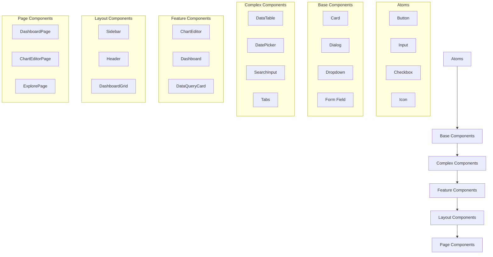
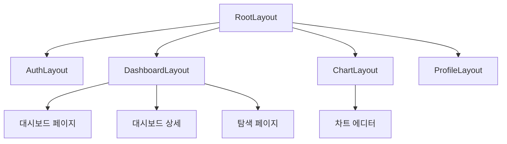

# E-Torch 디자인 시스템

## 목차

1. [개요](#1-개요)
2. [디자인 원칙](#2-디자인-원칙)
3. [CSS 아키텍처](#3-css-아키텍처)
4. [색상 체계](#4-색상-체계)
5. [타이포그래피](#5-타이포그래피)
6. [컴포넌트 시스템](#6-컴포넌트-시스템)
   - [6.1 컴포넌트 계층 구조](#61-컴포넌트-계층-구조)
   - [6.2 기본 컴포넌트](#62-기본-컴포넌트)
   - [6.3 복합 컴포넌트](#63-복합-컴포넌트)
   - [6.4 차트 컴포넌트](#64-차트-컴포넌트)
   - [6.5 대시보드 컴포넌트](#65-대시보드-컴포넌트)
   - [6.6 서버 컴포넌트 래퍼](#66-서버-컴포넌트-래퍼)
7. [패턴 및 레이아웃](#7-패턴-및-레이아웃)
8. [접근성](#8-접근성)
9. [테마 및 다크모드](#9-테마-및-다크모드)
10. [구현 파일 구조](#10-구현-파일-구조)
11. [버전 관리 및 문서화](#11-버전-관리-및-문서화)

## 1. 개요

E-Torch 디자인 시스템은 경제지표 대시보드 서비스의 일관되고 효율적인 사용자 경험을 제공하기 위해 설계되었습니다. 본 시스템은 Tailwind CSS v4와 Shadcn/UI를 기반으로 하며, 복잡한 경제 데이터를 직관적으로 시각화하는데 중점을 둡니다.

### 1.1 목적

- 일관된 사용자 경험 제공
- 개발 효율성 향상
- 컴포넌트 재사용성 극대화
- 접근성 및 사용성 최적화
- 데이터 시각화를 위한 특화된 UI 요소 제공

### 1.2 기술 스택

- **CSS 프레임워크**: Tailwind CSS 4
- **UI 컴포넌트 라이브러리**: Shadcn/UI
- **차트 라이브러리**: Recharts
- **아이콘**: Lucide React
- **폰트**: Inter (UI), JetBrains Mono (데이터/코드)
- **테마**: next-themes
- **유틸리티**: class-variance-authority, clsx, tailwind-merge

## 2. 디자인 원칙

E-Torch의 디자인 원칙은 데이터 중심 애플리케이션의 특성을 고려하여 다음과 같이 설정합니다:

### 2.1 명확성(Clarity)

복잡한 경제 데이터를 명확하게 전달하는 것이 최우선입니다. 불필요한 시각적 요소를 최소화하고 데이터에 집중합니다.

### 2.2 일관성(Consistency)

시각적 언어와 상호작용 패턴은 전체 애플리케이션에서 일관되게 적용됩니다.

### 2.3 효율성(Efficiency)

사용자가 최소한의 단계로 원하는 정보를 찾고 분석할 수 있도록 설계합니다.

### 2.4 적응성(Adaptability)

전문가와 일반 사용자 모두에게 적합한 유연한 인터페이스를 제공합니다.

### 2.5 신뢰성(Reliability)

데이터 표현의 정확성과 일관성을 보장하여 사용자의 신뢰를 구축합니다.

## 3. CSS 아키텍처

E-Torch는 Tailwind CSS v4를 사용하여 CSS 아키텍처를 구축합니다. 모노레포 구조에서 CSS 관리는 다음과 같이 구성됩니다.

### 3.1 글로벌 CSS 파일

```css
/* packages/ui/src/styles/globals.css */
@import "tailwindcss";

@plugin "tailwindcss-animate";

@custom-variant dark (&:is(.dark *));

@theme {
  --font-sans: var(--font-geist-sans);
  --font-mono: var(--font-geist-mono);
}

:root {
  /* E-Torch 브랜드 색상 */
  --primary: hsl(221 83% 15%); /* #0c1e3e */
  --primary-foreground: hsl(210 40% 98%);
  --secondary: hsl(217 83% 45%); /* #1a56db */
  --secondary-foreground: hsl(210 40% 98%);
  --tertiary: hsl(200 97% 39%); /* #0284c7 */
  --tertiary-foreground: hsl(210 40% 98%);
  
  /* 기본 색상 */
  --background: hsl(0 0% 100%);
  --foreground: hsl(222.2 84% 4.9%);
  --card: hsl(0 0% 100%);
  --card-foreground: hsl(222.2 84% 4.9%);
  --popover: hsl(0 0% 100%);
  --popover-foreground: hsl(222.2 84% 4.9%);
  --muted: hsl(210 40% 96.1%);
  --muted-foreground: hsl(215.4 16.3% 46.9%);
  --accent: hsl(210 40% 96.1%);
  --accent-foreground: hsl(222.2 47.4% 11.2%);
  --destructive: hsl(0 84.2% 60.2%);
  --destructive-foreground: hsl(210 40% 98%);
  --border: hsl(214.3 31.8% 91.4%);
  --input: hsl(214.3 31.8% 91.4%);
  --ring: hsl(222.2 84% 4.9%);
  
  /* 상태 색상 */
  --success: hsl(158 64% 31%); /* #059669 */
  --success-foreground: hsl(210 40% 98%);
  --warning: hsl(35 92% 43%); /* #d97706 */
  --warning-foreground: hsl(210 40% 98%);
  --info: hsl(217 91% 53%); /* #2563eb */
  --info-foreground: hsl(210 40% 98%);
  --highlight: hsl(259 90% 58%); /* #7c3aed */
  --highlight-foreground: hsl(210 40% 98%);
  
  /* 차트 색상 */
  --chart-1: hsl(216 60% 49%); /* #1b3a6b */
  --chart-2: hsl(209 83% 47%); /* #1c7ed6 */
  --chart-3: hsl(164 80% 39%); /* #12b886 */
  --chart-4: hsl(258 94% 78%); /* #9775fa */
  --chart-5: hsl(27 98% 54%); /* #fd7e14 */
  --chart-6: hsl(142 52% 50%); /* #40c057 */
  --chart-7: hsl(339 84% 58%); /* #e64980 */
  
  /* 반경 */
  --radius: 0.6rem;
  --radius-sm: calc(var(--radius) - 4px);
  --radius-md: calc(var(--radius) - 2px);
  --radius-lg: var(--radius);
  --radius-xl: calc(var(--radius) + 4px);
  --radius-2xl: calc(var(--radius) + 8px);
}

.dark {
  --primary: hsl(217.2 91.2% 59.8%); /* #4173e0 라이트 모드 primary의 밝은 버전 */
  --primary-foreground: hsl(222.2 47.4% 11.2%);
  --secondary: hsl(210 40% 98%); /* #f8fafc */
  --secondary-foreground: hsl(222.2 47.4% 11.2%);
  --tertiary: hsl(199 89% 48%); /* #0ea5e9 라이트 모드 tertiary의 밝은 버전 */
  --tertiary-foreground: hsl(222.2 47.4% 11.2%);
  
  --background: hsl(222.2 84% 4.9%);
  --foreground: hsl(210 40% 98%);
  --card: hsl(222.2 84% 4.9%);
  --card-foreground: hsl(210 40% 98%);
  --popover: hsl(222.2 84% 4.9%);
  --popover-foreground: hsl(210 40% 98%);
  --muted: hsl(217.2 32.6% 17.5%);
  --muted-foreground: hsl(215 20.2% 65.1%);
  --accent: hsl(217.2 32.6% 17.5%);
  --accent-foreground: hsl(210 40% 98%);
  --destructive: hsl(0 62.8% 30.6%);
  --destructive-foreground: hsl(210 40% 98%);
  --border: hsl(217.2 32.6% 17.5%);
  --input: hsl(217.2 32.6% 17.5%);
  --ring: hsl(212.7 26.8% 83.9%);
  
  /* 상태 색상 - 다크 모드 */
  --success: hsl(158 64% 45%); /* #10b981 */
  --success-foreground: hsl(222.2 47.4% 11.2%);
  --warning: hsl(35 92% 58%); /* #f59e0b */
  --warning-foreground: hsl(222.2 47.4% 11.2%);
  --info: hsl(217 91% 68%); /* #60a5fa */
  --info-foreground: hsl(222.2 47.4% 11.2%);
  --highlight: hsl(259 90% 73%); /* #a78bfa */
  --highlight-foreground: hsl(222.2 47.4% 11.2%);
  
  /* 차트 색상 - 다크 모드 */
  --chart-1: hsl(220 70% 50%); /* #2f5df8 */
  --chart-2: hsl(160 60% 45%); /* #2dcca7 */
  --chart-3: hsl(30 80% 55%); /* #f2a45c */
  --chart-4: hsl(280 65% 60%); /* #b44bf7 */
  --chart-5: hsl(340 75% 55%); /* #f44980 */
  --chart-6: hsl(120 45% 55%); /* #4ed168 */
  --chart-7: hsl(180 60% 50%); /* #26c0c0 */
}

@theme inline {
  --color-primary: var(--primary);
  --color-primary-foreground: var(--primary-foreground);
  --color-secondary: var(--secondary);
  --color-secondary-foreground: var(--secondary-foreground);
  --color-tertiary: var(--tertiary);
  --color-tertiary-foreground: var(--tertiary-foreground);
  --color-background: var(--background);
  --color-foreground: var(--foreground);
  --color-card: var(--card);
  --color-card-foreground: var(--card-foreground);
  --color-popover: var(--popover);
  --color-popover-foreground: var(--popover-foreground);
  --color-muted: var(--muted);
  --color-muted-foreground: var(--muted-foreground);
  --color-accent: var(--accent);
  --color-accent-foreground: var(--accent-foreground);
  --color-destructive: var(--destructive);
  --color-destructive-foreground: var(--destructive-foreground);
  --color-border: var(--border);
  --color-input: var(--input);
  --color-ring: var(--ring);
  --color-success: var(--success);
  --color-success-foreground: var(--success-foreground);
  --color-warning: var(--warning);
  --color-warning-foreground: var(--warning-foreground);
  --color-info: var(--info);
  --color-info-foreground: var(--info-foreground);
  --color-highlight: var(--highlight);
  --color-highlight-foreground: var(--highlight-foreground);
  --color-chart-1: var(--chart-1);
  --color-chart-2: var(--chart-2);
  --color-chart-3: var(--chart-3);
  --color-chart-4: var(--chart-4);
  --color-chart-5: var(--chart-5);
  --color-chart-6: var(--chart-6);
  --color-chart-7: var(--chart-7);
}

@layer base {
  * {
    @apply border-border outline-ring/50;
  }

  body {
    @apply bg-background text-foreground;
    font-feature-settings: "rlig" 1, "calt" 1;
  }
  
  /* 기본 폰트 설정 */
  h1, h2, h3, h4, h5, h6 {
    @apply font-sans font-semibold;
  }
  
  /* 모노스페이스 데이터 표현 */
  .data-value, .data-table, code, pre {
    @apply font-mono;
  }
  
  /* 글꼴 크기 계층 */
  h1 {
    @apply text-3xl leading-tight;
  }
  h2 {
    @apply text-2xl leading-tight;
  }
  h3 {
    @apply text-xl leading-snug;
  }
  h4 {
    @apply text-lg leading-snug;
  }
  .data-value {
    @apply text-base font-semibold leading-tight;
  }
}

/* 컨테이너 유틸리티 */
@utility container {
  margin-inline: auto;
  padding-inline: 2rem;
  max-width: 80rem;
}

/* 그리드 레이아웃 유틸리티 */
@utility dashboard-grid {
  display: grid;
  grid-template-columns: repeat(auto-fill, minmax(300px, 1fr));
  gap: 1rem;
}

/* 차트 컨테이너 유틸리티 */
@utility chart-container {
  width: 100%;
  height: 100%;
  min-height: 300px;
  position: relative;
}

/* 데이터 테이블 유틸리티 */
@utility data-table {
  width: 100%;
  border-collapse: separate;
  border-spacing: 0;
}

/* 정규화된 데이터 값 스타일 */
@utility data-normalized {
  font-family: var(--font-mono);
  font-feature-settings: "tnum";
  font-variant-numeric: tabular-nums;
}

/* 접근성 유틸리티 */
@utility sr-only {
  position: absolute;
  width: 1px;
  height: 1px;
  padding: 0;
  margin: -1px;
  overflow: hidden;
  clip: rect(0, 0, 0, 0);
  white-space: nowrap;
  border-width: 0;
}

/* 포커스 가능한 요소에 대한 접근성 아웃라인 */
@utility focus-visible-ring {
  @apply ring-2 ring-ring ring-offset-2 outline-none focus-visible:ring-2 focus-visible:ring-primary focus-visible:ring-offset-2;
}
```

### 3.2 컴포넌트별 CSS

차트나 특수 컴포넌트에 대한 추가 스타일은 각 컴포넌트 파일에 직접 포함됩니다. Tailwind CSS v4의 `@apply` 지시어를 활용하여 일관된 스타일을 적용합니다.

```css
/* 예: packages/ui/src/components/ui/chart/time-series-chart.css */
.time-series-chart {
  @apply w-full h-full min-h-[250px] p-4 rounded-lg bg-card text-card-foreground;
}

.time-series-chart__tooltip {
  @apply p-2 rounded-md bg-popover text-popover-foreground border border-border shadow-md;
}

.time-series-chart__tooltip-label {
  @apply text-sm font-semibold mb-1;
}

.time-series-chart__tooltip-value {
  @apply text-sm data-normalized font-medium;
}
```

## 4. 색상 체계

E-Torch 색상 체계는 데이터 시각화에 최적화된 팔레트를 제공하며, 사용성과 접근성을 고려합니다.

### 4.1 브랜드 색상

| 이름 | 값 | CSS 변수 | 용도 |
|------|------|---------|------|
| Primary | `#0c1e3e` | `--primary` | 주요 강조, 헤더, 주 버튼 |
| Secondary | `#1a56db` | `--secondary` | 보조 강조, 호버 상태, 부 버튼 |
| Tertiary | `#0284c7` | `--tertiary` | 추가 강조, 링크, 특수 요소 |

### 4.2 중립 색상

| 이름 | 값 | CSS 변수 | 용도 |
|------|------|---------|------|
| Background | `#ffffff` | `--background` | 페이지 배경 |
| Surface | `#f8fafc` | `--card` | 카드, 모달 배경 |
| Surface Alt | `#f1f5f9` | `--accent` | 대체 표면, 셀렉션 |
| Border | `#e2e8f0` | `--border` | 경계선, 구분선 |
| Text Primary | `#0f172a` | `--foreground` | 주요 텍스트 |
| Text Secondary | `#334155` | `--muted-foreground` | 보조 텍스트 |

### 4.3 상태 색상

| 이름 | 값 | CSS 변수 | 용도 |
|------|------|---------|------|
| Success | `#059669` | `--success` | 긍정적 값, 증가 |
| Warning | `#d97706` | `--warning` | 주의 필요, 경고 |
| Danger | `#dc2626` | `--destructive` | 오류, 부정적 값, 감소 |
| Info | `#2563eb` | `--info` | 정보성 메시지 |
| Highlight | `#7c3aed` | `--highlight` | 특별 강조 |

### 4.4 차트 색상

데이터 시각화를 위한 구분 가능한 색상 세트:

| 이름 | 값 | CSS 변수 | 용도 |
|------|------|---------|------|
| Chart 1 | `#1b3a6b` | `--chart-1` | 주요 시리즈 |
| Chart 2 | `#1c7ed6` | `--chart-2` | 보조 시리즈 |
| Chart 3 | `#12b886` | `--chart-3` | 추가 시리즈 1 |
| Chart 4 | `#9775fa` | `--chart-4` | 추가 시리즈 2 |
| Chart 5 | `#fd7e14` | `--chart-5` | 추가 시리즈 3 |
| Chart 6 | `#40c057` | `--chart-6` | 추가 시리즈 4 |
| Chart 7 | `#e64980` | `--chart-7` | 추가 시리즈 5 |

이 색상들은 데이터 시리즈를 구분하기 위한 기본 팔레트로, 시각적으로 명확히 구분되며 색맹 사용자도 인지할 수 있도록 설계되었습니다.

## 5. 타이포그래피

E-Torch는 두 가지 주요 폰트를 사용하여 UI와 데이터 표현에서 명확한 시각적 계층을 생성합니다.

### 5.1 폰트 패밀리

- **기본 폰트**: Inter (UI 요소, 내비게이션, 헤더)
- **모노스페이스 폰트**: JetBrains Mono (데이터, 코드, 수치값)

### 5.2 타입 스케일

| 이름 | 크기 / 라인 높이 | 가중치 | CSS 클래스 | 용도 |
|------|-----------------|--------|-----------|------|
| Display | 36px / 1.2 | 700 | `text-4xl font-bold leading-tight` | 대시보드 제목 |
| H1 | 28px / 1.3 | 700 | `text-3xl font-bold leading-tight` | 섹션 제목 |
| H2 | 24px / 1.35 | 600 | `text-2xl font-semibold leading-tight` | 위젯 그룹 제목 |
| H3 | 20px / 1.4 | 600 | `text-xl font-semibold leading-snug` | 위젯 제목 |
| H4 | 18px / 1.45 | 600 | `text-lg font-semibold leading-snug` | 카드 제목 |
| Body | 16px / 1.5 | 400 | `text-base font-normal leading-normal` | 본문 텍스트 |
| Small | 14px / 1.5 | 400 | `text-sm font-normal leading-normal` | 보조 텍스트 |
| XSmall | 12px / 1.5 | 400 | `text-xs font-normal leading-normal` | 캡션, 도움말 |
| Code | 14px / 1.6 | 400 | `text-sm font-mono leading-relaxed` | 데이터 테이블, 코드 |
| Data Value | 16px / 1.4 | 600 | `text-base font-semibold font-mono leading-tight data-normalized` | 주요 지표값 |

### 5.3 사용 가이드라인

- 타이포그래피 계층을 일관되게 유지하여 정보 구조를 명확히 합니다.
- 데이터 값은 항상 JetBrains Mono를 사용하여 가독성을 높입니다.
- 대시보드 위젯 내 타이틀에는 H3(20px) 이상 크기를 사용하지 않습니다.
- 금융 수치에는 Data Value 스타일을 사용합니다.

## 6. 컴포넌트 시스템

E-Torch 컴포넌트 시스템은 계층적 구조로 설계되어 있으며, 기본적인 UI 요소부터 복잡한 데이터 시각화 컴포넌트까지 포함합니다.

### 6.1 컴포넌트 계층 구조



### 6.2 기본 컴포넌트

#### 6.2.1 버튼 컴포넌트

```tsx
// packages/ui/src/components/ui/button.tsx
import * as React from "react"
import { Slot } from "@radix-ui/react-slot"
import { cva, type VariantProps } from "class-variance-authority"

import { cn } from "@e-torch/ui/lib/utils"

const buttonVariants = cva(
  "inline-flex items-center justify-center whitespace-nowrap rounded-md text-sm font-medium ring-offset-background transition-colors focus-visible:outline-none focus-visible:ring-2 focus-visible:ring-ring focus-visible:ring-offset-2 disabled:pointer-events-none disabled:opacity-50",
  {
    variants: {
      variant: {
        default: "bg-primary text-primary-foreground hover:bg-primary/90",
        destructive: "bg-destructive text-destructive-foreground hover:bg-destructive/90",
        outline: "border border-input bg-background hover:bg-accent hover:text-accent-foreground",
        secondary: "bg-secondary text-secondary-foreground hover:bg-secondary/80",
        ghost: "hover:bg-accent hover:text-accent-foreground",
        link: "text-primary underline-offset-4 hover:underline",
        success: "bg-success text-success-foreground hover:bg-success/90",
        warning: "bg-warning text-warning-foreground hover:bg-warning/90",
        info: "bg-info text-info-foreground hover:bg-info/90",
      },
      size: {
        default: "h-10 px-4 py-2",
        sm: "h-9 rounded-md px-3",
        lg: "h-11 rounded-md px-8",
        icon: "h-10 w-10",
      },
    },
    defaultVariants: {
      variant: "default",
      size: "default",
    },
  }
)

export interface ButtonProps
  extends React.ButtonHTMLAttributes<HTMLButtonElement>,
    VariantProps<typeof buttonVariants> {
  asChild?: boolean
}

const Button = React.forwardRef<HTMLButtonElement, ButtonProps>(
  ({ className, variant, size, asChild = false, ...props }, ref) => {
    const Comp = asChild ? Slot : "button"
    return (
      <Comp
        className={cn(buttonVariants({ variant, size, className }))}
        ref={ref}
        {...props}
      />
    )
  }
)
Button.displayName = "Button"

export { Button, buttonVariants }
```

#### 6.2.2 입력 필드

```tsx
// packages/ui/src/components/ui/input.tsx
import * as React from "react"

import { cn } from "@e-torch/ui/lib/utils"

export interface InputProps
  extends React.InputHTMLAttributes<HTMLInputElement> {}

const Input = React.forwardRef<HTMLInputElement, InputProps>(
  ({ className, type, ...props }, ref) => {
    return (
      <input
        type={type}
        className={cn(
          "flex h-10 w-full rounded-md border border-input bg-background px-3 py-2 text-sm ring-offset-background file:border-0 file:bg-transparent file:text-sm file:font-medium placeholder:text-muted-foreground focus-visible:outline-none focus-visible:ring-2 focus-visible:ring-ring focus-visible:ring-offset-2 disabled:cursor-not-allowed disabled:opacity-50",
          className
        )}
        ref={ref}
        {...props}
      />
    )
  }
)
Input.displayName = "Input"

export { Input }
```

#### 6.2.3 체크박스

```tsx
// packages/ui/src/components/ui/checkbox.tsx
"use client"

import * as React from "react"
import * as CheckboxPrimitive from "@radix-ui/react-checkbox"
import { Check } from "lucide-react"

import { cn } from "@e-torch/ui/lib/utils"

const Checkbox = React.forwardRef
  React.ElementRef<typeof CheckboxPrimitive.Root>,
  React.ComponentPropsWithoutRef<typeof CheckboxPrimitive.Root>
>(({ className, ...props }, ref) => (
  <CheckboxPrimitive.Root
    ref={ref}
    className={cn(
      "peer h-4 w-4 shrink-0 rounded-sm border border-primary ring-offset-background focus-visible:outline-none focus-visible:ring-2 focus-visible:ring-ring focus-visible:ring-offset-2 disabled:cursor-not-allowed disabled:opacity-50 data-[state=checked]:bg-primary data-[state=checked]:text-primary-foreground",
      className
    )}
    {...props}
  >
    <CheckboxPrimitive.Indicator
      className={cn("flex items-center justify-center text-current")}
    >
      <Check className="h-4 w-4" />
    </CheckboxPrimitive.Indicator>
  </CheckboxPrimitive.Root>
))
Checkbox.displayName = CheckboxPrimitive.Root.displayName

export { Checkbox }
```

#### 6.2.4 카드 컴포넌트

```tsx
// packages/ui/src/components/ui/card.tsx
import * as React from "react"

import { cn } from "@e-torch/ui/lib/utils"

const Card = React.forwardRef
  HTMLDivElement,
  React.HTMLAttributes<HTMLDivElement>
>(({ className, ...props }, ref) => (
  <div
    ref={ref}
    className={cn(
      "rounded-lg border bg-card text-card-foreground shadow-sm",
      className
    )}
    {...props}
  />
))
Card.displayName = "Card"

const CardHeader = React.forwardRef
  HTMLDivElement,
  React.HTMLAttributes<HTMLDivElement>
>(({ className, ...props }, ref) => (
  <div
    ref={ref}
    className={cn("flex flex-col space-y-1.5 p-6", className)}
    {...props}
  />
))
CardHeader.displayName = "CardHeader"

const CardTitle = React.forwardRef
  HTMLParagraphElement,
  React.HTMLAttributes<HTMLHeadingElement>
>(({ className, ...props }, ref) => (
  <h3
    ref={ref}
    className={cn(
      "text-xl font-semibold leading-none tracking-tight",
      className
    )}
    {...props}
  />
))
CardTitle.displayName = "CardTitle"

const CardDescription = React.forwardRef
  HTMLParagraphElement,
  React.HTMLAttributes<HTMLParagraphElement>
>(({ className, ...props }, ref) => (
  <p
    ref={ref}
    className={cn("text-sm text-muted-foreground", className)}
    {...props}
  />
))
CardDescription.displayName = "CardDescription"

const CardContent = React.forwardRef
  HTMLDivElement,
  React.HTMLAttributes<HTMLDivElement>
>(({ className, ...props }, ref) => (
  <div ref={ref} className={cn("p-6 pt-0", className)} {...props} />
))
CardContent.displayName = "CardContent"

const CardFooter = React.forwardRef
  HTMLDivElement,
  React.HTMLAttributes<HTMLDivElement>
>(({ className, ...props }, ref) => (
  <div
    ref={ref}
    className={cn("flex items-center p-6 pt-0", className)}
    {...props}
  />
))
CardFooter.displayName = "CardFooter"

export { Card, CardHeader, CardFooter, CardTitle, CardDescription, CardContent }
```

#### 6.2.5 드롭다운 메뉴

```tsx
// packages/ui/src/components/ui/dropdown-menu.tsx
"use client"

import * as React from "react"
import * as DropdownMenuPrimitive from "@radix-ui/react-dropdown-menu"
import { Check, ChevronRight, Circle } from "lucide-react"

import { cn } from "@e-torch/ui/lib/utils"

const DropdownMenu = DropdownMenuPrimitive.Root

const DropdownMenuTrigger = DropdownMenuPrimitive.Trigger

const DropdownMenuGroup = DropdownMenuPrimitive.Group

const DropdownMenuPortal = DropdownMenuPrimitive.Portal

const DropdownMenuSub = DropdownMenuPrimitive.Sub

const DropdownMenuSubTrigger = React.forwardRef
  React.ElementRef<typeof DropdownMenuPrimitive.SubTrigger>,
  React.ComponentPropsWithoutRef<typeof DropdownMenuPrimitive.SubTrigger> & {
    inset?: boolean
  }
>(({ className, inset, children, ...props }, ref) => (
  <DropdownMenuPrimitive.SubTrigger
    ref={ref}
    className={cn(
      "flex cursor-default select-none items-center rounded-sm px-2 py-1.5 text-sm outline-none focus:bg-accent data-[state=open]:bg-accent",
      inset && "pl-8",
      className
    )}
    {...props}
  >
    {children}
    <ChevronRight className="ml-auto h-4 w-4" />
  </DropdownMenuPrimitive.SubTrigger>
))
DropdownMenuSubTrigger.displayName =
  DropdownMenuPrimitive.SubTrigger.displayName

const DropdownMenuSubContent = React.forwardRef
  React.ElementRef<typeof DropdownMenuPrimitive.SubContent>,
  React.ComponentPropsWithoutRef<typeof DropdownMenuPrimitive.SubContent>
>(({ className, ...props }, ref) => (
  <DropdownMenuPrimitive.SubContent
    ref={ref}
    className={cn(
      "z-50 min-w-[8rem] overflow-hidden rounded-md border bg-popover p-1 text-popover-foreground shadow-lg data-[state=open]:animate-in data-[state=closed]:animate-out data-[state=closed]:fade-out-0 data-[state=open]:fade-in-0 data-[state=closed]:zoom-out-95 data-[state=open]:zoom-in-95 data-[side=bottom]:slide-in-from-top-2 data-[side=left]:slide-in-from-right-2 data-[side=right]:slide-in-from-left-2 data-[side=top]:slide-in-from-bottom-2",
      className
    )}
    {...props}
  />
))
DropdownMenuSubContent.displayName =
  DropdownMenuPrimitive.SubContent.displayName

const DropdownMenuContent = React.forwardRef
  React.ElementRef<typeof DropdownMenuPrimitive.Content>,
  React.ComponentPropsWithoutRef<typeof DropdownMenuPrimitive.Content>
>(({ className, sideOffset = 4, ...props }, ref) => (
  <DropdownMenuPrimitive.Portal>
    <DropdownMenuPrimitive.Content
      ref={ref}
      sideOffset={sideOffset}
      className={cn(
        "z-50 min-w-[8rem] overflow-hidden rounded-md border bg-popover p-1 text-popover-foreground shadow-md data-[state=open]:animate-in data-[state=closed]:animate-out data-[state=closed]:fade-out-0 data-[state=open]:fade-in-0 data-[state=closed]:zoom-out-95 data-[state=open]:zoom-in-95 data-[side=bottom]:slide-in-from-top-2 data-[side=left]:slide-in-from-right-2 data-[side=right]:slide-in-from-left-2 data-[side=top]:slide-in-from-bottom-2",
        className
      )}
      {...props}
    />
  </DropdownMenuPrimitive.Portal>
))
DropdownMenuContent.displayName = DropdownMenuPrimitive.Content.displayName

const DropdownMenuItem = React.forwardRef
  React.ElementRef<typeof DropdownMenuPrimitive.Item>,
  React.ComponentPropsWithoutRef<typeof DropdownMenuPrimitive.Item> & {
    inset?: boolean
  }
>(({ className, inset, ...props }, ref) => (
  <DropdownMenuPrimitive.Item
    ref={ref}
    className={cn(
      "relative flex cursor-default select-none items-center rounded-sm px-2 py-1.5 text-sm outline-none transition-colors focus:bg-accent focus:text-accent-foreground data-[disabled]:pointer-events-none data-[disabled]:opacity-50",
      inset && "pl-8",
      className
    )}
    {...props}
  />
))
DropdownMenuItem.displayName = DropdownMenuPrimitive.Item.displayName

const DropdownMenuCheckboxItem = React.forwardRef
  React.ElementRef<typeof DropdownMenuPrimitive.CheckboxItem>,
  React.ComponentPropsWithoutRef<typeof DropdownMenuPrimitive.CheckboxItem>
>(({ className, children, checked, ...props }, ref) => (
  <DropdownMenuPrimitive.CheckboxItem
    ref={ref}
    className={cn(
      "relative flex cursor-default select-none items-center rounded-sm py-1.5 pl-8 pr-2 text-sm outline-none transition-colors focus:bg-accent focus:text-accent-foreground data-[disabled]:pointer-events-none data-[disabled]:opacity-50",
      className
    )}
    checked={checked}
    {...props}
  >
    <span className="absolute left-2 flex h-3.5 w-3.5 items-center justify-center">
      <DropdownMenuPrimitive.ItemIndicator>
        <Check className="h-4 w-4" />
      </DropdownMenuPrimitive.ItemIndicator>
    </span>
    {children}
  </DropdownMenuPrimitive.CheckboxItem>
))
DropdownMenuCheckboxItem.displayName =
  DropdownMenuPrimitive.CheckboxItem.displayName

const DropdownMenuRadioItem = React.forwardRef
  React.ElementRef<typeof DropdownMenuPrimitive.RadioItem>,
  React.ComponentPropsWithoutRef<typeof DropdownMenuPrimitive.RadioItem>
>(({ className, children, ...props }, ref) => (
  <DropdownMenuPrimitive.RadioItem
    ref={ref}
    className={cn(
      "relative flex cursor-default select-none items-center rounded-sm py-1.5 pl-8 pr-2 text-sm outline-none transition-colors focus:bg-accent focus:text-accent-foreground data-[disabled]:pointer-events-none data-[disabled]:opacity-50",
      className
    )}
    {...props}
  >
    <span className="absolute left-2 flex h-3.5 w-3.5 items-center justify-center">
      <DropdownMenuPrimitive.ItemIndicator>
        <Circle className="h-2 w-2 fill-current" />
      </DropdownMenuPrimitive.ItemIndicator>
    </span>
    {children}
  </DropdownMenuPrimitive.RadioItem>
))
DropdownMenuRadioItem.displayName = DropdownMenuPrimitive.RadioItem.displayName

const DropdownMenuLabel = React.forwardRef
  React.ElementRef<typeof DropdownMenuPrimitive.Label>,
  React.ComponentPropsWithoutRef<typeof DropdownMenuPrimitive.Label> & {
    inset?: boolean
  }
>(({ className, inset, ...props }, ref) => (
  <DropdownMenuPrimitive.Label
    ref={ref}
    className={cn(
      "px-2 py-1.5 text-sm font-semibold",
      inset && "pl-8",
      className
    )}
    {...props}
  />
))
DropdownMenuLabel.displayName = DropdownMenuPrimitive.Label.displayName

const DropdownMenuSeparator = React.forwardRef
  React.ElementRef<typeof DropdownMenuPrimitive.Separator>,
  React.ComponentPropsWithoutRef<typeof DropdownMenuPrimitive.Separator>
>(({ className, ...props }, ref) => (
  <DropdownMenuPrimitive.Separator
    ref={ref}
    className={cn("-mx-1 my-1 h-px bg-muted", className)}
    {...props}
  />
))
DropdownMenuSeparator.displayName = DropdownMenuPrimitive.Separator.displayName

const DropdownMenuShortcut = ({
  className,
  ...props
}: React.HTMLAttributes<HTMLSpanElement>) => {
  return (
    <span
      className={cn("ml-auto text-xs tracking-widest opacity-60", className)}
      {...props}
    />
  )
}
DropdownMenuShortcut.displayName = "DropdownMenuShortcut"

export {
  DropdownMenu,
  DropdownMenuTrigger,
  DropdownMenuContent,
  DropdownMenuItem,
  DropdownMenuCheckboxItem,
  DropdownMenuRadioItem,
  DropdownMenuLabel,
  DropdownMenuSeparator,
  DropdownMenuShortcut,
  DropdownMenuGroup,
  DropdownMenuPortal,
  DropdownMenuSub,
  DropdownMenuSubContent,
  DropdownMenuSubTrigger,
}
```

### 6.3 복합 컴포넌트

#### 6.3.1 날짜 선택기

```tsx
// packages/ui/src/components/ui/date-picker.tsx
"use client"

import * as React from "react"
import { format } from "date-fns"
import { Calendar as CalendarIcon } from "lucide-react"

import { cn } from "@e-torch/ui/lib/utils"
import { Button } from "@e-torch/ui/components/ui/button"
import { Calendar } from "@e-torch/ui/components/ui/calendar"
import {
  Popover,
  PopoverContent,
  PopoverTrigger,
} from "@e-torch/ui/components/ui/popover"

export function DatePicker({
  className,
  onSelect,
  selected,
}: {
  className?: string
  onSelect?: (date: Date | undefined) => void
  selected?: Date
}) {
  const [date, setDate] = React.useState<Date | undefined>(selected)

  const handleSelect = (selectedDate: Date | undefined) => {
    setDate(selectedDate)
    onSelect?.(selectedDate)
  }

  return (
    <Popover>
      <PopoverTrigger asChild>
        <Button
          variant={"outline"}
          className={cn(
            "w-[240px] justify-start text-left font-normal",
            !date && "text-muted-foreground",
            className
          )}
        >
          <CalendarIcon className="mr-2 h-4 w-4" />
          {date ? format(date, "PPP") : <span>날짜 선택</span>}
        </Button>
      </PopoverTrigger>
      <PopoverContent className="w-auto p-0" align="start">
        <Calendar
          mode="single"
          selected={date}
          onSelect={handleSelect}
          initialFocus
        />
      </PopoverContent>
    </Popover>
  )
}

export function DateRangePicker({
  className,
  onSelect,
  selected,
}: {
  className?: string
  onSelect?: (range: { from: Date; to: Date } | undefined) => void
  selected?: { from: Date; to: Date }
}) {
  const [date, setDate] = React.useState<{
    from: Date
    to: Date
  } | undefined>(selected)

  const handleSelect = (range: { from: Date; to: Date } | undefined) => {
    setDate(range)
    onSelect?.(range)
  }

  return (
    <div className={cn("grid gap-2", className)}>
      <Popover>
        <PopoverTrigger asChild>
          <Button
            id="date"
            variant={"outline"}
            className={cn(
              "w-[300px] justify-start text-left font-normal",
              !date && "text-muted-foreground"
            )}
          >
            <CalendarIcon className="mr-2 h-4 w-4" />
            {date?.from ? (
              date.to ? (
                <>
                  {format(date.from, "LLL dd, y")} -{" "}
                  {format(date.to, "LLL dd, y")}
                </>
              ) : (
                format(date.from, "LLL dd, y")
              )
            ) : (
              <span>날짜 범위 선택</span>
            )}
          </Button>
        </PopoverTrigger>
        <PopoverContent className="w-auto p-0" align="start">
          <Calendar
            initialFocus
            mode="range"
            defaultMonth={date?.from}
            selected={date}
            onSelect={handleSelect}
            numberOfMonths={2}
          />
        </PopoverContent>
      </Popover>
    </div>
  )
}
```

#### 6.3.2 검색 입력

```tsx
// packages/ui/src/components/ui/search-input.tsx
"use client"

import * as React from "react"
import { Search, X } from "lucide-react"

import { Button } from "@e-torch/ui/components/ui/button"
import { Input } from "@e-torch/ui/components/ui/input"
import { cn } from "@e-torch/ui/lib/utils"

export interface SearchInputProps
  extends Omit<React.InputHTMLAttributes<HTMLInputElement>, "onChange"> {
  onSearch?: (value: string) => void
  onChange?: (value: string) => void
  onClear?: () => void
}

export const SearchInput = React.forwardRef<HTMLInputElement, SearchInputProps>(
  ({ className, onSearch, onChange, onClear, ...props }, ref) => {
    const [value, setValue] = React.useState<string>(props.defaultValue?.toString() || "")

    const handleChange = (e: React.ChangeEvent<HTMLInputElement>) => {
      const newValue = e.target.value
      setValue(newValue)
      onChange?.(newValue)
    }

    const handleKeyDown = (e: React.KeyboardEvent<HTMLInputElement>) => {
      if (e.key === "Enter") {
        onSearch?.(value)
      }
    }

    const handleClear = () => {
      setValue("")
      onChange?.("")
      onClear?.()
    }

    return (
      <div className={cn("relative", className)}>
        <Search className="absolute left-2.5 top-2.5 h-4 w-4 text-muted-foreground" />
        <Input
          ref={ref}
          type="search"
          className="pl-8 pr-10"
          value={value}
          onChange={handleChange}
          onKeyDown={handleKeyDown}
          {...props}
        />
        {value && (
          <Button
            type="button"
            variant="ghost"
            size="icon"
            className="absolute right-0 top-0 h-9 w-9"
            onClick={handleClear}
          >
            <X className="h-4 w-4" />
            <span className="sr-only">Clear</span>
          </Button>
        )}
      </div>
    )
  }
)
SearchInput.displayName = "SearchInput"
```

#### 6.3.3 데이터 테이블

```tsx
// packages/ui/src/components/ui/data-table.tsx
"use client"

import * as React from "react"
import {
  ColumnDef,
  flexRender,
  getCoreRowModel,
  getPaginationRowModel,
  getSortedRowModel,
  SortingState,
  useReactTable,
  VisibilityState,
} from "@tanstack/react-table"

import {
  Table,
  TableBody,
  TableCell,
  TableHead,
  TableHeader,
  TableRow,
} from "@e-torch/ui/components/ui/table"
import {
  DropdownMenu,
  DropdownMenuCheckboxItem,
  DropdownMenuContent,
  DropdownMenuTrigger,
} from "@e-torch/ui/components/ui/dropdown-menu"
import { Button } from "@e-torch/ui/components/ui/button"
import { Input } from "@e-torch/ui/components/ui/input"
import { ScrollArea } from "@e-torch/ui/components/ui/scroll-area"

interface DataTableProps<TData, TValue> {
  columns: ColumnDef<TData, TValue>[]
  data: TData[]
  searchable?: boolean
  searchColumn?: string
  pagination?: boolean
  columnVisibility?: boolean
}

export function DataTable<TData, TValue>({
  columns,
  data,
  searchable = false,
  searchColumn,
  pagination = false,
  columnVisibility = false,
}: DataTableProps<TData, TValue>) {
  const [sorting, setSorting] = React.useState<SortingState>([])
  const [columnVisibilityState, setColumnVisibilityState] = React.useState<VisibilityState>({})
  const [rowSelection, setRowSelection] = React.useState({})
  const [globalFilter, setGlobalFilter] = React.useState("")

  const table = useReactTable({
    data,
    columns,
    getCoreRowModel: getCoreRowModel(),
    getPaginationRowModel: pagination ? getPaginationRowModel() : undefined,
    onSortingChange: setSorting,
    getSortedRowModel: getSortedRowModel(),
    onRowSelectionChange: setRowSelection,
    onColumnVisibilityChange: setColumnVisibilityState,
    state: {
      sorting,
      columnVisibility: columnVisibilityState,
      rowSelection,
      globalFilter,
    },
  })

  return (
    <div className="w-full">
      <div className="flex items-center py-4">
        {searchable && (
          <Input
            placeholder="검색..."
            value={globalFilter}
            onChange={(e) => setGlobalFilter(e.target.value)}
            className="max-w-sm"
          />
        )}
        {columnVisibility && (
          <DropdownMenu>
            <DropdownMenuTrigger asChild>
              <Button variant="outline" className="ml-auto">
                컬럼
              </Button>
            </DropdownMenuTrigger>
            <DropdownMenuContent align="end">
              {table
                .getAllColumns()
                .filter((column) => column.getCanHide())
                .map((column) => {
                  return (
                    <DropdownMenuCheckboxItem
                      key={column.id}
                      className="capitalize"
                      checked={column.getIsVisible()}
                      onCheckedChange={(value) =>
                        column.toggleVisibility(!!value)
                      }
                    >
                      {column.id}
                    </DropdownMenuCheckboxItem>
                  )
                })}
            </DropdownMenuContent>
          </DropdownMenu>
        )}
      </div>
      
      <div className="rounded-md border">
        <ScrollArea>
          <Table>
            <TableHeader>
              {table.getHeaderGroups().map((headerGroup) => (
                <TableRow key={headerGroup.id}>
                  {headerGroup.headers.map((header) => {
                    return (
                      <TableHead key={header.id}>
                        {header.isPlaceholder
                          ? null
                          : flexRender(
                              header.column.columnDef.header,
                              header.getContext()
                            )}
                      </TableHead>
                    )
                  })}
                </TableRow>
              ))}
            </TableHeader>
            <TableBody>
              {table.getRowModel().rows?.length ? (
                table.getRowModel().rows.map((row) => (
                  <TableRow
                    key={row.id}
                    data-state={row.getIsSelected() && "selected"}
                  >
                    {row.getVisibleCells().map((cell) => (
                      <TableCell key={cell.id}>
                        {flexRender(cell.column.columnDef.cell, cell.getContext())}
                      </TableCell>
                    ))}
                  </TableRow>
                ))
              ) : (
                <TableRow>
                  <TableCell colSpan={columns.length} className="h-24 text-center">
                    데이터가 없습니다.
                  </TableCell>
                </TableRow>
              )}
            </TableBody>
          </Table>
        </ScrollArea>
      </div>
      
      {pagination && (
        <div className="flex items-center justify-end space-x-2 py-4">
          <Button
            variant="outline"
            size="sm"
            onClick={() => table.previousPage()}
            disabled={!table.getCanPreviousPage()}
          >
            이전
          </Button>
          <Button
            variant="outline"
            size="sm"
            onClick={() => table.nextPage()}
            disabled={!table.getCanNextPage()}
          >
            다음
          </Button>
        </div>
      )}
    </div>
  )
}
```

### 6.4 차트 컴포넌트

#### 6.4.1 시계열 차트

```tsx
// packages/ui/src/components/chart/time-series-chart.tsx
"use client"

import React, { useMemo } from "react"
import {
  ResponsiveContainer,
  LineChart,
  Line,
  XAxis,
  YAxis,
  CartesianGrid,
  Tooltip,
  Legend,
  ReferenceArea,
  ReferenceLine,
} from "recharts"
import { format } from "date-fns"
import { ko } from "date-fns/locale"
import { cn } from "@e-torch/ui/lib/utils"

export interface TimeSeriesChartProps {
  data: Array<Record<string, any>>
  xAxisKey: string
  series: Array<{
    dataKey: string
    name?: string
    color?: string
    type?: 'line' | 'area' | 'bar'
    yAxisId?: 'left' | 'right'
    strokeWidth?: number
    dot?: boolean | object
    fill?: string
    fillOpacity?: number
  }>
  height?: number | string
  xAxisFormat?: string
  yAxisFormat?: string
  yAxisUnit?: string
  secondaryYAxis?: boolean
  secondaryYAxisUnit?: string
  grid?: boolean
  tooltipFormatter?: (value: any) => string
  className?: string
  referenceLines?: Array<{
    y?: number
    x?: string | number
    label?: string
    stroke?: string
    strokeDasharray?: string
  }>
  referenceAreas?: Array<{
    x1: string | number
    x2: string | number
    y1?: number
    y2?: number
    fill?: string
    fillOpacity?: number
    label?: string
  }>
}

export const TimeSeriesChart: React.FC<TimeSeriesChartProps> = ({
  data,
  xAxisKey,
  series,
  height = 300,
  xAxisFormat = "yyyy-MM-dd",
  yAxisFormat,
  yAxisUnit = "",
  secondaryYAxis = false,
  secondaryYAxisUnit = "",
  grid = true,
  tooltipFormatter,
  className,
  referenceLines = [],
  referenceAreas = [],
}) => {
  const customTooltipFormatter = (value: any) => {
    if (tooltipFormatter) {
      return tooltipFormatter(value)
    }
    
    if (typeof value === "number") {
      return value.toLocaleString() + (yAxisUnit || "")
    }
    
    return value
  }

  const secondaryTooltipFormatter = (value: any) => {
    if (typeof value === "number") {
      return value.toLocaleString() + (secondaryYAxisUnit || "")
    }
    
    return value
  }

  const dateFormatter = (date: string) => {
    try {
      return format(new Date(date), xAxisFormat, { locale: ko })
    } catch {
      return date
    }
  }

  // 다운샘플링을 위한 로직 (화면 크기에 따라 데이터 줄이기)
  const processedData = useMemo(() => {
    if (!data || data.length <= 100) return data

    // LTTB 알고리즘 또는 간단한 샘플링 적용
    const sampleFactor = Math.ceil(data.length / 100)
    return data.filter((_, index) => index % sampleFactor === 0)
  }, [data])

  return (
    <div className={cn("w-full h-full", className)} style={{ height }}>
      <ResponsiveContainer width="100%" height="100%">
        <LineChart
          data={processedData}
          margin={{ top: 10, right: 30, left: 20, bottom: 5 }}
        >
          {grid && <CartesianGrid strokeDasharray="3 3" opacity={0.5} />}
          
          <XAxis 
            dataKey={xAxisKey} 
            tickFormatter={dateFormatter}
            minTickGap={30}
            tick={{ fontSize: 12 }}
          />
          
          <YAxis 
            yAxisId="left"
            tickFormatter={(value) => value.toLocaleString()}
            unit={yAxisUnit}
            width={60}
            tick={{ fontSize: 12 }}
          />
          
          {secondaryYAxis && (
            <YAxis 
              yAxisId="right" 
              orientation="right"
              tickFormatter={(value) => value.toLocaleString()}
              unit={secondaryYAxisUnit}
              width={60}
              tick={{ fontSize: 12 }}
            />
          )}
          
          <Tooltip 
            formatter={customTooltipFormatter}
            labelFormatter={dateFormatter}
            contentStyle={{ 
              borderRadius: "var(--radius)",
              border: "1px solid var(--border)",
              backgroundColor: "var(--popover)"
            }}
          />
          
          <Legend />
          
          {referenceLines.map((line, index) => (
            <ReferenceLine
              key={`ref-line-${index}`}
              y={line.y}
              x={line.x}
              label={line.label}
              stroke={line.stroke || "var(--muted-foreground)"}
              strokeDasharray={line.strokeDasharray || "3 3"}
              strokeWidth={1}
            />
          ))}
          
          {referenceAreas.map((area, index) => (
            <ReferenceArea
              key={`ref-area-${index}`}
              x1={area.x1}
              x2={area.x2}
              y1={area.y1}
              y2={area.y2}
              fill={area.fill || "var(--muted)"}
              fillOpacity={area.fillOpacity || 0.3}
              label={area.label}
            />
          ))}
          
          {series.map((s, index) => {
            if (s.type === 'area') {
              return (
                <Line
                  key={`series-${index}`}
                  type="monotone"
                  dataKey={s.dataKey}
                  name={s.name || s.dataKey}
                  stroke={s.color || `var(--chart-${(index % 7) + 1})`}
                  yAxisId={s.yAxisId || "left"}
                  strokeWidth={s.strokeWidth || 2}
                  dot={s.dot === undefined ? false : s.dot}
                  fill={s.fill || s.color || `var(--chart-${(index % 7) + 1})`}
                  fillOpacity={s.fillOpacity || 0.1}
                  connectNulls
                />
              )
            }
            
            return (
              <Line
                key={`series-${index}`}
                type="monotone"
                dataKey={s.dataKey}
                name={s.name || s.dataKey}
                stroke={s.color || `var(--chart-${(index % 7) + 1})`}
                yAxisId={s.yAxisId || "left"}
                strokeWidth={s.strokeWidth || 2}
                dot={s.dot === undefined ? false : s.dot}
                connectNulls
              />
            )
          })}
        </LineChart>
      </ResponsiveContainer>
    </div>
  )
}
```

#### 6.4.2 막대 차트

```tsx
// packages/ui/src/components/chart/bar-chart.tsx
"use client"

import React, { useMemo } from "react"
import {
  ResponsiveContainer,
  BarChart as RechartsBarChart,
  Bar,
  XAxis,
  YAxis,
  CartesianGrid,
  Tooltip,
  Legend,
  ReferenceLine,
} from "recharts"
import { cn } from "@e-torch/ui/lib/utils"

export interface BarChartProps {
  data: Array<Record<string, any>>
  xAxisKey: string
  series: Array<{
    dataKey: string
    name?: string
    color?: string
    stackId?: string
    yAxisId?: 'left' | 'right'
  }>
  height?: number | string
  yAxisUnit?: string
  secondaryYAxis?: boolean
  secondaryYAxisUnit?: string
  grid?: boolean
  tooltipFormatter?: (value: any) => string
  className?: string
  layout?: 'vertical' | 'horizontal'
  referenceLines?: Array<{
    y?: number
    x?: string | number
    label?: string
    stroke?: string
    strokeDasharray?: string
  }>
}

export const BarChart: React.FC<BarChartProps> = ({
  data,
  xAxisKey,
  series,
  height = 300,
  yAxisUnit = "",
  secondaryYAxis = false,
  secondaryYAxisUnit = "",
  grid = true,
  tooltipFormatter,
  className,
  layout = 'vertical',
  referenceLines = [],
}) => {
  const customTooltipFormatter = (value: any) => {
    if (tooltipFormatter) {
      return tooltipFormatter(value)
    }
    
    if (typeof value === "number") {
      return value.toLocaleString() + (yAxisUnit || "")
    }
    
    return value
  }

  const secondaryTooltipFormatter = (value: any) => {
    if (typeof value === "number") {
      return value.toLocaleString() + (secondaryYAxisUnit || "")
    }
    
    return value
  }

  // 데이터가 너무 많은 경우를 대비한 처리
  const processedData = useMemo(() => {
    if (!data || data.length <= 50) return data

    // 바 차트는 보통 50개 이상의 바를 보여주기 어려움
    const sampleFactor = Math.ceil(data.length / 50)
    return data.filter((_, index) => index % sampleFactor === 0)
  }, [data])

  return (
    <div className={cn("w-full h-full", className)} style={{ height }}>
      <ResponsiveContainer width="100%" height="100%">
        <RechartsBarChart
          data={processedData}
          layout={layout}
          margin={{ top: 10, right: 30, left: 20, bottom: 5 }}
        >
          {grid && <CartesianGrid strokeDasharray="3 3" opacity={0.5} />}
          
          <XAxis 
            dataKey={xAxisKey} 
            type={layout === 'vertical' ? 'category' : 'number'}
            tick={{ fontSize: 12 }}
          />
          
          <YAxis 
            yAxisId="left"
            type={layout === 'vertical' ? 'number' : 'category'}
            tickFormatter={(value) => typeof value === 'number' ? value.toLocaleString() : value}
            unit={yAxisUnit}
            width={60}
            tick={{ fontSize: 12 }}
          />
          
          {secondaryYAxis && (
            <YAxis 
              yAxisId="right" 
              orientation="right"
              type={layout === 'vertical' ? 'number' : 'category'}
              tickFormatter={(value) => typeof value === 'number' ? value.toLocaleString() : value}
              unit={secondaryYAxisUnit}
              width={60}
              tick={{ fontSize: 12 }}
            />
          )}
          
          <Tooltip 
            formatter={customTooltipFormatter}
            contentStyle={{ 
              borderRadius: "var(--radius)",
              border: "1px solid var(--border)",
              backgroundColor: "var(--popover)"
            }}
          />
          
          <Legend />
          
          {referenceLines.map((line, index) => (
            <ReferenceLine
              key={`ref-line-${index}`}
              y={line.y}
              x={line.x}
              label={line.label}
              stroke={line.stroke || "var(--muted-foreground)"}
              strokeDasharray={line.strokeDasharray || "3 3"}
              strokeWidth={1}
            />
          ))}
          
          {series.map((s, index) => (
            <Bar
              key={`series-${index}`}
              dataKey={s.dataKey}
              name={s.name || s.dataKey}
              fill={s.color || `var(--chart-${(index % 7) + 1})`}
              yAxisId={s.yAxisId || "left"}
              stackId={s.stackId}
            />
          ))}
        </RechartsBarChart>
      </ResponsiveContainer>
    </div>
  )
}
```

#### 6.4.3 차트 옵션 패널

```tsx
// packages/ui/src/components/chart/chart-options-panel.tsx
"use client"

import * as React from "react"
import { Card, CardContent, CardHeader, CardTitle } from "@e-torch/ui/components/ui/card"
import { Tabs, TabsContent, TabsList, TabsTrigger } from "@e-torch/ui/components/ui/tabs"
import { Input } from "@e-torch/ui/components/ui/input"
import { Label } from "@e-torch/ui/components/ui/label"
import { Switch } from "@e-torch/ui/components/ui/switch"
import { ColorPicker } from "@e-torch/ui/components/ui/color-picker"
import { ChartOptionsPanelProps } from "@e-torch/core/types/chart"
import { cn } from "@e-torch/ui/lib/utils"

export function ChartOptionsPanel({
  options,
  onChange,
  className,
}: ChartOptionsPanelProps) {
  const handlePanelChange = (key: string, value: any) => {
    onChange?.({
      ...options,
      panel: {
        ...options.panel,
        [key]: value,
      },
    })
  }

  const handleAxisChange = (axisType: 'xAxis' | 'yAxis', key: string, value: any) => {
    onChange?.({
      ...options,
      [axisType]: {
        ...options[axisType],
        [key]: value,
      },
    })
  }

  const handleTooltipChange = (key: string, value: any) => {
    onChange?.({
      ...options,
      tooltip: {
        ...options.tooltip,
        [key]: value,
      },
    })
  }

  const handleLegendChange = (key: string, value: any) => {
    onChange?.({
      ...options,
      legend: {
        ...options.legend,
        [key]: value,
      },
    })
  }

  return (
    <Card className={cn("w-full", className)}>
      <CardHeader>
        <CardTitle>차트 옵션</CardTitle>
      </CardHeader>
      <CardContent>
        <Tabs defaultValue="panel">
          <TabsList className="grid grid-cols-5 mb-4">
            <TabsTrigger value="panel">패널</TabsTrigger>
            <TabsTrigger value="tooltip">툴팁</TabsTrigger>
            <TabsTrigger value="legend">범례</TabsTrigger>
            <TabsTrigger value="xAxis">X축</TabsTrigger>
            <TabsTrigger value="yAxis">Y축</TabsTrigger>
          </TabsList>
          
          <TabsContent value="panel" className="space-y-4">
            <div className="space-y-2">
              <Label htmlFor="title">제목</Label>
              <Input
                id="title"
                value={options.panel.title || ""}
                onChange={(e) => handlePanelChange("title", e.target.value)}
                placeholder="차트 제목"
              />
            </div>
            
            <div className="space-y-2">
              <Label htmlFor="description">설명</Label>
              <Input
                id="description"
                value={options.panel.description || ""}
                onChange={(e) => handlePanelChange("description", e.target.value)}
                placeholder="차트 설명"
              />
            </div>
            
            <div className="flex items-center space-x-2">
              <Switch
                id="transparentBackground"
                checked={options.panel.transparentBackground || false}
                onCheckedChange={(checked) => handlePanelChange("transparentBackground", checked)}
              />
              <Label htmlFor="transparentBackground">배경 투명</Label>
            </div>
          </TabsContent>
          
          <TabsContent value="tooltip" className="space-y-4">
            <div className="space-y-2">
              <Label htmlFor="tooltipMode">툴팁 모드</Label>
              <select
                id="tooltipMode"
                className="w-full p-2 border rounded"
                value={options.tooltip.mode || "default"}
                onChange={(e) => handleTooltipChange("mode", e.target.value)}
              >
                <option value="default">기본</option>
                <option value="active">항상 활성</option>
                <option value="hidden">숨김</option>
              </select>
            </div>
            
            <div className="space-y-2">
              <Label htmlFor="maxWidth">최대 너비 (px)</Label>
              <Input
                id="maxWidth"
                type="number"
                value={options.tooltip.maxWidth || 160}
                onChange={(e) => handleTooltipChange("maxWidth", Number(e.target.value))}
                min={60}
                max={500}
              />
            </div>
            
            <div className="space-y-2">
              <Label htmlFor="cursorStyle">커서 스타일</Label>
              <select
                id="cursorStyle"
                className="w-full p-2 border rounded"
                value={options.tooltip.cursorStyle || "solid"}
                onChange={(e) => handleTooltipChange("cursorStyle", e.target.value)}
              >
                <option value="solid">실선</option>
                <option value="dash">점선</option>
              </select>
            </div>
          </TabsContent>
          
          <TabsContent value="legend" className="space-y-4">
            <div className="flex items-center space-x-2">
              <Switch
                id="legendVisibility"
                checked={options.legend.visibility !== false}
                onCheckedChange={(checked) => handleLegendChange("visibility", checked)}
              />
              <Label htmlFor="legendVisibility">범례 표시</Label>
            </div>
            
            <div className="space-y-2">
              <Label htmlFor="legendLayout">레이아웃</Label>
              <select
                id="legendLayout"
                className="w-full p-2 border rounded"
                value={options.legend.layout || "horizontal"}
                onChange={(e) => handleLegendChange("layout", e.target.value)}
              >
                <option value="horizontal">수평</option>
                <option value="vertical">수직</option>
              </select>
            </div>
            
            <div className="space-y-2">
              <Label htmlFor="horizontalAlign">수평 정렬</Label>
              <select
                id="horizontalAlign"
                className="w-full p-2 border rounded"
                value={options.legend.horizontalAlign || "center"}
                onChange={(e) => handleLegendChange("horizontalAlign", e.target.value)}
              >
                <option value="left">왼쪽</option>
                <option value="center">중앙</option>
                <option value="right">오른쪽</option>
              </select>
            </div>
            
            <div className="space-y-2">
              <Label htmlFor="verticalAlign">수직 정렬</Label>
              <select
                id="verticalAlign"
                className="w-full p-2 border rounded"
                value={options.legend.verticalAlign || "bottom"}
                onChange={(e) => handleLegendChange("verticalAlign", e.target.value)}
              >
                <option value="top">상단</option>
                <option value="middle">중앙</option>
                <option value="bottom">하단</option>
              </select>
            </div>
          </TabsContent>
          
          <TabsContent value="xAxis" className="space-y-4">
            <div className="flex items-center space-x-2">
              <Switch
                id="xAxisVisibility"
                checked={options.xAxis.visibility !== false}
                onCheckedChange={(checked) => handleAxisChange("xAxis", "visibility", checked)}
              />
              <Label htmlFor="xAxisVisibility">X축 표시</Label>
            </div>
            
            <div className="space-y-2">
              <Label htmlFor="xAxisTickCount">눈금 개수</Label>
              <Input
                id="xAxisTickCount"
                type="number"
                value={options.xAxis.tickCount || 5}
                onChange={(e) => handleAxisChange("xAxis", "tickCount", Number(e.target.value))}
                min={2}
                max={20}
              />
            </div>
            
            <div className="space-y-2">
              <Label htmlFor="xAxisTickAngle">눈금 각도 (°)</Label>
              <Input
                id="xAxisTickAngle"
                type="number"
                value={options.xAxis.tickAngle || 0}
                onChange={(e) => handleAxisChange("xAxis", "tickAngle", Number(e.target.value))}
                min={-90}
                max={90}
              />
            </div>
          </TabsContent>
          
          <TabsContent value="yAxis" className="space-y-4">
            <div className="flex items-center space-x-2">
              <Switch
                id="yAxisVisibility"
                checked={options.yAxis.visibility !== false}
                onCheckedChange={(checked) => handleAxisChange("yAxis", "visibility", checked)}
              />
              <Label htmlFor="yAxisVisibility">Y축 표시</Label>
            </div>
            
            <div className="space-y-2">
              <Label htmlFor="yAxisUnit">단위</Label>
              <Input
                id="yAxisUnit"
                value={options.yAxis.unit || ""}
                onChange={(e) => handleAxisChange("yAxis", "unit", e.target.value)}
                placeholder="예: %, 원, 달러 등"
                maxLength={10}
              />
            </div>
            
            <div className="space-y-2">
              <Label htmlFor="yAxisMin">최소값</Label>
              <Input
                id="yAxisMin"
                value={options.yAxis.min !== undefined ? options.yAxis.min : ""}
                onChange={(e) => {
                  const value = e.target.value === "" ? undefined : Number(e.target.value)
                  handleAxisChange("yAxis", "min", value)
                }}
                placeholder="자동"
                type="number"
              />
            </div>
            
            <div className="space-y-2">
              <Label htmlFor="yAxisMax">최대값</Label>
              <Input
                id="yAxisMax"
                value={options.yAxis.max !== undefined ? options.yAxis.max : ""}
                onChange={(e) => {
                  const value = e.target.value === "" ? undefined : Number(e.target.value)
                  handleAxisChange("yAxis", "max", value)
                }}
                placeholder="자동"
                type="number"
              />
            </div>
            
            <div className="space-y-2">
              <Label htmlFor="yAxisTickCount">눈금 개수</Label>
              <Input
                id="yAxisTickCount"
                type="number"
                value={options.yAxis.tickCount || 5}
                onChange={(e) => handleAxisChange("yAxis", "tickCount", Number(e.target.value))}
                min={2}
                max={20}
              />
            </div>
          </TabsContent>
        </Tabs>
      </CardContent>
    </Card>
  )
}
```

### 6.5 대시보드 컴포넌트

#### 6.5.1 대시보드 그리드

```tsx
// packages/ui/src/components/dashboard/dashboard-grid.tsx
"use client"

import * as React from "react"
import { Responsive, WidthProvider } from "react-grid-layout"
import { cn } from "@e-torch/ui/lib/utils"
import { DashboardItem, Layout } from "@e-torch/core/types/dashboard"
import { ChartItem } from "./chart-item"
import { TextItem } from "./text-item"
import { KpiItem } from "./kpi-item"

const ResponsiveGridLayout = WidthProvider(Responsive)

export interface DashboardGridProps {
  items: DashboardItem[]
  layouts: Record<string, Layout[]>
  isEditable?: boolean
  onLayoutChange?: (layout: Layout[], layouts: Record<string, Layout[]>) => void
  onItemRemove?: (itemId: string) => void
  className?: string
}

export function DashboardGrid({
  items,
  layouts,
  isEditable = false,
  onLayoutChange,
  onItemRemove,
  className,
}: DashboardGridProps) {
  const handleLayoutChange = (currentLayout: Layout[], allLayouts: Record<string, Layout[]>) => {
    onLayoutChange?.(currentLayout, allLayouts)
  }

  const renderItem = (item: DashboardItem) => {
    switch (item.type) {
      case "chart":
        return (
          <ChartItem
            key={item.id}
            item={item}
            isEditable={isEditable}
            onRemove={() => onItemRemove?.(item.id)}
          />
        )
      case "text":
        return (
          <TextItem
            key={item.id}
            item={item}
            isEditable={isEditable}
            onRemove={() => onItemRemove?.(item.id)}
          />
        )
      case "kpi":
        return (
          <KpiItem
            key={item.id}
            item={item}
            isEditable={isEditable}
            onRemove={() => onItemRemove?.(item.id)}
          />
        )
      default:
        return <div key={item.id}>Unknown item type</div>
    }
  }

  const gridProps = {
    className: cn("min-h-[600px]", className),
    breakpoints: { lg: 1200, md: 996, sm: 768, xs: 480, xxs: 0 },
    cols: { lg: 12, md: 10, sm: 6, xs: 4, xxs: 2 },
    rowHeight: 100,
    containerPadding: [20, 20],
    isDraggable: isEditable,
    isResizable: isEditable,
    layouts,
    onLayoutChange: handleLayoutChange,
    useCSSTransforms: true,
    compactType: "vertical",
    preventCollision: false,
    margin: [20, 20],
  }

  return (
    <ResponsiveGridLayout {...gridProps}>
      {items.map((item) => (
        <div key={item.id} className="bg-card rounded-lg shadow-sm overflow-hidden border">
          {renderItem(item)}
        </div>
      ))}
    </ResponsiveGridLayout>
  )
}
```

#### 6.5.2 차트 아이템

```tsx
// packages/ui/src/components/dashboard/chart-item.tsx
"use client"

import * as React from "react"
import { Card, CardContent, CardHeader, CardTitle } from "@e-torch/ui/components/ui/card"
import { Button } from "@e-torch/ui/components/ui/button"
import { DropdownMenu, DropdownMenuContent, DropdownMenuItem, DropdownMenuTrigger } from "@e-torch/ui/components/ui/dropdown-menu"
import { MoreHorizontal, Maximize2, Download, Edit, Trash } from "lucide-react"
import { DashboardChartItem } from "@e-torch/core/types/dashboard"
import { TimeSeriesChart } from "../chart/time-series-chart"
import { BarChart } from "../chart/bar-chart"
import { ScatterChart } from "../chart/scatter-chart"
import { cn } from "@e-torch/ui/lib/utils"

export interface ChartItemProps {
  item: DashboardChartItem
  isEditable?: boolean
  onRemove?: () => void
  className?: string
}

export function ChartItem({
  item,
  isEditable = false,
  onRemove,
  className,
}: ChartItemProps) {
  const renderChart = () => {
    const { chartType, chartData, chartConfig } = item.config

    switch (chartType) {
      case "timeSeries":
        return (
          <TimeSeriesChart
            data={chartData}
            xAxisKey={chartConfig.xAxisKey}
            series={chartConfig.series}
            height="100%"
            {...chartConfig.options}
          />
        )
      case "bar":
        return (
          <BarChart
            data={chartData}
            xAxisKey={chartConfig.xAxisKey}
            series={chartConfig.series}
            height="100%"
            {...chartConfig.options}
          />
        )
      case "scatter":
        return (
          <ScatterChart
            data={chartData}
            xAxisKey={chartConfig.xAxisKey}
            yAxisKey={chartConfig.yAxisKey}
            series={chartConfig.series}
            height="100%"
            {...chartConfig.options}
          />
        )
      default:
        return <div>Unsupported chart type</div>
    }
  }

  return (
    <Card className={cn("w-full h-full flex flex-col", className)} data-grid-item-id={item.id}>
      <CardHeader className="py-3 px-4 flex flex-row items-center justify-between space-y-0">
        <CardTitle className="text-base font-medium">{item.config.title || "차트"}</CardTitle>
        <DropdownMenu>
          <DropdownMenuTrigger asChild>
            <Button variant="ghost" size="icon" className="h-8 w-8">
              <MoreHorizontal className="h-4 w-4" />
              <span className="sr-only">메뉴</span>
            </Button>
          </DropdownMenuTrigger>
          <DropdownMenuContent align="end">
            <DropdownMenuItem>
              <Maximize2 className="mr-2 h-4 w-4" />
              <span>확대</span>
            </DropdownMenuItem>
            <DropdownMenuItem>
              <Download className="mr-2 h-4 w-4" />
              <span>다운로드</span>
            </DropdownMenuItem>
            {isEditable && (
              <>
                <DropdownMenuItem>
                  <Edit className="mr-2 h-4 w-4" />
                  <span>편집</span>
                </DropdownMenuItem>
                <DropdownMenuItem onClick={onRemove} className="text-destructive">
                  <Trash className="mr-2 h-4 w-4" />
                  <span>삭제</span>
                </DropdownMenuItem>
              </>
            )}
          </DropdownMenuContent>
        </DropdownMenu>
      </CardHeader>
      <CardContent className="p-4 flex-1 min-h-[200px]">
        {renderChart()}
      </CardContent>
    </Card>
  )
}
```

### 6.6 서버 컴포넌트 래퍼

#### 6.6.1 버튼 서버 래퍼

```tsx
// packages/ui/src/server-wrappers/button.server.tsx
import { Button, buttonVariants } from "../components/ui/button"
import { cn } from "../lib/utils"

export interface ButtonServerProps {
  children: React.ReactNode
  variant?: "default" | "destructive" | "outline" | "secondary" | "ghost" | "link" | "success" | "warning" | "info"
  size?: "default" | "sm" | "lg" | "icon"
  className?: string
  asChild?: boolean
}

export function ButtonServer({ 
  children, 
  variant = "default",
  size = "default",
  className,
  asChild = false,
}: ButtonServerProps) {
  return (
    <Button
      variant={variant}
      size={size}
      className={className}
      asChild={asChild}
    >
      {children}
    </Button>
  )
}

export function ButtonLinkServer({
  children,
  variant = "default",
  size = "default",
  className,
  href,
}: ButtonServerProps & { href: string }) {
  return (
    
      href={href}
      className={cn(buttonVariants({ variant, size, className }))}
    >
      {children}
    </a>
  )
}
```

#### 6.6.2 카드 서버 래퍼

```tsx
// packages/ui/src/server-wrappers/card.server.tsx
import {
  Card,
  CardHeader,
  CardFooter,
  CardTitle,
  CardDescription,
  CardContent
} from "../components/ui/card"

export interface CardServerProps {
  children: React.ReactNode
  className?: string
}

export function CardServer({ children, className }: CardServerProps) {
  return <Card className={className}>{children}</Card>
}

export interface CardHeaderServerProps {
  children: React.ReactNode
  className?: string
}

export function CardHeaderServer({ children, className }: CardHeaderServerProps) {
  return <CardHeader className={className}>{children}</CardHeader>
}

export interface CardTitleServerProps {
  children: React.ReactNode
  className?: string
}

export function CardTitleServer({ children, className }: CardTitleServerProps) {
  return <CardTitle className={className}>{children}</CardTitle>
}

export interface CardDescriptionServerProps {
  children: React.ReactNode
  className?: string
}

export function CardDescriptionServer({ children, className }: CardDescriptionServerProps) {
  return <CardDescription className={className}>{children}</CardDescription>
}

export interface CardContentServerProps {
  children: React.ReactNode
  className?: string
}

export function CardContentServer({ children, className }: CardContentServerProps) {
  return <CardContent className={className}>{children}</CardContent>
}

export interface CardFooterServerProps {
  children: React.ReactNode
  className?: string
}

export function CardFooterServer({ children, className }: CardFooterServerProps) {
  return <CardFooter className={className}>{children}</CardFooter>
}
```

## 7. 패턴 및 레이아웃

### 7.1 레이아웃 시스템

E-Torch는 다음 레이아웃 구조를 사용합니다:



#### 7.1.1 기본 레이아웃

```tsx
// packages/ui/src/components/layout/root-layout.tsx
"use client"

import * as React from "react"
import { ThemeProvider } from "@e-torch/ui/components/theme-provider"
import { cn } from "@e-torch/ui/lib/utils"
import { Header } from "./header"
import { Sidebar } from "./sidebar"

interface RootLayoutProps {
  children: React.ReactNode
  className?: string
}

export function RootLayout({ children, className }: RootLayoutProps) {
  return (
    <ThemeProvider attribute="class" defaultTheme="system" enableSystem>
      <div className={cn("min-h-screen flex flex-col", className)}>
        <Header />
        <div className="flex flex-1">
          <Sidebar />
          <main className="flex-1 p-6 overflow-auto">{children}</main>
        </div>
      </div>
    </ThemeProvider>
  )
}
```

#### 7.1.2 그리드 시스템

Tailwind CSS의 그리드 시스템을 활용하여 반응형 레이아웃을 구성합니다:

```tsx
// packages/ui/src/components/layout/grid.tsx
import * as React from "react"
import { cn } from "@e-torch/ui/lib/utils"

interface GridProps {
  children: React.ReactNode
  columns?: number
  gap?: number
  className?: string
}

export function Grid({
  children,
  columns = 1,
  gap = 4,
  className,
}: GridProps) {
  const getColumnClass = () => {
    switch (columns) {
      case 1:
        return "grid-cols-1"
      case 2:
        return "grid-cols-1 md:grid-cols-2"
      case 3:
        return "grid-cols-1 md:grid-cols-2 lg:grid-cols-3"
      case 4:
        return "grid-cols-1 md:grid-cols-2 lg:grid-cols-4"
      default:
        return "grid-cols-1 md:grid-cols-2 lg:grid-cols-3"
    }
  }

  const getGapClass = () => {
    switch (gap) {
      case 1:
        return "gap-1"
      case 2:
        return "gap-2"
      case 4:
        return "gap-4"
      case 6:
        return "gap-6"
      case 8:
        return "gap-8"
      default:
        return "gap-4"
    }
  }

  return (
    <div className={cn("grid", getColumnClass(), getGapClass(), className)}>
      {children}
    </div>
  )
}
```

### 7.2 반응형 디자인

E-Torch는 다음 브레이크포인트에 맞게 최적화됩니다:

| 이름 | 브레이크포인트 | 타겟 디바이스 |
|-----|--------------|-------------|
| sm | 640px | 모바일 (가로 모드) |
| md | 768px | 태블릿 |
| lg | 1024px | 작은 노트북 |
| xl | 1280px | 대형 노트북 |
| 2xl | 1536px | 데스크톱 |

## 8. 접근성

E-Torch는 WCAG 2.1 AA 수준의 접근성을 목표로 합니다.

### 8.1 접근성 컴포넌트

```tsx
// packages/ui/src/components/a11y/skip-link.tsx
import * as React from "react"

export function SkipLink() {
  return (
    <a
      href="#main-content"
      className="sr-only focus:not-sr-only focus:absolute focus:z-50 focus:p-4 focus:bg-background focus:text-foreground"
    >
      메인 콘텐츠로 건너뛰기
    </a>
  )
}
```

```tsx
// packages/ui/src/components/a11y/visually-hidden.tsx
import * as React from "react"

export interface VisuallyHiddenProps {
  children: React.ReactNode
}

export function VisuallyHidden({ children }: VisuallyHiddenProps) {
  return <span className="sr-only">{children}</span>
}
```

### 8.2 접근성 차트 컴포넌트

```tsx
// packages/ui/src/components/chart/accessible-chart-table.tsx
import * as React from "react"

export interface AccessibleChartTableProps {
  data: any[]
  columns: Array<{
    key: string
    label: string
  }>
  summary: string
}

export function AccessibleChartTable({
  data,
  columns,
  summary,
}: AccessibleChartTableProps) {
  return (
    <div className="sr-only">
      <table>
        <caption>{summary}</caption>
        <thead>
          <tr>
            {columns.map((column) => (
              <th key={column.key} scope="col">
                {column.label}
              </th>
            ))}
          </tr>
        </thead>
        <tbody>
          {data.map((row, i) => (
            <tr key={i}>
              {columns.map((column) => (
                <td key={column.key}>{row[column.key]}</td>
              ))}
            </tr>
          ))}
        </tbody>
      </table>
    </div>
  )
}
```

## 9. 테마 및 다크모드

### 9.1 테마 설정

```tsx
// packages/ui/src/components/theme-provider.tsx
"use client"

import * as React from "react"
import { ThemeProvider as NextThemesProvider } from "next-themes"
import { type ThemeProviderProps } from "next-themes"

export function ThemeProvider({ children, ...props }: ThemeProviderProps) {
  return <NextThemesProvider {...props}>{children}</NextThemesProvider>
}
```

### 9.2 테마 전환

```tsx
// packages/ui/src/components/theme-switcher.tsx
"use client"

import * as React from "react"
import { Moon, Sun } from "lucide-react"
import { useTheme } from "next-themes"

import { Button } from "@e-torch/ui/components/ui/button"
import {
  DropdownMenu,
  DropdownMenuContent,
  DropdownMenuItem,
  DropdownMenuTrigger,
} from "@e-torch/ui/components/ui/dropdown-menu"

export function ThemeSwitcher() {
  const { setTheme } = useTheme()

  return (
    <DropdownMenu>
      <DropdownMenuTrigger asChild>
        <Button variant="ghost" size="icon">
          <Sun className="h-[1.2rem] w-[1.2rem] rotate-0 scale-100 transition-all dark:-rotate-90 dark:scale-0" />
          <Moon className="absolute h-[1.2rem] w-[1.2rem] rotate-90 scale-0 transition-all dark:rotate-0 dark:scale-100" />
          <span className="sr-only">테마 변경</span>
        </Button>
      </DropdownMenuTrigger>
      <DropdownMenuContent align="end">
        <DropdownMenuItem onClick={() => setTheme("light")}>
          라이트
        </DropdownMenuItem>
        <DropdownMenuItem onClick={() => setTheme("dark")}>
          다크
        </DropdownMenuItem>
        <DropdownMenuItem onClick={() => setTheme("system")}>
          시스템
        </DropdownMenuItem>
      </DropdownMenuContent>
    </DropdownMenu>
  )
}
```

## 10. 구현 파일 구조

E-Torch UI 패키지의 파일 및 디렉토리 구조는 다음과 같습니다:

```
packages/ui/
├── src/
│   ├── components/
│   │   ├── a11y/
│   │   │   ├── skip-link.tsx
│   │   │   ├── visually-hidden.tsx
│   │   │   └── focus-trap.tsx
│   │   ├── chart/
│   │   │   ├── time-series-chart.tsx
│   │   │   ├── bar-chart.tsx
│   │   │   ├── scatter-chart.tsx
│   │   │   ├── radar-chart.tsx
│   │   │   ├── radial-bar-chart.tsx
│   │   │   ├── chart-options-panel.tsx
│   │   │   └── accessible-chart-table.tsx
│   │   ├── dashboard/
│   │   │   ├── dashboard-grid.tsx
│   │   │   ├── chart-item.tsx
│   │   │   ├── text-item.tsx
│   │   │   ├── kpi-item.tsx
│   │   │   ├── time-range-control.tsx
│   │   │   └── period-selector.tsx
│   │   ├── data/
│   │   │   ├── data-query-builder.tsx
│   │   │   ├── source-selector.tsx
│   │   │   ├── indicator-selector.tsx
│   │   │   ├── transform-controls.tsx
│   │   │   └── data-preview.tsx
│   │   ├── layout/
│   │   │   ├── root-layout.tsx
│   │   │   ├── header.tsx
│   │   │   ├── sidebar.tsx
│   │   │   ├── grid.tsx
│   │   │   └── container.tsx
│   │   ├── ui/
│   │   │   ├── accordion.tsx
│   │   │   ├── alert.tsx
│   │   │   ├── avatar.tsx
│   │   │   ├── badge.tsx
│   │   │   ├── button.tsx
│   │   │   ├── calendar.tsx
│   │   │   ├── card.tsx
│   │   │   ├── checkbox.tsx
│   │   │   ├── color-picker.tsx
│   │   │   ├── command.tsx
│   │   │   ├── data-table.tsx
│   │   │   ├── date-picker.tsx
│   │   │   ├── dialog.tsx
│   │   │   ├── dropdown-menu.tsx
│   │   │   ├── input.tsx
│   │   │   ├── label.tsx
│   │   │   ├── pagination.tsx
│   │   │   ├── popover.tsx
│   │   │   ├── radio-group.tsx
│   │   │   ├── scroll-area.tsx
│   │   │   ├── search-input.tsx
│   │   │   ├── select.tsx
│   │   │   ├── sheet.tsx
│   │   │   ├── skeleton.tsx
│   │   │   ├── slider.tsx
│   │   │   ├── switch.tsx
│   │   │   ├── table.tsx
│   │   │   ├── tabs.tsx
│   │   │   ├── textarea.tsx
│   │   │   ├── toast.tsx
│   │   │   ├── toggle.tsx
│   │   │   └── tooltip.tsx
│   │   ├── theme-provider.tsx
│   │   └── theme-switcher.tsx
│   ├── hooks/
│   │   ├── use-debounce.ts
│   │   ├── use-media-query.ts
│   │   ├── use-toast.ts
│   │   ├── use-click-outside.ts
│   │   ├── use-local-storage.ts
│   │   └── use-mounted.ts
│   ├── lib/
│   │   ├── utils.ts
│   │   ├── format.ts
│   │   └── chart-utils.ts
│   ├── server-wrappers/
│   │   ├── button.server.tsx
│   │   ├── card.server.tsx
│   │   ├── input.server.tsx
│   │   ├── select.server.tsx
│   │   └── time-series-chart.server.tsx
│   └── styles/
│       └── globals.css
├── index.ts
├── components.json
└── postcss.config.mjs
```

### 10.1 핵심 유틸리티 및 훅

```typescript
// packages/ui/src/lib/utils.ts
import { type ClassValue, clsx } from "clsx"
import { twMerge } from "tailwind-merge"

export function cn(...inputs: ClassValue[]): string {
  return twMerge(clsx(inputs))
}

export function formatNumber(number: number, options?: Intl.NumberFormatOptions): string {
  return new Intl.NumberFormat("ko-KR", options).format(number)
}

export function formatCurrency(amount: number, currency = "KRW"): string {
  return formatNumber(amount, {
    style: "currency",
    currency,
    maximumFractionDigits: 0,
  })
}

export function formatPercent(value: number, fractionDigits = 2): string {
  return formatNumber(value, {
    style: "percent",
    minimumFractionDigits: fractionDigits,
    maximumFractionDigits: fractionDigits,
  })
}

export function debounce<T extends (...args: any[]) => any>(
  fn: T,
  ms = 300
): (...args: Parameters<T>) => void {
  let timeoutId: ReturnType<typeof setTimeout>
  
  return function(this: any, ...args: Parameters<T>) {
    clearTimeout(timeoutId)
    timeoutId = setTimeout(() => fn.apply(this, args), ms)
  }
}
```

```typescript
// packages/ui/src/hooks/use-media-query.ts
"use client"

import { useState, useEffect } from "react"

export function useMediaQuery(query: string): boolean {
  const [matches, setMatches] = useState<boolean>(false)

  useEffect(() => {
    const media = window.matchMedia(query)
    const updateMatches = () => setMatches(media.matches)
    
    // Set initial value
    updateMatches()
    
    // Setup listeners
    media.addEventListener("change", updateMatches)
    
    // Clean up
    return () => {
      media.removeEventListener("change", updateMatches)
    }
  }, [query])

  return matches
}
```

```typescript
// packages/ui/src/hooks/use-local-storage.ts
"use client"

import { useState, useEffect } from "react"

export function useLocalStorage<T>(
  key: string,
  initialValue: T
): [T, (value: T) => void] {
  // Get from local storage then
  // parse stored json or return initialValue
  const [storedValue, setStoredValue] = useState<T>(() => {
    if (typeof window === "undefined") {
      return initialValue
    }
    
    try {
      const item = window.localStorage.getItem(key)
      return item ? JSON.parse(item) : initialValue
    } catch (error) {
      console.error(error)
      return initialValue
    }
  })

  // Return a wrapped version of useState's setter function that
  // persists the new value to localStorage.
  const setValue = (value: T) => {
    try {
      // Save state
      setStoredValue(value)
      
      // Save to local storage
      if (typeof window !== "undefined") {
        window.localStorage.setItem(key, JSON.stringify(value))
      }
    } catch (error) {
      console.error(error)
    }
  }

  return [storedValue, setValue]
}
```

## 11. 버전 관리 및 문서화

### 11.1 버전 관리 체계

E-Torch 디자인 시스템은 시맨틱 버저닝을 따릅니다:

- **Major (X.0.0)**: 호환성이 깨지는 큰 변경
- **Minor (0.X.0)**: 기능 추가, 호환성 유지
- **Patch (0.0.X)**: 버그 수정, 사소한 변경

### 11.2 변경 기록 문서화

변경사항은 `CHANGELOG.md` 파일에 다음 형식으로 기록합니다:

```markdown
# 변경 기록

## [1.1.0] - 2025-05-20
### 추가
- 레이더 차트 컴포넌트 추가
- 다크모드 테마 지원 추가

### 변경
- 버튼 컴포넌트 스타일 개선
- 차트 색상 팔레트 접근성 향상

### 수정
- 모바일 디바이스에서 대시보드 그리드 레이아웃 문제 수정
```

### 11.3 컴포넌트 문서화

모든 컴포넌트는 철저히 문서화되어야 합니다:

```tsx
/**
 * 경제 데이터 시각화를 위한 시계열 차트 컴포넌트
 * 
 * @component TimeSeriesChart
 * @example
 * ```tsx
 * <TimeSeriesChart
 *   data={gdpData}
 *   xAxisKey="date"
 *   series={[
 *     { dataKey: "value", name: "GDP 성장률", color: "var(--chart-1)" }
 *   ]}
 *   height={400}
 *   grid={true}
 * />
 * ```
 */
export function TimeSeriesChart({ ... }) {
  // 구현...
}
```

이 디자인 시스템은 E-Torch 애플리케이션의 일관된 사용자 경험을 제공하며, Tailwind CSS v4의 최신 기능과 CSS 기반 접근 방식을 활용하여 구현되었습니다. 모든 컴포넌트는 접근성과 성능을 고려하여 설계되었으며, 서버/클라이언트 컴포넌트 분리를 통해 Next.js의 장점을 최대한 활용합니다.
