# E-Torch 사용자 흐름(User Flows) 가이드

## 목차

- [1. 개요](#1-개요)
- [2. 사용자 페르소나](#2-사용자-페르소나)
- [3. 핵심 사용자 흐름](#3-핵심-사용자-흐름)
  - [3.1 온보딩 및 로그인 흐름](#31-온보딩-및-로그인-흐름)
  - [3.2 대시보드 관리 흐름](#32-대시보드-관리-흐름)
  - [3.3 위젯 생성 및 편집 흐름](#33-위젯-생성-및-편집-흐름)
  - [3.4 데이터 소스 조회 및 분석 흐름](#34-데이터-소스-조회-및-분석-흐름)
  - [3.5 대시보드 공유 및 탐색 흐름](#35-대시보드-공유-및-탐색-흐름)
  - [3.6 구독 및 결제 관리 흐름](#36-구독-및-결제-관리-흐름)
  - [3.7 모바일 사용자 경험 흐름](#37-모바일-사용자-경험-흐름)
  - [3.8 데이터 내보내기 및 공유 흐름](#38-데이터-내보내기-및-공유-흐름)
- [4. 상태 전이 및 인터랙션 패턴](#4-상태-전이-및-인터랙션-패턴)
- [5. 오류 처리 및 예외 상황](#5-오류-처리-및-예외-상황)
- [6. 접근성 고려사항](#6-접근성-고려사항)

## 1. 개요

E-Torch는 한국의 경제지표(KOSIS, ECOS)를 통합 시각화하는 대시보드 서비스입니다. 본 문서는 사용자가 서비스를 통해 경제지표를 분석하고 활용하는 전체 흐름을 정의합니다.

### 1.1 서비스 핵심 목적

- **데이터 통합 자동화**: KOSIS, ECOS API를 개발자 친화적 형태로 제공
- **중장기 투자 분석 도구**: 거시경제 관점의 경제지표 시각화 및 인사이트 도출
- **수작업 자동화**: 데이터 수집→정리→시각화 과정의 완전 자동화
- **글로벌 접근성**: 한국어/영어 동시 지원으로 해외 투자자에게 한국 경제지표 제공

### 1.2 핵심 데이터 특성

- **다중 데이터 소스**: KOSIS(12개 지표), ECOS(28개 지표) 통합
- **구독 모델**: Basic(20개 지표), Pro(40개 지표)로 접근 권한 차별화
- **7가지 위젯 타입**: TimeSeries, BarChart, ScatterChart, RadarChart, RadialBarChart, TextCustom, TextData
- **성능 최적화**: 1000+ 데이터 포인트에 대한 LTTB 다운샘플링

## 2. 사용자 페르소나

### 2.1 페르소나 분류

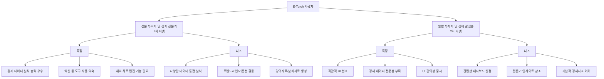

### 2.2 페르소나별 주요 여정

#### 전문 투자자 여정

1. **효율성 인식** → 기존 수작업(PDF 파싱, 엑셀 정리)의 비효율성 체감
2. **서비스 발견** → 지인 추천 또는 타겟 마케팅을 통한 노출
3. **기능 검증** → 핵심 기능(데이터 자동화, 차트 커스터마이징) 확인
4. **가치 체험** → 첫 대시보드 생성 및 시간 절약 효과 체감 (Wow Moment)
5. **업무 통합** → 일상 업무 루틴에 서비스 통합
6. **네트워크 확산** → 동종 업계 동료에게 서비스 추천

#### 일반 투자자 여정

1. **우연한 발견** → 전문가가 공유한 대시보드 링크 접근
2. **호기심 발생** → "이 차트는 어디서 만든 것인가?" 궁금증
3. **서비스 탐색** → 더 많은 콘텐츠 확인을 위한 회원가입
4. **점진적 활용** → 템플릿 활용한 개인 대시보드 간단 제작
5. **루틴 정착** → 정기적인 대시보드 확인이 투자 루틴으로 정착

## 3. 핵심 사용자 흐름

### 3.1 온보딩 및 로그인 흐름

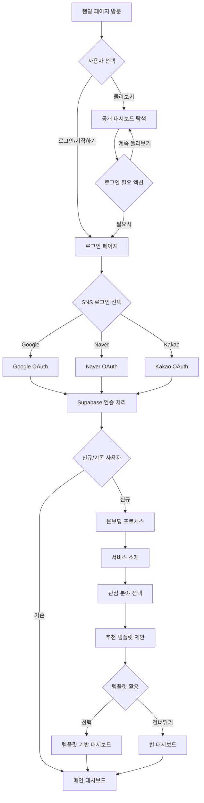

### 3.2 대시보드 관리 흐름

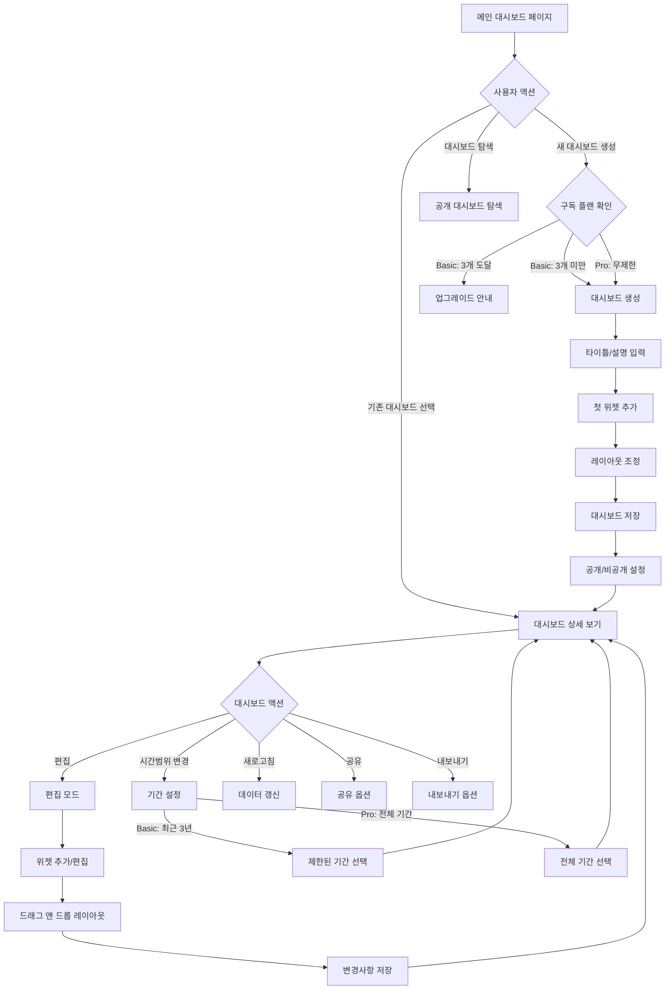

### 3.3 위젯 생성 및 편집 흐름

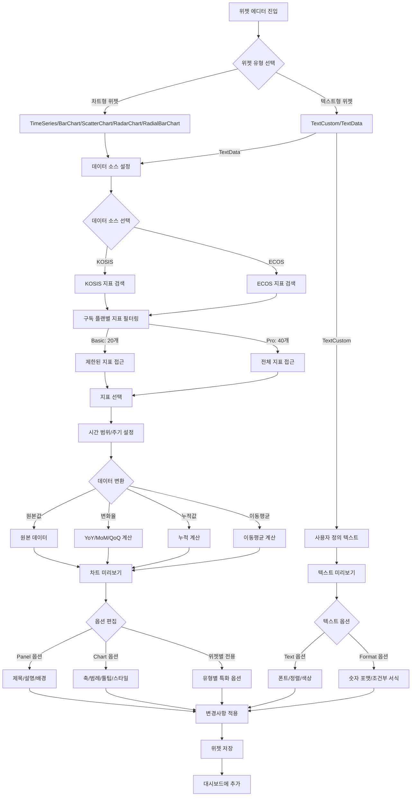

### 3.4 데이터 소스 조회 및 분석 흐름

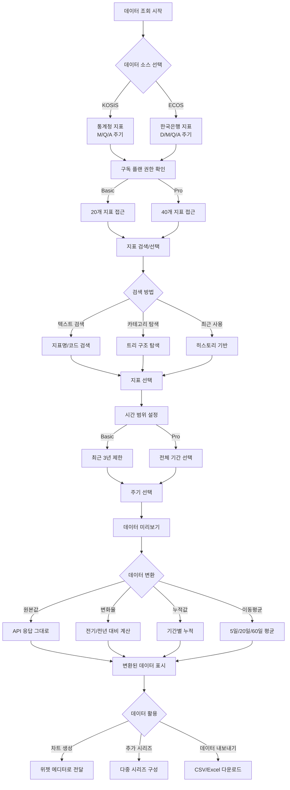

### 3.5 대시보드 공유 및 탐색 흐름

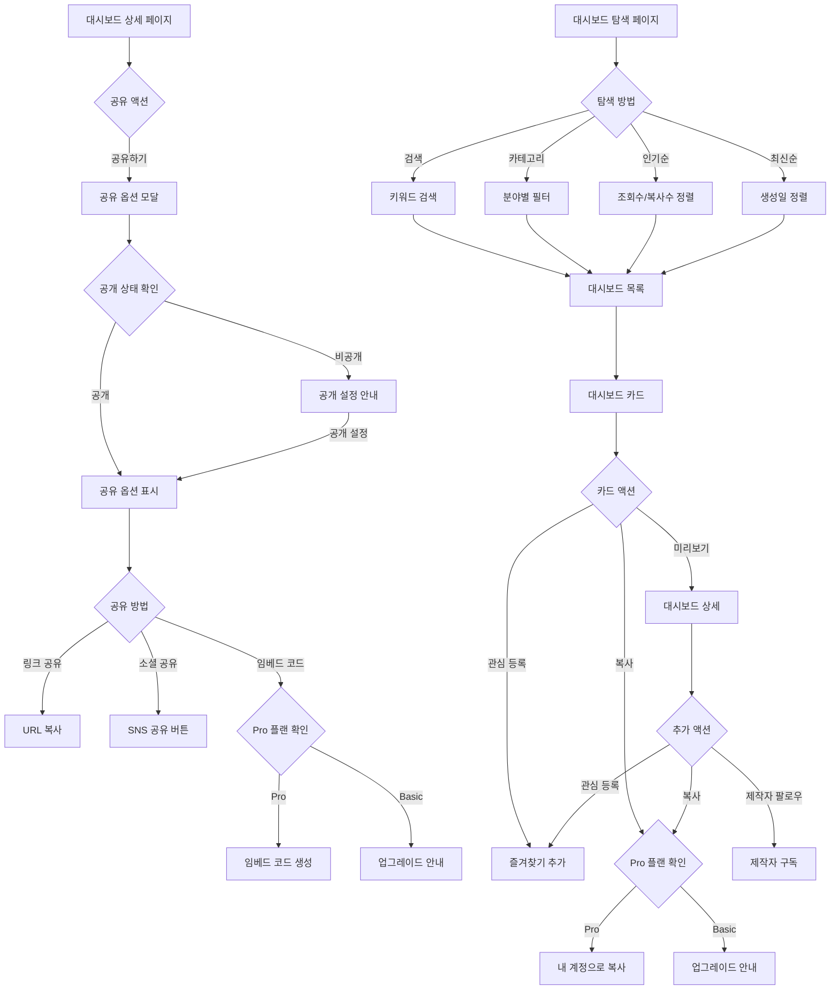

### 3.6 구독 및 결제 관리 흐름

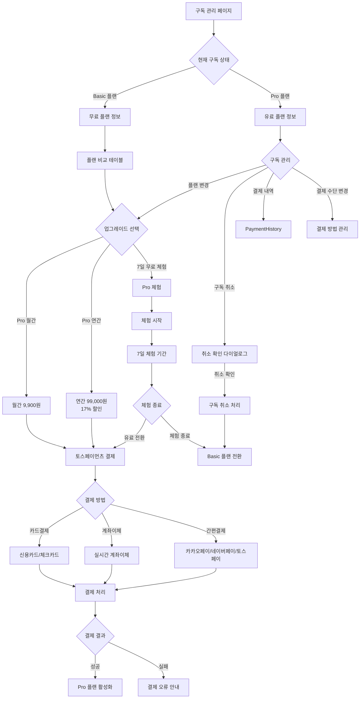

### 3.7 모바일 사용자 경험 흐름

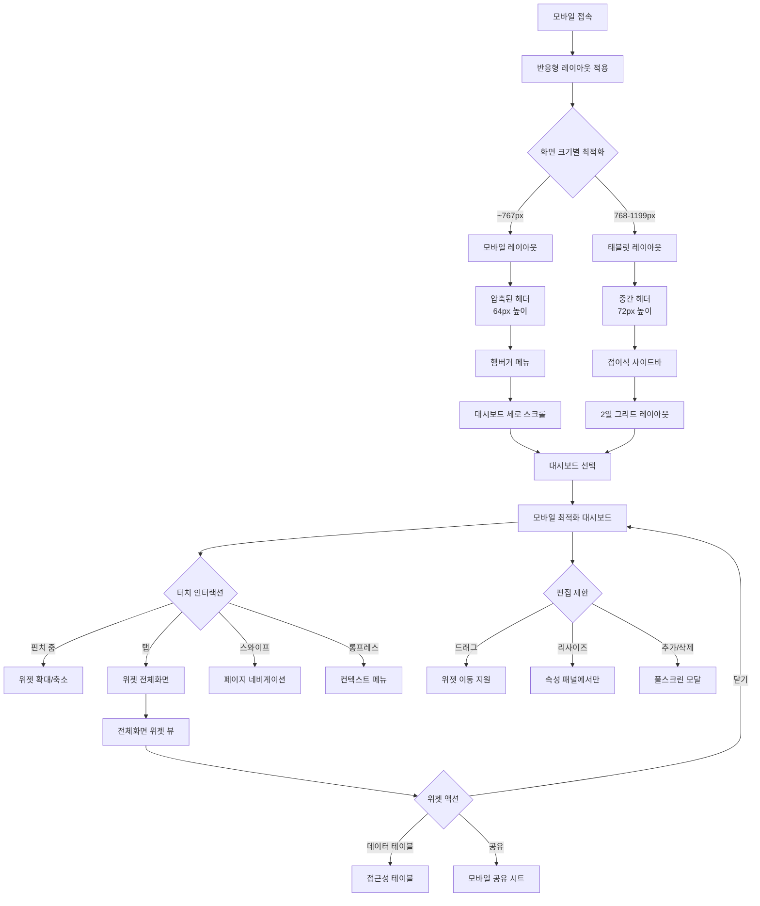

### 3.8 데이터 내보내기 및 공유 흐름

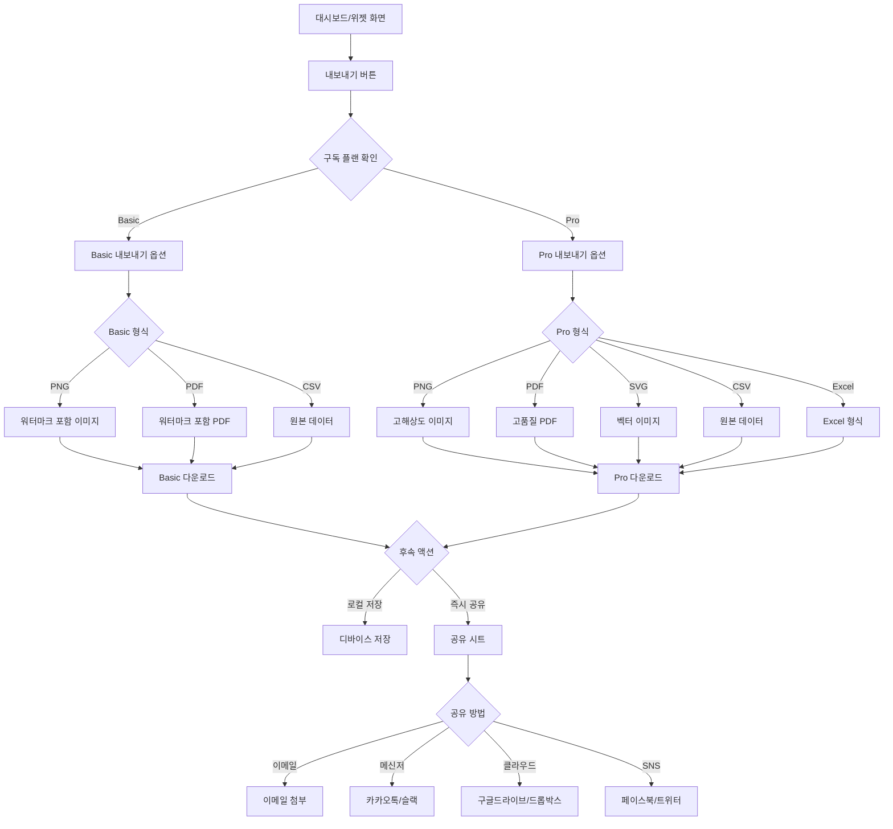

## 4. 상태 전이 및 인터랙션 패턴

### 4.1 데이터 로딩 상태

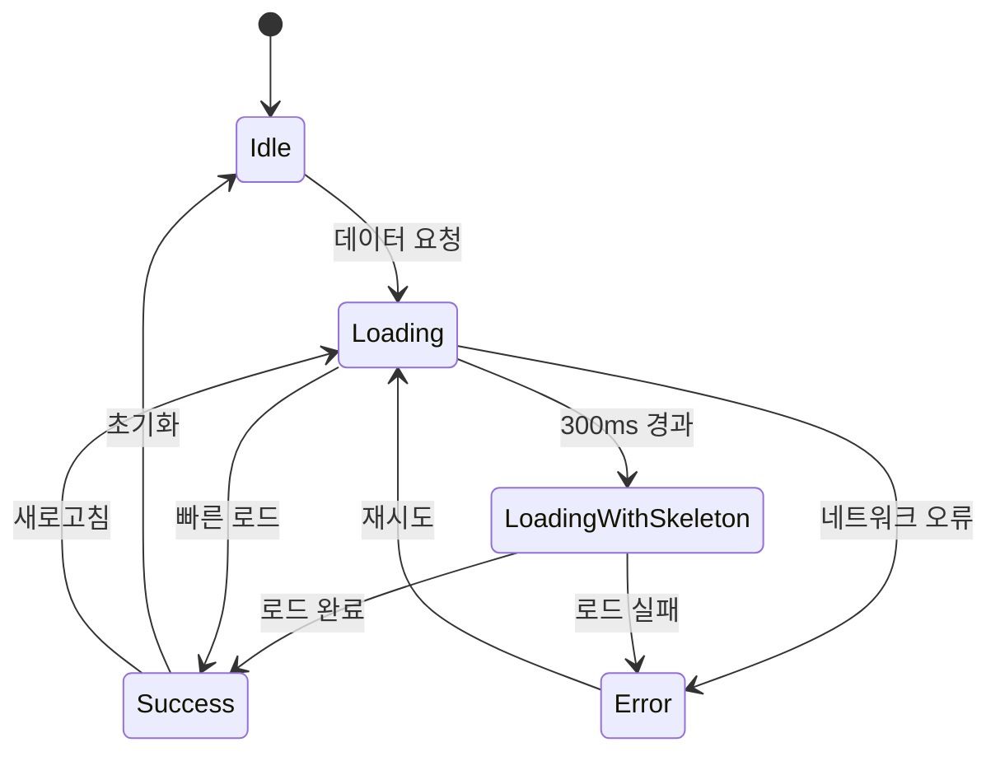

### 4.2 편집 모드 전환

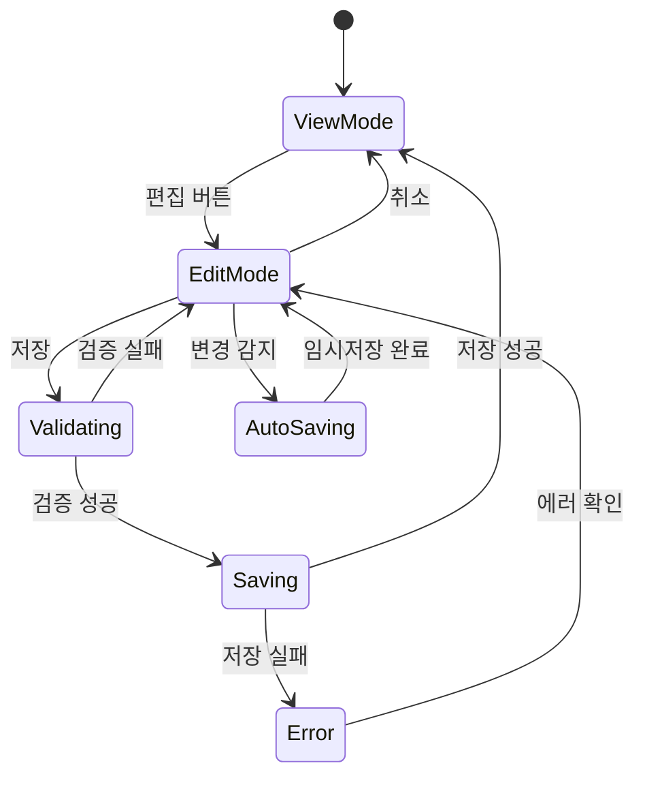

### 4.3 구독 플랜 제한 상태

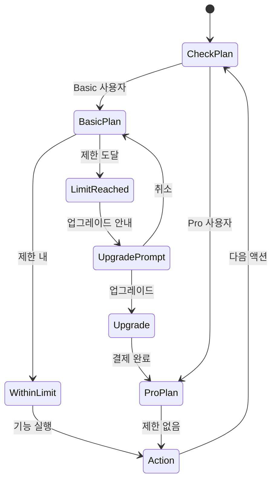

## 5. 오류 처리 및 예외 상황

### 5.1 오류 발생 시나리오

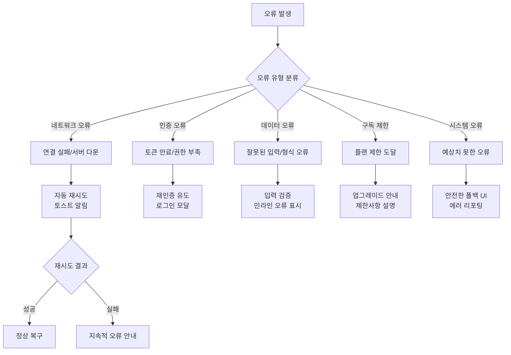

### 5.2 오류 복구 전략

| 오류 유형 | 감지 방법 | 복구 전략 | 사용자 피드백 |
|---------|----------|---------|------------|
| **네트워크 오류** | API 응답 실패 | 자동 재시도 (최대 3회) | 토스트 알림 + 재시도 버튼 |
| **인증 오류** | 401/403 응답 | 재인증 프로세스 유도 | 로그인 모달 + 현재 페이지 복원 |
| **데이터 검증 오류** | 클라이언트 검증 | 실시간 입력 검증 | 필드별 인라인 오류 메시지 |
| **구독 제한 오류** | 플랜 확인 | 업그레이드 안내 | 제한사항 명확한 설명 |
| **시스템 오류** | Error Boundary | 안전한 폴백 UI | 사과 메시지 + 리포트 옵션 |

## 6. 접근성 고려사항

### 6.1 WCAG 2.1 AA 준수 원칙

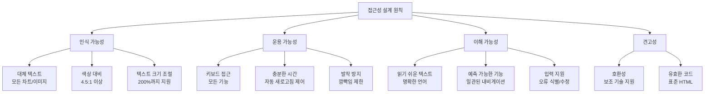

### 6.2 키보드 내비게이션 패턴

- **Tab/Shift+Tab**: 순차적 포커스 이동
- **Enter/Space**: 버튼 활성화
- **Arrow Keys**: 드롭다운/메뉴 탐색
- **Esc**: 모달/팝업 닫기
- **단축키**: Ctrl+S(저장), Ctrl+Z(실행취소)

### 6.3 스크린 리더 지원

- **의미적 HTML**: header, nav, main, aside 구조
- **ARIA 라벨**: 복잡한 위젯의 상태/역할 명시
- **차트 대체 텍스트**: 데이터 요약 정보 제공
- **실시간 업데이트**: aria-live로 변경사항 알림

### 6.4 시각적 접근성

- **색상 독립성**: 색상 외 구별 요소 병행 (아이콘, 패턴)
- **고대비 모드**: 시스템 설정 자동 반영
- **차트 접근성**: 데이터 테이블 토글 제공
- **터치 최적화**: 44×44px 최소 터치 영역

### 6.5 다국어 접근성

- **언어별 폰트**: 한국어(Inter), 영어(Inter) 최적화
- **RTL/LTR**: 언어별 자동 방향성 설정
- **번역 품질**: 전문 용어 일관성 유지
- **문화적 적응**: 숫자/날짜 형식 현지화

---

이 사용자 흐름 가이드를 통해 E-Torch 서비스의 모든 사용자 시나리오를 일관되고 체계적으로 구현할 수 있습니다. 각 흐름은 사용자의 목표 달성을 위한 최적의 경로를 제시하며, 접근성과 사용성을 동시에 보장합니다.
