# E-Torch 사용자 흐름(User Flows)

## 목차

- [1. 개요](#1-개요)
- [2. 사용자 페르소나](#2-사용자-페르소나)
- [3. 핵심 사용자 흐름](#3-핵심-사용자-흐름)
  - [3.1 온보딩 및 로그인 흐름](#31-온보딩-및-로그인-흐름)
  - [3.2 대시보드 관리 흐름](#32-대시보드-관리-흐름)
  - [3.3 위젯 생성 및 편집 흐름](#33-위젯-생성-및-편집-흐름)
  - [3.4 데이터 소스 조회 및 분석 흐름](#34-데이터-소스-조회-및-분석-흐름)
  - [3.5 데이터 비교 분석 흐름](#35-데이터-비교-분석-흐름)
  - [3.6 대시보드 공유 및 구독 흐름](#36-대시보드-공유-및-구독-흐름)
  - [3.7 구독 및 결제 관리 흐름](#37-구독-및-결제-관리-흐름)
  - [3.8 대시보드 발견 및 구독 흐름](#38-대시보드-발견-및-구독-흐름)
  - [3.9 모바일 사용자 경험 흐름](#39-모바일-사용자-경험-흐름)
  - [3.10 데이터 내보내기 및 공유 흐름](#310-데이터-내보내기-및-공유-흐름)
- [4. 상태 전이 및 인터랙션 패턴](#4-상태-전이-및-인터랙션-패턴)
- [5. 오류 처리 및 예외 상황](#5-오류-처리-및-예외-상황)
- [6. 접근성 고려사항](#6-접근성-고려사항)

## 1. 개요

본 문서는 E-Torch 경제지표 대시보드 서비스의 사용자 흐름(User Flows)을 설계하기 위한 지침을 제공합니다. 각 핵심 기능에 대한 사용자 경험 흐름을 정의하여 프론트엔드 개발 시 일관된 UX를 구현할 수 있도록 합니다.

**목표:**

- 직관적이고 효율적인 사용자 경험 제공
- 다양한 경제지표 데이터에 대한 접근성 향상
- 전문가와 일반 사용자 모두를 위한 인터페이스 설계
- 데이터 시각화 및 인사이트 발견 과정 최적화
- 공유 및 협업 기능 강화

> 관련 문서:
>
> - [product-spec.md](../product-spec.md) - 서비스 기획서
> - [ui-requirements.md](./ui-requirements.md) - UI 요구사항 명세서
> - [design-system.md](./design-system.md) - 디자인 시스템 가이드
> - [architecture.md](../frontend/architecture.md) - 프론트엔드 아키텍처 설계

## 2. 사용자 페르소나

E-Torch의 핵심 사용자 페르소나는 다음과 같이 구분됩니다:

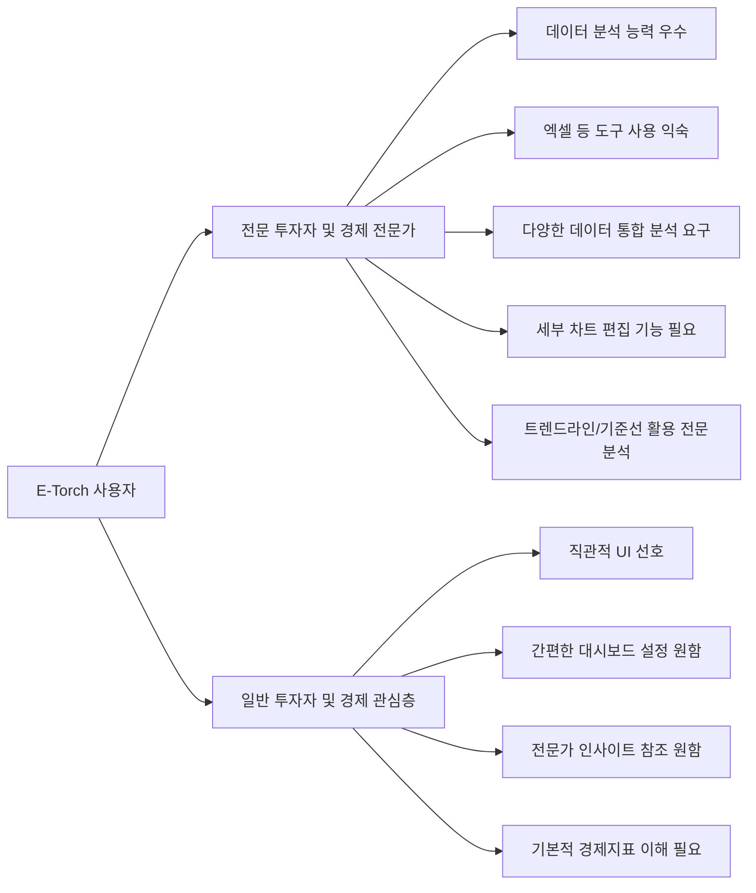
```mermaid
graph LR
    A[E-Torch 사용자] --> B[전문 투자자 및 경제 전문가]
    A --> C[일반 투자자 및 경제 관심층]
    
    B --> B1[데이터 분석 능력 우수]
    B --> B2[엑셀 등 도구 사용 익숙]
    B --> B3[다양한 데이터 통합 분석 요구]
    B --> B4[세부 차트 편집 기능 필요]
    B --> B5[트렌드라인/기준선 활용 전문분석]
    
    C --> C1[직관적 UI 선호]
    C --> C2[간편한 대시보드 설정 원함]
    C --> C3[전문가 인사이트 참조 원함]
    C --> C4[기본적 경제지표 이해 필요]
```

### 2.1 페르소나별 주요 사용자 흐름

#### 전문 투자자 및 경제 전문가 흐름

전문 투자자는 주로 다음과 같은 흐름으로 서비스를 활용합니다:

1. **데이터 통합 분석 흐름**: 여러 데이터 소스를 결합한 복합 위젯 생성 (3.3, 3.4, 3.5 섹션 참조)
2. **세부 위젯 커스터마이징 흐름**: 트렌드라인, 기준선 등 고급 분석 도구 활용 (3.3 섹션 참조)
3. **전문 대시보드 배포 흐름**: 분석 결과를 대시보드로 구성하여 공유 (3.6 섹션 참조)
4. **데이터 내보내기 흐름**: 분석 자료 및 강의 자료로 활용 (3.10 섹션 참조)

#### 일반 투자자 및 경제 관심층 흐름

일반 투자자는 주로 다음과 같은 흐름으로 서비스를 활용합니다:

1. **템플릿 활용 흐름**: 사전 구성된 대시보드 템플릿 선택 및 커스터마이징
2. **전문가 대시보드 구독 흐름**: 전문가가 제작한 대시보드 구독 및 활용 (3.6, 3.8 섹션 참조)
3. **간편 시각화 흐름**: 직관적 UI를 통한 간단한 위젯 생성 (3.3 섹션 간소화 버전)
4. **모바일 경험 흐름**: 모바일 기기에서의 대시보드 조회 및 활용 (3.9 섹션 참조)

각 페르소나의 주요 사용 목적과 행동 패턴을 고려하여 사용자 흐름을 설계합니다.

## 3. 핵심 사용자 흐름

### 3.1 온보딩 및 로그인 흐름

> 관련 와이어프레임: [로그인 화면](./wireframes/login-wireframe.svg)  
> 관련 컴포넌트: AuthCallback, AuthGuard (packages/state/src/providers/auth-provider.tsx)  
> 구현 단계: 페이즈 1 (기반 구축) - 인증 시스템 (ROADMAP.md 참조)

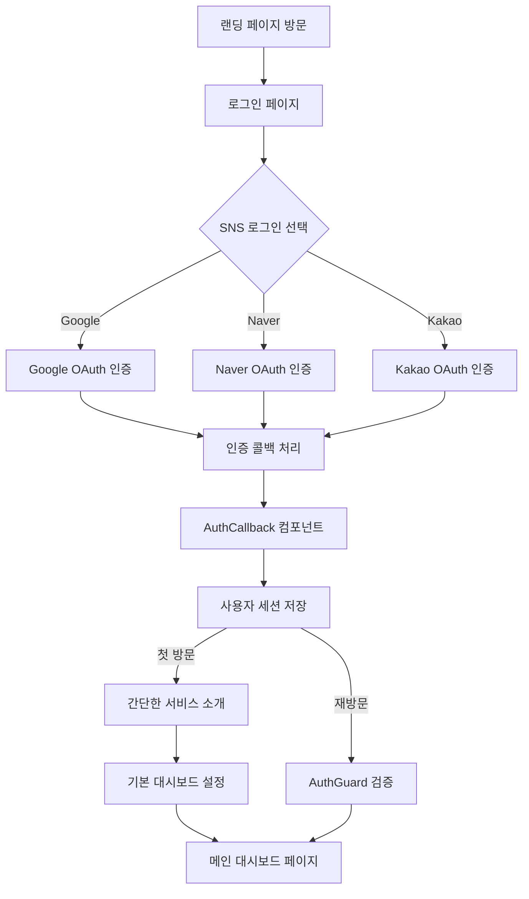
```mermaid
flowchart TD
    A[랜딩 페이지 방문] --> B[로그인 페이지]
    B --> C{SNS 로그인 선택}
    C -->|Google| D[Google OAuth 인증]
    C -->|Naver| E[Naver OAuth 인증]
    C -->|Kakao| F[Kakao OAuth 인증]
    
    D --> G[인증 콜백 처리]
    E --> G
    F --> G
    
    G --> H[AuthCallback 컴포넌트]
    H --> I[사용자 세션 저장]
    
    I -->|첫 방문| J[간단한 서비스 소개]
    I -->|재방문| K[AuthGuard 검증]
    
    J --> L[기본 대시보드 설정]
    L --> M[메인 대시보드 페이지]
    K --> M
```

**핵심 특징:**

- SNS 로그인만 지원(자체 회원가입 없음): Google, Naver, Kakao
- Supabase Auth를 활용한 인증 시스템 연동
- AuthCallback 컴포넌트를 통한 인증 정보 처리
- AuthGuard 컴포넌트를 통한 보호된 경로 접근 제어
- 첫 방문 사용자를 위한 간단한 서비스 소개 및 기본 대시보드 제공
- 재방문 사용자는 이전 세션 상태 복원

#### 3.1.1 상세 온보딩 경험 흐름

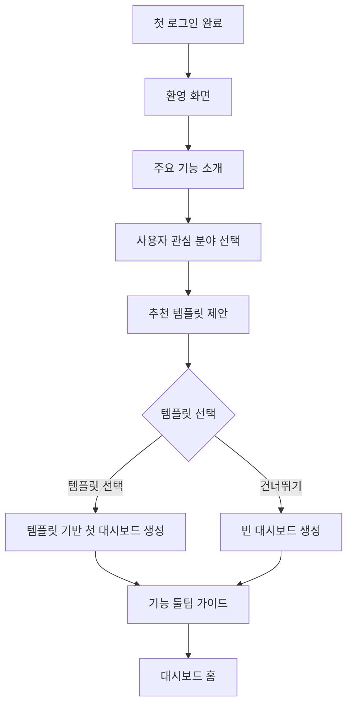
```mermaid
flowchart TD
    A[첫 로그인 완료] --> B[환영 화면]
    B --> C[주요 기능 소개]
    C --> D[사용자 관심 분야 선택]
    D --> E[추천 템플릿 제안]
    E --> F{템플릿 선택}
    F -->|템플릿 선택| G[템플릿 기반 첫 대시보드 생성]
    F -->|건너뛰기| H[빈 대시보드 생성]
    G --> I[기능 툴팁 가이드]
    H --> I
    I --> J[대시보드 홈]
```

이 흐름은 새 사용자의 온보딩 경험을 상세히 설명하여 초기 사용자 학습 곡선을 완화합니다. 첫 방문 사용자에게 서비스의 가치를 신속하게 이해시키고, 직관적인 사용 방법을 안내합니다.

### 3.2 대시보드 관리 흐름

> 관련 와이어프레임: [대시보드 화면](./wireframes/dashboard-wireframe.svg), [대시보드 편집기](./wireframes/dashboard-editor-wireframe.svg)  
> 관련 UI 요구사항: DL-001~005(대시보드 목록), DV-001~007(대시보드 상세), DE-001~009(대시보드 편집)  
> 관련 컴포넌트: DashboardComponent, DashboardGrid, GridItem (packages/dashboard/components/)  
> 구현 단계: 페이즈 2 (핵심 기능) - 대시보드 시스템 (ROADMAP.md 참조)

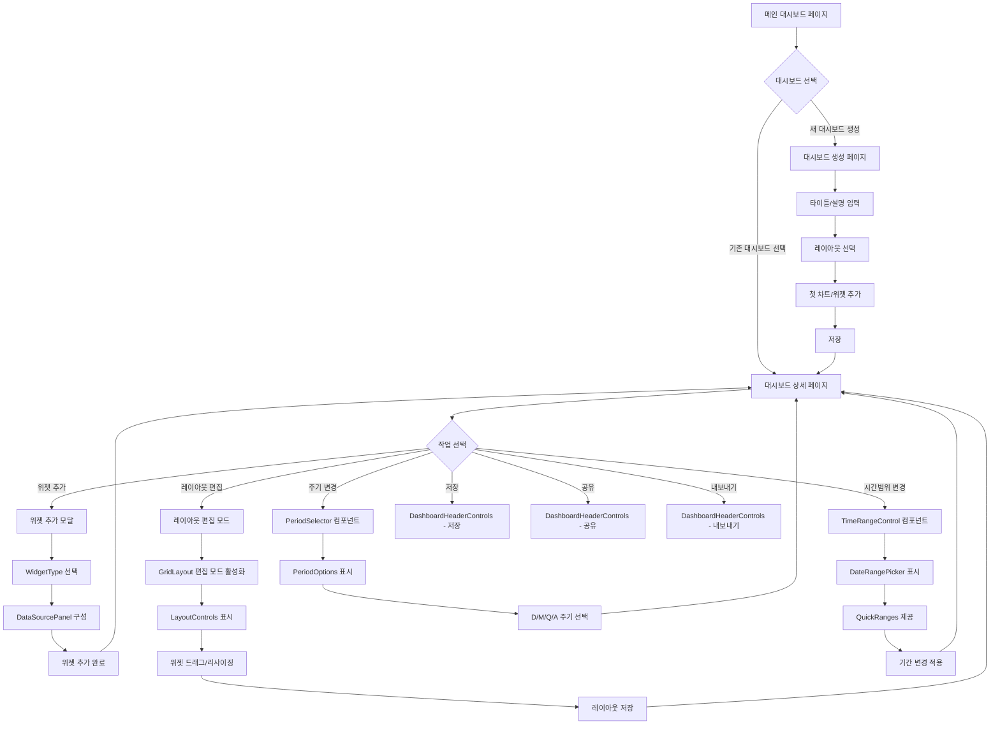
```mermaid
flowchart TD
    A[메인 대시보드 페이지] --> B{대시보드 선택}
    B -->|새 대시보드 생성| C[대시보드 생성 페이지]
    B -->|기존 대시보드 선택| D[대시보드 상세 페이지]
    
    C --> E[타이틀/설명 입력]
    E --> F[레이아웃 선택]
    F --> G[첫 차트/위젯 추가]
    G --> H[저장]
    H --> D
    
    D --> I{작업 선택}
    I -->|위젯 추가| J[위젯 추가 모달]
    I -->|레이아웃 편집| K[레이아웃 편집 모드]
    I -->|시간범위 변경| L[TimeRangeControl 컴포넌트]
    I -->|주기 변경| M[PeriodSelector 컴포넌트]
    I -->|저장| N[DashboardHeaderControls - 저장]
    I -->|공유| O[DashboardHeaderControls - 공유]
    I -->|내보내기| P[DashboardHeaderControls - 내보내기]
    
    J --> Q[WidgetType 선택]
    Q --> R[DataSourcePanel 구성]
    R --> S[위젯 추가 완료]
    S --> D
    
    K --> T1[GridLayout 편집 모드 활성화]
    T1 --> T2[LayoutControls 표시]
    T2 --> T3[위젯 드래그/리사이징]
    T3 --> T4[레이아웃 저장]
    T4 --> D
    
    L --> U1[DateRangePicker 표시]
    U1 --> U2[QuickRanges 제공]
    U2 --> U3[기간 변경 적용]
    U3 --> D
    
    M --> V1[PeriodOptions 표시]
    V1 --> V2[D/M/Q/A 주기 선택]
    V2 --> D
```

**핵심 특징:**

- react-grid-layout 기반의 유연한 대시보드 레이아웃 관리
- GridLayout, GridItem 컴포넌트를 통한 위젯 배치
- DashboardControls 컴포넌트를 통한 통합 제어
- TimeRangeControl: 시간 범위 선택 (최근 1년, 최근 3년, 커스텀 범위 등)
- PeriodSelector: 데이터 주기 선택 (일간-D, 월간-M, 분기-Q, 연간-A)
- 위젯 유형: ChartWidget, TextWidget 등 다양한 컨텐츠 지원

**서버/클라이언트 컴포넌트 흐름:**

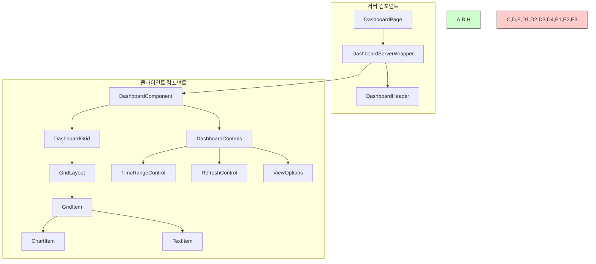
```mermaid
flowchart TD
    subgraph "서버 컴포넌트"
        A[DashboardPage] --> B[DashboardServerWrapper]
        B --> H[DashboardHeader]
    end
    
    subgraph "클라이언트 컴포넌트"
        B --> C[DashboardComponent]
        C --> D[DashboardGrid]
        C --> E[DashboardControls]
        
        D --> D1[GridLayout]
        D1 --> D2[GridItem]
        D2 --> D3[ChartItem]
        D2 --> D4[TextItem]
        
        E --> E1[TimeRangeControl]
        E --> E2[RefreshControl]
        E --> E3[ViewOptions]
    end
    
    style A,B,H fill:#ccffcc,stroke:#333,stroke-width:1px
    style C,D,E,D1,D2,D3,D4,E1,E2,E3 fill:#ffcccb,stroke:#333,stroke-width:1px
```

#### 3.2.1 서버 액션 통합 패턴

E-Torch의 대시보드 편집 흐름은 Next.js 서버 액션을 활용하여 클라이언트-서버 통신을 간소화합니다:

```tsx
// 서버 액션 정의
'use server'
export async function saveDashboardAction(formData: FormData) {
  // 서버 측 유효성 검사 및 데이터 저장
  // ...
  revalidatePath(`/dashboard/${dashboardId}`)
  return { success: true }
}

// 클라이언트 컴포넌트에서 활용
export function SaveButton() {
  const [isPending, startTransition] = useTransition()
  
  return (
    <form action={(formData) => {
      startTransition(async () => {
        const result = await saveDashboardAction(formData)
        // 결과 처리
      })
    }}>
      <button type="submit" disabled={isPending}>
        {isPending ? '저장 중...' : '저장'}
      </button>
    </form>
  )
}
```

### 3.3 위젯 생성 및 편집 흐름

> 관련 와이어프레임: [차트 에디터](./wireframes/improved-chart-editor-wireframe.svg)  
> 관련 UI 요구사항: PO-001~003(패널 옵션), TO-001~005(툴팁 옵션), CS-001~002(조회 기간/주기 설정)  
> 관련 컴포넌트: WidgetEditor, WidgetPreview, OptionsPanel (packages/widgets/src/editor/)
> 구현 단계: 페이즈 2 (핵심 기능) - 차트 컴포넌트 (ROADMAP.md 참조)

```mermaid
flowchart TD
    A[WidgetEditor 진입] --> B{WidgetType 선택}
    B -->|TimeSeries| TS[시계열 차트]
    B -->|BarChart| BC[바 차트]
    B -->|ScatterChart| SC[산점도 차트]
    B -->|RadarChart| RC[레이더 차트]
    B -->|RadialBarChart| RB[방사형 바 차트]
    B -->|Text-사용자정의| TX1[텍스트 위젯 (사용자 정의)]
    B -->|Text-데이터기반| TX2[텍스트 위젯 (데이터 기반)]
    
    TS --> C[DataSourcePanel]
    BC --> C
    SC --> C
    RC --> C
    RB --> C
    TX2 --> C

    TX1 --> K[CustomContent 편집]
    TX2 --> L[DataSource 설정]
    L --> M[DataOperation 선택]
    M --> N[TextPreview]
    K --> N
    
    C --> D[DataQueryBuilder]
    D --> E[SourceSelector]
    E -->|KOSIS| F1[KOSIS 지표 검색]
    E -->|ECOS| F2[ECOS 지표 검색]
    E -->|OECD| F3[OECD 지표 검색]
    
    F1 --> G[IndicatorSelector]
    F2 --> G
    F3 --> G
    G --> H[TransformControls]
    
    H -->|원본값| I1[원본 데이터 활용]
    H -->|변화율-전기대비| I2[MoM/QoQ/YoY 계산]
    H -->|변화율-전년동기대비| I3[YoY 계산]
    H -->|누적값| I4[데이터 누적 계산]
    
    I1 --> J[ChartPreview]
    I2 --> J
    I3 --> J
    I4 --> J
    
    J --> K{차트 OptionsPanel 편집}
    K -->|PanelOptions| L1[타이틀/설명 설정]
    K -->|TooltipOptions| L2[툴팁 설정]
    K -->|LegendOptions| L3[범례 설정]
    K -->|AxisOptions| L4[X/Y축 설정]
    K -->|StyleOptions| L5[스타일 설정]

    TK2 --> TK3{텍스트 OptionsPanel 편집}
    TK3 -->|PanelOptions| TL1[타이틀/설명 설정]
    TK3 -->|TextOptions| TL2[폰트/정렬/색상 설정]
    TK3 -->|FormatOptions| TL3[숫자 포맷/조건부 서식]
    
    L1 --> M[변경사항 적용]
    L2 --> M
    L3 --> M
    L4 --> M
    L5 --> M
    
    TS --> N1[Graph Styles - TimeSeries]
    N1 -->|Line| O1[선 스타일 설정]
    N1 -->|Area| O2[영역 스타일 설정]
    N1 -->|Bar| O3[바 스타일 설정]
    
    SC --> N2[Scatter Options]
    N2 --> P1[포인트 크기/모양 설정]
    N2 --> P2[회귀선 설정]
    
    RC --> N3[Radar Options]
    N3 --> Q1[그리드/축 설정]
    N3 --> Q2[영역 채우기 설정]
    
    RB --> N4[Radial Bar Options]
    N4 --> R1[각도/반경 설정]
    N4 --> R2[배경 설정]
    
    M --> S[차트 저장]
    O1 --> M
    O2 --> M
    O3 --> M
    P1 --> M
    P2 --> M
    Q1 --> M
    Q2 --> M
    R1 --> M
    R2 --> M
    
    S --> T[DashboardGrid에 추가]
```

**핵심 특징:**

- 7가지 위젯 유형 지원 (차트형 5개 + 텍스트형 2개)
- 위젯 유형별 특화된 옵션 패널 (UI 요구사항 명세 기반)
- 실시간 위젯 미리보기 및 인터랙티브 편집
- 조건부 데이터 소스 패널 (차트형 + Text-데이터기반만 표시)
- 데이터 소스 통합 및 데이터 변환 파이프라인
- 단계별 편집 과정 및 저장 체계

주요 단계에서 사용되는 UI 컴포넌트:

- 차트 유형 선택: CM-001(차트 유형 선택) UI 컴포넌트 활용
- 데이터 소스 설정: DM-001~003(데이터 출처/지표 선택) 컴포넌트 활용
- 시각화 옵션 설정:
  - 패널 옵션(PO-001~003): 제목, 설명, 배경 설정
  - 툴팁 옵션(TO-001~005): 툴팁 모드, 너비, 커서 스타일 설정
  - 레전드 옵션(LG-001~004): 범례 가시성, 레이아웃, 정렬 설정

#### 3.3.1 React 19 최적화 패턴 활용

E-Torch의 위젯 생성 및 편집 기능은 React 19의 최신 기능을 활용하여 최적화됩니다:

- **useOptimistic**: 서버 응답 전 낙관적 UI 업데이트로 반응성 향상
- **useFormStatus**: 폼 상태(저장 중, 오류 등)의 선언적 관리
- **자동 메모이제이션**: React 19의 자동 메모이제이션으로 성능 최적화
- **Suspense for Data Fetching**: 데이터 로딩 상태의 선언적 관리

### 3.4 데이터 소스 조회 및 분석 흐름

> 관련 UI 요구사항: DS-001~010(데이터 소스 관리), CS-001~002(조회 기간/주기 설정)  
> 관련 컴포넌트: DataQueryBuilder, SourceSelector, IndicatorSelector (packages/data-sources/src/components/)  
> 적용 위젯: 차트형 위젯 전체, Text-데이터기반 위젯  
> 구현 단계: 페이즈 2 (핵심 기능) - 데이터 소스 관리 (ROADMAP.md 참조)  

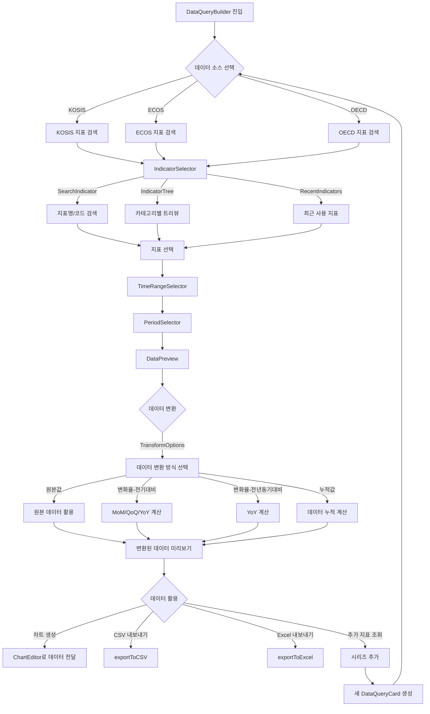
```mermaid
flowchart TD
    A[DataQueryBuilder 진입] --> B{데이터 소스 선택}
    B -->|KOSIS| C1[KOSIS 지표 검색]
    B -->|ECOS| C2[ECOS 지표 검색]
    B -->|OECD| C3[OECD 지표 검색]
    
    C1 --> D[IndicatorSelector]
    C2 --> D
    C3 --> D
    
    D -->|SearchIndicator| E1[지표명/코드 검색]
    D -->|IndicatorTree| E2[카테고리별 트리뷰]
    D -->|RecentIndicators| E3[최근 사용 지표]
    
    E1 --> F[지표 선택]
    E2 --> F
    E3 --> F
    
    F --> G[TimeRangeSelector]
    G --> H[PeriodSelector]
    H --> I[DataPreview]
    
    I --> J{데이터 변환}
    J -->|TransformOptions| K[데이터 변환 방식 선택]
    K -->|원본값| L1[원본 데이터 활용]
    K -->|변화율-전기대비| L2[MoM/QoQ/YoY 계산]
    K -->|변화율-전년동기대비| L3[YoY 계산]
    K -->|누적값| L4[데이터 누적 계산]
    
    L1 --> M[변환된 데이터 미리보기]
    L2 --> M
    L3 --> M
    L4 --> M
    
    M --> N{데이터 활용}
    N -->|차트 생성| O1[ChartEditor로 데이터 전달]
    N -->|CSV 내보내기| O2[exportToCSV]
    N -->|Excel 내보내기| O3[exportToExcel]
    N -->|추가 지표 조회| P[시리즈 추가]
    
    P --> Q[새 DataQueryCard 생성]
    Q --> B
```

**핵심 특징:**

- 통합 데이터 조회 시스템 (KOSIS, ECOS, OECD)
- 지표 검색 및 선택 인터페이스
- 기간 및 주기 설정 컴포넌트
- 데이터 변환 및 미리보기 기능
- 다양한 데이터 활용 옵션

**주의**: 주기 선택은 차트 생성 시에만 의미가 있으며, 완성된 대시보드에서는 기간 조회만 가능합니다.

### 3.5 데이터 비교 분석 흐름

> 관련 UI 요구사항: CP-001~006(비교 기능)  
> 관련 컴포넌트: ComparisonControls, DataTransformer (packages/widgets/src/components/)  
> 적용 위젯: TimeSeries, BarChart  
> 구현 단계: 페이즈 2 (핵심 기능) - 차트 컴포넌트 (ROADMAP.md 참조)

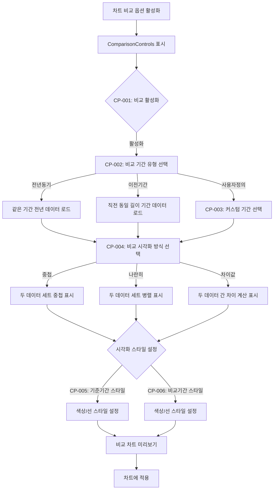
```mermaid
flowchart TD
    A[차트 비교 옵션 활성화] --> B[ComparisonControls 표시]
    B --> C{CP-001: 비교 활성화}
    C -->|활성화| D[CP-002: 비교 기간 유형 선택]
    
    D -->|전년동기| E1[같은 기간 전년 데이터 로드]
    D -->|이전기간| E2[직전 동일 길이 기간 데이터 로드]
    D -->|사용자정의| E3[CP-003: 커스텀 기간 선택]
    
    E1 --> F[CP-004: 비교 시각화 방식 선택]
    E2 --> F
    E3 --> F
    
    F -->|중첩| G1[두 데이터 세트 중첩 표시]
    F -->|나란히| G2[두 데이터 세트 병렬 표시]
    F -->|차이값| G3[두 데이터 간 차이 계산 표시]
    
    G1 --> H{시각화 스타일 설정}
    G2 --> H
    G3 --> H
    
    H -->|CP-005: 기준기간 스타일| I1[색상/선 스타일 설정]
    H -->|CP-006: 비교기간 스타일| I2[색상/선 스타일 설정]
    
    I1 --> J[비교 차트 미리보기]
    I2 --> J
    
    J --> K[차트에 적용]
```

**핵심 특징:**

- 기간별 데이터 비교 기능 (UI 요구사항 명세 CP-001~006)
- 다양한 비교 유형 지원: 전년동기, 이전기간, 사용자정의
- 비교 시각화 방식: 중첩, 나란히, 차이값
- 스타일 커스터마이징으로 시각적 구분 명확화
- Time Series, Bar Chart 등 주요 차트 유형 지원

### 3.6 대시보드 공유 및 구독 흐름

> 관련 와이어프레임: [대시보드 탐색](./wireframes/dashboard-explore-wireframe.svg)  
> 관련 UI 요구사항: DS-001~008(대시보드 공유/탐색)  
> 관련 컴포넌트: DashboardSharing, ExploreList (packages/dashboard/src/components/, packages/dashboard/src/explore/)  
> 구현 단계: 페이즈 2 (핵심 기능) - 대시보드 시스템 (ROADMAP.md 참조)

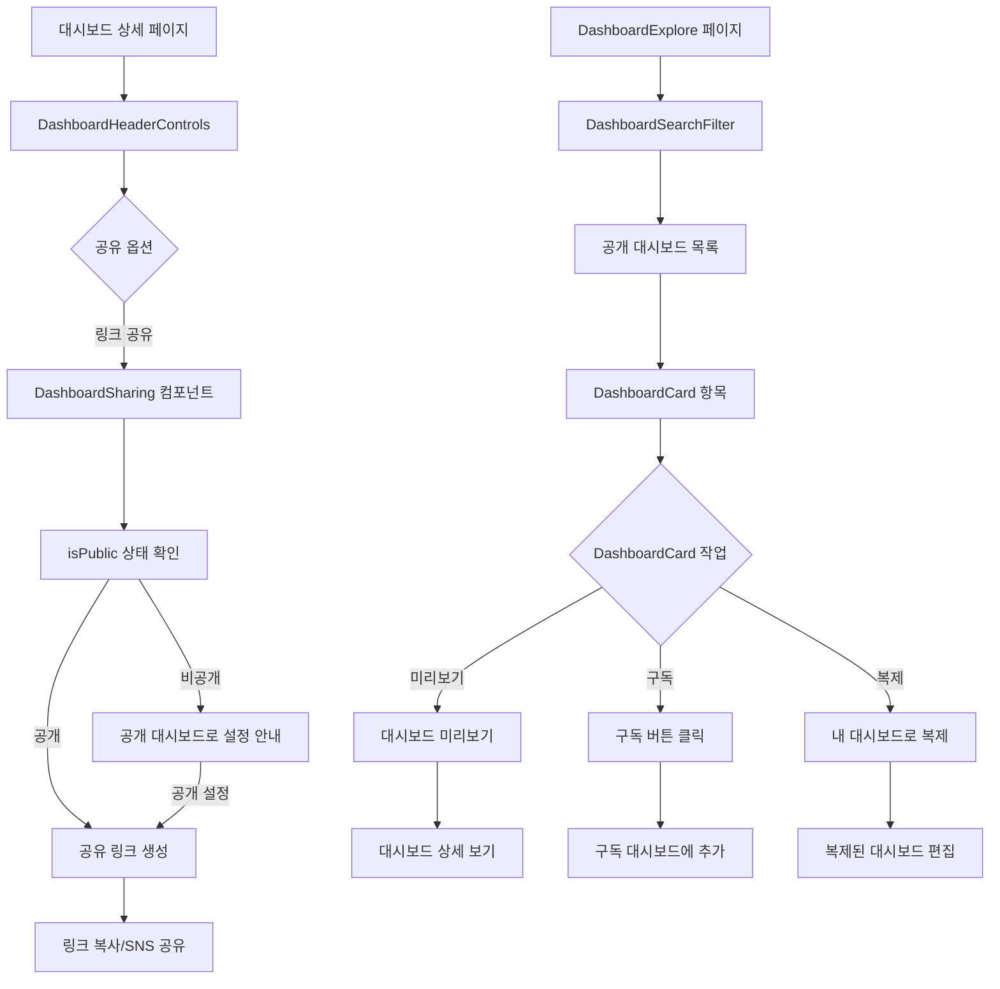
```mermaid
flowchart TD
    A[대시보드 상세 페이지] --> B[DashboardHeaderControls]
    B --> C{공유 옵션}
    C -->|링크 공유| D[DashboardSharing 컴포넌트]
    
    D --> E[isPublic 상태 확인]
    E -->|비공개| F1[공개 대시보드로 설정 안내]
    E -->|공개| F2[공유 링크 생성]
    
    F1 -->|공개 설정| F2
    F2 --> G[링크 복사/SNS 공유]
    
    H[DashboardExplore 페이지] --> I[DashboardSearchFilter]
    I --> J[공개 대시보드 목록]
    J --> K[DashboardCard 항목]
    
    K --> L{DashboardCard 작업}
    L -->|미리보기| M1[대시보드 미리보기]
    L -->|구독| M2[구독 버튼 클릭]
    L -->|복제| M3[내 대시보드로 복제]
    
    M1 --> N1[대시보드 상세 보기]
    M2 --> N2[구독 대시보드에 추가]
    M3 --> N3[복제된 대시보드 편집]
```

**핵심 특징:**

- 대시보드 공유 기능: 링크 생성, 공개/비공개 설정
- DashboardExplore를 통한 공개 대시보드 탐색
- 카테고리 필터 및 검색 기능
- DashboardCard를 통한 직관적인 목록 표시
- 구독 및 복제 기능으로 확장성 제공

### 3.7 구독 및 결제 관리 흐름

> 관련 와이어프레임: [구독 관리](./wireframes/subscription-wireframe.svg)  
> 관련 UI 요구사항: SM-001~006(구독 관리)  
> 관련 컴포넌트: SubscriptionManagement, PlanSelector (packages/state/src/services/subscription-service.ts)  
> 구현 단계: 페이즈 3 (사용자 기능) - 사용자 관리 (ROADMAP.md 참조)

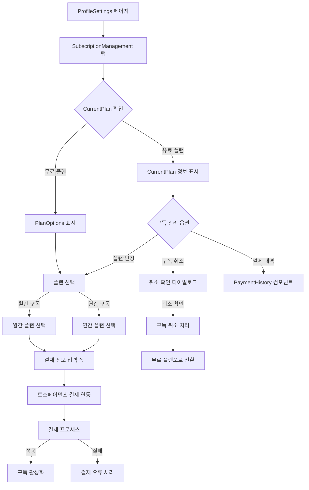
```mermaid
flowchart TD
    A[ProfileSettings 페이지] --> B[SubscriptionManagement 탭]
    
    B --> C{CurrentPlan 확인}
    C -->|무료 플랜| D[PlanOptions 표시]
    C -->|유료 플랜| E[CurrentPlan 정보 표시]
    
    D --> F[플랜 선택]
    F -->|월간 구독| G1[월간 플랜 선택]
    F -->|연간 구독| G2[연간 플랜 선택]
    
    G1 --> H[결제 정보 입력 폼]
    G2 --> H
    
    H --> I[토스페이먼츠 결제 연동]
    I --> J[결제 프로세스]
    J -->|성공| K[구독 활성화]
    J -->|실패| L[결제 오류 처리]
    
    E --> M{구독 관리 옵션}
    M -->|플랜 변경| F
    M -->|구독 취소| N[취소 확인 다이얼로그]
    M -->|결제 내역| O[PaymentHistory 컴포넌트]
    
    N -->|취소 확인| P[구독 취소 처리]
    P --> Q[무료 플랜으로 전환]
```

**핵심 특징:**

- 명확한 무료/유료 플랜 구분
- CurrentPlan 컴포넌트를 통한 현재 구독 정보 표시
- PlanOptions 컴포넌트를 통한 다양한 플랜 옵션 제공
- 토스페이먼츠 결제 연동
- PaymentHistory를 통한 결제 내역 관리

#### 3.7.1 구독 전환 및 결제 경험 흐름

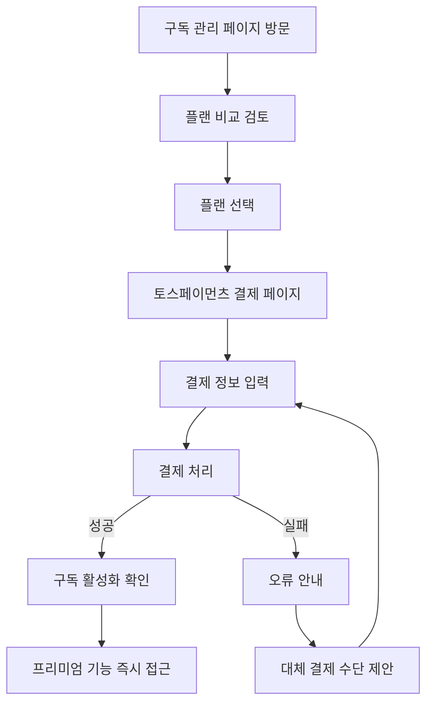
```mermaid
flowchart TD
    A[구독 관리 페이지 방문] --> B[플랜 비교 검토]
    B --> C[플랜 선택]
    C --> D[토스페이먼츠 결제 페이지]
    D --> E[결제 정보 입력]
    E --> F[결제 처리]
    F -->|성공| G[구독 활성화 확인]
    F -->|실패| H[오류 안내]
    G --> I[프리미엄 기능 즉시 접근]
    H --> J[대체 결제 수단 제안]
    J --> E
```

이 흐름은 사용자가 유료 플랜으로 전환하는 과정과 결제 경험을 시각화합니다.

### 3.8 대시보드 발견 및 구독 흐름

> 관련 와이어프레임: [대시보드 탐색](./wireframes/dashboard-explore-wireframe.svg)  
> 관련 UI 요구사항: DS-004~008(대시보드 탐색/구독)  
> 관련 컴포넌트: ExploreList, ExploreFilters, ExploreCard (packages/dashboard/src/explore/)  
> 구현 단계: 페이즈 4 (완성 및 배포) - 고급 기능 및 최적화 (ROADMAP.md 참조)

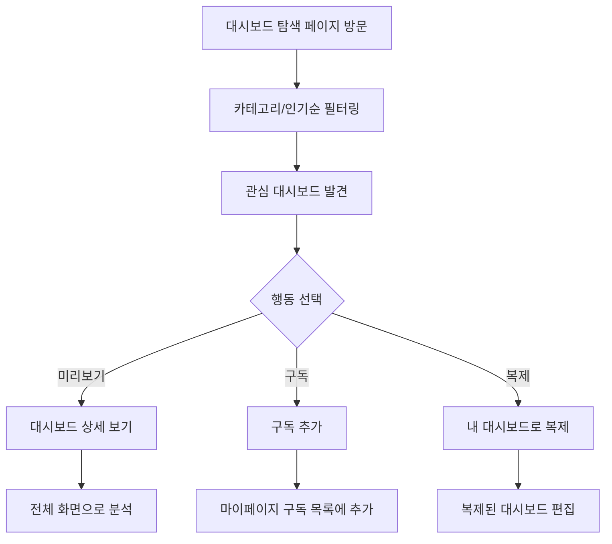
```mermaid
flowchart TD
    A[대시보드 탐색 페이지 방문] --> B[카테고리/인기순 필터링]
    B --> C[관심 대시보드 발견]
    C --> D{행동 선택}
    D -->|미리보기| E[대시보드 상세 보기]
    D -->|구독| F[구독 추가]
    D -->|복제| G[내 대시보드로 복제]
    
    E --> H[전체 화면으로 분석]
    F --> I[마이페이지 구독 목록에 추가]
    G --> J[복제된 대시보드 편집]
```

이 흐름은 사용자가 다른 사용자의 대시보드를 발견하고 활용하는 과정을 보여줍니다. 특히 일반 투자자 페르소나가 전문가의 인사이트를 활용하는 중요한 경로입니다.

### 3.9 모바일 사용자 경험 흐름

> 관련 UI 요구사항: LN-001(반응형 레이아웃), LN-005(모바일 메뉴)  
> 관련 컴포넌트: MobileHeader, MobileNav (packages/ui/src/components/layout/)  
> 구현 단계: 페이즈 2 (핵심 기능) - 대시보드 시스템 (ROADMAP.md 참조)

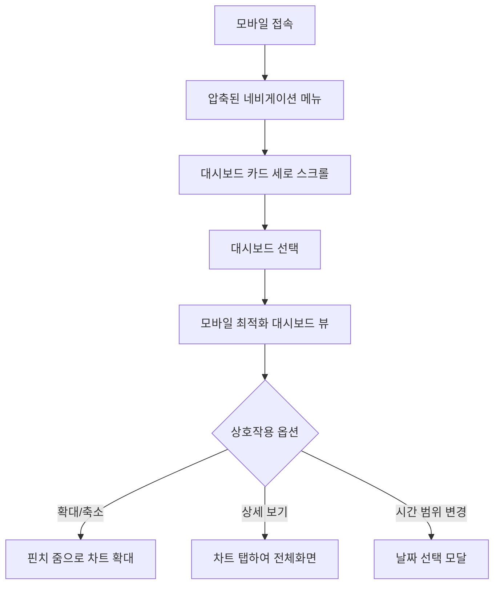
```mermaid
flowchart TD
    A[모바일 접속] --> B[압축된 네비게이션 메뉴]
    B --> C[대시보드 카드 세로 스크롤]
    C --> D[대시보드 선택]
    D --> E[모바일 최적화 대시보드 뷰]
    E --> F{상호작용 옵션}
    F -->|확대/축소| G[핀치 줌으로 차트 확대]
    F -->|상세 보기| H[차트 탭하여 전체화면]
    F -->|시간 범위 변경| I[날짜 선택 모달]
```

이 흐름은 모바일 기기에서의 E-Torch 사용 경험을 설명합니다. 반응형 디자인을 통해 작은 화면에서도 효과적으로 대시보드를 탐색하고 조작할 수 있습니다.

### 3.10 데이터 내보내기 및 공유 흐름

> 관련 UI 요구사항: DV-006(대시보드 내보내기), CM-007(차트 내보내기)  
> 관련 컴포넌트: ChartExport, DashboardExport (packages/charts/src/components/, packages/dashboard/src/components/)  
> 구현 단계: 페이즈 4 (완성 및 배포) - 고급 기능 및 최적화 (ROADMAP.md 참조)

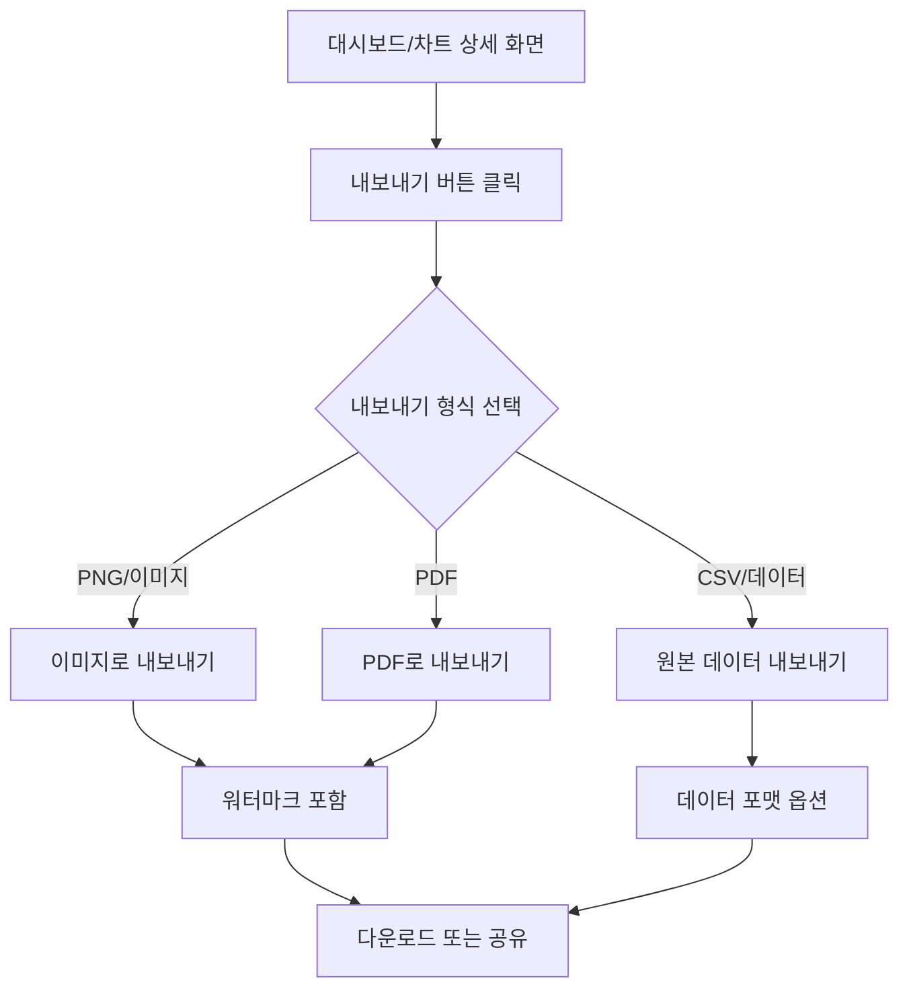
```mermaid
flowchart TD
    A[대시보드/차트 상세 화면] --> B[내보내기 버튼 클릭]
    B --> C{내보내기 형식 선택}
    C -->|PNG/이미지| D[이미지로 내보내기]
    C -->|PDF| E[PDF로 내보내기]
    C -->|CSV/데이터| F[원본 데이터 내보내기]
    
    D --> G[워터마크 포함]
    E --> G
    F --> H[데이터 포맷 옵션]
    
    G --> I[다운로드 또는 공유]
    H --> I
```

이 흐름은 product-spec.md의 "데이터 시각화를 통한 강의자료 및 분석자료 생성" 기능을 구체화합니다. 워터마크가 포함된 내보내기 기능은 브랜드 홍보와 전문성 확산에 기여합니다.

## 4. 상태 전이 및 인터랙션 패턴

### 4.1 데이터 로딩 상태 관리

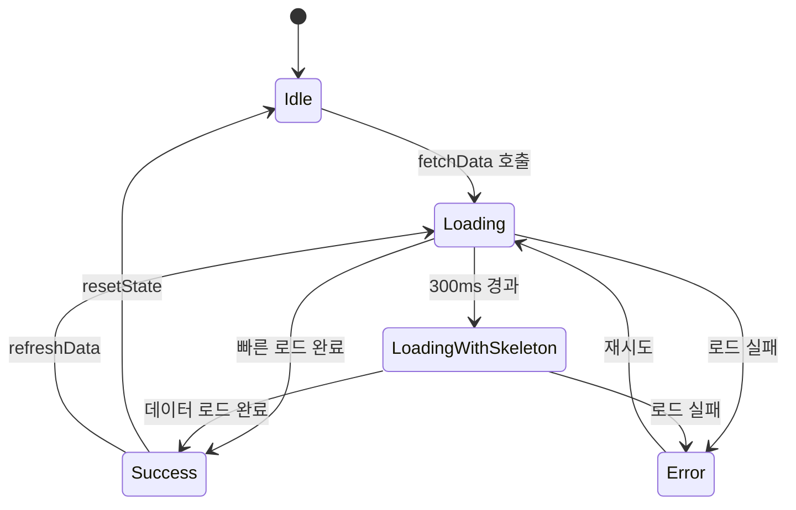
```mermaid
stateDiagram-v2
    [*] --> Idle
    Idle --> Loading: fetchData 호출
    Loading --> LoadingWithSkeleton: 300ms 경과
    Loading --> Success: 빠른 로드 완료
    LoadingWithSkeleton --> Success: 데이터 로드 완료
    Loading --> Error: 로드 실패
    LoadingWithSkeleton --> Error: 로드 실패
    Error --> Loading: 재시도
    Success --> Idle: resetState
    Success --> Loading: refreshData
```

**핵심 패턴:**

- Shadcn/UI의 Skeleton 컴포넌트 활용한 로딩 상태 표시
- Tanstack Query의 useQuery 상태 관리 활용
- 지연 로딩 시 스켈레톤 UI 단계적 표시 (300ms 임계값)
- 오류 상태의 명확한 시각적 표시
- 오류 발생 시 재시도 옵션 제공
- 데이터 캐싱 및 백그라운드 갱신

### 4.2 편집 모드 전환 패턴

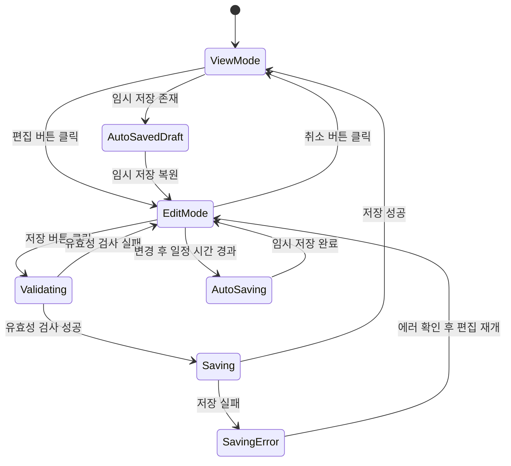
```mermaid
stateDiagram-v2
    [*] --> ViewMode
    ViewMode --> EditMode: 편집 버튼 클릭
    EditMode --> ViewMode: 취소 버튼 클릭
    EditMode --> Validating: 저장 버튼 클릭
    Validating --> EditMode: 유효성 검사 실패
    Validating --> Saving: 유효성 검사 성공
    Saving --> ViewMode: 저장 성공
    Saving --> SavingError: 저장 실패
    SavingError --> EditMode: 에러 확인 후 편집 재개
    
    ViewMode --> AutoSavedDraft: 임시 저장 존재
    AutoSavedDraft --> EditMode: 임시 저장 복원
    EditMode --> AutoSaving: 변경 후 일정 시간 경과
    AutoSaving --> EditMode: 임시 저장 완료
```

**핵심 패턴:**

- 뷰 모드와 편집 모드의 명확한 UI 구분
- Zustand 상태를 활용한 위젯 편집 상태 관리
- 위젯 유형별 유효성 검사를 통한 데이터 무결성 보장
- 차트형/텍스트형 위젯의 차별화된 검증 로직
- 자동 저장 (임시 저장) 기능 제공
- 취소 시 변경사항 폐기 확인 다이얼로그
- 저장 중/오류 상태의 명확한 피드백

### 4.3 드래그 앤 드롭 인터랙션

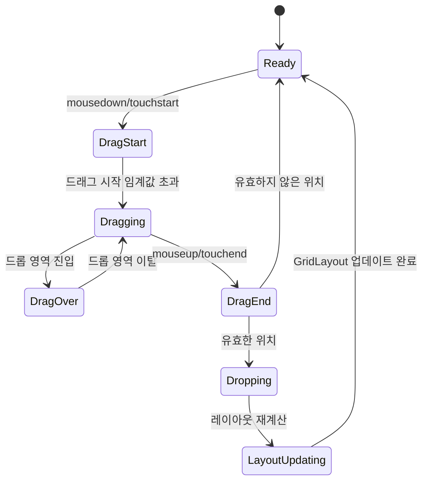
```mermaid
stateDiagram-v2
    [*] --> Ready
    Ready --> DragStart: mousedown/touchstart
    DragStart --> Dragging: 드래그 시작 임계값 초과
    Dragging --> DragOver: 드롭 영역 진입
    DragOver --> Dragging: 드롭 영역 이탈
    Dragging --> DragEnd: mouseup/touchend
    DragEnd --> Ready: 유효하지 않은 위치
    DragEnd --> Dropping: 유효한 위치
    Dropping --> LayoutUpdating: 레이아웃 재계산
    LayoutUpdating --> Ready: GridLayout 업데이트 완료
```

**핵심 패턴:**

- react-grid-layout의 onDragStart, onDrag, onDragStop 이벤트 활용
- 드래그 시작 시 시각적 피드백 (그림자 효과, 투명도 조정)
- 드래그 중 가이드라인 및 스냅 그리드 표시
- 드롭 가능 영역 하이라이트
- 드롭 후 애니메이션 효과로 자연스러운 전환
- 레이아웃 변경 사항 자동 저장 또는 명시적 저장 옵션

### 4.4 Zustand와 TanStack Query 통합 패턴

E-Torch는 Zustand 5를 활용한 클라이언트 상태 관리와 TanStack Query 5를 활용한 서버 상태 관리를 통합하는 패턴을 사용합니다:

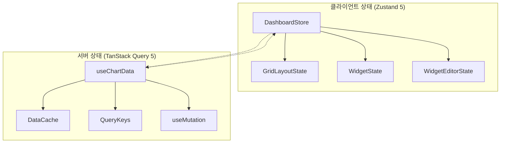
```mermaid
flowchart TD
    subgraph "클라이언트 상태 (Zustand 5)"
        Z1[DashboardStore] --> Z2[GridLayoutState]
        Z1 --> Z3[WidgetState]
        Z1 --> Z4[WidgetEditorState]
    end
    
    subgraph "서버 상태 (TanStack Query 5)"
        T1[useChartData] --> T2[DataCache]
        T1 --> T3[QueryKeys]
        T1 --> T4[useMutation]
    end
    
    Z1 -.-> T1
    T1 -.-> Z1
```

- **Zustand 스토어**: UI 상태, 에디터 상태, 레이아웃 상태 등 클라이언트 중심 상태 관리
- **TanStack Query**: 경제지표 데이터, 위젯 메타데이터, 대시보드 메타데이터 등 서버 데이터 상태 관리
- **상태 통합**: `useServerState` 및 `useClientState` 훅을 통한 상태 통합
- **낙관적 업데이트**: React 19의 `useOptimistic` 훅을 활용한 UI 즉시 응답

## 5. 오류 처리 및 예외 상황

> 구현 단계: 페이즈 2 (핵심 기능) → 페이즈 4 (고급 기능 및 최적화) (ROADMAP.md 참조)

### 5.1 MVP 단계 오류 처리 흐름

MVP 출시(2025-06-20)에서는 다음 핵심 오류 처리 흐름을 우선적으로 구현합니다:

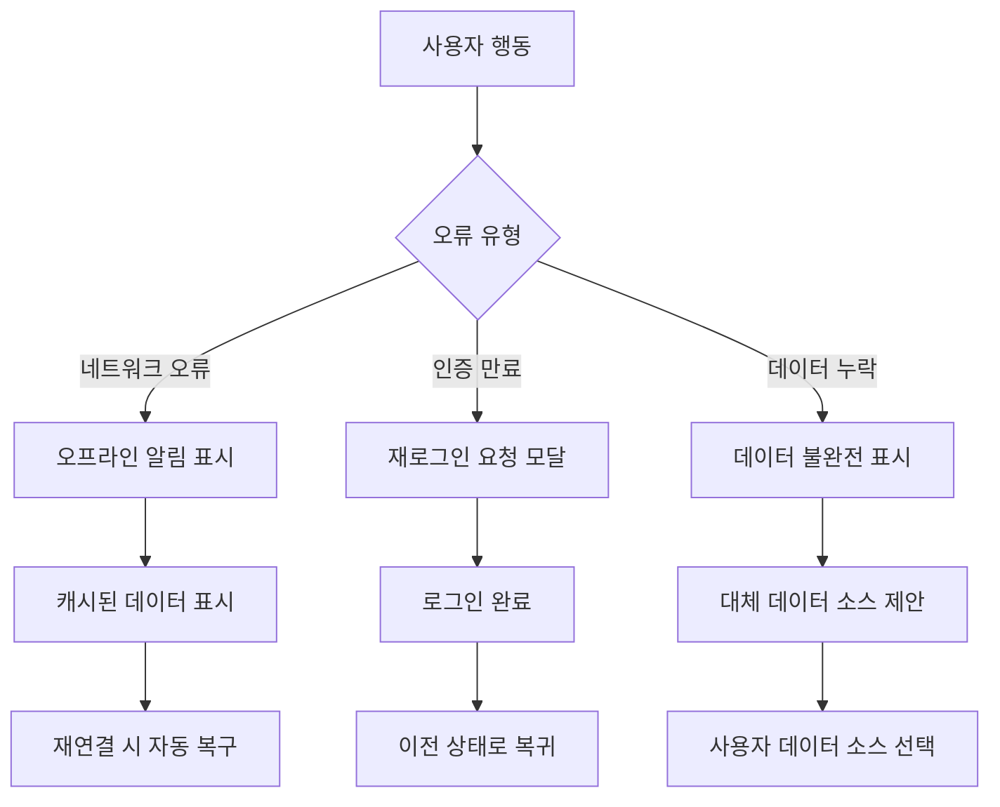
```mermaid
flowchart TD
    A[사용자 행동] --> B{오류 유형}
    
    B -->|네트워크 오류| C[오프라인 알림 표시]
    C --> D[캐시된 데이터 표시]
    D --> E[재연결 시 자동 복구]
    
    B -->|인증 만료| F[재로그인 요청 모달]
    F --> G[로그인 완료]
    G --> H[이전 상태로 복귀]
    
    B -->|데이터 누락| I[데이터 불완전 표시]
    I --> J[대체 데이터 소스 제안]
    J --> K[사용자 데이터 소스 선택]
```

### 5.2 오류 발생 시나리오 및 대응

| 오류 유형 | 발생 가능 상황 | 대응 방안 | UI 처리 |
|---------|--------------|---------|---------|
| 네트워크 오류 | API 요청 실패, 서버 다운 | 자동 재시도, 오프라인 캐시 활용 | 토스트 알림, 재시도 버튼 제공 |
| 인증 오류 | 토큰 만료, 권한 부족 | 재인증 유도, 권한 안내 | 모달 다이얼로그, 로그인 페이지 리다이렉션 |
| 데이터 유효성 오류 | 잘못된 입력값, 형식 오류 | 명확한 오류 메시지, 입력 가이드 | 인라인 오류 표시, 필드별 유효성 힌트 |
| 동시 편집 충돌 | 여러 사용자가 동일 위젯/대시보드 편집 | 낙관적 락, 충돌 해결 UI | 변경사항 병합 옵션, 충돌 알림 |
| 데이터 소스 제한 | API 호출 한도 초과, 권한 문제 | 사용량 표시, 대체 소스 제안 | 제한 안내 메시지, 업그레이드 유도 |
| 데이터 누락 | 지표 데이터 불완전, 갭 존재 | 보간법 적용, 누락 데이터 표시 | 점선 또는 특수 마커로 표시 |

### 5.3 예외 처리 전략

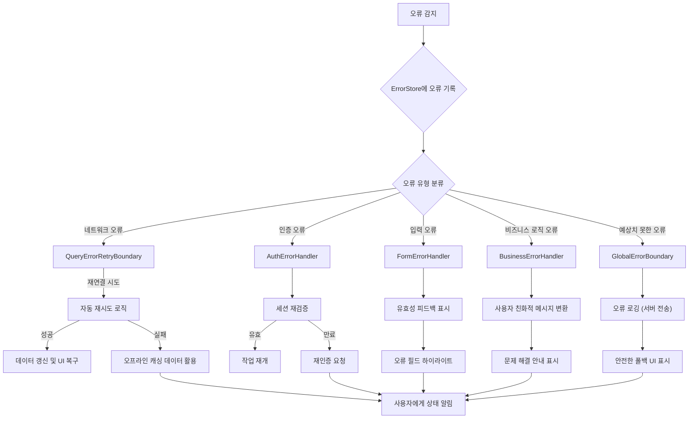
```mermaid
flowchart TD
    A[오류 감지] --> B{ErrorStore에 오류 기록}
    B --> C{오류 유형 분류}
    
    C -->|네트워크 오류| D[QueryErrorRetryBoundary]
    D -->|재연결 시도| E1[자동 재시도 로직]
    E1 -->|성공| F1[데이터 갱신 및 UI 복구]
    E1 -->|실패| G1[오프라인 캐싱 데이터 활용]
    
    C -->|인증 오류| D2[AuthErrorHandler]
    D2 --> E2[세션 재검증]
    E2 -->|유효| F2[작업 재개]
    E2 -->|만료| G2[재인증 요청]
    
    C -->|입력 오류| D3[FormErrorHandler]
    D3 --> E3[유효성 피드백 표시]
    E3 --> F3[오류 필드 하이라이트]
    
    C -->|비즈니스 로직 오류| D4[BusinessErrorHandler]
    D4 --> E4[사용자 친화적 메시지 변환]
    E4 --> F4[문제 해결 안내 표시]
    
    C -->|예상치 못한 오류| D5[GlobalErrorBoundary]
    D5 --> E5["오류 로깅 (서버 전송)"]
    E5 --> F5[안전한 폴백 UI 표시]
    
    G1 --> H[사용자에게 상태 알림]
    G2 --> H
    F3 --> H
    F4 --> H
    F5 --> H
```

**핵심 전략:**

- 다층적 오류 처리: 컴포넌트, 페이지, 애플리케이션 수준
- ErrorStore를 통한 중앙 오류 관리
- 사용자 친화적 오류 메시지 (technical details → solutions)
- React Error Boundary 활용한 컴포넌트 단위 격리
- Tanstack Query의 오류 처리 및 재시도 메커니즘 활용
- 점진적 성능 저하: 완전 실패보다 부분 기능 제한
- 자동 복구 메커니즘 및 대체 데이터 소스 활용

## 6. 접근성 고려사항

### 6.1 키보드 내비게이션

모든 주요 기능은 키보드만으로 접근 가능해야 합니다:

- Tab 키를 통한 포커스 이동
- Enter/Space 키를 통한 버튼 활성화
- 화살표 키를 통한 드롭다운 메뉴 탐색
- Esc 키를 통한 모달/팝업 닫기
- 단축키 제공: 저장(Ctrl+S), 취소(Esc), 도움말(F1) 등

**키보드 접근성 구현:**

- 모든 인터랙티브 요소에 적절한 tabIndex 속성 설정
- 포커스 트래핑: 모달, 드롭다운 등에서 포커스가 외부로 빠져나가지 않도록 제어
- 포커스 관리: 모달 열기/닫기 시 포커스 위치 관리
- 키보드 단축키 관리자 구현 및 문서화

### 6.2 스크린 리더 지원

WCAG 2.1 AA 기준을 충족하기 위한 스크린 리더 지원:

- 의미 있는 구조화: 적절한 HTML 시맨틱 요소 사용
- 모든 이미지 및 아이콘에 대체 텍스트 제공
- ARIA 레이블 및 역할 적절히 사용:
  - aria-label, aria-labelledby: 레이블 제공
  - aria-expanded, aria-hidden: 상태 정보 제공
  - aria-live: 동적 콘텐츠 변경 알림
- 차트 데이터에 대한 텍스트 대체 콘텐츠 제공:
  - 데이터 테이블 뷰 옵션
  - 주요 트렌드 및 인사이트 텍스트 요약
  - SVG 요소에 대한 적절한 ARIA 속성 설정

### 6.3 색상 및 대비

시각적 접근성을 위한 색상 및 대비 고려:

- WCAG 2.1 AA 수준 준수: 텍스트와 배경 간 4.5:1 이상의 대비
- 색상에만 의존하지 않는 정보 전달:
  - 아이콘, 패턴, 텍스트 레이블 병행
  - 색맹 사용자를 위한 차트 패턴 추가 옵션
- 높은 대비 모드 지원:
  - prefers-contrast 미디어 쿼리 대응
  - 대비 높은 테마 옵션 제공
- 색상 팔레트 최적화: ColorSafe 활용 접근성 검증

### 6.4 색상 및 테마 전략

E-Torch는 Tailwind CSS 4의 OKLCH 색상 시스템을 활용하여 더 넓은 색 영역과 인지적으로 균일한 밝기를 제공합니다:

```tsx
// 색상에 의존하지 않는 상태 표시 컴포넌트 예시
function StatusIndicator({ 
  status, 
  label 
}: StatusIndicatorProps) {
  // 테마 변수를 활용한 OKLCH 색상 적용
  return (
    <div className={`status-indicator bg-${status} text-${status}-foreground`}>
      <span className="status-icon" aria-hidden="true" />
      <span>{label}</span>
    </div>
  )
}
```

### 6.5 반응형 디자인

다양한 기기 및 화면 크기에 대응:

- 모바일 우선 접근 방식
- 적응형 레이아웃: 그리드 시스템 활용
- 터치 타겟 최적화: 모바일에서 최소 44x44px 터치 영역
- 콘텐츠 재배치: 화면 크기에 따른 컴포넌트 재배치
- 기능 우선순위: 작은 화면에서 핵심 기능 우선 표시
- 제스처 지원: 스와이프, 핀치 줌 등 모바일 제스처 활용
