# E-Torch 사용자 흐름(User Flows)

## 목차

- [1. 개요](#1-개요)
- [2. 사용자 페르소나](#2-사용자-페르소나)
- [3. 핵심 사용자 흐름](#3-핵심-사용자-흐름)
  - [3.1 온보딩 및 로그인 흐름](#31-온보딩-및-로그인-흐름)
  - [3.2 대시보드 관리 흐름](#32-대시보드-관리-흐름)
  - [3.3 차트 생성 및 편집 흐름](#33-차트-생성-및-편집-흐름)
  - [3.4 데이터 소스 조회 및 분석 흐름](#34-데이터-소스-조회-및-분석-흐름)
  - [3.5 데이터 비교 분석 흐름](#35-데이터-비교-분석-흐름)
  - [3.6 대시보드 공유 및 구독 흐름](#36-대시보드-공유-및-구독-흐름)
  - [3.7 구독 및 결제 관리 흐름](#37-구독-및-결제-관리-흐름)
- [4. 상태 전이 및 인터랙션 패턴](#4-상태-전이-및-인터랙션-패턴)
- [5. 오류 처리 및 예외 상황](#5-오류-처리-및-예외-상황)
- [6. 접근성 고려사항](#6-접근성-고려사항)

## 1. 개요

본 문서는 E-Torch 경제지표 대시보드 서비스의 사용자 흐름(User Flows)을 설계하기 위한 지침을 제공합니다. 각 핵심 기능에 대한 사용자 경험 흐름을 정의하여 프론트엔드 개발 시 일관된 UX를 구현할 수 있도록 합니다.

**목표:**

- 직관적이고 효율적인 사용자 경험 제공
- 다양한 경제지표 데이터에 대한 접근성 향상
- 전문가와 일반 사용자 모두를 위한 인터페이스 설계
- 데이터 시각화 및 인사이트 발견 과정 최적화
- 공유 및 협업 기능 강화

## 2. 사용자 페르소나

E-Torch의 핵심 사용자 페르소나는 다음과 같이 구분됩니다:

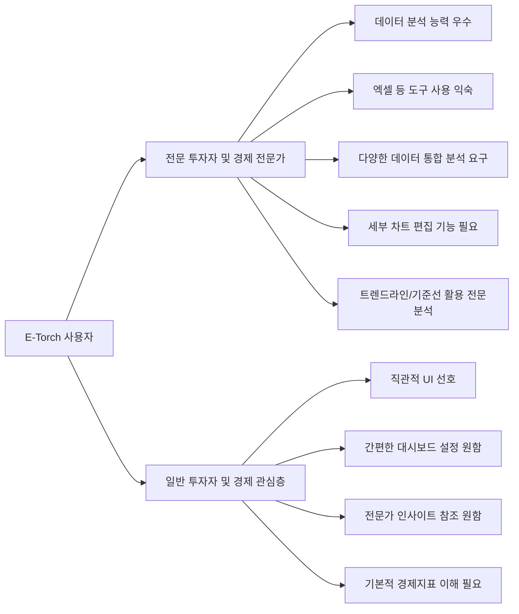

각 페르소나의 주요 사용 목적과 행동 패턴을 고려하여 사용자 흐름을 설계합니다.

## 3. 핵심 사용자 흐름

### 3.1 온보딩 및 로그인 흐름

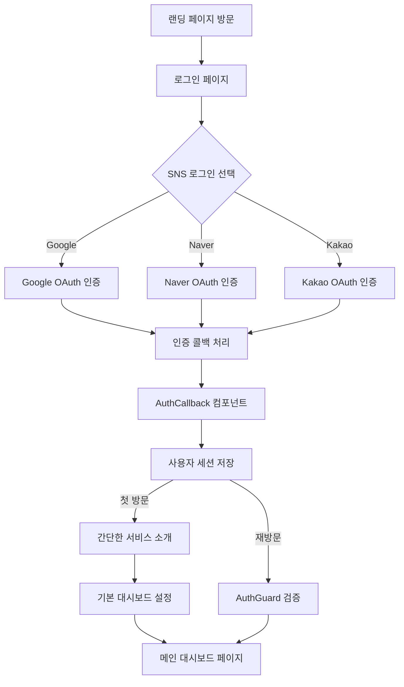

**핵심 특징:**

- SNS 로그인만 지원(자체 회원가입 없음): Google, Naver, Kakao
- Supabase Auth를 활용한 인증 시스템 연동
- AuthCallback 컴포넌트를 통한 인증 정보 처리
- AuthGuard 컴포넌트를 통한 보호된 경로 접근 제어
- 첫 방문 사용자를 위한 간단한 서비스 소개 및 기본 대시보드 제공
- 재방문 사용자는 이전 세션 상태 복원

**상세 단계:**

1. 사용자가 랜딩 페이지에서 로그인 버튼 클릭
2. 로그인 화면에서 원하는 SNS 로그인 방식 선택
3. 선택한 SNS 인증 페이지에서 로그인 및 권한 승인
4. 인증 콜백을 통해 E-Torch로 리다이렉션
5. AuthCallback 컴포넌트에서 인증 토큰 검증 및 사용자 세션 저장
6. 첫 방문 사용자에게는 간단한 서비스 소개 및 기본 대시보드 설정 제공
7. 재방문 사용자는 AuthGuard를 통해 인증 상태 검증 후 이전에 사용하던 대시보드로 이동

### 3.2 대시보드 관리 흐름

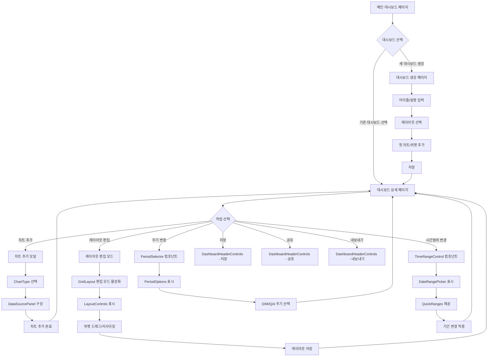

**핵심 특징:**

- react-grid-layout 기반의 유연한 대시보드 레이아웃 관리
- GridLayout, GridItem 컴포넌트를 통한 위젯 배치
- DashboardControls 컴포넌트를 통한 통합 제어
- TimeRangeControl: 시간 범위 선택 (최근 1년, 최근 3년, 커스텀 범위 등)
- PeriodSelector: 데이터 주기 선택 (일간-D, 월간-M, 분기-Q, 연간-A)
- 위젯 유형: ChartItem, TextItem 등 다양한 컨텐츠 지원

**상세 단계:**

1. 메인 대시보드 페이지에서 새 대시보드 생성 또는 기존 대시보드 선택
2. 새 대시보드 생성 시:
   - 타이틀 및 설명 입력 (PanelOptions 활용)
   - 기본 레이아웃 템플릿 선택 (GridLayout presets 활용)
   - 첫 차트/위젯 추가 (ChartItem 또는 TextItem)
3. 대시보드 상세 페이지에서:
   - 차트/위젯 추가: 모달을 통해 차트 유형과 데이터 소스 선택
   - 레이아웃 편집: LayoutControls를 통한 정렬, 간격 조정, 위젯 잠금 등 제어
   - 드래그 앤 드롭: GridItem 컴포넌트의 드래그 및 리사이즈 기능 활용
   - 시간 범위 변경: TimeRangeControl 컴포넌트를 통한 통합 시간 범위 설정
   - 주기 변경: PeriodSelector 컴포넌트를 통한 데이터 주기 설정
   - 대시보드 저장: 변경사항 저장 (자동 저장 또는 명시적 저장)
   - 대시보드 공유: 링크 생성 또는 권한 설정
   - 대시보드 내보내기: PNG, PDF 등으로 내보내기 (워터마크 포함)

### 3.3 차트 생성 및 편집 흐름

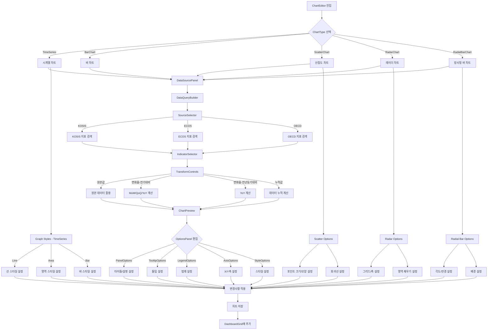

**핵심 특징:**

- 다양한 차트 유형별 전용 컴포넌트 제공
- 차트 유형별 특화된 옵션 패널 (UI 요구사항 명세 기반)
- 실시간 차트 미리보기 및 인터랙티브 편집
- 데이터 소스 통합 및 데이터 변환 파이프라인
- 단계별 편집 과정 및 저장 체계

**상세 단계:**

1. ChartEditor 컴포넌트 진입 (새 차트 생성 또는 기존 차트 편집)
2. ChartType 선택:
   - TimeSeries: 시계열 차트 (LineChart, AreaChart, BarChart)
   - BarChart: 바 차트
   - ScatterChart: 산점도 차트
   - RadarChart: 레이더 차트
   - RadialBarChart: 방사형 바 차트
3. DataSourcePanel을 통한 데이터 소스 설정:
   - SourceSelector: 데이터 출처 선택 (KOSIS, ECOS, OECD)
   - IndicatorSelector: 지표 검색 및 선택
   - TransformControls: 데이터 변환 설정
     - 원본값: 가공 없이 원본 데이터 사용
     - 변화율(전기대비): 직전 기간 대비 변화율
     - 변화율(전년동기대비): 전년 동일 기간 대비 변화율
     - 누적값: 시간 경과에 따른 누적값
4. ChartPreview를 통한 실시간 미리보기
5. OptionsPanel을 통한 차트 옵션 편집:
   - PanelOptions: 제목, 설명, 배경 투명도 설정 (PO-001~003)
   - TooltipOptions: 툴팁 표시 방식, 커서 스타일 설정 (TO-001~005)
   - LegendOptions: 범례 표시, 레이아웃, 정렬 설정 (LG-001~004)
   - AxisOptions: X축/Y축 범위, 눈금, 레이블 설정 (XA-001~010, YA-001~011)
   - StyleOptions: 차트 유형별 스타일 설정
6. 차트 유형별 특화 옵션:
   - TimeSeries: Line/Area/Bar 스타일 선택 및 설정 (GS-001~003)
   - ScatterChart: 포인트 크기/모양, 회귀선 설정 (SC-001~006)
   - RadarChart: 그리드 모양, 축 선, 영역 채우기 설정 (RC-001~006)
   - RadialBarChart: 각도, 반지름, 배경 설정 (RB-001~010)
7. 차트 저장 및 대시보드에 추가

### 3.4 데이터 소스 조회 및 분석 흐름

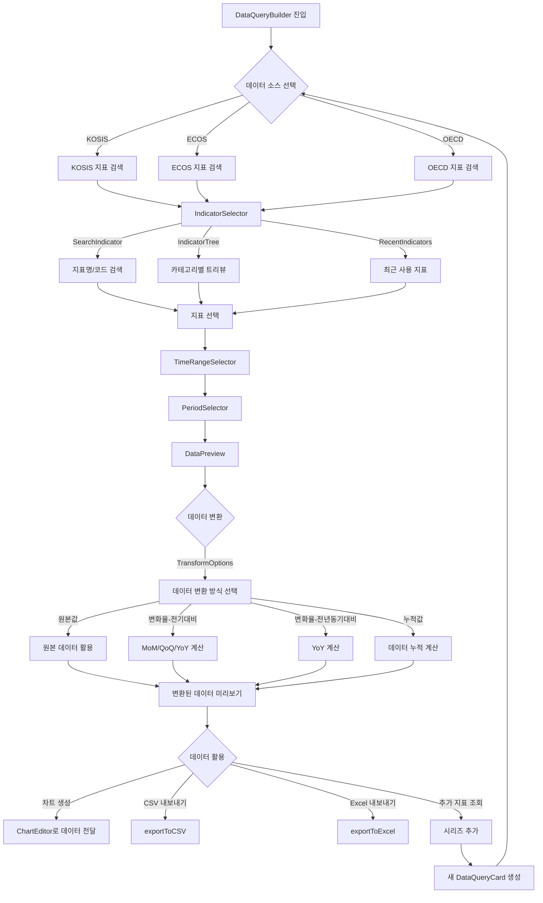

**핵심 특징:**

- 통합 데이터 조회 시스템 (KOSIS, ECOS, OECD)
- 지표 검색 및 선택 인터페이스
- 기간 및 주기 설정 컴포넌트
- 데이터 변환 및 미리보기 기능
- 다양한 데이터 활용 옵션

**상세 단계:**

1. DataQueryBuilder 컴포넌트 진입
2. SourceSelector를 통한 데이터 소스 선택 (DS-001):
   - KOSIS: 통계청 국가통계포털
   - ECOS: 한국은행 경제통계시스템
   - OECD: 경제협력개발기구 데이터
3. IndicatorSelector를 통한 지표 검색 및 선택 (DS-002~003):
   - SearchIndicator: 지표명 또는 코드로 검색
   - IndicatorTree: 카테고리별 계층적 트리뷰
   - RecentIndicators: 최근 사용한 지표 목록
4. TimeRangeSelector를 통한 조회 기간 설정 (CS-001):
   - DateRangePicker: 시작일~종료일 직접 지정
   - QuickRanges: 최근 1년, 최근 3년 등 빠른 범위 선택
5. PeriodSelector를 통한 조회 주기 선택 (CS-002):
   - 일간(D): 일별 데이터 (주로 ECOS 금융 데이터)
   - 월간(M): 월별 데이터 (KOSIS, ECOS, OECD)
   - 분기(Q): 분기별 데이터 (GDP 등)
   - 연간(A): 연간 데이터 (장기 지표)
6. DataPreview를 통한 조회 결과 미리보기
7. TransformControls를 통한 데이터 변환 (DS-008):
   - 원본값: 가공 없이 원본 데이터 사용
   - 변화율(전기대비): 직전 기간 대비 변화율 계산
   - 변화율(전년동기대비): 전년 동일 기간 대비 변화율 계산
   - 누적값: 시간 경과에 따른 누적값 계산
8. 데이터 활용:
   - 차트 생성: 변환된 데이터로 차트 생성 (ChartEditor 연동)
   - CSV/Excel 내보내기: 데이터 로컬 저장
   - 시리즈 추가: 추가 지표 조회 (AS-001, 최대 5개 시리즈 지원)

### 3.5 데이터 비교 분석 흐름

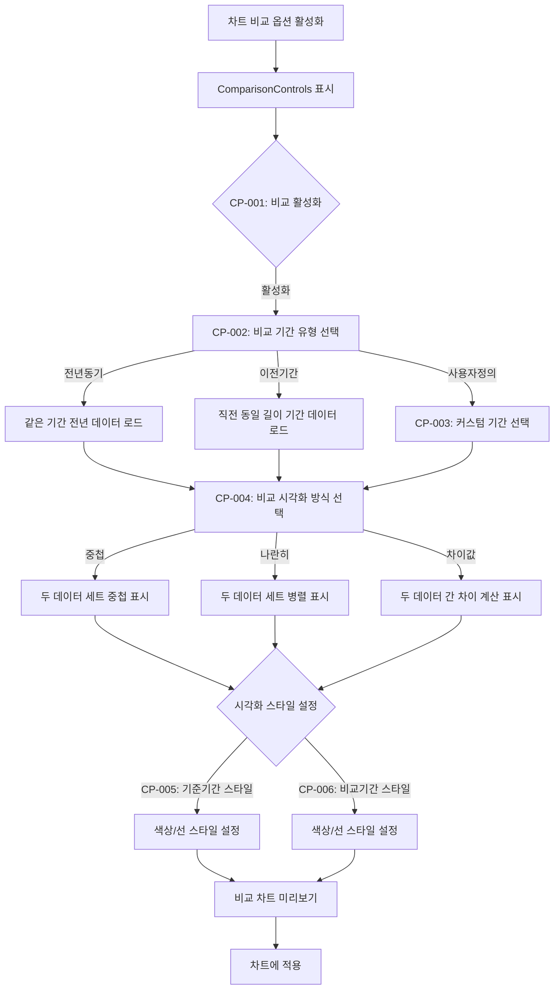

**핵심 특징:**

- 기간별 데이터 비교 기능 (UI 요구사항 명세 CP-001~006)
- 다양한 비교 유형 지원: 전년동기, 이전기간, 사용자정의
- 비교 시각화 방식: 중첩, 나란히, 차이값
- 스타일 커스터마이징으로 시각적 구분 명확화
- Time Series, Bar Chart 등 주요 차트 유형 지원

**상세 단계:**

1. 차트 비교 옵션 활성화 (CP-001)
2. ComparisonControls 컴포넌트 표시
3. 비교 기간 유형 선택 (CP-002):
   - 전년동기: 선택한 기간과 같은 기간의 전년 데이터 비교
   - 이전기간: 선택한 기간 직전의 동일한 길이의 기간 데이터 비교
   - 사용자정의: 직접 비교 기간 지정 (CP-003)
4. 비교 시각화 방식 선택 (CP-004):
   - 중첩: 두 데이터 세트를 하나의 차트에 중첩하여 표시
   - 나란히: 두 데이터 세트를 나란히 배치하여 비교
   - 차이값: 두 데이터 간의 차이를 계산하여 표시
5. 시각화 스타일 설정:
   - 기준기간 스타일 (CP-005): 색상, 선 스타일 등 설정
   - 비교기간 스타일 (CP-006): 색상, 선 스타일 등 설정
6. 비교 차트 미리보기 및 적용

### 3.6 대시보드 공유 및 구독 흐름

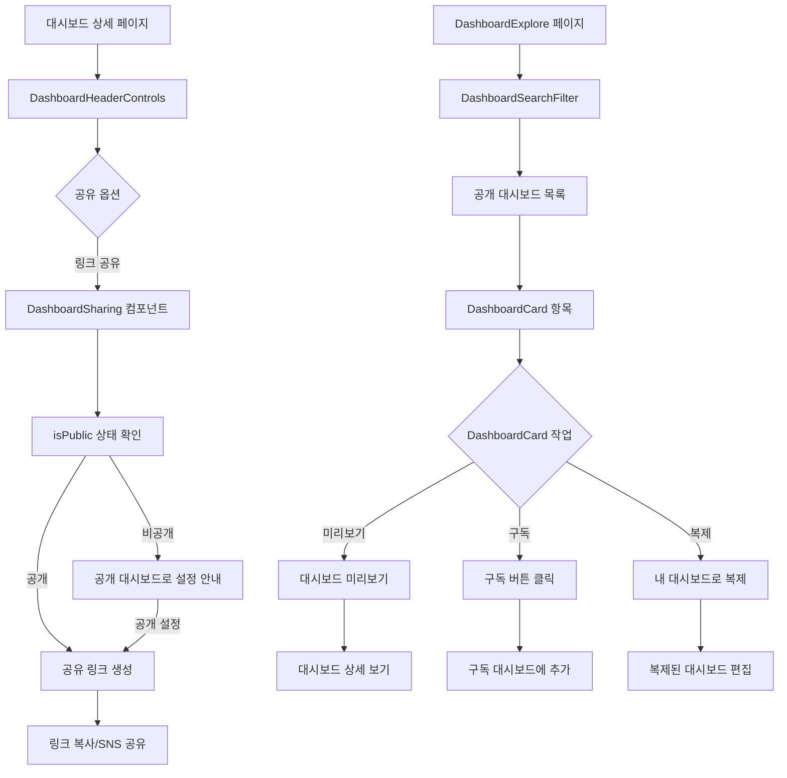

**핵심 특징:**

- 대시보드 공유 기능: 링크 생성, 공개/비공개 설정
- DashboardExplore를 통한 공개 대시보드 탐색
- 카테고리 필터 및 검색 기능
- DashboardCard를 통한 직관적인 목록 표시
- 구독 및 복제 기능으로 확장성 제공

**상세 단계:**

1. 대시보드 상세 페이지에서 DashboardHeaderControls의 공유 옵션 선택
2. DashboardSharing 컴포넌트를 통한 공유 설정:
   - isPublic 상태 확인 및 설정
   - 공개 설정 시 공유 링크 생성
   - 링크 복사 및 SNS 공유 옵션
3. DashboardExplore 페이지에서 공개 대시보드 탐색:
   - DashboardSearchFilter를 통한 검색 및 필터링
   - 카테고리, 인기도, 최신순 등 정렬 옵션
4. DashboardCard를 통한 대시보드 항목 표시:
   - 타이틀, 설명, 썸네일 이미지, 작성자 정보
   - 구독자 수, 평점 등 메타데이터
5. 대시보드 작업:
   - 미리보기: ThumbnailPreview 컴포넌트를 통한 미리보기
   - 구독: 구독 추가하여 업데이트 받기 (전문가의 지속적 인사이트)
   - 복제: 내 대시보드로 복사하여 자유롭게 편집 가능

### 3.7 구독 및 결제 관리 흐름

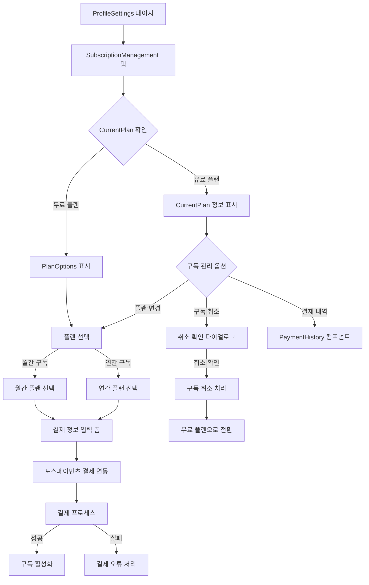

**핵심 특징:**

- 명확한 무료/유료 플랜 구분
- CurrentPlan 컴포넌트를 통한 현재 구독 정보 표시
- PlanOptions 컴포넌트를 통한 다양한 플랜 옵션 제공
- 토스페이먼츠 결제 연동
- PaymentHistory를 통한 결제 내역 관리

**상세 단계:**

1. ProfileSettings 페이지에서 SubscriptionManagement 탭 접근
2. CurrentPlan 컴포넌트를 통한 현재 구독 상태 확인:
   - 무료 플랜: 제한된 기능, 유료 플랜 혜택 안내
   - 유료 플랜: 구독 상세 정보, 다음 결제일, 이용료 표시
3. 구독 플랜 선택:
   - 월간 구독 (₩9,900/월): 모든 기능 이용, 월 단위 결제
   - 연간 구독 (₩94,900/년): 할인된 가격, 연 단위 결제
4. 결제 프로세스:
   - 결제 정보 입력 (토스페이먼츠 양식)
   - 결제 진행 및 확인
   - 성공/실패 처리
5. 구독 관리:
   - 플랜 변경: 월간/연간 플랜 간 전환 또는 업그레이드
   - 구독 취소: 취소 확인 및 무료 플랜으로 전환
   - 결제 내역: PaymentHistory 컴포넌트를 통한 과거 결제 내역 조회

## 4. 상태 전이 및 인터랙션 패턴

### 데이터 로딩 상태 관리

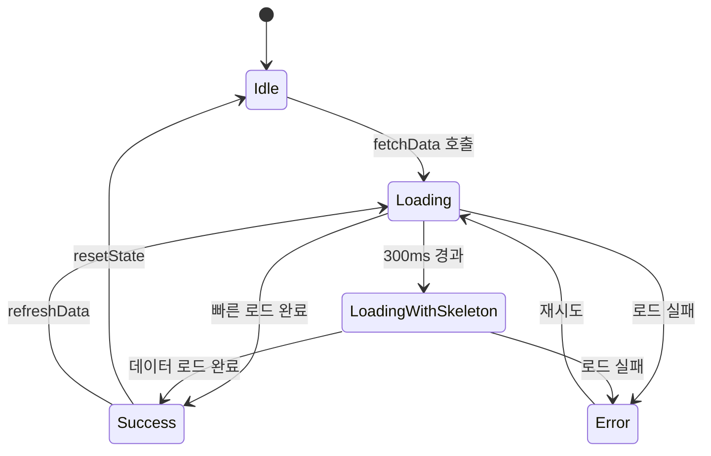

**핵심 패턴:**

- Shadcn/UI의 Skeleton 컴포넌트 활용한 로딩 상태 표시
- Tanstack Query의 useQuery 상태 관리 활용
- 지연 로딩 시 스켈레톤 UI 단계적 표시 (300ms 임계값)
- 오류 상태의 명확한 시각적 표시
- 오류 발생 시 재시도 옵션 제공
- 데이터 캐싱 및 백그라운드 갱신

### 편집 모드 전환 패턴

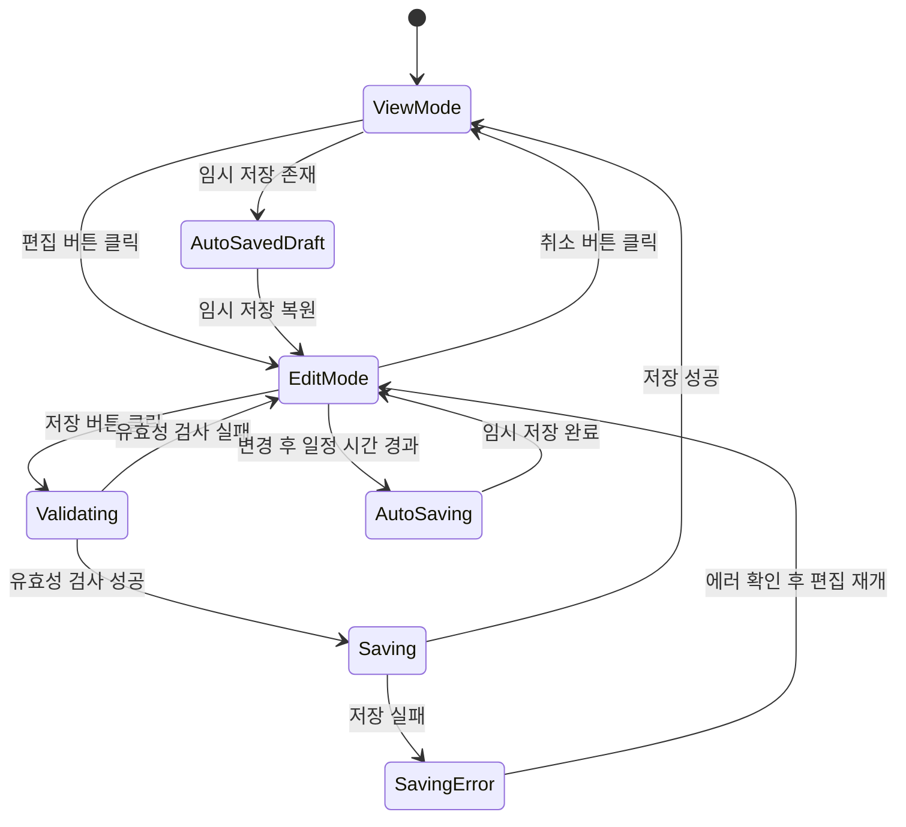

**핵심 패턴:**

- 뷰 모드와 편집 모드의 명확한 UI 구분
- Zustand 상태를 활용한 편집 상태 관리
- 유효성 검사 단계를 통한 데이터 무결성 보장
- 자동 저장 (임시 저장) 기능 제공
- 취소 시 변경사항 폐기 확인 다이얼로그
- 저장 중/오류 상태의 명확한 피드백

### 드래그 앤 드롭 인터랙션

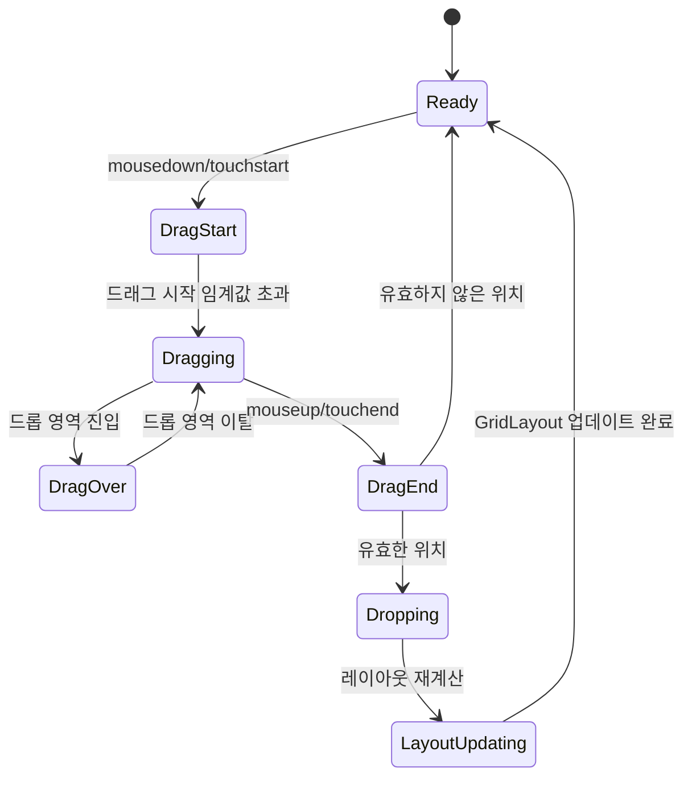

**핵심 패턴:**

- react-grid-layout의 onDragStart, onDrag, onDragStop 이벤트 활용
- 드래그 시작 시 시각적 피드백 (그림자 효과, 투명도 조정)
- 드래그 중 가이드라인 및 스냅 그리드 표시
- 드롭 가능 영역 하이라이트
- 드롭 후 애니메이션 효과로 자연스러운 전환
- 레이아웃 변경 사항 자동 저장 또는 명시적 저장 옵션

## 5. 오류 처리 및 예외 상황

### 오류 발생 시나리오 및 대응

| 오류 유형 | 발생 가능 상황 | 대응 방안 | UI 처리 |
|---------|--------------|---------|---------|
| 네트워크 오류 | API 요청 실패, 서버 다운 | 자동 재시도, 오프라인 캐시 활용 | 토스트 알림, 재시도 버튼 제공 |
| 인증 오류 | 토큰 만료, 권한 부족 | 재인증 유도, 권한 안내 | 모달 다이얼로그, 로그인 페이지 리다이렉션 |
| 데이터 유효성 오류 | 잘못된 입력값, 형식 오류 | 명확한 오류 메시지, 입력 가이드 | 인라인 오류 표시, 필드별 유효성 힌트 |
| 동시 편집 충돌 | 여러 사용자가 동일 리소스 편집 | 낙관적 락, 충돌 해결 UI | 변경사항 병합 옵션, 충돌 알림 |
| 데이터 소스 제한 | API 호출 한도 초과, 권한 문제 | 사용량 표시, 대체 소스 제안 | 제한 안내 메시지, 업그레이드 유도 |
| 데이터 누락 | 지표 데이터 불완전, 갭 존재 | 보간법 적용, 누락 데이터 표시 | 점선 또는 특수 마커로 표시 |

### 예외 처리 전략

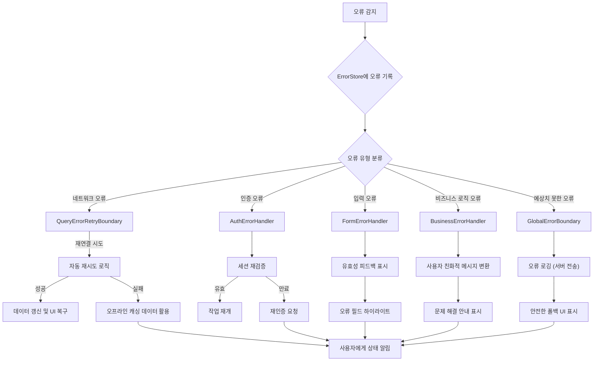

**핵심 전략:**

- 다층적 오류 처리: 컴포넌트, 페이지, 애플리케이션 수준
- ErrorStore를 통한 중앙 오류 관리
- 사용자 친화적 오류 메시지 (technical details → solutions)
- React Error Boundary 활용한 컴포넌트 단위 격리
- Tanstack Query의 오류 처리 및 재시도 메커니즘 활용
- 점진적 성능 저하: 완전 실패보다 부분 기능 제한
- 자동 복구 메커니즘 및 대체 데이터 소스 활용

## 6. 접근성 고려사항

### 키보드 내비게이션

모든 주요 기능은 키보드만으로 접근 가능해야 합니다:

- Tab 키를 통한 포커스 이동
- Enter/Space 키를 통한 버튼 활성화
- 화살표 키를 통한 드롭다운 메뉴 탐색
- Esc 키를 통한 모달/팝업 닫기
- 단축키 제공: 저장(Ctrl+S), 취소(Esc), 도움말(F1) 등

**키보드 접근성 구현:**

- 모든 인터랙티브 요소에 적절한 tabIndex 속성 설정
- 포커스 트래핑: 모달, 드롭다운 등에서 포커스가 외부로 빠져나가지 않도록 제어
- 포커스 관리: 모달 열기/닫기 시 포커스 위치 관리
- 키보드 단축키 관리자 구현 및 문서화

### 스크린 리더 지원

WCAG 2.1 AA 기준을 충족하기 위한 스크린 리더 지원:

- 의미 있는 구조화: 적절한 HTML 시맨틱 요소 사용
- 모든 이미지 및 아이콘에 대체 텍스트 제공
- ARIA 레이블 및 역할 적절히 사용:
  - aria-label, aria-labelledby: 레이블 제공
  - aria-expanded, aria-hidden: 상태 정보 제공
  - aria-live: 동적 콘텐츠 변경 알림
- 차트 데이터에 대한 텍스트 대체 콘텐츠 제공:
  - 데이터 테이블 뷰 옵션
  - 주요 트렌드 및 인사이트 텍스트 요약
  - SVG 요소에 대한 적절한 ARIA 속성 설정

### 색상 및 대비

시각적 접근성을 위한 색상 및 대비 고려:

- WCAG 2.1 AA 수준 준수: 텍스트와 배경 간 4.5:1 이상의 대비
- 색상에만 의존하지 않는 정보 전달:
  - 아이콘, 패턴, 텍스트 레이블 병행
  - 색맹 사용자를 위한 차트 패턴 추가 옵션
- 높은 대비 모드 지원:
  - prefers-contrast 미디어 쿼리 대응
  - 대비 높은 테마 옵션 제공
- 색상 팔레트 최적화: ColorSafe 활용 접근성 검증

### 반응형 디자인

다양한 기기 및 화면 크기에 대응:

- 모바일 우선 접근 방식
- 적응형 레이아웃: 그리드 시스템 활용
- 터치 타겟 최적화: 모바일에서 최소 44x44px 터치 영역
- 콘텐츠 재배치: 화면 크기에 따른 컴포넌트 재배치
- 기능 우선순위: 작은 화면에서 핵심 기능 우선 표시
- 제스처 지원: 스와이프, 핀치 줌 등 모바일 제스처 활용
