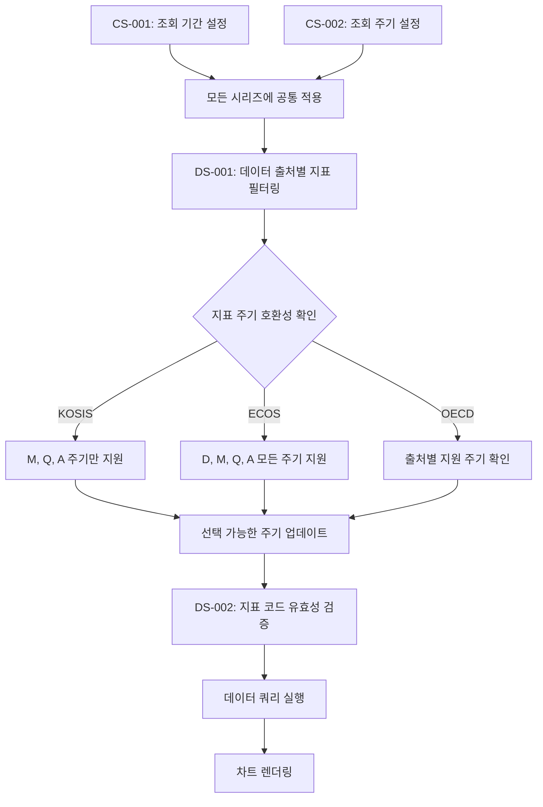

# E-Torch 사용자 흐름(User Flows)

## 목차

- [1. 개요](#1-개요)
- [2. 사용자 페르소나](#2-사용자-페르소나)
- [3. 핵심 사용자 흐름](#3-핵심-사용자-흐름)
  - [3.1 온보딩 및 로그인 흐름](#31-온보딩-및-로그인-흐름)
  - [3.2 대시보드 관리 흐름](#32-대시보드-관리-흐름)
  - [3.3 위젯 생성 및 편집 흐름](#33-위젯-생성-및-편집-흐름)
  - [3.4 데이터 소스 조회 및 분석 흐름](#34-데이터-소스-조회-및-분석-흐름)
  - [3.5 데이터 비교 분석 흐름](#35-데이터-비교-분석-흐름)
  - [3.6 대시보드 공유 및 구독 흐름](#36-대시보드-공유-및-구독-흐름)
  - [3.7 구독 및 결제 관리 흐름](#37-구독-및-결제-관리-흐름)
  - [3.8 대시보드 발견 및 구독 흐름](#38-대시보드-발견-및-구독-흐름)
  - [3.9 모바일 사용자 경험 흐름](#39-모바일-사용자-경험-흐름)
  - [3.10 데이터 내보내기 및 공유 흐름](#310-데이터-내보내기-및-공유-흐름)
- [4. 상태 전이 및 인터랙션 패턴](#4-상태-전이-및-인터랙션-패턴)
- [5. 오류 처리 및 예외 상황](#5-오류-처리-및-예외-상황)
- [6. 접근성 고려사항](#6-접근성-고려사항)

## 1. 개요

본 문서는 E-Torch 경제지표 대시보드 서비스의 사용자 흐름(User Flows)을 설계하기 위한 지침을 제공합니다. 각 핵심 기능에 대한 사용자 경험 흐름을 정의하여 프론트엔드 개발 시 일관된 UX를 구현할 수 있도록 합니다.

**목표:**

- 직관적이고 효율적인 사용자 경험 제공
- 다양한 경제지표 데이터에 대한 접근성 향상
- 전문가와 일반 사용자 모두를 위한 인터페이스 설계
- 데이터 시각화 및 인사이트 발견 과정 최적화
- 공유 및 협업 기능 강화

> 관련 문서:
>
> - [product-spec.md](../product-spec.md) - 서비스 기획서
> - [ui-requirements.md](./ui-requirements.md) - UI 요구사항 명세서
> - [design-system.md](./design-system.md) - 디자인 시스템 가이드
> - [architecture.md](../frontend/architecture.md) - 프론트엔드 아키텍처 설계

## 2. 사용자 페르소나

E-Torch의 핵심 사용자 페르소나는 다음과 같이 구분됩니다:


### 2.1 페르소나별 주요 사용자 흐름

#### 전문 투자자 및 경제 전문가 흐름

전문 투자자는 주로 다음과 같은 흐름으로 서비스를 활용합니다:

1. **데이터 통합 분석 흐름**: 여러 데이터 소스를 결합한 복합 위젯 생성 (3.3, 3.4, 3.5 섹션 참조)
2. **세부 위젯 커스터마이징 흐름**: 트렌드라인, 기준선 등 고급 분석 도구 활용 (3.3 섹션 참조)
3. **전문 대시보드 배포 흐름**: 분석 결과를 대시보드로 구성하여 공유 (3.6 섹션 참조)
4. **데이터 내보내기 흐름**: 분석 자료 및 강의 자료로 활용 (3.10 섹션 참조)

#### 일반 투자자 및 경제 관심층 흐름

일반 투자자는 주로 다음과 같은 흐름으로 서비스를 활용합니다:

1. **템플릿 활용 흐름**: 사전 구성된 대시보드 템플릿 선택 및 커스터마이징
2. **전문가 대시보드 구독 흐름**: 전문가가 제작한 대시보드 구독 및 활용 (3.6, 3.8 섹션 참조)
3. **간편 시각화 흐름**: 직관적 UI를 통한 간단한 위젯 생성 (3.3 섹션 간소화 버전)
4. **모바일 경험 흐름**: 모바일 기기에서의 대시보드 조회 및 활용 (3.9 섹션 참조)

각 페르소나의 주요 사용 목적과 행동 패턴을 고려하여 사용자 흐름을 설계합니다.

## 3. 핵심 사용자 흐름

### 3.1 온보딩 및 로그인 흐름

> 관련 와이어프레임: [로그인 화면](./wireframes/login-wireframe.svg)  
> 관련 컴포넌트: AuthCallback, AuthGuard (packages/state/src/providers/auth-provider.tsx)  
> 구현 단계: 페이즈 1 (기반 구축) - 인증 시스템 (ROADMAP.md 참조)


**핵심 특징:**

- SNS 로그인만 지원(자체 회원가입 없음): Google, Naver, Kakao (UP-001)
- Supabase Auth를 활용한 인증 시스템 연동
- AuthCallback 컴포넌트를 통한 인증 정보 처리
- AuthGuard 컴포넌트를 통한 보호된 경로 접근 제어
- 첫 방문 사용자를 위한 간단한 서비스 소개 및 기본 대시보드 제공
- 재방문 사용자는 이전 세션 상태 복원

#### 3.1.1 상세 온보딩 경험 흐름


이 흐름은 새 사용자의 온보딩 경험을 상세히 설명하여 초기 사용자 학습 곡선을 완화합니다.

### 3.2 대시보드 관리 흐름

> 관련 와이어프레임: [대시보드 화면](./wireframes/dashboard-wireframe.svg), [대시보드 편집기](./wireframes/dashboard-editor-wireframe.svg)  
> 관련 UI 요구사항: DL-001~005(대시보드 목록), DV-001~006(대시보드 상세), DE-001~009(대시보드 편집)  
> 관련 컴포넌트: DashboardComponent, DashboardGrid, GridItem (packages/dashboard/components/)  
> 구현 단계: 페이즈 2 (핵심 기능) - 대시보드 시스템 (ROADMAP.md 참조)


**핵심 특징:**

- react-grid-layout 기반의 유연한 대시보드 레이아웃 관리
- GridLayout, GridItem 컴포넌트를 통한 위젯 배치
- DashboardControls 컴포넌트를 통한 통합 제어
- TimeRangeControl (DV-001): 시간 범위 선택 기능
- 자동 새로고침 (DV-003): 설정된 간격으로 데이터 갱신
- 위젯 유형: ChartWidget, TextWidget 등 다양한 컨텐츠 지원

### 3.3 위젯 생성 및 편집 흐름

> 관련 와이어프레임: [위젯 편집기](./wireframes/widget-editor-wireframe.svg)  
> 관련 UI 요구사항: WM-001~007(위젯 관리), PO-001~003(패널 옵션), TO-001~005(툴팁 옵션), GS-001~004(그래프 스타일) 등  
> 관련 컴포넌트: WidgetEditor, WidgetPreview, OptionsPanel (packages/widgets/src/editor/)  
> 구현 단계: 페이즈 2 (핵심 기능) - 차트 컴포넌트 (ROADMAP.md 참조)

```mermaid
flowchart TD
    A[WidgetEditor 진입] --> B{WM-001: 위젯 유형 선택}
    B -->|TimeSeries| TS[시계열 차트]
    B -->|BarChart| BC[바 차트]
    B -->|ScatterChart| SC[산점도 차트]
    B -->|RadarChart| RC[레이더 차트]
    B -->|RadialBarChart| RB[방사형 바 차트]
    B -->|Text-사용자정의| TX1[텍스트 위젯 (사용자 정의)]
    B -->|Text-데이터기반| TX2[텍스트 위젯 (데이터 기반)]
    
    TS --> C[데이터 소스 설정]
    BC --> C
    SC --> C
    RC --> C
    RB --> C
    TX2 --> C

    TX1 --> K[TX-001: 사용자 정의 텍스트 편집]
    TX2 --> L[TX-002: 데이터 소스 설정]
    L --> M[TX-003: 데이터 처리 방식 선택]
    M --> N[텍스트 위젯 미리보기]
    K --> N
    
    C --> D[DataQueryBuilder]
    D --> E[DS-001: 데이터 출처 선택]
    E -->|KOSIS| F1[KOSIS 지표 검색]
    E -->|ECOS| F2[ECOS 지표 검색]
    E -->|OECD| F3[OECD 지표 검색]
    
    F1 --> G[DS-002/DS-003: 지표 선택]
    F2 --> G
    F3 --> G
    G --> H[DS-008: 데이터 변환 방식 선택]
    
    H -->|원본값| I1[원본 데이터 활용]
    H -->|변화율-전기대비| I2[MoM/QoQ 계산]
    H -->|변화율-전년동기대비| I3[YoY 계산]
    H -->|누적값| I4[데이터 누적 계산]
    
    I1 --> J[차트 미리보기]
    I2 --> J
    I3 --> J
    I4 --> J
    
    J --> OPT{옵션 패널 편집}
    OPT -->|PO-001~003| L1[Panel Options: 제목/설명/배경 설정]
    OPT -->|TO-001~005| L2[Tooltip Options: 툴팁 모드/너비/커서 설정]
    OPT -->|LG-001~004| L3[Legend Options: 범례 가시성/레이아웃 설정]
    OPT -->|XA-001~010| L4[X-Axis Options: X축 설정]
    OPT -->|YA-001~011| L5[Y-Axis Options (Primary): 주축 설정]
    OPT -->|YAS-001~011| L6[Y-Axis Options (Secondary): 보조축 설정]
    
    N --> TXT{텍스트 위젯 옵션}
    TXT -->|TX-004~010| T1[텍스트 포맷/정렬/색상 설정]
    
    % 위젯별 전용 옵션 분기
    TS --> WSP1[GS-001~004: Graph Styles 설정]
    BC --> WSP2[BS-001~003: Bar Styles 설정]
    SC --> WSP3[SC-001~006: Scatter Options 설정] 
    RC --> WSP4[RC-001~006: Radar Options 설정]
    RB --> WSP5[RB-001~010: Radial Bar Options 설정]
    
    L1 --> APPLY[변경사항 적용]
    L2 --> APPLY
    L3 --> APPLY
    L4 --> APPLY
    L5 --> APPLY
    L6 --> APPLY
    T1 --> APPLY
    WSP1 --> APPLY
    WSP2 --> APPLY
    WSP3 --> APPLY
    WSP4 --> APPLY
    WSP5 --> APPLY
    
    APPLY --> SAVE[WM-004: 위젯 저장]
    SAVE --> ADD[DashboardGrid에 추가]
```

**핵심 특징:**

- 7가지 위젯 유형 지원 (차트형 5개 + 텍스트형 2개)
- 위젯 유형별 특화된 옵션 패널 (UI 요구사항 명세 기반)
- 실시간 위젯 미리보기 및 인터랙티브 편집
- 조건부 데이터 소스 패널 (차트형 + Text-데이터기반만 표시)
- 데이터 소스 통합 및 데이터 변환 파이프라인
- 단계별 편집 과정 및 저장 체계

#### 3.3.1 시리즈-스타일 매핑 흐름


#### 3.3.2 옵션 의존성 및 활성화 흐름


#### 3.3.3 데이터 소스 의존성 흐름



### 3.4 데이터 소스 조회 및 분석 흐름

> 관련 UI 요구사항: DS-001~010(데이터 소스 관리), CS-001~002(조회 기간/주기 설정)  
> 관련 컴포넌트: DataQueryBuilder, SourceSelector, IndicatorSelector (packages/data-sources/src/components/)  
> 적용 위젯: 차트형 위젯 전체, Text-데이터기반 위젯  
> 구현 단계: 페이즈 2 (핵심 기능) - 데이터 소스 관리 (ROADMAP.md 참조)


**핵심 특징:**

- 통합 데이터 조회 시스템 (KOSIS, ECOS, OECD)
- 지표 검색 및 선택 인터페이스 (DS-003)
- 기간 및 주기 설정 컴포넌트 (CS-001, CS-002)
- 데이터 변환 및 미리보기 기능 (DS-008)
- 다양한 데이터 활용 옵션 (WM-007, AS-001)

### 3.5 데이터 비교 분석 흐름

> 관련 UI 요구사항: CP-001~006(비교 기능)  
> 관련 컴포넌트: ComparisonControls, DataTransformer (packages/widgets/src/components/)  
> 적용 위젯: TimeSeries, BarChart  
> 구현 단계: 페이즈 2 (핵심 기능) - 차트 컴포넌트 (ROADMAP.md 참조)


**핵심 특징:**

- 기간별 데이터 비교 기능 (CP-001~006)
- 다양한 비교 유형 지원: 전년동기, 이전기간, 사용자정의
- 비교 시각화 방식: 중첩, 나란히, 차이값
- 스타일 커스터마이징으로 시각적 구분 명확화
- Time Series, Bar Chart 등 주요 차트 유형 지원

### 3.6 대시보드 공유 및 구독 흐름

> 관련 와이어프레임: [대시보드 탐색](./wireframes/dashboard-explore-wireframe.svg)  
> 관련 UI 요구사항: DS-001~008(대시보드 공유/탐색)  
> 관련 컴포넌트: DashboardSharing, ExploreList (packages/dashboard/src/components/, packages/dashboard/src/explore/)  
> 구현 단계: 페이즈 2 (핵심 기능) - 대시보드 시스템 (ROADMAP.md 참조)


**핵심 특징:**

- 대시보드 공유 기능: 링크 생성, 공개/비공개 설정 (DS-001, DS-002)
- DashboardExplore를 통한 공개 대시보드 탐색 (DS-004)
- 카테고리 필터 및 검색 기능 (DS-005, DS-006)
- DashboardCard를 통한 직관적인 목록 표시
- 구독 및 복제 기능으로 확장성 제공 (DS-007, DS-008)

### 3.7 구독 및 결제 관리 흐름

> 관련 와이어프레임: [구독 관리](./wireframes/subscription-wireframe.svg)  
> 관련 UI 요구사항: SM-001~006(구독 관리)  
> 관련 컴포넌트: SubscriptionManagement, PlanSelector (packages/state/src/services/subscription-service.ts)  
> 구현 단계: 페이즈 3 (사용자 기능) - 사용자 관리 (ROADMAP.md 참조)


**핵심 특징:**

- 명확한 무료/유료 플랜 구분 (SM-001, SM-002)
- 토스페이먼츠 결제 연동 (SM-003)
- 구독 취소 및 결제 내역 관리 (SM-004, SM-005)
- 결제 방법 관리 기능 (SM-006)

### 3.8 대시보드 발견 및 구독 흐름

> 관련 와이어프레임: [대시보드 탐색](./wireframes/dashboard-explore-wireframe.svg)  
> 관련 UI 요구사항: DS-004~008(대시보드 탐색/구독)  
> 관련 컴포넌트: ExploreList, ExploreFilters, ExploreCard (packages/dashboard/src/explore/)  
> 구현 단계: 페이즈 4 (완성 및 배포) - 고급 기능 및 최적화 (ROADMAP.md 참조)


이 흐름은 사용자가 다른 사용자의 대시보드를 발견하고 활용하는 과정을 보여줍니다.

### 3.9 모바일 사용자 경험 흐름

> 관련 UI 요구사항: LN-001(반응형 레이아웃), LN-005(모바일 메뉴)  
> 관련 컴포넌트: MobileHeader, MobileNav (packages/ui/src/components/layout/)  
> 구현 단계: 페이즈 2 (핵심 기능) - 대시보드 시스템 (ROADMAP.md 참조)


이 흐름은 모바일 기기에서의 E-Torch 사용 경험을 설명합니다.

### 3.10 데이터 내보내기 및 공유 흐름

> 관련 UI 요구사항: DV-005(대시보드 내보내기), WM-007(위젯 내보내기)  
> 관련 컴포넌트: WidgetExport, DashboardExport (packages/widgets/src/components/, packages/dashboard/src/components/)  
> 구현 단계: 페이즈 4 (완성 및 배포) - 고급 기능 및 최적화 (ROADMAP.md 참조)


이 흐름은 데이터 시각화를 통한 강의자료 및 분석자료 생성 기능을 구체화합니다.

## 4. 상태 전이 및 인터랙션 패턴

### 4.1 데이터 로딩 상태 관리


**핵심 패턴:**

- Shadcn/UI의 Skeleton 컴포넌트 활용한 로딩 상태 표시
- Tanstack Query의 useQuery 상태 관리 활용
- 지연 로딩 시 스켈레톤 UI 단계적 표시 (300ms 임계값)
- 오류 상태의 명확한 시각적 표시
- 오류 발생 시 재시도 옵션 제공

### 4.2 편집 모드 전환 패턴


**핵심 패턴:**

- 뷰 모드와 편집 모드의 명확한 UI 구분
- 위젯 유형별 유효성 검사를 통한 데이터 무결성 보장
- 자동 저장 기능 제공 (DE-008)
- 취소 시 변경사항 폐기 확인 다이얼로그

### 4.3 드래그 앤 드롭 인터랙션


**핵심 패턴:**

- react-grid-layout의 드래그 앤 드롭 이벤트 활용
- 드래그 시작 시 시각적 피드백
- 드롭 가능 영역 하이라이트
- 레이아웃 변경 사항 자동/수동 저장 옵션

## 5. 오류 처리 및 예외 상황

### 5.1 오류 발생 시나리오 및 대응

| 오류 유형 | 발생 가능 상황 | 대응 방안 | UI 처리 |
|---------|--------------|---------|---------|
| 네트워크 오류 | API 요청 실패, 서버 다운 | 자동 재시도, 오프라인 캐시 활용 | FA-001 토스트 알림, 재시도 버튼 |
| 인증 오류 | 토큰 만료, 권한 부족 | 재인증 유도, 권한 안내 | FA-004 확인 대화상자 |
| 데이터 유효성 오류 | 잘못된 입력값, 형식 오류 | 명확한 오류 메시지, 입력 가이드 | FA-005 인라인 오류 표시 |
| 동시 편집 충돌 | 여러 사용자가 동일 위젯/대시보드 편집 | 낙관적 락, 충돌 해결 UI | 변경사항 병합 옵션 |

### 5.2 예외 처리 전략


## 6. 접근성 고려사항

### 6.1 키보드 내비게이션

모든 주요 기능은 키보드만으로 접근 가능해야 합니다:

- Tab 키를 통한 포커스 이동 (TA-005)
- Enter/Space 키를 통한 버튼 활성화
- 화살표 키를 통한 드롭다운 메뉴 탐색
- Esc 키를 통한 모달/팝업 닫기
- 단축키 제공: 저장(Ctrl+S), 취소(Esc), 도움말(F1) 등

### 6.2 스크린 리더 지원

WCAG 2.1 AA 기준을 충족하기 위한 스크린 리더 지원 (TA-006):

- 의미 있는 구조화: 적절한 HTML 시맨틱 요소 사용
- 모든 이미지 및 아이콘에 대체 텍스트 제공
- ARIA 레이블 및 역할 적절히 사용
- 위젯 데이터에 대한 텍스트 대체 콘텐츠 제공

### 6.3 색상 및 대비

시각적 접근성을 위한 색상 및 대비 고려 (TA-002, TA-004):

- WCAG 2.1 AA 수준 준수: 텍스트와 배경 간 4.5:1 이상의 대비
- 색상에만 의존하지 않는 정보 전달
- 고대비 모드 지원
- 색상 팔레트 최적화: ColorSafe 활용 접근성 검증

### 6.4 반응형 디자인

다양한 기기 및 화면 크기에 대응 (LN-001):

- 모바일 우선 접근 방식
- 적응형 레이아웃: 그리드 시스템 활용
- 터치 타겟 최적화: 모바일에서 최소 44x44px 터치 영역
- 콘텐츠 재배치: 화면 크기에 따른 컴포넌트 재배치
