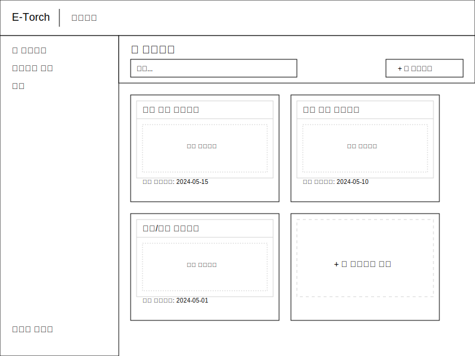
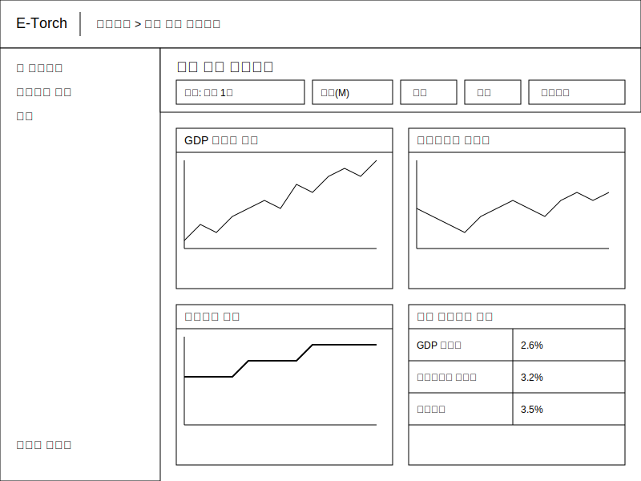
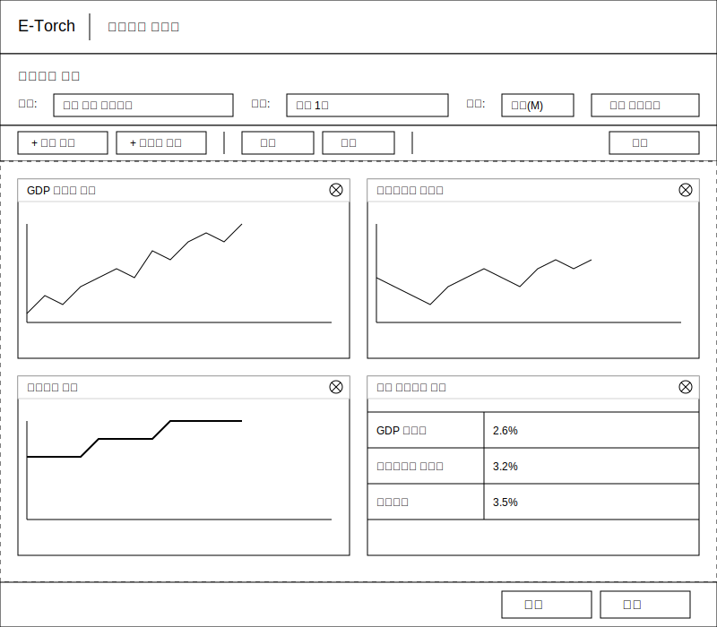
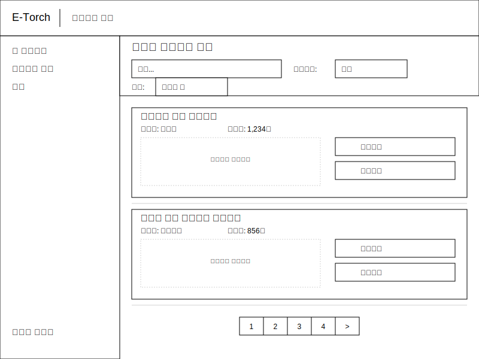
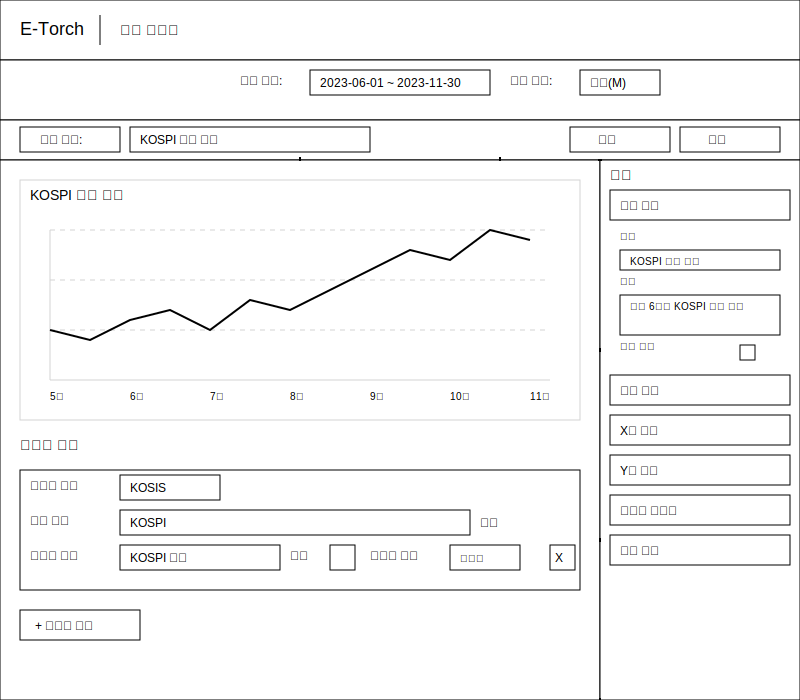
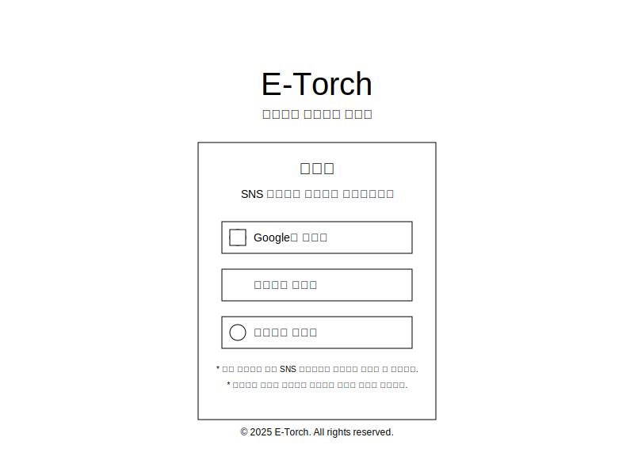
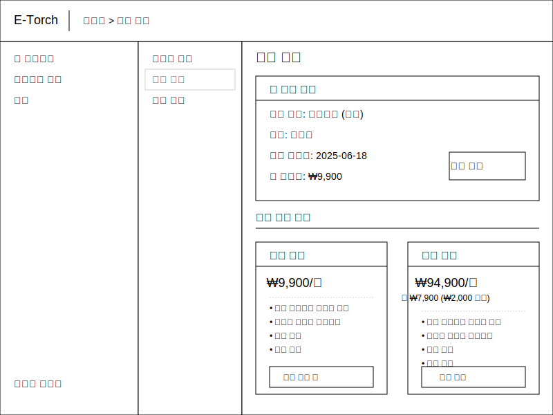

# E-Torch 와이어프레임

이 디렉토리는 E-Torch 경제지표 대시보드 서비스의 UI/UX 설계를 위한 와이어프레임을 포함하고 있습니다.

## 대시보드 관련 화면

### 대시보드 목록

### 대시보드 상세 보기

### 대시보드 편집기

### 대시보드 탐색

## 차트 관련 화면

### 차트 에디터

## 사용자 관련 화면

### 로그인

### 구독 관리

## 관련 문서

- [디자인 시스템](../design-system.md)
- [사용자 흐름](../user-flows.md)
- [UI 요구사항 명세](../ui-requirements.md)
- [차트 컴포넌트 기능 명세서](../chart-feature-specs.md)